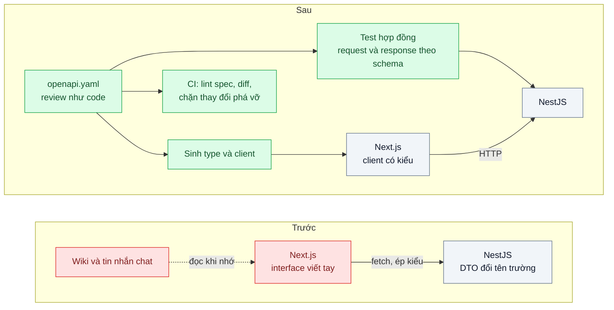
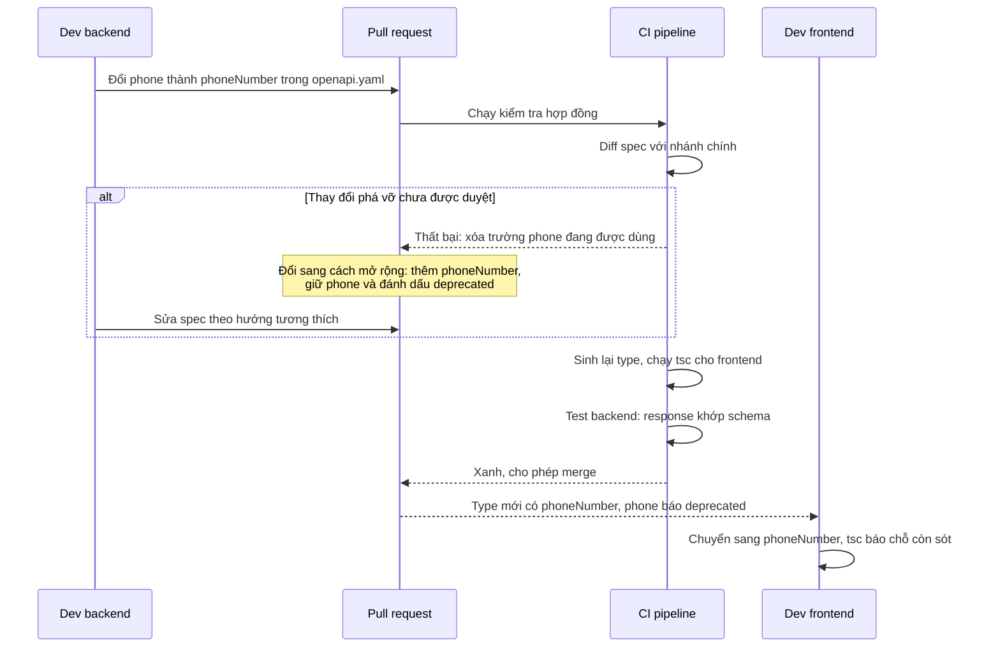

# Contract-First API (OpenAPI) — Frontend gọi sai tên trường, lỗi chỉ lộ khi chạy

| Scope | Mức độ | Trạng thái | Pattern gốc | Cập nhật |
|---|---|---|---|---|
| 01 · frontend / backend / transporter | 🟢 Cơ bản | 📋 Kế hoạch | Contract-First API — OpenAPI Specification 3.1 (OpenAPI Initiative, 2021) | 2026-10-06 |

> **Một câu tóm tắt:** Viết hợp đồng API bằng OpenAPI *trước* khi viết code, rồi từ cùng một file sinh type TypeScript cho frontend và kiểm tra request/response ở backend, để sai tên trường bị chặn lúc build/CI thay vì lúc khách mở màn hình.

## 1. Bài toán thực tế (What)

**Bối cảnh** *(doanh nghiệp giả định, số liệu minh họa)*
Công ty SaaS B2B bán phần mềm CRM cho khoảng 400 doanh nghiệp vừa và nhỏ. Frontend Next.js (4 người) và backend NestJS (5 người) là hai đội riêng, phát hành mỗi tuần. Hợp đồng API nằm rải rác trong wiki và tin nhắn chat; backend dùng `@nestjs/swagger` sinh tài liệu từ code *sau khi* đã merge.

**Triệu chứng người kinh doanh nhìn thấy**
- Màn hình "Chi tiết khách hàng" mất số điện thoại sau một lần phát hành; CSKH nhận khoảng 40 phiếu hỗ trợ trong buổi sáng trước khi có hotfix.
- Mỗi tính năng mới tốn 1–2 ngày "ghép nối": frontend chờ backend xong mới biết hình dạng dữ liệu.
- Mỗi sprint có 3–5 lỗi kiểu "undefined" trên giao diện, đều do lệch tên trường hoặc kiểu dữ liệu.

**Nguyên nhân kỹ thuật**
Backend đổi `phone` thành `phoneNumber` trong DTO; tài liệu Swagger tự cập nhật nhưng không ai đọc lại. Frontend khai báo type bằng tay (`interface Customer { phone: string }`) và ép kiểu kết quả `fetch`, nên TypeScript không phát hiện gì. Lỗi chỉ lộ trên trình duyệt người dùng. Không có bước nào trong CI so sánh "backend trả gì" với "frontend chờ gì".

**Ràng buộc**
- Giữ Next.js và NestJS; không viết lại toàn bộ API hiện có trong một lần.
- App di động của đối tác cũng gọi một phần API: hợp đồng phải dùng được bởi công cụ ngoài hệ sinh thái TypeScript.
- Các bước thêm vào CI không được làm pipeline chậm quá vài chục giây.

## 2. Vì sao dùng pattern này (Why)

**Nguyên nhân gốc mà pattern nhắm vào:** hợp đồng giữa hai đội không phải là một tạo tác máy đọc được và được kiểm tra tự động; nó là "hiểu biết chung" trôi dần theo thời gian.

**Pattern giải quyết thế nào:** Contract-first đảo thứ tự làm việc: file `openapi.yaml` (OpenAPI 3.1, mô tả dữ liệu bằng JSON Schema) được viết và review như code *trước* khi cài đặt. Từ một file đó: (1) frontend sinh type và client có kiểu, nên truy cập `customer.phone` không tồn tại là lỗi biên dịch; (2) backend kiểm tra request đầu vào và response trong test theo schema, lệch hợp đồng thành test đỏ; (3) CI so sánh spec mới với spec trên nhánh chính và chặn thay đổi phá vỡ (xóa trường, đổi kiểu) chưa được duyệt. Trong lúc backend cài đặt, frontend làm song song với mock server sinh từ spec.

**Lựa chọn khác đã cân nhắc**

| Lựa chọn | Giải quyết được gì | Vì sao không chọn (ở bài này) |
|---|---|---|
| Giữ nguyên + tối ưu nhỏ (code-first `@nestjs/swagger`, nhắc nhau đọc tài liệu) | Có tài liệu tự sinh, không tốn công viết spec | Spec là sản phẩm phụ của code: thay đổi phá vỡ vẫn lọt vì không có bước so sánh; frontend vẫn viết type tay |
| Code-first + sinh type frontend từ spec tự sinh | Type frontend đúng với backend hiện tại | Hợp đồng chỉ có sau khi backend code xong, không có bước review hợp đồng trước; vẫn cần diff để bắt phá vỡ |
| tRPC (type-safe end-to-end) | Không cần spec, frontend import thẳng type của router | Chỉ hợp khi cả hai phía là TypeScript trong cùng monorepo; app đối tác không dùng được |
| GraphQL schema-first | Hợp đồng chặt, client tự chọn trường | Đổi cả mô hình giao tiếp; xem bài 06 cho bài toán tải thừa dữ liệu |
| Contract-first OpenAPI + sinh type + validate + diff trong CI (chọn) | Bắt lệch hợp đồng ở build/CI, hai đội làm song song, đối tác đọc được | Thêm một file phải bảo trì; cần kỷ luật "sửa spec trước" |

## 3. Thiết kế hệ thống (How)

### 3.1 Kiến trúc trước và sau



### 3.2 Luồng chính: thay đổi phá vỡ bị chặn trước khi tới người dùng



### 3.3 Thành phần và trách nhiệm

| Thành phần | Trách nhiệm | Quyết định thiết kế đáng chú ý |
|---|---|---|
| `openapi.yaml` | Nguồn sự thật duy nhất cho đường dẫn, tham số, schema, mã lỗi | Package riêng trong monorepo; mọi thay đổi qua PR có cả hai đội review |
| Bộ sinh type | Sinh type TypeScript cho frontend từ spec | File sinh ra không sửa tay; CI chạy lại để phát hiện file cũ |
| Client có kiểu | Gọi API với đường dẫn, tham số, kết quả được kiểm tra kiểu | Không còn `fetch` ép kiểu ở tầng gọi API |
| Test hợp đồng phía backend | Kiểm tra request và response theo schema | Kiểm tra response chỉ chạy trong test, không tốn CPU ở production |
| Lint và diff spec | Bắt quy ước đặt tên, thiếu mô tả, thay đổi phá vỡ | Thay đổi phá vỡ cần nhãn duyệt tường minh trên PR |
| Mock server | Trả dữ liệu mẫu theo spec để frontend làm song song | Dữ liệu ví dụ nằm ngay trong spec (`examples`) |

### 3.4 Điểm dễ sai khi triển khai
- **Spec và code trôi nhau trở lại.** Không có test hợp đồng thì spec lại thành tài liệu "cho đẹp". Test hợp đồng là bắt buộc, không phải tùy chọn.
- **Sửa tay file type sinh ra.** Lần sinh sau ghi đè mất; để CI kiểm tra "sinh lại không tạo diff".
- **Quy ước tên lẫn lộn** `camelCase` và `snake_case` giữa các endpoint. Chốt một quy ước theo Microsoft REST API Guidelines và để linter bắt.
- **Nhầm "trường tùy chọn" với "trường bằng null".** OpenAPI 3.1 theo JSON Schema, `null` là một `type`; viết sai thì type sinh ra sai và frontend vẫn gặp `undefined`.
- **Coi mọi thay đổi là phá vỡ** khiến đội tìm cách lách quy trình. Thêm trường tùy chọn ở response là tương thích; xóa, đổi tên, đổi kiểu, thêm trường bắt buộc vào request mới cần duyệt.

## 4. Tech stack và tác động (Impact techstack)

| Lớp | Công nghệ chọn | Vì sao chọn | Thay thế tương đương |
|---|---|---|---|
| Đặc tả | OpenAPI 3.1 (YAML) | Chuẩn mở, dùng JSON Schema; có công cụ đa ngôn ngữ cho app đối tác | TypeSpec sinh ra OpenAPI (cần xác minh); tRPC nếu chỉ có TypeScript |
| Sinh type frontend | `openapi-typescript` + `openapi-fetch` (cần xác minh phiên bản hỗ trợ 3.1) | Chỉ sinh type, client mỏng, gần như không có runtime | Orval, OpenAPI Generator |
| Backend | NestJS 10, TypeScript strict, Node 20+ | Stack mặc định của repo | Fastify với JSON Schema gốc |
| Validate theo spec | Ajv nạp schema từ spec (cần xác minh cách tách schema) | Bộ kiểm tra JSON Schema hỗ trợ draft 2020-12 mà OpenAPI 3.1 dùng | `express-openapi-validator` (cần xác minh hỗ trợ 3.1) |
| Lint spec | Spectral (cần xác minh) | Có sẵn bộ luật OpenAPI, thêm được luật đặt tên riêng | Redocly CLI (cần xác minh) |
| Diff thay đổi phá vỡ | `oasdiff` (cần xác minh) | So sánh hai phiên bản spec, liệt kê thay đổi phá vỡ | openapi-diff (cần xác minh) |
| Mock | Prism (cần xác minh) | Mock server từ spec, trả `examples` | MSW ở phía frontend |
| Monorepo, test | pnpm 10 + Turborepo, Vitest | Spec là package dùng chung; Turborepo chỉ sinh lại khi spec đổi | Nx, Jest |

**Thay đổi so với hệ thống hiện tại:** thêm package `api-contract` chứa spec; frontend bỏ interface viết tay; backend thêm test hợp đồng; CI thêm ba bước (lint, sinh và kiểm tra type, diff). Hai đội phải học viết OpenAPI và giữ thói quen "sửa spec trước, code sau".

## 5. Kết quả đầu ra và cách đo (Output impact)

| Chỉ số | Trước (minh họa) | Mục tiêu khi thực hành | Cách đo |
|---|---|---|---|
| Lỗi lệch hợp đồng lọt tới lúc chạy | 3–5 lỗi mỗi sprint | 0 trong bộ 10 thay đổi phá vỡ cố ý | Script áp lần lượt 10 thay đổi phá vỡ, đếm số lần `tsc` hoặc CI chặn |
| Thời điểm phát hiện sai tên trường | Khi người dùng mở màn hình | Lúc chạy `tsc` hoặc bước diff trong CI | Log CI: bước nào thất bại, thông báo lỗi gì |
| Thời gian các bước hợp đồng trong CI | 0 | ≤ 30 giây | Thời gian từng bước trong log CI, chạy 5 lần lấy trung vị |
| Endpoint có test hợp đồng | 0 % | 100 % endpoint của module thực hành | Báo cáo Vitest, mỗi endpoint một test hợp đồng |
| Thời gian frontend chờ để bắt đầu | 1–2 ngày | Bắt đầu ngay khi spec được merge | Thời điểm merge spec so với thời điểm màn hình chạy trên mock |

> Số "trước" là minh họa để hình dung bài toán. Số "mục tiêu" chỉ được coi là đạt khi có số đo thật
> ở mục 8 kèm môi trường đo.

**Tác động nghiệp vụ mong đợi:** ít lỗi giao diện sau phát hành, ít phiếu hỗ trợ sinh ra từ lỗi kỹ thuật, và hai đội giao tính năng song song thay vì nối tiếp.

## 6. Đánh đổi và khi KHÔNG nên dùng

**Đánh đổi**
- Thêm một tạo tác phải bảo trì; viết OpenAPI dài dòng hơn viết DTO.
- Cần kỷ luật quy trình: một lần "sửa code trước, spec sau" là bắt đầu trôi.
- Công cụ quanh OpenAPI 3.1 chưa đồng đều, một số chỉ hỗ trợ 3.0; phải kiểm tra trước khi chọn.

**Không nên dùng khi**
- Frontend và backend là một đội, cùng monorepo TypeScript, không có client ngoài: tRPC cho type-safe với ít công hơn.
- API dùng tạm vài tuần (prototype): chi phí viết spec lớn hơn lợi ích.
- Giao tiếp service với service cần hiệu năng cao: hợp đồng bằng Protocol Buffers hợp hơn (scope 13).

**Liên quan**
- Đọc sau: `../02-cursor-pagination-trang-500-lich-su-giao-dich/` — hình dạng phân trang là một phần của hợp đồng.
- Đọc sau: `../07-api-versioning-app-cu-van-phai-chay/` — khi thay đổi phá vỡ là không tránh được.
- Cùng chủ đề: `../../13-backend-transporter/02-schema-evolution-them-field-lam-sap-consumer-cu/` — tiến hóa schema giữa các service.
- Cùng chủ đề: `../../09-backend-monorepo/01-workspace-sua-shared-lib-phai-mo-12-pr/` — đặt spec thành package dùng chung trong workspace.

## 7. Cơ sở tham khảo

- OpenAPI Initiative, *OpenAPI Specification* 3.1 — https://spec.openapis.org/oas/latest.html — cấu trúc spec, Schema Object dựa trên JSON Schema; nền của toàn bộ bài.
- Microsoft REST API Guidelines — https://github.com/microsoft/api-guidelines — quy ước đặt tên, mã lỗi và định dạng lỗi nhất quán, dùng làm luật lint.
- tRPC docs — https://trpc.io/docs — phương án type-safe end-to-end không cần spec, dùng để so sánh ở mục 2.
- NestJS docs, "OpenAPI" — https://docs.nestjs.com/ — cách tiếp cận code-first hiện tại, để thấy khác biệt với contract-first.

## 8. Kế hoạch thực hành

- [ ] Bước 1: dựng module "khách hàng" tối giản: NestJS trả `GET /customers/{id}`, Next.js hiển thị; frontend viết interface tay để tái hiện triệu chứng.
- [ ] Bước 2: đo "trước": áp 10 thay đổi phá vỡ cố ý vào DTO backend (đổi tên, đổi kiểu, xóa trường), đếm số lỗi `tsc` hoặc CI bắt được (dự đoán 0).
- [ ] Bước 3: viết `openapi.yaml`, sinh type và client cho frontend, thêm test hợp đồng ở backend, thêm lint và diff vào CI.
- [ ] Bước 4: đo "sau" với cùng 10 thay đổi; ghi số lần bị chặn và thời gian các bước CI vào mục 5 kèm môi trường.
- [ ] Bước 5: viết test: (a) response thiếu trường bắt buộc làm test hợp đồng đỏ; (b) xóa trường trong spec làm bước diff đỏ; (c) thêm trường tùy chọn ở response không làm diff đỏ.

**Cấu trúc code dự kiến**
```text
packages/
  api-contract/
    openapi.yaml                    # [PATTERN] nguồn sự thật duy nhất
    generated/schema.d.ts           # sinh tự động, không sửa tay
apps/
  backend/src/customers/customers.controller.ts
  backend/test/customers-contract.test.ts
  web/src/lib/api-client.ts         # client có kiểu dùng type sinh ra
scripts/
  apply-breaking-changes.sh         # 10 thay đổi phá vỡ cố ý để đo
docker-compose.yml                  # PostgreSQL, mock server
```

**Cách chạy** *(điền khi bắt đầu code)*
```bash
docker compose up -d
pnpm install && pnpm test
```
