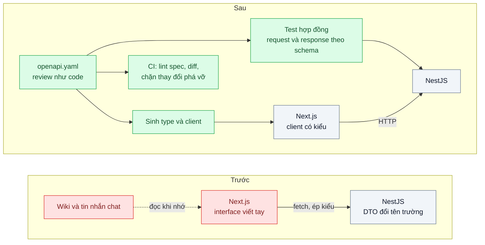
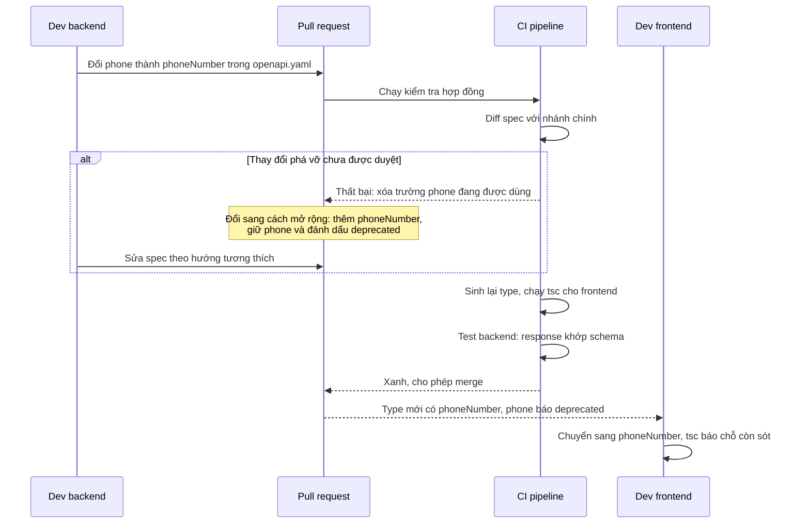

# Contract-First API (OpenAPI) — Frontend gọi sai tên trường, lỗi chỉ lộ khi chạy

| Scope | Mức độ | Trạng thái | Pattern gốc | Cập nhật |
|---|---|---|---|---|
| 01 · frontend / backend / transporter | 🟢 Cơ bản | ✅ Hoàn thành | Contract-First API — OpenAPI Specification 3.1 (OpenAPI Initiative, 2021) | 2026-10-08 |

> **Một câu tóm tắt:** Viết hợp đồng API bằng OpenAPI *trước* khi viết code, rồi từ cùng một file sinh type TypeScript cho frontend và kiểm tra request/response ở backend, để sai tên trường bị chặn lúc build/CI thay vì lúc khách mở màn hình.

## 1. Bài toán thực tế (What)

**Bối cảnh** *(doanh nghiệp giả định, số liệu minh họa)*
Công ty SaaS B2B bán phần mềm CRM cho khoảng 400 doanh nghiệp vừa và nhỏ. Frontend Next.js (4 người) và backend NestJS (5 người) là hai đội riêng, phát hành mỗi tuần. Hợp đồng API nằm rải rác trong wiki và tin nhắn chat; backend dùng `@nestjs/swagger` sinh tài liệu từ code *sau khi* đã merge.

**Triệu chứng người kinh doanh nhìn thấy**
- Màn hình "Chi tiết khách hàng" mất số điện thoại sau một lần phát hành; CSKH nhận khoảng 40 phiếu hỗ trợ trong buổi sáng trước khi có hotfix.
- Mỗi tính năng mới tốn 1–2 ngày "ghép nối": frontend chờ backend xong mới biết hình dạng dữ liệu.
- Mỗi sprint có 3–5 lỗi kiểu "undefined" trên giao diện, đều do lệch tên trường hoặc kiểu dữ liệu.

**Nguyên nhân kỹ thuật**
Backend đổi `phone` thành `phoneNumber` trong DTO; tài liệu Swagger tự cập nhật nhưng không ai đọc lại. Frontend khai báo type bằng tay (`interface Customer { phone: string }`) và ép kiểu kết quả `fetch`, nên TypeScript không phát hiện gì. Lỗi chỉ lộ trên trình duyệt người dùng. Không có bước nào trong CI so sánh "backend trả gì" với "frontend chờ gì".

**Ràng buộc**
- Giữ Next.js và NestJS; không viết lại toàn bộ API hiện có trong một lần.
- App di động của đối tác cũng gọi một phần API: hợp đồng phải dùng được bởi công cụ ngoài hệ sinh thái TypeScript.
- Các bước thêm vào CI không được làm pipeline chậm quá vài chục giây.

## 2. Vì sao dùng pattern này (Why)

**Nguyên nhân gốc mà pattern nhắm vào:** hợp đồng giữa hai đội không phải là một tạo tác máy đọc được và được kiểm tra tự động; nó là "hiểu biết chung" trôi dần theo thời gian.

**Pattern giải quyết thế nào:** Contract-first đảo thứ tự làm việc: file `openapi.yaml` (OpenAPI 3.1, mô tả dữ liệu bằng JSON Schema) được viết và review như code *trước* khi cài đặt. Từ một file đó: (1) frontend sinh type và client có kiểu, nên truy cập `customer.phone` không tồn tại là lỗi biên dịch; (2) backend kiểm tra request đầu vào và response trong test theo schema, lệch hợp đồng thành test đỏ; (3) CI so sánh spec mới với spec trên nhánh chính và chặn thay đổi phá vỡ (xóa trường, đổi kiểu) chưa được duyệt. Trong lúc backend cài đặt, frontend làm song song với mock server sinh từ spec.

**Lựa chọn khác đã cân nhắc**

| Lựa chọn | Giải quyết được gì | Vì sao không chọn (ở bài này) |
|---|---|---|
| Giữ nguyên + tối ưu nhỏ (code-first `@nestjs/swagger`, nhắc nhau đọc tài liệu) | Có tài liệu tự sinh, không tốn công viết spec | Spec là sản phẩm phụ của code: thay đổi phá vỡ vẫn lọt vì không có bước so sánh; frontend vẫn viết type tay |
| Code-first + sinh type frontend từ spec tự sinh | Type frontend đúng với backend hiện tại | Hợp đồng chỉ có sau khi backend code xong, không có bước review hợp đồng trước; vẫn cần diff để bắt phá vỡ |
| tRPC (type-safe end-to-end) | Không cần spec, frontend import thẳng type của router | Chỉ hợp khi cả hai phía là TypeScript trong cùng monorepo; app đối tác không dùng được |
| GraphQL schema-first | Hợp đồng chặt, client tự chọn trường | Đổi cả mô hình giao tiếp; xem bài 06 cho bài toán tải thừa dữ liệu |
| Contract-first OpenAPI + sinh type + validate + diff trong CI (chọn) | Bắt lệch hợp đồng ở build/CI, hai đội làm song song, đối tác đọc được | Thêm một file phải bảo trì; cần kỷ luật "sửa spec trước" |

## 3. Thiết kế hệ thống (How)

### 3.1 Kiến trúc trước và sau



### 3.2 Luồng chính: thay đổi phá vỡ bị chặn trước khi tới người dùng



### 3.3 Thành phần và trách nhiệm

| Thành phần | Trách nhiệm | Quyết định thiết kế đáng chú ý |
|---|---|---|
| `openapi.yaml` | Nguồn sự thật duy nhất cho đường dẫn, tham số, schema, mã lỗi | Package riêng trong monorepo; mọi thay đổi qua PR có cả hai đội review |
| Bộ sinh type | Sinh type TypeScript cho frontend từ spec | File sinh ra không sửa tay; CI chạy lại để phát hiện file cũ |
| Client có kiểu | Gọi API với đường dẫn, tham số, kết quả được kiểm tra kiểu | Không còn `fetch` ép kiểu ở tầng gọi API |
| Test hợp đồng phía backend | Kiểm tra request và response theo schema | Kiểm tra response chỉ chạy trong test, không tốn CPU ở production |
| Lint và diff spec | Bắt quy ước đặt tên, thiếu mô tả, thay đổi phá vỡ | Thay đổi phá vỡ cần nhãn duyệt tường minh trên PR |
| Mock server | Trả dữ liệu mẫu theo spec để frontend làm song song | Dữ liệu ví dụ nằm ngay trong spec (`examples`) |

### 3.4 Điểm dễ sai khi triển khai
- **Spec và code trôi nhau trở lại.** Không có test hợp đồng thì spec lại thành tài liệu "cho đẹp". Test hợp đồng là bắt buộc, không phải tùy chọn.
- **Sửa tay file type sinh ra.** Lần sinh sau ghi đè mất; để CI kiểm tra "sinh lại không tạo diff".
- **Quy ước tên lẫn lộn** `camelCase` và `snake_case` giữa các endpoint. Chốt một quy ước theo Microsoft REST API Guidelines và để linter bắt.
- **Nhầm "trường tùy chọn" với "trường bằng null".** OpenAPI 3.1 theo JSON Schema, `null` là một `type`; viết sai thì type sinh ra sai và frontend vẫn gặp `undefined`.
- **Coi mọi thay đổi là phá vỡ** khiến đội tìm cách lách quy trình. Thêm trường tùy chọn ở response là tương thích; xóa, đổi tên, đổi kiểu, thêm trường bắt buộc vào request mới cần duyệt.

**Gặp thật khi làm lab** (phiên bản ở mục 4):
- **`oasdiff breaking` không có `--fail-on ERR` thì luôn thoát 0**, kể cả khi in ra lỗi phá vỡ. Phép thử âm cho 10/10 thay đổi in lỗi mà vẫn thoát 0, nên bước CI thiếu cờ này xanh nhầm.
- **`tsc` không đủ một mình.** Đổi `createdAt` từ chuỗi sang số giây làm màn hình hiện "Khách từ 21/1/1970", nhưng `tsc` vẫn xanh trên type sinh ra, vì `new Date(...)` nhận cả chuỗi lẫn số. Chỉ bước diff chặn được thay đổi này. Kiểu của trường đổi mà chỗ dùng chấp nhận cả kiểu cũ lẫn kiểu mới thì trình biên dịch không thấy gì.
- **Thêm giá trị enum ở response cũng là phá vỡ.** oasdiff báo lỗi `response-property-enum-value-added`, vì client cũ có thể không xử lý được giá trị mới. Muốn enum được mở rộng thì khai báo `x-extensible-enum` (theo thông báo của oasdiff; lab không thử).
- **Luật Spectral kiểm `$ref` phải đặt `resolved: false`.** Spectral lint trên bản spec đã phân giải `$ref`, nên luật "response lỗi phải dùng `components/responses`" báo sai ở chính `components.responses`.
- **Ajv nạp nguyên file spec** cần ba thứ: `ajv/dist/2020` (draft 2020-12), `addVocabulary` cho các khóa gốc của OpenAPI (thiếu thì lỗi `strict mode: unknown keyword: "openapi"`), và `ajv-formats` (thiếu thì lỗi `unknown format "email"`). Không cần chép schema ra file riêng: tham chiếu thẳng tới nút `schema` trong spec bằng JSON Pointer.
- **Ajv mặc định chấp nhận trường thừa.** `Customer` trong lab không có trường tùy chọn, nên cả 10 thay đổi đều chạm trường bắt buộc và test hợp đồng bắt được. Đổi tên một trường *tùy chọn* ở response thì test hợp đồng vẫn xanh, vì JSON Schema không cấm trường lạ khi không có `additionalProperties: false` (suy từ đặc tả, lab không đo). Khi đó chỉ diff và `tsc` bắt được.
- **Mock chỉ "thật" khi spec có ví dụ.** Prism lấy giá trị từ `examples` của schema; trường không có ví dụ nhận giá trị giữ chỗ (`"string"`, `0`, `user@example.com`).

## 4. Tech stack và tác động (Impact techstack)

| Lớp | Công nghệ chọn | Vì sao chọn | Thay thế tương đương |
|---|---|---|---|
| Đặc tả | OpenAPI 3.1 (YAML) | Chuẩn mở, dùng JSON Schema; có công cụ đa ngôn ngữ cho app đối tác | TypeSpec sinh ra OpenAPI (cần xác minh, lab không thử); tRPC nếu chỉ có TypeScript |
| Sinh type frontend | `openapi-typescript` 7.13.0 + `openapi-fetch` 0.17.0 (đã kiểm với spec `openapi: 3.1.0`: `type: [string, "null"]` sinh ra `string \| null`, `examples` dạng mảng thành `@example`) | Chỉ sinh type, client mỏng, gần như không có runtime | Orval, OpenAPI Generator (lab không thử) |
| Backend | NestJS 10.4.22, TypeScript 5.9.3 strict, Node 20.19.6 | Stack mặc định của repo | Fastify với JSON Schema gốc |
| Validate theo spec | Ajv 8.20.0 (`ajv/dist/2020`, draft 2020-12) + `ajv-formats` 3.0.1, nạp cả file spec bằng `addSchema` rồi tham chiếu JSON Pointer tới từng nút `schema` (đã kiểm, mục 3.4) | Bộ kiểm tra JSON Schema hỗ trợ draft 2020-12 mà OpenAPI 3.1 dùng | `express-openapi-validator` (cần xác minh hỗ trợ 3.1, lab không thử) |
| Lint spec | Spectral CLI 6.16.3, bộ luật `spectral:oas` + 2 luật riêng (đã kiểm: cùng file mà khai báo `3.0.3` thì `oas3-schema` báo lỗi ở `type` dạng mảng và `examples`; khai báo `3.1.0` thì sạch) | Có sẵn bộ luật OpenAPI, thêm được luật đặt tên riêng | Redocly CLI (cần xác minh) |
| Diff thay đổi phá vỡ | oasdiff v1.33.0, image `tufin/oasdiff:v1.33.0` chạy bằng `docker run` (đã kiểm: bắt được `type` dạng mảng của 3.1, ví dụ "became nullable") | So sánh hai phiên bản spec, liệt kê thay đổi phá vỡ | openapi-diff (cần xác minh) |
| Mock | Prism 5.14.2 (đã kiểm: chạy spec 3.1, trả `examples`, kiểm request) | Mock server từ spec, trả `examples` | MSW ở phía frontend |
| Monorepo, test | Một project pnpm 10.32.0 chia thư mục `packages/` + `apps/` (không workspace, không Turborepo); Vitest 5.0.3 | Spec là package dùng chung; Turborepo chỉ sinh lại khi spec đổi | Nx, Jest |

**Khi thực hành** (2026-10-08). Mọi phiên bản ghim chính xác trong `package.json`, có `pnpm-lock.yaml`.
- **Chọn phiên bản theo Node 20.** Bản mới nhất của Spectral CLI (6.17.0) đòi Node `^22 || >=24`; Prism 5.15.x đòi Node ≥ 24.14 và 5.16.0 đòi ≥ 24.18 (đọc `engines` trên registry). Lab ghim Spectral 6.16.3 (`>=20.17`) và Prism 5.14.2 (`>=18.20.1`). oasdiff không có trên npm: lab chạy image Docker ghim tag (digest `sha256:6263a96d…`, có bản arm64), không cài gì lên máy.
- **Lệch kế hoạch: không có `docker-compose.yml`, không có PostgreSQL.** Pattern nằm ở hợp đồng giữa hai đội, không ở tầng lưu trữ. Dữ liệu là 3 khách hàng trong bộ nhớ (`apps/backend/src/shared/customer-store.ts`, tên cột kiểu DB khác tên trường API). Mock server Prism là một tiến trình Node (cổng 3101), không cần container. Theo nhật ký quyết định (bài 04/03 điểm 1), "Cách chạy" bắt đầu từ `pnpm install`. Docker chỉ dùng cho `docker run --rm` oasdiff.
- **Lệch kế hoạch: không dựng Next.js.** Web là client có kiểu cùng màn hình "Chi tiết khách hàng" viết bằng React 19.3.0 (TSX), render bằng `react-dom/server` trong test và script đo. Triệu chứng (mất số điện thoại, lỗi `undefined`) nằm ở type và dữ liệu, không ở router hay cách build. Next.js sẽ thêm thời gian build mà không đổi chỉ số nào.
- **Lệch kế hoạch: một project thay cho workspace + Turborepo.** Thư mục giữ đúng ranh giới `packages/api-contract` / `apps/backend` / `apps/web`; hai app chỉ import package hợp đồng, không import lẫn nhau. Việc chỉ sinh lại khi spec đổi (cache của Turborepo) là chủ đề của scope 09. Ở đây cả 4 bước hợp đồng tốn khoảng 3,7 giây (mục 5.1).
- **Backend bản sau** kiểm request lúc chạy bằng chính validator nạp từ spec (`apps/backend/src/sau/contract.ts`): `400` cho body sai, `limit` ngoài 1–50. Mọi lỗi trả về theo `ErrorResponse` (`{ error: { code, message, details } }`, Microsoft REST API Guidelines). Response chỉ kiểm trong test hợp đồng. Presenter của backend vẫn viết tay, không dùng type sinh ra, để test hợp đồng là lớp bắt chỗ code trôi khỏi spec như mục 3.3. Dùng type sinh ra cả ở backend sẽ thêm một lớp nữa (lab không đo). `generated/schema.d.ts` **được commit**, để web biên dịch được ngay sau khi clone. Đổi lại, test `generated-fresh` sinh lại từ spec và so từng byte với file đã commit.

**Thay đổi so với hệ thống hiện tại:** thêm package `api-contract` chứa spec; frontend bỏ interface viết tay; backend thêm test hợp đồng; CI thêm ba bước (lint, sinh và kiểm tra type, diff). Hai đội phải học viết OpenAPI và giữ thói quen "sửa spec trước, code sau".

## 5. Kết quả đầu ra và cách đo (Output impact)

| Chỉ số | Trước (minh họa) | Mục tiêu khi thực hành | Cách đo |
|---|---|---|---|
| Lỗi lệch hợp đồng lọt tới lúc chạy | 3–5 lỗi mỗi sprint | 0 trong bộ 10 thay đổi phá vỡ cố ý | Script áp lần lượt 10 thay đổi phá vỡ, đếm số lần `tsc` hoặc CI chặn |
| Thời điểm phát hiện sai tên trường | Khi người dùng mở màn hình | Lúc chạy `tsc` hoặc bước diff trong CI | Log CI: bước nào thất bại, thông báo lỗi gì |
| Thời gian các bước hợp đồng trong CI | 0 | ≤ 30 giây | Thời gian từng bước trong log CI, chạy 5 lần lấy trung vị |
| Endpoint có test hợp đồng | 0 % | 100 % endpoint của module thực hành | Báo cáo Vitest, mỗi endpoint một test hợp đồng |
| Thời gian frontend chờ để bắt đầu | 1–2 ngày | Bắt đầu ngay khi spec được merge | Thời điểm merge spec so với thời điểm màn hình chạy trên mock |

> Số "trước" là minh họa để hình dung bài toán. Số "mục tiêu" chỉ được coi là đạt khi có số đo thật
> ở mục 8 kèm môi trường đo.

**Tác động nghiệp vụ mong đợi:** ít lỗi giao diện sau phát hành, ít phiếu hỗ trợ sinh ra từ lỗi kỹ thuật, và hai đội giao tính năng song song thay vì nối tiếp.

### 5.1 Số đã đo

**Môi trường** *(đã đo, 2026-10-08, 20:32 – 20:38)*: MacBook Apple M1 Pro (8 nhân, 16 GB), macOS 26.6.2, nắp mở. Mọi lượt chính chạy **pin** (máy rời sạc lúc khoảng 20:30, trước lượt chính; không lượt nào đổi nguồn giữa chừng). Load 1 phút của macOS 4,9 – 9,7, do ứng dụng khác của người dùng và container MySQL, RabbitMQ của dự án khác. Có `caffeinate -ims` suốt phiên. Node v20.19.6, pnpm 10.32.0, TypeScript 5.9.3, Vitest 5.0.3, NestJS 10.4.22, React 19.3.0, openapi-typescript 7.13.0, openapi-fetch 0.17.0, Ajv 8.20.0, ajv-formats 3.0.1, Spectral CLI 6.16.3, Prism 5.14.2, oasdiff v1.33.0 (Docker 28.5.1, image đã kéo sẵn). Spec gồm 3 operation, 6 cặp operation–status, 6 schema. Số thô ở `bench/results/main/` (không commit): `drills/summary.json` và `drills/change-NN-*.json`, `negative/negative.json`, `ci-timing.json`, `mock-start.json`.

**10 thay đổi phá vỡ cố ý** (`bench/breaking-drills.ts`, `drills/summary.json`, 20:32:53 – 20:34:40). Mỗi thay đổi sửa mã nguồn thật (`bench/changes.ts`), chạy các bước CI của từng bản, rồi khôi phục. Cuối lượt, script so lại nội dung mọi file đã chạm: 0 file sót.
- **Trước:** dev backend sửa DTO và sửa luôn test của mình cho khớp. CI hiện tại gồm `tsc` và test của backend. "Màn hình" là `bench/runtime-probe.ts`: dựng backend, web gọi API, render màn hình chi tiết `cus_001` và gửi form "Thêm khách hàng", rồi so với lần chạy khi chưa đổi gì.
- **Sau A:** dev chỉ sửa code backend, quên sửa spec.
- **Sau B:** dev sửa spec và code backend cho khớp nhau, đúng quy trình, nhưng thay đổi vẫn phá vỡ.

Bản sau chạy 4 bước: lint, generate + `tsc`, test hợp đồng, diff với bản spec trước khi đổi.

| # | Thay đổi | Trước: CI | Trước: người dùng thấy | Sau A: bước đỏ | Sau B: bước đỏ | Luật oasdiff (B) |
|---|---|---|---|---|---|---|
| 1 | `phone` → `phoneNumber` | xanh | "Chưa có số điện thoại" dù khách có số | test hợp đồng | `tsc`, diff | `response-required-property-removed` |
| 2 | bỏ `email` | xanh | email trống | test hợp đồng | `tsc`, diff | `response-required-property-removed` |
| 3 | `tags` mảng → chuỗi | xanh | màn hình lỗi `customer.tags.map is not a function` | test hợp đồng | `tsc`, diff | `response-property-type-changed` |
| 4 | enum `tier` viết hoa | xanh | "Hạng" trống nhãn | test hợp đồng | `tsc`, diff | `response-property-enum-value-added`, `request-property-enum-value-removed` |
| 5 | `address.city` → `province` | xanh | địa chỉ mất tỉnh/thành; form tạo trả 400 | test hợp đồng | `tsc`, diff | `response-required-property-removed`, `new-required-request-property`, `request-property-removed` |
| 6 | `name` có thể `null` | xanh | màn hình lỗi `Cannot read properties of null (reading 'split')` | test hợp đồng | `tsc`, diff | `response-property-became-nullable` |
| 7 | `createdAt` → số giây Unix | xanh | "Khách từ 21/1/1970" | test hợp đồng | **chỉ diff** | `response-property-type-changed` |
| 8 | chi tiết bọc trong `{ data }` | xanh | màn hình lỗi `Cannot read properties of undefined (reading 'split')` | test hợp đồng | `tsc`, diff | `response-required-property-removed` |
| 9 | request tạo bắt buộc `taxCode` | xanh | form "Thêm khách hàng" trả 400 | test hợp đồng | `tsc`, diff | `new-required-request-property` |
| 10 | `/customers` → `/clients` | xanh | chi tiết và form đều 404 | test hợp đồng | `tsc`, diff | `api-path-removed-without-deprecation` |
| | **Bị chặn trước khi tới người dùng** | **0/10** | lỗi tới người dùng **10/10** | **10/10** | **10/10** | |

- Theo lớp, ở sau A: test hợp đồng 10/10, `tsc` 0/10, lint 0/10, diff 0/10. Spec không đổi nên ba bước sau không có gì để bắt.
- Theo lớp, ở sau B: diff 10/10, `tsc` 9/10, test hợp đồng 0/10, lint 0/10. Test hợp đồng xanh là đúng: code khớp spec mới. Lint xanh vì không thay đổi nào vi phạm quy ước tên.
- **Đỏ đúng chỗ, 10/10 ở mọi lớp đã đỏ.** Ở B, `tsc` chỉ báo lỗi trong `apps/web/` (hoặc test dùng type đó), không lỗi nào ở `apps/backend/`. Ví dụ: `customer-detail.tsx:13 TS2339` ở #1, `api-client.ts:21 TS2741` (thiếu `taxCode` trong body) ở #9, `api-client.ts:31 TS2345` (đường dẫn không có trong `paths`) ở #10. Output oasdiff nhắc đúng trường hay đường dẫn đã đổi. Ở A, case hợp đồng của operation bị ảnh hưởng đỏ (`getCustomer 200`, hoặc `createCustomer 201` ở #9).
- `tsc` của bản trước mất 1,4 – 2,1 s mỗi lượt; test backend bản trước 0,7 – 0,9 s. Cả hai xanh ở cả 10 thay đổi.

**Phép thử âm: gỡ hoặc phá từng lớp** (`bench/negative-drills.ts`, `negative/negative.json`, 20:35, chạy lại đúng 10 thay đổi):

| Lớp bị gỡ / phá | Kết quả | Có lớp |
|---|---|---|
| Ajv không kiểm schema nữa, chỉ còn so status (sau A) | test hợp đồng đỏ **2/10** (#9 trả 400, #10 trả 404); mỗi lượt vẫn chạy đủ 7 test | 10/10 |
| Bỏ bước generate, giữ `schema.d.ts` cũ (sau B) | `tsc` đỏ **0/10**; bước kiểm "sinh lại không tạo khác biệt" đỏ 10/10 | `tsc` 9/10 |
| oasdiff không có `--fail-on ERR` (sau B) | thoát mã 0 ở **10/10**, dù in lỗi ở 10/10 | thoát ≠ 0 ở 10/10 |
| Spectral chỉ dùng `spectral:oas`, bỏ luật camelCase (thêm trường `credit_limit`) | thoát 0 | thoát 1, chỉ ra `components.schemas.Customer.properties.credit_limit` |
| Web dùng interface viết tay (bản trước) | `tsc` đỏ 0/10 (bảng trên) | 9/10 |

**Thời gian các bước hợp đồng của CI** (`bench/ci-timing.ts`, `ci-timing.json`: 1 vòng làm nóng không tính, 5 vòng đo, spec không đổi; pin, load 8,3 – 9,7):

| Bước | Trung vị (thấp nhất – cao nhất) |
|---|---|
| Lint (Spectral) | 648 ms (636 – 665) |
| Generate (openapi-typescript) | 565 ms (532 – 865) |
| `tsc --noEmit` cả lab (backend, web, test, script đo) | 1.342 ms (1.312 – 1.557) |
| Test hợp đồng (Vitest, 7 test) | 812 ms (788 – 823) |
| Diff (`docker run` oasdiff, image có sẵn) | 288 ms (253 – 412) |
| **Tổng** | **3.668 ms** (3.591 – 4.274) |

**Frontend bắt đầu trên mock** (`bench/mock-start.ts`, `mock-start.json`, 5 vòng). Từ lúc chạy `prism mock` tới khi màn hình "Chi tiết khách hàng" render dữ liệu từ `examples`: trung vị 1.001 ms (945 – 1.796; vòng đầu chậm nhất). Riêng tới lúc Prism nghe cổng: 966 ms. Không cần dòng code backend nào. Test `mock-server` cũng kiểm Prism trả 400 cho body thiếu trường bắt buộc.

**Đối chiếu mục tiêu ở bảng mục 5**
- Lỗi lệch hợp đồng lọt tới lúc chạy: 0/10 ở cả A và B, so với 10/10 ở bản trước. **Đạt.**
- Thời điểm phát hiện: lúc `tsc` (web) hoặc ở bước test hợp đồng / diff của CI, khoảng 3,7 s sau khi chạy CI, thay vì lúc người dùng mở màn hình. **Đạt.**
- Thời gian các bước hợp đồng trong CI ≤ 30 s: 3,7 s. **Đạt** ở quy mô lab (1 spec, 3 operation); spec thật lớn hơn thì `tsc` và test hợp đồng tăng theo, chưa đo.
- Endpoint có test hợp đồng: 3/3 operation, 6/6 cặp operation–status. Test "mọi operation và mọi status khai báo trong spec đều có test hợp đồng" đỏ khi spec thêm operation mà chưa có case. **Đạt.**
- Thời gian frontend chờ để bắt đầu: phần kỹ thuật đo được là khoảng 1 s từ spec tới màn hình chạy trên mock. Con số "1–2 ngày" là chuyện quy trình giữa hai đội, lab không đo được. **Đạt phần đo được; phần quy trình chưa đo.**

**Hạn chế:** 10 thay đổi do người viết lab chọn, và cách web dùng từng trường (ví dụ `new Date(createdAt)`) quyết định `tsc` có bắt được hay không. Số "x/10" vì vậy nói về bộ thay đổi này, không phải tỉ lệ chung. Mọi lượt chạy pin với load 5 – 10. Thời gian là của một spec nhỏ trên laptop, không phải runner CI. Lab không đo chi phí bảo trì spec hay thời gian review PR.

**Chạy lại từ đầu** (20:43, Node 20.19.6, sau khi xóa `node_modules` và `.tmp/`): `pnpm install --frozen-lockfile`, `pnpm typecheck`, `pnpm test` (31/31) và `pnpm contract:ci` đều xanh. `RUN=recheck ONLY=1,7 pnpm bench:drills` cho cùng kết quả với lượt chính ở #1 và #7 (`bench/results/recheck/`). `node scripts/kiem-chung-lab.mjs` cũng xanh (31/31). Script này chạy lệnh trong login shell `zsh -lc`, nơi `node` trên máy này là `/opt/homebrew/bin/node` v25.7.0, không phải Node 20 của nvm. Số đo ở trên là của Node 20.19.6.

## 6. Đánh đổi và khi KHÔNG nên dùng

**Đánh đổi**
- Thêm một tạo tác phải bảo trì; viết OpenAPI dài dòng hơn viết DTO.
- Cần kỷ luật quy trình: một lần "sửa code trước, spec sau" là bắt đầu trôi.
- Công cụ quanh OpenAPI 3.1 chưa đồng đều, một số chỉ hỗ trợ 3.0; phải kiểm tra trước khi chọn. Trong lab, cả năm công cụ đã chọn đều xử lý được các tính năng 3.1 mà spec dùng (mục 4). Ràng buộc gặp thật lại là phiên bản Node: bản mới của Spectral và Prism đòi Node 22 – 24, nên dự án còn ở Node 20 phải ghim bản cũ hơn.
- Cần nhiều lớp chặn, mỗi lớp bắt một loại lỗi: test hợp đồng bắt code trôi khỏi spec, diff bắt spec đổi theo hướng phá vỡ, `tsc` trên type sinh ra chỉ ra chỗ web phải sửa nhưng bỏ sót thay đổi kiểu mà chỗ dùng vẫn chấp nhận (mục 5.1, thay đổi #7). Bỏ một lớp là có loại thay đổi lọt.

**Không nên dùng khi**
- Frontend và backend là một đội, cùng monorepo TypeScript, không có client ngoài: tRPC cho type-safe với ít công hơn.
- API dùng tạm vài tuần (prototype): chi phí viết spec lớn hơn lợi ích.
- Giao tiếp service với service cần hiệu năng cao: hợp đồng bằng Protocol Buffers hợp hơn (scope 13).

**Liên quan**
- Đọc sau: `../02-cursor-pagination-trang-500-lich-su-giao-dich/` — hình dạng phân trang là một phần của hợp đồng.
- Đọc sau: `../07-api-versioning-app-cu-van-phai-chay/` — khi thay đổi phá vỡ là không tránh được.
- Cùng chủ đề: `../../13-backend-transporter/02-schema-evolution-them-field-lam-sap-consumer-cu/` — tiến hóa schema giữa các service.
- Cùng chủ đề: `../../09-backend-monorepo/01-workspace-sua-shared-lib-phai-mo-12-pr/` — đặt spec thành package dùng chung trong workspace.

## 7. Cơ sở tham khảo

- OpenAPI Initiative, *OpenAPI Specification* 3.1 — https://spec.openapis.org/oas/latest.html — cấu trúc spec, Schema Object dựa trên JSON Schema; nền của toàn bộ bài.
- Microsoft REST API Guidelines — https://github.com/microsoft/api-guidelines — quy ước đặt tên, mã lỗi và định dạng lỗi nhất quán, dùng làm luật lint.
- tRPC docs — https://trpc.io/docs — phương án type-safe end-to-end không cần spec, dùng để so sánh ở mục 2.
- NestJS docs, "OpenAPI" — https://docs.nestjs.com/ — cách tiếp cận code-first hiện tại, để thấy khác biệt với contract-first.
- JSON Schema — https://json-schema.org/ — draft 2020-12 mà Schema Object của OpenAPI 3.1 dùng (`type` dạng mảng có `"null"`, `examples`), cũng là thứ Ajv kiểm.
- Tài liệu chính thức của công cụ dùng trong lab (hành vi ở mục 3.4, 4, 5.1 là kết quả chạy thật, không chép từ tài liệu): openapi-typescript / openapi-fetch https://openapi-ts.dev/ · Ajv https://ajv.js.org/ · Spectral https://github.com/stoplightio/spectral · Prism https://github.com/stoplightio/prism · oasdiff https://github.com/oasdiff/oasdiff.

## 8. Kế hoạch thực hành

- [x] Bước 1: dựng module "khách hàng" tối giản: NestJS trả `GET /customers/{customerId}`, `GET /customers`, `POST /customers`. Web (React, không Next.js, mục 4) hiển thị màn hình chi tiết và gửi form "Thêm khách hàng". Bản trước viết interface tay và `fetch` ép kiểu để tái hiện triệu chứng (`test/web-screen.test.ts`: backend đổi `phone` thành `phoneNumber`, màn hình báo "Chưa có số điện thoại" mà không có lỗi nào).
- [x] Bước 2: đo "trước": áp 10 thay đổi phá vỡ cố ý vào DTO/controller của backend (đổi tên, đổi kiểu, xóa trường, enum, nullable, bọc response, trường bắt buộc mới ở request, đổi đường dẫn). Dự đoán `tsc` và CI bắt được 0; đo được 0/10, trong khi người dùng gặp lỗi ở 10/10 (mục 5.1).
- [x] Bước 3: viết `openapi.yaml` (3.1.0), sinh type + client (`openapi-typescript`, `openapi-fetch`), backend kiểm request theo spec, viết test hợp đồng, thêm lint (Spectral) và diff (oasdiff). Bốn bước gom trong `pnpm contract:ci`.
- [x] Bước 4: đo "sau" với cùng 10 thay đổi, ở hai biến thể (A: quên sửa spec; B: sửa spec cho khớp): 10/10 bị chặn ở cả hai. Thời gian 4 bước CI có trung vị 3,7 s. Số và môi trường ở mục 5.1.
- [x] Bước 5: viết test: (a) response thiếu trường bắt buộc làm test hợp đồng đỏ (`test/contract-catches-drift.test.ts`); (b) xóa trường trong spec làm bước diff đỏ; (c) thêm trường tùy chọn ở response không làm diff đỏ (`test/spec-diff.test.ts`). Thêm các test: đổi tên theo hướng mở rộng (deprecated) không đỏ, thiếu `--fail-on` thì oasdiff thoát 0, lint bắt snake_case, `schema.d.ts` khớp spec, mock Prism chạy được màn hình. Có 4 phép thử âm (mục 5.1).

**Cấu trúc code**
```text
packages/api-contract/
  openapi.yaml                       # [PATTERN] nguồn sự thật duy nhất (OpenAPI 3.1.0)
  generated/schema.d.ts              # sinh bằng `pnpm contract:gen`, commit; test generated-fresh kiểm nó khớp spec
  index.ts                           # [PATTERN] Ajv 2020 nạp nguyên spec, kiểm request/param/response theo operationId
  .spectral.yaml                     # spectral:oas + luật camelCase + luật "lỗi dùng ErrorResponse"
  ci/steps.ts                        # 4 bước CI: lint, generate + tsc, test hợp đồng, diff (oasdiff qua docker run)
apps/backend/src/
  shared/customer-store.ts           # 3 khách hàng trong bộ nhớ, dùng chung hai bản
  truoc/                             # code-first: DTO viết tay, kiểm tra tay, lỗi mặc định của NestJS
  sau/                               # contract.ts: kiểm request theo spec + ErrorResponse; presenter; controller
  main.ts                            # `pnpm api` (VARIANT=truoc|sau), cổng 3100
apps/web/src/
  truoc/                             # interface viết tay, fetch ép kiểu, màn hình chi tiết
  sau/                               # [PATTERN] client openapi-fetch, type sinh ra, màn hình chi tiết
  shared/new-customer-form.ts        # trạng thái form, định dạng hiển thị
test/                                # 8 file, 31 test; support/: app.ts (DI override), contract-cases.ts, render.ts, spec-edit.ts
bench/
  changes.ts                         # 10 thay đổi phá vỡ: bộ sửa cho bản trước, code bản sau, spec
  breaking-drills.ts, runtime-probe.ts   # chỉ số chính x/10 + "người dùng thấy gì"
  negative-drills.ts, ci-timing.ts, mock-start.ts, contract-ci.ts, lib.ts
```

**Cách chạy** (không có `docker-compose.yml`: lab không có dịch vụ chạy nền; cần Docker đang chạy cho oasdiff)
```bash
cd 01-frontend-backend-transporter/01-contract-first-openapi-frontend-goi-sai-ten-truong
docker pull tufin/oasdiff:v1.33.0  # một lần; bước diff và test spec-diff chạy `docker run --rm` image này
pnpm install
pnpm typecheck
pnpm test                          # 31 test, khoảng 5 s; Prism dùng cổng 3101 trong lúc test
pnpm contract:ci                   # 4 bước hợp đồng như CI; diff với spec ở git HEAD (chưa commit thì so với chính nó)
pnpm contract:ci path/base.yaml    # diff với một spec "nhánh chính" bất kỳ; BREAKING_APPROVED=1 để không làm đỏ khi đã duyệt
# Chạy tay (mỗi lệnh một terminal, dừng bằng Ctrl+C)
pnpm api                           # backend bản sau ở http://127.0.0.1:3100 (VARIANT=truoc pnpm api cho bản trước)
pnpm mock                          # mock Prism từ spec ở http://127.0.0.1:3101
pnpm contract:gen                  # sinh lại generated/schema.d.ts sau khi sửa spec
# Đo (kết quả ở bench/results/$RUN/, không commit; chạy lại thì đổi RUN, không ghi đè main)
RUN=main pnpm bench:drills         # chỉ số chính: 10 thay đổi × (trước, sau A, sau B), khoảng 2 phút
RUN=main pnpm bench:negative       # 4 phép thử âm, khoảng 40 s
RUN=main pnpm bench:ci-time        # thời gian 4 bước CI: 1 vòng làm nóng + 5 vòng (ROUNDS=5)
RUN=main pnpm bench:mock           # từ spec tới màn hình trên mock Prism, 5 vòng
```

Script đo sửa mã nguồn thật rồi khôi phục trong `finally`, kể cả `generated/schema.d.ts`; cuối lượt chúng so lại nội dung và thoát 1 nếu còn file khác. Đừng chạy hai script đo cùng lúc, hay chạy `pnpm test` trong lúc script đo đang chạy, vì chúng sửa cùng file. Sau khi chạy tay, kiểm lại `lsof -nP -iTCP:3100 -sTCP:LISTEN` và cổng 3101.

## Bài học sau khi làm

- **Pattern chặn được đúng loại lỗi của mục 1, nhưng không có lớp nào chặn được một mình.** Bản trước chặn 0/10 thay đổi, trong khi người dùng gặp lỗi ở cả 10. Bản sau chặn 10/10 ở cả hai biến thể. Khi dev quên sửa spec, chỉ test hợp đồng bắt được (10/10). Khi dev sửa spec theo hướng phá vỡ, chỉ diff bắt đủ (10/10); `tsc` trên type sinh ra bắt 9/10, và bỏ sót `createdAt` đổi sang số vì `new Date()` nhận cả hai kiểu. Lint không bắt thay đổi phá vỡ nào: việc của nó là quy ước tên và định dạng lỗi.
- **Phép thử âm cho thấy vài chỗ hỏng mà không ai biết.** Bỏ cờ `--fail-on ERR` của oasdiff thì CI xanh ở 10/10 dù có in lỗi. Quên chạy generate thì `tsc` xanh ở 10/10, và chỉ bước "sinh lại không tạo khác biệt" cứu được. Ajv không kiểm schema thì test hợp đồng chỉ còn bắt được 2 thay đổi làm đổi status.
- **OpenAPI 3.1 dùng được với bộ công cụ trên Node 20**, nếu ghim đúng phiên bản (mục 4). `type: [string, "null"]` đi trọn đường: type sinh ra `string | null`, Ajv chấp nhận `null`, oasdiff báo "became nullable", Prism mock được. Rủi ro thật nằm ở `engines` của bản mới (Spectral 6.17, Prism 5.15+), không ở hỗ trợ 3.1.
- **Contract-first rẻ ở CI.** 4 bước tốn 3,7 s ở quy mô lab, phần lớn là `tsc` (1,3 s). Phần đắt là kỷ luật "sửa spec trước" và việc đội phải đọc, duyệt kết quả diff. Lab không đo được phần này.
- **Lỗi gặp khi làm:** lượt thử đầu tiên của script đo khôi phục file đã sửa nhưng quên `generated/schema.d.ts`. Type sinh từ thay đổi #1 còn lại làm `tsc` của các thay đổi sau đỏ sai chỗ, và bản trước bị tính nhầm là "bị chặn". Hai test dùng DI override lúc đầu phụ thuộc type của presenter, nên `tsc` đỏ ở file test khi script đổi presenter. Đã ép sang `Record<string, unknown>`. Luật Spectral đầu tiên báo sai vì lint trên spec đã phân giải `$ref`. `pnpm contract:ci` lúc đầu ghi danh sách cây thư mục của `git show HEAD:` làm spec gốc khi spec chưa được git theo dõi.
- **Hạn chế:** bộ 10 thay đổi và cách web dùng từng trường do người viết lab chọn. Spec nhỏ (3 operation), dữ liệu trong bộ nhớ, web không phải Next.js. Mọi lượt đo chạy pin với load 5 – 10. Lab chưa thử TypeSpec, Redocly, `express-openapi-validator`, hay type sinh ra dùng cho cả backend. Lab cũng không đo trường hợp đổi tên trường *tùy chọn* (mục 3.4).
