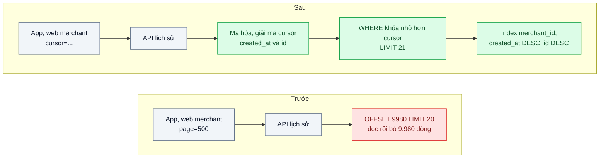
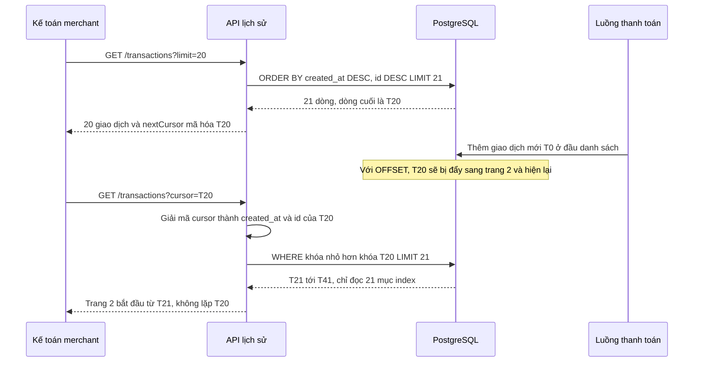

# Cursor-based Pagination — Trang 500 của lịch sử giao dịch mất 6 giây và lặp bản ghi

| Scope | Mức độ | Trạng thái | Pattern gốc | Cập nhật |
|---|---|---|---|---|
| 01 · frontend / backend / transporter | 🟢 Cơ bản | 📋 Kế hoạch | Keyset (Cursor) Pagination — Winand, *Use The Index, Luke*; Slack Engineering (2017) | 2026-10-06 |

> **Một câu tóm tắt:** Thay `OFFSET n` bằng con trỏ "bản ghi cuối cùng tôi đã thấy" để mỗi trang chỉ đọc đúng số dòng cần trả về từ index, nên trang 500 nhanh như trang 1 và không lặp hay sót bản ghi khi có giao dịch mới chen vào.

## 1. Bài toán thực tế (What)

**Bối cảnh** *(doanh nghiệp giả định, số liệu minh họa)*
Ví điện tử có khoảng 3 triệu người dùng và 800 merchant. Bảng `transactions` khoảng 120 triệu dòng. Màn hình "Lịch sử giao dịch" trên web merchant và app dùng API `GET /transactions?page=500&size=20`, backend chạy `ORDER BY created_at DESC LIMIT 20 OFFSET 9980`.

**Triệu chứng người kinh doanh nhìn thấy**
- Kế toán của merchant lớn lật tới trang 500 để đối soát cuối tháng: mỗi trang mất khoảng 6 giây, nhiều người bỏ dở và gọi tổng đài xin file Excel.
- Khi đang lật trang mà có giao dịch mới, cùng một giao dịch xuất hiện ở hai trang liên tiếp; kế toán cộng trùng và báo "lệch tiền".
- Vào giờ đối soát, API lịch sử làm chậm cả API thanh toán vì dùng chung database.

**Nguyên nhân kỹ thuật**
`OFFSET 9980` buộc PostgreSQL đọc và bỏ đi 9.980 dòng trước khi trả 20 dòng; tài liệu PostgreSQL nói rõ các dòng bị `OFFSET` bỏ qua vẫn phải được tính trong server. Chi phí tăng tuyến tính theo số trang. Còn chuyện lặp bản ghi: vị trí "dòng thứ 9.980" là tương đối; một giao dịch mới chèn vào đầu danh sách đẩy mọi dòng lùi một vị trí, nên dòng cuối trang trước trở thành dòng đầu trang sau.

**Ràng buộc**
- App di động bản cũ vẫn gửi `page=`; phải giữ một thời gian song song (xem bài 07).
- Danh sách sắp xếp theo thời gian giảm dần; nhiều giao dịch có thể trùng `created_at`.
- Không thêm hệ thống mới (search engine, cache) chỉ cho màn hình này.

## 2. Vì sao dùng pattern này (Why)

**Nguyên nhân gốc mà pattern nhắm vào:** phân trang theo *vị trí* (bỏ qua n dòng) thay vì theo *giá trị* (lấy các dòng sau giá trị khóa đã thấy).

**Pattern giải quyết thế nào:** Keyset pagination (Winand gọi là "seek method") ghi nhớ giá trị khóa sắp xếp của dòng cuối trang, ví dụ `(created_at, id)`. Trang kế tiếp là `WHERE (created_at, id) < ($last_created_at, $last_id) ORDER BY created_at DESC, id DESC LIMIT 21`. Với index `(merchant_id, created_at DESC, id DESC)`, PostgreSQL nhảy thẳng tới vị trí đó trong B-tree và đọc 21 dòng, bất kể là trang thứ mấy. `id` làm khóa phụ để thứ tự là duy nhất. API không lộ hai giá trị này ra ngoài mà đóng gói thành một chuỗi `cursor` mờ (opaque), giống cách Slack mô tả khi chuyển API sang phân trang bằng cursor: client chỉ biết "đưa lại cursor để lấy trang sau".

**Lựa chọn khác đã cân nhắc**

| Lựa chọn | Giải quyết được gì | Vì sao không chọn (ở bài này) |
|---|---|---|
| Giữ nguyên + tối ưu nhỏ (thêm index, giới hạn tối đa 100 trang) | Trang đầu nhanh hơn | `OFFSET` lớn vẫn phải đọc bỏ; lặp bản ghi vẫn còn; chặn 100 trang làm kế toán không đối soát được |
| Cursor mang số trang mã hóa (`page` giấu trong cursor) | Đổi giao diện API | Chỉ là `OFFSET` đội lốt, không đổi chi phí |
| Snapshot kết quả vào bảng tạm hoặc cache theo phiên | Không lặp bản ghi, nhảy trang tùy ý | Tốn bộ nhớ theo người dùng, phải dọn dẹp; quá tay cho một màn hình |
| Xuất file bất đồng bộ cho đối soát | Đúng nhu cầu kế toán lấy toàn bộ tháng | Bổ trợ tốt (xem bài job nền ở scope 08), nhưng màn hình lật trang vẫn cần nhanh |
| Keyset pagination với cursor mờ (chọn) | Thời gian mỗi trang gần như hằng số, không lặp/sót khi có dữ liệu mới | Mất khả năng "nhảy tới trang 500" và tổng số trang chính xác |

## 3. Thiết kế hệ thống (How)

### 3.1 Kiến trúc trước và sau



### 3.2 Luồng chính

Luồng có giao dịch mới chen vào giữa hai lần lật trang:



### 3.3 Thành phần và trách nhiệm

| Thành phần | Trách nhiệm | Quyết định thiết kế đáng chú ý |
|---|---|---|
| Index phức hợp | Cho phép nhảy thẳng tới vị trí cursor | Cột lọc `merchant_id` đứng đầu, sau đó đúng thứ tự `ORDER BY` |
| Bộ mã hóa cursor | Đóng gói `created_at` và `id` thành chuỗi base64url | Mờ với client để sau này đổi khóa sắp xếp không phá API; có thể ký HMAC để chống sửa |
| Truy vấn seek | So sánh row value `(created_at, id) < (...)` | Lấy `limit + 1` dòng để biết còn trang sau mà không cần `COUNT` |
| Hợp đồng response | Trả `items`, `nextCursor` (null khi hết) | Khai báo trong OpenAPI (bài 01); không trả `totalPages` |
| Lớp tương thích `page=` | Phục vụ app cũ trong giai đoạn chuyển đổi | Giới hạn `page` tối đa và ghi log để biết khi nào gỡ được |

### 3.4 Điểm dễ sai khi triển khai
- **Khóa sắp xếp không duy nhất.** Chỉ dùng `created_at` thì hai giao dịch cùng thời điểm có thể bị sót ở ranh giới trang. Luôn thêm `id` làm khóa phụ.
- **Mất độ chính xác thời gian.** PostgreSQL lưu `timestamptz` tới micro giây, `Date` của JavaScript chỉ tới mili giây. Đưa `created_at` qua `Date` rồi đóng vào cursor sẽ sót hoặc lặp dòng; giữ dạng chuỗi lấy từ DB.
- **Hướng sắp xếp lẫn lộn.** Row value comparison chỉ dùng được index khi các cột cùng chiều; nếu cần `created_at DESC, id ASC` phải viết điều kiện dạng mở rộng `OR` hoặc đổi chiều index.
- **Lọc thêm điều kiện mà index không phủ** (ví dụ theo trạng thái) làm PostgreSQL quét nhiều hơn; kiểm tra bằng `EXPLAIN (ANALYZE, BUFFERS)` cho từng bộ lọc.
- **Cố giữ `totalCount` chính xác.** `COUNT(*)` trên hàng triệu dòng tốn đúng chi phí ta vừa bỏ; dùng "còn trang sau" hoặc số ước lượng.

## 4. Tech stack và tác động (Impact techstack)

| Lớp | Công nghệ chọn | Vì sao chọn | Thay thế tương đương |
|---|---|---|---|
| Database | PostgreSQL 16 | Hỗ trợ row value comparison dùng được B-tree index | MySQL 8 (cú pháp tương tự) |
| Truy cập dữ liệu | Kysely | Viết được điều kiện row value mà vẫn có type; trùng stack của chủ repo | SQL thuần với `pg`, Drizzle |
| API | NestJS 10, TypeScript strict | Stack mặc định | Fastify |
| Frontend | Next.js + TanStack Query `useInfiniteQuery` | Mô hình "trang sau theo con trỏ" khớp sẵn với infinite query | SWR Infinite |
| Seed dữ liệu | Script SQL `generate_series` | Sinh 10–20 triệu dòng nhanh để tái hiện chi phí `OFFSET` | pgbench custom script |
| Đo | `EXPLAIN (ANALYZE, BUFFERS)`, k6 | Thấy số buffer đọc theo trang; đo p95 khi nhiều người lật trang | `pg_stat_statements` |

**Thay đổi so với hệ thống hiện tại:** thêm một index phức hợp, đổi hợp đồng API từ `page` sang `cursor`, frontend chuyển sang infinite list; đội sản phẩm chấp nhận bỏ nút "nhảy tới trang N".

## 5. Kết quả đầu ra và cách đo (Output impact)

| Chỉ số | Trước (minh họa) | Mục tiêu khi thực hành | Cách đo |
|---|---|---|---|
| Thời gian truy vấn trang 500 | 6.000 ms | ≤ 20 ms | `EXPLAIN (ANALYZE, BUFFERS)` trên seed 20 triệu dòng, chạy 5 lần lấy trung vị |
| Buffer đọc cho trang 500 so với trang 1 | gấp vài trăm lần | xấp xỉ bằng nhau | Dòng `Buffers: shared hit/read` trong `EXPLAIN` |
| p95 API khi 50 người lật trang liên tục | 4.500 ms | ≤ 100 ms | k6 kịch bản lật 500 trang mỗi người dùng ảo |
| Số bản ghi lặp khi có insert đồng thời | 3–10 mỗi lần đối soát | 0 | Test: lật toàn bộ danh sách trong khi luồng khác insert, so sánh tập id |

> Số "trước" là minh họa để hình dung bài toán. Số "mục tiêu" chỉ được coi là đạt khi có số đo thật
> ở mục 8 kèm môi trường đo.

**Tác động nghiệp vụ mong đợi:** kế toán đối soát được trên màn hình thay vì gọi tổng đài, hết tình trạng "lệch tiền" do cộng trùng, và giờ đối soát không còn kéo chậm thanh toán.

## 6. Đánh đổi và khi KHÔNG nên dùng

**Đánh đổi**
- Không nhảy tới trang bất kỳ, không có tổng số trang chính xác; giao diện phải thiết kế lại theo "xem thêm".
- Thêm index làm tăng chi phí ghi và dung lượng; phải có index riêng cho mỗi kiểu sắp xếp được hỗ trợ.
- Cursor có thể hết hiệu lực khi đổi khóa sắp xếp; cần quy ước phiên bản cursor.

**Không nên dùng khi**
- Bảng nhỏ (vài nghìn dòng) và người dùng cần nhảy trang tùy ý: `OFFSET` đơn giản hơn và đủ nhanh.
- Kết quả xếp theo điểm liên quan của search engine: dùng cơ chế phân trang riêng của engine (scope 05).
- Nhu cầu thật là lấy toàn bộ dữ liệu một kỳ: một job xuất file phù hợp hơn lật 500 trang.

**Liên quan**
- Đọc trước: `../../02-backend-database/01-n-plus-1-trang-50-don-ban-151-cau-sql/` — đọc `EXPLAIN` và thiết kế index.
- Đọc trước: `../01-contract-first-openapi-frontend-goi-sai-ten-truong/` — mô tả `cursor` và `nextCursor` trong hợp đồng.
- Cùng chủ đề: `../../08-backend-monolith/02-background-job-trong-monolith-xuat-excel-lam-treo-web/` — xuất toàn bộ dữ liệu bằng job nền.
- Đọc sau: `../07-api-versioning-app-cu-van-phai-chay/` — giữ `page=` cho app cũ trong lúc chuyển đổi.

## 7. Cơ sở tham khảo

- Markus Winand, *Use The Index, Luke*, phần "Paging Through Results" — https://use-the-index-luke.com/ — seek method, row values, vì sao `OFFSET` chậm dần và lặp bản ghi.
- Slack Engineering, "Evolving API Pagination at Slack", 2017 — https://slack.engineering/evolving-api-pagination-at-slack/ — lý do Slack chuyển API công khai từ phân trang offset sang cursor mờ, và đánh đổi của từng cách.
- PostgreSQL docs, "LIMIT and OFFSET" và "Row Constructor Comparison" — https://www.postgresql.org/docs/ — chi phí của dòng bị `OFFSET` bỏ qua, ngữ nghĩa so sánh row value.
- PostgreSQL docs, "Using EXPLAIN" — https://www.postgresql.org/docs/current/using-explain.html — đọc kế hoạch và số buffer để đo trước/sau.
- TanStack Query docs, "Infinite Queries" — https://tanstack.com/query/latest — mô hình trang sau theo con trỏ ở frontend.

## 8. Kế hoạch thực hành

- [ ] Bước 1: Docker Compose với PostgreSQL 16; seed 20 triệu giao dịch cho 1.000 merchant, có nhiều dòng trùng `created_at`.
- [ ] Bước 2: đo "trước": API `page=` với `OFFSET`; `EXPLAIN (ANALYZE, BUFFERS)` ở trang 1, 50, 500; k6 50 người dùng ảo lật trang.
- [ ] Bước 3: thêm index, bộ mã hóa cursor, truy vấn seek lấy `limit + 1`; frontend dùng `useInfiniteQuery`.
- [ ] Bước 4: đo "sau" cùng kịch bản; ghi số thật và môi trường vào mục 5.
- [ ] Bước 5: viết test: (a) lật hết danh sách trong khi insert đồng thời không lặp, không sót id; (b) các dòng trùng `created_at` ở ranh giới trang không bị sót; (c) cursor bị sửa tay trả 400.

**Cấu trúc code dự kiến**
```text
src/
  truoc/transactions-offset.repository.ts
  sau/transactions-keyset.repository.ts   # [PATTERN] truy vấn seek
  sau/cursor-codec.ts                     # mã hóa, giải mã, kiểm tra cursor
  transactions.controller.ts
db/
  seed-transactions.sql
test/
  keyset-no-duplicates-under-inserts.test.ts
  keyset-ties-on-created-at.test.ts
bench/scroll-500-pages.k6.js
docker-compose.yml
```

**Cách chạy** *(điền khi bắt đầu code)*
```bash
docker compose up -d
pnpm install && pnpm test
```
