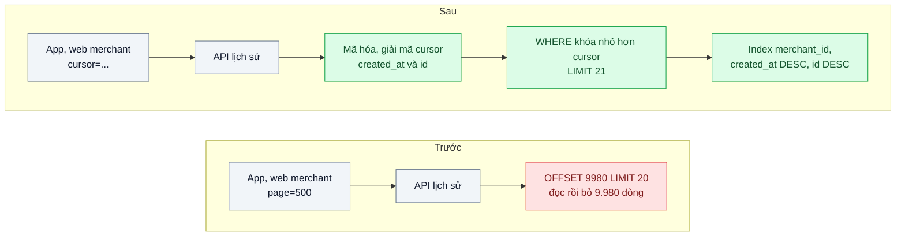
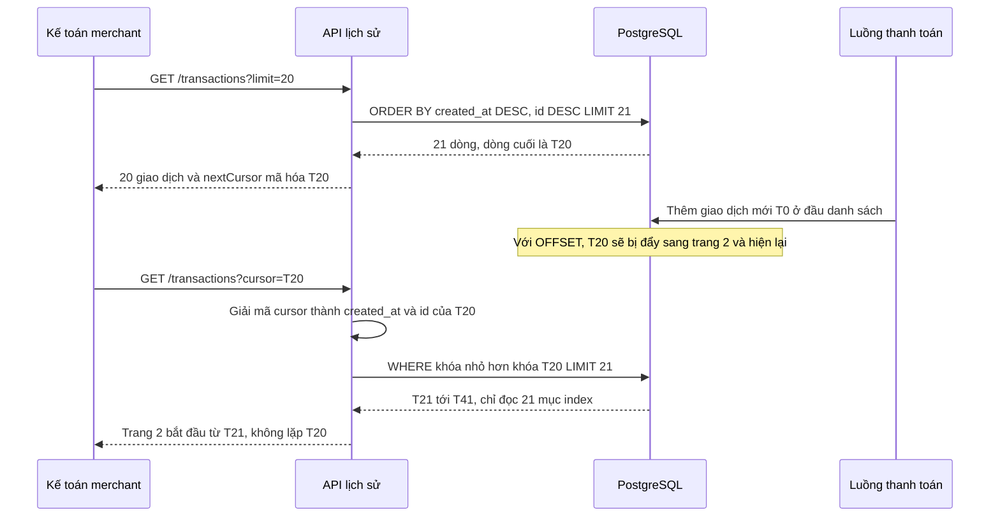

# Cursor-based Pagination — Trang 500 của lịch sử giao dịch mất 6 giây và lặp bản ghi

| Scope | Mức độ | Trạng thái | Pattern gốc | Cập nhật |
|---|---|---|---|---|
| 01 · frontend / backend / transporter | 🟢 Cơ bản | ✅ Hoàn thành | Keyset (Cursor) Pagination — Winand, *Use The Index, Luke*; Slack Engineering (2017) | 2026-10-08 |

> **Một câu tóm tắt:** Thay `OFFSET n` bằng con trỏ "bản ghi cuối cùng tôi đã thấy" để mỗi trang chỉ đọc đúng số dòng cần trả về từ index, nên trang 500 nhanh như trang 1 và không lặp hay sót bản ghi khi có giao dịch mới chen vào.

## 1. Bài toán thực tế (What)

**Bối cảnh** *(doanh nghiệp giả định, số liệu minh họa)*
Ví điện tử có khoảng 3 triệu người dùng và 800 merchant. Bảng `transactions` khoảng 120 triệu dòng. Màn hình "Lịch sử giao dịch" trên web merchant và app dùng API `GET /transactions?page=500&size=20`, backend chạy `ORDER BY created_at DESC LIMIT 20 OFFSET 9980`.

**Triệu chứng người kinh doanh nhìn thấy**
- Kế toán của merchant lớn lật tới trang 500 để đối soát cuối tháng: mỗi trang mất khoảng 6 giây, nhiều người bỏ dở và gọi tổng đài xin file Excel.
- Khi đang lật trang mà có giao dịch mới, cùng một giao dịch xuất hiện ở hai trang liên tiếp; kế toán cộng trùng và báo "lệch tiền".
- Vào giờ đối soát, API lịch sử làm chậm cả API thanh toán vì dùng chung database.

**Nguyên nhân kỹ thuật**
`OFFSET 9980` buộc PostgreSQL đọc và bỏ đi 9.980 dòng trước khi trả 20 dòng; tài liệu PostgreSQL nói rõ các dòng bị `OFFSET` bỏ qua vẫn phải được tính trong server. Chi phí tăng tuyến tính theo số trang. Còn chuyện lặp bản ghi: vị trí "dòng thứ 9.980" là tương đối; một giao dịch mới chèn vào đầu danh sách đẩy mọi dòng lùi một vị trí, nên dòng cuối trang trước trở thành dòng đầu trang sau.

**Ràng buộc**
- App di động bản cũ vẫn gửi `page=`; phải giữ một thời gian song song (xem bài 07).
- Danh sách sắp xếp theo thời gian giảm dần; nhiều giao dịch có thể trùng `created_at`.
- Không thêm hệ thống mới (search engine, cache) chỉ cho màn hình này.

## 2. Vì sao dùng pattern này (Why)

**Nguyên nhân gốc mà pattern nhắm vào:** phân trang theo *vị trí* (bỏ qua n dòng) thay vì theo *giá trị* (lấy các dòng sau giá trị khóa đã thấy).

**Pattern giải quyết thế nào:** Keyset pagination (Winand gọi là "seek method") ghi nhớ giá trị khóa sắp xếp của dòng cuối trang, ví dụ `(created_at, id)`. Trang kế tiếp là `WHERE (created_at, id) < ($last_created_at, $last_id) ORDER BY created_at DESC, id DESC LIMIT 21`. Với index `(merchant_id, created_at DESC, id DESC)`, PostgreSQL nhảy thẳng tới vị trí đó trong B-tree và đọc 21 dòng, bất kể là trang thứ mấy. `id` làm khóa phụ để thứ tự là duy nhất. API không lộ hai giá trị này ra ngoài mà đóng gói thành một chuỗi `cursor` mờ (opaque), giống cách Slack mô tả khi chuyển API sang phân trang bằng cursor: client chỉ biết "đưa lại cursor để lấy trang sau".

**Lựa chọn khác đã cân nhắc**

| Lựa chọn | Giải quyết được gì | Vì sao không chọn (ở bài này) |
|---|---|---|
| Giữ nguyên + tối ưu nhỏ (thêm index, giới hạn tối đa 100 trang) | Trang đầu nhanh hơn | `OFFSET` lớn vẫn phải đọc bỏ; lặp bản ghi vẫn còn; chặn 100 trang làm kế toán không đối soát được |
| Cursor mang số trang mã hóa (`page` giấu trong cursor) | Đổi giao diện API | Chỉ là `OFFSET` đội lốt, không đổi chi phí |
| Snapshot kết quả vào bảng tạm hoặc cache theo phiên | Không lặp bản ghi, nhảy trang tùy ý | Tốn bộ nhớ theo người dùng, phải dọn dẹp; quá tay cho một màn hình |
| Xuất file bất đồng bộ cho đối soát | Đúng nhu cầu kế toán lấy toàn bộ tháng | Bổ trợ tốt (xem bài job nền ở scope 08), nhưng màn hình lật trang vẫn cần nhanh |
| Keyset pagination với cursor mờ (chọn) | Thời gian mỗi trang gần như hằng số, không lặp/sót khi có dữ liệu mới | Mất khả năng "nhảy tới trang 500" và tổng số trang chính xác |

## 3. Thiết kế hệ thống (How)

### 3.1 Kiến trúc trước và sau



### 3.2 Luồng chính

Luồng có giao dịch mới chen vào giữa hai lần lật trang:



### 3.3 Thành phần và trách nhiệm

| Thành phần | Trách nhiệm | Quyết định thiết kế đáng chú ý |
|---|---|---|
| Index phức hợp | Cho phép nhảy thẳng tới vị trí cursor | Cột lọc `merchant_id` đứng đầu, sau đó đúng thứ tự `ORDER BY` |
| Bộ mã hóa cursor | Đóng gói `created_at` và `id` thành chuỗi base64url | Mờ với client để sau này đổi khóa sắp xếp không phá API; có thể ký HMAC để chống sửa |
| Truy vấn seek | So sánh row value `(created_at, id) < (...)` | Lấy `limit + 1` dòng để biết còn trang sau mà không cần `COUNT` |
| Hợp đồng response | Trả `items`, `nextCursor` (null khi hết) | Khai báo trong OpenAPI (bài 01); không trả `totalPages` |
| Lớp tương thích `page=` | Phục vụ app cũ trong giai đoạn chuyển đổi | Giới hạn `page` tối đa và ghi log để biết khi nào gỡ được |

### 3.4 Điểm dễ sai khi triển khai
- **Khóa sắp xếp không duy nhất.** Chỉ dùng `created_at` thì hai giao dịch cùng thời điểm có thể bị sót ở ranh giới trang. Luôn thêm `id` làm khóa phụ.
- **Mất độ chính xác thời gian.** PostgreSQL lưu `timestamptz` tới micro giây, `Date` của JavaScript chỉ tới mili giây. Đưa `created_at` qua `Date` rồi đóng vào cursor sẽ sót hoặc lặp dòng; giữ dạng chuỗi lấy từ DB.
- **Hướng sắp xếp lẫn lộn.** Row value comparison chỉ dùng được index khi các cột cùng chiều; nếu cần `created_at DESC, id ASC` phải viết điều kiện dạng mở rộng `OR` hoặc đổi chiều index. Lab chỉ thử chiều ngược ở phía index (truy vấn vẫn `DESC, DESC`, index `id ASC`): PostgreSQL 16 vẫn đi theo index cho `created_at` rồi thêm `Incremental Sort` theo `id`, đọc 22 thay vì 21 dòng vì nhóm trùng trong dữ liệu test nhỏ. Nhóm trùng lớn thì phải đọc trọn nhóm (chưa đo).
- **Lọc thêm điều kiện mà index không phủ** (ví dụ theo trạng thái) làm PostgreSQL quét nhiều hơn; kiểm tra bằng `EXPLAIN (ANALYZE, BUFFERS)` cho từng bộ lọc.
- **Cố giữ `totalCount` chính xác.** `COUNT(*)` trên hàng triệu dòng tốn đúng chi phí ta vừa bỏ; dùng "còn trang sau" hoặc số ước lượng.

Gặp thật khi làm lab:
- **Driver `pg` đổi `timestamptz` thành `Date`** theo mặc định, nên micro giây mất ngay khi đọc, trước cả khi tới cursor. Lab tắt bộ chuyển đó trong pool và đọc `created_at` bằng `to_char(... 'US')`. Phép thử âm "cursor mang `created_at` đã qua `Date`" làm đúng test micro giây đỏ (mục 5.1).
- **Bí danh trùng tên cột đổi kế hoạch.** `SELECT to_char(created_at ...) AS created_at ... ORDER BY created_at` sắp theo chuỗi `to_char` (PostgreSQL ưu tiên cột xuất ra), kế hoạch thành `Sort` trên `Seq Scan` thay vì đi theo index (đã kiểm bằng `EXPLAIN`). Lab đặt bí danh `created_at_iso`.
- **Chữ ký không thay được kiểm định dạng.** Cursor ký đúng khóa nhưng là phiên bản cũ hay sai định dạng vẫn tới được database: bỏ bước kiểm định dạng thì 4 trường hợp thành lỗi 500 và 3 trường hợp vẫn trả 200.
- **Dữ liệu test phải làm ranh giới trang cắt ngang nhóm trùng.** Seed nhóm 5 dòng trùng `created_at`, trang cỡ 20: ranh giới trang luôn trùng ranh giới nhóm, nên bỏ khóa phụ `id` vẫn không lộ lỗi trên dữ liệu đó. Test (b) chèn thêm 3 dòng ở đầu và kiểm rằng có ranh giới cắt ngang nhóm trước khi so.
- **`/dev/shm` của container** (xem mục 5.1): 10 truy vấn `OFFSET` cùng lúc, mỗi truy vấn là một Parallel Bitmap Heap Scan trên merchant 600.000 dòng, làm đầy 256 MB và PostgreSQL báo `could not resize shared memory segment`. Lab đặt `shm_size: 1gb`.

## 4. Tech stack và tác động (Impact techstack)

| Lớp | Công nghệ chọn | Vì sao chọn | Thay thế tương đương |
|---|---|---|---|
| Database | PostgreSQL 16 (lab: `postgres:16.15`) | Hỗ trợ row value comparison dùng được B-tree index | MySQL 8 (cú pháp tương tự) |
| Truy cập dữ liệu | Kysely 0.29.6 + `pg` 8.23.1 | Viết được điều kiện row value mà vẫn có type (`refTuple`, `tuple`); trùng stack của chủ repo | SQL thuần với `pg`, Drizzle |
| API | Fastify 5.12.5, TypeScript strict (lab) | Lab chỉ có một route; Fastify để độ trễ đo được phản ánh database, không phải framework (nhật ký 2026-10-06, điểm 4) | NestJS 10 (stack mặc định) |
| Frontend | React 19.3 + TanStack Query 5.104.1 `useInfiniteQuery` (lab: một component, không Next.js) | Mô hình "trang sau theo con trỏ" khớp sẵn với infinite query | SWR Infinite |
| Seed dữ liệu | Script SQL `generate_series` | Sinh 20 triệu dòng trong khoảng 1,5 phút để tái hiện chi phí `OFFSET` | pgbench custom script |
| Đo | `EXPLAIN (ANALYZE, BUFFERS)`, k6 1.4.2 | Thấy số buffer đọc theo trang; đo p95 khi nhiều người lật trang | `pg_stat_statements` |

**Thay đổi so với hệ thống hiện tại:** thêm một index phức hợp, đổi hợp đồng API từ `page` sang `cursor`, frontend chuyển sang infinite list; đội sản phẩm chấp nhận bỏ nút "nhảy tới trang N".

**Ghi chú lệch kế hoạch khi làm lab**
- **Fastify thay NestJS:** API của lab là một route `GET /merchants/:merchantId/transactions`; có `page=` thì chạy bản trước (OFFSET), không có thì chạy bản sau (cursor). Cả hai bản dùng chung tiến trình, pool 10 kết nối và cách serialize, nên chênh lệch nằm ở câu SQL.
- **Frontend tối giản, không Next.js:** chỉ số của bài nằm ở API và database. Phần frontend là component `TransactionHistory` dùng `useInfiniteQuery`, kiểm bằng test render trong happy-dom 20.14.5 (bấm "Xem thêm" tới hết danh sách). Request trong test đi qua `app.inject` của Fastify, không qua mạng.
- **`created_at` đi dạng chuỗi từ đầu tới cuối:** pool `pg` của lab tắt bộ chuyển `timestamptz` → `Date`, và câu SELECT đọc `to_char(created_at AT TIME ZONE 'UTC', '...US"Z"')`. Cursor nhờ vậy giữ đủ 6 chữ số micro giây (mục 3.4).
- **Hợp đồng OpenAPI cho `cursor`/`nextCursor`** (mục 3.3) và **giới hạn `page` tối đa cho app cũ** chưa làm trong lab này.

## 5. Kết quả đầu ra và cách đo (Output impact)

| Chỉ số | Trước (minh họa) | Mục tiêu khi thực hành | Cách đo |
|---|---|---|---|
| Thời gian truy vấn trang 500 | 6.000 ms | ≤ 20 ms | `EXPLAIN (ANALYZE, BUFFERS)` trên seed 20 triệu dòng, chạy 5 lần lấy trung vị |
| Buffer đọc cho trang 500 so với trang 1 | gấp vài trăm lần | xấp xỉ bằng nhau | Dòng `Buffers: shared hit/read` trong `EXPLAIN` |
| p95 API khi 50 người lật trang liên tục | 4.500 ms | ≤ 100 ms | k6 kịch bản lật 500 trang mỗi người dùng ảo |
| Số bản ghi lặp khi có insert đồng thời | 3–10 mỗi lần đối soát | 0 | Test: lật toàn bộ danh sách trong khi luồng khác insert, so sánh tập id |

> Số "trước" là minh họa để hình dung bài toán. Số "mục tiêu" chỉ được coi là đạt khi có số đo thật;
> số đã đo nằm ở mục 5.1 bên dưới, kèm môi trường đo.

### 5.1 Số đã đo

**Môi trường** *(đã đo, 2026-10-08, 21:09 – 21:32)*: MacBook Apple M1 Pro (8 nhân, 16 GB), macOS 26.6.2, nắp mở, `caffeinate -ims` suốt phiên. Mọi lượt chạy **pin** (83 % → 75 %), không lượt nào đổi nguồn điện. Docker 28.5.1, máy ảo 8 CPU, khoảng 7,6 GB RAM. PostgreSQL 16.15 (`postgres:16.15`) cấu hình mặc định (`shared_buffers` 128 MB, tối đa 2 worker song song mỗi truy vấn), trừ `max_wal_size=4GB` (chỉ cho seed) và `shm_size: 1gb`. Node v20.19.6, pnpm 10.32.0, Fastify 5.12.5, Kysely 0.29.6, pg 8.23.1, k6 v1.4.2. API là một tiến trình Node trên macOS, pool 10 kết nối, gọi PostgreSQL qua cổng 55432; k6 chạy cùng máy. Container MySQL và RabbitMQ của dự án khác vẫn chạy nền. Số thô ở `bench/results/main/` (không commit).

**Dữ liệu** (`pnpm db:seed`, log ở `seed-20m.log`): 20.000.000 giao dịch cho 1.000 merchant, đúng quy mô kế hoạch ở mục 8, không phải giảm. 10 merchant lớn có 599.980 – 600.015 dòng mỗi merchant (30 % tổng số dòng); 990 merchant còn lại có 14.130 – 14.155 dòng. 1.000.000 nhóm 5 dòng trùng hệt `created_at` (25 % số dòng); các dòng còn lại lệch nhau từng micro giây. Seed mất 86,6 s: INSERT 63,1 s, khóa chính 11,6 s, index `merchant_id` 6,1 s, VACUUM 4,1 s. Bảng 1.929 MB, database 2.498 MB trước khi có index của pattern (lượt thử 1 triệu dòng: 5,2 s, 132 MB). Index `(merchant_id, created_at DESC, id DESC)` tạo bằng `CREATE INDEX CONCURRENTLY` mất khoảng 22 s (21,9 – 23,0 s qua 3 lần, tính cả lệnh `psql`), nặng 774 MB (40 % heap).

**Ba cấu hình được so**
- **A, trước:** `page=` chạy `ORDER BY created_at DESC LIMIT 20 OFFSET (page − 1) × 20`; bảng chỉ có khóa chính và index `merchant_id`.
- **B, chỉ thêm index:** cùng code của A, thêm index phức hợp (lựa chọn đầu tiên trong bảng ở mục 2).
- **C, sau:** cursor và truy vấn seek lấy `limit + 1`, cùng index của B.

**`EXPLAIN (ANALYZE, BUFFERS)` trên đúng câu SQL repository sinh ra** (`bench/explain-pages.ts`; `explain/A-chua-co-index.json`, `explain/B-co-index.json`). Mỗi ô: 1 lần chạy đầu, rồi 5 lần đo, lấy trung vị thời gian thực thi (thấp nhất – cao nhất). Buffer là `shared hit + read` của lần đo cuối. Merchant 1 (600.005 dòng):

| Cấu hình | Trang 1 | Trang 50 | Trang 500 | Dòng nút quét đọc ở trang 500 | Buffer trang 1 → trang 500 |
|---|---|---|---|---|---|
| A: OFFSET, chưa có index phù hợp | 626 ms | 583 ms | 531 ms (526 – 629) | 600.006 | 126.445 → 126.445 |
| B: OFFSET + index | 0,034 ms | 0,948 ms | 8,244 ms (7,199 – 9,139) | 10.000 | 8 → 2.151 (gấp 269) |
| C: keyset + index | 0,033 ms | 0,039 ms | 0,028 ms (0,027 – 0,047) | 21 | 9 → 9 |
| Keyset khi chưa có index (phép thử âm) | 559 ms | 536 ms | 519 ms (513 – 670) | 590.025 | 126.459 → 126.459 |

- Kế hoạch: A và "keyset khi chưa có index" là `Limit → Gather Merge → Sort → Bitmap Heap Scan → Bitmap Index Scan (transactions_merchant_id_idx)`, tức đọc mọi dòng của merchant rồi sắp xếp, trang nào cũng vậy. B và C là `Limit → Index Scan (transactions_merchant_created_id_idx)`; ở C, điều kiện `ROW(created_at, id) < ROW(...)` nằm trong `Index Cond`.
- Ở A, trang 1 chậm ngang trang 500: khi chưa có index đúng thứ tự, chi phí nằm ở việc đọc cả merchant, OFFSET chưa kịp là vấn đề. Gần như toàn bộ 126.445 buffer phải đọc lại từ bộ đệm của hệ điều hành mỗi lần vì `shared_buffers` (128 MB) nhỏ hơn bảng.
- Merchant nhỏ (merchant 500, 14.140 dòng): A tốn 14 – 17 ms ở mọi trang; B ở trang 500 tốn 7,07 ms với 2.154 buffer; C tốn 0,026 ms với 9 buffer.

**50 người lật trang** (`bench/run-scroll.ts` gọi `bench/scroll-500-pages.k6.js`; `scroll/rounds.json`, `k6/r*-*.json`; 21:17 – 21:25). 50 VU, mỗi VU giữ một trong 10 merchant lớn và bắt đầu ở một trang khác nhau, trải đều từ 1 tới 500. VU lật sang trang kế tiếp liên tục; bản C gửi lại đúng `nextCursor` vừa nhận. Hết trang 500 thì quay về trang 1. Mỗi cấu hình có 10 s làm nóng (không tính) và 30 s đo. Ba vòng theo thứ tự A → B → C, C → B → A, A → B → C; mỗi lần đổi giữa A và B/C là một lần tạo hoặc xóa index. Mọi request trả 200 và đủ 20 dòng; không có khoảng máy ngủ. Bảng ghi trung vị của 3 vòng (thấp nhất – cao nhất):

| Cấu hình | Request trong 30 s | Trung vị | p95 | p99 | CPU PostgreSQL | CPU tiến trình API |
|---|---|---|---|---|---|---|
| A | 69 (63 – 71) | 21.299 ms | 24.150 ms (22.767 – 28.818) | 24.427 ms | 729 % | 1 % |
| B | 43.120 (36.803 – 44.282) | 33,5 ms | 44,8 ms (40,9 – 58,4) | 57,1 ms | 607 % | 45 % |
| C | 296.340 (294.894 – 300.201) | 5,4 ms | 7,8 ms (7,7 – 8,0) | 10,2 ms | 154 % | 100 % |

- Theo độ sâu, p95 (trung vị 3 vòng) của B là 38,5 ms ở trang 1 – 50, 41,1 ms ở trang 51 – 250 và 47,1 ms ở trang 251 – 500; của C là 7,8 / 7,8 / 7,9 ms. Ở B, chênh lệch theo độ sâu nhỏ hơn nhiều so với `EXPLAIN` (0,03 → 8 ms), vì 50 VU dồn vào pool 10 kết nối: request nào cũng chờ chung một hàng đợi, nên trang nông chậm theo trang sâu.
- C bị chặn ở tiến trình API (100 %, tức một nhân) và k6 chạy cùng máy, không phải ở PostgreSQL (154 %). Số của C vì vậy là giới hạn của máy đo hơn là của truy vấn.
- Load 1 phút của macOS lên 10 – 80 trong lượt, vì A đẩy PostgreSQL lên 7,3 nhân trên máy ảo 8 nhân. Vòng 3 của B chạy ngay sau A và lần tạo index (load 50 – 80) cho p95 58,4 ms, so với 40,9 – 44,8 ms ở hai vòng còn lại.

**Đối soát trong lúc có giao dịch mới** (`bench/reconcile-under-inserts.ts`, `reconcile/rate20-think20.json`, có index). Một người lật 500 trang của merchant 7 qua API, nghỉ 20 ms mỗi trang. Một luồng khác chèn 20 giao dịch mới mỗi giây cho merchant đó, bắt đầu ngay sau khi đọc trang 1:

| Bản | Thời gian lật | Giao dịch chèn trong lúc lật | Dòng lặp | Dòng cũ bị đẩy ra khỏi 500 trang |
|---|---|---|---|---|
| OFFSET (B) | 16,9 s | 304 | 303 | 303 |
| Keyset (C) | 14,0 s | 248 | 0 | 0 |

Với OFFSET, mỗi giao dịch chen vào trước lần đọc trang kế tiếp đẩy cả danh sách lùi một chỗ, nên số dòng lặp bằng số giao dịch chèn trước lần đọc trang cuối (303 trên 304). Con số 303 phụ thuộc tốc độ chèn và tốc độ lật mà lab chọn. Khi không chèn gì (`reconcile/rate0-*.json`, merchant 500, có và không có index), cả hai bản đều 0 lặp; nhóm trùng của seed không cắt ngang ranh giới trang cỡ 20, nên lượt này không kiểm được chuyện thứ tự các dòng trùng thay đổi giữa hai lần `OFFSET`.

**Phép thử âm** (`bench/negative-drills.ts`, `drills/summary.json`). Script sửa mã nguồn thật, chạy test, khôi phục, rồi so lại nội dung file (khớp). Lượt gốc: 0/32 test đỏ.

| # | Gỡ hoặc phá | Test đỏ | Chỗ đỏ |
|---|---|---|---|
| 1 | Bỏ khóa phụ `id`: `created_at < t` | 7/32 | test (b): 5 cỡ trang với 50 dòng trùng và dữ liệu theo quy luật seed sót dòng; test kế hoạch: `Index Cond` không còn `ROW(created_at, id)` |
| 2 | Cursor mang `created_at` đã qua `Date` (mili giây) | 1/32 | test (b) micro giây: lấy được 30/35 dòng |
| 3 | Bỏ `limit + 1` (còn trang sau khi trang đầy) | 3/32 | trang rỗng thứ 3 với 40 dòng; 51 thay vì 50 trang ở test (a); nút quét đọc 20 thay vì 21 |
| 4 | Bỏ kiểm chữ ký | 2/17 | test (c): payload sửa tay và ký bằng khóa khác trả 200 |
| 5 | Bỏ kiểm phiên bản và định dạng | 7/17 | test (c): 4 trường hợp thành 500 (lỗi ở database), 3 trường hợp trả 200 |
| 6 | Không tạo index phức hợp | 2/2 | test kế hoạch: dùng `transactions_merchant_id_idx`; OFFSET quét 12.000 dòng thay vì 10.000 |
| 7 | Index thiếu `id`: `(merchant_id, created_at DESC)` | 1/2 | `Index Cond` chỉ còn `created_at <= ...`, `ROW(...)` chuyển xuống `Filter`, thêm `Incremental Sort` |
| 8 | Index lệch chiều: `(merchant_id, created_at DESC, id ASC)` | 1/2 | thêm `Incremental Sort`, nút quét đọc 22 thay vì 21 dòng |

**Đối chiếu mục tiêu ở bảng mục 5**
- Thời gian truy vấn trang 500 ≤ 20 ms: C 0,028 ms (trung vị 5 lần, seed 20 triệu dòng). **Đạt.** A là 531 ms, B là 8,2 ms.
- Buffer trang 500 xấp xỉ trang 1: C 9 so với 9. **Đạt.** B gấp 269 lần; A bằng nhau nhưng vì trang nào cũng đọc 126.445 buffer.
- p95 API khi 50 người lật trang ≤ 100 ms: C 7,8 ms (trung vị 3 vòng, cao nhất 8,0 ms). **Đạt.** A là 24,2 s. B (44,8 ms) cũng dưới 100 ms ở quy mô này, nhưng PostgreSQL bận 6 nhân để phục vụ ít hơn 1/6 số request của C.
- Số bản ghi lặp khi có insert đồng thời = 0: C cho 0 ở lượt đối soát trên, ở test (a) (luồng ghi chạy song song) và ở test frontend. **Đạt.**

**Chạy lại từ đầu** (21:36 – 21:42, pin 74 %, Node 20.19.6): `docker compose down -v`, xóa `node_modules`, rồi làm theo "Cách chạy" ở mục 8 với tham số ngắn: `pnpm install`, `pnpm db:up`, `pnpm test` (32/32), `pnpm typecheck`, seed 2 triệu dòng (`ROWS=2000000`), `bench:explain` hai trạng thái, `bench:scroll` một vòng 5 s, `bench:reconcile` 100 trang, `bench:drills`. Kết quả ở `bench/results/recheck/` cho cùng kết luận: trang 500 của merchant 1 (khoảng 60.000 dòng) là 36 ms (A), 10,6 ms với 2.151 buffer (B), 0,033 ms với 9 buffer (C); k6 p95 859 / 42,7 / 8,4 ms; OFFSET lặp 56 dòng khi có 57 giao dịch chèn, keyset 0. Phép thử âm #1 đỏ 8/32 thay vì 7/32: thêm test (a) có luồng ghi song song, vì số giao dịch mới lọt vào trang 1 làm lệch ranh giới trang và có lúc cắt ngang nhóm trùng. Các phép thử âm khác cho đúng số test đỏ như lượt chính.

**Hạn chế:** mọi lượt chạy pin, API, k6 và PostgreSQL chung một máy, load macOS cao trong lúc đo A. Bảng (20 triệu dòng) nhỏ hơn bối cảnh mục 1 (120 triệu) 6 lần, `shared_buffers` để mặc định 128 MB. Mỗi cấu hình k6 chỉ có 3 vòng × 30 s. C bị giới hạn bởi một tiến trình Node, nên chưa đo được trần của PostgreSQL. Lab chưa thử bộ lọc thêm (theo trạng thái, khoảng ngày), chưa thử lật ngược (trang trước), và chưa đo nhóm trùng `created_at` lớn.

**Tác động nghiệp vụ mong đợi:** kế toán đối soát được trên màn hình thay vì gọi tổng đài, hết tình trạng "lệch tiền" do cộng trùng, và giờ đối soát không còn kéo chậm thanh toán.

## 6. Đánh đổi và khi KHÔNG nên dùng

**Đánh đổi**
- Không nhảy tới trang bất kỳ, không có tổng số trang chính xác; giao diện phải thiết kế lại theo "xem thêm".
- Thêm index làm tăng chi phí ghi và dung lượng; phải có index riêng cho mỗi kiểu sắp xếp được hỗ trợ. Ở lab, index phức hợp nặng 774 MB (40 % heap của 20 triệu dòng) và mất khoảng 22 s để tạo; chi phí ghi thêm chưa đo.
- Cursor có thể hết hiệu lực khi đổi khóa sắp xếp; cần quy ước phiên bản cursor.

**Không nên dùng khi**
- Bảng nhỏ (vài nghìn dòng) và người dùng cần nhảy trang tùy ý: `OFFSET` đơn giản hơn và đủ nhanh.
- Kết quả xếp theo điểm liên quan của search engine: dùng cơ chế phân trang riêng của engine (scope 05).
- Nhu cầu thật là lấy toàn bộ dữ liệu một kỳ: một job xuất file phù hợp hơn lật 500 trang.

**Liên quan**
- Đọc trước: `../../02-backend-database/01-n-plus-1-trang-50-don-ban-151-cau-sql/` — đọc `EXPLAIN` và thiết kế index.
- Đọc trước: `../01-contract-first-openapi-frontend-goi-sai-ten-truong/` — mô tả `cursor` và `nextCursor` trong hợp đồng.
- Cùng chủ đề: `../../08-backend-monolith/02-background-job-trong-monolith-xuat-excel-lam-treo-web/` — xuất toàn bộ dữ liệu bằng job nền.
- Đọc sau: `../07-api-versioning-app-cu-van-phai-chay/` — giữ `page=` cho app cũ trong lúc chuyển đổi.

## 7. Cơ sở tham khảo

- Markus Winand, *Use The Index, Luke*, phần "Paging Through Results" — https://use-the-index-luke.com/ — seek method, row values, vì sao `OFFSET` chậm dần và lặp bản ghi.
- Slack Engineering, "Evolving API Pagination at Slack", 2017 — https://slack.engineering/evolving-api-pagination-at-slack/ — lý do Slack chuyển API công khai từ phân trang offset sang cursor mờ, và đánh đổi của từng cách.
- PostgreSQL docs, "LIMIT and OFFSET" và "Row Constructor Comparison" — https://www.postgresql.org/docs/ — chi phí của dòng bị `OFFSET` bỏ qua, ngữ nghĩa so sánh row value.
- PostgreSQL docs, "Using EXPLAIN" — https://www.postgresql.org/docs/current/using-explain.html — đọc kế hoạch và số buffer để đo trước/sau.
- TanStack Query docs, "Infinite Queries" — https://tanstack.com/query/latest — mô hình trang sau theo con trỏ ở frontend.

## 8. Kế hoạch thực hành

- [x] Bước 1: Docker Compose với PostgreSQL 16.15; seed 20 triệu giao dịch cho 1.000 merchant bằng `generate_series`, xác định, chạy lại được, 25 % số dòng nằm trong nhóm trùng `created_at` (86,6 s, mục 5.1).
- [x] Bước 2: đo "trước": API `page=` với `OFFSET`; `EXPLAIN (ANALYZE, BUFFERS)` ở trang 1, 50, 500 (khi chưa có index và khi chỉ thêm index); k6 50 người dùng ảo lật trang.
- [x] Bước 3: thêm index (`CREATE INDEX CONCURRENTLY`), bộ mã hóa cursor ký HMAC, truy vấn seek lấy `limit + 1`; frontend tối giản dùng `useInfiniteQuery` (mục 4).
- [x] Bước 4: đo "sau" cùng kịch bản, xoay thứ tự giữa 3 vòng; số thật và môi trường ở mục 5.1.
- [x] Bước 5: viết test: (a) lật hết danh sách trong khi insert đồng thời không lặp, không sót id; (b) các dòng trùng `created_at` ở ranh giới trang không bị sót; (c) cursor bị sửa tay trả 400. Thêm test kế hoạch truy vấn, test frontend, và 8 phép thử âm (mục 5.1).

**Cấu trúc code**
```text
src/
  truoc/transactions-offset.repository.ts   # page= → ORDER BY created_at DESC LIMIT/OFFSET
  sau/transactions-keyset.repository.ts     # [PATTERN] (created_at, id) < cursor, ORDER BY created_at DESC, id DESC, LIMIT limit + 1
  sau/cursor-codec.ts                       # [PATTERN] base64url(JSON).HMAC-SHA256; kiểm chữ ký, phiên bản, định dạng, merchant
  shared/db.ts                              # Kysely + pool pg, timestamptz giữ dạng chuỗi; schema riêng cho test
  shared/transaction.ts                     # cột cần đọc (created_at_iso đủ micro giây), DTO
  shared/explain.ts                         # EXPLAIN đúng câu SQL repository sinh ra; vị trí cursor của trang N
  app.ts, server.ts                         # Fastify: GET /merchants/:merchantId/transactions (page= hoặc cursor=)
web/
  transaction-history.tsx                   # [PATTERN] useInfiniteQuery, getNextPageParam = nextCursor
  api-client.ts
db/
  init.sql, schema.sql                      # schema "trước": khóa chính + index merchant_id
  seed-transactions.sql                     # generate_series, xác định; đưa bảng về trạng thái "trước"
  add-keyset-index.sql, drop-keyset-index.sql
test/                                       # 5 file, 32 test; tự dựng schema lab_test, không cần seed lớn
  keyset-no-duplicates-under-inserts.test.ts   # (a)
  keyset-ties-on-created-at.test.ts            # (b), micro giây, limit + 1
  cursor-tampering.test.ts                     # (c)
  keyset-query-plan.test.ts                    # Index Scan, 21 dòng so với 10.000 dòng
  web-infinite-list.test.tsx                   # happy-dom: bấm "Xem thêm" tới hết
bench/
  explain-pages.ts                          # EXPLAIN trang 1/50/500, 1 + 5 lần
  run-scroll.ts, scroll-500-pages.k6.js     # 3 vòng × A/B/C, xoay thứ tự, tạo/xóa index giữa các cấu hình
  reconcile-under-inserts.ts                # lật 500 trang trong lúc có giao dịch mới
  negative-drills.ts                        # 8 phép thử âm trên mã nguồn thật
docker-compose.yml                          # postgres:16.15, cổng 55432, shm_size 1gb
```

**Cách chạy**
```bash
cd 01-frontend-backend-transporter/02-cursor-pagination-trang-500-lich-su-giao-dich
pnpm install
pnpm db:up                     # PostgreSQL 16.15 ở cổng 55432 (docker compose up -d --wait)
pnpm test                      # 32 test, khoảng 6 s; tự tạo schema lab_test, KHÔNG cần seed
pnpm typecheck
# Seed và đo (kết quả ở bench/results/$RUN/, không commit; chạy lại thì đổi RUN, đừng ghi đè main)
pnpm db:seed                   # 20 triệu dòng, khoảng 1,5 phút, khoảng 2,5 GB; ROWS=2000000 để thử nhanh
RUN=main LABEL=A-chua-co-index pnpm bench:explain
pnpm db:index                  # thêm index phức hợp (CONCURRENTLY), khoảng 22 s; pnpm db:unindex để quay lại
RUN=main LABEL=B-co-index pnpm bench:explain
RUN=main pnpm bench:scroll     # 3 vòng A/B/C, khoảng 8 phút; DURATION=30s WARMUP=10s VUS=50 PLAN="A,+,B,C|C,B,-,A|A,+,B,C"
RUN=main LABEL=rate20-think20 MERCHANT=7 RATE=20 THINK_MS=20 pnpm bench:reconcile
RUN=main pnpm bench:drills     # 8 phép thử âm, khoảng 30 s; sửa rồi khôi phục mã nguồn, đừng chạy cùng lúc với pnpm test
pnpm dev                       # chạy tay: API ở http://127.0.0.1:3100 (Ctrl+C để dừng)
pnpm db:reset                  # docker compose down -v
```

Script đo tự chạy API ở cổng 3100 và dừng nếu cổng đã bận (ví dụ còn `pnpm dev`). Máy cần thức suốt lượt đo (`caffeinate -ims`); `bench:scroll` ghi khoảng máy ngủ, nguồn điện và load theo từng cấu hình.

## Bài học sau khi làm

- **"Trước" có hai tầng bệnh, và chỉ thêm index mới chữa được một tầng.** Khi chưa có index đúng thứ tự, trang nào cũng tốn khoảng 0,5 – 0,6 s vì phải đọc cả 600.000 dòng của merchant rồi sắp xếp; trang 1 cũng chậm. Thêm index thì trang 1 còn 0,03 ms, nhưng trang 500 vẫn đọc 10.000 dòng (8,2 ms, 2.151 buffer, gấp 269 lần trang 1), đúng như dòng "Giữ nguyên + tối ưu nhỏ" ở mục 2 dự đoán. Keyset giữ trang 500 ở 9 buffer, 21 dòng, bằng trang 1.
- **Dưới tải, keyset đổi được nhiều thông lượng hơn độ trễ.** p95 giảm từ 44,8 ms (OFFSET có index) xuống 7,8 ms, nhưng chênh lệch lớn hơn nằm ở chỗ khác: cùng 30 giây, 296.340 request so với 43.120, và PostgreSQL dùng 1,5 nhân thay vì 6 nhân. Điểm này nối với triệu chứng "giờ đối soát làm chậm thanh toán" ở mục 1 (lab chưa đo luồng thanh toán).
- **Lặp bản ghi với OFFSET là chuyện số học, không phải chuyện xui.** Mỗi giao dịch mới chen vào giữa hai lần lật tạo đúng một dòng lặp, và đẩy một dòng cũ ra khỏi phạm vi 500 trang (303/304 ở lượt đo, 18/18 ở test). Keyset cho 0 vì vị trí được nhớ theo giá trị.
- **Phần dễ sai nằm ở chi tiết, và test phải được dựng để bắt chúng.** Bỏ khóa phụ `id` chỉ lộ ra khi ranh giới trang cắt ngang nhóm trùng: test (a) lật 1.000 dòng theo quy luật seed với trang 20 vẫn xanh, chỉ các test có ranh giới cắt ngang nhóm trùng đỏ. Làm tròn về mili giây chỉ làm đỏ đúng một test, test có 25 dòng trong cùng một mili giây. Bỏ `limit + 1` chỉ lộ ra khi tổng số dòng chia hết cho cỡ trang.
- **Cursor mờ cần cả chữ ký lẫn kiểm định dạng.** Chữ ký chặn sửa tay; kiểm định dạng chặn cursor "thật" của phiên bản cũ. Bỏ một trong hai thì test (c) đỏ ở đúng nhóm trường hợp tương ứng.
- **Lỗi gặp khi làm:** ở lượt thử k6 đầu tiên của cấu hình A, chỉ 3,9 % request đạt kiểm tra "200 và đủ 20 dòng", và log PostgreSQL có 572 lỗi `could not resize shared memory segment`: `/dev/shm` 256 MB không đủ cho 10 Parallel Bitmap Heap Scan cùng lúc. Phải chạy lại với `shm_size: 1gb`. Lượt thử thứ hai dùng nhầm một API còn chạy sót ở cổng 3100 và báo "máy ngủ" sai vì `spawnSync` chặn event loop của bộ phát hiện ngủ; script đo giờ kiểm cổng trước và gọi k6 bất đồng bộ. Test chạy trong môi trường happy-dom không đọc được file SQL qua `new URL(..., import.meta.url)` vì happy-dom thay `URL` toàn cục. Lượt chạy lại đầu tiên phát hiện script đo đếm index trong `pg_indexes` mà không lọc schema: schema `lab_test` của test có index cùng tên, nên cấu hình A chạy nhầm khi bảng đã có index. Lượt chính không bị ảnh hưởng, vì khi đó bảng `public` chưa có index và A đo được 20 s mỗi request, lần tạo index trong vòng 1 mất 22,3 s. Seed ban đầu (nhóm 5 dòng, trang 20) không có ranh giới trang nào cắt ngang nhóm trùng, nên phép thử âm "bỏ `id`" lúc đầu chỉ làm đỏ test có 50 dòng trùng; test theo quy luật seed được sửa để chắc chắn có ranh giới cắt ngang.
- **Hạn chế:** chạy pin, mọi thứ chung một máy, load macOS cao trong lúc đo A; 3 vòng × 30 s; seed nhỏ hơn bối cảnh mục 1 sáu lần; C bị chặn bởi một tiến trình Node chứ chưa chạm trần PostgreSQL; chưa đo chi phí ghi của index, bộ lọc thêm, lật ngược và nhóm trùng lớn; chưa làm phần OpenAPI và giới hạn `page` cho app cũ.
