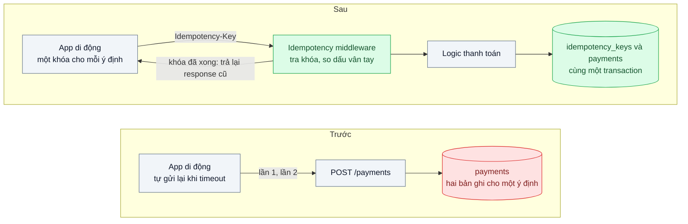
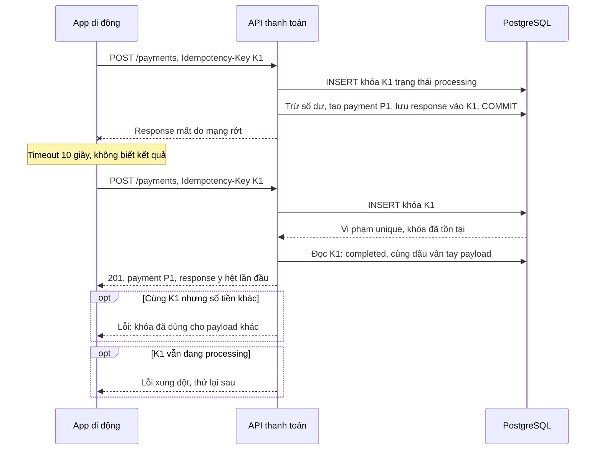

# Idempotency Key — Khách bấm "Thanh toán" hai lần vì mạng chập chờn, bị trừ tiền hai lần

| Scope | Mức độ | Trạng thái | Pattern gốc | Cập nhật |
|---|---|---|---|---|
| 01 · frontend / backend / transporter | 🟡 Trung bình | ✅ Hoàn thành | Idempotency Key — Stripe API "Idempotent requests"; IETF draft Idempotency-Key header | 2026-10-08 |

> **Một câu tóm tắt:** Client gắn một khóa duy nhất cho mỗi *ý định* thanh toán; server ghi khóa đó cùng transaction với giao dịch, nên request gửi lại lần hai, ba chỉ nhận lại kết quả của lần đầu thay vì tạo thêm một lần trừ tiền.

## 1. Bài toán thực tế (What)

**Bối cảnh** *(doanh nghiệp giả định, số liệu minh họa)*
Ví điện tử với khoảng 2 triệu người dùng hoạt động, 150.000 giao dịch thanh toán mỗi ngày, phần lớn từ app di động trên mạng 4G. API `POST /payments` trừ số dư ví và ghi nhận giao dịch cho merchant. App tự gửi lại request khi timeout 10 giây.

**Triệu chứng người kinh doanh nhìn thấy**
- Mỗi tuần khoảng 60 khiếu nại "bị trừ tiền hai lần"; đội đối soát mất nửa ngày tra log và hoàn tiền thủ công.
- Đánh giá app trên cửa hàng ứng dụng có nhiều phản hồi một sao nhắc tới "trừ tiền oan".
- Merchant nhận hai đơn thanh toán cho cùng một hóa đơn, phải tự liên hệ khách để hủy.

**Nguyên nhân kỹ thuật**
Server đã trừ tiền và commit, nhưng response bị mất trên đường về (mạng di động rớt, load balancer cắt kết nối). App không biết lần đầu thành công hay thất bại nên gửi lại, hoặc khách sốt ruột bấm thêm lần nữa. Với server, request thứ hai là một yêu cầu mới hoàn toàn: `POST` không idempotent theo ngữ nghĩa HTTP, và không có gì nối hai request với nhau.

**Ràng buộc**
- Không bỏ cơ chế tự gửi lại của app: retry là cần thiết trên mạng di động.
- Mỗi request gửi lại phải nhận *đúng* kết quả của lần đầu (cùng mã giao dịch), không phải một lỗi khó hiểu.
- Overhead thêm vào đường thanh toán phải nhỏ (vài mili giây).

## 2. Vì sao dùng pattern này (Why)

**Nguyên nhân gốc mà pattern nhắm vào:** server không phân biệt được "gửi lại cùng một ý định" với "một ý định mới", vì request không mang danh tính của ý định đó.

**Pattern giải quyết thế nào:** Client sinh một khóa ngẫu nhiên (UUID) khi khách mở màn hình xác nhận và gửi kèm mọi lần thử qua header `Idempotency-Key`. Server lưu khóa cùng dấu vân tay của payload trong bảng có ràng buộc duy nhất `(user_id, key)`. Lần đầu: chèn khóa ở trạng thái "đang xử lý", thực hiện nghiệp vụ, lưu response vào chính bản ghi đó *trong cùng transaction* với giao dịch. Lần sau cùng khóa: trả lại response đã lưu. Stripe mô tả đúng hành vi này cho API của họ, gồm cả việc báo lỗi khi cùng khóa đi kèm tham số khác. Bản nháp IETF chuẩn hóa tên header và gợi ý mã lỗi; bản mới nhất (-07, 15/10/2025, mục 2.7) ghi: thiếu khóa ở endpoint bắt buộc có khóa → 400, khóa dùng lại với payload khác → 422, gửi lại khi lần đầu còn đang xử lý → 409 (đều ở mức SHOULD). Lab làm theo đúng ba mã này.

**Lựa chọn khác đã cân nhắc**

| Lựa chọn | Giải quyết được gì | Vì sao không chọn (ở bài này) |
|---|---|---|
| Giữ nguyên + tối ưu nhỏ (khóa nút sau khi bấm, tăng timeout) | Giảm bấm đôi trên giao diện | Không xử lý được retry tự động của app và response mất trên mạng |
| Chặn trùng theo nội dung (cùng người, cùng số tiền, trong 1 phút) | Bắt phần lớn trùng lặp | Chặn nhầm hai lần mua thật giống nhau; không trả lại được kết quả lần đầu |
| Dùng mã hóa đơn của merchant làm khóa duy nhất | Hợp với thanh toán theo hóa đơn | Không phải luồng nào cũng có hóa đơn (nạp tiền, chuyển tiền) |
| Khóa Redis `SET NX` | Nhanh, chặn request đồng thời | Redis và PostgreSQL không chung transaction: trừ tiền xong mà ghi Redis lỗi vẫn trùng |
| Idempotency Key lưu trong PostgreSQL cùng transaction (chọn) | Đúng tuyệt đối trong một DB, trả lại response gốc | Thêm một bảng và một lần ghi; phải dọn khóa cũ |

## 3. Thiết kế hệ thống (How)

### 3.1 Kiến trúc trước và sau



### 3.2 Luồng chính



### 3.3 Thành phần và trách nhiệm

| Thành phần | Trách nhiệm | Quyết định thiết kế đáng chú ý |
|---|---|---|
| App di động | Sinh UUID khi mở màn hình xác nhận, giữ nguyên qua mọi lần thử | Khóa gắn với *ý định*, không sinh mới mỗi lần retry |
| Bảng `idempotency_keys` | Lưu khóa, dấu vân tay payload, trạng thái, mã và thân response | Khóa chính `(user_id, key)` để người dùng này không đụng khóa người khác; thân response lưu kiểu `text`, không `jsonb` |
| Middleware idempotency | Chèn khóa, phân nhánh theo trạng thái, phát lại response | Chỉ áp cho các endpoint ghi có tiền; bắt buộc header ở các endpoint đó. Lab: `IdempotencyInterceptor` của NestJS. Câu `INSERT` khóa tự commit trước transaction nghiệp vụ, để request trùng đến sau thấy "processing" và nhận 409 ngay thay vì đứng chờ khóa dòng |
| Transaction nghiệp vụ | Trừ tiền, tạo payment, cập nhật khóa thành completed | Một transaction duy nhất: hoặc có cả hai, hoặc không có gì |
| Job dọn khóa | Xóa khóa quá hạn lưu giữ | Thời hạn dài hơn cửa sổ retry lâu nhất của app |

### 3.4 Điểm dễ sai khi triển khai
- **Lưu khóa ngoài transaction nghiệp vụ.** Ghi payment xong rồi mới ghi khóa ở bước riêng: crash ở giữa là trùng. Khóa và dữ liệu phải commit cùng nhau.
- **Sinh khóa mới mỗi lần retry.** Lỗi phổ biến nhất phía client; khi đó pattern không có tác dụng. Test riêng cho hành vi của app.
- **Không so dấu vân tay payload.** Client lỗi gửi cùng khóa cho hai khoản khác nhau sẽ nhận nhầm kết quả cũ một cách im lặng.
- **Khóa kẹt ở "processing"** khi tiến trình chết giữa chừng (nếu xử lý tách nhiều transaction). Lưu thời điểm khóa và cho phép tiếp quản sau một khoảng an toàn.
- **Gọi cổng thanh toán bên ngoài** không nằm trong transaction DB. Truyền tiếp một khóa idempotency xuống cổng nếu cổng hỗ trợ, và ghi trạng thái từng bước để thử lại an toàn.

**Gặp thật khi làm lab** *(phép thử âm ở mục 5.1)*
- **`INSERT ... ON CONFLICT DO NOTHING` chỉ đúng khi có ràng buộc duy nhất.** Bỏ khóa chính `(user_id, idempotency_key)` thì câu lệnh không còn gì để đụng, mọi request đều "giành được" khóa: 9/17 test đỏ, trong đó 20 request đồng thời tạo 2 giao dịch.
- **Lưu response ngoài transaction không lộ ra ở kịch bản cắt response thuần.** Bản lỗi này vẫn cho 0 giao dịch thừa trên 1.000 lần cắt, vì response chỉ bị cắt sau khi khóa đã lưu xong. Nó chỉ lộ khi bước lưu khóa thất bại sau khi tiền đã trừ (test (e), lỗi giả lập bằng trigger). Kịch bản đo phải có cả lỗi giữa hai lần ghi, không chỉ lỗi mạng.
- **`jsonb` sắp lại thứ tự khóa và thêm khoảng trắng** (kiểm bằng `SELECT '{"paymentId":"1",...}'::jsonb::text`: `note` lên đầu, `paymentId` xuống giữa). Response phát lại từ cột `jsonb` sẽ khác byte lần đầu, nên lab lưu thân response bằng `text`.
- **Điều kiện `status = 'processing'` trong câu lưu response là lưới an toàn thứ hai.** Bỏ nhánh 409 (request trùng xử lý luôn) vẫn chỉ có 1 giao dịch, vì các request trùng đứng chờ khóa dòng ở câu `UPDATE` rồi cập nhật được 0 dòng và rollback. Đổi lại chúng nhận 500 thay vì 409.
- **Interceptor NestJS và `AsyncLocalStorage`:** gọi `next.handle()` bên trong `storage.run(trx, ...)` thì handler chạy trong ngữ cảnh có transaction (NestJS 10 bọc handler bằng `AsyncResource.bind` tại lúc gọi `handle()`). Test (e) chứng minh điều này: nếu service tự mở transaction riêng, test (e) đỏ giống phép thử âm #4.
- **Toxic `timeout` của Toxiproxy cần kết nối keep-alive.** Với `Connection: close`, API đóng kết nối ngay sau response, Toxiproxy đóng luôn phía client, nên client nhận "socket hang up" ngay thay vì phải chờ hết giờ.

## 4. Tech stack và tác động (Impact techstack)

| Lớp | Công nghệ chọn | Vì sao chọn | Thay thế tương đương |
|---|---|---|---|
| Database | PostgreSQL 16 | Unique constraint và `INSERT ... ON CONFLICT` cho phép phát hiện trùng nguyên tử | MySQL 8 với unique key |
| API | NestJS 10.4.22 interceptor (nền Express) | Gói logic idempotency quanh handler mà không sửa nghiệp vụ; transaction của interceptor đi tới service qua `AsyncLocalStorage` | Fastify hook `preHandler`/`onSend` |
| Truy cập dữ liệu | Kysely + transaction tường minh | Kiểm soát rõ ranh giới transaction | SQL thuần với `pg` |
| Dấu vân tay payload | SHA-256 của JSON đã chuẩn hóa thứ tự khóa | Rẻ, ổn định giữa các lần gửi | So sánh từng trường quan trọng |
| Tiêm lỗi mạng | Toxiproxy 2.12.0 (`ghcr.io/shopify/toxiproxy:2.12.0`, có arm64) | Cắt kết nối *sau khi* server xử lý xong để tái hiện "response mất": toxic `limit_data` 0 byte trên chiều downstream | `tc netem` |
| Test, đo | Vitest, k6 | k6 bắn nhiều request đồng thời cùng một khóa | autocannon |

**Ghi chú khi làm lab (2026-10-08):**
- Đúng stack dự kiến: NestJS 10.4.22, Kysely 0.29.6, `pg` 8.23.1, PostgreSQL 16.15, Node 20.19.6, Vitest 5.0.3, k6 1.4.2. Một app chạy cả hai bản để so trên cùng tiến trình: `POST /truoc/payments` (không có interceptor) và `POST /sau/payments` (có interceptor), cùng controller, cùng `PaymentsService`.
- "App di động" là một client Node (`src/shared/payment-client.ts`): gửi lại khi lỗi mạng, hết giờ, 409 hay 5xx; thời gian chờ rút từ 10 giây xuống 2 giây (bản cắt kết nối) và 300 ms (bản hết giờ). Người dùng lấy từ header `X-User-Id`, không làm xác thực (scope 19).
- Toxiproxy là dịch vụ mới của repo: cổng 58474 (API điều khiển) và 58401 (proxy tới API), đã thêm vào bảng cổng của skill. API chạy trên host; Toxiproxy trong container gọi ngược qua `host.docker.internal`.
- Response phát lại có thêm header `Idempotent-Replayed: true`. Header này do lab tự đặt để client và bộ đo nhận ra bản phát lại; bản nháp IETF và trang Stripe đã đối chiếu không định nghĩa nó.

**Thay đổi so với hệ thống hiện tại:** thêm một bảng, một interceptor, một job dọn dẹp; app di động đổi cách sinh và giữ khóa. Đội đối soát có thêm truy vấn "khóa nào đã phát lại" để trả lời khiếu nại.

## 5. Kết quả đầu ra và cách đo (Output impact)

| Chỉ số | Trước (minh họa) | Mục tiêu khi thực hành | Cách đo |
|---|---|---|---|
| Giao dịch trùng khi response bị cắt | 1 giao dịch thừa mỗi lần retry | 0 trên 1.000 lần thử | Toxiproxy cắt response, client retry; đếm `payments` theo khóa |
| Giao dịch trùng khi 20 request đồng thời cùng khóa | nhiều bản ghi | đúng 1 | k6 20 VU cùng một khóa; `SELECT count(*)` |
| Response phát lại giống lần đầu | không có | 100 % giống mã và thân | Test so sánh byte của response lần 1 và lần 2 |
| Overhead p95 của `POST /payments` | 0 | ≤ 5 ms | k6 so sánh p95 khi bật và tắt middleware |
| Khiếu nại "trừ tiền hai lần" | 60 mỗi tuần | không đo được trong lab | Chỉ số nghiệp vụ, theo dõi sau khi triển khai thật |

> Số "trước" là minh họa để hình dung bài toán. Số "mục tiêu" chỉ được coi là đạt khi có số đo thật
> ở mục 8 kèm môi trường đo.

### 5.1 Số đã đo

**Môi trường** *(đã đo, 2026-10-08, 22:08 – 22:40 giờ Việt Nam)*: MacBook Pro M1 Pro (8 nhân, 16 GB), macOS 26.6.2, nắp mở, `caffeinate -ims` suốt phiên. Lượt đầu (`main/cut.json`) bắt đầu khi chạy **pin** (61 %); người dùng cắm sạc giữa phần "trước" của lượt đó. Mọi lượt sau chạy **sạc** (63 % → 92 %). Sau khi cắm sạc, tiến trình nền của macOS (`photoanalysisd`, `mds_stores`) chạy nên load 1 phút của macOS ở mức 6 – 10, có lúc lên 21 – 33. Docker 28.5.1, máy ảo 8 CPU, 7,65 GiB RAM. PostgreSQL 16.15 cấu hình mặc định, Toxiproxy 2.12.0, Node v20.19.6, NestJS 10.4.22 (Express), Kysely 0.29.6, pg 8.23.1, k6 v1.4.2. API là một tiến trình Node trên macOS (pool 10 kết nối, gọi PostgreSQL qua cổng 55432); client đo, k6 và Toxiproxy chạy cùng máy. Container MySQL và RabbitMQ của dự án khác vẫn chạy nền. Không lượt nào có khoảng máy ngủ. Số thô ở `bench/results/` (không commit): `main/`, `overhead-2/`, `overhead-serial/`, `check/`.

**1. Cắt response sau khi server commit** (`bench/run-response-cut.ts`, seed 20261008). Mỗi bản 1.000 ý định thanh toán, chạy tuần tự vì toxic áp cho cả proxy. Người dùng (1 – 10.000), số tiền (1.000 – 500.000 đ) và merchant lấy từ PRNG có hạt, nên hai bản nhận cùng một chuỗi. Lần gửi 1 đi qua Toxiproxy đang bật toxic `limit_data` 0 byte ở chiều downstream: API nhận request, trừ tiền, commit, còn response bị bỏ và kết nối bị đóng (client nhận "socket hang up"). Trước lần gửi 2, toxic được tắt; client gửi lại cùng ý định, cùng `Idempotency-Key`. Cả hai bản dùng chung một client, đều gửi khóa; bản trước bỏ qua header này.

| Lượt (file) | Bản | Giao dịch / 1.000 ý định | Giao dịch thừa | Tiền trừ thừa | Ý định có > 1 giao dịch | Lần gửi lại nhận bản phát lại | Ý định không nhận được response nào |
|---|---|---|---|---|---|---|---|
| `main/cut-ac.json` (cả cặp chạy sạc) | trước | 2.020 | **1.020** | 255.583.000 đ | 1.000 | 0 | 6 |
| | sau | 1.000 | **0** | 0 đ | 0 | 988 | 12 |
| `main/cut.json` (đổi pin → sạc giữa bản trước) | trước | 2.037 | **1.037** | 257.958.000 đ | 1.000 | 0 | 12 |
| | sau | 1.000 | **0** | 0 đ | 0 | 994 | 6 |

- Ở bản trước, 993/1.000 ý định có đúng 2 giao dịch: lần gửi 1 đã commit, lần gửi lại là một lần trừ tiền mới. Số thừa vượt 1.000 vì có ý định mà mọi lần gửi đều không nhận được response (mục dưới): ở `cut-ac`, 6 ý định như vậy có 5 giao dịch mỗi ý định, 1 ý định có 4.
- Ở bản sau, mọi ý định có đúng 1 giao dịch, kể cả những ý định không nhận được response. Mọi response client nhận được mang đúng `paymentId` của giao dịch duy nhất trong DB.
- **Response mất ngoài kịch bản:** thỉnh thoảng cả 5 lần gửi của một ý định (mỗi lần chờ 2 giây) đều hết giờ dù toxic đã tắt, theo cụm 3 – 5 ý định liên tiếp. Request vẫn tới API, vì bản trước có 5 giao dịch cho những ý định này. Lượt đối chứng không bật toxic nào (`check/no-cut.json`, CUT_MODE=none) cũng gặp: bản trước 0/1.000, bản sau 6/1.000. Nên đây không phải tác dụng của việc bật/tắt toxic, mà nằm trên đường client → cổng 58401 của Docker Desktop → Toxiproxy → `host.docker.internal` → API. Nguyên nhân chưa tách riêng được (giống hiện tượng ở nhật ký 04/01 điểm 5). Với bài này, đó là thêm những lần "response mất", và bản sau vẫn không có giao dịch thừa.
- **Bản "hết giờ"** (`main/cut-timeout.json`, 200 ý định, toxic `timeout` 0 ms ở downstream nuốt response, client chờ 300 ms, kết nối keep-alive): bản trước có 528 giao dịch (328 thừa; 42 ý định không nhận được response nào); bản sau có 200 giao dịch, 200/200 lần gửi lại là bản phát lại.

**2. 20 request đồng thời giống hệt nhau** (`bench/run-concurrent.ts` + `concurrent-same-key.k6.js`, `main/concurrent.json`). 20 VU canh cùng một mốc đồng hồ (bội số 300 ms) rồi cùng gửi một request (cùng người dùng, cùng payload, cùng khóa); 50 vòng, mỗi vòng một ý định mới, 1.000 request mỗi bản, gửi thẳng tới API (không qua Toxiproxy):

| Bản | 201 | 409 | Trong số 201: bản phát lại | Giao dịch | Giao dịch thừa | Giao dịch mỗi ý định |
|---|---|---|---|---|---|---|
| trước | 1.000 | 0 | 0 | 1.000 | **950** | 20 ở cả 50 vòng |
| sau | 59 | 941 | 9 | 50 | **0** | 1 ở cả 50 vòng |

Ở bản sau, 941 request đến khi lần đầu còn "processing" nhận 409 kèm `Retry-After: 1`; 9 request đến sau khi lần đầu commit nhận bản phát lại.

**3. Response phát lại giống lần đầu.** Test (a) so từng byte thân response của lần 1 và lần 2 (cùng mã 201, thân bằng nhau, lần 2 có `Idempotent-Replayed: true`); test (c) kiểm mọi response 201 của 20 request đồng thời có cùng thân. Ở bench cắt response không so được với response lần 1 (nó đã bị cắt), nên bench kiểm `paymentId` trả về khớp giao dịch duy nhất trong DB: khớp ở mọi ý định có response.

**4. Overhead của interceptor** (`bench/run-overhead.ts` + `payment-latency.k6.js`). Cùng app, cùng handler; `/truoc/payments` không có interceptor, `/sau/payments` có. Mỗi request là một ý định mới (khóa mới), người dùng chọn theo hàm băm của số thứ tự request. 3 vòng xoay thứ tự (trước → sau, sau → trước, trước → sau). Bước nào có `dropped_iterations` > 0 thì không dùng (nhật ký 08/02 điểm 3). Thời gian một vòng `SELECT 1` từ host qua cổng 55432: trung vị 0,24 – 0,27 ms tuần tự, 0,52 – 0,78 ms với 10 luồng song song.

*Một request nối tiếp một request* (1 VU, 5 s làm nóng + 20 s đo mỗi bước, `overhead-serial/overhead.json`, load 6,0 – 7,5):

| Vòng | Trước: trung vị / p95 | Sau: trung vị / p95 | Chênh trung vị | Chênh p95 |
|---|---|---|---|---|
| 1 | 1,70 / 2,54 ms | 2,67 / 3,83 ms | +0,97 ms | +1,28 ms |
| 2 | 1,94 / 3,35 ms | 2,71 / 4,41 ms | +0,77 ms | +1,07 ms |
| 3 | 1,77 / 2,85 ms | 2,74 / 4,21 ms | +0,97 ms | +1,36 ms |

Trung vị 3 vòng: p95 2,85 ms (2,54 – 3,35) so với 4,21 ms (3,83 – 4,41), chênh **+1,28 ms** (1,07 – 1,36). Chênh lệch ổn định và lớn hơn dao động giữa các vòng. Nó khớp với phần việc thêm: bản sau có thêm hai câu lệnh (câu `INSERT` giành khóa tự commit, câu `UPDATE` lưu response) và một lần commit nữa, mỗi vòng gọi DB khoảng 0,25 ms. Phần nào do commit thêm thì chưa tách riêng được.

*Tải cố định 200 request/s* (10 s làm nóng + 30 s đo, mô hình mở; `main/overhead.json`, `overhead-2/overhead.json`, load 6,4 – 9,9, riêng bước cuối của lượt đầu lên 23,6):

| Lượt | Vòng | Trước: trung vị / p95 | Sau: trung vị / p95 | Chênh trung vị | Chênh p95 |
|---|---|---|---|---|---|
| `main` | 1 | 3,19 / 9,68 ms | 3,92 / 25,82 ms | +0,73 ms | +16,1 ms |
| `main` | 2 | 2,86 / 4,34 ms | 3,70 / 12,39 ms | +0,84 ms | +8,1 ms |
| `overhead-2` | 3 | 3,06 / 4,76 ms | 3,60 / 6,57 ms | +0,54 ms | +1,8 ms |

Ba bước bị bỏ vì k6 bỏ iteration: `main` vòng 3 bản sau (132, load 23,6), `overhead-2` vòng 1 bản sau (3) và vòng 2 bản trước (21), kéo theo cặp của chúng (bản trước của `main` vòng 3 có p95 12,63 ms; của `overhead-2` vòng 1 là 8,54 ms). Ở 200 request/s, chênh trung vị ổn định (+0,5 – 0,9 ms), nhưng p95 của chính bản trước đã dao động 4,3 – 12,6 ms giữa các vòng, và chênh p95 dao động từ +1,8 đến +16 ms. Ở mọi vòng dùng được, p95 của bản sau đều cao hơn, nhưng độ lớn thì không đọc được trên máy đang bận này.

**5. Phép thử âm** (`bench/negative-drills.ts`, `main/drills/summary.json`). Script sửa mã nguồn thật, chạy toàn bộ 17 test, khôi phục, rồi so lại nội dung file (khớp). Lượt gốc: 0/17 test đỏ. Phép thử #4 và #7 chạy thêm bench cắt response (bản sau, 1.000 ý định) trên mã nguồn đã gỡ.

| # | Gỡ hoặc phá | Test đỏ | Chỗ đỏ | Bench cắt response (bản sau) |
|---|---|---|---|---|
| 1 | Bỏ ràng buộc duy nhất `(user_id, idempotency_key)` (và `ON CONFLICT` không còn cột đích) | 9/17 | (a) tuần tự: lần gửi lại chạy lại nghiệp vụ, response khác lần đầu; 20 request đồng thời tạo 2 giao dịch; request trùng lúc processing không nhận 409; (b) cả hai test; (d); lỗi 402 không được phát lại; cắt response qua Toxiproxy không có bản phát lại; tiếp quản khóa kẹt trả 500 | |
| 2 | Bỏ so dấu vân tay | 1/17 | (b): cùng khóa khác số tiền nhận 201 (bản phát lại im lặng của khoản cũ) thay vì 422 | |
| 3 | Khóa không gắn người dùng: khóa chính `(idempotency_key)`, tra không lọc `user_id` | 1/17 | (d): request của người dùng B nhận bản phát lại (`Idempotent-Replayed: true`) thay vì một giao dịch của chính B | |
| 4 | Lưu response ngoài transaction nghiệp vụ | 1/17 | (e): lần lưu response đầu lỗi khi tiền đã trừ, trước lần gửi lại đã có 1 giao dịch, gửi lại tạo giao dịch thứ hai | 1.000 giao dịch, **0 thừa**, 987 bản phát lại |
| 5 | Bỏ nhánh 409 (đang processing thì xử lý luôn) | 2/17 | (c): 20 request đồng thời vẫn chỉ 1 giao dịch nhưng có request nhận 500; request trùng khi lần đầu đang processing đứng chờ tới hết giờ 10 s | |
| 6 | Không tiếp quản khóa kẹt processing | 1/17 | khóa kẹt từ 1 giờ trước trả 409 mãi | |
| 7 | Client sinh khóa mới cho mỗi lần gửi lại | 2/17 | test client; cắt response qua Toxiproxy không có bản phát lại | 2.039 giao dịch, **1.039 thừa**, 0 bản phát lại |

Phép thử #4 cho thấy kịch bản cắt response chỉ kiểm được một phần của pattern: lỗi "lưu response ngoài transaction" vẫn cho 0 giao dịch thừa trên 1.000 lần cắt, vì response chỉ bị cắt sau khi khóa đã lưu xong; chỉ test (e), có lỗi chen giữa hai lần ghi, mới bắt được nó. Phép thử #5: điều kiện `status = 'processing'` ở câu lưu response chặn được giao dịch thừa (các request trùng cập nhật được 0 dòng và rollback), nhưng khách nhận 500.

**Đối chiếu mục tiêu ở bảng mục 5**
- Giao dịch trùng khi response bị cắt = 0 trên 1.000 lần thử: bản sau 0 ở cả hai lượt 1.000 ý định (và 0 ở bản hết giờ, 200 ý định), bản trước 1.020 và 1.037. **Đạt.**
- 20 request đồng thời cùng khóa → đúng 1 giao dịch: 50/50 vòng có đúng 1 giao dịch; bản trước 20 mỗi vòng. **Đạt.**
- Response phát lại giống lần đầu 100 % (mã và thân): test (a) so byte, test (c), bench khớp `paymentId`. **Đạt.**
- Overhead p95 ≤ 5 ms: ở một request nối tiếp một request, +1,28 ms (1,07 – 1,36). **Đạt** ở mô hình này. Ở 200 request/s, chênh p95 +1,8 đến +16 ms tùy vòng trong lúc load 6 – 10: **chưa kết luận được**, cần đo lại trên máy yên.
- Khiếu nại "trừ tiền hai lần": không đo trong lab.

**Chạy lại từ đầu** (22:44 – 22:46, sạc 94 %, load 8 – 11; `bench/results/recheck/`): `docker compose down -v`, xóa `node_modules`, rồi làm theo "Cách chạy" ở mục 8 với tham số ngắn: `pnpm install --frozen-lockfile`, `pnpm typecheck`, `pnpm test` (17/17), cắt response 100 ý định (trước 200 giao dịch, sau 100 giao dịch và 100 bản phát lại, 0 ý định mất response), bản hết giờ 20 ý định (40 so với 20), đồng thời 5 vòng (trước 100 giao dịch, sau 5; 88 request nhận 409), overhead 1 VU một vòng 5 s (p95 3,84 so với 6,10 ms ở load 10 – 11), phép thử âm với bench 100 ý định (cùng số test đỏ như lượt chính; #4 0 thừa, #7 100 thừa), `pnpm job:cleanup`. Cùng kết luận với lượt chính.

**Hạn chế:** client, API, Toxiproxy, k6 và PostgreSQL chung một laptop đang bận; lượt cắt response đầu đổi nguồn điện giữa chừng (nên chạy lại cả cặp ở `cut-ac`). Client là script Node, không phải app di động; thời gian chờ rút còn 2 s và 300 ms. Ý định chạy tuần tự, không có hai ý định của cùng một người dùng chạy song song. Lab không gọi cổng thanh toán bên ngoài, nên chưa kiểm phần "truyền khóa xuống cổng" ở mục 3.4. Đường đi qua Docker Desktop thỉnh thoảng nuốt response (khoảng 0,6 – 1,3 % ý định ở mỗi lượt 1.000) mà chưa rõ nguyên nhân.

**Tác động nghiệp vụ mong đợi:** không còn trừ tiền hai lần do mạng, giảm khối lượng hoàn tiền thủ công và giữ niềm tin của khách vào ví.

## 6. Đánh đổi và khi KHÔNG nên dùng

**Đánh đổi**
- Thêm một lần ghi DB cho mỗi request có tiền và một bảng phải dọn dẹp. Lab đo được: hai câu lệnh và một lần commit thêm, p95 tăng khoảng 1,3 ms khi gửi nối tiếp (mục 5.1); 81.214 khóa sau các lượt đo chiếm 44 MB (33 MB bảng, 11 MB index), thân response trung bình 185 byte.
- Lưu response nghĩa là lưu thêm dữ liệu nhạy cảm; cần thời hạn lưu giữ và quyền truy cập hợp lý.
- Client phải được viết đúng; lỗi phía client làm pattern vô hiệu mà server không biết.

**Không nên dùng khi**
- Thao tác vốn idempotent theo ngữ nghĩa (`PUT` đặt giá trị tuyệt đối, `DELETE` theo id): thêm khóa là thừa.
- Thao tác không có tác dụng phụ đáng kể (ghi log xem trang): trùng vài bản ghi không gây hại.
- Tiêu thụ message từ queue: dùng Idempotent Consumer với message id (scope 14) thay vì header HTTP.

**Liên quan**
- Cùng chủ đề: `../../14-backend-queueing/04-idempotent-consumer-event-den-hai-lan-tru-kho-hai-lan/` — phía nhận message.
- Đọc trước: `../../07-backend-microservices/04-timeout-retry-backoff-jitter-retry-dong-loat-tao-bao-moi/` — retry chỉ an toàn khi đích idempotent.
- Cùng chủ đề: `../../13-backend-transporter/04-webhook-delivery-doi-tac-down-5-phut-mat-su-kien/` — webhook gửi lại cần khóa chống trùng ở phía nhận.
- Đọc sau: `../05-api-gateway-mobile-goi-bay-service/` — gateway có thể kiểm tra sự có mặt của header.

## 7. Cơ sở tham khảo

- Stripe API Reference, "Idempotent requests" — https://docs.stripe.com/api/idempotent_requests — hành vi tham chiếu (đã đối chiếu 2026-10-08): lưu mã trạng thái và thân response của request đầu, kể cả khi lỗi; so tham số với request gốc và báo lỗi nếu khác; khóa có thể xóa khi đã ít nhất 24 giờ; không lưu kết quả khi request lỗi validate hoặc xung đột với request khác đang chạy; khóa dài tối đa 255 ký tự.
- IETF draft, "The Idempotency-Key HTTP Header Field" (draft-ietf-httpapi-idempotency-key-header-07, 15/10/2025, J. Jena và S. Dalal) — https://datatracker.ietf.org/doc/draft-ietf-httpapi-idempotency-key-header/ — giá trị header là Structured Field kiểu String (mục 2.1); bên cung cấp API tự định nghĩa phạm vi duy nhất của khóa (mục 2.2) và nên công bố chính sách hết hạn (mục 2.3); mã lỗi 400 / 422 / 409 (mục 2.7). Datatracker ghi bản nháp đã hết hạn (18/4/2026) và chưa thành RFC.
- Brandur Leach, "Implementing Stripe-like Idempotency Keys in Postgres" (2017) — https://brandur.org/idempotency-keys — bảng `idempotency_keys` với `locked_at`, khóa duy nhất `(user_id, idempotency_key)`, 409 khi khóa đang bị giữ, "atomic phases" và reaper xóa khóa cũ (bài gợi ý khoảng 72 giờ). Lab lấy thiết kế bảng và cách tiếp quản khóa kẹt từ bài này, bỏ phần recovery point vì nghiệp vụ của lab không gọi dịch vụ bên ngoài.
- Amazon Builders' Library, "Making retries safe with idempotent APIs" — https://aws.amazon.com/builders-library/ — vì sao retry cần token do client sinh và trả lại kết quả tương đương.
- PostgreSQL docs, "INSERT" (mệnh đề `ON CONFLICT`) — https://www.postgresql.org/docs/current/sql-insert.html — cơ chế phát hiện trùng nguyên tử.

## 8. Kế hoạch thực hành

- [x] Bước 1: dựng API `POST /payments` trừ số dư ví trên PostgreSQL; client giả lập retry khi timeout; Toxiproxy giữa client và API.
- [x] Bước 2: đo "trước": cắt response sau khi server commit, chạy 1.000 lần; k6 20 request đồng thời giống nhau; đếm giao dịch thừa.
- [x] Bước 3: thêm bảng `idempotency_keys`, interceptor, lưu response cùng transaction, job dọn khóa.
- [x] Bước 4: đo "sau" cùng kịch bản, thêm đo overhead p95; ghi số thật và môi trường vào mục 5.
- [x] Bước 5: viết test: (a) hai request cùng khóa chỉ tạo một giao dịch và nhận cùng response; (b) cùng khóa khác số tiền bị từ chối; (c) request trùng khi lần đầu còn processing bị báo xung đột; (d) khóa của người dùng A không ảnh hưởng người dùng B. Thêm (e) lỗi khi lưu response sau khi đã trừ tiền, job dọn khóa, client giữ khóa qua các lần gửi lại, và kịch bản cắt response qua Toxiproxy.

**Cấu trúc code thật** *(lệch so với dự kiến: tách `truoc/` / `sau/` / `shared/` theo quy ước lab; một app chạy cả hai bản)*
```text
src/
  main.ts, app.module.ts, shared/db.ts      # một app NestJS, hai route: /truoc/payments và /sau/payments
  shared/transaction-context.ts             # AsyncLocalStorage: service dùng transaction của interceptor nếu có
  shared/payments.service.ts                # trừ số dư có điều kiện + ghi payment (dùng chung hai bản)
  shared/payment-input.ts                   # validate body, header X-User-Id
  shared/payment-client.ts                  # client giả lập app: một khóa cho mỗi ý định, gửi lại khi lỗi
  truoc/payments.controller.ts, sau/payments.controller.ts   # cùng handler; bản sau thêm @UseInterceptors(IdempotencyInterceptor)
  sau/idempotency/idempotency.interceptor.ts   # [PATTERN] giành khóa, 422/409/phát lại, lưu response cùng transaction
  sau/idempotency/idempotency.repository.ts    # [PATTERN] INSERT ... ON CONFLICT, tiếp quản, lưu, nhả, dọn
  sau/idempotency/request-fingerprint.ts       # [PATTERN] SHA-256 của method + path + body chuẩn hóa; đọc header
  sau/idempotency/cleanup-expired-keys.job.ts  # job dọn khóa theo lô (trong tiến trình hoặc `pnpm job:cleanup`)
db/schema.sql, db/seed.sql                  # schema dùng chung cho public và lab_test; 10.000 ví
toxiproxy/toxiproxy.json                    # proxy payments_api: 58401 → host.docker.internal:3100
test/                                       # 17 test, schema riêng lab_test, không cần seed: (a) same-key-creates-one-payment,
                                            # (b) same-key-different-payload-rejected, (c) concurrent-same-key, (d) keys-scoped-per-user,
                                            # (e) failure-after-debit, response-cut-through-toxiproxy, cleanup-expired-keys, payment-client-retry
bench/                                      # run-response-cut.ts, run-concurrent.ts + concurrent-same-key.k6.js,
                                            # run-overhead.ts + payment-latency.k6.js, negative-drills.ts (7 phép thử âm)
docker-compose.yml                          # postgres:16.15 (55432), ghcr.io/shopify/toxiproxy:2.12.0 (58474, 58401)
```

**Cách chạy** *(đã chạy lại từ đầu ngày 2026-10-08, Node 20.19.6, pnpm 10.32.0, k6 1.4.2)*
```bash
docker pull ghcr.io/shopify/toxiproxy:2.12.0     # image mới của repo (khoảng 7 MB, có arm64)
docker compose down -v                            # volume sạch
docker compose up -d --wait                       # PostgreSQL 55432 (schema + 10.000 ví), Toxiproxy 58474 / 58401
pnpm install --frozen-lockfile
pnpm typecheck
pnpm test                                         # 17 test; cần cả PostgreSQL và Toxiproxy, không cần seed

# Đo (API tự khởi động ở cổng 3100; tắt `pnpm dev` trước). Kết quả ở bench/results/$RUN/ (không commit).
RUN=main N=1000 SEED=20261008 pnpm bench:cut                  # cắt response bằng limit_data, 1.000 ý định mỗi bản
RUN=main N=200 CUT_MODE=timeout TIMEOUT_MS=300 OUT=cut-timeout pnpm bench:cut   # response bị nuốt, client hết giờ
RUN=main ROUNDS=50 pnpm bench:concurrent                      # 20 VU cùng khóa × 50 vòng
RUN=main pnpm bench:overhead                                  # 3 vòng × (10 s làm nóng + 30 s đo), 200 request/s
RUN=overhead-serial VUS=1 WARMUP=5s DURATION=20s pnpm bench:overhead   # cùng 3 vòng, 1 VU gửi nối tiếp
RUN=main DRILL_CUT_N=1000 pnpm bench:drills                   # 7 phép thử âm, khôi phục mã nguồn sau mỗi phép

pnpm job:cleanup                                  # dọn khóa quá IDEMPOTENCY_RETENTION_HOURS (mặc định 24)
docker compose down -v
```

## Bài học sau khi làm

- **Kịch bản "cắt response" chỉ kiểm được một nửa pattern.** Toxiproxy chứng minh rõ triệu chứng: bản trước có 1.020 giao dịch thừa trên 1.000 lần cắt, bản sau 0. Nhưng lỗi "lưu response ngoài transaction" cũng cho 0 thừa ở đúng kịch bản đó (phép thử âm #4), vì response bị cắt sau khi khóa đã lưu. Muốn bắt lỗi này phải chèn lỗi *giữa hai lần ghi*. Lab dùng trigger trong schema test và một sequence (không rollback theo transaction) để lần lưu đầu thất bại, lần sau qua; không cần móc test trong mã nguồn.
- **Câu giành khóa tự commit trước transaction nghiệp vụ** để request trùng thấy "processing" và nhận 409 ngay (941/1.000 request ở lượt đồng thời), thay vì đứng chờ khóa dòng và chiếm kết nối của pool. Cái giá là một lần commit nữa (p95 +1,3 ms khi gửi nối tiếp) và phải tiếp quản khóa kẹt (test và phép thử âm #6). Điều kiện `status = 'processing'` ở câu lưu response là lưới an toàn thứ hai: phép thử âm #5 bỏ nhánh 409 mà vẫn chỉ 1 giao dịch, nhưng khách nhận 500.
- **Phát lại "giống hệt" cần lưu thân response nguyên chuỗi.** `jsonb` sắp lại khóa và thêm khoảng trắng, nên lab dùng `text`. Lỗi validate (400) không lưu và nhả khóa; lỗi nghiệp vụ (402 số dư không đủ) được lưu và phát lại kể cả sau khi ví đã nạp thêm tiền, giống mô tả của Stripe.
- **Đường đi qua Docker Desktop thỉnh thoảng nuốt response** theo cụm vài ý định liên tiếp (0,6 – 1,3 % ý định mỗi lượt), cả khi không bật toxic nào. Vì vậy bench đếm giao dịch trong DB theo mã ý định, không suy từ response client nhận được, và ghi riêng số ý định không nhận được response. Lượt thử đầu ở chế độ `timeout` hỏng theo kiểu khác: cả 20 ý định hết giờ ở mọi lần gửi và request cũng không tới server (bản trước chỉ có 1 giao dịch); ba lần chạy lại không gặp lại. File thô của lượt thử đó đã bị lượt thử sau ghi đè (cùng tên `trial/cut-timeout.json`), nên chỉ còn ghi chép này.
- **Đổi nguồn điện và máy bận làm hỏng số độ trễ, không làm hỏng số đếm.** Người dùng cắm sạc giữa lượt cắt response đầu, nên cả cặp được chạy lại (`cut-ac`); kết luận không đổi. Sau khi cắm sạc, tiến trình nền của macOS đẩy load lên 6 – 10 suốt phần còn lại của phiên: hai lượt 200 request/s có 3 bước phải bỏ vì k6 bỏ iteration, p95 của bản trước dao động 4,3 – 12,6 ms. Lượt gửi nối tiếp (1 VU) cho chênh lệch ổn định giữa các vòng. Khi đo overhead nhỏ trên máy bận, nên chạy kèm mô hình đóng 1 VU.
- **Kiểu của Express:** `import type { Request } from 'express'` trong lab pnpm phân giải nhầm sang `~/node_modules/express` trên máy này (TS7016), vì `express` không phải dependency trực tiếp. Interceptor tự khai báo hai interface nhỏ thay vì thêm `@types/express`.
- **Toxiproxy 2.12:** image không có shell, healthcheck gọi `/toxiproxy-cli list`; sửa proxy bằng `PATCH` (log báo `POST` đã cũ); toxic áp cho mọi kết nối của proxy nên các ý định phải chạy tuần tự, hoặc mỗi luồng một proxy (chưa thử).

