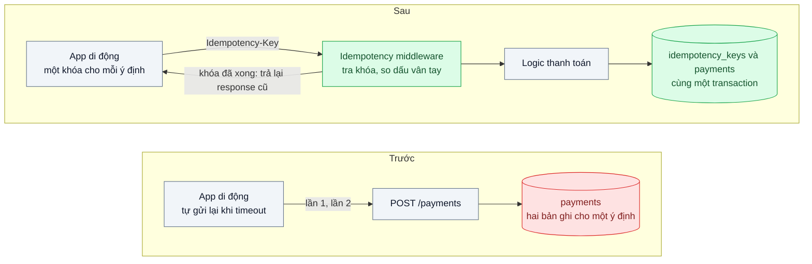
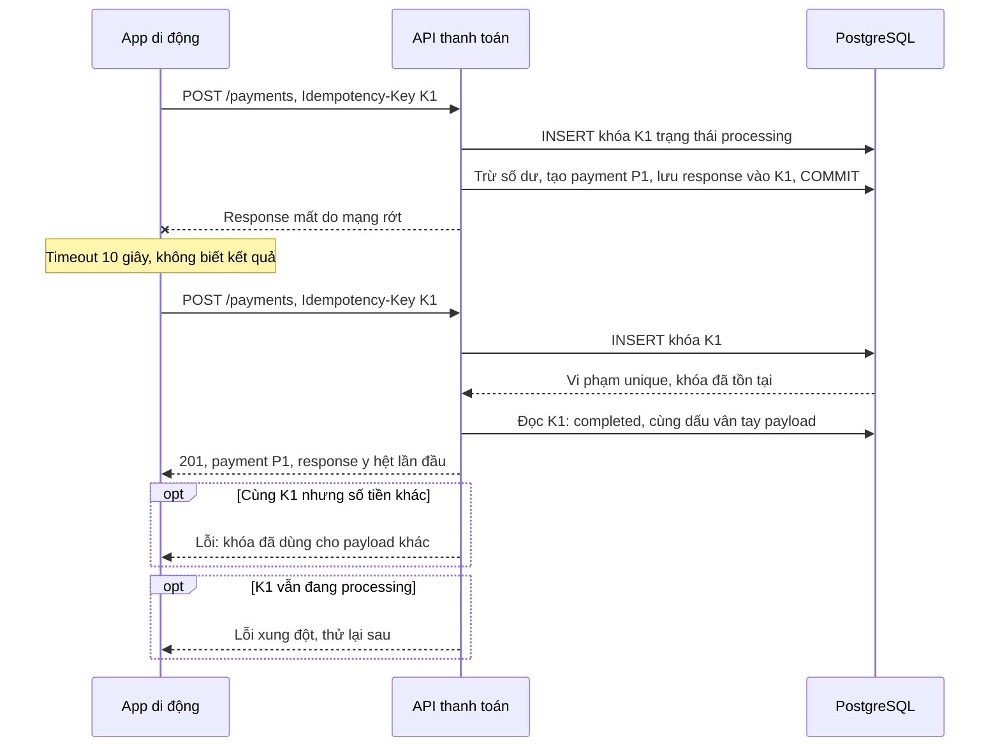

# Idempotency Key — Khách bấm "Thanh toán" hai lần vì mạng chập chờn, bị trừ tiền hai lần

| Scope | Mức độ | Trạng thái | Pattern gốc | Cập nhật |
|---|---|---|---|---|
| 01 · frontend / backend / transporter | 🟡 Trung bình | 📋 Kế hoạch | Idempotency Key — Stripe API "Idempotent requests"; IETF draft Idempotency-Key header | 2026-10-06 |

> **Một câu tóm tắt:** Client gắn một khóa duy nhất cho mỗi *ý định* thanh toán; server ghi khóa đó cùng transaction với giao dịch, nên request gửi lại lần hai, ba chỉ nhận lại kết quả của lần đầu thay vì tạo thêm một lần trừ tiền.

## 1. Bài toán thực tế (What)

**Bối cảnh** *(doanh nghiệp giả định, số liệu minh họa)*
Ví điện tử với khoảng 2 triệu người dùng hoạt động, 150.000 giao dịch thanh toán mỗi ngày, phần lớn từ app di động trên mạng 4G. API `POST /payments` trừ số dư ví và ghi nhận giao dịch cho merchant. App tự gửi lại request khi timeout 10 giây.

**Triệu chứng người kinh doanh nhìn thấy**
- Mỗi tuần khoảng 60 khiếu nại "bị trừ tiền hai lần"; đội đối soát mất nửa ngày tra log và hoàn tiền thủ công.
- Đánh giá app trên cửa hàng ứng dụng có nhiều phản hồi một sao nhắc tới "trừ tiền oan".
- Merchant nhận hai đơn thanh toán cho cùng một hóa đơn, phải tự liên hệ khách để hủy.

**Nguyên nhân kỹ thuật**
Server đã trừ tiền và commit, nhưng response bị mất trên đường về (mạng di động rớt, load balancer cắt kết nối). App không biết lần đầu thành công hay thất bại nên gửi lại, hoặc khách sốt ruột bấm thêm lần nữa. Với server, request thứ hai là một yêu cầu mới hoàn toàn: `POST` không idempotent theo ngữ nghĩa HTTP, và không có gì nối hai request với nhau.

**Ràng buộc**
- Không bỏ cơ chế tự gửi lại của app: retry là cần thiết trên mạng di động.
- Mỗi request gửi lại phải nhận *đúng* kết quả của lần đầu (cùng mã giao dịch), không phải một lỗi khó hiểu.
- Overhead thêm vào đường thanh toán phải nhỏ (vài mili giây).

## 2. Vì sao dùng pattern này (Why)

**Nguyên nhân gốc mà pattern nhắm vào:** server không phân biệt được "gửi lại cùng một ý định" với "một ý định mới", vì request không mang danh tính của ý định đó.

**Pattern giải quyết thế nào:** Client sinh một khóa ngẫu nhiên (UUID) khi khách mở màn hình xác nhận và gửi kèm mọi lần thử qua header `Idempotency-Key`. Server lưu khóa cùng dấu vân tay của payload trong bảng có ràng buộc duy nhất `(user_id, key)`. Lần đầu: chèn khóa ở trạng thái "đang xử lý", thực hiện nghiệp vụ, lưu response vào chính bản ghi đó *trong cùng transaction* với giao dịch. Lần sau cùng khóa: trả lại response đã lưu. Stripe mô tả đúng hành vi này cho API của họ, gồm cả việc báo lỗi khi cùng khóa đi kèm tham số khác. Bản nháp IETF chuẩn hóa tên header và gợi ý mã lỗi: request trùng khi lần đầu chưa xong, và khóa dùng lại với payload khác (chi tiết mã lỗi theo bản nháp, cần xác minh phiên bản).

**Lựa chọn khác đã cân nhắc**

| Lựa chọn | Giải quyết được gì | Vì sao không chọn (ở bài này) |
|---|---|---|
| Giữ nguyên + tối ưu nhỏ (khóa nút sau khi bấm, tăng timeout) | Giảm bấm đôi trên giao diện | Không xử lý được retry tự động của app và response mất trên mạng |
| Chặn trùng theo nội dung (cùng người, cùng số tiền, trong 1 phút) | Bắt phần lớn trùng lặp | Chặn nhầm hai lần mua thật giống nhau; không trả lại được kết quả lần đầu |
| Dùng mã hóa đơn của merchant làm khóa duy nhất | Hợp với thanh toán theo hóa đơn | Không phải luồng nào cũng có hóa đơn (nạp tiền, chuyển tiền) |
| Khóa Redis `SET NX` | Nhanh, chặn request đồng thời | Redis và PostgreSQL không chung transaction: trừ tiền xong mà ghi Redis lỗi vẫn trùng |
| Idempotency Key lưu trong PostgreSQL cùng transaction (chọn) | Đúng tuyệt đối trong một DB, trả lại response gốc | Thêm một bảng và một lần ghi; phải dọn khóa cũ |

## 3. Thiết kế hệ thống (How)

### 3.1 Kiến trúc trước và sau



### 3.2 Luồng chính



### 3.3 Thành phần và trách nhiệm

| Thành phần | Trách nhiệm | Quyết định thiết kế đáng chú ý |
|---|---|---|
| App di động | Sinh UUID khi mở màn hình xác nhận, giữ nguyên qua mọi lần thử | Khóa gắn với *ý định*, không sinh mới mỗi lần retry |
| Bảng `idempotency_keys` | Lưu khóa, dấu vân tay payload, trạng thái, mã và thân response | Khóa chính `(user_id, key)` để người dùng này không đụng khóa người khác |
| Middleware idempotency | Chèn khóa, phân nhánh theo trạng thái, phát lại response | Chỉ áp cho các endpoint ghi có tiền; bắt buộc header ở các endpoint đó |
| Transaction nghiệp vụ | Trừ tiền, tạo payment, cập nhật khóa thành completed | Một transaction duy nhất: hoặc có cả hai, hoặc không có gì |
| Job dọn khóa | Xóa khóa quá hạn lưu giữ | Thời hạn dài hơn cửa sổ retry lâu nhất của app |

### 3.4 Điểm dễ sai khi triển khai
- **Lưu khóa ngoài transaction nghiệp vụ.** Ghi payment xong rồi mới ghi khóa ở bước riêng: crash ở giữa là trùng. Khóa và dữ liệu phải commit cùng nhau.
- **Sinh khóa mới mỗi lần retry.** Lỗi phổ biến nhất phía client; khi đó pattern không có tác dụng. Test riêng cho hành vi của app.
- **Không so dấu vân tay payload.** Client lỗi gửi cùng khóa cho hai khoản khác nhau sẽ nhận nhầm kết quả cũ một cách im lặng.
- **Khóa kẹt ở "processing"** khi tiến trình chết giữa chừng (nếu xử lý tách nhiều transaction). Lưu thời điểm khóa và cho phép tiếp quản sau một khoảng an toàn.
- **Gọi cổng thanh toán bên ngoài** không nằm trong transaction DB. Truyền tiếp một khóa idempotency xuống cổng nếu cổng hỗ trợ, và ghi trạng thái từng bước để thử lại an toàn.

## 4. Tech stack và tác động (Impact techstack)

| Lớp | Công nghệ chọn | Vì sao chọn | Thay thế tương đương |
|---|---|---|---|
| Database | PostgreSQL 16 | Unique constraint và `INSERT ... ON CONFLICT` cho phép phát hiện trùng nguyên tử | MySQL 8 với unique key |
| API | NestJS 10 interceptor | Gói logic idempotency quanh handler mà không sửa nghiệp vụ | Fastify hook `preHandler`/`onSend` |
| Truy cập dữ liệu | Kysely + transaction tường minh | Kiểm soát rõ ranh giới transaction | SQL thuần với `pg` |
| Dấu vân tay payload | SHA-256 của JSON đã chuẩn hóa thứ tự khóa | Rẻ, ổn định giữa các lần gửi | So sánh từng trường quan trọng |
| Tiêm lỗi mạng | Toxiproxy | Cắt kết nối *sau khi* server xử lý xong để tái hiện "response mất" | `tc netem` |
| Test, đo | Vitest, k6 | k6 bắn nhiều request đồng thời cùng một khóa | autocannon |

**Thay đổi so với hệ thống hiện tại:** thêm một bảng, một interceptor, một job dọn dẹp; app di động đổi cách sinh và giữ khóa. Đội đối soát có thêm truy vấn "khóa nào đã phát lại" để trả lời khiếu nại.

## 5. Kết quả đầu ra và cách đo (Output impact)

| Chỉ số | Trước (minh họa) | Mục tiêu khi thực hành | Cách đo |
|---|---|---|---|
| Giao dịch trùng khi response bị cắt | 1 giao dịch thừa mỗi lần retry | 0 trên 1.000 lần thử | Toxiproxy cắt response, client retry; đếm `payments` theo khóa |
| Giao dịch trùng khi 20 request đồng thời cùng khóa | nhiều bản ghi | đúng 1 | k6 20 VU cùng một khóa; `SELECT count(*)` |
| Response phát lại giống lần đầu | không có | 100 % giống mã và thân | Test so sánh byte của response lần 1 và lần 2 |
| Overhead p95 của `POST /payments` | 0 | ≤ 5 ms | k6 so sánh p95 khi bật và tắt middleware |
| Khiếu nại "trừ tiền hai lần" | 60 mỗi tuần | không đo được trong lab | Chỉ số nghiệp vụ, theo dõi sau khi triển khai thật |

> Số "trước" là minh họa để hình dung bài toán. Số "mục tiêu" chỉ được coi là đạt khi có số đo thật
> ở mục 8 kèm môi trường đo.

**Tác động nghiệp vụ mong đợi:** không còn trừ tiền hai lần do mạng, giảm khối lượng hoàn tiền thủ công và giữ niềm tin của khách vào ví.

## 6. Đánh đổi và khi KHÔNG nên dùng

**Đánh đổi**
- Thêm một lần ghi DB cho mỗi request có tiền và một bảng phải dọn dẹp.
- Lưu response nghĩa là lưu thêm dữ liệu nhạy cảm; cần thời hạn lưu giữ và quyền truy cập hợp lý.
- Client phải được viết đúng; lỗi phía client làm pattern vô hiệu mà server không biết.

**Không nên dùng khi**
- Thao tác vốn idempotent theo ngữ nghĩa (`PUT` đặt giá trị tuyệt đối, `DELETE` theo id): thêm khóa là thừa.
- Thao tác không có tác dụng phụ đáng kể (ghi log xem trang): trùng vài bản ghi không gây hại.
- Tiêu thụ message từ queue: dùng Idempotent Consumer với message id (scope 14) thay vì header HTTP.

**Liên quan**
- Cùng chủ đề: `../../14-backend-queueing/04-idempotent-consumer-event-den-hai-lan-tru-kho-hai-lan/` — phía nhận message.
- Đọc trước: `../../07-backend-microservices/04-timeout-retry-backoff-jitter-retry-dong-loat-tao-bao-moi/` — retry chỉ an toàn khi đích idempotent.
- Cùng chủ đề: `../../13-backend-transporter/04-webhook-delivery-doi-tac-down-5-phut-mat-su-kien/` — webhook gửi lại cần khóa chống trùng ở phía nhận.
- Đọc sau: `../05-api-gateway-mobile-goi-bay-service/` — gateway có thể kiểm tra sự có mặt của header.

## 7. Cơ sở tham khảo

- Stripe API Reference, "Idempotent requests" — https://docs.stripe.com/api/idempotent_requests — hành vi tham chiếu: lưu kết quả lần đầu, phát lại, báo lỗi khi cùng khóa khác tham số, dọn khóa sau một thời gian (thời hạn cụ thể cần xác minh).
- IETF draft, "The Idempotency-Key HTTP Header Field" (draft-ietf-httpapi-idempotency-key-header) — tên header, phạm vi khóa và mã lỗi gợi ý (cần xác minh theo phiên bản bản nháp hiện hành).
- Amazon Builders' Library, "Making retries safe with idempotent APIs" — https://aws.amazon.com/builders-library/ — vì sao retry cần token do client sinh và trả lại kết quả tương đương.
- PostgreSQL docs, "INSERT" (mệnh đề `ON CONFLICT`) — https://www.postgresql.org/docs/current/sql-insert.html — cơ chế phát hiện trùng nguyên tử.

## 8. Kế hoạch thực hành

- [ ] Bước 1: dựng API `POST /payments` trừ số dư ví trên PostgreSQL; client giả lập retry khi timeout; Toxiproxy giữa client và API.
- [ ] Bước 2: đo "trước": cắt response sau khi server commit, chạy 1.000 lần; k6 20 request đồng thời giống nhau; đếm giao dịch thừa.
- [ ] Bước 3: thêm bảng `idempotency_keys`, interceptor, lưu response cùng transaction, job dọn khóa.
- [ ] Bước 4: đo "sau" cùng kịch bản, thêm đo overhead p95; ghi số thật và môi trường vào mục 5.
- [ ] Bước 5: viết test: (a) hai request cùng khóa chỉ tạo một giao dịch và nhận cùng response; (b) cùng khóa khác số tiền bị từ chối; (c) request trùng khi lần đầu còn processing bị báo xung đột; (d) khóa của người dùng A không ảnh hưởng người dùng B.

**Cấu trúc code dự kiến**
```text
src/
  payments/payments.controller.ts
  payments/payments.service.ts             # trừ số dư, tạo payment
  idempotency/idempotency.interceptor.ts   # [PATTERN] tra khóa, phát lại response
  idempotency/idempotency.repository.ts
  idempotency/request-fingerprint.ts
  idempotency/cleanup-expired-keys.job.ts
test/
  same-key-creates-one-payment.test.ts
  same-key-different-payload-rejected.test.ts
  concurrent-same-key.test.ts
bench/concurrent-same-key.k6.js
docker-compose.yml                         # postgres, toxiproxy
```

**Cách chạy** *(điền khi bắt đầu code)*
```bash
docker compose up -d
pnpm install && pnpm test
```
