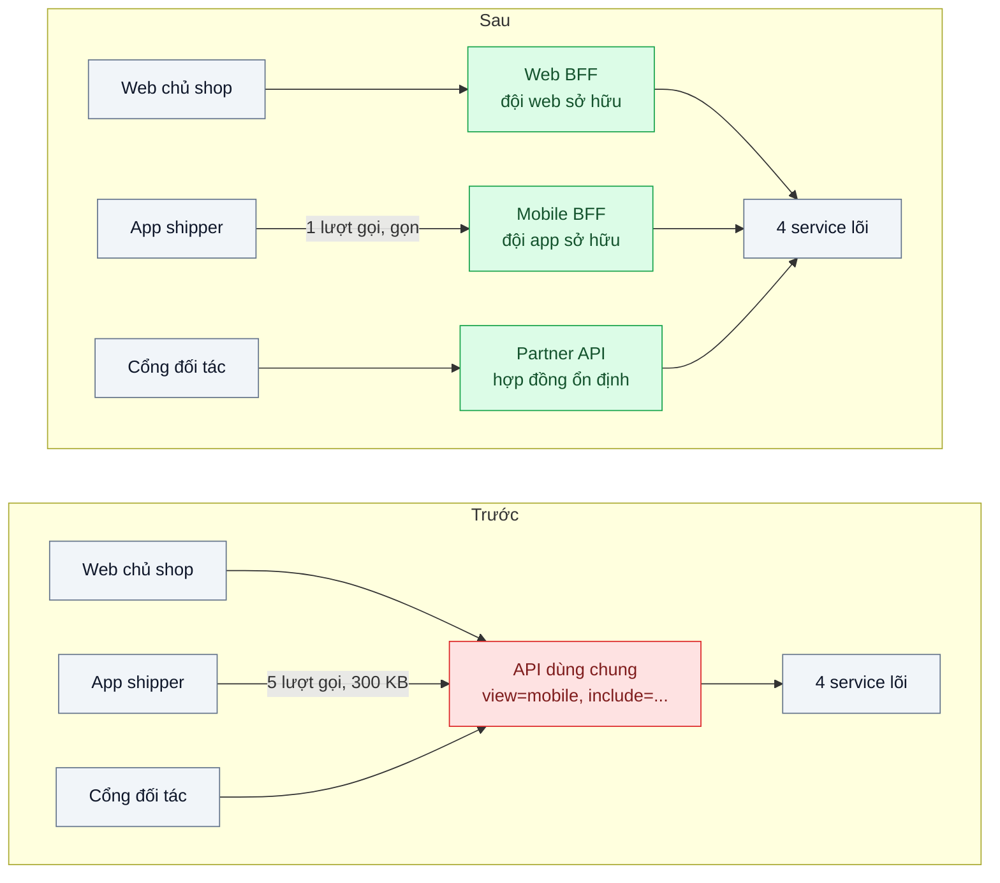
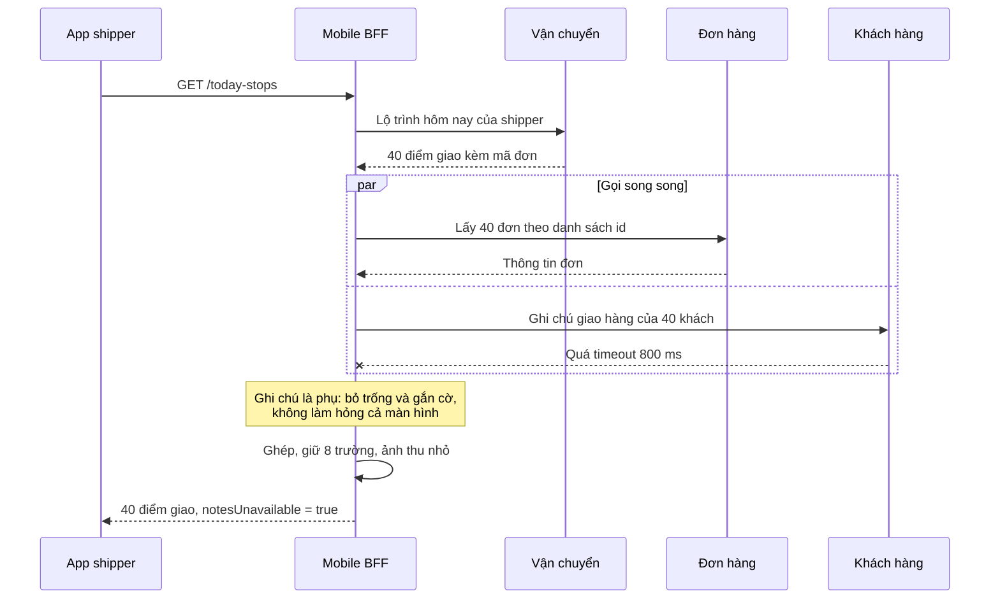

# Backend for Frontend (BFF) — Web, mobile và app đối tác cần hình dạng dữ liệu khác nhau từ cùng một hệ thống

| Scope | Mức độ | Trạng thái | Pattern gốc | Cập nhật |
|---|---|---|---|---|
| 01 · frontend / backend / transporter | 🟡 Trung bình | 📋 Kế hoạch | Backends For Frontends — Sam Newman (2015); Azure Architecture Center | 2026-10-06 |

> **Một câu tóm tắt:** Mỗi trải nghiệm (web chủ shop, app shipper, cổng đối tác) có một backend mỏng riêng do chính đội frontend đó sở hữu, chuyên ghép và cắt dữ liệu từ các service lõi theo đúng nhu cầu màn hình, thay vì một API "dùng chung" phình ra vì cố chiều mọi client.

## 1. Bài toán thực tế (What)

**Bối cảnh** *(doanh nghiệp giả định, số liệu minh họa)*
Công ty logistics giao khoảng 80.000 đơn mỗi ngày. Ba loại client dùng chung một API REST: web dashboard cho 5.000 chủ shop, app di động cho 2.000 shipper, và cổng tích hợp cho 30 đối tác bán hàng. Phía sau có bốn service lõi: đơn hàng, vận chuyển, khách hàng, theo dõi hành trình.

**Triệu chứng người kinh doanh nhìn thấy**
- App shipper mở danh sách điểm giao buổi sáng mất 8–10 giây trên 4G yếu; shipper xuất phát muộn, tỷ lệ giao đúng hẹn giảm.
- Mỗi yêu cầu nhỏ của đội app (thêm một trường, gộp hai màn hình) phải xếp hàng chờ đội backend 1–2 sprint.
- Hai lần trong quý, sửa API cho app làm hỏng màn hình của web chủ shop.

**Nguyên nhân kỹ thuật**
API dùng chung trả đối tượng đơn hàng đầy đủ (khoảng 60 trường, kèm lịch sử trạng thái) cho mọi client. App shipper chỉ cần 8 trường nhưng nhận khoảng 300 KB cho một danh sách và phải gọi thêm 4 endpoint khác để ghép thông tin. Để chiều các client, API mọc thêm tham số `?view=mobile&include=...`, logic hiển thị của ba client trộn lẫn trong một codebase do một đội sở hữu.

**Ràng buộc**
- Không sửa sâu bốn service lõi; chúng vẫn là nguồn sự thật của nghiệp vụ.
- Đối tác cần hợp đồng ổn định, đổi chậm; app shipper cần đổi nhanh theo từng bản phát hành.
- Đội frontend có kinh nghiệm TypeScript, chưa từng vận hành service riêng.

## 2. Vì sao dùng pattern này (Why)

**Nguyên nhân gốc mà pattern nhắm vào:** một API chung phải phục vụ nhiều trải nghiệm có nhu cầu khác nhau, nên vừa thừa dữ liệu cho client này vừa thiếu cho client kia, và trở thành điểm nghẽn tổ chức.

**Pattern giải quyết thế nào:** Sam Newman đề xuất "một trải nghiệm, một BFF": mỗi loại giao diện có một backend riêng nằm sát nó, do đội làm giao diện đó sở hữu. BFF gọi các service lõi (song song khi được), ghép kết quả, cắt bớt trường, đổi định dạng phù hợp màn hình (ảnh nhỏ cho mobile, phân trang khác nhau). Logic nghiệp vụ vẫn ở service lõi; BFF chỉ chứa logic *trình bày và ghép nối*. Đội app tự thêm trường hay gộp màn hình trong BFF của mình mà không chờ ai, và không thể làm hỏng web vì web có BFF khác. Azure Architecture Center nêu thêm các cân nhắc: trùng lặp code giữa các BFF, số lượng BFF hợp lý, độ trễ thêm một bước.

**Lựa chọn khác đã cân nhắc**

| Lựa chọn | Giải quyết được gì | Vì sao không chọn (ở bài này) |
|---|---|---|
| Giữ nguyên + tối ưu nhỏ (thêm `fields=` để chọn trường, nén gzip) | Giảm kích thước payload | Vẫn nhiều lượt gọi để ghép; vẫn một đội sở hữu mọi nhu cầu; tham số ngày càng phức tạp |
| Một API Gateway chung có tầng aggregation (bài 05) | Một cửa vào, ghép được dữ liệu | Gateway chung lại trở thành nơi trộn logic của mọi client; hợp cho mối quan tâm xuyên suốt hơn là hình dạng dữ liệu |
| GraphQL cho mọi client (bài 06) | Client tự chọn trường, một lượt gọi | Đổi cả mô hình truy vấn; đối tác muốn REST ổn định; cần đầu tư resolver và bảo vệ chi phí truy vấn |
| BFF cho web và app shipper, API đối tác có hợp đồng riêng (chọn) | Mỗi client có hình dạng dữ liệu riêng, đội tự chủ, cách ly lỗi | Thêm service phải vận hành; nguy cơ trùng code giữa các BFF |

## 3. Thiết kế hệ thống (How)

### 3.1 Kiến trúc trước và sau



### 3.2 Luồng chính: app shipper tải điểm giao khi một service phụ chậm



### 3.3 Thành phần và trách nhiệm

| Thành phần | Trách nhiệm | Quyết định thiết kế đáng chú ý |
|---|---|---|
| Web BFF | Ghép dữ liệu cho dashboard, bộ lọc, thống kê | Có thể là route handler và server component của chính Next.js |
| Mobile BFF | Danh sách gọn, gộp nhiều nguồn trong một lượt gọi, chịu được service phụ lỗi | Đội app sở hữu và phát hành theo nhịp của app |
| Partner API | Hợp đồng REST ổn định, có phiên bản | Không phải BFF "đổi nhanh"; áp dụng contract-first và versioning (bài 01, 07) |
| Service lõi | Nghiệp vụ, quy tắc, dữ liệu gốc | Thêm endpoint lấy theo lô (`ids=`) để BFF không gọi N lần |
| Thư viện client dùng chung | Gọi service lõi có timeout, retry, type | Chỉ chia sẻ phần hạ tầng, không chia sẻ logic trình bày |

### 3.4 Điểm dễ sai khi triển khai
- **Nghiệp vụ trôi vào BFF.** Tính phí ship trong Mobile BFF rồi Web BFF tính khác: hai con số cho một đơn. Quy tắc: BFF chỉ ghép và định dạng; quyết định nghiệp vụ ở service lõi.
- **Một BFF cho "mọi mobile".** App shipper và app khách hàng là hai trải nghiệm khác nhau dù cùng là mobile; gộp lại là quay về API dùng chung.
- **BFF gọi tuần tự** từng service, cộng dồn độ trễ. Gọi song song và có timeout riêng cho từng nguồn.
- **Gọi N lần cho N đơn** từ BFF xuống service lõi (N+1 qua mạng). Bổ sung endpoint theo lô ở service lõi.
- **Không đặt chủ sở hữu rõ ràng.** BFF không có đội sở hữu sẽ thành API dùng chung thứ hai.

## 4. Tech stack và tác động (Impact techstack)

| Lớp | Công nghệ chọn | Vì sao chọn | Thay thế tương đương |
|---|---|---|---|
| Web BFF | Next.js App Router (route handler, server component) | Web đã dùng Next.js; tầng server của nó tự nhiên là BFF | Một service NestJS riêng |
| Mobile BFF | Fastify + TypeScript strict | Service mỏng, ít khung, khởi động nhanh; NestJS là quá tay cho tầng ghép | NestJS |
| HTTP client | `undici` với timeout theo từng lời gọi | Mặc định của Node, kiểm soát timeout rõ ràng | axios |
| Hợp đồng | OpenAPI cho Partner API và cho service lõi | Đối tác cần tài liệu ổn định; BFF sinh type client từ spec | tRPC giữa app và BFF nếu cùng monorepo |
| Tiêm độ trễ | Toxiproxy | Làm chậm service khách hàng để thử luồng lỗi | Cờ làm chậm trong code giả lập |
| Đo | k6, Chrome DevTools giới hạn mạng | Đo p95 và kích thước payload, thử trên mạng chậm | Lighthouse |

**Thay đổi so với hệ thống hiện tại:** thêm hai service BFF và tách Partner API; service lõi thêm endpoint lấy theo lô. Đội frontend học vận hành service (log, metric, deploy), đội backend thôi làm "API theo yêu cầu màn hình".

## 5. Kết quả đầu ra và cách đo (Output impact)

| Chỉ số | Trước (minh họa) | Mục tiêu khi thực hành | Cách đo |
|---|---|---|---|
| Kích thước payload danh sách điểm giao | 300 KB | ≤ 40 KB | Kích thước response trong k6 (`res.body.length`) và DevTools |
| Số lượt gọi để vẽ màn hình điểm giao | 5 | 1 | Đếm request trong DevTools hoặc log BFF |
| p95 thời gian tải màn hình khi mạng thêm 300 ms độ trễ | 8.000 ms | ≤ 1.500 ms | k6 qua Toxiproxy thêm độ trễ giữa client và BFF |
| Màn hình vẫn hiển thị khi service khách hàng lỗi | không | có, kèm cờ thiếu dữ liệu | Test tích hợp tắt service khách hàng |
| Số thay đổi cho app cần đội backend lõi tham gia | gần như mọi thay đổi | chỉ khi thiếu dữ liệu gốc | Đếm trong bộ 10 yêu cầu thay đổi mẫu |

> Số "trước" là minh họa để hình dung bài toán. Số "mục tiêu" chỉ được coi là đạt khi có số đo thật
> ở mục 8 kèm môi trường đo.

**Tác động nghiệp vụ mong đợi:** shipper xuất phát đúng giờ hơn nhờ app tải nhanh, đội app phát hành theo nhịp riêng, và thay đổi của client này không còn làm hỏng client khác.

## 6. Đánh đổi và khi KHÔNG nên dùng

**Đánh đổi**
- Thêm service phải deploy, giám sát, trực sự cố; thêm một bước mạng.
- Trùng lặp code giữa các BFF; phải chủ động đẩy phần chung xuống service lõi thay vì chép.
- Đội frontend nhận thêm trách nhiệm vận hành backend.

**Không nên dùng khi**
- Chỉ có một client, hoặc các client cần dữ liệu gần như giống nhau: một API tốt là đủ.
- Đội nhỏ, không có người vận hành thêm service: chi phí lớn hơn lợi ích; cân nhắc `fields=` hoặc GraphQL.
- Nhu cầu chính là mối quan tâm xuyên suốt (xác thực, giới hạn tốc độ, định tuyến): đó là việc của API Gateway (bài 05).

**Liên quan**
- Đọc sau: `../05-api-gateway-mobile-goi-bay-service/` — phân biệt BFF và gateway; hai pattern thường đi cùng nhau.
- Lựa chọn thay thế: `../06-graphql-dashboard-tai-2mb-hien-12-truong/` — client tự chọn trường thay vì BFF cắt hộ.
- Cùng chủ đề: `../../07-backend-microservices/05-api-composition-man-hinh-don-hang-can-du-lieu-4-service/` — kỹ thuật ghép dữ liệu nhiều service.
- Ứng dụng: `../../19-backend-frontend-authenticate/05-bff-token-handler-token-khong-bao-gio-cham-trinh-duyet/` — BFF giữ token thay cho trình duyệt.

## 7. Cơ sở tham khảo

- Sam Newman, "Pattern: Backends For Frontends", 2015 — https://samnewman.io/patterns/architectural/bff/ — định nghĩa gốc, nguyên tắc một trải nghiệm một BFF, quyền sở hữu thuộc đội giao diện, rủi ro trùng lặp.
- Microsoft Azure Architecture Center, "Backends for Frontends pattern" — https://learn.microsoft.com/azure/architecture/patterns/backends-for-frontends — bối cảnh áp dụng, các vấn đề cần cân nhắc và khi nào không nên dùng.
- Sam Newman, *Building Microservices*, 2nd ed., O'Reilly, 2021 — chương về giao tiếp và giao diện người dùng, đặt BFF cạnh API Gateway và GraphQL.
- Next.js docs, "Route Handlers" — https://nextjs.org/docs — dùng tầng server của Next.js làm Web BFF.

## 8. Kế hoạch thực hành

- [ ] Bước 1: dựng bốn service lõi giả lập bằng Fastify với dữ liệu seed; API dùng chung trả đối tượng đầy đủ; app giả lập gọi 5 endpoint.
- [ ] Bước 2: đo "trước": kích thước payload, số lượt gọi, p95 qua Toxiproxy thêm 300 ms độ trễ.
- [ ] Bước 3: viết Mobile BFF (gọi song song, endpoint theo lô, timeout riêng, cờ thiếu dữ liệu) và Web BFF bằng route handler Next.js.
- [ ] Bước 4: đo "sau" cùng kịch bản; ghi số thật và môi trường vào mục 5.
- [ ] Bước 5: viết test: (a) response Mobile BFF chỉ có đúng các trường đã khai báo; (b) service khách hàng chết thì vẫn trả danh sách kèm cờ; (c) BFF gọi service đơn hàng đúng một lần cho cả danh sách.

**Cấu trúc code dự kiến**
```text
apps/
  core-services/                  # đơn hàng, vận chuyển, khách hàng, hành trình giả lập
  mobile-bff/src/today-stops.route.ts   # [PATTERN] ghép và cắt dữ liệu cho app shipper
  mobile-bff/src/core-clients.ts        # client có timeout theo nguồn
  web/app/api/orders/route.ts           # Web BFF trong Next.js
test/
  mobile-bff-shape.test.ts
  mobile-bff-partial-failure.test.ts
bench/today-stops.k6.js
docker-compose.yml                      # các service, toxiproxy
```

**Cách chạy** *(điền khi bắt đầu code)*
```bash
docker compose up -d
pnpm install && pnpm test
```
