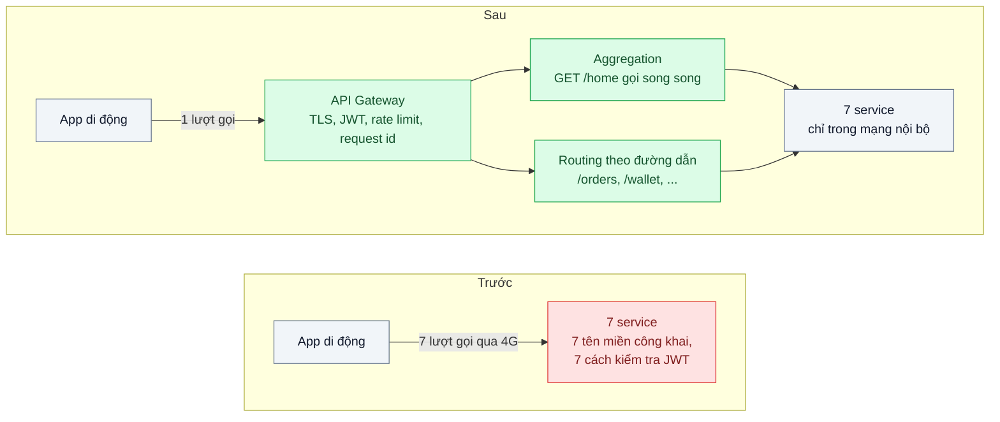
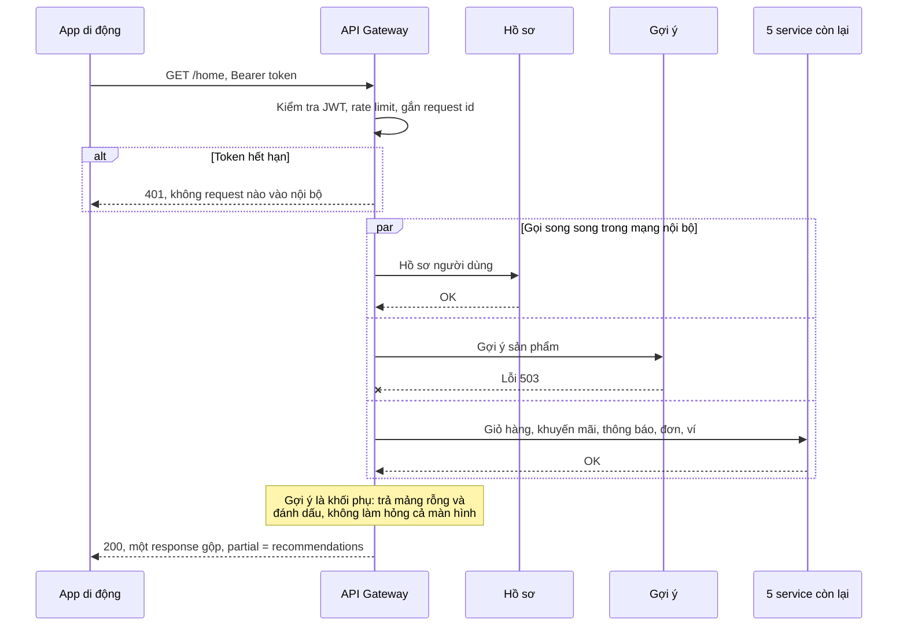

# API Gateway — App di động phải gọi 7 service nội bộ để vẽ một màn hình

| Scope | Mức độ | Trạng thái | Pattern gốc | Cập nhật |
|---|---|---|---|---|
| 01 · frontend / backend / transporter | 🟡 Trung bình | 📋 Kế hoạch | API Gateway — Richardson, *Microservices Patterns* (2018); Azure Gateway Aggregation / Routing / Offloading | 2026-10-06 |

> **Một câu tóm tắt:** Đặt một cửa vào duy nhất trước các service nội bộ: gateway định tuyến request, gánh các việc chung (TLS, xác thực, giới hạn tốc độ, request id) và ghép nhiều lời gọi nội bộ thành một lượt gọi cho màn hình cần nhiều nguồn dữ liệu.

## 1. Bài toán thực tế (What)

**Bối cảnh** *(doanh nghiệp giả định, số liệu minh họa)*
Sàn thương mại điện tử có khoảng 1,5 triệu lượt mở app mỗi ngày. Màn hình chủ của app cần dữ liệu từ 7 service: hồ sơ người dùng, giỏ hàng, khuyến mãi, gợi ý sản phẩm, thông báo, đơn đang giao, số dư ví. Mỗi service có tên miền công khai riêng và tự kiểm tra JWT, CORS, giới hạn tốc độ theo cách của mình.

**Triệu chứng người kinh doanh nhìn thấy**
- Màn hình chủ mất khoảng 3 giây mới hiện đủ trên 4G; đội tăng trưởng thấy tỷ lệ thoát ở màn hình đầu cao hơn đối thủ.
- Tách service "khuyến mãi" thành hai làm app bản cũ lỗi, phải ép người dùng cập nhật app.
- Kiểm thử bảo mật phát hiện một service nội bộ lỡ mở endpoint quản trị ra internet vì không qua lớp kiểm soát chung nào.

**Nguyên nhân kỹ thuật**
App mở 7 kết nối, mỗi request chịu độ trễ mạng di động (khoảng 150 ms mỗi vòng), vài request phụ thuộc nhau nên phải chạy tuần tự. App biết cấu trúc nội bộ (service nào ở đâu), nên mọi thay đổi ranh giới service lan tới client. Các mối quan tâm xuyên suốt bị cài đặt lặp lại 7 lần, mỗi lần một kiểu, và không có điểm nào thấy toàn bộ lưu lượng vào.

**Ràng buộc**
- Không đổi giao diện app trong một lần; các endpoint cũ phải định tuyến được qua gateway trong giai đoạn chuyển đổi.
- Gateway không được thành điểm nghẽn: thêm độ trễ nhỏ, scale ngang được, không giữ trạng thái.
- Không đưa logic nghiệp vụ vào gateway.

## 2. Vì sao dùng pattern này (Why)

**Nguyên nhân gốc mà pattern nhắm vào:** client nói chuyện trực tiếp với cấu trúc nội bộ, nên vừa chịu chi phí nhiều lượt gọi qua mạng chậm, vừa bị ràng buộc vào cách chia service, và mỗi service phải tự lo mọi việc chung.

**Pattern giải quyết thế nào:** Richardson mô tả API Gateway là điểm vào duy nhất cho client bên ngoài. Azure tách ba vai trò cụ thể. *Gateway Routing*: một tên miền, định tuyến theo đường dẫn tới service phía sau, nên tách hay gộp service chỉ đổi bảng định tuyến. *Gateway Offloading*: TLS, xác thực token, giới hạn tốc độ, CORS, request id, log truy cập làm một lần ở gateway. *Gateway Aggregation*: một endpoint như `GET /home` gọi song song nhiều service trong mạng nội bộ (độ trễ thấp) và trả một response gộp, thay vì app gọi 7 lần qua mạng di động. Richardson cũng lưu ý biến thể BFF: khi các client cần ghép dữ liệu rất khác nhau, phần aggregation nên tách thành BFF theo từng client (bài 04).

**Lựa chọn khác đã cân nhắc**

| Lựa chọn | Giải quyết được gì | Vì sao không chọn (ở bài này) |
|---|---|---|
| Giữ nguyên + tối ưu nhỏ (HTTP/2, app gọi song song cả 7) | Giảm thời gian chờ tuần tự | Vẫn lộ cấu trúc nội bộ, vẫn 7 cài đặt xác thực, vẫn tốn pin và dữ liệu di động |
| Chỉ dùng reverse proxy định tuyến (NGINX) | Một tên miền, ẩn cấu trúc | Không ghép dữ liệu; offloading xác thực phải cấu hình thêm |
| BFF riêng cho app (bài 04) | Ghép và cắt dữ liệu đúng màn hình | Bổ trợ tốt; nhưng vẫn cần một lớp chung cho TLS, xác thực, giới hạn tốc độ của mọi client |
| Service mesh (scope 13) | mTLS, retry, tracing giữa service | Giải quyết lưu lượng đông-tây nội bộ, không phải cửa vào cho client bên ngoài |
| API Gateway: routing + offloading + aggregation cho màn hình chủ (chọn) | Một cửa vào, việc chung làm một lần, một lượt gọi cho màn hình chủ | Thêm một thành phần trên đường đi của mọi request |

## 3. Thiết kế hệ thống (How)

### 3.1 Kiến trúc trước và sau



### 3.2 Luồng chính



### 3.3 Thành phần và trách nhiệm

| Thành phần | Trách nhiệm | Quyết định thiết kế đáng chú ý |
|---|---|---|
| Routing | Ánh xạ đường dẫn công khai tới service nội bộ | Bảng định tuyến là cấu hình, đổi không cần sửa app |
| Offloading xác thực | Kiểm tra chữ ký và hạn JWT, chuyển danh tính xuống qua header nội bộ | Service phía sau tin header chỉ khi đến từ gateway (mạng nội bộ) |
| Rate limiting | Giới hạn theo người dùng và theo IP | Bộ đếm trong Redis để nhiều instance gateway dùng chung |
| Aggregation `/home` | Gọi song song 7 service, timeout riêng, trả phần có được | Phân loại khối bắt buộc và khối phụ; khối phụ lỗi thì trả rỗng kèm đánh dấu |
| Request id và log truy cập | Gắn id, ghi log có cấu trúc, đo độ trễ từng tuyến | Truyền id xuống service để truy vết xuyên suốt |

### 3.4 Điểm dễ sai khi triển khai
- **Gateway thành "monolith mới".** Mỗi đội nhét một chút logic nghiệp vụ vào gateway; vài tháng sau không ai dám sửa. Gateway chỉ chứa định tuyến, việc chung và ghép đơn giản.
- **Aggregation tuần tự hoặc không có timeout.** Một service chậm kéo cả màn hình; luôn gọi song song, timeout từng nguồn, xác định trước khối nào được phép thiếu.
- **Service phía sau vẫn mở ra internet.** Gateway vô nghĩa nếu đi vòng được; chặn ở tầng mạng.
- **Một điểm hỏng duy nhất.** Gateway phải stateless, chạy nhiều instance sau load balancer, có health check.
- **Retry ở gateway cho request không idempotent** (ví dụ `POST /payments`) gây trùng; chỉ retry `GET` hoặc request có Idempotency Key (bài 03).

## 4. Tech stack và tác động (Impact techstack)

| Lớp | Công nghệ chọn | Vì sao chọn | Thay thế tương đương |
|---|---|---|---|
| Gateway | Fastify + TypeScript strict | Viết rõ từng vai trò bằng code ngắn để học; hiệu năng tốt cho proxy | Kong, Envoy, NGINX, KrakenD, gateway của nhà cung cấp cloud |
| Routing | `@fastify/http-proxy` (cần xác minh tùy chọn) | Proxy theo tiền tố đường dẫn, hỗ trợ stream | NGINX `location` + `proxy_pass` |
| Xác thực | `@fastify/jwt` (cần xác minh tùy chọn) | Kiểm tra JWT ở một chỗ | Plugin JWT của Kong |
| Rate limiting | `@fastify/rate-limit` với Redis 7 | Bộ đếm dùng chung giữa các instance | NGINX `limit_req` |
| Service giả lập | Fastify, 7 tiến trình nhỏ | Dựng nhanh, tiêm lỗi bằng cờ | NestJS |
| Tiêm độ trễ | Toxiproxy | Giả lập 150 ms giữa app và gateway | `tc netem` |
| Đo | k6, Prometheus | So sánh 7 lượt gọi với 1 lượt; độ trễ thêm vào bởi gateway | Grafana |

**Thay đổi so với hệ thống hiện tại:** thêm gateway và Redis cho bộ đếm; 7 service bỏ phần xác thực JWT riêng và rút khỏi internet; app chuyển dần sang một tên miền. Đội hạ tầng sở hữu gateway và quy trình thêm tuyến mới.

## 5. Kết quả đầu ra và cách đo (Output impact)

| Chỉ số | Trước (minh họa) | Mục tiêu khi thực hành | Cách đo |
|---|---|---|---|
| Số lượt gọi để vẽ màn hình chủ | 7 | 1 | Log truy cập gateway, đếm request mỗi phiên |
| p95 tải màn hình chủ với 150 ms độ trễ mạng | 3.000 ms | ≤ 900 ms | k6 qua Toxiproxy, so sánh app gọi 7 lần và gọi `/home` |
| Độ trễ do gateway thêm vào (định tuyến thuần) | 0 | p95 ≤ 10 ms | k6 gọi thẳng service và gọi qua gateway, so sánh |
| Endpoint nội bộ truy cập được từ ngoài | 7 tên miền | 0 | Thử gọi trực tiếp service từ ngoài mạng Compose |
| Chỗ cài đặt kiểm tra JWT | 7 | 1 | Đếm trong mã nguồn |
| Màn hình chủ khi service gợi ý chết | lỗi toàn màn hình | vẫn hiển thị, thiếu khối gợi ý | Test tích hợp tắt service gợi ý |

> Số "trước" là minh họa để hình dung bài toán. Số "mục tiêu" chỉ được coi là đạt khi có số đo thật
> ở mục 8 kèm môi trường đo.

**Tác động nghiệp vụ mong đợi:** màn hình đầu hiện nhanh hơn trên mạng di động, đổi cấu trúc service không còn buộc người dùng cập nhật app, và bề mặt tấn công thu về một điểm kiểm soát.

## 6. Đánh đổi và khi KHÔNG nên dùng

**Đánh đổi**
- Thêm một bước trên đường đi của mọi request và một thành phần phải vận hành có độ sẵn sàng cao.
- Nguy cơ thắt cổ chai tổ chức: mọi tuyến mới phải qua đội sở hữu gateway.
- Aggregation ở gateway dùng chung dễ phình theo nhu cầu từng client; khi đó tách sang BFF.

**Không nên dùng khi**
- Chỉ có một backend (monolith): reverse proxy đơn giản là đủ.
- Ít client, ít service, đội nhỏ: một gateway tự viết là gánh nặng; dùng dịch vụ có sẵn hoặc chưa cần.
- Lưu lượng chủ yếu giữa các service với nhau: đó là việc của service mesh hoặc service discovery.

**Liên quan**
- Đọc trước: `../04-bff-web-mobile-can-du-lieu-khac-nhau/` — BFF và gateway giải quyết hai câu hỏi khác nhau.
- Cùng chủ đề: `../../13-backend-transporter/03-rate-limiting-mot-khach-api-goi-10k-req-s/` — giới hạn tốc độ ở biên.
- Cùng chủ đề: `../../07-backend-microservices/05-api-composition-man-hinh-don-hang-can-du-lieu-4-service/` — ghép dữ liệu nhiều service.
- So sánh: `../../13-backend-transporter/07-service-mesh-mtls-retry-tracing-khong-sua-code/` — lưu lượng nội bộ.

## 7. Cơ sở tham khảo

- Chris Richardson, "Pattern: API Gateway / Backends for Frontends", microservices.io — https://microservices.io/patterns/apigateway.html — định nghĩa, lợi ích, nhược điểm và biến thể BFF.
- Microsoft Azure Architecture Center, "Gateway Aggregation", "Gateway Routing", "Gateway Offloading" — https://learn.microsoft.com/azure/architecture/patterns/ — ba vai trò tách bạch và các vấn đề cần cân nhắc của từng vai trò.
- Chris Richardson, *Microservices Patterns*, Manning, 2018 — chương "External API patterns": thiết kế gateway, xử lý lỗi một phần khi ghép.
- Fastify docs — https://fastify.dev/docs/latest/ — hệ plugin dùng cho proxy, JWT và rate limit (cần xác minh tùy chọn từng plugin).

## 8. Kế hoạch thực hành

- [ ] Bước 1: dựng 7 service giả lập (mỗi service một endpoint, có cờ làm chậm và làm lỗi), app giả lập gọi đủ 7 endpoint; Toxiproxy thêm 150 ms.
- [ ] Bước 2: đo "trước": p95 tải màn hình chủ, số lượt gọi, thử gọi thẳng service từ ngoài.
- [ ] Bước 3: viết gateway: routing theo tiền tố, kiểm tra JWT, rate limit trên Redis, request id, endpoint `/home` gọi song song có timeout và trả kết quả một phần.
- [ ] Bước 4: đo "sau" cùng kịch bản, thêm đo độ trễ do gateway; ghi số thật và môi trường vào mục 5.
- [ ] Bước 5: viết test: (a) token sai bị chặn ở gateway, service không nhận request; (b) service gợi ý lỗi thì `/home` vẫn 200 và đánh dấu thiếu; (c) vượt hạn mức trả 429; (d) đổi bảng định tuyến không cần đổi client.

**Cấu trúc code dự kiến**
```text
apps/
  gateway/src/routes.config.ts         # bảng định tuyến
  gateway/src/auth.plugin.ts           # offloading JWT
  gateway/src/home.aggregator.ts       # [PATTERN] gọi song song, trả một phần
  internal-services/                   # 7 service giả lập
test/
  gateway-rejects-invalid-token.test.ts
  home-partial-response.test.ts
bench/home-screen.k6.js
docker-compose.yml                     # gateway, redis, 7 service, toxiproxy
```

**Cách chạy** *(điền khi bắt đầu code)*
```bash
docker compose up -d
pnpm install && pnpm test
```
