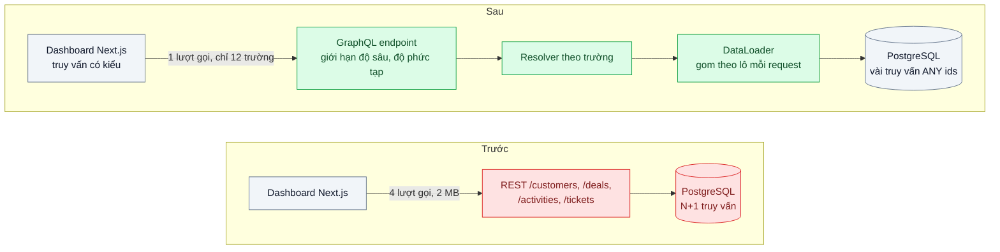
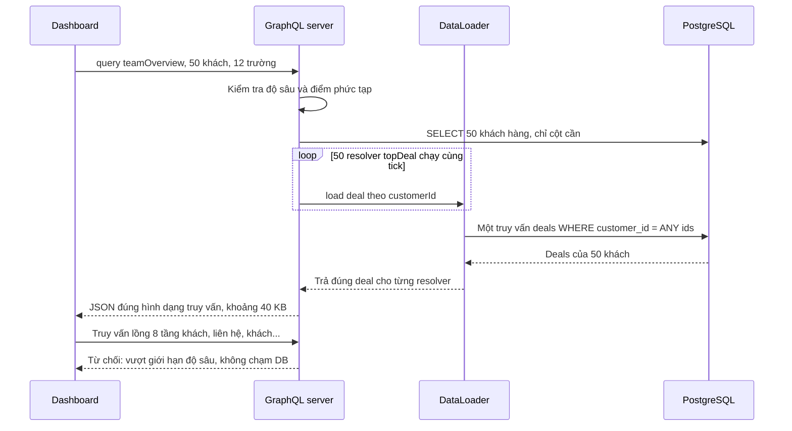

# GraphQL — Màn hình dashboard tải 2 MB JSON nhưng chỉ hiển thị 12 trường

| Scope | Mức độ | Trạng thái | Pattern gốc | Cập nhật |
|---|---|---|---|---|
| 01 · frontend / backend / transporter | 🟡 Trung bình | 📋 Kế hoạch | GraphQL — Facebook (công bố 2015); GraphQL Specification | 2026-10-06 |

> **Một câu tóm tắt:** Cho client mô tả chính xác các trường và quan hệ nó cần trong một truy vấn có kiểu; server chỉ phân giải đúng những trường đó (gom truy vấn xuống DB theo lô), nên dashboard nhận vài chục KB thay vì 2 MB và không phải gọi nhiều endpoint.

## 1. Bài toán thực tế (What)

**Bối cảnh** *(doanh nghiệp giả định, số liệu minh họa)*
Công ty SaaS B2B cung cấp CRM cho khoảng 600 doanh nghiệp. Màn hình "Tổng quan đội kinh doanh" của trưởng nhóm hiển thị 50 khách hàng, mỗi dòng 12 trường: tên, người phụ trách, giai đoạn cơ hội lớn nhất, giá trị, hoạt động gần nhất, số phiếu hỗ trợ đang mở. Dữ liệu lấy từ REST: `GET /customers?limit=50` rồi gọi thêm `/deals`, `/activities`, `/tickets`.

**Triệu chứng người kinh doanh nhìn thấy**
- Dashboard mở mất 5–7 giây, trưởng nhóm kinh doanh mở mỗi sáng và phàn nàn trong mọi buổi phỏng vấn khách hàng.
- Khách dùng laptop qua 4G khi đi gặp đối tác thấy màn hình trắng lâu hơn nữa.
- Mỗi lần thêm một cột lên dashboard phải chờ backend thêm tham số `include` mới.

**Nguyên nhân kỹ thuật**
`/customers` trả đối tượng đầy đủ: khoảng 80 trường, kèm toàn bộ danh sách liên hệ và lịch sử ghi chú lồng bên trong, tổng cộng khoảng 2 MB cho 50 dòng. Frontend chỉ dùng 12 trường. Để lấy cơ hội và hoạt động, frontend gọi thêm 3 endpoint, một số chạy tuần tự vì cần id từ kết quả trước. Phía server, mỗi endpoint lại tải đủ quan hệ của từng khách hàng, tạo N+1 truy vấn.

**Ràng buộc**
- Các endpoint REST hiện có vẫn phục vụ tích hợp của khách; không gỡ được.
- Không được mở ra khả năng một truy vấn lồng sâu làm sập database.
- Đội frontend muốn type sinh tự động như với OpenAPI (bài 01).

## 2. Vì sao dùng pattern này (Why)

**Nguyên nhân gốc mà pattern nhắm vào:** hình dạng response do server quyết định cố định cho mọi người gọi, trong khi mỗi màn hình cần một lát cắt khác của đồ thị dữ liệu.

**Pattern giải quyết thế nào:** GraphQL định nghĩa một schema có kiểu cho toàn bộ đồ thị dữ liệu (khách hàng có cơ hội, cơ hội có người phụ trách...). Client gửi một truy vấn liệt kê đúng các trường và quan hệ cần, server chạy resolver cho từng trường được yêu cầu và trả JSON đúng hình dạng truy vấn. Lee Byron giới thiệu GraphQL năm 2015 như cách Facebook để app mô tả nhu cầu dữ liệu và lấy trong một lượt gọi. Cái giá là server phải tự bảo vệ: resolver ngây thơ gây N+1 (giải bằng DataLoader gom các lần tải trong một tick thành một truy vấn theo lô), và truy vấn tùy ý có thể rất đắt (giải bằng giới hạn độ sâu, độ phức tạp, hoặc chỉ cho phép truy vấn đã đăng ký trước).

**Lựa chọn khác đã cân nhắc**

| Lựa chọn | Giải quyết được gì | Vì sao không chọn (ở bài này) |
|---|---|---|
| Giữ nguyên + tối ưu nhỏ (`fields=` và `include=` cho REST, gzip) | Giảm payload | Cú pháp tự chế, mỗi endpoint cài một kiểu; vẫn nhiều lượt gọi; không có type cho tổ hợp trường |
| Endpoint REST riêng cho dashboard | Một lượt gọi, đúng dữ liệu | Mỗi màn hình một endpoint; backend thành điểm nghẽn cho mọi thay đổi cột |
| BFF cho web (bài 04) | Ghép và cắt dữ liệu theo màn hình | Hợp khi có nhiều client khác hẳn nhau; ở đây là nhiều màn hình cùng một client, cần linh hoạt chọn trường |
| GraphQL trên PostgreSQL bằng công cụ tự sinh (Hasura, PostGraphile) | Có ngay API từ schema DB | Lộ cấu trúc bảng ra client, khó gắn quy tắc nghiệp vụ và phân quyền tinh |
| GraphQL schema-first + DataLoader + giới hạn chi phí truy vấn (chọn) | Đúng trường, một lượt gọi, type sinh tự động, kiểm soát chi phí | Thêm một tầng mới, cache HTTP khó hơn REST |

## 3. Thiết kế hệ thống (How)

### 3.1 Kiến trúc trước và sau



### 3.2 Luồng chính



### 3.3 Thành phần và trách nhiệm

| Thành phần | Trách nhiệm | Quyết định thiết kế đáng chú ý |
|---|---|---|
| Schema SDL | Hợp đồng có kiểu của đồ thị dữ liệu | Viết schema trước (schema-first), review như OpenAPI ở bài 01 |
| Resolver | Phân giải từng trường từ service hoặc DB | Mỏng, gọi tầng service hiện có; không viết SQL trong resolver |
| DataLoader | Gom và cache tải theo id trong phạm vi một request | Tạo mới mỗi request, không dùng chung giữa người dùng |
| Giới hạn chi phí | Chặn truy vấn quá sâu hoặc quá đắt trước khi thực thi | Ngưỡng đo từ các truy vấn thật của ứng dụng |
| Codegen phía client | Sinh type TypeScript từ schema và từng truy vấn | Truy vấn sai trường là lỗi biên dịch |
| Persisted queries | Chỉ chạy truy vấn đã đăng ký ở production | Tùy chọn, bật khi client là ứng dụng của chính công ty |

### 3.4 Điểm dễ sai khi triển khai
- **Resolver ngây thơ gây N+1.** Không có DataLoader, 50 khách là 50 truy vấn deals; đo số truy vấn mỗi request ngay từ ngày đầu.
- **DataLoader dùng chung giữa request** làm lộ dữ liệu người khác qua cache. Luôn tạo trong context của request.
- **Không giới hạn chi phí.** Truy vấn lồng vòng (khách, liên hệ, khách...) hoặc `first: 10000` có thể làm sập DB; đặt giới hạn độ sâu, độ phức tạp và số phần tử tối đa.
- **Phân quyền ở endpoint thay vì ở trường.** GraphQL chỉ có một endpoint; kiểm tra quyền phải nằm ở resolver hoặc tầng service.
- **Kỳ vọng cache HTTP như REST.** Truy vấn qua `POST` không được CDN cache; cache phải ở client (normalized cache) hoặc dùng persisted queries qua `GET`.

## 4. Tech stack và tác động (Impact techstack)

| Lớp | Công nghệ chọn | Vì sao chọn | Thay thế tương đương |
|---|---|---|---|
| GraphQL server | NestJS 10 `@nestjs/graphql` với Apollo Server, schema-first | Trùng stack; NestJS hỗ trợ cả schema-first và code-first | Mercurius trên Fastify, GraphQL Yoga |
| Gom truy vấn | `dataloader` | Cài đặt tham chiếu của kỹ thuật batching theo tick | Tự gom bằng `Promise` và `ANY($1)` |
| Giới hạn chi phí | Luật validation độ sâu và độ phức tạp (thư viện cụ thể cần xác minh) | Chặn trước khi thực thi | Persisted queries chỉ cho phép truy vấn đã biết |
| Database | PostgreSQL 16 | Truy vấn theo lô `WHERE id = ANY($1)` dùng index tốt | MySQL 8 |
| Client | Next.js + Apollo Client | Normalized cache và tích hợp React | urql, TanStack Query với client GraphQL nhẹ |
| Codegen | GraphQL Code Generator (cần xác minh cấu hình) | Sinh type cho từng truy vấn | gql.tada |
| Đo | k6, `pg_stat_statements`, log số truy vấn mỗi request | So sánh payload, p95, số SQL | Apollo tracing |

**Thay đổi so với hệ thống hiện tại:** thêm một endpoint GraphQL cạnh REST, dùng lại tầng service hiện có; frontend dashboard chuyển sang truy vấn GraphQL. Đội backend học thiết kế schema, DataLoader và cách đặt giới hạn chi phí.

## 5. Kết quả đầu ra và cách đo (Output impact)

| Chỉ số | Trước (minh họa) | Mục tiêu khi thực hành | Cách đo |
|---|---|---|---|
| Kích thước response dashboard | 2 MB | ≤ 60 KB | Kích thước body trong k6 và DevTools |
| Số lượt gọi từ trình duyệt | 4 | 1 | DevTools tab Network |
| Số câu SQL mỗi lần tải dashboard | 150+ | ≤ 5 | `pg_stat_statements` trước và sau một lần tải, hoặc log đếm truy vấn |
| p95 tải dashboard | 6.000 ms | ≤ 600 ms | k6 30 người dùng ảo, 5 phút |
| Truy vấn độc hại bị chặn trước khi chạm DB | không có | 100 % bộ truy vấn thử | Bộ 10 truy vấn lồng sâu và quá lớn, kiểm tra log DB không có truy vấn |

> Số "trước" là minh họa để hình dung bài toán. Số "mục tiêu" chỉ được coi là đạt khi có số đo thật
> ở mục 8 kèm môi trường đo.

**Tác động nghiệp vụ mong đợi:** trưởng nhóm kinh doanh mở dashboard gần như tức thì, kể cả trên 4G, và đội frontend thêm cột mới mà không phải chờ backend.

## 6. Đánh đổi và khi KHÔNG nên dùng

**Đánh đổi**
- Thêm một tầng, một ngôn ngữ truy vấn và bộ công cụ mới cho cả hai đội.
- Cache HTTP và CDN gần như mất tác dụng; phải đầu tư cache phía client.
- Chi phí truy vấn khó dự đoán hơn REST; cần giám sát theo tên truy vấn.

**Không nên dùng khi**
- API công khai cho bên thứ ba cần cache CDN và hợp đồng đơn giản: REST với OpenAPI dễ dùng hơn.
- Ứng dụng ít màn hình, dữ liệu phẳng: vài endpoint REST đúng hình dạng là đủ.
- Tải file lớn, stream, upload: GraphQL không phải công cụ phù hợp.

**Liên quan**
- So sánh: `../04-bff-web-mobile-can-du-lieu-khac-nhau/` — cắt dữ liệu ở server theo client thay vì cho client tự chọn.
- Đọc trước: `../../02-backend-database/01-n-plus-1-trang-50-don-ban-151-cau-sql/` — N+1 ở tầng DB, nền của DataLoader.
- Cùng chủ đề: `../../04-frontend-cache/05-normalized-cache-mot-user-hai-ten-khac-nhau/` — normalized cache phía client.
- Đọc trước: `../01-contract-first-openapi-frontend-goi-sai-ten-truong/` — schema-first là cùng tinh thần contract-first.

## 7. Cơ sở tham khảo

- GraphQL Foundation, *GraphQL Specification* và "Learn" — https://graphql.org/learn/ — ngôn ngữ truy vấn, hệ kiểu, thực thi theo trường, validation.
- Lee Byron, "GraphQL: A data query language", Facebook Engineering, 2015 — động cơ ra đời: app mô tả nhu cầu dữ liệu, một lượt gọi, hệ kiểu.
- Apollo docs — https://www.apollographql.com/docs/ — Apollo Server, Apollo Client normalized cache, persisted queries.
- DataLoader — https://github.com/graphql/dataloader — cơ chế batching và cache theo request (cần xác minh chi tiết API).
- NestJS docs, "GraphQL" — https://docs.nestjs.com/ — schema-first và code-first trong NestJS.

## 8. Kế hoạch thực hành

- [ ] Bước 1: seed PostgreSQL với 600 công ty, 50.000 khách hàng, cơ hội, hoạt động, phiếu hỗ trợ; dựng REST hiện trạng và dashboard Next.js gọi 4 endpoint.
- [ ] Bước 2: đo "trước": kích thước response, số lượt gọi, số SQL mỗi lần tải, p95 với k6.
- [ ] Bước 3: viết schema SDL, resolver mỏng, DataLoader theo request, giới hạn độ sâu và độ phức tạp; dashboard chuyển sang một truy vấn có type sinh tự động.
- [ ] Bước 4: đo "sau" cùng kịch bản; ghi số thật và môi trường vào mục 5.
- [ ] Bước 5: viết test: (a) truy vấn 50 khách kèm topDeal chỉ sinh đúng 2 truy vấn deals và khách; (b) truy vấn vượt độ sâu bị từ chối và không chạm DB; (c) DataLoader của người dùng A không trả dữ liệu cho người dùng B.

**Cấu trúc code dự kiến**
```text
src/
  graphql/schema.graphql             # hợp đồng có kiểu
  graphql/customers.resolver.ts
  graphql/loaders.ts                 # [PATTERN] DataLoader tạo mỗi request
  graphql/query-cost.rules.ts        # giới hạn độ sâu và độ phức tạp
  rest/customers.controller.ts       # REST hiện trạng để so sánh
web/app/dashboard/page.tsx
test/
  dataloader-batches-deals.test.ts
  deep-query-rejected.test.ts
bench/dashboard-rest-vs-graphql.k6.js
docker-compose.yml
```

**Cách chạy** *(điền khi bắt đầu code)*
```bash
docker compose up -d
pnpm install && pnpm test
```
