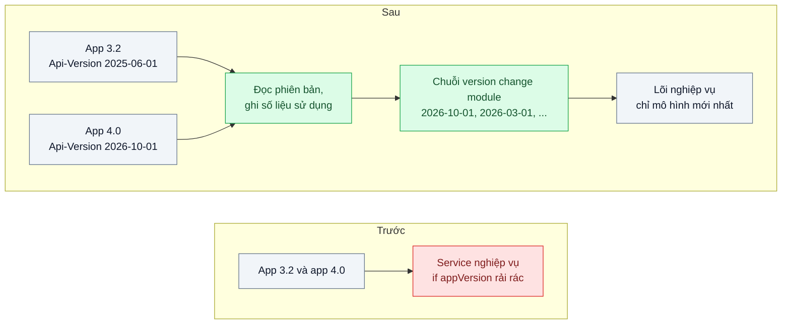
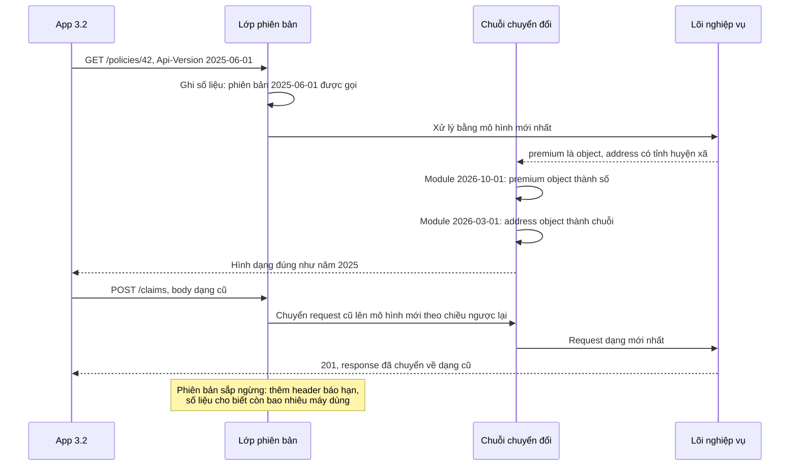

# API Versioning — App cũ trên máy khách chưa cập nhật vẫn phải chạy sau khi backend đổi API

| Scope | Mức độ | Trạng thái | Pattern gốc | Cập nhật |
|---|---|---|---|---|
| 01 · frontend / backend / transporter | 🔴 Nâng cao | 📋 Kế hoạch | API Versioning (version change modules) — Stripe (2017); Microsoft REST API Guidelines; DDIA ch.4 | 2026-10-06 |

> **Một câu tóm tắt:** Mỗi client gửi kèm phiên bản API nó được viết cho; lõi backend chỉ làm việc với mô hình mới nhất, còn một chuỗi lớp chuyển đổi nhỏ biến request và response qua từng mốc phiên bản, nên app cũ vẫn nhận đúng hình dạng dữ liệu cũ mà code nghiệp vụ không bị rẽ nhánh theo phiên bản.

## 1. Bài toán thực tế (What)

**Bối cảnh** *(doanh nghiệp giả định, số liệu minh họa)*
Công ty bảo hiểm số bán bảo hiểm xe máy và sức khỏe qua app di động, khoảng 400.000 người dùng hoạt động. Mỗi tháng phát hành một bản app, nhưng sau 6 tháng vẫn còn khoảng 25 % máy chạy bản cũ (không bật tự cập nhật, máy đời cũ). Backend NestJS phục vụ app và cổng đại lý.

**Triệu chứng người kinh doanh nhìn thấy**
- Lần đổi API gần nhất (tách địa chỉ thành tỉnh, huyện, xã) làm app bản cũ không gửi được yêu cầu bồi thường suốt hai ngày; tổng đài quá tải, phải xin lỗi công khai.
- Đội sản phẩm trì hoãn các thay đổi cần thiết (đổi cách hiển thị phí bảo hiểm theo tiền tệ) vì "sợ làm hỏng app cũ".
- Ép người dùng cập nhật bắt buộc làm tỷ lệ gia hạn hợp đồng giảm trong tuần áp dụng.

**Nguyên nhân kỹ thuật**
API không có khái niệm phiên bản: mọi client nhận cùng một hình dạng dữ liệu. Đổi `address` từ chuỗi sang đối tượng, hoặc `premium` từ số sang `{ amount, currency }`, là thay đổi phá vỡ với mọi app đã cài. Những lần cố giữ tương thích được làm bằng `if (appVersion < 3.4)` rải trong service nghiệp vụ, không ai biết nhánh nào còn được dùng.

**Ràng buộc**
- App bản cũ phải chạy đúng ít nhất 12 tháng sau khi có bản mới.
- Không nhân bản toàn bộ controller cho mỗi phiên bản; đội 6 người không bảo trì nổi.
- Phải biết chính xác phiên bản nào còn được gọi, để quyết định ngừng hỗ trợ dựa trên số liệu.

## 2. Vì sao dùng pattern này (Why)

**Nguyên nhân gốc mà pattern nhắm vào:** server không biết client đang chờ hình dạng dữ liệu nào, nên mọi thay đổi phá vỡ đều tác động lên mọi client cùng lúc.

**Pattern giải quyết thế nào:** Stripe mô tả cách giữ tương thích nhiều năm: phiên bản đặt tên theo ngày, mỗi client gắn với một phiên bản (gửi qua header hoặc gắn theo tài khoản), lõi luôn chạy mô hình mới nhất. Mỗi thay đổi phá vỡ được đóng gói thành một "version change module" nhỏ biết cách biến response mới thành response cũ một bước. Request từ client ở phiên bản cũ đi qua chuỗi module theo chiều ngược lại. Thêm thay đổi mới chỉ là thêm một module vào đầu chuỗi; code nghiệp vụ không có `if` theo phiên bản. Microsoft REST API Guidelines bổ sung kỷ luật: client chỉ định phiên bản tường minh và định nghĩa rõ thế nào là thay đổi phá vỡ. DDIA chương 4 nhắc nền tảng: client cũ phải bỏ qua được trường lạ (tương thích tiến), server phải đọc được request cũ (tương thích lùi).

**Lựa chọn khác đã cân nhắc**

| Lựa chọn | Giải quyết được gì | Vì sao không chọn (ở bài này) |
|---|---|---|
| Giữ nguyên + tối ưu nhỏ (chỉ thêm trường, không bao giờ xóa hay đổi) | Không cần cơ chế phiên bản | Đúng cho phần lớn thay đổi và nên làm trước; nhưng đổi kiểu `premium` hay cấu trúc địa chỉ không thể "chỉ thêm" mãi |
| Phiên bản trong URL `/v1`, `/v2`, nhân bản controller | Dễ hiểu, dễ định tuyến | Mỗi phiên bản là một bản sao code; sửa lỗi phải sửa nhiều nơi |
| `if (appVersion ...)` trong service | Nhanh cho lần đầu | Logic phiên bản trộn vào nghiệp vụ, không gỡ được, không đo được |
| Ép cập nhật app bắt buộc | Chỉ còn một phiên bản | Mất khách, không áp dụng được cho cổng đối tác |
| Phiên bản theo ngày + chuỗi version change module + đo mức dùng (chọn) | App cũ chạy đúng, lõi sạch, có số liệu để ngừng hỗ trợ | Phải viết module chuyển đổi cho mỗi thay đổi phá vỡ và test theo từng phiên bản |

## 3. Thiết kế hệ thống (How)

### 3.1 Kiến trúc trước và sau



### 3.2 Luồng chính



### 3.3 Thành phần và trách nhiệm

| Thành phần | Trách nhiệm | Quyết định thiết kế đáng chú ý |
|---|---|---|
| Lớp đọc phiên bản | Lấy phiên bản từ header, mặc định theo quy ước khi thiếu | App gắn phiên bản lúc build, không tự động theo server |
| Version change module | Một thay đổi phá vỡ, hai hàm: request lên, response xuống | Nhỏ, thuần, có test riêng; mô tả thay đổi bằng một dòng changelog |
| Chuỗi chuyển đổi | Áp các module từ mới nhất về phiên bản của client | Thứ tự theo ngày; chỉ áp module có ngày sau phiên bản client |
| Số liệu sử dụng | Đếm request theo phiên bản và endpoint | Cơ sở để quyết định ngừng hỗ trợ, không đoán |
| Bộ test hợp đồng theo phiên bản | Lưu response mẫu cho mỗi phiên bản, so sánh mỗi lần build | Phát hiện module chuyển đổi bị hỏng bởi thay đổi ở lõi |

### 3.4 Điểm dễ sai khi triển khai
- **Tạo phiên bản cho mọi thay đổi.** Thêm trường tùy chọn không cần phiên bản mới; chỉ thay đổi phá vỡ mới cần module. Nhiều phiên bản vô ích làm chuỗi dài và khó test.
- **Client cũ không chịu được trường lạ.** Tương thích tiến đòi client bỏ qua trường không biết; kiểm tra bộ parse JSON của app trước khi dựa vào việc "chỉ thêm".
- **Module chuyển đổi đọc DB hoặc gọi service.** Module phải thuần trên dữ liệu đã có; nếu cần dữ liệu khác, lõi phải trả đủ để module suy ra.
- **Side effect khác nhau theo phiên bản** (ví dụ phiên bản cũ gửi email, mới không gửi) không xử lý được bằng biến đổi dữ liệu; cần cờ hành vi tường minh và ghi rõ trong changelog.
- **Không có ngày ngừng hỗ trợ.** Chuỗi chỉ dài thêm; công bố chính sách hỗ trợ và dùng số liệu để gỡ module cũ.

## 4. Tech stack và tác động (Impact techstack)

| Lớp | Công nghệ chọn | Vì sao chọn | Thay thế tương đương |
|---|---|---|---|
| Backend | NestJS 10 interceptor, TypeScript strict | Interceptor bọc được cả request và response quanh handler | Fastify hook |
| Định nghĩa module | Hàm thuần TypeScript, mỗi module một file | Dễ test đơn vị, dễ đọc theo changelog | Thư viện chuyển đổi khai báo |
| Hợp đồng | OpenAPI cho phiên bản mới nhất, response mẫu cho phiên bản cũ (bài 01) | Lõi có spec rõ; phiên bản cũ được khóa bằng snapshot | Spec riêng cho từng phiên bản |
| Số liệu | Prometheus counter theo nhãn phiên bản và endpoint | Truy vấn "phiên bản nào còn được gọi" trong vài giây | Log có cấu trúc + truy vấn log |
| Test | Vitest snapshot theo phiên bản | So sánh response mỗi phiên bản sau mỗi thay đổi lõi | Pact (contract test do consumer định nghĩa) |
| Đo | k6 | Đo overhead của chuỗi chuyển đổi | autocannon |

**Thay đổi so với hệ thống hiện tại:** thêm lớp phiên bản, thư mục module chuyển đổi, bộ snapshot theo phiên bản và dashboard mức dùng. App bắt đầu gửi header phiên bản từ bản kế tiếp; request không có header được coi là phiên bản cũ nhất đang hỗ trợ.

## 5. Kết quả đầu ra và cách đo (Output impact)

| Chỉ số | Trước (minh họa) | Mục tiêu khi thực hành | Cách đo |
|---|---|---|---|
| Snapshot của phiên bản cũ còn khớp sau 3 thay đổi phá vỡ | không có kiểm tra | 100 % | Vitest snapshot cho 3 phiên bản, 10 endpoint |
| Nhánh `if` theo phiên bản trong service nghiệp vụ | 14 | 0 | `grep` trong thư mục service |
| Overhead p95 của chuỗi chuyển đổi 3 module | 0 | ≤ 2 ms | k6 so sánh phiên bản mới nhất với phiên bản cũ nhất |
| Thời gian trả lời "phiên bản X còn bao nhiêu request" | vài ngày đào log | dưới 1 phút | Truy vấn Prometheus theo nhãn phiên bản |
| App cũ lỗi sau khi backend đổi API | 2 sự cố mỗi năm | 0 trong bộ test hồi quy | Client giả lập phiên bản cũ chạy bộ kịch bản sau mỗi thay đổi |

> Số "trước" là minh họa để hình dung bài toán. Số "mục tiêu" chỉ được coi là đạt khi có số đo thật
> ở mục 8 kèm môi trường đo.

**Tác động nghiệp vụ mong đợi:** đội sản phẩm thay đổi API khi cần mà không làm hỏng app đã cài, không phải ép cập nhật, và ngừng hỗ trợ phiên bản cũ dựa trên số liệu.

## 6. Đánh đổi và khi KHÔNG nên dùng

**Đánh đổi**
- Mỗi thay đổi phá vỡ tốn thêm một module và một bộ snapshot; chuỗi càng dài, test càng nhiều.
- Lõi phải trả đủ dữ liệu để mọi phiên bản cũ suy ra được hình dạng của mình.
- Có những thay đổi không biểu diễn được bằng biến đổi dữ liệu (đổi hành vi, đổi side effect).

**Không nên dùng khi**
- Client và server luôn phát hành cùng nhau (web app chỉ có trình duyệt tải bản mới): không có "client cũ" để phục vụ.
- API nội bộ ít người gọi: phối hợp đổi theo Expand/Contract (scope 02 bài 08) rẻ hơn.
- Mới chỉ có thay đổi bổ sung: tiếp tục "chỉ thêm" cho tới khi gặp thay đổi phá vỡ thật.

**Liên quan**
- Đọc trước: `../01-contract-first-openapi-frontend-goi-sai-ten-truong/` — phát hiện thay đổi phá vỡ trong CI.
- Cùng chủ đề: `../../13-backend-transporter/02-schema-evolution-them-field-lam-sap-consumer-cu/` — tiến hóa schema giữa service.
- Cùng chủ đề: `../../02-backend-database/08-expand-contract-doi-ten-cot-100-trieu-dong/` — cùng tư duy ở tầng database.
- Cùng chủ đề: `../../09-backend-monorepo/06-versioning-release-xuat-ban-package-noi-bo-theo-changeset/` — phiên bản cho package nội bộ.

## 7. Cơ sở tham khảo

- Brandur Leach, "APIs as infrastructure: future-proofing Stripe with versioning", Stripe, 2017 — https://stripe.com/blog/api-versioning — phiên bản theo ngày, gắn phiên bản cho tài khoản, version change module biến đổi response qua từng mốc.
- Microsoft REST API Guidelines, phần Versioning — https://github.com/microsoft/api-guidelines — phiên bản tường minh và định nghĩa thay đổi phá vỡ (cách đặt tham số cụ thể cần xác minh theo bản hiện hành).
- Martin Kleppmann, *Designing Data-Intensive Applications*, O'Reilly, 2017, chương 4 — tương thích lùi và tiến, vì sao client cũ phải bỏ qua trường lạ.
- NestJS docs, "Interceptors" — https://docs.nestjs.com/interceptors — cơ chế bọc request và response dùng cho lớp phiên bản.

## 8. Kế hoạch thực hành

- [ ] Bước 1: dựng API hợp đồng bảo hiểm (`/policies`, `/claims`) ở dạng 2025; client giả lập app 3.2 chạy bộ kịch bản và lưu snapshot.
- [ ] Bước 2: đo "trước": áp hai thay đổi phá vỡ (địa chỉ có cấu trúc, `premium` có tiền tệ) trực tiếp, chạy client cũ, ghi số kịch bản lỗi.
- [ ] Bước 3: thêm lớp phiên bản, hai module chuyển đổi, counter theo phiên bản; lõi chỉ giữ mô hình mới.
- [ ] Bước 4: đo "sau": client cũ và mới cùng chạy, overhead p95 bằng k6; ghi số thật và môi trường vào mục 5.
- [ ] Bước 5: viết test: (a) snapshot phiên bản 2025-06-01 không đổi sau khi thêm module mới; (b) request dạng cũ được nâng lên đúng dạng mới; (c) thêm trường tùy chọn không cần module và không phá snapshot.

**Cấu trúc code dự kiến**
```text
src/
  versioning/api-version.interceptor.ts     # [PATTERN] đọc phiên bản, áp chuỗi
  versioning/changes/2026-03-01-structured-address.ts
  versioning/changes/2026-10-01-premium-with-currency.ts
  versioning/version-usage.metrics.ts
  policies/policies.controller.ts           # lõi, chỉ mô hình mới
test/
  snapshots/2025-06-01/
  old-client-snapshots.test.ts
  request-upgrade.test.ts
bench/version-chain-overhead.k6.js
docker-compose.yml
```

**Cách chạy** *(điền khi bắt đầu code)*
```bash
docker compose up -d
pnpm install && pnpm test
```
