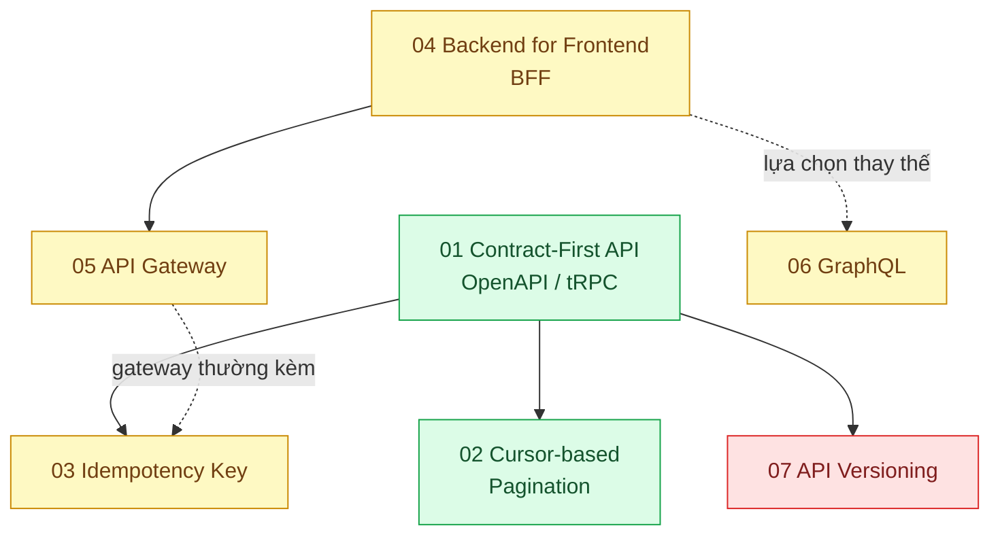

# 01 · Giao tiếp Frontend ↔ Backend (`frontend / backend / transporter`)

> **Phạm vi:** Cách frontend (web, mobile, app đối tác) nói chuyện với backend: hợp đồng API, hình
> dạng dữ liệu, phân trang, an toàn khi gửi lại, cửa vào duy nhất, tiến hóa API theo thời gian.
> Không gồm realtime (scope 06), xác thực (scope 19) và giao tiếp service↔service (scope 13).
>
> **Câu hỏi trung tâm:** Frontend và backend nói chuyện bằng hợp đồng nào để không hiểu nhầm nhau,
> không gửi thừa, và không hỏng khi một bên thay đổi?

## Bản đồ pattern trong scope

Mũi tên liền: nên học trước. Mũi tên đứt: quan hệ thay thế hoặc thường đi cùng.

## Danh sách bài toán

| # | Bài toán (pattern — triệu chứng) | Mức | Pattern gốc / nguồn | Trạng thái |
|---|---|---|---|---|
| 01 | [Contract-First API (OpenAPI) — Frontend gọi sai tên trường, lỗi chỉ lộ khi chạy](./01-contract-first-openapi-frontend-goi-sai-ten-truong/) | 🟢 | OpenAPI Specification 3.1; Microsoft REST API Guidelines; tRPC docs (phương án type-safe end-to-end) | ✅ |
| 02 | [Cursor-based Pagination — Trang 500 của lịch sử giao dịch mất 6 giây và lặp bản ghi](./02-cursor-pagination-trang-500-lich-su-giao-dich/) | 🟢 | Slack Engineering, "Evolving API Pagination at Slack" (2017); Use The Index, Luke — keyset pagination | 📋 |
| 03 | [Idempotency Key — Khách bấm "Thanh toán" hai lần vì mạng chập chờn, bị trừ tiền hai lần](./03-idempotency-key-bam-thanh-toan-hai-lan/) | 🟡 | Stripe API "Idempotent requests"; IETF draft Idempotency-Key header; Amazon Builders' Library "Making retries safe with idempotent APIs" | 📋 |
| 04 | [Backend for Frontend (BFF) — Web, mobile và app đối tác cần hình dạng dữ liệu khác nhau từ cùng một hệ thống](./04-bff-web-mobile-can-du-lieu-khac-nhau/) | 🟡 | Sam Newman, "Backends For Frontends" (2015); Azure Architecture Center "Backends for Frontends" | 📋 |
| 05 | [API Gateway — App di động phải gọi 7 service nội bộ để vẽ một màn hình](./05-api-gateway-mobile-goi-bay-service/) | 🟡 | microservices.io "API Gateway"; Azure "Gateway Aggregation / Routing / Offloading" | 📋 |
| 06 | [GraphQL — Màn hình dashboard tải 2 MB JSON nhưng chỉ hiển thị 12 trường](./06-graphql-dashboard-tai-2mb-hien-12-truong/) | 🟡 | GraphQL Specification; Lee Byron, "GraphQL: A data query language" (Facebook Engineering, 2015); Apollo docs | 📋 |
| 07 | [API Versioning — App cũ trên máy khách chưa cập nhật vẫn phải chạy sau khi backend đổi API](./07-api-versioning-app-cu-van-phai-chay/) | 🔴 | Stripe, "APIs as infrastructure: future-proofing Stripe with versioning" (2017); Microsoft REST API Guidelines (Versioning); DDIA ch.4 (tương thích hai chiều) | 📋 |

## Lộ trình đề xuất trong scope

1. **Contract-first** — mọi bài sau đều giả định có hợp đồng API rõ ràng để kiểm chứng.
2. **Cursor pagination** — bài nhỏ, thấy ngay tác dụng bằng `EXPLAIN ANALYZE`.
3. **Idempotency key** — bài quan trọng nhất về tiền; cần hiểu transaction và unique constraint.
4. **BFF → API Gateway** — hai bài liền nhau: BFF giải quyết "hình dạng dữ liệu theo client",
   gateway giải quyết "cửa vào và cross-cutting concern". Dễ nhầm; làm cạnh nhau để phân biệt.
5. **GraphQL** — xem như một lựa chọn thay thế BFF cho màn hình tổng hợp; so sánh với bài 04.
6. **API versioning** — cuối cùng vì cần hiểu toàn bộ các bài trên mới thấy chi phí của việc đổi API.

## Kiến thức nền cần có trước

- HTTP cơ bản: method, status code, header, cache header (liên quan scope 04).
- JSON Schema / TypeScript type để đọc OpenAPI.
- SQL: index, `ORDER BY ... LIMIT`, unique constraint (bài 02, 03).

## Liên kết với scope khác

- `13-backend-transporter` — rate limiting, webhooks, gRPC: phần "sau gateway".
- `19-backend-frontend-authenticate` — bài BFF token handler là ứng dụng của BFF cho xác thực.
- `04-frontend-cache` — ETag/Cache-Control là một phần của hợp đồng API.
- `02-backend-database` — keyset pagination dựa trên index; bài 02 ở đây dùng kiến thức bài 01 scope 02.

## Nguồn tổng quan cho scope

- Microsoft REST API Guidelines — https://github.com/microsoft/api-guidelines
- Sam Newman, *Building Microservices* (2021), chương về giao tiếp và BFF.
- Chris Richardson, *Microservices Patterns* (2018), chương "External API patterns".
