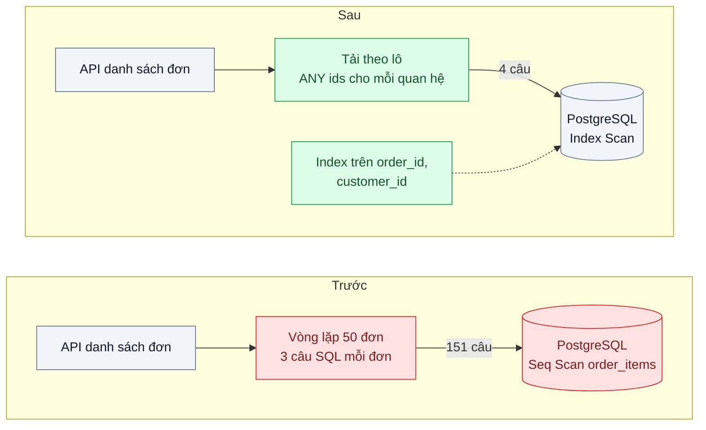
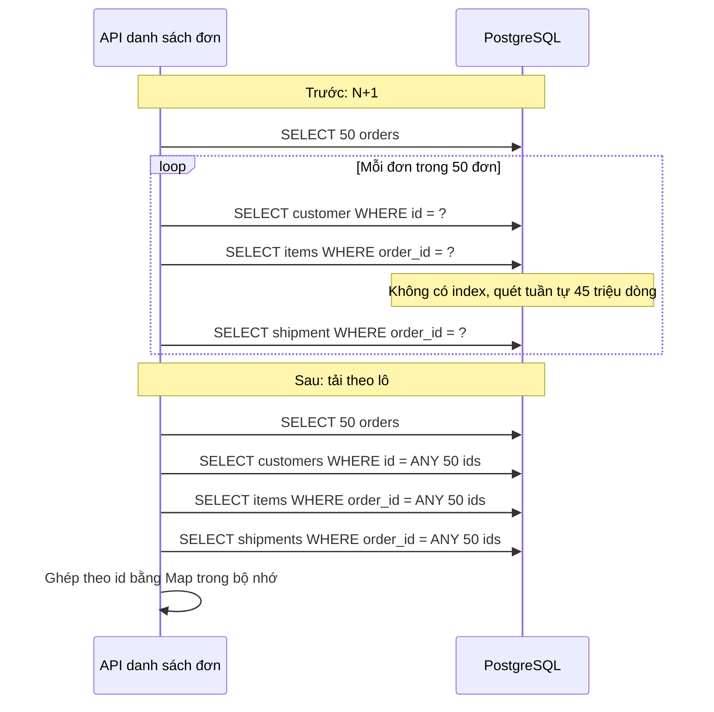

# N+1 Query & Indexing — Trang danh sách 50 đơn hàng bắn 151 câu SQL

| Scope | Mức độ | Trạng thái | Pattern gốc | Cập nhật |
|---|---|---|---|---|
| 02 · backend / database | 🟢 Cơ bản | 📋 Kế hoạch | N+1 Query (anti-pattern) & Indexing — Rails Guides "Active Record Querying"; Winand, *Use The Index, Luke* | 2026-10-06 |

> **Một câu tóm tắt:** Thay vì tải quan hệ của từng đơn trong vòng lặp (1 + 50 × 3 câu SQL), tải theo lô bằng một câu cho mỗi loại quan hệ và đặt index đúng trên cột khóa ngoại, để số câu SQL không còn tăng theo số dòng trên trang.

## 1. Bài toán thực tế (What)

**Bối cảnh** *(doanh nghiệp giả định, số liệu minh họa)*
Sàn thương mại điện tử khoảng 30.000 đơn mỗi ngày, bảng `orders` khoảng 15 triệu dòng, `order_items` khoảng 45 triệu dòng. Trang quản trị "Danh sách đơn hàng" cho 120 nhân viên vận hành hiển thị 50 đơn mỗi trang kèm tên khách, số sản phẩm, trạng thái giao hàng.

**Triệu chứng người kinh doanh nhìn thấy**
- Trang danh sách đơn mất khoảng 2,5 giây mỗi lần lọc hay chuyển trang; nhân viên xử lý đơn chậm, đơn tồn cuối ngày tăng.
- Giờ cao điểm, trang quản trị chậm kéo theo API đặt hàng của khách chậm vì dùng chung database.
- Đội kỹ thuật đã nâng cấp database hai lần trong năm mà tình hình chỉ đỡ vài tuần.

**Nguyên nhân kỹ thuật**
Code lấy 50 đơn bằng một câu SQL, rồi trong vòng lặp gọi `getCustomer(order.customerId)`, `getItems(order.id)`, `getShipment(order.id)`: tổng 1 + 50 × 3 = 151 câu SQL, mỗi câu tốn một vòng mạng tới DB. Tệ hơn, `order_items.order_id` và `shipments.order_id` là khóa ngoại nhưng không có index (PostgreSQL không tự tạo index cho cột tham chiếu), nên mỗi câu `getItems` là một lần quét tuần tự bảng lớn. Mẫu "N+1" này thường ẩn trong ORM có lazy loading nên không ai nhìn thấy trong code.

**Ràng buộc**
- Không đổi giao diện trang quản trị và hợp đồng API.
- Không thêm cache hay hệ thống mới; mục tiêu là sửa đúng chỗ ở tầng truy vấn.
- Index mới phải tạo được trên bảng đang chạy mà không khóa ghi lâu.

## 2. Vì sao dùng pattern này (Why)

**Nguyên nhân gốc mà pattern nhắm vào:** số câu SQL tỷ lệ với số dòng hiển thị, và mỗi câu lại quét tuần tự vì thiếu index trên cột dùng để nối.

**Pattern giải quyết thế nào:** Rails Guides mô tả N+1 và cách chữa bằng eager loading: tải trước quan hệ cho cả tập bản ghi trong một (hoặc vài) câu SQL thay vì từng bản ghi. Ở tầng SQL thuần, việc này là gom id rồi chạy `WHERE order_id = ANY($1)` cho mỗi loại quan hệ (4 câu cố định), hoặc một câu JOIN kèm tổng hợp. Phần index theo Winand: cột xuất hiện trong điều kiện lọc và nối phải có index B-tree phù hợp, nếu không mỗi lần tra là đọc cả bảng. Kiểm chứng bằng `EXPLAIN (ANALYZE, BUFFERS)`: kế hoạch đổi từ `Seq Scan` sang `Index Scan`, số buffer đọc giảm mạnh.

**Lựa chọn khác đã cân nhắc**

| Lựa chọn | Giải quyết được gì | Vì sao không chọn (ở bài này) |
|---|---|---|
| Giữ nguyên + tối ưu nhỏ (nâng cấu hình DB, tăng pool) | Mỗi câu nhanh hơn một chút | 151 vòng mạng vẫn còn; tiền phần cứng tăng mà gốc rễ không đổi |
| Chỉ thêm index | Mỗi câu thành index scan | Vẫn 151 câu; chi phí vòng mạng và lập kế hoạch truy vấn vẫn lớn |
| Cache kết quả trang (scope 03) | Trang lặp lại nhanh | Danh sách đơn đổi liên tục và lọc đa dạng, tỷ lệ trúng thấp; che giấu lỗi truy vấn |
| Một câu JOIN lớn trả mọi thứ | Một vòng mạng | Nhân bản dòng (một đơn nhiều sản phẩm), dữ liệu thừa; khó tái sử dụng |
| Tải theo lô `ANY(ids)` + index khóa ngoại (chọn) | Số câu SQL cố định, mỗi câu dùng index | Code tầng truy vấn dài hơn vòng lặp ngây thơ một chút |

## 3. Thiết kế hệ thống (How)

### 3.1 Kiến trúc trước và sau



### 3.2 Luồng chính



### 3.3 Thành phần và trách nhiệm

| Thành phần | Trách nhiệm | Quyết định thiết kế đáng chú ý |
|---|---|---|
| Repository danh sách đơn | Lấy trang đơn và tải quan hệ theo lô | Hàm `loadItemsByOrderIds(ids)` thay cho `getItems(id)` trong vòng lặp |
| Bộ ghép trong bộ nhớ | Nhóm kết quả theo khóa và gắn vào từng đơn | `Map` theo id, độ phức tạp tuyến tính |
| Index khóa ngoại | Cho phép tra theo `order_id` bằng index | Tạo bằng `CREATE INDEX CONCURRENTLY` để không chặn ghi |
| Bộ đếm truy vấn | Đếm số câu SQL mỗi request trong test và log | Test thất bại nếu vượt ngưỡng, chặn N+1 quay lại |
| `pg_stat_statements` | Thống kê câu SQL theo tần suất và tổng thời gian | Câu được gọi hàng nghìn lần với thời gian nhỏ là dấu hiệu N+1 |

### 3.4 Điểm dễ sai khi triển khai
- **N+1 ẩn trong ORM.** Truy cập `order.items` trong template với lazy loading là một câu SQL; đọc log SQL hoặc dùng bộ đếm, đừng đọc code đoán.
- **Index sai thứ tự cột.** Index `(created_at, order_id)` không giúp tra theo `order_id`; cột dùng để lọc bằng đẳng thức nên đứng đầu.
- **`CREATE INDEX` thường trên bảng đang chạy** khóa ghi trong suốt thời gian tạo. Dùng `CONCURRENTLY` và kiểm tra index không ở trạng thái invalid nếu tạo thất bại.
- **Mảng id quá lớn.** `ANY` với hàng chục nghìn id vẫn chạy nhưng kế hoạch có thể đổi; giữ kích thước lô theo kích thước trang.
- **Đo trên dữ liệu nhỏ.** Với 1.000 dòng, quét tuần tự còn nhanh hơn index; phải seed gần quy mô thật mới thấy khác biệt.

## 4. Tech stack và tác động (Impact techstack)

| Lớp | Công nghệ chọn | Vì sao chọn | Thay thế tương đương |
|---|---|---|---|
| Database | PostgreSQL 16 | `ANY($1)` với mảng tham số, `CREATE INDEX CONCURRENTLY`, `EXPLAIN (ANALYZE, BUFFERS)` | MySQL 8 (`IN (...)`) |
| Truy cập dữ liệu | Kysely | SQL rõ ràng, có type; không có lazy loading ngầm | Drizzle; TypeORM hoặc Prisma với eager loading tường minh |
| API | NestJS 10, TypeScript strict | Stack mặc định | Fastify |
| Thống kê truy vấn | `pg_stat_statements`, `auto_explain` | Tìm câu SQL bị gọi nhiều nhất và kế hoạch của câu chậm | Log `log_min_duration_statement` |
| Seed | `generate_series` trong SQL | Sinh hàng chục triệu dòng nhanh | Script Node chèn theo lô |
| Đo | k6, `EXPLAIN (ANALYZE, BUFFERS)` | p95 của trang và chi tiết từng câu | pgbench với script tùy biến |

**Thay đổi so với hệ thống hiện tại:** sửa repository danh sách đơn sang tải theo lô, thêm hai index khóa ngoại, bật `pg_stat_statements`, thêm test đếm truy vấn. Đội học đọc `EXPLAIN` và thói quen soi số câu SQL mỗi request khi review.

## 5. Kết quả đầu ra và cách đo (Output impact)

| Chỉ số | Trước (minh họa) | Mục tiêu khi thực hành | Cách đo |
|---|---|---|---|
| Số câu SQL mỗi lần tải trang | 151 | ≤ 4 | Bộ đếm truy vấn trong test; `pg_stat_statements` sau 100 lần tải |
| p95 API danh sách đơn | 2.500 ms | ≤ 150 ms | k6 20 người dùng ảo, 5 phút, seed 15 triệu đơn |
| Kế hoạch truy vấn items theo order | Seq Scan | Index Scan hoặc Bitmap Index Scan | `EXPLAIN (ANALYZE, BUFFERS)` |
| Buffer đọc cho một lần tải trang | hàng trăm nghìn | vài trăm | Tổng `Buffers: shared hit/read` của các câu |
| p95 API đặt hàng khi trang quản trị chịu tải | 900 ms | không tăng quá 10 % so với khi không tải | k6 chạy song song hai kịch bản |

> Số "trước" là minh họa để hình dung bài toán. Số "mục tiêu" chỉ được coi là đạt khi có số đo thật
> ở mục 8 kèm môi trường đo.

**Tác động nghiệp vụ mong đợi:** nhân viên vận hành xử lý đơn nhanh hơn, trang quản trị không còn kéo chậm luồng đặt hàng của khách, và hoãn được việc nâng cấp database.

## 6. Đánh đổi và khi KHÔNG nên dùng

**Đánh đổi**
- Mỗi index tăng chi phí ghi và dung lượng; chỉ thêm index có truy vấn thật cần.
- Code tải theo lô dài hơn vòng lặp; cần quy ước chung để không mỗi người viết một kiểu.
- Bộ đếm truy vấn trong test phải cập nhật khi tính năng thật sự cần thêm quan hệ.

**Không nên dùng khi**
- Danh sách luôn rất ngắn (vài dòng) và hiếm khi gọi: N+1 vô hại, đừng tối ưu sớm.
- Bảng nhỏ vừa bộ nhớ, ghi rất nhiều: index thêm có thể làm chậm ghi hơn lợi ích đọc.
- Màn hình tổng hợp phải nối quá nhiều bảng: cân nhắc mô hình đọc riêng (bài 06) thay vì tối ưu từng câu.

**Liên quan**
- Đọc sau: `../05-read-replica-bao-cao-cuoi-thang-lam-cham-tao-don/` — khi truy vấn đã tối ưu mà tải đọc vẫn lớn.
- Đọc sau: `../09-partitioning-bang-su-kien-500-trieu-dong/` — index và kế hoạch truy vấn trên bảng rất lớn.
- Áp dụng: `../../01-frontend-backend-transporter/02-cursor-pagination-trang-500-lich-su-giao-dich/` — index phục vụ phân trang.
- Cùng chủ đề: `../../01-frontend-backend-transporter/06-graphql-dashboard-tai-2mb-hien-12-truong/` — DataLoader là tải theo lô ở tầng GraphQL.

## 7. Cơ sở tham khảo

- Rails Guides, "Active Record Query Interface", mục Eager Loading Associations — https://guides.rubyonrails.org/active_record_querying.html — mô tả bài toán N+1 và cách tải trước quan hệ, áp dụng được cho mọi ORM.
- PostgreSQL docs, "Using EXPLAIN" — https://www.postgresql.org/docs/current/using-explain.html — đọc kế hoạch, `ANALYZE`, `BUFFERS` để đo trước và sau.
- PostgreSQL docs, "Constraints" (Foreign Keys) và "CREATE INDEX" (`CONCURRENTLY`) — https://www.postgresql.org/docs/ — khóa ngoại không tự tạo index ở cột tham chiếu; tạo index không chặn ghi.
- Markus Winand, *Use The Index, Luke* — https://use-the-index-luke.com/ — cấu trúc B-tree, thứ tự cột trong index phức hợp, index cho phép nối.

## 8. Kế hoạch thực hành

- [ ] Bước 1: Docker Compose PostgreSQL 16 bật `pg_stat_statements`; seed 15 triệu đơn, 45 triệu dòng sản phẩm, không có index khóa ngoại.
- [ ] Bước 2: đo "trước": API vòng lặp, đếm câu SQL mỗi request, `EXPLAIN (ANALYZE, BUFFERS)` câu items, k6 p95.
- [ ] Bước 3: viết repository tải theo lô, tạo index bằng `CREATE INDEX CONCURRENTLY`, thêm bộ đếm truy vấn.
- [ ] Bước 4: đo "sau" cùng kịch bản, kể cả kịch bản chạy song song với API đặt hàng; ghi số thật và môi trường vào mục 5.
- [ ] Bước 5: viết test: (a) tải trang 50 đơn dùng tối đa 4 câu SQL; (b) kết quả của phiên bản theo lô giống hệt phiên bản vòng lặp; (c) kế hoạch câu items dùng index trên dữ liệu seed.

**Cấu trúc code dự kiến**
```text
src/
  truoc/order-list.naive-repository.ts     # vòng lặp, tái hiện N+1
  sau/order-list.repository.ts             # [PATTERN] tải theo lô ANY ids
  shared/query-counter.ts                  # đếm câu SQL mỗi request
db/
  seed-orders.sql
  add-foreign-key-indexes.sql              # CREATE INDEX CONCURRENTLY
test/
  order-list-query-count.test.ts
  order-list-same-result.test.ts
bench/order-list.k6.js
docker-compose.yml
```

**Cách chạy** *(điền khi bắt đầu code)*
```bash
docker compose up -d
pnpm install && pnpm test
```
