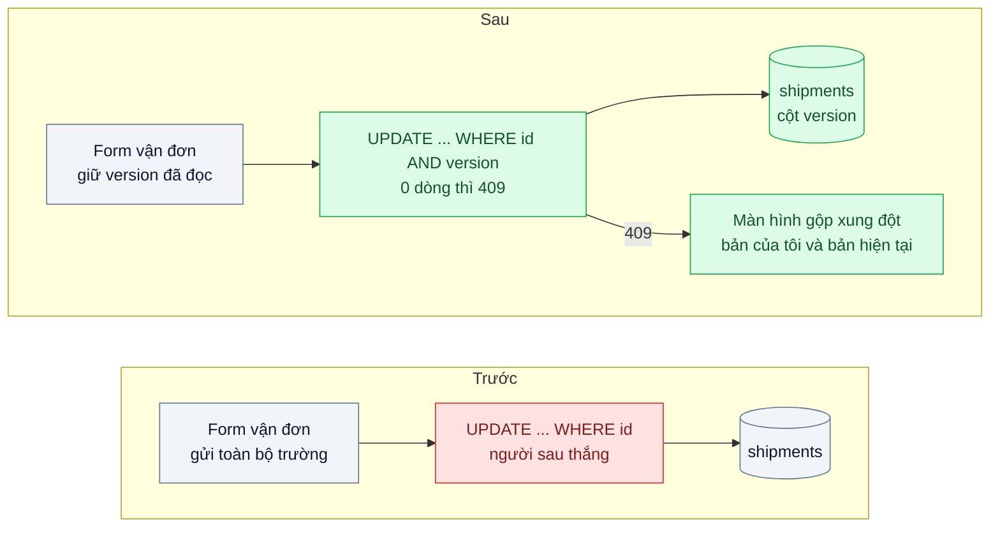
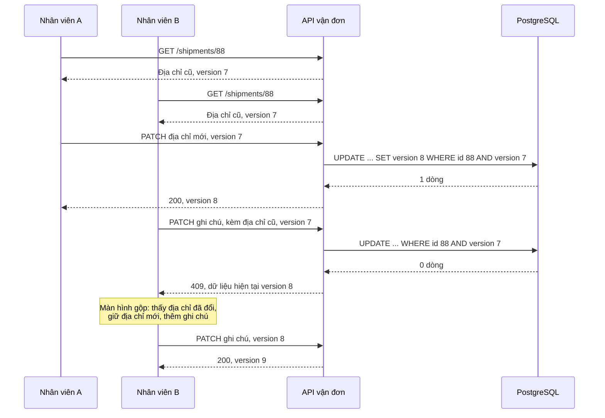

# Optimistic Offline Lock — Hai nhân viên cùng sửa một đơn, người lưu sau ghi đè người lưu trước

| Scope | Mức độ | Trạng thái | Pattern gốc | Cập nhật |
|---|---|---|---|---|
| 02 · backend / database | 🟢 Cơ bản | 📋 Kế hoạch | Optimistic Offline Lock — Fowler, *PoEAA* (2002) | 2026-10-06 |

> **Một câu tóm tắt:** Mỗi bản ghi mang một số phiên bản; lệnh lưu chỉ thành công nếu phiên bản trong DB vẫn là phiên bản người dùng đã đọc, nên người lưu sau được báo "đơn đã bị người khác sửa" thay vì âm thầm xóa mất thay đổi của người trước.

## 1. Bài toán thực tế (What)

**Bối cảnh** *(doanh nghiệp giả định, số liệu minh họa)*
Công ty logistics có khoảng 150 nhân viên chăm sóc khách hàng và điều phối cùng làm trên màn hình "Chi tiết vận đơn" của hệ thống nội bộ. Mỗi ngày có khoảng 6.000 lượt sửa vận đơn: đổi địa chỉ, đổi giờ hẹn, sửa tiền thu hộ, thêm ghi chú. Form tải toàn bộ vận đơn, nhân viên sửa vài phút rồi bấm "Lưu"; backend ghi lại toàn bộ các trường.

**Triệu chứng người kinh doanh nhìn thấy**
- Khách gọi đổi địa chỉ, nhân viên A đã sửa và xác nhận với khách, nhưng hàng vẫn giao tới địa chỉ cũ: mỗi tuần khoảng 25 vụ, mỗi vụ tốn phí giao lại và một khách không hài lòng.
- Tiền thu hộ trên vận đơn bị "nhảy" về giá trị cũ, đối soát với shop bị lệch.
- Không ai giải thích được vì sao: log chỉ cho thấy nhân viên B "lưu" vận đơn, không cho thấy B đã ghi đè.

**Nguyên nhân kỹ thuật**
A và B cùng mở vận đơn lúc 9h00. A đổi địa chỉ và lưu lúc 9h02. B, vẫn đang nhìn bản tải lúc 9h00, sửa ghi chú và lưu lúc 9h05: lệnh `UPDATE` ghi toàn bộ các trường của form B, trong đó có địa chỉ *cũ*. Đây là *lost update*. Transaction của database không bảo vệ được vì "giao dịch nghiệp vụ" (đọc, suy nghĩ, sửa, lưu) kéo dài vài phút và trải qua nhiều request; mỗi request là một transaction ngắn riêng.

**Ràng buộc**
- Nhiều người cùng xem một vận đơn là bình thường; không được chặn người khác mở form.
- Xung đột thật sự hiếm (ước khoảng 1 % lượt sửa), nhưng mỗi lần xảy ra là mất tiền.
- Không giữ khóa DB trong lúc người dùng đang suy nghĩ.

## 2. Vì sao dùng pattern này (Why)

**Nguyên nhân gốc mà pattern nhắm vào:** lệnh ghi không kiểm tra dữ liệu có còn là dữ liệu người dùng đã nhìn thấy khi quyết định sửa hay không.

**Pattern giải quyết thế nào:** Fowler mô tả Optimistic Offline Lock cho các giao dịch nghiệp vụ trải qua nhiều transaction hệ thống: thay vì ngăn xung đột, ta *phát hiện* xung đột lúc ghi và hủy giao dịch đó. Mỗi vận đơn có cột `version`. Khi đọc, client nhận kèm `version = 7`. Khi lưu: `UPDATE shipments SET ..., version = version + 1 WHERE id = $1 AND version = 7`. Nếu ai đó đã lưu trước, `version` trong DB là 8, câu lệnh cập nhật 0 dòng, backend trả 409 kèm dữ liệu hiện tại để người dùng xem và gộp lại. Phép kiểm tra và ghi nằm trong *một* câu `UPDATE`, nên nguyên tử dưới mức cô lập mặc định Read Committed của PostgreSQL. Fowler đặt cạnh nó Pessimistic Offline Lock (khóa bản ghi trong suốt giao dịch nghiệp vụ) cho trường hợp xung đột thường xuyên hoặc rất đắt.

**Lựa chọn khác đã cân nhắc**

| Lựa chọn | Giải quyết được gì | Vì sao không chọn (ở bài này) |
|---|---|---|
| Giữ nguyên + tối ưu nhỏ (chỉ gửi trường đã đổi) | Giảm ghi đè trường không liên quan | Hai người cùng sửa một trường vẫn mất dữ liệu im lặng; không phát hiện được xung đột |
| `SELECT ... FOR UPDATE` trong transaction | Khóa dòng khi ghi | Khóa chỉ sống trong một transaction ngắn, không trải qua vài phút người dùng sửa form |
| Pessimistic Offline Lock (khóa "đang sửa" theo người dùng) | Ngăn hẳn xung đột | Chặn người khác trong khi xung đột hiếm; phải xử lý khóa bị bỏ quên khi người dùng đóng tab |
| So sánh mọi cột cũ trong `WHERE` | Phát hiện xung đột không cần thêm cột | Câu lệnh dài, dễ sai với `NULL` và kiểu thời gian; khó dùng làm ETag |
| Cột `version` + `UPDATE ... WHERE version` (chọn) | Phát hiện mọi ghi đè, không khóa, rẻ | Người lưu sau phải gộp lại thủ công khi có xung đột |

## 3. Thiết kế hệ thống (How)

### 3.1 Kiến trúc trước và sau



### 3.2 Luồng chính



### 3.3 Thành phần và trách nhiệm

| Thành phần | Trách nhiệm | Quyết định thiết kế đáng chú ý |
|---|---|---|
| Cột `version` | Đánh dấu mỗi lần thay đổi đã commit | Số nguyên tăng dần; không dùng `updated_at` vì độ phân giải và đồng hồ |
| Repository | `UPDATE ... WHERE id AND version` rồi kiểm tra số dòng ảnh hưởng | Mọi đường ghi vào vận đơn đều phải đi qua đây, kể cả job nền |
| Lỗi xung đột | Ném lỗi miền `ConcurrentModification`, API đổi thành 409 kèm bản hiện tại | Không tự động thử lại: quyết định gộp thuộc về người dùng |
| Hợp đồng HTTP | Trả `version` trong body hoặc `ETag`; nhận lại qua body hoặc `If-Match` | `If-Match` không khớp có thể trả 412 theo ngữ nghĩa HTTP |
| Màn hình gộp | Hiển thị trường khác nhau giữa bản của tôi và bản hiện tại | Trường không xung đột được gộp sẵn, chỉ hỏi trường bị sửa cả hai phía |

### 3.4 Điểm dễ sai khi triển khai
- **Một đường ghi quên kiểm tra version** (script sửa dữ liệu, job đồng bộ) vẫn ghi đè. Chặn bằng quy ước: chỉ repository được ghi, có test cho từng đường.
- **Đọc rồi so sánh version trong code, sau đó mới `UPDATE`.** Giữa hai bước, người khác có thể ghi. Phép kiểm tra phải nằm trong chính `WHERE` của `UPDATE`.
- **Dùng `updated_at` làm version.** Hai lần ghi trong cùng mili giây, hoặc đồng hồ máy chủ lệch, sẽ lọt.
- **Tự động thử lại khi 409.** Thử lại với dữ liệu cũ chính là ghi đè có thêm bước; chỉ thử lại tự động khi thao tác là phép cộng dồn tính lại được từ bản mới.
- **Không kiểm tra bản ghi tồn tại.** `UPDATE` 0 dòng có thể là "đã bị sửa" hoặc "không tồn tại"; phân biệt để trả 409 hay 404.

## 4. Tech stack và tác động (Impact techstack)

| Lớp | Công nghệ chọn | Vì sao chọn | Thay thế tương đương |
|---|---|---|---|
| Database | PostgreSQL 16 | `UPDATE ... RETURNING` trả bản mới trong một vòng; Read Committed đủ cho phép kiểm tra trong `WHERE` | MySQL 8 |
| Truy cập dữ liệu | Kysely | Đọc được `numUpdatedRows` để phát hiện 0 dòng | TypeORM `@VersionColumn`, Prisma với điều kiện `where` (cần xác minh) |
| API | NestJS 10, exception filter đổi lỗi xung đột thành 409 | Tách lỗi miền khỏi HTTP | Fastify error handler |
| Frontend | Next.js form giữ `version`, màn hình gộp | Người dùng tự quyết định khi có xung đột | — |
| Test | Vitest, hai kết nối DB song song | Tái hiện chính xác thứ tự đọc, ghi, ghi | k6 cho kịch bản nhiều cặp đồng thời |

**Thay đổi so với hệ thống hiện tại:** thêm cột `version` (migration thêm cột có mặc định, nhanh trên PostgreSQL 11 trở lên), sửa repository và hợp đồng API, thêm màn hình gộp. Nhân viên CSKH được hướng dẫn đọc thông báo "vận đơn đã được người khác sửa".

## 5. Kết quả đầu ra và cách đo (Output impact)

| Chỉ số | Trước (minh họa) | Mục tiêu khi thực hành | Cách đo |
|---|---|---|---|
| Lost update trong 1.000 cặp sửa đồng thời | khoảng 1.000 | 0 | Test hai client đọc cùng version rồi lần lượt ghi; so trạng thái cuối |
| Xung đột được báo cho người dùng | 0 % | 100 % số lần ghi đè tiềm năng | Đếm phản hồi 409 trong cùng test |
| Overhead của câu `UPDATE` | không đổi | p95 tăng ≤ 1 ms | k6 so sánh trước và sau trên cùng seed |
| Vụ giao sai địa chỉ do ghi đè | 25 mỗi tuần | không đo được trong lab | Chỉ số nghiệp vụ theo dõi sau triển khai thật |

> Số "trước" là minh họa để hình dung bài toán. Số "mục tiêu" chỉ được coi là đạt khi có số đo thật
> ở mục 8 kèm môi trường đo.

**Tác động nghiệp vụ mong đợi:** không còn mất âm thầm thay đổi địa chỉ hay tiền thu hộ; khi có xung đột, nhân viên được báo ngay và xử lý trong vài giây thay vì để khách phát hiện.

## 6. Đánh đổi và khi KHÔNG nên dùng

**Đánh đổi**
- Người lưu sau phải làm lại hoặc gộp; nếu xung đột thường xuyên, trải nghiệm rất khó chịu.
- Mọi đường ghi phải tuân thủ; một đường lách là pattern mất tác dụng.
- Cần thiết kế màn hình gộp, không chỉ thông báo lỗi.

**Không nên dùng khi**
- Xung đột thường xuyên và chi phí làm lại cao (soạn hợp đồng dài nhiều giờ): Pessimistic Offline Lock hoặc chia nhỏ bản ghi hợp hơn.
- Thao tác là phép cộng dồn (trừ tồn kho, cộng điểm): dùng `UPDATE ... SET qty = qty - 1 WHERE qty > 0` nguyên tử, không cần người dùng gộp.
- Nhiều người cùng sửa văn bản theo thời gian thực: cần CRDT hoặc OT (scope 06).

**Liên quan**
- Đọc sau: `../04-audit-log-ai-doi-gia-hop-dong-luc-nao/` — ghi lại ai đổi gì, bổ trợ cho việc phát hiện xung đột.
- Cùng chủ đề: `../../06-frontend-backend-realtime/07-crdt-nhieu-nguoi-cung-sua-mot-bao-gia/` — khi nhiều người sửa cùng lúc là bình thường.
- Cùng chủ đề: `../../04-frontend-cache/04-optimistic-ui-bam-thich-cho-mot-giay/` — "optimistic" ở giao diện, khác với ở database.
- Cùng chủ đề: `../../03-backend-cache/06-distributed-lock-hai-worker-cung-chay-mot-job/` — khóa giữa tiến trình, khi cần ngăn hẳn chạy song song.

## 7. Cơ sở tham khảo

- Martin Fowler, *Patterns of Enterprise Application Architecture*, Addison-Wesley, 2002, "Optimistic Offline Lock" — https://martinfowler.com/eaaCatalog/optimisticOfflineLock.html — định nghĩa, cột version, điều kiện áp dụng khi xung đột hiếm.
- Martin Fowler, *PoEAA*, "Pessimistic Offline Lock" — https://martinfowler.com/eaaCatalog/pessimisticOfflineLock.html — phương án so sánh khi xung đột thường xuyên.
- PostgreSQL docs, "Explicit Locking" và "Transaction Isolation" — https://www.postgresql.org/docs/current/explicit-locking.html — vì sao `FOR UPDATE` không trải qua nhiều request; hành vi `UPDATE` dưới Read Committed.
- Kysely docs — https://kysely.dev/docs/intro — kết quả `UPDATE` trả số dòng ảnh hưởng (cần xác minh tên trường theo phiên bản).

## 8. Kế hoạch thực hành

- [ ] Bước 1: dựng API vận đơn trên PostgreSQL với `UPDATE` ghi toàn bộ trường; seed 10.000 vận đơn.
- [ ] Bước 2: đo "trước": test 1.000 cặp client đọc cùng lúc, ghi lần lượt; đếm số lần thay đổi của người trước bị mất.
- [ ] Bước 3: thêm cột `version`, sửa repository dùng `WHERE version`, trả 409 kèm bản hiện tại; thêm màn hình gộp tối giản.
- [ ] Bước 4: đo "sau" cùng kịch bản, thêm đo overhead p95; ghi số thật và môi trường vào mục 5.
- [ ] Bước 5: viết test: (a) hai lần ghi từ cùng version thì lần sau nhận 409 và DB giữ thay đổi lần đầu; (b) ghi với version mới nhất thành công và tăng version; (c) vận đơn không tồn tại trả 404 chứ không 409; (d) job nền cũng bị kiểm tra version.

**Cấu trúc code dự kiến**
```text
src/
  shipments/shipment.repository.ts          # [PATTERN] UPDATE ... WHERE version
  shipments/concurrent-modification.error.ts
  shipments/shipments.controller.ts         # 409 kèm bản hiện tại
  truoc/shipment.last-write-wins.ts         # tái hiện lost update
web/app/shipments/[id]/merge-conflict.tsx
test/
  stale-version-gets-conflict.test.ts
  lost-update-reproduction.test.ts
docker-compose.yml
```

**Cách chạy** *(điền khi bắt đầu code)*
```bash
docker compose up -d
pnpm install && pnpm test
```
