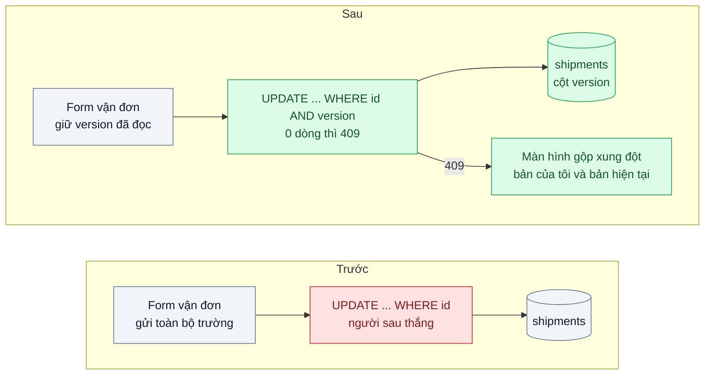
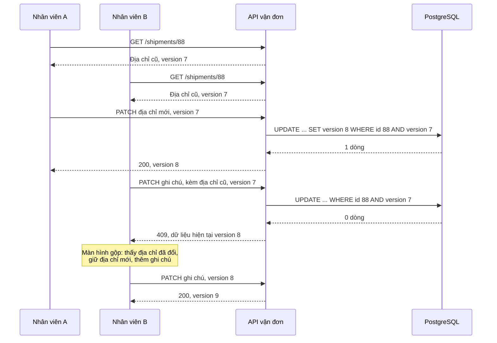

# Optimistic Offline Lock — Hai nhân viên cùng sửa một đơn, người lưu sau ghi đè người lưu trước

| Scope | Mức độ | Trạng thái | Pattern gốc | Cập nhật |
|---|---|---|---|---|
| 02 · backend / database | 🟢 Cơ bản | ✅ Hoàn thành | Optimistic Offline Lock — Fowler, *PoEAA* (2002) | 2026-10-07 |

> **Một câu tóm tắt:** Mỗi bản ghi mang một số phiên bản; lệnh lưu chỉ thành công nếu phiên bản trong DB vẫn là phiên bản người dùng đã đọc, nên người lưu sau được báo "đơn đã bị người khác sửa" thay vì âm thầm xóa mất thay đổi của người trước.

## 1. Bài toán thực tế (What)

**Bối cảnh** *(doanh nghiệp giả định, số liệu minh họa)*
Công ty logistics có khoảng 150 nhân viên chăm sóc khách hàng và điều phối cùng làm trên màn hình "Chi tiết vận đơn" của hệ thống nội bộ. Mỗi ngày có khoảng 6.000 lượt sửa vận đơn: đổi địa chỉ, đổi giờ hẹn, sửa tiền thu hộ, thêm ghi chú. Form tải toàn bộ vận đơn, nhân viên sửa vài phút rồi bấm "Lưu"; backend ghi lại toàn bộ các trường.

**Triệu chứng người kinh doanh nhìn thấy**
- Khách gọi đổi địa chỉ, nhân viên A đã sửa và xác nhận với khách, nhưng hàng vẫn giao tới địa chỉ cũ: mỗi tuần khoảng 25 vụ, mỗi vụ tốn phí giao lại và một khách không hài lòng.
- Tiền thu hộ trên vận đơn bị "nhảy" về giá trị cũ, đối soát với shop bị lệch.
- Không ai giải thích được vì sao: log chỉ cho thấy nhân viên B "lưu" vận đơn, không cho thấy B đã ghi đè.

**Nguyên nhân kỹ thuật**
A và B cùng mở vận đơn lúc 9h00. A đổi địa chỉ và lưu lúc 9h02. B, vẫn đang nhìn bản tải lúc 9h00, sửa ghi chú và lưu lúc 9h05: lệnh `UPDATE` ghi toàn bộ các trường của form B, trong đó có địa chỉ *cũ*. Đây là *lost update*. Transaction của database không bảo vệ được vì "giao dịch nghiệp vụ" (đọc, suy nghĩ, sửa, lưu) kéo dài vài phút và trải qua nhiều request; mỗi request là một transaction ngắn riêng.

**Ràng buộc**
- Nhiều người cùng xem một vận đơn là bình thường; không được chặn người khác mở form.
- Xung đột thật sự hiếm (ước khoảng 1 % lượt sửa), nhưng mỗi lần xảy ra là mất tiền.
- Không giữ khóa DB trong lúc người dùng đang suy nghĩ.

## 2. Vì sao dùng pattern này (Why)

**Nguyên nhân gốc mà pattern nhắm vào:** lệnh ghi không kiểm tra dữ liệu có còn là dữ liệu người dùng đã nhìn thấy khi quyết định sửa hay không.

**Pattern giải quyết thế nào:** Fowler mô tả Optimistic Offline Lock cho các giao dịch nghiệp vụ trải qua nhiều transaction hệ thống: thay vì ngăn xung đột, ta *phát hiện* xung đột lúc ghi và hủy giao dịch đó. Mỗi vận đơn có cột `version`. Khi đọc, client nhận kèm `version = 7`. Khi lưu: `UPDATE shipments SET ..., version = version + 1 WHERE id = $1 AND version = 7`. Nếu ai đó đã lưu trước, `version` trong DB là 8, câu lệnh cập nhật 0 dòng, backend trả 409 kèm dữ liệu hiện tại để người dùng xem và gộp lại. Phép kiểm tra và ghi nằm trong *một* câu `UPDATE`, nên nguyên tử dưới mức cô lập mặc định Read Committed của PostgreSQL. Fowler đặt cạnh nó Pessimistic Offline Lock (khóa bản ghi trong suốt giao dịch nghiệp vụ) cho trường hợp xung đột thường xuyên hoặc rất đắt.

**Lựa chọn khác đã cân nhắc**

| Lựa chọn | Giải quyết được gì | Vì sao không chọn (ở bài này) |
|---|---|---|
| Giữ nguyên + tối ưu nhỏ (chỉ gửi trường đã đổi) | Giảm ghi đè trường không liên quan | Hai người cùng sửa một trường vẫn mất dữ liệu im lặng; không phát hiện được xung đột |
| `SELECT ... FOR UPDATE` trong transaction | Khóa dòng khi ghi | Khóa chỉ sống trong một transaction ngắn, không trải qua vài phút người dùng sửa form |
| Pessimistic Offline Lock (khóa "đang sửa" theo người dùng) | Ngăn hẳn xung đột | Chặn người khác trong khi xung đột hiếm; phải xử lý khóa bị bỏ quên khi người dùng đóng tab |
| So sánh mọi cột cũ trong `WHERE` | Phát hiện xung đột không cần thêm cột | Câu lệnh dài, dễ sai với `NULL` và kiểu thời gian; khó dùng làm ETag |
| Cột `version` + `UPDATE ... WHERE version` (chọn) | Phát hiện mọi ghi đè, không khóa, rẻ | Người lưu sau phải gộp lại thủ công khi có xung đột |

## 3. Thiết kế hệ thống (How)

### 3.1 Kiến trúc trước và sau



### 3.2 Luồng chính



### 3.3 Thành phần và trách nhiệm

| Thành phần | Trách nhiệm | Quyết định thiết kế đáng chú ý |
|---|---|---|
| Cột `version` | Đánh dấu mỗi lần thay đổi đã commit | Số nguyên tăng dần; không dùng `updated_at` vì độ phân giải và đồng hồ |
| Repository | `UPDATE ... WHERE id AND version` rồi kiểm tra số dòng ảnh hưởng | Mọi đường ghi vào vận đơn đều phải đi qua đây, kể cả job nền |
| Lỗi xung đột | Ném lỗi miền `ConcurrentModification`, API đổi thành 409 kèm bản hiện tại | Không tự động thử lại: quyết định gộp thuộc về người dùng |
| Hợp đồng HTTP | Trả `version` trong body hoặc `ETag`; nhận lại qua body hoặc `If-Match` | `If-Match` không khớp có thể trả 412 theo ngữ nghĩa HTTP |
| Màn hình gộp | Hiển thị trường khác nhau giữa bản của tôi và bản hiện tại | Trường không xung đột được gộp sẵn, chỉ hỏi trường bị sửa cả hai phía |

### 3.4 Điểm dễ sai khi triển khai
- **Một đường ghi quên kiểm tra version** (script sửa dữ liệu, job đồng bộ) vẫn ghi đè. Tệ hơn, nếu nó cũng không *tăng* version thì mọi đường ghi khác bị "mù": test trong lab cho thấy script ghi `WHERE id` đổi tiền thu hộ mà version giữ nguyên, rồi form cầm version cũ vẫn qua kiểm tra và xóa mất thay đổi đó. Chặn bằng quy ước: chỉ repository được ghi, có test cho từng đường (lab có test riêng cho job nền).
- **Đọc rồi so sánh version trong code, sau đó mới `UPDATE`.** Giữa hai bước, người khác có thể ghi. Phép kiểm tra phải nằm trong chính `WHERE` của `UPDATE`. Lab đo được: lưu lần lượt thì cách này vẫn bắt đủ 1.000/1.000 xung đột, nhưng khi hai lần lưu tới cùng lúc thì 998/1.000 cặp (999 ở lần chạy lại) đều nhận 200 và mất một thay đổi; version vẫn tăng hai lần nên nhìn version cũng không phát hiện được.
- **Tưởng `SELECT ... FOR UPDATE` trong request lưu là đủ.** Khóa chỉ sống trong transaction của request đó; dữ liệu người dùng dựa vào để sửa được đọc ở request GET trước đó. Lab đo: 1.000/1.000 cặp vẫn mất thay đổi, kể cả khi hai lần lưu tới cùng lúc (lần sau chỉ chờ khóa rồi ghi đè).
- **Dùng `updated_at` làm version.** Hai lần ghi trong cùng mili giây, hoặc đồng hồ máy chủ lệch, sẽ lọt.
- **Tự động thử lại khi 409.** Thử lại với dữ liệu cũ chính là ghi đè có thêm bước; chỉ thử lại tự động khi thao tác là phép cộng dồn tính lại được từ bản mới.
- **Không kiểm tra bản ghi tồn tại.** `UPDATE` 0 dòng có thể là "đã bị sửa" hoặc "không tồn tại"; phân biệt để trả 409 hay 404.
- **Thời gian trên form mất độ chính xác.** `timestamptz` lưu tới micro giây, `Date` của JavaScript chỉ tới mili giây: form gửi lại giờ hẹn là âm thầm đổi giá trị dù người dùng không đụng, và bước gộp ba phía sẽ tưởng trường đó bị sửa. Lab làm tròn giờ hẹn tới phút trong seed; hệ thống thật nên lưu đúng độ chính xác nghiệp vụ.

## 4. Tech stack và tác động (Impact techstack)

| Lớp | Công nghệ chọn | Vì sao chọn | Thay thế tương đương |
|---|---|---|---|
| Database | PostgreSQL 16 | `UPDATE ... RETURNING` trả bản mới trong một vòng; Read Committed đủ cho phép kiểm tra trong `WHERE` | MySQL 8 |
| Truy cập dữ liệu | Kysely | Đọc được `numUpdatedRows` để phát hiện 0 dòng | TypeORM `@VersionColumn`, Prisma với điều kiện `where` (cần xác minh) |
| API | NestJS 10, exception filter đổi lỗi xung đột thành 409 | Tách lỗi miền khỏi HTTP | Fastify error handler |
| Frontend | Next.js form giữ `version`, màn hình gộp | Người dùng tự quyết định khi có xung đột | — |
| Test | Vitest, hai kết nối DB song song | Tái hiện chính xác thứ tự đọc, ghi, ghi | k6 cho kịch bản nhiều cặp đồng thời |

**Khi thực hành (lệch so với bảng trên):**
- Fastify thay NestJS vì lab chỉ có ba route; `setErrorHandler` đóng vai exception filter, đổi `ConcurrentModificationError` thành 409 (kèm bản hiện tại) và `ShipmentNotFoundError` thành 404.
- Không dựng frontend Next.js. Màn hình gộp được thay bằng hàm gộp ba phía `mergeShipmentForm` (logic của màn hình: trường chỉ một bên sửa được gộp sẵn, trường cả hai bên sửa khác nhau là xung đột), có test riêng; kịch bản 1.000 cặp dùng chính hàm này cho bước "người lưu sau gộp rồi lưu lại". Chưa làm `ETag` / `If-Match`: version đi trong body.
- Kysely 0.29.6 có `UpdateResult.numUpdatedRows` (bigint, đã xem trong type definitions của gói), nhưng lab dùng `UPDATE ... RETURNING *` với `executeTakeFirst()` (trả `undefined` khi 0 dòng) để lấy luôn bản mới trong một vòng.
- Thêm hai cách lưu để so sánh trên cùng API (`PATCH /shipments/:id?mode=...`): `for-update` (hàng `SELECT ... FOR UPDATE` ở bảng mục 2) và `check-then-write` (điểm dễ sai thứ hai ở 3.4). PostgreSQL 16, Vitest, k6 đúng kế hoạch; bật `pg_stat_statements` để so thời gian thực thi trong DB của từng câu lưu.

**Thay đổi so với hệ thống hiện tại:** thêm cột `version` (migration thêm cột có mặc định, nhanh trên PostgreSQL 11 trở lên), sửa repository và hợp đồng API, thêm màn hình gộp. Nhân viên CSKH được hướng dẫn đọc thông báo "vận đơn đã được người khác sửa".

## 5. Kết quả đầu ra và cách đo (Output impact)

| Chỉ số | Trước (minh họa) | Mục tiêu khi thực hành | Cách đo |
|---|---|---|---|
| Lost update trong 1.000 cặp sửa đồng thời | khoảng 1.000 | 0 | Test hai client đọc cùng version rồi lần lượt ghi; so trạng thái cuối |
| Xung đột được báo cho người dùng | 0 % | 100 % số lần ghi đè tiềm năng | Đếm phản hồi 409 trong cùng test |
| Overhead của câu `UPDATE` | không đổi | p95 tăng ≤ 1 ms | k6 so sánh trước và sau trên cùng seed |
| Vụ giao sai địa chỉ do ghi đè | 25 mỗi tuần | không đo được trong lab | Chỉ số nghiệp vụ theo dõi sau triển khai thật |

> Số "trước" là minh họa để hình dung bài toán. Số "mục tiêu" chỉ được coi là đạt khi có số đo thật;
> số đã đo nằm ở mục 5.1 bên dưới, kèm môi trường đo.

### 5.1 Số đã đo

**Môi trường:** MacBook Apple M1 Pro (arm64, macOS 26.6.2 / Darwin 25.6.0); Docker 28.5.1, 8 CPU, khoảng 7,6 GB RAM; PostgreSQL 16.15 trong container `postgres:16`, mức cô lập mặc định Read Committed, `shared_buffers` 128 MB; Node v20.19.6; k6 v1.4.2. API là một tiến trình Node (Fastify, pool 10 kết nối). API, công cụ đo và database chạy chung một máy, cùng lúc với vài container của dự án khác đang chạy nền: số dùng để so sánh tương đối. Seed 10.000 vận đơn như Bước 1.

**1.000 cặp sửa đồng thời** (`bench/concurrent-pairs.ts` qua HTTP; mỗi cặp: A và B cùng mở một vận đơn, A đổi địa chỉ, B thêm ghi chú với form vẫn mang địa chỉ cũ; ai nhận 409 thì gộp ba phía rồi lưu lại; 10 cặp chạy song song trên 10 vận đơn khác nhau). "Cặp mất thay đổi" là cặp có một lần lưu đã được trả 200 mà thay đổi không còn trong trạng thái cuối.

| Cách lưu | Hai lần lưu | Lần lưu đầu: 200 / 409 (trên 2.000) | Gộp rồi lưu lại | Cặp mất thay đổi |
|---|---|---|---|---|
| `lww`: `UPDATE ... WHERE id` (trước) | lần lượt | 2.000 / 0 | 0 | 1.000 / 1.000 |
| `lww` | cùng lúc | 2.000 / 0 | 0 | 1.000 / 1.000 |
| `for-update`: `SELECT ... FOR UPDATE` trong request lưu | lần lượt | 2.000 / 0 | 0 | 1.000 / 1.000 |
| `for-update` | cùng lúc | 2.000 / 0 | 0 | 1.000 / 1.000 |
| `check-then-write`: so version trong code rồi `UPDATE` | lần lượt | 1.000 / 1.000 | 1.000 | 0 |
| `check-then-write` | cùng lúc | 1.998 / 2 | 2 | 998 / 1.000 |
| `version`: `UPDATE ... WHERE id AND version` (sau) | lần lượt | 1.000 / 1.000 | 1.000 | 0 |
| `version` | cùng lúc | 1.000 / 1.000 | 1.000 | 0 |

Đối chiếu độc lập bằng SQL sau tám lượt: cả 1.000 vận đơn đều giữ cả địa chỉ của A và ghi chú của B từ lượt cuối, `version` = 9 ở mọi dòng (đúng bằng 1 + 4 lượt × 2 lần tăng; `lww` và `for-update` không tăng version). Chạy lại cả tám lượt từ volume sạch: kết quả giống hệt, trừ `check-then-write` cùng lúc là 999/1.000 cặp mất thay đổi; đối chiếu SQL cho cùng kết quả.

**Độ trễ lưu khi không có xung đột** (k6 10 người dùng ảo × 30 giây, mỗi VU chỉ sửa phần vận đơn của mình nên 0 phản hồi 409; mỗi lượt là GET rồi PATCH; 5 vòng, xoay thứ tự ba cách lưu giữa các vòng, warm-up 15 giây; số là trung vị của 5 vòng, trong ngoặc là thấp nhất – cao nhất):

| Cách lưu | Lần lưu / 30 s | Trung vị | p95 | p99 | Thời gian thực thi trung bình trong DB (`pg_stat_statements`) |
|---|---|---|---|---|---|
| `lww` (trước) | 96.049 (77.601 – 109.808) | 1,60 ms | 3,40 ms (2,52 – 4,38) | 7,71 ms | `UPDATE`: 0,0191 ms (0,0184 – 0,0238) |
| `version` (sau) | 96.345 (74.004 – 102.454) | 1,66 ms | 3,27 ms (2,84 – 5,30) | 7,26 ms | `UPDATE`: 0,0207 ms (0,0196 – 0,0259) |
| `for-update` | 59.285 (47.005 – 65.574) | 3,41 ms | 6,08 ms (4,92 – 8,83) | 13,19 ms | `UPDATE` 0,0188 ms + `SELECT ... FOR UPDATE` 0,0170 ms |

Chênh p95 của `version` so với `lww` trong từng vòng: +0,41 / +0,32 / −1,11 / +0,06 / +1,71 ms (trung vị +0,32 ms). Chạy lại từ volume sạch, một lượt `version`: p95 3,27 ms, `UPDATE` trung bình 0,0192 ms trong DB.

**Tranh chấp cao** (k6 10 VU × 30 giây sửa ngẫu nhiên 10 vận đơn, không có thời gian suy nghĩ; một lượt mỗi cách): `version` có 38.241/104.261 lần lưu nhận 409 (36,7 %), p95 3,39 ms; `lww` 97.658 lần lưu, 0 phản hồi 409, p95 3,70 ms (mọi ghi đè đều im lặng, kịch bản này không đếm được); `for-update` 62.880 lần lưu, 0 phản hồi 409, p95 6,44 ms. Chạy lại từ volume sạch: `version` 36,4 % (29.785/81.813).

**Migration:** `ALTER TABLE ... ADD COLUMN version integer NOT NULL DEFAULT 1` trên 10.000 dòng mất 1,193 ms, `pg_attribute.atthasmissing = t` (giá trị mặc định nằm trong catalog, bảng không bị viết lại).

**So với mục tiêu:** lost update trong 1.000 cặp từ 1.000 xuống 0 (đạt; cả khi hai lần lưu tới cùng lúc); xung đột được báo cho 1.000/1.000 lần ghi đè tiềm năng, tức 100 % (đạt; trước là 0 %); overhead p95 trung vị +0,32 ms theo từng vòng, một vòng +1,71 ms: đạt mục tiêu ≤ 1 ms theo trung vị, nhưng dao động giữa các vòng của cùng một cách lưu (p95 `lww` từ 2,52 đến 4,38 ms) lớn hơn chênh lệch cần đo, nên chỉ kết luận được "không thấy overhead vượt mức nhiễu"; phía DB chênh khoảng 0,002 ms mỗi câu `UPDATE`, cũng nằm trong khoảng dao động. Vụ giao sai địa chỉ: không đo được trong lab.

**Hạn chế:** chạy chung một máy; k6 10 VU × 30 giây, 5 vòng cho phép đo overhead và một lượt cho tranh chấp cao; kịch bản cặp không có "thời gian suy nghĩ" thật giữa mở và lưu (cơ chế không phụ thuộc vào nó, nhưng tỉ lệ xung đột ngoài đời phụ thuộc); bước gộp tự động mô phỏng người dùng bấm xác nhận trên màn hình gộp; chưa đo trên MySQL hay qua ORM.

**Tác động nghiệp vụ mong đợi:** không còn mất âm thầm thay đổi địa chỉ hay tiền thu hộ; khi có xung đột, nhân viên được báo ngay và xử lý trong vài giây thay vì để khách phát hiện.

## 6. Đánh đổi và khi KHÔNG nên dùng

**Đánh đổi**
- Người lưu sau phải làm lại hoặc gộp; nếu xung đột thường xuyên, trải nghiệm rất khó chịu.
- Mọi đường ghi phải tuân thủ; một đường lách là pattern mất tác dụng.
- Cần thiết kế màn hình gộp, không chỉ thông báo lỗi.

**Không nên dùng khi**
- Xung đột thường xuyên và chi phí làm lại cao (soạn hợp đồng dài nhiều giờ): Pessimistic Offline Lock hoặc chia nhỏ bản ghi hợp hơn.
- Thao tác là phép cộng dồn (trừ tồn kho, cộng điểm): dùng `UPDATE ... SET qty = qty - 1 WHERE qty > 0` nguyên tử, không cần người dùng gộp.
- Nhiều người cùng sửa văn bản theo thời gian thực: cần CRDT hoặc OT (scope 06).

**Liên quan**
- Đọc sau: `../04-audit-log-ai-doi-gia-hop-dong-luc-nao/` — ghi lại ai đổi gì, bổ trợ cho việc phát hiện xung đột.
- Cùng chủ đề: `../../06-frontend-backend-realtime/07-crdt-nhieu-nguoi-cung-sua-mot-bao-gia/` — khi nhiều người sửa cùng lúc là bình thường.
- Cùng chủ đề: `../../04-frontend-cache/04-optimistic-ui-bam-thich-cho-mot-giay/` — "optimistic" ở giao diện, khác với ở database.
- Cùng chủ đề: `../../03-backend-cache/06-distributed-lock-hai-worker-cung-chay-mot-job/` — khóa giữa tiến trình, khi cần ngăn hẳn chạy song song.

## 7. Cơ sở tham khảo

- Martin Fowler, *Patterns of Enterprise Application Architecture*, Addison-Wesley, 2002, "Optimistic Offline Lock" — https://martinfowler.com/eaaCatalog/optimisticOfflineLock.html — định nghĩa, cột version, điều kiện áp dụng khi xung đột hiếm.
- Martin Fowler, *PoEAA*, "Pessimistic Offline Lock" — https://martinfowler.com/eaaCatalog/pessimisticOfflineLock.html — phương án so sánh khi xung đột thường xuyên.
- PostgreSQL docs, "Explicit Locking" — https://www.postgresql.org/docs/current/explicit-locking.html — khóa dòng của `FOR UPDATE` giữ tới hết transaction, nên không trải qua nhiều request.
- PostgreSQL docs, "Transaction Isolation", mục Read Committed — https://www.postgresql.org/docs/current/transaction-iso.html — `UPDATE` thứ hai chờ dòng bị khóa rồi đánh giá lại `WHERE` trên bản đã commit; đây là lý do kiểm tra version trong `WHERE` nguyên tử mà không cần mức cô lập cao hơn.
- PostgreSQL docs, "ALTER TABLE" (phần Notes) — https://www.postgresql.org/docs/current/sql-altertable.html — `ADD COLUMN` với `DEFAULT` không volatile lưu giá trị mặc định trong metadata, không viết lại bảng.
- Kysely docs — https://kysely.dev/docs/intro — `UPDATE ... RETURNING` và `UpdateResult.numUpdatedRows` (tên trường đã đối chiếu với type definitions của kysely 0.29.6).

## 8. Kế hoạch thực hành

- [x] Bước 1: API vận đơn (Fastify) trên PostgreSQL 16 với `UPDATE` ghi toàn bộ trường; seed 10.000 vận đơn; schema "trước" chưa có cột `version`.
- [x] Bước 2: đo "trước": 1.000 cặp client đọc cùng lúc, ghi lần lượt và ghi cùng lúc; đếm cặp mất thay đổi đã được trả 200. Đo cả phương án `SELECT ... FOR UPDATE`.
- [x] Bước 3: migration thêm cột `version`, repository dùng `WHERE id AND version`, trả 409 kèm bản hiện tại; thay màn hình gộp bằng hàm gộp ba phía (không làm giao diện, xem mục 4).
- [x] Bước 4: đo "sau" cùng kịch bản, đo overhead p95 bằng k6 và thời gian thực thi trong DB bằng `pg_stat_statements`; số thật ở mục 5.1.
- [x] Bước 5: test: (a) hai lần ghi từ cùng version thì lần sau nhận 409 và DB giữ thay đổi lần đầu; (b) ghi với version mới nhất thành công và tăng version; (c) vận đơn không tồn tại trả 404 chứ không 409; (d) job nền cũng bị kiểm tra version. Thêm: hai lần ghi thật sự đồng thời chỉ một lần thành công; phép thử âm "so version trong code".

**Cấu trúc code**
```text
src/
  truoc/shipment.last-write-wins.ts      # UPDATE ... WHERE id: tái hiện lost update
  truoc/shipment.select-for-update.ts    # phương án so sánh: FOR UPDATE trong request lưu (vẫn lost update)
  truoc/shipment.check-then-write.ts     # cách làm sai: so version trong code rồi mới UPDATE
  sau/shipment.repository.ts             # [PATTERN] UPDATE ... WHERE id AND version; 0 dòng thì 404 hoặc 409
  sau/merge-shipment-form.ts             # gộp ba phía sau 409 (logic của màn hình gộp)
  sau/carrier-sync.job.ts                # job nền cũng ghi qua repository, được tự thử lại
  shared/shipment.ts                     # kiểu dữ liệu, ConcurrentModificationError, ShipmentNotFoundError
  shared/db.ts                           # Kysely + pg
  app.ts                                 # Fastify: GET/PATCH /shipments/:id?mode=..., lỗi miền thành 409/404
  server.ts                              # lắng nghe 127.0.0.1:3100
db/
  init.sql                               # schema "trước" (chưa có version) + pg_stat_statements
  seed-shipments.sql                     # 10.000 vận đơn bằng generate_series, chạy lại được
  add-version-column.sql                 # [PATTERN] ADD COLUMN version DEFAULT 1, in atthasmissing
  save-statement-stats.sql               # thời gian thực thi trong DB của các câu lưu
test/
  lost-update-reproduction.test.ts       # trước: ghi đè im lặng; FOR UPDATE không cứu; đường ghi lách
  stale-version-gets-conflict.test.ts    # (a), (b), (c), ghi đồng thời, gộp rồi lưu lại
  check-then-write-race.test.ts          # phép thử âm: kiểm tra nằm ngoài WHERE thì lọt khi ghi đồng thời
  carrier-sync-job.test.ts               # (d) job nền bị kiểm tra version, đọc lại rồi áp lại
  merge-shipment-form.test.ts            # gộp ba phía theo từng trường
  http-conflict.test.ts                  # 409 kèm bản hiện tại, 404, 400, lww trả 200
bench/
  concurrent-pairs.ts                    # 1.000 cặp sửa: MODE, TIMING, PAIRS, FIRST_ID, MERGE, CONCURRENCY, NAME
  save-shipment.k6.js                    # độ trễ lưu: MODE, VUS, DURATION, HOT, NAME
docker-compose.yml                       # postgres:16, cổng 55432
```

**Cách chạy**
```bash
cd 02-backend-database/02-optimistic-lock-hai-nhan-vien-cung-sua-mot-don
pnpm install
pnpm db:up                 # Postgres 16 ở cổng 55432
pnpm db:seed               # 10.000 vận đơn (đổi bằng SHIPMENTS=...), schema "trước" chưa có version
pnpm db:migrate            # [PATTERN] thêm cột version; in thời gian và atthasmissing
pnpm test                  # 20 test; tự tạo vận đơn riêng, tự thêm cột version nếu chưa migrate
pnpm dev                   # API ở http://127.0.0.1:3100 (terminal khác)
MODE=lww TIMING=sequential pnpm bench:pairs          # 1.000 cặp; MODE=lww|for-update|check-then-write|version
MODE=version TIMING=simultaneous pnpm bench:pairs    # TIMING=sequential|simultaneous
pnpm db:stats-reset && k6 run -e MODE=version -e VUS=10 -e DURATION=30s -e NAME=save-version bench/save-shipment.k6.js && pnpm db:stats
k6 run -e MODE=version -e HOT=10 -e NAME=hot-version bench/save-shipment.k6.js   # 10 vận đơn nóng: tỉ lệ 409
pnpm db:reset              # docker compose down -v
```

## Bài học sau khi làm

- **Lost update ở đây không phải race trong database.** 1.000/1.000 cặp mất thay đổi cả khi hai lần lưu cách nhau trọn một request: thứ gây lỗi là dữ liệu cũ nằm trong form, không phải hai câu SQL chạy chồng nhau. Vì vậy `SELECT ... FOR UPDATE` (công cụ cho race *bên trong* một transaction) không chữa được: vẫn 1.000/1.000, mà trung vị độ trễ lưu còn gấp khoảng 2,1 lần (3,41 so với 1,60 ms) và số lần lưu trong 30 giây giảm khoảng 38 %. Thời gian thực thi của hai câu trong DB chỉ khoảng 0,036 ms, nên phần chênh nằm ở các vòng `BEGIN` / `SELECT` / `UPDATE` / `COMMIT` và overhead phía Node; chưa tách riêng từng phần.
- **Pattern nằm ở *vị trí* của phép so, không ở cột version.** Cùng cột version, so trong code rồi mới `UPDATE` bắt đủ xung đột khi lưu lần lượt nhưng để lọt 998/1.000 cặp khi lưu cùng lúc. Đặt phép so trong `WHERE` thì 0/1.000, ngay dưới Read Committed: câu `UPDATE` thứ hai chờ khóa dòng rồi đánh giá lại `WHERE` trên bản đã commit, đúng như tài liệu PostgreSQL mô tả, nên không cần mức Serializable.
- **Overhead gần như không đo được; cái giá thật là trải nghiệm khi tranh chấp cao.** p95 của `version` và `lww` chênh nhau ít hơn dao động giữa các vòng đo. Nhưng khi 10 người liên tục sửa 10 vận đơn, 36,7 % lần lưu bị 409: nghiệp vụ nào có "điểm nóng" như vậy nên chia nhỏ bản ghi hoặc cân nhắc Pessimistic Offline Lock như mục 6 đã nói.
- **Đường ghi lách tệ hơn tưởng tượng.** Một script ghi `WHERE id` mà không tăng version không chỉ tự ghi đè: nó làm các form cầm version cũ vẫn qua được kiểm tra (test `lost-update-reproduction`). Job nền vì vậy cũng phải đi qua repository; job được tự thử lại vì nó đọc lại bản mới rồi áp đúng một trường của mình, còn form người dùng thì không.
- **Phép thử âm:** gỡ dòng `.where('version', '=', expectedVersion)` khỏi repository thì 7/20 test đỏ (409 ở repository, hai lần ghi đồng thời, gộp sau 409, 409 qua HTTP, hai test job nền, và test so sánh "trong code" với "trong `WHERE`"); khôi phục thì 20/20 xanh. Các test "trước" vẫn xanh trong cả hai trường hợp vì chúng tái hiện lỗi, không phụ thuộc pattern.
- **Lỗi gặp khi làm:** lượt đo k6 đầu tiên dùng URL có id làm tag mặc định, k6 cảnh báo hơn 100.000 chuỗi số liệu (mỗi id một chuỗi), tốn RAM và CPU ngay trên máy đang chạy API; lượt đó bị bỏ, đặt tag `name` cố định rồi đo lại, số ở 5.1 chỉ lấy từ lượt sau. `docker manifest inspect postgres:16` treo quá 2 phút, còn `docker pull` thì chạy được.
- **Hạn chế của số đo:** chạy chung một máy với container của dự án khác; 5 vòng × 30 giây cho overhead, một lượt cho tranh chấp cao; kịch bản cặp không có thời gian suy nghĩ thật; bước gộp tự động thay cho người dùng bấm xác nhận; chưa làm giao diện gộp, `ETag` / `If-Match`, MySQL hay ORM.
