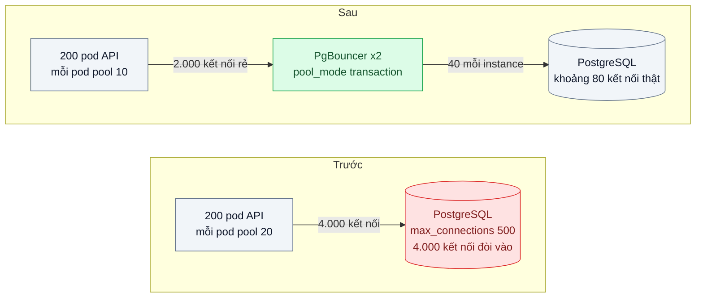
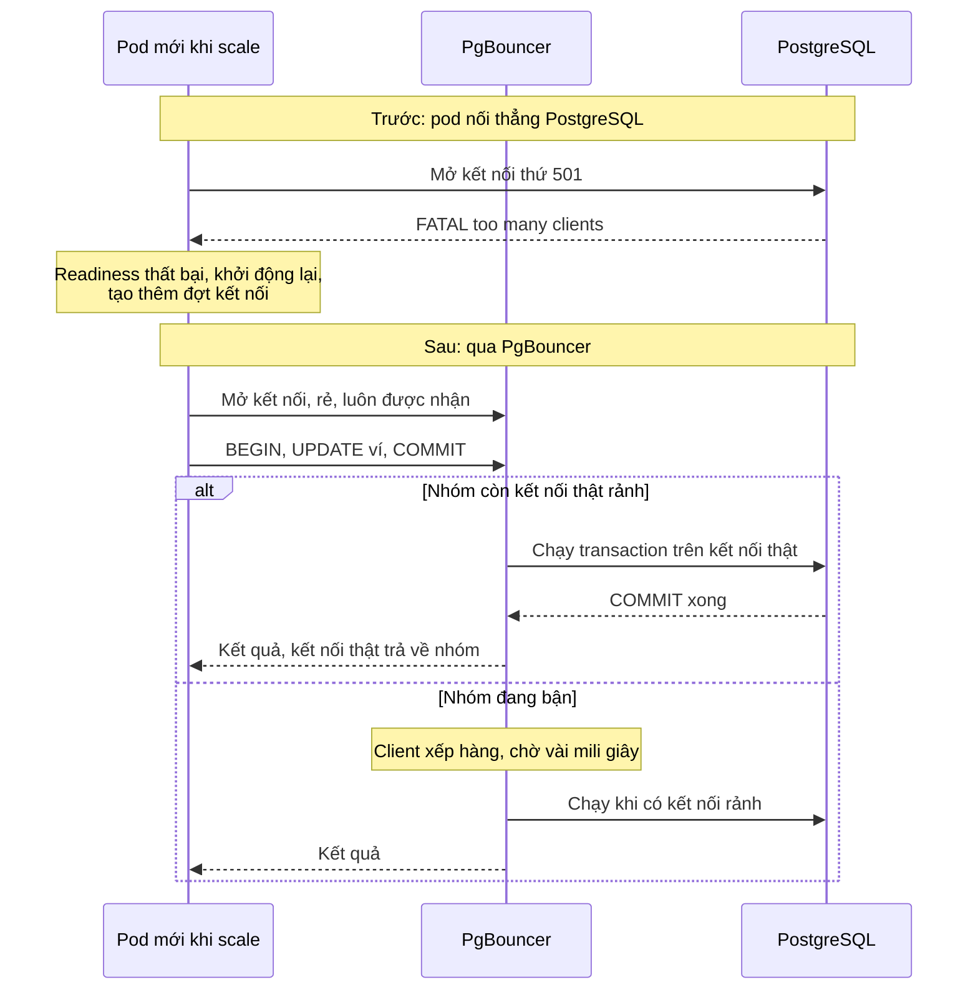

# Connection Pooling — 200 pod × 20 kết nối làm PostgreSQL cạn max_connections

| Scope | Mức độ | Trạng thái | Pattern gốc | Cập nhật |
|---|---|---|---|---|
| 02 · backend / database | 🟡 Trung bình | 📋 Kế hoạch | Connection Pool (external pooler) — PgBouncer docs; PostgreSQL wiki "Number Of Database Connections" | 2026-10-06 |

> **Một câu tóm tắt:** Đặt một bộ gom kết nối (PgBouncer, chế độ transaction) giữa hàng trăm pod và PostgreSQL để hàng nghìn kết nối phía ứng dụng chỉ dùng chung vài chục kết nối thật tới database, thay vì mỗi pod giữ riêng 20 kết nối và làm database từ chối khi scale.

## 1. Bài toán thực tế (What)

**Bối cảnh** *(doanh nghiệp giả định, số liệu minh họa)*
Ví điện tử chạy API NestJS trên Kubernetes, bình thường 30 pod, HPA tự tăng tới 200 pod trong các đợt khuyến mãi. Mỗi pod tạo một `pg.Pool` với `max: 20`. PostgreSQL 16 chạy trên máy 16 vCPU, `max_connections = 500`.

**Triệu chứng người kinh doanh nhìn thấy**
- Đúng lúc chiến dịch hoàn tiền bắt đầu và lưu lượng tăng gấp 6, khoảng 15 % giao dịch lỗi "hệ thống bận" trong 20 phút: thời điểm đắt nhất lại hỏng.
- Thêm pod để chịu tải lại làm lỗi nhiều hơn, đội vận hành phải tắt autoscale và giới hạn người dùng.
- Đội database đề xuất mua máy lớn hơn chỉ để tăng `max_connections`.

**Nguyên nhân kỹ thuật**
200 pod × 20 kết nối = 4.000 kết nối tiềm năng, gấp 8 lần `max_connections`. Pod mới khởi động không mở được kết nối và nhận lỗi "too many clients", readiness thất bại, pod khởi động lại, tạo thêm đợt kết nối mới. Trong khi đó phần lớn kết nối đang mở lại *rảnh*: mỗi request chỉ giữ kết nối vài mili giây. PostgreSQL dùng một tiến trình cho mỗi kết nối; tăng `max_connections` lên hàng nghìn làm tốn bộ nhớ và giảm thông lượng vì tranh chấp, nên không phải lối thoát.

**Ràng buộc**
- Không bỏ autoscale; số pod sẽ còn tăng.
- Không đổi kiến trúc dữ liệu (không tách DB) trong bài này.
- Thêm thành phần mới phải có độ sẵn sàng cao, không thành điểm hỏng duy nhất.

## 2. Vì sao dùng pattern này (Why)

**Nguyên nhân gốc mà pattern nhắm vào:** số kết nối tới database tỷ lệ với số pod, trong khi số kết nối database *xử lý hiệu quả* chỉ tỷ lệ với số lõi CPU và đĩa.

**Pattern giải quyết thế nào:** Connection pool bên trong mỗi pod chỉ gom kết nối *trong* một tiến trình. Bộ gom bên ngoài như PgBouncer gom *giữa* mọi tiến trình: ứng dụng mở hàng nghìn kết nối rẻ tới PgBouncer, PgBouncer giữ một nhóm nhỏ kết nối thật tới PostgreSQL. Ở chế độ `transaction`, một kết nối thật chỉ được gán cho client trong thời gian một transaction rồi trả về nhóm, nên 40 kết nối thật phục vụ được hàng nghìn client khi mỗi transaction ngắn. Khi nhóm bận, client xếp hàng ở PgBouncer vài mili giây thay vì bị database từ chối. PostgreSQL wiki gợi ý điểm xuất phát cho số kết nối hoạt động tối ưu ở mức khoảng hai lần số lõi cộng số đĩa hiệu dụng, thấp hơn rất nhiều so với con số hàng nghìn.

**Lựa chọn khác đã cân nhắc**

| Lựa chọn | Giải quyết được gì | Vì sao không chọn (ở bài này) |
|---|---|---|
| Giữ nguyên + tối ưu nhỏ (giảm `max` mỗi pod xuống 2) | Tổng kết nối giảm | 200 × 2 = 400 vẫn sát trần; pod nào có đợt tải sẽ nghẽn ngay trong tiến trình |
| Tăng `max_connections` lên 5.000, mua máy lớn | Hết lỗi từ chối | Một tiến trình mỗi kết nối: tốn RAM, tranh chấp tăng, thông lượng giảm |
| PgBouncer dạng sidecar trong mỗi pod | Không thêm điểm hỏng tập trung | Mỗi sidecar có nhóm riêng, tổng kết nối thật vẫn tỷ lệ với số pod |
| Read replica để chia tải (bài 05) | Giảm tải đọc ở primary | Không giải quyết số kết nối; mỗi replica cũng có trần riêng |
| PgBouncer tập trung, chế độ transaction (chọn) | Kết nối thật cố định, không phụ thuộc số pod | Mất một số tính năng gắn với phiên; thêm một bước mạng |

## 3. Thiết kế hệ thống (How)

### 3.1 Kiến trúc trước và sau



### 3.2 Luồng chính



### 3.3 Thành phần và trách nhiệm

| Thành phần | Trách nhiệm | Quyết định thiết kế đáng chú ý |
|---|---|---|
| Pool trong ứng dụng | Giữ vài kết nối tới PgBouncer, tái sử dụng trong tiến trình | `max` nhỏ, timeout lấy kết nối rõ ràng để lỗi nhanh khi nghẽn |
| PgBouncer | Gom kết nối giữa mọi pod, xếp hàng khi bận | `pool_mode = transaction`; `default_pool_size` tính theo lõi CPU của DB, chia cho số instance |
| Hai instance PgBouncer | Tránh điểm hỏng duy nhất | Tổng kết nối thật = số instance × pool size, phải nằm dưới `max_connections` |
| PostgreSQL | Xử lý truy vấn với số kết nối ổn định | Giữ dư một phần `max_connections` cho quản trị và migration |
| Giám sát | Theo dõi client chờ, thời gian chờ lớn nhất, kết nối thật đang dùng | Cảnh báo khi client chờ tăng liên tục: dấu hiệu cần tối ưu truy vấn, không phải tăng pool |

### 3.4 Điểm dễ sai khi triển khai
- **Dùng tính năng gắn với phiên ở chế độ transaction.** `SET` không có `LOCAL`, advisory lock theo phiên, `LISTEN`, bảng tạm sống qua nhiều transaction sẽ "rò" sang client khác hoặc mất. Dùng `SET LOCAL` trong transaction; chạy `LISTEN` qua kết nối thẳng riêng.
- **Prepared statement có tên.** Tùy phiên bản PgBouncer, prepared statement ở mức giao thức trong chế độ transaction cần cấu hình riêng (cần xác minh theo phiên bản dùng); kiểm tra driver có dùng statement có tên không.
- **Transaction dài giữ kết nối thật.** Một request mở transaction rồi gọi API ngoài 5 giây sẽ chiếm kết nối suốt 5 giây; pooler không cứu được thiết kế này.
- **Migration và job quản trị đi qua PgBouncer** có thể vướng giới hạn chế độ transaction; cho chúng kết nối thẳng với quyền riêng.
- **Tính sai tổng.** Quên nhân với số instance PgBouncer, hoặc quên kết nối từ worker, cron, công cụ BI.

## 4. Tech stack và tác động (Impact techstack)

| Lớp | Công nghệ chọn | Vì sao chọn | Thay thế tương đương |
|---|---|---|---|
| Database | PostgreSQL 16 | Mô hình một tiến trình mỗi kết nối là lý do cần pooler | — |
| Pooler | PgBouncer, `pool_mode = transaction` | Nhẹ, ổn định, cấu hình đơn giản, có console quản trị `SHOW POOLS`, `SHOW STATS` | pgcat, Odyssey, Supavisor, proxy của nhà cung cấp cloud (cần xác minh tính năng từng loại) |
| Driver | `pg` (node-postgres) với `Pool` | Cấu hình `max`, `connectionTimeoutMillis`, `idleTimeoutMillis` | `postgres` (porsager) |
| API | NestJS 10, TypeScript strict | Stack mặc định | Fastify |
| Mô phỏng nhiều pod | Docker Compose chạy N bản sao API (`--scale`) | Tái hiện 200 tiến trình trên một máy với `max` nhỏ hơn theo tỷ lệ | kind với HPA (scope 16) |
| Đo | k6, `pg_stat_activity`, console PgBouncer | Đếm kết nối thật, client chờ, lỗi | Prometheus exporter cho PgBouncer (cần xác minh) |

**Thay đổi so với hệ thống hiện tại:** thêm hai instance PgBouncer, đổi chuỗi kết nối của ứng dụng, giảm `max` mỗi pod, rà soát mọi chỗ dùng `SET`, advisory lock, `LISTEN`. Đội vận hành học đọc `SHOW POOLS` và tính ngân sách kết nối cho cả hệ thống.

## 5. Kết quả đầu ra và cách đo (Output impact)

| Chỉ số | Trước (minh họa) | Mục tiêu khi thực hành | Cách đo |
|---|---|---|---|
| Kết nối thật tới PostgreSQL khi chạy mô phỏng tối đa | chạm trần `max_connections` | ≤ 100, ổn định khi tăng số bản sao | `SELECT count(*) FROM pg_stat_activity` mỗi 5 giây |
| Lỗi "too many clients" khi tăng từ 30 lên 200 bản sao | khoảng 15 % request | 0 | k6 đếm lỗi; log PostgreSQL |
| p95 transaction ví dưới tải | 1.200 ms | ≤ 150 ms | k6 kịch bản chuyển tiền, 10 phút |
| Thời gian chờ lớn nhất ở pooler | không có | ≤ 50 ms ở tải mục tiêu | Cột `maxwait` trong `SHOW POOLS` |
| RAM dùng bởi tiến trình backend PostgreSQL | tăng theo số kết nối | gần như không đổi khi scale | `docker stats` cho container PostgreSQL |

> Số "trước" là minh họa để hình dung bài toán. Số "mục tiêu" chỉ được coi là đạt khi có số đo thật
> ở mục 8 kèm môi trường đo.

**Tác động nghiệp vụ mong đợi:** autoscale hoạt động đúng lúc cần nhất, chiến dịch không còn lỗi hàng loạt vì database từ chối kết nối, và hoãn được chi phí mua máy lớn.

## 6. Đánh đổi và khi KHÔNG nên dùng

**Đánh đổi**
- Thêm một thành phần và một bước mạng trên đường đi của mọi truy vấn.
- Chế độ transaction cấm hoặc làm sai lệch các tính năng gắn với phiên; đội phải biết và tuân thủ.
- Lỗi do pooler (cấu hình, hết `max_client_conn`) là loại sự cố mới cần giám sát.

**Không nên dùng khi**
- Số tiến trình ứng dụng nhỏ và cố định: pool trong ứng dụng là đủ.
- Ứng dụng phụ thuộc mạnh vào trạng thái phiên (nhiều `LISTEN`, advisory lock theo phiên): dùng chế độ `session` hoặc kết nối thẳng cho phần đó.
- Vấn đề thật là truy vấn chậm giữ kết nối lâu: sửa truy vấn trước (bài 01), pooler chỉ làm hàng đợi dài hơn.

**Liên quan**
- Đọc trước: `../01-n-plus-1-trang-50-don-ban-151-cau-sql/` — truy vấn ngắn là điều kiện để transaction pooling hiệu quả.
- Đọc sau: `../09-partitioning-bang-su-kien-500-trieu-dong/` — khi một database không còn đủ.
- Nguyên nhân: `../../16-backend-k8s/03-requests-limits-hpa-9h-sang-traffic-gap-5/` — HPA làm số pod tăng đột biến.
- Cùng chủ đề: `../../18-backend-scale/02-scale-up-truoc-hay-scale-out-db-cpu-90/` — quyết định scale database.

## 7. Cơ sở tham khảo

- PgBouncer docs — https://www.pgbouncer.org/ — chế độ session, transaction, statement; tham số `default_pool_size`, `max_client_conn`; console `SHOW POOLS`; danh sách tính năng không dùng được ở chế độ transaction.
- PostgreSQL wiki, "Number Of Database Connections" — https://wiki.postgresql.org/wiki/Number_Of_Database_Connections — vì sao nhiều kết nối làm giảm thông lượng, công thức điểm xuất phát theo số lõi và đĩa.
- PostgreSQL docs, "Connections and Authentication" (`max_connections`) và "The Cumulative Statistics System" (`pg_stat_activity`) — https://www.postgresql.org/docs/ — trần kết nối và cách đếm kết nối đang mở.
- node-postgres docs, "Pooling" — https://node-postgres.com/ — tham số pool phía ứng dụng (cần xác minh tên trang).

## 8. Kế hoạch thực hành

- [ ] Bước 1: Docker Compose PostgreSQL 16 với `max_connections` nhỏ (ví dụ 100) để tỷ lệ hóa; API NestJS chuyển tiền ví; chạy `--scale api=40` với `max` theo tỷ lệ.
- [ ] Bước 2: đo "trước": tăng dần số bản sao, ghi số kết nối, tỷ lệ lỗi, p95 bằng k6.
- [ ] Bước 3: thêm hai instance PgBouncer chế độ transaction, đổi chuỗi kết nối, giảm `max`, sửa mọi `SET` thành `SET LOCAL`.
- [ ] Bước 4: đo "sau" cùng kịch bản; ghi số thật, cấu hình máy và tham số vào mục 5.
- [ ] Bước 5: viết test: (a) tăng số bản sao không làm kết nối thật vượt ngưỡng tính trước; (b) `SET LOCAL` không rò giá trị sang transaction của client khác; (c) khi pooler chặn, request lỗi nhanh theo timeout thay vì treo.

**Cấu trúc code dự kiến**
```text
src/
  wallet/transfer.service.ts
  db/pool.ts                        # pool nhỏ, timeout rõ ràng
infra/
  pgbouncer/pgbouncer.ini           # [PATTERN] pool_mode transaction
  pgbouncer/userlist.txt.example
test/
  connection-budget.test.ts
  set-local-does-not-leak.test.ts
bench/transfer-under-scale.k6.js
docker-compose.yml                  # postgres, pgbouncer x2, api có thể scale
```

**Cách chạy** *(điền khi bắt đầu code)*
```bash
docker compose up -d --scale api=40
pnpm install && pnpm test
```
