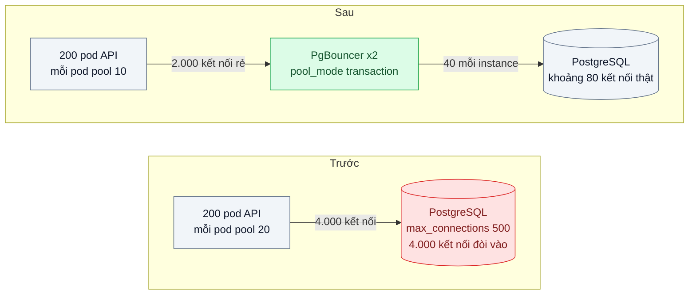
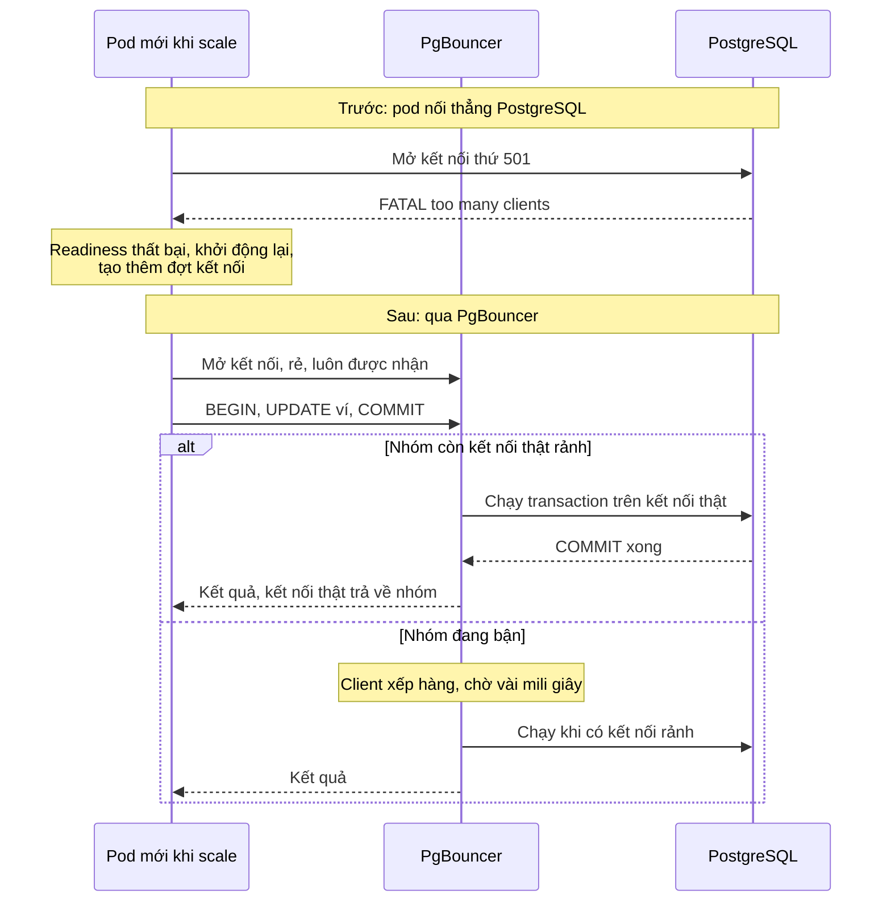

# Connection Pooling — 200 pod × 20 kết nối làm PostgreSQL cạn max_connections

| Scope | Mức độ | Trạng thái | Pattern gốc | Cập nhật |
|---|---|---|---|---|
| 02 · backend / database | 🟡 Trung bình | ✅ Hoàn thành | Connection Pool (external pooler) — PgBouncer docs; PostgreSQL wiki "Number Of Database Connections" | 2026-10-07 |

> **Một câu tóm tắt:** Đặt một bộ gom kết nối (PgBouncer, chế độ transaction) giữa hàng trăm pod và PostgreSQL để hàng nghìn kết nối phía ứng dụng chỉ dùng chung vài chục kết nối thật tới database, thay vì mỗi pod giữ riêng 20 kết nối và làm database từ chối khi scale.

## 1. Bài toán thực tế (What)

**Bối cảnh** *(doanh nghiệp giả định, số liệu minh họa)*
Ví điện tử chạy API NestJS trên Kubernetes, bình thường 30 pod, HPA tự tăng tới 200 pod trong các đợt khuyến mãi. Mỗi pod tạo một `pg.Pool` với `max: 20`. PostgreSQL 16 chạy trên máy 16 vCPU, `max_connections = 500`.

**Triệu chứng người kinh doanh nhìn thấy**
- Đúng lúc chiến dịch hoàn tiền bắt đầu và lưu lượng tăng gấp 6, khoảng 15 % giao dịch lỗi "hệ thống bận" trong 20 phút: thời điểm đắt nhất lại hỏng.
- Thêm pod để chịu tải lại làm lỗi nhiều hơn, đội vận hành phải tắt autoscale và giới hạn người dùng.
- Đội database đề xuất mua máy lớn hơn chỉ để tăng `max_connections`.

**Nguyên nhân kỹ thuật**
200 pod × 20 kết nối = 4.000 kết nối tiềm năng, gấp 8 lần `max_connections`. Pod mới khởi động không mở được kết nối và nhận lỗi "too many clients", readiness thất bại, pod khởi động lại, tạo thêm đợt kết nối mới. Trong khi đó phần lớn kết nối đang mở lại *rảnh*: mỗi request chỉ giữ kết nối vài mili giây. PostgreSQL dùng một tiến trình cho mỗi kết nối; tăng `max_connections` lên hàng nghìn làm tốn bộ nhớ và giảm thông lượng vì tranh chấp, nên không phải lối thoát.

**Ràng buộc**
- Không bỏ autoscale; số pod sẽ còn tăng.
- Không đổi kiến trúc dữ liệu (không tách DB) trong bài này.
- Thêm thành phần mới phải có độ sẵn sàng cao, không thành điểm hỏng duy nhất.

## 2. Vì sao dùng pattern này (Why)

**Nguyên nhân gốc mà pattern nhắm vào:** số kết nối tới database tỷ lệ với số pod, trong khi số kết nối database *xử lý hiệu quả* chỉ tỷ lệ với số lõi CPU và đĩa.

**Pattern giải quyết thế nào:** Connection pool bên trong mỗi pod chỉ gom kết nối *trong* một tiến trình. Bộ gom bên ngoài như PgBouncer gom *giữa* mọi tiến trình: ứng dụng mở hàng nghìn kết nối rẻ tới PgBouncer, PgBouncer giữ một nhóm nhỏ kết nối thật tới PostgreSQL. Ở chế độ `transaction`, một kết nối thật chỉ được gán cho client trong thời gian một transaction rồi trả về nhóm, nên 40 kết nối thật phục vụ được hàng nghìn client khi mỗi transaction ngắn. Khi nhóm bận, client xếp hàng ở PgBouncer vài mili giây thay vì bị database từ chối. PostgreSQL wiki gợi ý điểm xuất phát cho số kết nối hoạt động tối ưu ở mức khoảng hai lần số lõi cộng số đĩa hiệu dụng, thấp hơn rất nhiều so với con số hàng nghìn.

**Lựa chọn khác đã cân nhắc**

| Lựa chọn | Giải quyết được gì | Vì sao không chọn (ở bài này) |
|---|---|---|
| Giữ nguyên + tối ưu nhỏ (giảm `max` mỗi pod xuống 2) | Tổng kết nối giảm | 200 × 2 = 400 vẫn sát trần; pod nào có đợt tải sẽ nghẽn ngay trong tiến trình |
| Tăng `max_connections` lên 5.000, mua máy lớn | Hết lỗi từ chối | Một tiến trình mỗi kết nối: tốn RAM, tranh chấp tăng, thông lượng giảm |
| PgBouncer dạng sidecar trong mỗi pod | Không thêm điểm hỏng tập trung | Mỗi sidecar có nhóm riêng, tổng kết nối thật vẫn tỷ lệ với số pod |
| Read replica để chia tải (bài 05) | Giảm tải đọc ở primary | Không giải quyết số kết nối; mỗi replica cũng có trần riêng |
| PgBouncer tập trung, chế độ transaction (chọn) | Kết nối thật cố định, không phụ thuộc số pod | Mất một số tính năng gắn với phiên; thêm một bước mạng |

## 3. Thiết kế hệ thống (How)

### 3.1 Kiến trúc trước và sau



### 3.2 Luồng chính



### 3.3 Thành phần và trách nhiệm

| Thành phần | Trách nhiệm | Quyết định thiết kế đáng chú ý |
|---|---|---|
| Pool trong ứng dụng | Giữ vài kết nối tới PgBouncer, tái sử dụng trong tiến trình | `max` nhỏ, timeout lấy kết nối rõ ràng để lỗi nhanh khi nghẽn |
| PgBouncer | Gom kết nối giữa mọi pod, xếp hàng khi bận | `pool_mode = transaction`; `default_pool_size` tính theo lõi CPU của DB, chia cho số instance |
| Hai instance PgBouncer | Tránh điểm hỏng duy nhất | Tổng kết nối thật = số instance × pool size, phải nằm dưới `max_connections` |
| PostgreSQL | Xử lý truy vấn với số kết nối ổn định | Giữ dư một phần `max_connections` cho quản trị và migration |
| Giám sát | Theo dõi client chờ, thời gian chờ lớn nhất, kết nối thật đang dùng | Cảnh báo khi client chờ tăng liên tục: dấu hiệu cần tối ưu truy vấn, không phải tăng pool |

### 3.4 Điểm dễ sai khi triển khai
- **Dùng tính năng gắn với phiên ở chế độ transaction.** `SET` không có `LOCAL`, advisory lock theo phiên, `LISTEN`, bảng tạm sống qua nhiều transaction sẽ "rò" sang client khác hoặc mất. Lab đo được: client A chạy `SET app.user_id = 'nv-A'`, client B (chưa đặt gì) đọc ra `nv-A` và dòng sổ chuyển tiền B ghi có `created_by = 'nv-A'`. Dùng `SET LOCAL` trong transaction; vì `SET` không nhận tham số `$1`, đặt giá trị từ request bằng `set_config('app.user_id', $1, true)`. Chạy `LISTEN` qua kết nối thẳng riêng.
- **Prepared statement có tên.** Đã kiểm với PgBouncer 1.26.0: `max_prepared_statements` mặc định 200, PgBouncer tự quản statement có tên ở mức giao thức nên hai client dùng cùng tên trên một kết nối thật vẫn chạy đúng; đặt về 0 (hành vi trước 1.21) thì client thứ hai nhận `42P05 prepared statement ... already exists`. node-postgres chỉ dùng statement có tên khi truyền `name`.
- **Transaction dài giữ kết nối thật.** Một request mở transaction rồi gọi API ngoài 5 giây sẽ chiếm kết nối suốt 5 giây; pooler không cứu được thiết kế này.
- **Timeout của pool phía app không bao khoảng chờ ở PgBouncer.** Kết nối pod → PgBouncer xong ngay (dưới 1 giây trong test) dù PgBouncer không còn kết nối thật; truy vấn rồi nằm trong hàng đợi của PgBouncer, `connectionTimeoutMillis` không có tác dụng. Thứ cắt khoảng chờ là `query_wait_timeout` của PgBouncer (mặc định 120 giây; lab đặt 5 giây và đo được lỗi `query_wait_timeout` sau khoảng 5 giây).
- **Migration và job quản trị đi qua PgBouncer** có thể vướng giới hạn chế độ transaction; cho chúng kết nối thẳng với quyền riêng.
- **Tính sai tổng.** Quên nhân với số instance PgBouncer, hoặc quên kết nối từ worker, cron, công cụ BI. Kết nối của superuser cũng vậy: `superuser_reserved_connections = 3` chỉ giữ 3 chỗ *cuối*, PostgreSQL so ngưỡng với tổng kết nối đang mở, nên mỗi kết nối superuser đang mở (giám sát, quản trị) bớt một chỗ của ứng dụng. Lab đo: một client đo bằng superuser là role ứng dụng chỉ còn 96 chỗ, không phải 97. Chỗ dành cho superuser cũng không chắc còn khi có cơn bão kết nối: trong một lượt "trước" 40 pod, `psql` bằng superuser mở mới vẫn nhận `sorry, too many clients already`; bộ đo của lab vào được vì đã mở kết nối từ trước khi chạy tải.
- **Đếm lỗi "too many clients" chỉ bằng một chuỗi.** PostgreSQL có hai thông báo cùng SQLSTATE `53300`: `sorry, too many clients already` và `remaining connection slots are reserved for roles with the SUPERUSER attribute`; khi kết nối ập vào cùng lúc, backend đang bị từ chối cũng tạm giữ một chỗ nên DB từ chối cả khi chưa đầy (lab thấy 95–97 kết nối được nhận trên 97 chỗ). Cảnh báo nên dựa vào SQLSTATE.
- **`application_name` riêng cho từng pod.** Đây là tham số PgBouncer theo dõi: mỗi khi một kết nối thật chuyển sang client có tên khác, PgBouncer gửi thêm `SET application_name=...` lên PostgreSQL. Lab đếm trong log: 100 câu `SET` cho 100 lần đổi giữa hai client khác tên, 0 câu khi cùng tên; ở 40 pod số transaction PostgreSQL commit khoảng gấp đôi số chuyển khoản. Chưa đo riêng ảnh hưởng tới độ trễ; muốn biết request đến từ pod nào thì cân nhắc ghi vào log ứng dụng thay vì `application_name`.
- **Kết nối rảnh vẫn chiếm chỗ.** Pool của node-postgres giữ kết nối rảnh 10 giây (`idleTimeoutMillis` mặc định): ngay sau một đợt tải, DB "đầy" bởi kết nối không làm gì, và pod mới khởi động lúc đó không qua được bước kiểm tra DB (test `direct-pools-exhaust-max-connections`).

## 4. Tech stack và tác động (Impact techstack)

| Lớp | Công nghệ chọn | Vì sao chọn | Thay thế tương đương |
|---|---|---|---|
| Database | PostgreSQL 16 | Mô hình một tiến trình mỗi kết nối là lý do cần pooler | — |
| Pooler | PgBouncer, `pool_mode = transaction` | Nhẹ, ổn định, cấu hình đơn giản, có console quản trị `SHOW POOLS`, `SHOW STATS` | pgcat, Odyssey, Supavisor, proxy của nhà cung cấp cloud (cần xác minh tính năng từng loại) |
| Driver | `pg` (node-postgres) với `Pool` | Cấu hình `max`, `connectionTimeoutMillis`, `idleTimeoutMillis` | `postgres` (porsager) |
| API | NestJS 10, TypeScript strict | Stack mặc định | Fastify |
| Mô phỏng nhiều pod | Docker Compose chạy N bản sao API (`--scale`) | Tái hiện 200 tiến trình trên một máy với `max` nhỏ hơn theo tỷ lệ | kind với HPA (scope 16) |
| Đo | k6, `pg_stat_activity`, console PgBouncer | Đếm kết nối thật, client chờ, lỗi | Prometheus exporter cho PgBouncer (cần xác minh) |

**Khi thực hành (lệch so với bảng trên):**
- Fastify thay NestJS vì mỗi pod chỉ có `POST /transfers`, `/healthz`, `/readyz` (như các bài trước của scope); driver `pg` 8.23 dùng thẳng, không qua ORM, để thấy rõ cấu hình pool.
- Mô phỏng nhiều pod đúng kế hoạch bằng `docker compose --scale api=N`: mỗi bản sao là một container `node:20-alpine` chạy `dist/pod.mjs` (esbuild gói sẵn fastify và pg), một tiến trình, một pool. Pod kiểm tra DB lúc khởi động, lỗi thì thoát mã 1 và Docker khởi động lại (`restart: on-failure`, độ trễ tăng dần), gần với vòng readiness thất bại ở mục 1. Lúc đầu thử chạy pod là tiến trình Node trên host thì mỗi vòng gọi DB phải qua proxy cổng của Docker Desktop: `com.docker.backend` ăn khoảng 124 % CPU, 22–29/30 kết nối PostgreSQL nằm ở `ClientRead`, 6 pod qua PgBouncer chỉ đạt 1.421 transaction/giây so với 4.210 khi pod nằm trong mạng Compose. Số đo khi đó phản ánh proxy chứ không phải pattern, nên bỏ.
- k6 chạy trong container `grafana/k6:1.4.2` cùng mạng, gọi `http://api:3100`; DNS của Docker trả IP mọi bản sao, k6 chia kết nối theo vòng tròn (như Service của Kubernetes).
- Quy mô thu nhỏ khoảng 1/5 so với mục 1: `max_connections` 100 (thay 500), 6 → 20 → 40 pod (thay 30 → 200), pool mỗi pod giữ 20 ("trước") và 10 ("sau"); PgBouncer 2 × 10 = 20 kết nối thật (sơ đồ 3.1 ghi 2 × 40 cho máy 16 vCPU), gần điểm xuất phát 2 × 8 lõi + 1 = 17 của PostgreSQL wiki. Tải: 3 người dùng ảo mỗi pod gửi liên tục, nên tải tăng theo số pod như khi HPA scale theo lưu lượng.
- Hai instance PgBouncer: instance thứ hai mở cổng 56433 (bảng cổng của quy trình lab chỉ có 56432). Pod chọn instance theo id container, không có load balancer đứng trước hai instance. Thêm database `wallet_one` (`pool_size = 1`) chỉ cho test. Giám sát bằng `SHOW POOLS` / `SHOW STATS` lấy mẫu mỗi giây, chưa làm Prometheus exporter.

**Thay đổi so với hệ thống hiện tại:** thêm hai instance PgBouncer, đổi chuỗi kết nối của ứng dụng, giảm `max` mỗi pod, rà soát mọi chỗ dùng `SET`, advisory lock, `LISTEN`. Đội vận hành học đọc `SHOW POOLS` và tính ngân sách kết nối cho cả hệ thống.

## 5. Kết quả đầu ra và cách đo (Output impact)

| Chỉ số | Trước (minh họa) | Mục tiêu khi thực hành | Cách đo |
|---|---|---|---|
| Kết nối thật tới PostgreSQL khi chạy mô phỏng tối đa | chạm trần `max_connections` | ≤ 100, ổn định khi tăng số bản sao | `SELECT count(*) FROM pg_stat_activity` mỗi 5 giây |
| Lỗi "too many clients" khi tăng từ 30 lên 200 bản sao | khoảng 15 % request | 0 | k6 đếm lỗi; log PostgreSQL |
| p95 transaction ví dưới tải | 1.200 ms | ≤ 150 ms | k6 kịch bản chuyển tiền, 10 phút |
| Thời gian chờ lớn nhất ở pooler | không có | ≤ 50 ms ở tải mục tiêu | Cột `maxwait` trong `SHOW POOLS` |
| RAM dùng bởi tiến trình backend PostgreSQL | tăng theo số kết nối | gần như không đổi khi scale | `docker stats` cho container PostgreSQL |

> Số "trước" là minh họa để hình dung bài toán. Số "mục tiêu" chỉ được coi là đạt khi có số đo thật;
> số đã đo nằm ở mục 5.1 bên dưới, kèm môi trường đo.

### 5.1 Số đã đo

**Môi trường:** MacBook Apple M1 Pro (8 lõi, 16 GB, macOS 26.6.2); Docker 28.5.1, máy ảo 8 vCPU, khoảng 7,6 GB RAM; PostgreSQL 16.15 (`postgres:16`, `max_connections` 100, `superuser_reserved_connections` 3, `shared_buffers` 128 MB, `synchronous_commit` on); PgBouncer 1.26.0 (`edoburu/pgbouncer:latest`), 2 instance, transaction mode, `default_pool_size` 10, `query_wait_timeout` 5 s; pod `node:20-alpine` (Node v20.20.2), `pg` 8.23.1; k6 v1.4.2 trong container. Seed 100.000 ví; mỗi chuyển khoản là một transaction 6 vòng gọi DB. Pod, PgBouncer, PostgreSQL và k6 cùng chạy trong một máy ảo, trong khi máy còn chạy ứng dụng khác của người dùng và vài container của dự án khác. Ở 40 pod tải đóng, CPU máy ảo bận 65–89 % (load 21–53), nên thông lượng và độ trễ dao động mạnh giữa các lượt; số kết nối và số lỗi thì ổn định. File thô: `bench/results/main/` (`*.run.json` có mẫu theo thời gian, `*.k6.json`, `*.api.log`, `rounds-*.log`).

**Cách đo:** kết nối thật = số dòng `pg_stat_activity` của role `wallet_app` mỗi 5 s (client superuser mở từ trước khi chạy tải); RAM = tổng PSS của mọi tiến trình `postgres` (`/proc/<pid>/smaps_rollup`) cạnh `docker stats`; hàng đợi PgBouncer = `SHOW POOLS` mỗi 1 s, thời gian chờ trung bình = Δ`total_wait_time` / Δ`total_xact_count` của `SHOW STATS`. Tải đóng: 3 người dùng ảo mỗi pod gửi liên tục, 10 s warm-up rồi 60 s đo; tải mở: k6 `constant-arrival-rate`. Độ trễ chỉ tính request thành công.

**Quét số pod, tải đóng** (một lượt mỗi ô, chạy lần lượt từ trên xuống):

| Pod / VU | Chế độ | Kết nối thật (max) | Lỗi `53300` | Thành công/giây | p50 / p95 (ms) | PSS PostgreSQL |
|---|---|---|---|---|---|---|
| 6 / 18 | trước | 18 | 0 % | 2.990 | 4,2 / 13,4 | 85 MB |
| 6 / 18 | sau | 18 | 0 % | 3.090 | 4,5 / 11,0 | 86 MB |
| 20 / 60 | trước | 60 | 0 % | 1.904 | 18,9 / 82,2 | 153 MB |
| 20 / 60 | sau | 20 | 0 % | 2.146 | 20,6 / 60,3 | 97 MB |
| 40 / 120 | trước | 96 (trần) | 21,84 % | 932 | 65,7 / 300,7 | 258 MB |
| 40 / 120 | sau | 20 | 0 % | 879 | 96,4 / 350,5 | 136 MB |

**40 pod, 120 VU, 3 vòng xoay thứ tự** (trung vị, trong ngoặc thấp nhất – cao nhất; "sau" thử 3 kích thước pool đổi lúc chạy bằng `SET default_pool_size`):

| Cấu hình | Kết nối thật | Lỗi `53300` | Thành công/giây | p50 / p95 / p99 (ms) | PSS | Chờ PgBouncer TB / maxwait (ms) | CPU VM |
|---|---|---|---|---|---|---|---|
| trước, pool 20/pod | 96 | 24,6 % (22,4–25,1) | 484 (233–497) | 111 / 637 (567–1.450) / 1.851 | 314 MB (283–315) | — | 88 % |
| sau, 2 × 5 = 10 | 10 | 0 | 665 (462–962) | 107 / 558 (299–909) / 1.234 | 179 MB | 169 (124–232) / 4.092 | 67 % |
| sau, 2 × 10 = 20 (cấu hình bài) | 20 | 0 | 1.614 (678–1.686) | 58 / 158 (141–479) / 345 | 194 MB (186–195) | 65 (60–149) / 1.309 (717–1.602) | 75 % |
| sau, 2 × 20 = 40 | 40 | 0 | 1.122 (574–1.227) | 78 / 263 (246–575) / 738 | 226 MB | 66 (59–120) / 1.422 | 80 % |

Trong từng vòng, thông lượng thành công của "sau 20" gấp 3,5 / 2,9 / 3,3 lần "trước". Log PostgreSQL ghi 9.501 / 5.451 / 11.007 lần từ chối (gồm cả 10 s warm-up; k6 đếm 8.414 / 4.691 / 9.731 request 503 trong 60 s đo).

**6 pod, tải mở 1.000 request/giây** (CPU máy ảo bận 20–31 %, 3 vòng xoay thứ tự, 30 s đo):

| Cấu hình | Kết nối thật (max) | Lỗi `53300` | p50 / p95 / p99 (ms) | PSS | maxwait max (ms) |
|---|---|---|---|---|---|
| trước | 96 / 96 / 96 | 7 / 12 / 0 request | 1,19 (1,16–1,51) / 7,1 (4,7–19,7) / 54,9 | 310 MB (279–316) | — |
| sau 10 | 10 | 0 | 1,75 (1,59–2,02) / 24,5 (8,6–28,4) / 99,5 | 179 MB | 34,9 (11,0–102,9) |
| sau 20 | 20 | 0 | 1,74 (1,71–2,43) / 13,4 (7,6–63,7) / 49,2 | 195 MB | 19,6 (0,3–103,1) |
| sau 40 | 20–40 | 0 | 1,68 (1,61–1,99) / 16,8 (7,0–42,3) / 83,6 | 224 MB | 12,6 (0–17,5) |

p50 của "sau 20" cao hơn "trước" trong từng vòng: +0,92 / +0,59 / +0,51 ms. k6 bỏ 41–1.207 lượt mỗi lượt đo vì cả 100 người dùng ảo đều đang chờ: hệ thống có những lúc khựng ở cả hai chế độ.

**Tăng tải rồi tăng pod như HPA** (một lượt mỗi chế độ; mỗi 60 s tải tăng 18 → 60 → 120 VU, 15 s sau pod tăng 6 → 20 → 40; k6 đóng kết nối mỗi 20 lượt để tải lan sang pod mới):

| Giai đoạn | trước: lỗi / thành công/giây / p95 | sau: lỗi / thành công/giây / p95 | Kết nối thật trước / sau | PSS trước / sau |
|---|---|---|---|---|
| 6 pod, 18 VU | 0 % / 4.881 / 6,5 ms | 0 % / 3.066 / 10,6 ms | 6–29 / 2–14 | 170–212 / 166–186 MB |
| 60 VU, pod 6 → 20 | 1,57 % (2.857 `53300`, 321 `network`) / 3.315 / 47,9 ms | 0,01 % (7 `network`) / 2.088 / 72,5 ms | 26–96 / 14–20 | 205–317 / 186–196 MB |
| 120 VU, pod 20 → 40 | 20,76 % (14.329 `53300`, 506 `network`) / 944 / 317,5 ms | 0,01 % (9 `network`) / 1.517 / 253,6 ms | 93–96 / 20 | 312–322 / 195–196 MB |

Pod "trước": 89 lần kiểm tra DB lúc khởi động thất bại (`53300`), 100 lần khởi động lại, đến hết lượt chỉ 20/40 pod từng sẵn sàng; "sau": 40/40 sẵn sàng, 0 lần khởi động lại. Lỗi `network` là kết nối tới pod vừa tạo chưa nghe cổng (Docker không có readiness gating như Service của Kubernetes).

**10 phút, 40 pod, tải mở 600 request/giây** (một lượt mỗi chế độ, "sau" chạy trước; CPU máy ảo bận trung vị 23 % và 20 %, load của host 29,8 và 12,1):

| Chế độ | Request | Lỗi `53300` | p50 / p95 / p99 (ms) | Kết nối thật min / med / max | Tiến trình postgres | PSS | Chờ PgBouncer |
|---|---|---|---|---|---|---|---|
| trước | 359.527 | 749 (0,21 %); log PG 1.023 lần từ chối | 1,50 / 7,1 / 55,8 | 47 / 67 / 96, chạm trần trong mọi đoạn 2 phút | 54–103 | 239–317 MB | — |
| sau | 357.504 | 0 | 1,85 / 19,8 / 166,6 | 20 / 20 / 20 trong 121 mẫu | 27–28 | 196–201 MB | TB 3,9 ms; maxwait > 50 ms ở 3,1 % số mẫu, lớn nhất 506 ms |

**Chạy lại từ volume sạch theo "Cách chạy"** (`bench/results/recheck/`): 40 pod tải đóng, "trước" 21,8 % lỗi `53300`, 96 kết nối thật, 1.597 thành công/giây; "sau" 0 lỗi, 20 kết nối thật, 1.924 thành công/giây; lượt tăng bước "trước" 95 lần kiểm tra khởi động thất bại, 19,86 % lỗi ở bước 120 VU.

**So với mục tiêu:**
- Kết nối thật ổn định khi tăng bản sao (mục tiêu ≤ 100 ở quy mô 500, tức ngân sách 20 ở lab): **đạt**. "Sau" giữ đúng 20 ở 20 pod, 40 pod, lượt tăng bước và suốt 10 phút; "trước" lên theo số pod và đỉnh đồng thời tới trần 96, kể cả ở 600 request/giây.
- Lỗi "too many clients" khi tăng 6 → 40 bản sao (mục tiêu 0): **đạt**, 0 ở mọi lượt "sau". "Trước": 21,8–25,1 % request ở tải đóng 40 pod, 20,8 % ở bước cuối lượt tăng bước, 0,21 % ở 600 request/giây trong 10 phút, và 89 lần kiểm tra khởi động của pod mới thất bại.
- p95 dưới tải trong 10 phút (mục tiêu ≤ 150 ms): **đạt** ở 600 request/giây (19,8 ms). Ở tải đóng 120 VU (máy bão hòa), p95 của "sau 20" là 141–479 ms: 2/3 vòng quanh 150 ms, không ổn định.
- Thời gian chờ lớn nhất ở pooler (mục tiêu ≤ 50 ms): **không đạt**. Ở 600 request/giây, 96,9 % mẫu `SHOW POOLS` dưới 50 ms nhưng lớn nhất 506 ms; ở 1.000 request/giây, 6 pod, trung vị 19,6 ms nhưng một vòng tới 103 ms. Mẫu lấy mỗi giây nên con số lớn nhất thật có thể còn cao hơn.
- RAM backend PostgreSQL gần như không đổi khi scale: **đạt** trong lượt tăng bước (cùng một lượt nên không lẫn trôi theo thời gian): "sau" 166 → 196 MB, "trước" 170 → 322 MB, khoảng 1,7 MB mỗi kết nối thêm. PSS của cả hai chế độ còn tăng dần qua các lượt vì dữ liệu và bộ đệm lớn dần, nên chỉ so trong cùng vòng.

**Hạn chế:** quy mô 1/5; mọi thành phần chung một máy ảo 8 vCPU, máy host còn chạy ứng dụng khác, nên thông lượng và độ trễ dao động lớn giữa các lượt; quét số pod, lượt tăng bước và lượt 10 phút chỉ một lượt mỗi chế độ; pod chọn instance PgBouncer theo id container nên có lượt lệch 0/6 hay 15/25 (một nguồn nhiễu cho phép so kích thước pool); Docker khởi động lại với độ trễ tăng dần nhưng không chặn traffic tới pod chưa sẵn sàng như Kubernetes; k6 bỏ một số lượt ở tải mở khi hệ thống khựng.

**Tác động nghiệp vụ mong đợi:** autoscale hoạt động đúng lúc cần nhất, chiến dịch không còn lỗi hàng loạt vì database từ chối kết nối, và hoãn được chi phí mua máy lớn.

## 6. Đánh đổi và khi KHÔNG nên dùng

**Đánh đổi**
- Thêm một thành phần và một bước mạng trên đường đi của mọi truy vấn.
- Chế độ transaction cấm hoặc làm sai lệch các tính năng gắn với phiên; đội phải biết và tuân thủ.
- Lỗi do pooler (cấu hình, hết `max_client_conn`) là loại sự cố mới cần giám sát.

**Không nên dùng khi**
- Số tiến trình ứng dụng nhỏ và cố định: pool trong ứng dụng là đủ.
- Ứng dụng phụ thuộc mạnh vào trạng thái phiên (nhiều `LISTEN`, advisory lock theo phiên): dùng chế độ `session` hoặc kết nối thẳng cho phần đó.
- Vấn đề thật là truy vấn chậm giữ kết nối lâu: sửa truy vấn trước (bài 01), pooler chỉ làm hàng đợi dài hơn.

**Liên quan**
- Đọc trước: `../01-n-plus-1-trang-50-don-ban-151-cau-sql/` — truy vấn ngắn là điều kiện để transaction pooling hiệu quả.
- Đọc sau: `../09-partitioning-bang-su-kien-500-trieu-dong/` — khi một database không còn đủ.
- Nguyên nhân: `../../16-backend-k8s/03-requests-limits-hpa-9h-sang-traffic-gap-5/` — HPA làm số pod tăng đột biến.
- Cùng chủ đề: `../../18-backend-scale/02-scale-up-truoc-hay-scale-out-db-cpu-90/` — quyết định scale database.

## 7. Cơ sở tham khảo

- PgBouncer docs, "Configuration" — https://www.pgbouncer.org/config.html — chế độ session, transaction, statement; `default_pool_size` (mặc định 20), `max_client_conn` (100), `query_wait_timeout` (120 giây, quá thì client bị ngắt), `max_prepared_statements` (200); `server_reset_query` không dùng ở chế độ transaction vì client không được dùng tính năng gắn với phiên.
- PgBouncer docs, "Usage" — https://www.pgbouncer.org/usage.html — console quản trị: `SHOW POOLS` (`cl_waiting`, `sv_active`, `maxwait`), `SHOW STATS` (`total_wait_time`), `KILL`, `RESUME`, `SET`.
- PostgreSQL wiki, "Number Of Database Connections" — https://wiki.postgresql.org/wiki/Number_Of_Database_Connections — vì sao nhiều kết nối làm giảm thông lượng, công thức điểm xuất phát theo số lõi và đĩa.
- PostgreSQL docs 16, "Connections and Authentication" — https://www.postgresql.org/docs/16/runtime-config-connection.html — `max_connections`; `superuser_reserved_connections`: khi số kết nối đang mở đạt `max_connections` trừ số chỗ giữ, chỉ superuser được vào; và "The Cumulative Statistics System" (`pg_stat_activity`) — https://www.postgresql.org/docs/16/monitoring-stats.html.
- node-postgres docs, "Pooling" — https://node-postgres.com/features/pooling — và API `pg.Pool` — https://node-postgres.com/apis/pool — `max` (mặc định 10), `connectionTimeoutMillis` (0: không timeout), `idleTimeoutMillis` (10.000 ms).

## 8. Kế hoạch thực hành

- [x] Bước 1: Docker Compose PostgreSQL 16 với `max_connections = 100`; API chuyển tiền ví (Fastify, xem mục 4); `--scale api=40` với pool 20 mỗi pod như mục 1.
- [x] Bước 2: đo "trước": 6, 20, 40 bản sao (3 người dùng ảo mỗi pod), và một lượt tăng tải rồi tăng pod như HPA; ghi số kết nối, tỉ lệ lỗi, p95 bằng k6.
- [x] Bước 3: hai instance PgBouncer chế độ transaction, đổi chuỗi kết nối, giảm `max` xuống 10; biến phiên đặt bằng `set_config(..., true)` (tương đương `SET LOCAL`).
- [x] Bước 4: đo "sau" cùng kịch bản; thêm 3 vòng ở 40 pod với 10/20/40 kết nối thật, 3 vòng tải mở 1.000 request/giây ở 6 pod, và lượt 10 phút ở 600 request/giây; số thật ở mục 5.1.
- [x] Bước 5: test: (a) 10 và 40 pod qua PgBouncer không làm kết nối thật vượt 2 × `default_pool_size`; (b) `SET` rò sang client khác, `SET LOCAL` và `transfer()` không rò; (c) pool phía app lỗi sau 2 giây, pool mặc định thì treo, PgBouncer cắt bằng `query_wait_timeout`. Thêm: phía "trước" bị từ chối `53300`, kết nối rảnh vẫn giữ chỗ, pod mới không khởi động được; prepared statement có tên; nghiệp vụ chuyển tiền.

**Cấu trúc code**
```text
src/
  truoc/db-pool.ts                 # pool 20 nối thẳng PostgreSQL, cấu hình mặc định của node-postgres
  sau/db-pool.ts                   # [PATTERN] pool 10 qua PgBouncer A/B, connectionTimeoutMillis 2 s
  shared/transfer.ts               # chuyển tiền trong một transaction, set_config(..., true), khóa ví theo thứ tự id
  shared/db-errors.ts              # phân loại lỗi kết nối (53300, pool timeout, query_wait_timeout...) để trả 503
  shared/config.ts                 # chuỗi kết nối phía host (55432, 56432, 56433)
  app.ts                           # Fastify: POST /transfers, /healthz, /readyz
  pod.ts                           # một pod: kiểm tra DB lúc khởi động, lỗi thì thoát mã 1
infra/
  pgbouncer/pgbouncer.ini          # [PATTERN] pool_mode transaction, default_pool_size 10, query_wait_timeout 5
  pgbouncer/userlist.txt           # mật khẩu chỉ dùng trong lab
  build-pod.mjs                    # gói pod.ts + fastify + pg thành dist/pod.mjs cho container
db/
  init.sql                         # role wallet_app (không phải superuser), wallets, transfers
  seed-wallets.sql                 # 100.000 ví, chạy lại được
  connection-stats.sql             # kết nối theo user và trạng thái
test/
  direct-pools-exhaust-max-connections.test.ts   # trước: 53300, kết nối rảnh giữ chỗ, pod mới không khởi động được, 503
  pgbouncer-fixed-real-connections.test.ts       # (a) 10 và 40 pod: 0 lỗi, kết nối thật ≤ 20; đối chứng nối thẳng
  set-local-does-not-leak.test.ts                # (b) SET rò, SET LOCAL và transfer() không rò; đối chứng nối thẳng
  fail-fast-timeouts.test.ts                     # (c) timeout pool phía app, pool mặc định treo, query_wait_timeout
  named-prepared-statements.test.ts              # max_prepared_statements 200 và 0
  transfer.test.ts                               # số dư, không đủ tiền, 300 chuyển khoản đồng thời, HTTP
bench/
  transfer.k6.js                   # tải chuyển tiền: VUS, DURATION_S, WARMUP_S, STAGES, CONN_CLOSE_EVERY, NAME
  run-step.ts                      # một lượt đo: dựng N pod, lấy mẫu pg_stat_activity / SHOW POOLS / PSS, chạy k6
  summarize.ts                     # bảng Markdown từ các file *.run.json
docker-compose.yml                 # postgres:16, pgbouncer-a, pgbouncer-b, api (profile pods), k6 (profile bench)
```

**Cách chạy**
```bash
cd 02-backend-database/03-connection-pool-200-pod-dap-postgres
pnpm install
pnpm db:up                 # Postgres 16 (max_connections 100) ở 55432, PgBouncer ở 56432 và 56433
pnpm db:seed               # 100.000 ví (đổi bằng WALLETS=...)
pnpm typecheck
pnpm test                  # 18 test; tự tạo ví riêng, không cần seed
pnpm build                 # dist/pod.mjs cho container pod
MODE=truoc PODS=40 NAME=truoc-40 pnpm bench:step   # 40 pod nối thẳng, 120 VU, 10 s warm-up + 60 s
MODE=sau PODS=40 NAME=sau-40 pnpm bench:step       # 40 pod qua PgBouncer, cùng tải
MODE=truoc SCALE_STEPS=6,20,40 STEP_SECONDS=60 NAME=truoc-scale pnpm bench:step   # tải tăng trước, pod tăng sau 15 s
MODE=sau PODS=40 VUS=120 RATE=600 DURATION_S=600 NAME=sau-40-r600 pnpm bench:step   # tải mở 600 request/giây, 10 phút
pnpm bench:summary         # bảng từ bench/results (số ở mục 5.1: RESULTS_DIR=bench/results/main)
pnpm db:connections        # kết nối thật theo user/trạng thái; pnpm db:pools: SHOW POOLS của instance A
pnpm db:reset              # docker compose down -v (gỡ cả pod nếu còn)
```

## Bài học sau khi làm

- **Số kết nối đi theo số pod và đỉnh đồng thời, không theo tải trung bình.** Ở 600 request/giây, 40 pod, p50 chỉ 1,5 ms, pool nối thẳng vẫn chạm trần 96 trong mọi đoạn 2 phút và làm hỏng 749 chuyển khoản; 6 pod ở 1.000 request/giây cũng chạm 96. Mỗi đợt dồn request làm pool của vài pod phình ra, rồi kết nối rảnh được giữ 10 giây. Qua PgBouncer, số kết nối thật là 20 trong mọi lượt.
- **Vòng "pod mới không khởi động được" làm autoscale vô dụng.** Khi tải tăng trước, pod tăng sau 15 giây, "trước" có 89 lần (lặp lại: 95) pod mới bị từ chối lúc khởi động; đến hết lượt chỉ 20/40 pod từng sẵn sàng, tức scale lên 40 không thêm được năng lực. "Sau": 40/40, 0 lần khởi động lại.
- **Pooler đổi lỗi thành chờ, không tạo thêm năng lực.** Khi máy bão hòa (40 pod, 120 VU), "sau" vẫn có p95 141–479 ms, chờ trung bình ở PgBouncer 60–150 ms, maxwait lớn nhất mỗi vòng 0,7–1,6 giây. Dù vậy, thông lượng thành công gấp 2,9–3,5 lần "trước" trong từng vòng; lab không tách riêng được phần nào do bớt tiến trình backend tranh CPU và phần nào do bớt các kết nối bị từ chối.
- **Cái giá đo được của một bước mạng thêm.** Ở tải nhẹ, p50 cao hơn 0,5–0,9 ms trong từng vòng. Trong lượt 10 phút, đuôi độ trễ của "sau" dài hơn (p95 19,8 so với 7,1 ms, p99 167 so với 56 ms), nhưng mỗi chế độ chỉ một lượt và máy bận hơn trong lượt "sau", nên chưa tách riêng được phần do PgBouncer xếp hàng.
- **Kích thước pool 10 / 20 / 40: không phân biệt được trong lab này.** Dao động giữa các vòng lớn hơn khoảng cách giữa các cấu hình, và việc pod chia không đều cho hai instance còn trộn thêm nhiễu. Thứ phân biệt được là RAM: PSS 179 / 194 / 226 MB.
- **Ngân sách kết nối phải tính cả kết nối "không phải ứng dụng".** Một kết nối giám sát bằng superuser bớt một chỗ của ứng dụng (96, không phải 97), và trong cơn bão kết nối, superuser mở kết nối mới cũng bị từ chối. Công cụ giám sát nên giữ sẵn kết nối thay vì mở mới lúc sự cố.
- **Phép thử âm:** đặt `pool_mode = session` thì 9/18 test đỏ: hai test "kết nối thật ≤ 20" và 300 chuyển khoản đồng thời hết `query_wait_timeout`; 6 test SET / prepared statement không chạy được trên `wallet_one` vì client đầu giữ trọn kết nối thật. Đổi `set_config(..., true)` thành `false` trong `transfer()` thì đúng test "transfer() không rò" đỏ (test SQL mẫu vẫn xanh: phải có test đi qua code nghiệp vụ). Bỏ `connectionTimeoutMillis` thì test pool "sau" treo tới hết 15 giây. Khôi phục thì 18/18 xanh.
- **Lỗi gặp khi làm:** test ban đầu giả định 97 chỗ và một thông báo lỗi duy nhất; bộ lấy PSS ra 0 vì `root` trong container không đọc được `smaps` của tiến trình khác (phải `docker exec -u postgres`); pod chạy qua tsx tốn ~90 MB và một tiến trình esbuild mỗi pod nên phải gói sẵn bằng esbuild; pod trên host bị proxy cổng Docker Desktop làm nghẽn nên chuyển vào mạng Compose; giữ kết nối keep-alive thì pod mới thêm không nhận request nào, phải cho k6 đóng kết nối định kỳ; đếm `xact_commit` không thấy được câu `SET` lẻ, phải bật tạm `log_statement`.
- **Hạn chế của số đo:** xem cuối mục 5.1. Ngắn gọn: một máy ảo 8 vCPU chung cho mọi thành phần và bão hòa ở 40 pod tải đóng; nhiều kịch bản chỉ một lượt; quy mô 1/5; Docker không chặn traffic tới pod chưa sẵn sàng như Kubernetes.
