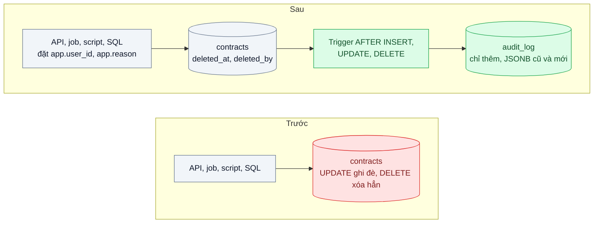
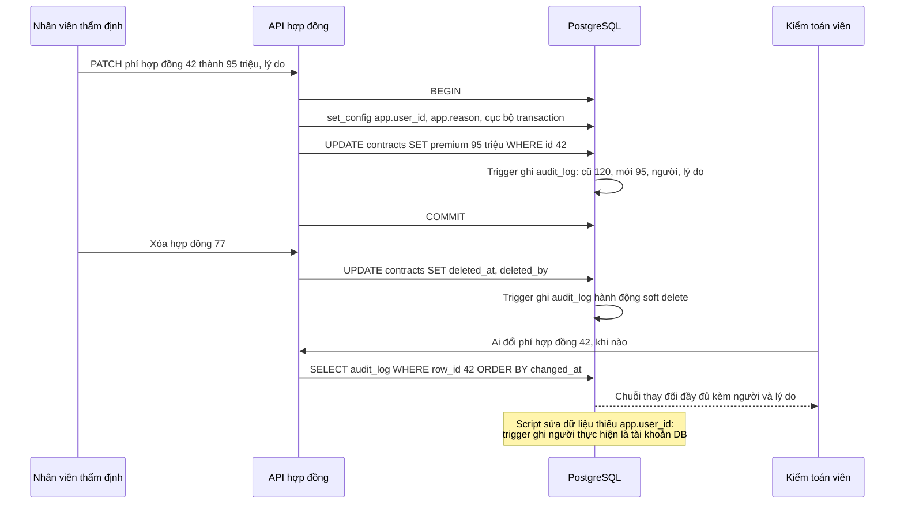

# Audit Log & Soft Delete — Kiểm toán hỏi "ai đổi giá hợp đồng lúc nào", DB chỉ còn giá mới

| Scope | Mức độ | Trạng thái | Pattern gốc | Cập nhật |
|---|---|---|---|---|
| 02 · backend / database | 🟡 Trung bình | 📋 Kế hoạch | Audit Log — Fowler, eaaDev; Soft Delete; Temporal Patterns — Fowler | 2026-10-06 |

> **Một câu tóm tắt:** Mỗi lần hợp đồng bị thêm, sửa hay xóa, database tự ghi một dòng bất biến "ai, lúc nào, giá trị cũ, giá trị mới, vì sao" vào bảng nhật ký, còn thao tác xóa chỉ đánh dấu chứ không xóa thật, để trả lời được kiểm toán và khôi phục được khi xóa nhầm.

## 1. Bài toán thực tế (What)

**Bối cảnh** *(doanh nghiệp giả định, số liệu minh họa)*
Công ty bảo hiểm phi nhân thọ quản lý khoảng 40.000 hợp đồng bảo hiểm doanh nghiệp trên một hệ thống nội bộ NestJS + PostgreSQL. Khoảng 300 nhân viên kinh doanh, thẩm định và vận hành được sửa phí, quyền lợi, thời hạn hợp đồng. Bảng `contracts` chỉ có `updated_at` và `updated_by` của lần sửa cuối.

**Triệu chứng người kinh doanh nhìn thấy**
- Đoàn kiểm toán hỏi vì sao phí của một hợp đồng lớn giảm từ 120 triệu xuống 95 triệu và ai duyệt; đội IT mất ba ngày lục log ứng dụng mà không trả lời chắc chắn được.
- Một nhân viên xóa nhầm hợp đồng đang có hồ sơ bồi thường; phải khôi phục từ bản sao lưu đêm trước, mất nửa ngày và mất các thay đổi trong buổi sáng.
- Bộ phận tuân thủ cảnh báo rủi ro không đáp ứng yêu cầu lưu vết của cơ quan quản lý.

**Nguyên nhân kỹ thuật**
Mô hình dữ liệu chỉ lưu trạng thái hiện tại: `UPDATE` ghi đè giá trị cũ, `DELETE` xóa vĩnh viễn. Log ứng dụng không đầy đủ (chỉ ghi "đã cập nhật hợp đồng 42"), không có giá trị cũ, và không bắt được thay đổi qua script sửa dữ liệu hay công cụ SQL. `updated_by` chỉ cho biết người cuối cùng, không cho biết chuỗi thay đổi.

**Ràng buộc**
- Mọi đường thay đổi phải được ghi: API, job nền, script sửa dữ liệu, thao tác SQL trực tiếp của DBA.
- Nhật ký không được sửa hay xóa bởi tài khoản của ứng dụng.
- Hồ sơ bồi thường tham chiếu tới hợp đồng; xóa hợp đồng không được làm mồ côi hồ sơ.
- Overhead ghi chấp nhận được (vài mili giây mỗi lần sửa).

## 2. Vì sao dùng pattern này (Why)

**Nguyên nhân gốc mà pattern nhắm vào:** hệ thống chỉ biết "bây giờ là gì", không biết "đã từng là gì, ai đổi và khi nào".

**Pattern giải quyết thế nào:** Fowler gọi Audit Log là cách đơn giản và hiệu quả nhất để theo dõi thông tin theo thời gian: mỗi khi có điều đáng kể xảy ra, ghi một bản ghi nói điều gì đã xảy ra và khi nào. Ở bài này, một trigger `AFTER INSERT OR UPDATE OR DELETE` trên `contracts` ghi vào `audit_log` một dòng chứa bản cũ và bản mới dạng JSONB, người thực hiện, thời điểm, lý do và request id. Đặt ở trigger thay vì ở code ứng dụng để bắt *mọi* đường ghi. Người thực hiện được ứng dụng truyền vào bằng biến cấu hình cục bộ của transaction (`set_config(..., true)`). Soft Delete thay `DELETE` bằng đánh dấu `deleted_at`, `deleted_by`, giữ nguyên tham chiếu và cho phép khôi phục. Fowler cũng mô tả nhóm Temporal Patterns cho nhu cầu cao hơn ("giá trị tại ngày X"); bài này dừng ở mức nhật ký.

**Lựa chọn khác đã cân nhắc**

| Lựa chọn | Giải quyết được gì | Vì sao không chọn (ở bài này) |
|---|---|---|
| Giữ nguyên + tối ưu nhỏ (log ứng dụng chi tiết hơn) | Có thêm vết cho thay đổi qua API | Không bắt script và SQL trực tiếp; log có thể bị xoay vòng, không truy vấn được như dữ liệu |
| Ghi nhật ký trong repository của ứng dụng | Có ngữ cảnh nghiệp vụ đầy đủ | Đường ghi nào không qua repository là lọt |
| pgAudit | Ghi câu lệnh SQL nào được chạy | Ghi *câu lệnh*, không ghi giá trị cũ và mới của từng dòng theo dạng truy vấn được dễ dàng |
| CDC đẩy thay đổi sang kho riêng (Debezium) | Không thêm tải ghi đồng bộ, lưu ngoài DB chính | Thêm hạ tầng lớn; khó gắn người thực hiện và lý do vào sự kiện |
| Event Sourcing (bài 06, hướng mở) | Lịch sử là nguồn sự thật | Đổi toàn bộ mô hình dữ liệu; quá tay cho yêu cầu lưu vết |
| Trigger ghi `audit_log` JSONB + soft delete (chọn) | Bắt mọi đường ghi, truy vấn được, khôi phục được | Thêm tải ghi, bảng nhật ký tăng nhanh, cần kỷ luật truyền người thực hiện |

## 3. Thiết kế hệ thống (How)

### 3.1 Kiến trúc trước và sau



### 3.2 Luồng chính



### 3.3 Thành phần và trách nhiệm

| Thành phần | Trách nhiệm | Quyết định thiết kế đáng chú ý |
|---|---|---|
| Bảng `audit_log` | Lưu bảng, id dòng, hành động, JSONB cũ và mới, người, lý do, request id, thời điểm | Chỉ thêm; tài khoản ứng dụng không có quyền `UPDATE` hay `DELETE` trên bảng này |
| Trigger nhật ký | Ghi một dòng cho mỗi thay đổi trên bảng được theo dõi | Hàm dùng chung cho nhiều bảng; chỉ lưu trường thay đổi nếu muốn tiết kiệm |
| Ngữ cảnh người thực hiện | Ứng dụng đặt `app.user_id`, `app.reason` trong mỗi transaction ghi | Cục bộ transaction, an toàn với pooler chế độ transaction (bài 03); thiếu thì ghi tài khoản DB |
| Soft delete | `deleted_at`, `deleted_by` thay cho `DELETE` | Unique index thành partial index `WHERE deleted_at IS NULL`; view mặc định lọc bản đã xóa |
| API tra cứu nhật ký | Trả lịch sử theo hợp đồng, theo người, theo khoảng thời gian | Index `(table_name, row_id, changed_at)` |

### 3.4 Điểm dễ sai khi triển khai
- **Quên đặt người thực hiện** trong một đường ghi: nhật ký có thay đổi nhưng không biết ai. Bắt buộc ở tầng truy cập dữ liệu, test kiểm tra mọi endpoint ghi có `app.user_id`.
- **Dùng `SET` thay vì cấu hình cục bộ transaction** khi đi qua pooler: giá trị rò sang request của người khác, nhật ký ghi sai người.
- **Unique constraint với soft delete.** Mã hợp đồng đã xóa mềm vẫn chiếm chỗ, không tạo lại được; dùng partial unique index.
- **Quên lọc bản đã xóa** ở một truy vấn: hợp đồng đã xóa vẫn hiện trong báo cáo. Truy cập qua view hoặc hàm repository mặc định lọc.
- **Bảng nhật ký phình không kiểm soát.** Lên kế hoạch phân vùng theo tháng và chính sách lưu giữ ngay từ đầu (bài 09).

## 4. Tech stack và tác động (Impact techstack)

| Lớp | Công nghệ chọn | Vì sao chọn | Thay thế tương đương |
|---|---|---|---|
| Database | PostgreSQL 16: trigger PL/pgSQL, JSONB, `to_jsonb(OLD)`, `set_config`, partial index | Bắt mọi đường ghi ngay tại DB, lưu dòng dạng JSONB truy vấn được | MySQL 8 trigger với JSON |
| Phân quyền | Role riêng cho ứng dụng, `REVOKE UPDATE, DELETE` trên `audit_log` | Ứng dụng không xóa được dấu vết của chính nó | Ghi nhật ký sang DB khác chỉ cho phép thêm |
| Truy cập dữ liệu | Kysely, helper `withActor(userId, reason, fn)` bọc transaction | Không thể ghi mà quên đặt người thực hiện | SQL thuần với `pg` |
| API | NestJS 10, TypeScript strict | Stack mặc định | Fastify |
| Test, đo | Vitest, k6 | Kiểm tra từng đường ghi; đo overhead trigger | pgbench |

**Thay đổi so với hệ thống hiện tại:** thêm bảng nhật ký, trigger, role phân quyền, cột soft delete, partial index và view; mọi đường ghi phải đi qua helper đặt người thực hiện; DBA đặt `app.reason` khi sửa dữ liệu trực tiếp.

## 5. Kết quả đầu ra và cách đo (Output impact)

| Chỉ số | Trước (minh họa) | Mục tiêu khi thực hành | Cách đo |
|---|---|---|---|
| Thay đổi được ghi nhật ký qua 4 đường (API, job, script, psql) | 0 % | 100 % | Test thực hiện thay đổi qua từng đường, đếm dòng `audit_log` |
| Thời gian trả lời "ai đổi phí hợp đồng X" | 3 ngày | dưới 1 phút | Truy vấn `audit_log` theo `row_id`, đo bằng `EXPLAIN ANALYZE` |
| Overhead p95 của `UPDATE contracts` | 0 | ≤ 3 ms | k6 so sánh bật và tắt trigger trên cùng seed |
| Thời gian khôi phục hợp đồng xóa nhầm | nửa ngày từ sao lưu | dưới 1 phút, không mất thay đổi khác | Test xóa mềm rồi khôi phục |
| Tài khoản ứng dụng sửa được nhật ký | có | không | Test `UPDATE audit_log` bằng role ứng dụng phải bị từ chối |

> Số "trước" là minh họa để hình dung bài toán. Số "mục tiêu" chỉ được coi là đạt khi có số đo thật
> ở mục 8 kèm môi trường đo.

**Tác động nghiệp vụ mong đợi:** trả lời kiểm toán bằng một truy vấn thay vì ba ngày điều tra, khôi phục xóa nhầm trong vài giây, và đáp ứng yêu cầu lưu vết của bộ phận tuân thủ.

## 6. Đánh đổi và khi KHÔNG nên dùng

**Đánh đổi**
- Mỗi lần ghi thêm một lần ghi nhật ký; bảng nhật ký có thể lớn hơn bảng gốc nhiều lần.
- Trigger là logic "ẩn" với người chỉ đọc code ứng dụng; cần tài liệu và test.
- Soft delete làm mọi truy vấn phải nhớ lọc; dữ liệu cá nhân đã "xóa" vẫn còn, có thể xung đột với yêu cầu xóa dữ liệu.

**Không nên dùng khi**
- Bảng ghi tần suất rất cao, giá trị thấp (bộ đếm lượt xem, sự kiện theo dõi): nhật ký từng dòng là lãng phí.
- Cần truy vấn trạng thái tại thời điểm bất kỳ và tái dựng lịch sử nghiệp vụ: cân nhắc Temporal Patterns hoặc Event Sourcing.
- Dữ liệu cá nhân phải xóa thật theo yêu cầu pháp lý: soft delete không đủ, cần xóa hoặc ẩn danh hóa có kiểm soát.

**Liên quan**
- Đọc trước: `../02-optimistic-lock-hai-nhan-vien-cung-sua-mot-don/` — ngăn ghi đè; nhật ký cho biết ai đã ghi gì.
- Đọc sau: `../06-cqrs-man-hinh-tong-hop-join-9-bang/` — hướng mở sang Event Sourcing.
- Đọc sau: `../09-partitioning-bang-su-kien-500-trieu-dong/` — phân vùng bảng nhật ký khi lớn.
- Cùng chủ đề: `../../15-backend-storage/07-backup-pitr-xoa-nham-bang-luc-14h-backup-dem-qua/` — khôi phục ở mức cả database.

## 7. Cơ sở tham khảo

- Martin Fowler, "Audit Log", eaaDev — https://martinfowler.com/eaaDev/AuditLog.html — định nghĩa, ưu điểm đơn giản, hạn chế khi cần truy vấn trạng thái quá khứ.
- Martin Fowler, "Temporal Patterns", eaaDev — https://martinfowler.com/eaaDev/timeNarrative.html (cần xác minh URL) — nhóm pattern cho dữ liệu theo thời gian, hướng mở rộng khi nhật ký không đủ.
- PostgreSQL docs, "Triggers" và "PL/pgSQL Trigger Functions" — https://www.postgresql.org/docs/current/plpgsql-trigger.html — biến `OLD`, `NEW`, `TG_OP` dùng trong hàm nhật ký.
- PostgreSQL docs, "JSON Types" và "System Administration Functions" (`set_config`, `current_setting`) — https://www.postgresql.org/docs/ — lưu dòng dạng JSONB và truyền ngữ cảnh người thực hiện cục bộ transaction.

## 8. Kế hoạch thực hành

- [ ] Bước 1: dựng bảng `contracts` và `claims` tham chiếu, API sửa và xóa cứng; seed 40.000 hợp đồng.
- [ ] Bước 2: đo "trước": thực hiện thay đổi qua 4 đường, thử trả lời "ai đổi phí" chỉ với dữ liệu hiện có; đo p95 `UPDATE`.
- [ ] Bước 3: thêm `audit_log`, trigger, role phân quyền, helper `withActor`, cột soft delete, partial unique index và view lọc.
- [ ] Bước 4: đo "sau" cùng kịch bản; ghi số thật và môi trường vào mục 5.
- [ ] Bước 5: viết test: (a) mỗi đường ghi sinh đúng một dòng nhật ký với giá trị cũ và mới; (b) role ứng dụng không sửa hay xóa được nhật ký; (c) hai request song song qua pooler ghi đúng người thực hiện của mình; (d) tạo lại mã hợp đồng sau khi xóa mềm thành công.

**Cấu trúc code dự kiến**
```text
db/
  migrations/001-audit-log.sql          # [PATTERN] bảng, hàm trigger, phân quyền
  migrations/002-soft-delete.sql        # cột, partial index, view
src/
  db/with-actor.ts                      # đặt app.user_id, app.reason trong transaction
  contracts/contract.repository.ts
  audit/audit-query.controller.ts
test/
  every-write-path-is-audited.test.ts
  audit-log-is-append-only.test.ts
  actor-context-no-leak.test.ts
bench/update-contract.k6.js
docker-compose.yml
```

**Cách chạy** *(điền khi bắt đầu code)*
```bash
docker compose up -d
pnpm install && pnpm test
```
