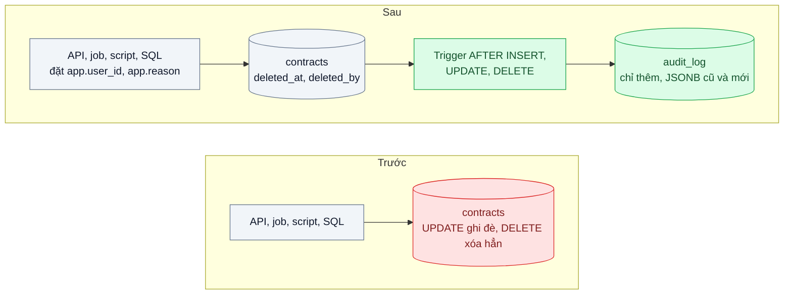
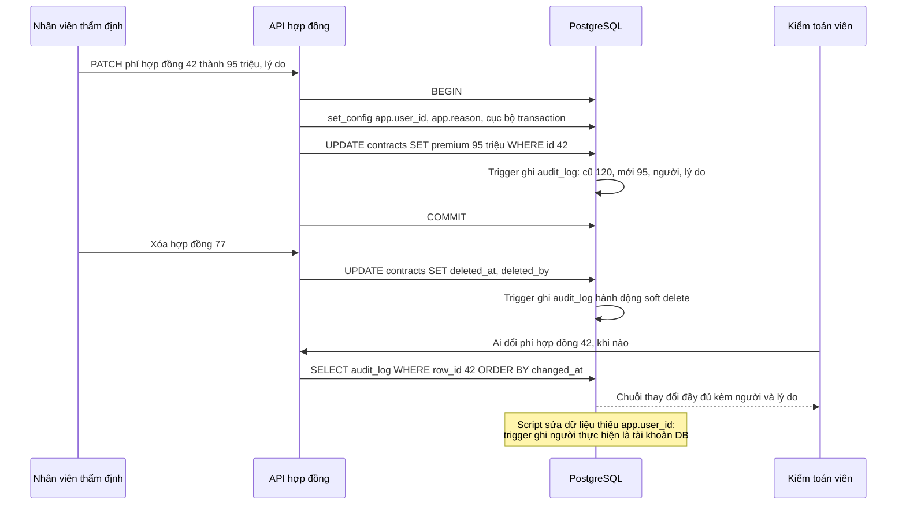

# Audit Log & Soft Delete — Kiểm toán hỏi "ai đổi giá hợp đồng lúc nào", DB chỉ còn giá mới

| Scope | Mức độ | Trạng thái | Pattern gốc | Cập nhật |
|---|---|---|---|---|
| 02 · backend / database | 🟡 Trung bình | ✅ Hoàn thành | Audit Log — Fowler, eaaDev; Soft Delete; Temporal Patterns — Fowler | 2026-10-07 |

> **Một câu tóm tắt:** Mỗi lần hợp đồng bị thêm, sửa hay xóa, database tự ghi một dòng bất biến "ai, lúc nào, giá trị cũ, giá trị mới, vì sao" vào bảng nhật ký, còn thao tác xóa chỉ đánh dấu chứ không xóa thật, để trả lời được kiểm toán và khôi phục được khi xóa nhầm.

## 1. Bài toán thực tế (What)

**Bối cảnh** *(doanh nghiệp giả định, số liệu minh họa)*
Công ty bảo hiểm phi nhân thọ quản lý khoảng 40.000 hợp đồng bảo hiểm doanh nghiệp trên một hệ thống nội bộ NestJS + PostgreSQL. Khoảng 300 nhân viên kinh doanh, thẩm định và vận hành được sửa phí, quyền lợi, thời hạn hợp đồng. Bảng `contracts` chỉ có `updated_at` và `updated_by` của lần sửa cuối.

**Triệu chứng người kinh doanh nhìn thấy**
- Đoàn kiểm toán hỏi vì sao phí của một hợp đồng lớn giảm từ 120 triệu xuống 95 triệu và ai duyệt; đội IT mất ba ngày lục log ứng dụng mà không trả lời chắc chắn được.
- Một nhân viên xóa nhầm hợp đồng đang có hồ sơ bồi thường; phải khôi phục từ bản sao lưu đêm trước, mất nửa ngày và mất các thay đổi trong buổi sáng.
- Bộ phận tuân thủ cảnh báo rủi ro không đáp ứng yêu cầu lưu vết của cơ quan quản lý.

**Nguyên nhân kỹ thuật**
Mô hình dữ liệu chỉ lưu trạng thái hiện tại: `UPDATE` ghi đè giá trị cũ, `DELETE` xóa vĩnh viễn. Log ứng dụng không đầy đủ (chỉ ghi "đã cập nhật hợp đồng 42"), không có giá trị cũ, và không bắt được thay đổi qua script sửa dữ liệu hay công cụ SQL. `updated_by` chỉ cho biết người cuối cùng, không cho biết chuỗi thay đổi.

**Ràng buộc**
- Mọi đường thay đổi phải được ghi: API, job nền, script sửa dữ liệu, thao tác SQL trực tiếp của DBA.
- Nhật ký không được sửa hay xóa bởi tài khoản của ứng dụng.
- Hồ sơ bồi thường tham chiếu tới hợp đồng; xóa hợp đồng không được làm mồ côi hồ sơ.
- Overhead ghi chấp nhận được (vài mili giây mỗi lần sửa).

## 2. Vì sao dùng pattern này (Why)

**Nguyên nhân gốc mà pattern nhắm vào:** hệ thống chỉ biết "bây giờ là gì", không biết "đã từng là gì, ai đổi và khi nào".

**Pattern giải quyết thế nào:** Fowler gọi Audit Log là cách đơn giản và hiệu quả nhất để theo dõi thông tin theo thời gian: mỗi khi có điều đáng kể xảy ra, ghi một bản ghi nói điều gì đã xảy ra và khi nào. Ở bài này, một trigger `AFTER INSERT OR UPDATE OR DELETE` trên `contracts` ghi vào `audit_log` một dòng chứa bản cũ và bản mới dạng JSONB, người thực hiện, thời điểm, lý do và request id. Đặt ở trigger thay vì ở code ứng dụng để bắt *mọi* đường ghi. Người thực hiện được ứng dụng truyền vào bằng biến cấu hình cục bộ của transaction (`set_config(..., true)`). Soft Delete thay `DELETE` bằng đánh dấu `deleted_at`, `deleted_by`, giữ nguyên tham chiếu và cho phép khôi phục. Fowler cũng mô tả nhóm Temporal Patterns cho nhu cầu cao hơn ("giá trị tại ngày X"); bài này dừng ở mức nhật ký.

**Lựa chọn khác đã cân nhắc**

| Lựa chọn | Giải quyết được gì | Vì sao không chọn (ở bài này) |
|---|---|---|
| Giữ nguyên + tối ưu nhỏ (log ứng dụng chi tiết hơn) | Có thêm vết cho thay đổi qua API | Không bắt script và SQL trực tiếp; log có thể bị xoay vòng, không truy vấn được như dữ liệu |
| Ghi nhật ký trong repository của ứng dụng | Có ngữ cảnh nghiệp vụ đầy đủ | Đường ghi nào không qua repository là lọt |
| pgAudit | Ghi câu lệnh SQL nào được chạy | Ghi *câu lệnh*, không ghi giá trị cũ và mới của từng dòng theo dạng truy vấn được dễ dàng |
| CDC đẩy thay đổi sang kho riêng (Debezium) | Không thêm tải ghi đồng bộ, lưu ngoài DB chính | Thêm hạ tầng lớn; khó gắn người thực hiện và lý do vào sự kiện |
| Event Sourcing (bài 06, hướng mở) | Lịch sử là nguồn sự thật | Đổi toàn bộ mô hình dữ liệu; quá tay cho yêu cầu lưu vết |
| Trigger ghi `audit_log` JSONB + soft delete (chọn) | Bắt mọi đường ghi, truy vấn được, khôi phục được | Thêm tải ghi, bảng nhật ký tăng nhanh, cần kỷ luật truyền người thực hiện |

## 3. Thiết kế hệ thống (How)

### 3.1 Kiến trúc trước và sau



### 3.2 Luồng chính



### 3.3 Thành phần và trách nhiệm

| Thành phần | Trách nhiệm | Quyết định thiết kế đáng chú ý |
|---|---|---|
| Bảng `audit_log` | Lưu bảng, id dòng, hành động, JSONB cũ và mới, người, lý do, request id, thời điểm | Chỉ thêm; tài khoản ứng dụng không có quyền `UPDATE` hay `DELETE` trên bảng này |
| Trigger nhật ký | Ghi một dòng cho mỗi thay đổi trên bảng được theo dõi | Hàm dùng chung cho nhiều bảng; chỉ lưu trường thay đổi nếu muốn tiết kiệm |
| Ngữ cảnh người thực hiện | Ứng dụng đặt `app.user_id`, `app.reason` trong mỗi transaction ghi | Cục bộ transaction, an toàn với pooler chế độ transaction (bài 03); thiếu thì ghi tài khoản DB |
| Soft delete | `deleted_at`, `deleted_by` thay cho `DELETE` | Unique index thành partial index `WHERE deleted_at IS NULL`; view mặc định lọc bản đã xóa |
| API tra cứu nhật ký | Trả lịch sử theo hợp đồng, theo người, theo khoảng thời gian | Index `(table_name, row_id, changed_at)` |

### 3.4 Điểm dễ sai khi triển khai
- **Quên đặt người thực hiện** trong một đường ghi: nhật ký có thay đổi nhưng không biết ai. Bắt buộc ở tầng truy cập dữ liệu, test kiểm tra mọi endpoint ghi có `app.user_id`.
- **Dùng `SET` thay vì cấu hình cục bộ transaction** khi đi qua pooler: giá trị rò sang request của người khác, nhật ký ghi sai người.
- **Unique constraint với soft delete.** Mã hợp đồng đã xóa mềm vẫn chiếm chỗ, không tạo lại được; dùng partial unique index.
- **Quên lọc bản đã xóa** ở một truy vấn: hợp đồng đã xóa vẫn hiện trong báo cáo. Truy cập qua view hoặc hàm repository mặc định lọc.
- **Bảng nhật ký phình không kiểm soát.** Lên kế hoạch phân vùng theo tháng và chính sách lưu giữ ngay từ đầu (bài 09).

*Gặp thật khi làm lab:*
- **`SET` ngoài transaction qua PgBouncer chế độ transaction ghi sai người gần như mọi lần.** 40 request song song, mỗi request tự đặt tên mình rồi mới `UPDATE`: 33–40/40 dòng nhật ký mang tên người khác ở mỗi lượt (5 lượt × 2 cấu hình pool). Đôi khi câu `UPDATE` còn rơi vào kết nối thật chưa có tên ai. `withActor` (`set_config(..., true)` trong transaction): 0/400 sai.
- **`set_config(..., false)` trong chính `withActor` cũng hỏng, theo cách khó thấy hơn.** Mỗi lần ghi vẫn đúng người, nhưng tên người còn bám trên kết nối của pool. Lần ghi sau "quên" `withActor` không bị chặn mà được ghi dưới tên người trước (phép thử âm N2).
- **Superuser là thành viên ngầm của mọi role**, nên `pg_has_role(session_user, 'actor_required', 'MEMBER')` cũng đúng với `postgres`: superuser ghi mà không đặt `app.user_id` thì bị trigger chặn. Lab giữ hành vi này (superuser cũng phải khai tên). Seed nạp dữ liệu có sẵn với `session_replication_role = replica` để trigger không chạy.
- **Trigger không cứu được ai có quyền tắt nó.** Chủ bảng hoặc superuser `ALTER TABLE ... DISABLE TRIGGER` là ghi lén được, và lệnh DDL đó không vào `audit_log`. Ứng dụng không làm được vì không phải chủ bảng (có test). Muốn chặn cả DBA thì cần đẩy nhật ký ra nơi khác hoặc ghi DDL bằng pgAudit.
- **`/dev/shm` 64 MB của container**: `VACUUM` bảng nhật ký 400.000 dòng (hai index, chạy song song) lỗi `could not resize shared memory segment ... No space left on device`. Đặt `shm_size` cho container postgres.
- **View chốt danh sách cột lúc tạo.** `CREATE VIEW ... AS SELECT *` sẽ không có cột thêm sau; lab liệt kê cột. Đổi khóa ngoại hay tạo unique index trên bảng lớn đang chạy thì dùng `NOT VALID` + `VALIDATE CONSTRAINT` và `CREATE INDEX CONCURRENTLY`. Lab chạy trong một transaction vì bảng nhỏ.

## 4. Tech stack và tác động (Impact techstack)

| Lớp | Công nghệ chọn | Vì sao chọn | Thay thế tương đương |
|---|---|---|---|
| Database | PostgreSQL 16: trigger PL/pgSQL, JSONB, `to_jsonb(OLD)`, `set_config`, partial index | Bắt mọi đường ghi ngay tại DB, lưu dòng dạng JSONB truy vấn được | MySQL 8 trigger với JSON |
| Phân quyền | Role riêng cho ứng dụng, `REVOKE UPDATE, DELETE` trên `audit_log` | Ứng dụng không xóa được dấu vết của chính nó | Ghi nhật ký sang DB khác chỉ cho phép thêm |
| Truy cập dữ liệu | Kysely, helper `withActor(userId, reason, fn)` bọc transaction | Không thể ghi mà quên đặt người thực hiện | SQL thuần với `pg` |
| API | NestJS 10, TypeScript strict | Stack mặc định | Fastify |
| Test, đo | Vitest, k6 | Kiểm tra từng đường ghi; đo overhead trigger | pgbench |

**Khi thực hành (lệch so với bảng trên):**
- Fastify thay NestJS vì lab chỉ có bảy route nghiệp vụ và `/healthz` (quy ước "lab nhỏ dùng Fastify" trong nhật ký quyết định). Kysely, PostgreSQL 16, Vitest, k6 đúng kế hoạch. Helper `withActor(db, actor, fn)` nằm ở `src/sau/with-actor.ts`; mọi hàm ghi của repository nhận `actor` bắt buộc và tự gọi `withActor`.
- Thêm PgBouncer 1.26 chế độ transaction (cổng 56432) chỉ để kiểm (c) "request song song qua pooler"; API, job và k6 nối thẳng PostgreSQL.
- "Trước" và "sau" nằm chung một database ở hai schema xuất phát từ cùng file `db/schema-before.sql`: `truoc` giữ nguyên hệ thống hiện tại, `public` là cùng bảng đó sau migration 001 và 002. Nhờ vậy test và phép đo của hai phía chạy trên cùng seed.
- Phân quyền chi tiết hơn bảng trên: ba tài khoản đăng nhập theo bốn đường ghi (`contract_app` cho API và job, `ops_script` cho script, `dba_lan` cho DBA dùng psql); `audit_owner` (không đăng nhập) sở hữu bảng nhật ký và hàm trigger `SECURITY DEFINER`, nên ứng dụng không có cả quyền `INSERT` vào nhật ký. Role đánh dấu `actor_required` (`contract_app` là thành viên) làm trigger từ chối ghi khi thiếu `app.user_id`. Lớp chặn thứ hai là trigger mức câu lệnh, từ chối `UPDATE` / `DELETE` / `TRUNCATE` trên nhật ký kể cả với superuser.
- Phương án "ghi nhật ký trong repository" ở mục 2 được làm thật (`src/truoc/contract.app-logged.repository.ts`) để đo nó bắt được bao nhiêu đường ghi.
- Hàm trigger nhận tham số `'diff'` (chỉ lưu trường đã đổi) để đo dung lượng so sánh; thiết kế của bài vẫn là `'full'` (bản cũ và bản mới đầy đủ).
- Chưa làm: API tra cứu theo người hay theo khoảng thời gian (chỉ có lịch sử theo hợp đồng và theo trường), phân vùng bảng nhật ký (bài 09), Temporal Patterns.
- Container postgres đặt `shm_size: 256mb` (xem mục 3.4).

**Thay đổi so với hệ thống hiện tại:** thêm bảng nhật ký, trigger, role phân quyền, cột soft delete, partial index và view; mọi đường ghi phải đi qua helper đặt người thực hiện; DBA đặt `app.reason` khi sửa dữ liệu trực tiếp.

## 5. Kết quả đầu ra và cách đo (Output impact)

| Chỉ số | Trước (minh họa) | Mục tiêu khi thực hành | Cách đo |
|---|---|---|---|
| Thay đổi được ghi nhật ký qua 4 đường (API, job, script, psql) | 0 % | 100 % | Test thực hiện thay đổi qua từng đường, đếm dòng `audit_log` |
| Thời gian trả lời "ai đổi phí hợp đồng X" | 3 ngày | dưới 1 phút | Truy vấn `audit_log` theo `row_id`, đo bằng `EXPLAIN ANALYZE` |
| Overhead p95 của `UPDATE contracts` | 0 | ≤ 3 ms | k6 so sánh bật và tắt trigger trên cùng seed |
| Thời gian khôi phục hợp đồng xóa nhầm | nửa ngày từ sao lưu | dưới 1 phút, không mất thay đổi khác | Test xóa mềm rồi khôi phục |
| Tài khoản ứng dụng sửa được nhật ký | có | không | Test `UPDATE audit_log` bằng role ứng dụng phải bị từ chối |

> Số "trước" là minh họa để hình dung bài toán. Số "mục tiêu" chỉ được coi là đạt khi có số đo thật;
> số đã đo nằm ở mục 5.1 bên dưới, kèm môi trường đo.

### 5.1 Số đã đo

**Môi trường:** MacBook Apple M1 Pro (arm64, macOS 26.6.2 / Darwin 25.6.0); Docker 28.5.1, 8 CPU, khoảng 7,6 GB RAM; PostgreSQL 16.15 trong container `postgres:16` (`shared_buffers` 128 MB, `maintenance_work_mem` 64 MB, `shm_size` 256 MB, `pg_stat_statements.track = all`); PgBouncer 1.26.0; Node v20.19.6; k6 v1.4.2. API là một tiến trình Node trên host (Fastify, pool 10 kết nối, tài khoản `contract_app`), nối PostgreSQL qua cổng 55432 của Docker; k6 cũng chạy trên host. Máy chạy chung với hai container của dự án khác. Seed đúng quy mô mục 1: 40.000 hợp đồng, 8.000 hồ sơ bồi thường. Số thô: `bench/results/main/` (lượt chính, từ volume sạch), `bench/results/recheck/` (chạy lại theo "Cách chạy"), `bench/results/negative/` (phép thử âm).

**Thay đổi được ghi nhật ký theo đường ghi** (`write-paths.json`; mỗi ô 5 hợp đồng mới, mỗi hợp đồng một thay đổi):

| Phiên bản | API | Job | Script (`ops_script`) | psql (`dba_lan`) | Tổng |
|---|---|---|---|---|---|
| Trước: `UPDATE` ghi đè | 0/5 | 0/5 | 0/5 | 0/5 | 0/20 (0 %) |
| Repository tự ghi nhật ký | 5/5 | 5/5 | 0/5 | 0/5 | 10/20 (50 %) |
| Sau: trigger | 5/5 | 5/5 | 5/5 | 5/5 | 20/20 (100 %) |

Ở "sau", cả 20 dòng có đúng giá trị cũ, giá trị mới và người thực hiện mong đợi (`nv-tham-dinh`, `job:auto-renewal`, `db:ops_script`, `db:dba_lan`). Dưới tải k6 với trigger bật, số dòng nhật ký thêm vào bằng đúng số request của từng lượt (ví dụ vòng 5: 53.342 và 53.342; `overhead-sau-on-r*.run.json`).

**Người thực hiện khi đi qua PgBouncer chế độ transaction** (cùng file; 40 request song song, 5 lượt mỗi cấu hình): đặt tên bằng `SET` mức phiên rồi `UPDATE` ngoài transaction cho 185/200 dòng sai người (PgBouncer 5 kết nối thật, thêm 7/200 bị trigger từ chối vì kết nối thật chưa có tên ai) và 192/200 (1 kết nối thật); `withActor` (`set_config(..., true)` trong transaction) 0/200 ở cả hai.

**Trả lời "ai đổi phí hợp đồng X"** (`history.json`; nhật ký 1.120.000 dòng, 1.178 MB theo `pg_size_pretty`, mỗi hợp đồng 28 lần đổi phí; 50 hợp đồng rải đều; Execution Time của `EXPLAIN (ANALYZE, BUFFERS)` chạy đúng câu SQL của API):

| Cách đọc | Trung vị | p95 | Thấp nhất – cao nhất | Buffer mỗi câu |
|---|---|---|---|---|
| Index Scan `audit_log_row_idx` + Incremental Sort, lượt 1 | 0,386 ms | 0,808 ms | 0,310 – 2,061 ms | không ghi |
| Index Scan, lượt 2 (dữ liệu đã ấm) | 0,072 ms | 0,103 ms | 0,055 – 0,162 ms | 31 |
| Seq Scan (tắt index scan trong phiên, 10 hợp đồng) | 152,557 ms | — | 141,536 – 499,156 ms | 140.005 |
| Qua route `GET /contracts/:id/history` (`app.inject`, không qua mạng) | 1,239 ms | 1,671 ms | 0,914 – 2,758 ms | — |

**Overhead ghi** (k6 10 VU × 30 giây mỗi lượt, `PATCH /contracts/:id` đổi phí; mỗi VU chỉ sửa phần hợp đồng của mình nên không chờ khóa dòng; 5 vòng, xoay thứ tự ba chế độ, warm-up 15 giây mỗi chế độ; số là trung vị của 5 vòng, trong ngoặc là thấp nhất – cao nhất; `overhead-*.run.json`, bảng tổng hợp `overhead-summary.md`):

| Chế độ | Request / 30 s | Trung vị | p95 | p99 | `UPDATE` trong DB, trung bình (`pg_stat_statements`) |
|---|---|---|---|---|---|
| `truoc`: một câu `UPDATE` tự commit | 149.604 (101.979 – 170.437) | 1,60 ms (1,54 – 2,11) | 3,63 ms (2,69 – 6,62) | 7,15 ms (4,72 – 14,25) | 0,0352 ms (0,0284 – 0,0466) |
| `sau-off`: `withActor` (`BEGIN`, `set_config`, `UPDATE`, `COMMIT`), trigger tắt | 68.228 (49.864 – 81.441) | 3,54 ms (3,30 – 4,46) | 7,34 ms (5,63 – 12,11) | 15,22 ms (8,88 – 29,87) | 0,0471 ms (0,0363 – 0,0627) |
| `sau-on`: như trên, trigger bật | 53.342 (48.240 – 67.518) | 4,28 ms (3,62 – 4,44) | 10,53 ms (7,89 – 13,01) | 23,57 ms (15,18 – 31,44) | 0,263 ms (0,2009 – 0,2817), trong đó `INSERT` nhật ký 0,0856 ms |

Chênh theo từng vòng: p95 `sau-on − sau-off` +2,69 / +0,90 / +3,87 / +2,26 / +3,19 ms (trung vị +2,69); p50 +0,59 / −0,02 / +0,85 / +0,31 / +0,81 ms; số request `sau-on` / `sau-off` 0,75 – 0,97 (trung vị 0,82). p95 `sau-off − truoc` +3,50 / +5,49 / +4,74 / +2,93 / +4,26 ms (trung vị +4,26), p50 +1,75 – +2,35 ms (trung vị +1,92). Load average máy ảo Docker sau mỗi lượt 2,94 – 5,25, CPU bận 18,6 – 24,1 % (API và k6 chạy trên host, không nằm trong số này).

**Chi phí trong DB và một vòng gọi** (`trigger-cost.json`; `EXPLAIN (ANALYZE)` một câu `UPDATE` trong transaction rồi `ROLLBACK`, 5 vòng × 200 mẫu mỗi trạng thái, đổi thứ tự bật / tắt; trung vị của trung vị từng vòng): riêng trigger `contracts_audit` 0,106 ms (0,095 – 0,1245 theo vòng); Execution Time cả câu 0,1585 ms khi bật, 0,061 ms khi tắt. Một vòng `SELECT 1` từ host qua cổng 55432: 0,212 ms khi tuần tự, 0,504 ms khi 10 kết nối cùng gọi. **Sửa hàng loạt** (`storage.json`, pha 3; một đợt = 40.000 hợp đồng, 40 lô 1.000 dòng, mỗi lô một transaction; 3 đợt mỗi trạng thái, xen kẽ): tắt trigger trung vị 317,9 ms (253,9 – 405,5), bật 2.392,1 ms (2.383,6 – 2.465,3), chậm khoảng 7,5 lần, tức thêm khoảng 0,052 ms mỗi dòng.

**Dung lượng nhật ký theo số thay đổi** (`storage.json`; mỗi thay đổi đổi `premium`, `updated_by`, `updated_at`; MB = 10⁶ byte; tổng gồm cả TOAST, FSM, VM):

| Chế độ lưu | Số thay đổi | Heap | Index | Tổng | Byte mỗi thay đổi | JSONB cũ / mới trung bình |
|---|---|---|---|---|---|---|
| full: bản cũ và bản mới đầy đủ | 40.000 | 40,96 MB | 2,92 MB | 43,93 MB | 1.098 | 354 / 355 byte |
| full | 200.000 | 204,73 MB | 18,44 MB | 223,26 MB | 1.116 | 354 / 354 byte |
| full | 1.000.000 | 1.023,38 MB | 84,16 MB | 1.107,85 MB | 1.108 | 354 / 354 byte |
| diff: chỉ trường đã đổi | 40.000 | 17,20 MB | 2,92 MB | 20,16 MB | 504 | 97 / 104 byte |
| diff | 200.000 | 86,18 MB | 18,44 MB | 104,68 MB | 523 | 102 / 104 byte |

Bảng `contracts` lúc bắt đầu đo (40.982 dòng: 40.000 seed và 982 hợp đồng do test, bench tạo trước đó) là 8,25 MB kể cả index. Một triệu thay đổi (25 lần mỗi hợp đồng) cho nhật ký 1.107,85 MB, khoảng 134 lần bảng gốc.

**Khôi phục hợp đồng xóa nhầm** (`restore-drill.json`; 20 lần qua route Fastify; mỗi lần một hợp đồng có 2 hồ sơ bồi thường bị xóa, 50 thay đổi phí của người khác xảy ra sau đó, rồi tra nhật ký "ai xóa" và khôi phục). Trước (xóa cứng): còn 0/40 hồ sơ bồi thường, 0 dòng lịch sử, không khôi phục được trong DB. Sau (xóa mềm): còn 40/40 hồ sơ, 20/20 tìm được người xóa kèm lý do, 20/20 khôi phục đúng phí trước khi xóa, 1.000/1.000 thay đổi xen giữa còn nguyên; lệnh khôi phục trung vị 2,060 ms (p95 2,933, cao nhất 5,659), tính cả tra nhật ký 2,692 ms (p95 3,933, cao nhất 8,190).

**Tài khoản ứng dụng sửa nhật ký** (`vitest.txt`, file `audit-log-is-append-only`, 6/6 xanh): `UPDATE`, `DELETE`, `TRUNCATE`, chèn dòng giả và `ALTER TABLE ... DISABLE TRIGGER` bằng `contract_app` đều bị từ chối với `42501`; `dba_lan` đọc được, không sửa được; superuser `UPDATE` / `DELETE` / `TRUNCATE` bị trigger chặn. Phép thử âm N5 (cấp toàn quyền cho ứng dụng và bỏ trigger chặn): 4/32 test đỏ, nhật ký bị viết lại (test đọc thấy `actor = 'x'`).

**Migration** (`migrate.txt`, trên 40.000 hợp đồng): 001 mất 10,5 ms, 002 mất 26,1 ms (riêng partial unique index 18,1 ms, gắn lại khóa ngoại `RESTRICT` 4,7 ms).

**Chạy lại theo "Cách chạy"** (volume và `node_modules` sạch, overhead một vòng; `bench/results/recheck/`): 32/32 test xanh; ghi nhật ký 0/20, 10/20, 20/20; `SET` ngoài transaction 189/200 và 192/200 dòng sai người, `withActor` 0/400; khôi phục trung vị 2,35 ms, 1.000/1.000 thay đổi khác còn nguyên; full 1.108,4 byte mỗi thay đổi ở một triệu dòng, diff 523,5; câu lịch sử lượt 2 trung vị 0,060 ms, seq scan 138,522 ms; trigger 0,111 ms; p95 `truoc` / `sau-off` / `sau-on` 2,85 / 4,55 / 5,24 ms.

**So với mục tiêu:**
- Thay đổi được ghi nhật ký qua 4 đường: 0 % lên 100 % (đạt). Phương án repository tự ghi chỉ được 50 %.
- Trả lời "ai đổi phí hợp đồng X": một truy vấn 0,072 ms khi dữ liệu đã ấm (0,386 ms lượt đầu), 1,239 ms qua route, trên 1,12 triệu dòng nhật ký (đạt "dưới 1 phút"). Thiếu index thì 152,557 ms và tăng theo kích thước bảng.
- Overhead p95 khi bật / tắt trigger: +2,69 ms theo trung vị từng vòng (0,90 – 3,87), dương ở cả 5 vòng. Đạt mục tiêu ≤ 3 ms theo trung vị nhưng sát ngưỡng: 2/5 vòng vượt, và dao động p95 giữa các vòng của cùng một chế độ (`sau-off` 5,63 – 12,11 ms) lớn hơn độ chênh, nên không coi +2,69 ms là con số chính xác. Nếu so với hệ thống hiện tại (một câu `UPDATE` tự commit), cả cách ghi "sau" làm p95 tăng +6,40 ms trung vị (5,20 – 8,61) và số request còn khoảng 37 % (0,33 – 0,47): không đạt ≤ 3 ms. Phần lớn độ chênh nằm ở transaction của `withActor` (`sau-off − truoc`: p95 +4,26 ms, p50 +1,92 ms), không nằm ở trigger.
- Khôi phục hợp đồng xóa nhầm: lệnh khôi phục trung vị 2,060 ms, tính cả tra nhật ký 2,692 ms, không mất thay đổi khác, hồ sơ bồi thường còn đủ (đạt "dưới 1 phút").
- Tài khoản ứng dụng sửa được nhật ký: từ "có" thành "không" (đạt).

**Hạn chế:** máy chạy chung với container của dự án khác. API và k6 trên host nói chuyện với PostgreSQL qua cổng của Docker Desktop, nên một vòng gọi tốn 0,50 ms khi 10 kết nối; lab chưa đo ở môi trường có mạng khác. Overhead chỉ có 5 vòng × 30 giây, 10 VU, không tranh khóa dòng. Lịch sử nhật ký sinh bằng các đợt sửa hàng loạt (mỗi lô 1.000 hợp đồng một người, `changed_at` dồn theo đợt), không phải thao tác lẻ của 300 người. Câu lịch sử đo khi nhật ký (khoảng 1,2 GB) lớn hơn `shared_buffers` (128 MB): lượt 1 chậm hơn lượt 2 khoảng 5 lần, nhưng chưa tách riêng phần đọc đĩa với phần cache của hệ điều hành. Seq scan chỉ 10 mẫu. Diễn tập khôi phục chạy qua `app.inject`, không qua mạng. Chưa đo phân vùng, MySQL hay ORM.

**Tác động nghiệp vụ mong đợi:** trả lời kiểm toán bằng một truy vấn thay vì ba ngày điều tra, khôi phục xóa nhầm trong vài giây, và đáp ứng yêu cầu lưu vết của bộ phận tuân thủ.

## 6. Đánh đổi và khi KHÔNG nên dùng

**Đánh đổi**
- Mỗi lần ghi thêm một lần ghi nhật ký; bảng nhật ký có thể lớn hơn bảng gốc nhiều lần.
- Trigger là logic "ẩn" với người chỉ đọc code ứng dụng; cần tài liệu và test.
- Soft delete làm mọi truy vấn phải nhớ lọc; dữ liệu cá nhân đã "xóa" vẫn còn, có thể xung đột với yêu cầu xóa dữ liệu.
- Nhật ký trong cùng database chỉ chống được người không có quyền quản trị. Chủ bảng hoặc superuser vẫn tắt được trigger rồi sửa, và lệnh `ALTER TABLE` đó không vào nhật ký. Muốn chống cả quản trị viên thì phải đẩy nhật ký sang nơi chỉ cho thêm (database khác, kho lưu trữ không sửa được) hoặc ghi DDL bằng pgAudit.

**Không nên dùng khi**
- Bảng ghi tần suất rất cao, giá trị thấp (bộ đếm lượt xem, sự kiện theo dõi): nhật ký từng dòng là lãng phí.
- Cần truy vấn trạng thái tại thời điểm bất kỳ và tái dựng lịch sử nghiệp vụ: cân nhắc Temporal Patterns hoặc Event Sourcing.
- Dữ liệu cá nhân phải xóa thật theo yêu cầu pháp lý: soft delete không đủ, cần xóa hoặc ẩn danh hóa có kiểm soát.

**Liên quan**
- Đọc trước: `../02-optimistic-lock-hai-nhan-vien-cung-sua-mot-don/` — ngăn ghi đè; nhật ký cho biết ai đã ghi gì.
- Đọc sau: `../06-cqrs-man-hinh-tong-hop-join-9-bang/` — hướng mở sang Event Sourcing.
- Đọc sau: `../09-partitioning-bang-su-kien-500-trieu-dong/` — phân vùng bảng nhật ký khi lớn.
- Cùng chủ đề: `../../15-backend-storage/07-backup-pitr-xoa-nham-bang-luc-14h-backup-dem-qua/` — khôi phục ở mức cả database.

## 7. Cơ sở tham khảo

- Martin Fowler, "Audit Log", eaaDev — https://martinfowler.com/eaaDev/AuditLog.html — định nghĩa, ưu điểm đơn giản, hạn chế khi cần truy vấn trạng thái quá khứ.
- Martin Fowler, "Temporal Patterns", eaaDev (2005) — https://martinfowler.com/eaaDev/timeNarrative.html (đã mở kiểm ngày 2026-10-07) — nhóm pattern cho dữ liệu theo thời gian (Effectivity, Temporal Property, Snapshot, Bi-temporal...), hướng mở rộng khi nhật ký không đủ.
- PostgreSQL docs, "Triggers" và "PL/pgSQL Trigger Functions" — https://www.postgresql.org/docs/current/plpgsql-trigger.html — biến `OLD`, `NEW`, `TG_OP` dùng trong hàm nhật ký.
- PostgreSQL docs, "JSON Types" và "System Administration Functions" (`set_config`, `current_setting`) — https://www.postgresql.org/docs/ — lưu dòng dạng JSONB và truyền ngữ cảnh người thực hiện cục bộ transaction.
- PostgreSQL docs, "CREATE FUNCTION", mục "Writing SECURITY DEFINER Functions Safely" — https://www.postgresql.org/docs/current/sql-createfunction.html — hàm trigger chạy với quyền chủ hàm nên ứng dụng không cần quyền ghi nhật ký; phải cố định `search_path`.
- PostgreSQL docs, "Using EXPLAIN" — https://www.postgresql.org/docs/current/using-explain.html — `EXPLAIN ANALYZE` in thời gian từng trigger và tính nó vào Execution Time; lab dùng để đo chi phí trigger.
- PgBouncer docs, "Features" — https://www.pgbouncer.org/features.html — bảng tính năng theo chế độ pool: `SET` / `RESET` mức phiên không dùng được ở transaction pooling, lý do `withActor` dùng `set_config(..., true)`.

## 8. Kế hoạch thực hành

- [x] Bước 1: bảng `contracts` và `claims` (khóa ngoại `ON DELETE CASCADE`), API sửa và xóa cứng; seed 40.000 hợp đồng và 8.000 hồ sơ bồi thường vào cả schema `truoc` lẫn `public`.
- [x] Bước 2: đo "trước": thay đổi qua 4 đường, thử trả lời "ai đổi phí" chỉ với dữ liệu hiện có, xóa nhầm; p95 `UPDATE` bằng k6. Đo thêm phương án "ghi nhật ký trong repository".
- [x] Bước 3: migration `audit_log`, trigger `SECURITY DEFINER`, role phân quyền, helper `withActor`, cột soft delete, partial unique index, view lọc, khóa ngoại `RESTRICT`.
- [x] Bước 4: đo "sau" cùng kịch bản, thêm dung lượng nhật ký theo số thay đổi, thời gian câu lịch sử, chi phí trigger trong DB; số thật ở mục 5.1.
- [x] Bước 5: test (a), (b), (c) qua PgBouncer chế độ transaction, (d); thêm: fail closed khi ứng dụng quên người thực hiện, khôi phục bản xóa mềm và bản DBA xóa cứng, phép thử âm.

**Cấu trúc code**
```text
src/
  truoc/contract.repository.ts            # schema truoc: UPDATE ghi đè, DELETE xóa cứng (CASCADE hồ sơ bồi thường)
  truoc/contract.app-logged.repository.ts # phương án so sánh: repository tự ghi truoc.app_audit_log
  sau/with-actor.ts                       # [PATTERN] transaction + set_config('app.user_id', ..., true)
  sau/contract.repository.ts              # [PATTERN] mọi hàm ghi qua withActor; xóa mềm, khôi phục; đọc qua view
  sau/audit-query.ts, sau/renewal.job.ts  # lịch sử một trường (ai, lúc nào, từ, sang, vì sao); job "job:auto-renewal"
  shared/write-paths.ts                   # 4 đường ghi: api, job, script (ops_script), psql (dba_lan)
  shared/db.ts, contract.ts, config.ts    # Kysely + kiểu dữ liệu, chuỗi kết nối từng tài khoản
  app.ts, server.ts                       # Fastify: /contracts (POST, GET, PATCH, DELETE), /restore, /history, /reports; 127.0.0.1:3100
db/
  init.sql, schema-before.sql             # 3 tài khoản đăng nhập; schema truoc và public = hệ thống hiện tại (CASCADE)
  migrations/001-audit-log.sql            # [PATTERN] audit_log, hàm trigger SECURITY DEFINER, fail closed, quyền, chặn sửa
  migrations/002-soft-delete.sql          # [PATTERN] deleted_at/by, partial unique index, FK RESTRICT, view, REVOKE DELETE
  migrate.sql, seed-contracts.sql         # psql chạy 001, 002 kèm \timing; 40.000 hợp đồng, 8.000 hồ sơ, chạy lại được
infra/pgbouncer/                          # transaction mode: insurance (5 kết nối thật), insurance_one (1)
test/
  every-write-path-is-audited.test.ts     # (a) 4 đường, INSERT, mọi endpoint, fail closed; trước 0/4; repository 2/4
  audit-history-answers-auditor.test.ts   # câu hỏi của kiểm toán qua API; trước chỉ còn giá mới
  audit-log-is-append-only.test.ts        # (b) ứng dụng, DBA không sửa / xóa / chèn giả / tắt trigger; superuser bị chặn
  actor-context-no-leak.test.ts           # (c) qua PgBouncer: SET mức phiên ghi sai người, withActor 40 song song đúng người
  soft-delete-and-restore.test.ts         # (d) tạo lại cùng mã; ẩn khỏi truy vấn thường; khôi phục; FK; khôi phục từ nhật ký
bench/
  write-paths-coverage.ts, restore-drill.ts  # tỉ lệ ghi nhật ký 3 phiên bản × 4 đường, người thực hiện qua PgBouncer; xóa nhầm
  audit-storage.ts, history-query.ts      # dung lượng (full, diff), sửa hàng loạt bật / tắt trigger; EXPLAIN câu lịch sử
  trigger-cost.ts                         # thời gian trigger trong DB; một vòng gọi DB từ host
  run-overhead.ts, update-contract.k6.js  # k6: truoc / sau-off / sau-on, 5 vòng xoay thứ tự, warm-up (lib.ts: tiện ích đo)
docker-compose.yml                        # postgres:16 (55432, shm_size 256mb), pgbouncer (56432)
```

**Cách chạy**
```bash
cd 02-backend-database/04-audit-log-ai-doi-gia-hop-dong-luc-nao
pnpm install
pnpm db:up                 # Postgres 16 ở cổng 55432, PgBouncer ở 56432
pnpm db:seed               # hệ thống "trước": 40.000 hợp đồng, 8.000 hồ sơ (đổi bằng CONTRACTS=...)
pnpm db:migrate            # [PATTERN] áp dụng 001, 002 lên public.contracts đang có dữ liệu, in thời gian từng bước
pnpm typecheck
pnpm test                  # 32 test; tự áp dụng migration nếu chưa chạy, không cần seed
export RESULTS_DIR=bench/results/main
pnpm bench:paths && pnpm bench:restore   # tỉ lệ ghi nhật ký, người thực hiện qua PgBouncer; diễn tập xóa nhầm
pnpm bench:storage         # cần seed; 5 + 25 + 6 đợt × 40.000 thay đổi qua trigger (khoảng 1,5 phút, nhật ký khoảng 1,2 GB)
pnpm bench:history && pnpm bench:trigger  # history chạy sau bench:storage
pnpm dev                   # API ở http://127.0.0.1:3100 (terminal khác, cùng thư mục)
pnpm bench:overhead        # 3 × 15 s warm-up + 5 vòng × 3 chế độ × 30 s; bảng ở $RESULTS_DIR/overhead-summary.md
pnpm db:reset              # docker compose down -v
```

## Bài học sau khi làm

- **Trigger rẻ khi ghi lẻ; cái giá lớn hơn là transaction để mang theo tên người thực hiện.** Trong DB, trigger thêm khoảng 0,1 ms mỗi câu `UPDATE` (`EXPLAIN ANALYZE`) và khoảng 0,22 ms dưới tải (`pg_stat_statements`). Qua API, bật trigger làm p95 tăng 0,90 – 3,87 ms tùy vòng, nhiều hơn phần thời gian trong DB; lab chưa tách riêng được phần còn lại đến từ đâu. Thứ tốn hơn là đổi một câu `UPDATE` tự commit thành `withActor`: thêm `BEGIN`, `set_config`, `COMMIT`, tức ba vòng gọi, mỗi vòng khoảng 0,5 ms khi 10 kết nối đi qua cổng Docker. Việc này làm p50 tăng khoảng 1,9 ms và số request trong 30 giây còn 0,44 – 0,49 lần. Ứng dụng vốn đã ghi trong transaction thì chỉ thêm một vòng `set_config`. Phần do proxy cổng của Docker Desktop chưa tách riêng được.
- **Ghi hàng loạt thì trigger không còn rẻ.** Một đợt sửa 40.000 hợp đồng chậm khoảng 7,5 lần (318 lên 2.392 ms). Script sửa dữ liệu lớn nên chia lô và báo trước thời gian chạy. Tắt trigger cho nhanh là tắt đúng thứ kiểm toán cần.
- **Dung lượng mới là vấn đề thật, tốc độ đọc thì không.** Lưu đủ bản cũ và bản mới tốn 1.108 byte mỗi thay đổi, khoảng 5,5 lần một dòng hợp đồng (8,25 MB / 40.982 dòng, kể cả index). 25 lần sửa mỗi hợp đồng là nhật ký đã lớn khoảng 134 lần bảng gốc. Chế độ `diff` giảm khoảng 53 %, đổi lại muốn xem trạng thái đầy đủ của một dòng tại một thời điểm thì phải cộng dồn các bản diff. Còn câu hỏi của kiểm toán chỉ tốn 31 buffer, 0,072 ms ở 1,12 triệu dòng; thiếu index là 140.005 buffer, 152 ms, và còn tăng theo bảng. Chính sách lưu giữ và phân vùng (bài 09) cần có từ đầu.
- **"Ai thực hiện" là phần dễ sai nhất, và sai thì sai im lặng.** Đặt tên bằng `SET` ngoài transaction qua PgBouncer: 185/200 và 192/200 dòng nhật ký mang tên người khác mà không có lỗi nào; `withActor` 0/400. Dùng `set_config(..., false)` ngay trong `withActor` (phép thử âm N2) vẫn ghi đúng ở chính lần đó, nhưng tên người bám lại trên kết nối và làm kiểm tra fail closed vô dụng. Fail closed (trigger từ chối tài khoản ứng dụng ghi khi thiếu tên) biến lỗi im lặng thành lỗi lộ ra ngay: nó còn chặn 7/200 request kiểu `SET` ngoài transaction rơi vào kết nối thật chưa có tên ai.
- **Soft delete là ba quyết định, mỗi cái một test.** Partial unique index để tạo lại được mã hợp đồng (N3), view lọc bản đã xóa (N4), và đổi khóa ngoại `CASCADE` thành `RESTRICT` (N7). Thiếu cái cuối thì DBA xóa cứng vẫn kéo theo hồ sơ bồi thường, dù ứng dụng đã chuyển sang xóa mềm.
- **Phép thử âm** (`bench/results/negative/`; mỗi lần seed lại, sửa một chỗ, chạy cả 32 test, rồi khôi phục): bỏ trigger `contracts_audit` (N1) thì 18/32 đỏ; `withActor` dùng `set_config(..., false)` (N2) thì 2 đỏ (fail closed, "client khác không thấy tên cũ"); unique index không partial (N3) thì 1 đỏ (tạo lại cùng mã); view không lọc `deleted_at` (N4) thì 1 đỏ; cho ứng dụng toàn quyền trên `audit_log` và bỏ trigger chặn sửa (N5) thì 4 đỏ (sửa, xóa, chèn giả, superuser); bỏ kiểm tra fail closed (N6) thì 2 đỏ; giữ `ON DELETE CASCADE` (N7) thì 1 đỏ (DBA xóa cứng không bị chặn). Khôi phục mọi file thì 32/32 xanh. Ở N1, test phía "trước" và test quyền vẫn xanh vì không cần dòng nhật ký.
- **Lỗi gặp khi làm:** `VACUUM` bảng nhật ký 400.000 dòng lỗi vì `/dev/shm` 64 MB của container (đặt `shm_size`, chạy lại cả lượt đo từ đầu). Lượt đo người thực hiện qua PgBouncer dừng giữa chừng khi một `UPDATE` bị fail closed từ chối; bench và test phải đếm riêng "bị từ chối". Superuser bị `pg_has_role` coi là thành viên `actor_required`, nên lệnh thử bằng `postgres` mà không đặt tên cũng bị chặn. Healthcheck qua Unix socket có thể báo sẵn sàng khi `init.sql` chưa xong (entrypoint chạy server tạm với `listen_addresses=''`); đã đổi sang TCP, lab chưa gặp lỗi thật vì chuyện này. `pkill -f "tsx src/server.ts"` không khớp dòng lệnh thật của tsx nên server chạy thử còn sống, phải dừng theo PID.
- **Hạn chế của số đo:** xem cuối mục 5.1. Ngắn gọn: một máy, API và k6 đi qua cổng Docker; 5 vòng × 30 giây cho overhead; lịch sử nhật ký sinh bằng các đợt sửa hàng loạt; chưa đo phân vùng, MySQL hay ORM.
