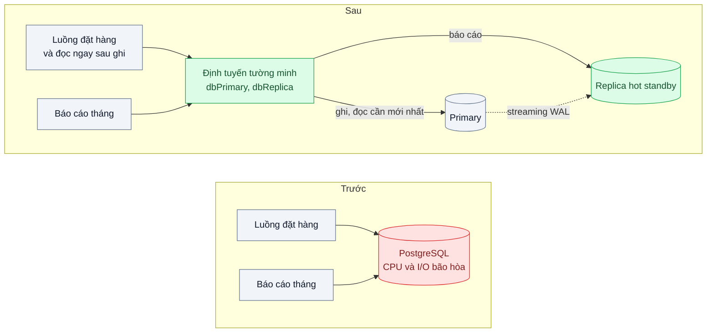
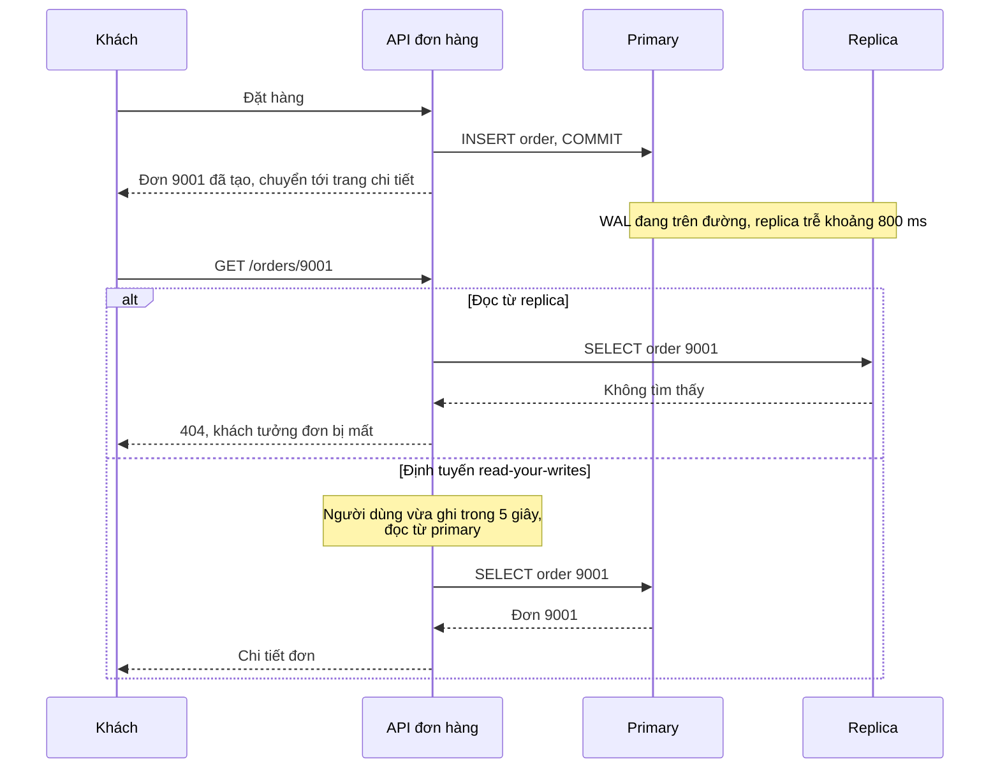

# Read Replica — Báo cáo cuối tháng làm chậm việc tạo đơn

| Scope | Mức độ | Trạng thái | Pattern gốc | Cập nhật |
|---|---|---|---|---|
| 02 · backend / database | 🟡 Trung bình | 📋 Kế hoạch | Read Replica (primary–standby) — PostgreSQL docs; Fowler, Reporting Database; DDIA ch.5 | 2026-10-06 |

> **Một câu tóm tắt:** Dựng một bản sao chỉ đọc nhận WAL liên tục từ primary và chuyển các truy vấn báo cáo nặng sang đó, để primary dành tài nguyên cho việc tạo đơn; đồng thời xử lý có chủ đích độ trễ sao chép để người dùng không "mất" dữ liệu vừa ghi.

## 1. Bài toán thực tế (What)

**Bối cảnh** *(doanh nghiệp giả định, số liệu minh họa)*
Sàn thương mại điện tử khoảng 40.000 đơn mỗi ngày, PostgreSQL 16 một máy duy nhất. Ngày 1 hằng tháng, đội tài chính và khoảng 3.000 shop chạy báo cáo doanh thu, đối soát phí, tồn kho theo tháng ngay trên database đó qua trang quản trị.

**Triệu chứng người kinh doanh nhìn thấy**
- Sáng ngày 1 mỗi tháng, khách đặt hàng chậm hẳn: nút "Đặt hàng" mất 2–3 giây thay vì dưới 200 ms, tỷ lệ bỏ giỏ tăng rõ.
- Có lần đội vận hành phải tạm khóa trang báo cáo của shop giữa buổi sáng; shop phản đối vì cần số liệu để quyết toán.
- Đội tài chính phải chạy báo cáo lúc nửa đêm để tránh giờ cao điểm.

**Nguyên nhân kỹ thuật**
Báo cáo tháng quét hàng chục triệu dòng `orders` và `order_items`, sắp xếp và gộp nhóm: chiếm CPU, I/O và đẩy dữ liệu nóng của luồng đặt hàng ra khỏi bộ đệm. Luồng ghi (tạo đơn, trừ kho) phải chờ tài nguyên. Đọc và ghi có đặc tính tải rất khác nhau nhưng tranh nhau trên cùng một máy.

**Ràng buộc**
- Báo cáo chấp nhận dữ liệu trễ vài giây; luồng đặt hàng và màn hình "đơn của tôi" ngay sau khi đặt thì không.
- Không thêm hệ thống kho dữ liệu riêng trong giai đoạn này.
- Ứng dụng phải chọn rõ ràng truy vấn nào đi đâu, không đoán theo câu SQL.

## 2. Vì sao dùng pattern này (Why)

**Nguyên nhân gốc mà pattern nhắm vào:** tải đọc nặng và tải ghi quan trọng dùng chung tài nguyên của một máy database.

**Pattern giải quyết thế nào:** PostgreSQL hỗ trợ streaming replication: standby nhận và phát lại WAL của primary, và ở chế độ hot standby cho phép chạy truy vấn chỉ đọc. Ứng dụng giữ hai pool kết nối: ghi và đọc cần mới nhất đi primary, báo cáo đi replica. Fowler mô tả Reporting Database là cơ sở dữ liệu riêng cho báo cáo để không ảnh hưởng hệ thống vận hành; replica là dạng đơn giản nhất của ý đó, cùng schema, gần thời gian thực. Cái giá là replication lag: DDIA chương 5 gọi tên các bất thường như không đọc được dữ liệu mình vừa ghi (read-your-writes) và đọc thấy dữ liệu lùi lại (monotonic reads); thiết kế phải chọn chỗ nào chấp nhận được lag.

**Lựa chọn khác đã cân nhắc**

| Lựa chọn | Giải quyết được gì | Vì sao không chọn (ở bài này) |
|---|---|---|
| Giữ nguyên + tối ưu nhỏ (index cho báo cáo, chạy ban đêm) | Báo cáo nhanh hơn, ít đụng giờ cao điểm | Shop vẫn cần báo cáo ban ngày; index thêm làm chậm ghi; vẫn tranh tài nguyên |
| Nâng cấp máy primary | Thêm tài nguyên cho cả hai | Đắt, tạm thời; báo cáo vẫn chiếm bộ đệm của luồng ghi |
| Cache kết quả báo cáo (scope 03) | Báo cáo lặp lại nhanh | Mỗi shop, mỗi bộ lọc một kết quả; lần chạy đầu vẫn đánh vào primary |
| Kho dữ liệu riêng qua ETL hoặc CDC | Tối ưu cho phân tích, tách hẳn | Thêm hệ thống và pipeline; để dành khi nhu cầu phân tích lớn hơn |
| Read replica + định tuyến tường minh + xử lý lag (chọn) | Tách tải đọc nặng, cùng schema, triển khai nhanh | Thêm một máy; phải xử lý lag và xung đột truy vấn trên standby |

## 3. Thiết kế hệ thống (How)

### 3.1 Kiến trúc trước và sau



### 3.2 Luồng chính



### 3.3 Thành phần và trách nhiệm

| Thành phần | Trách nhiệm | Quyết định thiết kế đáng chú ý |
|---|---|---|
| Replica hot standby | Phát lại WAL, phục vụ truy vấn chỉ đọc | Cấu hình xử lý xung đột với truy vấn dài (`max_standby_streaming_delay` hoặc `hot_standby_feedback`) |
| Hai pool `dbPrimary`, `dbReplica` | Tách kết nối theo đích | Repository chọn tường minh; mặc định là primary để an toàn |
| Quy tắc read-your-writes | Đưa đọc của người dùng vừa ghi về primary trong một khoảng | Mốc thời điểm ghi lưu trong phiên hoặc cookie; khoảng lớn hơn p99 lag |
| Giám sát lag | Đo độ trễ phát lại của replica | Báo cáo hiển thị "dữ liệu tính tới"; cảnh báo khi lag vượt ngưỡng |
| Dự phòng khi replica hỏng | Báo cáo lỗi rõ hoặc xếp hàng, không tự đổ về primary | Tự đổ về primary là tái tạo đúng sự cố cũ |

### 3.4 Điểm dễ sai khi triển khai
- **Định tuyến tự động theo `SELECT`.** Truy vấn đọc ngay sau ghi sẽ đi replica và thấy dữ liệu cũ. Chọn đích theo ngữ cảnh nghiệp vụ, không theo động từ SQL.
- **Truy vấn báo cáo bị hủy giữa chừng** vì xung đột với việc phát lại WAL. Bật `hot_standby_feedback` giảm hủy nhưng làm primary giữ lại dòng chết lâu hơn; tăng `max_standby_streaming_delay` làm lag tăng. Chọn có chủ đích và đo.
- **Tự đổ về primary khi replica lỗi** trong ngày 1 hằng tháng: chính xác sự cố cũ quay lại.
- **Quên rằng replica cũng có trần kết nối** và cần pool riêng (bài 03).
- **Coi replica là bản sao lưu.** Lệnh xóa nhầm được sao chép sang replica trong vài trăm mili giây; sao lưu là chuyện khác (scope 15).

## 4. Tech stack và tác động (Impact techstack)

| Lớp | Công nghệ chọn | Vì sao chọn | Thay thế tương đương |
|---|---|---|---|
| Database | PostgreSQL 16 streaming replication, hot standby | Có sẵn, cùng schema, lag thường dưới một giây | Replica do dịch vụ cloud quản lý |
| Dựng replica local | `pg_basebackup -R` trong Docker Compose | Tạo standby từ primary với cấu hình kết nối tự sinh | Image có sẵn biến môi trường replication (cần xác minh) |
| Truy cập dữ liệu | Kysely, hai instance theo đích | Chọn đích tường minh trong từng repository | Prisma read replicas extension (cần xác minh) |
| API | NestJS 10, TypeScript strict | Stack mặc định | Fastify |
| Giám sát lag | `pg_stat_replication` trên primary, `pg_last_xact_replay_timestamp()` trên replica | Số liệu chính thức về lag | Prometheus postgres exporter |
| Đo | k6 hai kịch bản song song, `pg_stat_statements` | Đo p95 tạo đơn trong khi báo cáo chạy | pgbench |

**Thay đổi so với hệ thống hiện tại:** thêm một máy replica, một pool kết nối, quy tắc định tuyến trong repository báo cáo và chi tiết đơn, nhãn "dữ liệu tính tới" trên trang báo cáo. Đội vận hành học giám sát lag và xử lý xung đột trên standby.

## 5. Kết quả đầu ra và cách đo (Output impact)

| Chỉ số | Trước (minh họa) | Mục tiêu khi thực hành | Cách đo |
|---|---|---|---|
| p95 tạo đơn khi báo cáo tháng đang chạy | 2.500 ms | ≤ 200 ms | k6 kịch bản đặt hàng chạy song song kịch bản báo cáo, 10 phút |
| CPU primary trong lúc chạy báo cáo | gần 100 % | không khác đáng kể so với khi không có báo cáo | `docker stats` hoặc `pg_stat_activity` |
| p99 replication lag | không có | ≤ 1 giây ở tải thử | `replay_lag` trong `pg_stat_replication`, lấy mẫu mỗi giây |
| Lần đọc thấy "đơn không tồn tại" ngay sau khi đặt | không đo | 0 trên 1.000 lần | Test đặt hàng rồi đọc chi tiết ngay, lặp 1.000 lần |
| Truy vấn báo cáo bị hủy do xung đột | không đo | 0 ở cấu hình đã chọn | Log replica, đếm lỗi conflict with recovery |

> Số "trước" là minh họa để hình dung bài toán. Số "mục tiêu" chỉ được coi là đạt khi có số đo thật
> ở mục 8 kèm môi trường đo.

**Tác động nghiệp vụ mong đợi:** ngày đầu tháng không còn là ngày khách đặt hàng chậm; shop và tài chính chạy báo cáo giờ hành chính mà không phải xin phép đội kỹ thuật.

## 6. Đánh đổi và khi KHÔNG nên dùng

**Đánh đổi**
- Thêm máy và chi phí vận hành; replica phải được giám sát như primary.
- Dữ liệu trên replica luôn có thể cũ; mọi màn hình đọc từ replica phải chấp nhận điều đó.
- Xung đột truy vấn trên standby buộc chọn giữa hủy truy vấn, tăng lag hoặc tăng bloat ở primary.

**Không nên dùng khi**
- Tải chủ yếu là ghi: replica không giảm tải ghi, cần nhìn sang phân vùng hoặc sharding.
- Truy vấn chậm vì thiếu index hoặc N+1: sửa truy vấn trước (bài 01), replica chỉ dời vấn đề.
- Báo cáo cần mô hình dữ liệu khác hẳn mô hình giao dịch: cân nhắc CQRS hoặc kho dữ liệu (bài 06).

**Liên quan**
- Đọc trước: `../01-n-plus-1-trang-50-don-ban-151-cau-sql/` — tối ưu truy vấn trước khi thêm máy.
- Đọc sau: `../06-cqrs-man-hinh-tong-hop-join-9-bang/` — tách đọc khỏi ghi ở mức mô hình.
- So sánh: `../../03-backend-cache/01-cache-aside-trang-san-pham-doc-10k-lan-phut/` — cache là cách khác để giảm tải đọc.
- Cùng chủ đề: `../../15-backend-storage/07-backup-pitr-xoa-nham-bang-luc-14h-backup-dem-qua/` — replica không thay được sao lưu.

## 7. Cơ sở tham khảo

- PostgreSQL docs, "High Availability, Load Balancing, and Replication" — https://www.postgresql.org/docs/current/high-availability.html — streaming replication, hot standby, xử lý xung đột truy vấn, `hot_standby_feedback`, `max_standby_streaming_delay`.
- Martin Fowler, "ReportingDatabase", bliki — https://martinfowler.com/bliki/ReportingDatabase.html — lý do tách cơ sở dữ liệu báo cáo khỏi cơ sở dữ liệu vận hành và đánh đổi về độ mới của dữ liệu.
- Martin Kleppmann, *Designing Data-Intensive Applications*, O'Reilly, 2017, chương 5 — replication lag, read-your-writes, monotonic reads và cách thiết kế quanh chúng.
- PostgreSQL docs, "pg_basebackup" và "Monitoring Database Activity" (`pg_stat_replication`) — https://www.postgresql.org/docs/ — dựng standby và đo lag.

## 8. Kế hoạch thực hành

- [ ] Bước 1: Docker Compose primary và replica PostgreSQL 16 (`pg_basebackup -R`); seed 20 triệu đơn; API đặt hàng và API báo cáo tháng.
- [ ] Bước 2: đo "trước": chạy báo cáo trên primary cùng lúc với k6 đặt hàng; ghi p95, CPU.
- [ ] Bước 3: thêm pool replica, chuyển repository báo cáo sang replica, quy tắc read-your-writes cho chi tiết đơn, giám sát lag, chọn cấu hình xung đột standby.
- [ ] Bước 4: đo "sau" cùng kịch bản, thêm đo lag và số truy vấn bị hủy; ghi số thật và môi trường vào mục 5.
- [ ] Bước 5: viết test: (a) đặt hàng rồi đọc ngay luôn thấy đơn; (b) repository báo cáo dùng replica, repository đặt hàng không bao giờ dùng replica; (c) khi replica tắt, báo cáo trả lỗi rõ ràng và không đổ tải về primary.

**Cấu trúc code dự kiến**
```text
src/
  db/connections.ts                    # dbPrimary, dbReplica
  db/read-your-writes.ts               # [PATTERN] chọn đích theo mốc ghi gần nhất
  orders/order.repository.ts
  reports/monthly-report.repository.ts # luôn dùng replica
  monitoring/replication-lag.ts
infra/replica-init.sh                  # pg_basebackup -R
test/
  read-after-write-sees-order.test.ts
  report-never-hits-primary.test.ts
bench/orders-during-monthly-report.k6.js
docker-compose.yml
```

**Cách chạy** *(điền khi bắt đầu code)*
```bash
docker compose up -d
pnpm install && pnpm test
```
