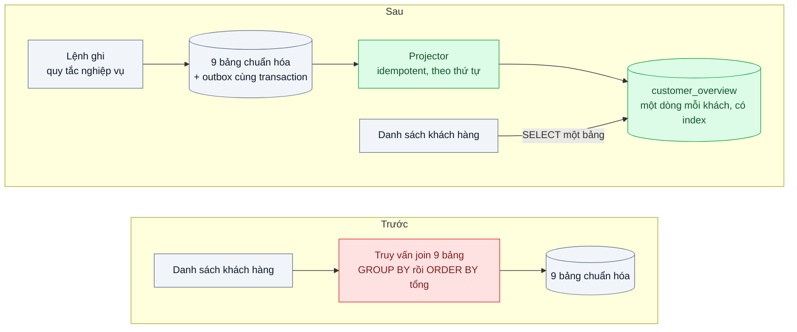
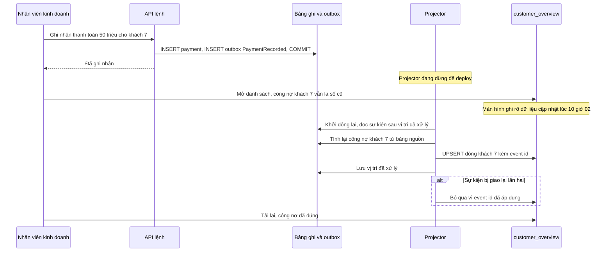

# CQRS — Màn hình tổng hợp phải join 9 bảng, mô hình ghi và đọc ngày càng khác nhau

| Scope | Mức độ | Trạng thái | Pattern gốc | Cập nhật |
|---|---|---|---|---|
| 02 · backend / database | 🔴 Nâng cao | 📋 Kế hoạch | CQRS — Greg Young (2010), Fowler bliki (2011); Materialized View — Azure Architecture Center | 2026-10-06 |

> **Một câu tóm tắt:** Tách mô hình ghi (chuẩn hóa, giữ quy tắc nghiệp vụ) khỏi mô hình đọc (một bảng phẳng đã tính sẵn cho màn hình tổng hợp), cập nhật mô hình đọc bằng sự kiện sau mỗi lần ghi, để màn hình đọc một dòng có index thay vì join 9 bảng và tính tổng mỗi lần mở.

## 1. Bài toán thực tế (What)

**Bối cảnh** *(doanh nghiệp giả định, số liệu minh họa)*
Công ty SaaS B2B cung cấp CRM cho khoảng 600 doanh nghiệp, tổng khoảng 2 triệu hồ sơ khách hàng. Màn hình "Khách hàng 360" và danh sách khách hàng cho phép lọc, sắp xếp theo tổng công nợ, giai đoạn cơ hội lớn nhất, ngày tương tác gần nhất, số phiếu hỗ trợ đang mở. Dữ liệu nằm ở 9 bảng: khách hàng, liên hệ, cơ hội, giai đoạn, hoạt động, phiếu hỗ trợ, hóa đơn, thanh toán, người phụ trách.

**Triệu chứng người kinh doanh nhìn thấy**
- Danh sách khách hàng sắp xếp theo "công nợ" mất 6–8 giây với khách lớn; đội kinh doanh của khách hàng phàn nàn trong mọi buổi gia hạn hợp đồng.
- Mỗi lần thêm một cột tổng hợp, đội phát triển mất cả tuần tối ưu truy vấn và vẫn có tenant bị chậm.
- Quy tắc nghiệp vụ ở phía ghi (luồng duyệt cơ hội, quy tắc công nợ) bị "uốn" để màn hình đọc dễ truy vấn hơn, gây lỗi nghiệp vụ.

**Nguyên nhân kỹ thuật**
Câu truy vấn màn hình join 9 bảng, gộp nhóm để tính tổng công nợ, đếm phiếu mở, lấy tương tác mới nhất, rồi mới lọc và sắp xếp trên các giá trị tính ra; không index nào phục vụ được việc sắp xếp theo một tổng chưa tồn tại. Mô hình ghi được chuẩn hóa để giữ đúng quy tắc, mô hình đọc cần dữ liệu phẳng; cố dùng một mô hình cho cả hai khiến cả hai đều tệ.

**Ràng buộc**
- Màn hình tổng hợp chấp nhận trễ vài giây so với thao tác ghi; màn hình chi tiết ngay sau thao tác của chính người dùng thì cần thấy thay đổi.
- Không chuyển sang Event Sourcing; bảng chuẩn hóa vẫn là nguồn sự thật.
- Mô hình đọc phải dựng lại được từ đầu khi đổi cấu trúc hoặc phát hiện sai lệch.

## 2. Vì sao dùng pattern này (Why)

**Nguyên nhân gốc mà pattern nhắm vào:** một mô hình dữ liệu duy nhất phải phục vụ hai nhu cầu trái ngược: ghi đúng quy tắc và đọc nhanh theo nhiều góc nhìn.

**Pattern giải quyết thế nào:** Greg Young mô tả CQRS là tách đối tượng phục vụ lệnh (thay đổi trạng thái) khỏi đối tượng phục vụ truy vấn; Fowler nhấn mạnh cốt lõi là dùng *mô hình khác nhau* cho cập nhật và cho đọc, xuất phát từ nguyên tắc CQS của Bertrand Meyer. Ở bài này: phía ghi giữ nguyên các bảng chuẩn hóa và quy tắc nghiệp vụ; mỗi lệnh ghi thêm một sự kiện vào bảng outbox trong cùng transaction. Một projector đọc outbox và cập nhật bảng `customer_overview` — một dòng mỗi khách hàng với mọi cột tổng hợp đã tính sẵn và index cho các kiểu sắp xếp phổ biến. Azure gọi bảng này là Materialized View: dữ liệu được chuẩn bị sẵn theo hình dạng truy vấn cần, có thể dựng lại bất cứ lúc nào từ nguồn.

**Lựa chọn khác đã cân nhắc**

| Lựa chọn | Giải quyết được gì | Vì sao không chọn (ở bài này) |
|---|---|---|
| Giữ nguyên + tối ưu nhỏ (index, viết lại truy vấn, thêm RAM) | Một số tenant nhanh hơn | Sắp xếp theo tổng tính động vẫn không dùng được index; mỗi cột mới là một vòng tối ưu |
| `MATERIALIZED VIEW` của PostgreSQL, `REFRESH ... CONCURRENTLY` định kỳ | Đơn giản, không cần projector | Mỗi lần làm mới tính lại toàn bộ 2 triệu dòng; dữ liệu trễ theo chu kỳ phút; tốn tài nguyên tăng theo dữ liệu |
| Cột tổng hợp cập nhật bằng trigger ngay trong transaction ghi | Luôn mới nhất | Logic đọc trộn vào phía ghi; tranh chấp khóa trên dòng khách hàng khi nhiều thao tác ghi đồng thời |
| Read replica (bài 05) | Tách tải đọc | Cùng mô hình dữ liệu, cùng câu join 9 bảng, chỉ chạy ở máy khác |
| CQRS: bảng đọc phẳng cập nhật bằng sự kiện qua outbox (chọn) | Đọc một bảng có index, phía ghi giữ quy tắc sạch, dựng lại được | Nhất quán sau, thêm projector và quy trình dựng lại |

## 3. Thiết kế hệ thống (How)

### 3.1 Kiến trúc trước và sau



### 3.2 Luồng chính



### 3.3 Thành phần và trách nhiệm

| Thành phần | Trách nhiệm | Quyết định thiết kế đáng chú ý |
|---|---|---|
| Phía ghi | Kiểm tra quy tắc, ghi bảng chuẩn hóa, ghi sự kiện vào outbox | Sự kiện cùng transaction với dữ liệu: không mất, không thừa |
| Projector | Đọc sự kiện theo thứ tự, cập nhật bảng đọc | Tính lại dòng của khách từ bảng nguồn thay vì cộng dồn, nên áp dụng lại vô hại |
| `customer_overview` | Một dòng mỗi khách với cột tổng hợp và `tenant_id` | Index cho các kiểu sắp xếp phổ biến, tiền tố `tenant_id` |
| Vị trí đã xử lý | Lưu sự kiện cuối cùng projector đã áp dụng | Cập nhật trong cùng transaction với bảng đọc |
| Job dựng lại | Tính lại toàn bộ bảng đọc từ nguồn vào bảng mới rồi đổi tên | Dùng khi đổi cấu trúc hoặc khi kiểm tra đối chiếu phát hiện lệch |
| Kiểm tra đối chiếu | Chọn mẫu khách, so bảng đọc với kết quả tính từ nguồn | Chạy định kỳ, cảnh báo khi có sai lệch |

### 3.4 Điểm dễ sai khi triển khai
- **Phát sự kiện ngoài transaction ghi** (ghi DB rồi mới gửi lên broker): crash ở giữa là bảng đọc lệch vĩnh viễn. Dùng outbox (scope 14).
- **Projector cộng dồn** (`debt = debt + amount`): sự kiện giao lại hai lần là sai số. Tính lại từ nguồn hoặc lưu id sự kiện đã áp dụng.
- **Không có đường dựng lại.** Đổi cách tính công nợ mà không dựng lại được bảng đọc là bế tắc; viết job dựng lại ngay từ đầu.
- **Giao diện giả vờ nhất quán tức thì.** Người dùng vừa ghi rồi thấy số cũ sẽ nghĩ hệ thống lỗi; hiển thị "cập nhật lúc", hoặc trả dữ liệu mới trong response của lệnh để giao diện tự cập nhật.
- **Áp CQRS cho cả hệ thống.** Fowler cảnh báo phần lớn hệ thống không cần; chỉ áp cho ngữ cảnh có nhu cầu đọc khác biệt rõ.

## 4. Tech stack và tác động (Impact techstack)

| Lớp | Công nghệ chọn | Vì sao chọn | Thay thế tương đương |
|---|---|---|---|
| Database | PostgreSQL 16 cho cả phía ghi và bảng đọc | Một hệ thống; `INSERT ... ON CONFLICT` cho upsert bảng đọc | Bảng đọc ở DB riêng hoặc search engine |
| Chuyển sự kiện | Bảng outbox + PGMQ (cần xác minh API) | Ở ngay trong PostgreSQL, ít hạ tầng; trùng stack chủ repo | Debezium Outbox Event Router, Kafka |
| Projector | Worker Node.js, TypeScript strict | Đọc theo lô, cập nhật theo thứ tự trong mỗi khách | BullMQ worker |
| API | NestJS 10, tách module lệnh và module truy vấn | Ranh giới rõ trong code, không cần hai service | Fastify |
| Truy cập dữ liệu | Kysely | Viết truy vấn tính lại từ nguồn có type | SQL thuần |
| Đo | k6, `EXPLAIN (ANALYZE, BUFFERS)`, metric lag của projector | So p95 màn hình trước và sau, đo độ trễ chiếu | Prometheus |

**Thay đổi so với hệ thống hiện tại:** thêm outbox, worker projector, bảng đọc, job dựng lại và kiểm tra đối chiếu; màn hình danh sách đọc từ bảng đọc. Đội phải quen tư duy nhất quán sau và vận hành thêm một worker.

## 5. Kết quả đầu ra và cách đo (Output impact)

| Chỉ số | Trước (minh họa) | Mục tiêu khi thực hành | Cách đo |
|---|---|---|---|
| p95 danh sách khách hàng sắp xếp theo công nợ | 7.000 ms | ≤ 80 ms | k6 30 người dùng ảo trên seed 2 triệu khách, 600 tenant |
| Số bảng trong truy vấn màn hình | 9 | 1 | `EXPLAIN` của truy vấn màn hình |
| p99 độ trễ từ lúc ghi tới lúc bảng đọc cập nhật | không áp dụng | ≤ 2 giây | Metric chênh lệch thời điểm sự kiện và thời điểm chiếu |
| Overhead p95 của lệnh ghi do thêm outbox | 0 | ≤ 3 ms | k6 so sánh lệnh ghi thanh toán |
| Thời gian dựng lại toàn bộ bảng đọc | không có | ≤ 15 phút cho 2 triệu khách | Đo thời gian job dựng lại |
| Sai lệch phát hiện qua kiểm tra đối chiếu | không đo | 0 sau khi tiêm sự kiện trùng và projector khởi động lại | Job đối chiếu trên 10.000 khách ngẫu nhiên |

> Số "trước" là minh họa để hình dung bài toán. Số "mục tiêu" chỉ được coi là đạt khi có số đo thật
> ở mục 8 kèm môi trường đo.

**Tác động nghiệp vụ mong đợi:** danh sách khách hàng mở gần như tức thì với mọi tenant, thêm cột tổng hợp mới không còn là dự án một tuần, và quy tắc nghiệp vụ phía ghi không bị bẻ cong vì màn hình đọc.

## 6. Đánh đổi và khi KHÔNG nên dùng

**Đánh đổi**
- Nhất quán sau: luôn có khoảng thời gian bảng đọc chưa phản ánh thao tác ghi.
- Thêm projector, outbox, job dựng lại, kiểm tra đối chiếu: nhiều thành phần hơn để vận hành và gỡ lỗi.
- Dữ liệu lặp ở hai nơi; sai ở projector tạo ra số liệu sai mà nhìn bề ngoài vẫn hợp lý.

**Không nên dùng khi**
- Màn hình đọc gần giống mô hình ghi (CRUD đơn giản): CQRS chỉ thêm độ phức tạp; Fowler cảnh báo điều này.
- Nghiệp vụ không chấp nhận dữ liệu trễ ở màn hình đó: tối ưu truy vấn hoặc dùng cột tổng hợp cập nhật đồng bộ.
- Dữ liệu nhỏ, `MATERIALIZED VIEW` làm mới vài giây là xong: dùng nó trước.

**Liên quan**
- Đọc trước: `../05-read-replica-bao-cao-cuoi-thang-lam-cham-tao-don/` — tách đọc ở mức hạ tầng trước khi tách ở mức mô hình.
- Đọc trước: `../../14-backend-queueing/03-transactional-outbox-ghi-don-xong-crash-mat-event/` — cách phát sự kiện không mất.
- Cùng chủ đề: `../../14-backend-queueing/04-idempotent-consumer-event-den-hai-lan-tru-kho-hai-lan/` — projector là một idempotent consumer.
- Cùng chủ đề: `../../05-backend-search/05-cdc-dong-bo-index-du-lieu-search-lech-db/` — mô hình đọc là search index.

## 7. Cơ sở tham khảo

- Martin Fowler, "CQRS", bliki, 2011 — https://martinfowler.com/bliki/CQRS.html — định nghĩa, nguồn gốc từ CQS, cảnh báo về độ phức tạp và phạm vi nên áp dụng.
- Greg Young, "CQRS Documents", 2010 (cần xác minh URL) — mô tả gốc của việc tách mô hình lệnh và mô hình truy vấn.
- Microsoft Azure Architecture Center, "CQRS pattern" và "Materialized View pattern" — https://learn.microsoft.com/azure/architecture/patterns/cqrs — cân nhắc về nhất quán sau, dựng lại view, khi nào không nên dùng.
- Martin Fowler, "Event Sourcing", 2005 — https://martinfowler.com/eaaDev/EventSourcing.html — hướng mở khi muốn lịch sử sự kiện là nguồn sự thật.
- PostgreSQL docs, "CREATE MATERIALIZED VIEW" và "REFRESH MATERIALIZED VIEW" — https://www.postgresql.org/docs/ — phương án so sánh ở mục 2.

## 8. Kế hoạch thực hành

- [ ] Bước 1: seed 9 bảng cho 600 tenant, 2 triệu khách; API danh sách dùng truy vấn join hiện trạng.
- [ ] Bước 2: đo "trước": p95 danh sách theo các kiểu sắp xếp, `EXPLAIN (ANALYZE, BUFFERS)`; thử phương án `MATERIALIZED VIEW` và ghi thời gian làm mới.
- [ ] Bước 3: thêm outbox ở các lệnh ghi, projector tính lại theo khách, bảng đọc có index, vị trí đã xử lý, job dựng lại và đối chiếu.
- [ ] Bước 4: đo "sau": p95 màn hình, lag chiếu, overhead ghi, thời gian dựng lại; ghi số thật và môi trường vào mục 5.
- [ ] Bước 5: viết test: (a) giao lại một sự kiện hai lần không đổi bảng đọc; (b) dừng projector, ghi 1.000 thay đổi, khởi động lại thì bảng đọc khớp nguồn; (c) job dựng lại cho kết quả giống hệt bảng đọc đang chạy.

**Cấu trúc code dự kiến**
```text
src/
  commands/record-payment.command.ts      # ghi dữ liệu và outbox cùng transaction
  projector/customer-overview.projector.ts # [PATTERN] tính lại theo khách, idempotent
  projector/projection-position.ts
  queries/customer-list.query.ts           # SELECT một bảng
  jobs/rebuild-customer-overview.ts
  jobs/reconcile-customer-overview.ts
test/
  duplicate-event-is-harmless.test.ts
  projector-catches-up-after-restart.test.ts
  rebuild-matches-live.test.ts
bench/customer-list.k6.js
docker-compose.yml
```

**Cách chạy** *(điền khi bắt đầu code)*
```bash
docker compose up -d
pnpm install && pnpm test
```
