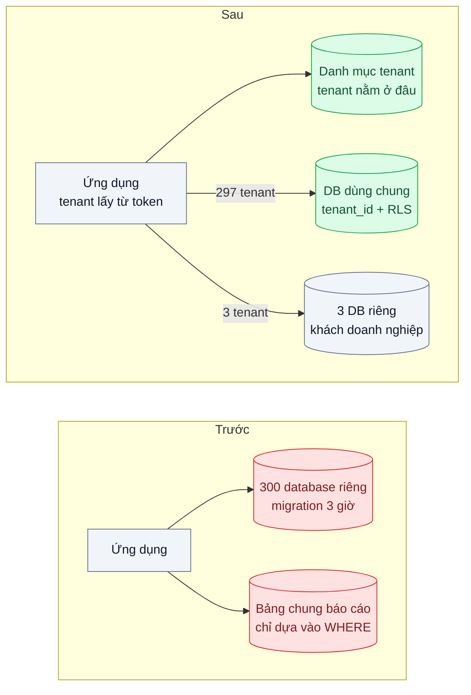
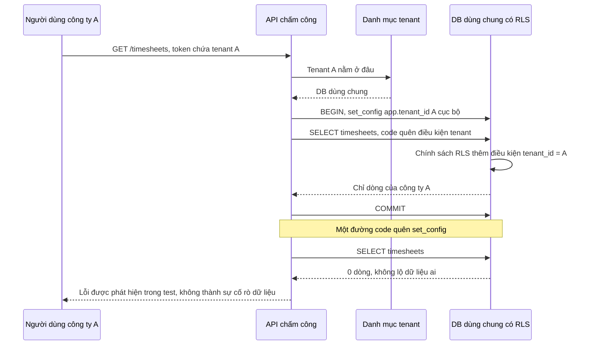

# Multi-tenant Data Isolation — SaaS bán cho 300 công ty: chung bảng, chung DB hay riêng DB?

| Scope | Mức độ | Trạng thái | Pattern gốc | Cập nhật |
|---|---|---|---|---|
| 02 · backend / database | 🔴 Nâng cao | 📋 Kế hoạch | Multitenant SaaS database tenancy patterns — Microsoft Learn; Row Security Policies — PostgreSQL docs | 2026-10-06 |

> **Một câu tóm tắt:** Chọn mô hình lai: phần lớn công ty dùng chung bảng có cột `tenant_id` được Row-Level Security của PostgreSQL ép lọc ở tầng database, vài khách lớn có database riêng, và một danh mục tenant cho ứng dụng biết mỗi tenant nằm ở đâu.

## 1. Bài toán thực tế (What)

**Bối cảnh** *(doanh nghiệp giả định, số liệu minh họa)*
Công ty SaaS B2B bán phần mềm quản lý nhân sự và chấm công cho khoảng 300 công ty, từ 20 tới 8.000 nhân viên. Ban đầu mỗi khách một database riêng; nay là 300 database trên hai máy chủ. Một module mới (báo cáo chấm công) lại dùng bảng chung có cột `company_id` để làm nhanh.

**Triệu chứng người kinh doanh nhìn thấy**
- Một khách nhìn thấy bảng chấm công của công ty khác trong 40 phút vì một truy vấn quên lọc `company_id`; sự cố phải báo cáo cho khách và làm rung chuyển hai hợp đồng lớn.
- Mỗi lần phát hành có thay đổi schema mất khoảng 3 giờ chạy migration lần lượt trên 300 database; có lần dừng giữa chừng, các khách ở hai phiên bản schema khác nhau.
- Khách mới phải chờ một ngày để đội vận hành tạo database; đội bán hàng mất cơ hội dùng thử ngay.
- Ba khách doanh nghiệp lớn yêu cầu trong hợp đồng dữ liệu phải tách riêng và sao lưu riêng.

**Nguyên nhân kỹ thuật**
Không có một quyết định tenancy nhất quán: database riêng cho mỗi khách nhân chi phí vận hành theo số khách (migration, kết nối, giám sát), còn bảng chung thì phụ thuộc hoàn toàn vào việc lập trình viên nhớ thêm `WHERE company_id = ?` ở *mọi* truy vấn. Một lần quên là rò dữ liệu, và không có lớp phòng thủ thứ hai.

**Ràng buộc**
- Khách nhỏ và vừa phải rẻ để phục vụ và kích hoạt được ngay.
- Khách có điều khoản cách ly phải có database riêng.
- Một lỗi quên điều kiện lọc không được dẫn tới rò dữ liệu giữa các công ty.
- Chuyển một khách từ nhóm dùng chung sang database riêng phải làm được khi khách lớn lên.

## 2. Vì sao dùng pattern này (Why)

**Nguyên nhân gốc mà pattern nhắm vào:** cách ly giữa các tenant đang dựa vào kỷ luật của từng truy vấn, và mô hình tenancy được chọn ngẫu nhiên theo từng module.

**Pattern giải quyết thế nào:** Microsoft Learn liệt kê các mô hình tenancy cho SaaS: ứng dụng và database riêng cho mỗi tenant, database riêng cho mỗi tenant với ứng dụng dùng chung, database dùng chung nhiều tenant (có thể phân mảnh), và mô hình lai, kèm bảng so sánh về chi phí, cách ly, vận hành. Bài này chọn mô hình lai với một *danh mục tenant* ánh xạ tenant tới database. Trong database dùng chung, PostgreSQL Row Security Policies là lớp phòng thủ thứ hai: chính sách `USING (tenant_id = current_setting('app.tenant_id', true)::uuid)` khiến mọi truy vấn của role ứng dụng chỉ thấy dòng của tenant hiện tại, kể cả khi code quên điều kiện lọc. Nếu ứng dụng quên đặt tenant, `current_setting` trả rỗng và truy vấn không thấy dòng nào: hỏng theo hướng an toàn.

**Lựa chọn khác đã cân nhắc**

| Lựa chọn | Giải quyết được gì | Vì sao không chọn (ở bài này) |
|---|---|---|
| Giữ nguyên + tối ưu nhỏ (thêm review code bắt quên `company_id`) | Giảm xác suất lỗi | Vẫn chỉ một lớp phòng thủ; 300 database vẫn giữ nguyên chi phí vận hành |
| Database riêng cho mọi tenant | Cách ly mạnh, sao lưu riêng | Chi phí và thời gian migration tăng theo số khách; kích hoạt chậm |
| Schema riêng cho mỗi tenant trong một database | Cách ly mức tên bảng | Hàng nghìn bảng trong một database, migration vẫn lặp theo tenant, khó với pooler |
| Bảng chung chỉ dựa vào `WHERE tenant_id` trong code | Rẻ nhất | Chính là nguyên nhân sự cố rò dữ liệu |
| Lai: bảng chung + RLS cho đa số, DB riêng cho khách lớn, danh mục tenant (chọn) | Rẻ cho đa số, cách ly hợp đồng cho số ít, hai lớp phòng thủ | Phải vận hành hai kiểu triển khai và công cụ chuyển tenant |

## 3. Thiết kế hệ thống (How)

### 3.1 Kiến trúc trước và sau



### 3.2 Luồng chính



### 3.3 Thành phần và trách nhiệm

| Thành phần | Trách nhiệm | Quyết định thiết kế đáng chú ý |
|---|---|---|
| Danh mục tenant | Lưu tenant, gói dịch vụ, database đích, trạng thái chuyển | Cache trong ứng dụng có thời hạn ngắn; nguồn sự thật cho định tuyến |
| Middleware tenant | Lấy tenant từ token, chọn kết nối, đặt `app.tenant_id` cục bộ transaction | Không bao giờ lấy tenant từ tham số request do client gửi |
| Chính sách RLS | Lọc và kiểm tra ghi theo `tenant_id` trên mọi bảng có dữ liệu tenant | `ENABLE` và `FORCE ROW LEVEL SECURITY`; role ứng dụng không phải owner, không có `BYPASSRLS` |
| Index | Hỗ trợ truy vấn theo tenant | `tenant_id` đứng đầu mọi index phức hợp |
| Công cụ chuyển tenant | Sao chép dữ liệu một tenant sang DB riêng, đổi danh mục, dọn dữ liệu cũ | Chạy theo các bước có thể dừng và tiếp tục; khóa ghi ngắn khi chuyển mốc |
| Bộ test cách ly | Gửi request của tenant A với id của tenant B trên mọi endpoint | Chạy trong CI, thất bại nếu có bất kỳ dòng nào lọt |

### 3.4 Điểm dễ sai khi triển khai
- **Role ứng dụng là owner của bảng.** Owner bỏ qua RLS trừ khi bật `FORCE ROW LEVEL SECURITY`; superuser và role có `BYPASSRLS` luôn bỏ qua. Tách role migration và role ứng dụng.
- **Đặt tenant bằng `SET` khi đi qua pooler.** Giá trị rò sang request của tenant khác: đúng loại sự cố cần tránh. Luôn đặt cục bộ transaction (bài 03).
- **Quên `WITH CHECK`.** Không có điều kiện kiểm tra khi ghi, code lỗi có thể chèn dòng mang `tenant_id` của người khác.
- **Index thiếu `tenant_id`.** RLS thêm điều kiện vào mọi truy vấn; index không có `tenant_id` đứng đầu khiến kế hoạch tệ đi rõ rệt.
- **Khách lớn trong DB dùng chung** làm chậm mọi khách khác (noisy neighbor). Theo dõi tài nguyên theo tenant và có quy trình chuyển sang DB riêng.

## 4. Tech stack và tác động (Impact techstack)

| Lớp | Công nghệ chọn | Vì sao chọn | Thay thế tương đương |
|---|---|---|---|
| Database | PostgreSQL 16, Row Security Policies | Cách ly ở tầng database, không phụ thuộc từng truy vấn | Cách ly ở tầng ứng dụng bằng repository bắt buộc tham số tenant |
| Danh mục tenant | Bảng trong PostgreSQL riêng + cache trong bộ nhớ | Ít hạ tầng; dữ liệu nhỏ, đọc nhiều | Redis 7 làm cache danh mục |
| Truy cập dữ liệu | Kysely, helper `withTenant(tenantId, fn)` mở transaction và đặt tenant | Không thể truy vấn dữ liệu tenant mà quên đặt ngữ cảnh | SQL thuần với `pg` |
| API | NestJS 10, guard lấy tenant từ token | Một điểm duy nhất xác định tenant | Fastify hook |
| Migration | Một bộ migration cho DB dùng chung, chạy lặp cho số ít DB riêng | Số lần chạy giảm từ 300 xuống 4 | Công cụ migration đa database |
| Test, đo | Vitest, k6, `EXPLAIN (ANALYZE)` | Test cách ly mọi endpoint; đo overhead của RLS | pgbench |

**Thay đổi so với hệ thống hiện tại:** gộp gần 300 database vào một DB dùng chung có RLS, giữ 3 DB riêng, thêm danh mục tenant và công cụ chuyển tenant; tách role migration và role ứng dụng. Đội phải học viết chính sách RLS và đọc kế hoạch truy vấn có điều kiện RLS.

## 5. Kết quả đầu ra và cách đo (Output impact)

| Chỉ số | Trước (minh họa) | Mục tiêu khi thực hành | Cách đo |
|---|---|---|---|
| Dòng lọt sang tenant khác trong bộ test cách ly | có (sự cố 40 phút) | 0 trên mọi endpoint, kể cả khi cố ý xóa điều kiện lọc trong code | Bộ test cách ly trong CI |
| Thời gian chạy một migration cho toàn bộ khách | 3 giờ | ≤ 10 phút | Đo thời gian script migration trên DB dùng chung và 3 DB riêng |
| Thời gian kích hoạt khách mới | 1 ngày | dưới 1 phút | Đo thời gian API tạo tenant |
| Overhead p95 do RLS | 0 | ≤ 10 % so với truy vấn có `WHERE tenant_id` tường minh | k6 trên seed 300 tenant, bật và tắt RLS |
| Thời gian chuyển một tenant 5 GB sang DB riêng | không có quy trình | ≤ 30 phút, khóa ghi ≤ 1 phút | Đo từng bước của công cụ chuyển |

> Số "trước" là minh họa để hình dung bài toán. Số "mục tiêu" chỉ được coi là đạt khi có số đo thật
> ở mục 8 kèm môi trường đo.

**Tác động nghiệp vụ mong đợi:** không còn rò dữ liệu giữa khách do một truy vấn quên lọc, phát hành nhanh và đồng đều cho mọi khách, khách mới dùng thử ngay, và vẫn đáp ứng được điều khoản cách ly của khách doanh nghiệp.

## 6. Đánh đổi và khi KHÔNG nên dùng

**Đánh đổi**
- RLS là logic ẩn trong database; lỗi chính sách khó thấy nếu không có bộ test cách ly.
- Mô hình lai nghĩa là hai kiểu triển khai để vận hành, giám sát và sao lưu.
- Sao lưu và khôi phục riêng một tenant trong DB dùng chung khó hơn DB riêng.

**Không nên dùng khi**
- Số tenant rất ít và mỗi tenant lớn, yêu cầu cách ly mạnh: database riêng cho mọi tenant đơn giản hơn.
- Tenant cần tùy biến schema riêng: bảng chung không phù hợp.
- Ứng dụng không kiểm soát được kết nối (công cụ BI kết nối thẳng bằng role owner): RLS dễ bị bỏ qua, cần thiết kế quyền riêng trước.

**Liên quan**
- Đọc trước: `../03-connection-pool-200-pod-dap-postgres/` — đặt ngữ cảnh tenant an toàn khi đi qua pooler.
- Đọc sau: `../09-partitioning-bang-su-kien-500-trieu-dong/` — phân vùng hoặc phân mảnh theo tenant khi DB dùng chung quá lớn.
- Cùng chủ đề: `../../19-backend-frontend-authenticate/09-multi-tenant-auth-tenant-trong-token-va-cach-ly/` — tenant trong token, nguồn của `app.tenant_id`.
- Cùng chủ đề: `../../07-backend-microservices/08-bulkhead-mot-tenant-lon-chiem-het-thread-pool/` — cách ly tài nguyên khi một tenant chiếm hết.
- Cùng chủ đề: `../../12-backend-database-vector/06-multi-tenancy-vector-10k-tenant-moi-tenant-mot-collection/` — cùng câu hỏi ở tầng vector.

## 7. Cơ sở tham khảo

- Microsoft Learn, "Multitenant SaaS database tenancy patterns" — https://learn.microsoft.com/azure/azure-sql/database/saas-tenancy-app-design-patterns — các mô hình tenancy, mô hình lai, danh mục tenant và bảng so sánh chi phí, cách ly, vận hành.
- Microsoft Azure Architecture Center, "Architect multitenant solutions on Azure" — https://learn.microsoft.com/azure/architecture/guide/multitenant/overview — noisy neighbor, chuyển tenant giữa các mức cách ly, cân nhắc về định danh.
- PostgreSQL docs, "Row Security Policies" — https://www.postgresql.org/docs/current/ddl-rowsecurity.html — `ENABLE`/`FORCE ROW LEVEL SECURITY`, `USING` và `WITH CHECK`, trường hợp owner và `BYPASSRLS` bỏ qua chính sách.
- PostgreSQL docs, "System Administration Functions" (`set_config`, `current_setting` với tham số missing_ok) — https://www.postgresql.org/docs/ — đặt ngữ cảnh tenant cục bộ transaction và hỏng theo hướng an toàn.

## 8. Kế hoạch thực hành

- [ ] Bước 1: seed DB dùng chung với 300 tenant (phân bố kích thước lệch, vài tenant rất lớn) và 3 DB riêng; API chấm công chỉ lọc bằng `WHERE` trong code.
- [ ] Bước 2: đo "trước": viết bộ test cách ly, cố ý xóa điều kiện lọc ở một endpoint và ghi số dòng lọt; đo thời gian migration lặp 300 lần trên bản mô phỏng.
- [ ] Bước 3: thêm danh mục tenant, helper `withTenant`, chính sách RLS có `FORCE` và `WITH CHECK`, tách role, index có `tenant_id` đứng đầu.
- [ ] Bước 4: đo "sau": test cách ly, overhead RLS bằng k6, thời gian migration và kích hoạt tenant; ghi số thật và môi trường vào mục 5.
- [ ] Bước 5: viết test: (a) xóa điều kiện lọc trong code vẫn không lọt dòng; (b) quên đặt tenant trả 0 dòng; (c) chèn dòng mang `tenant_id` khác bị từ chối; (d) chuyển một tenant sang DB riêng xong thì request của tenant đó đi đúng DB mới.

**Cấu trúc code dự kiến**
```text
db/
  migrations/010-enable-rls.sql          # [PATTERN] chính sách RLS, FORCE, WITH CHECK
  roles.sql                              # role migration và role ứng dụng tách riêng
src/
  tenancy/tenant-catalog.ts
  tenancy/with-tenant.ts                 # mở transaction, set_config cục bộ
  tenancy/tenant.guard.ts
  tools/move-tenant-to-dedicated-db.ts
  timesheets/timesheet.repository.ts
test/
  cross-tenant-isolation.test.ts
  missing-tenant-context-returns-nothing.test.ts
bench/rls-overhead.k6.js
docker-compose.yml                       # DB dùng chung, 3 DB riêng
```

**Cách chạy** *(điền khi bắt đầu code)*
```bash
docker compose up -d
pnpm install && pnpm test
```
