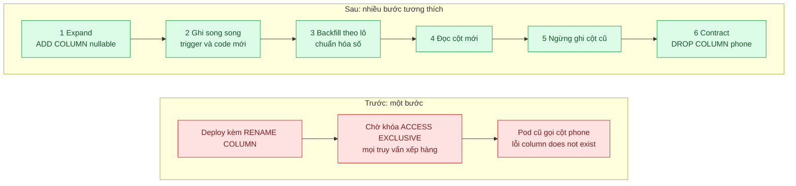
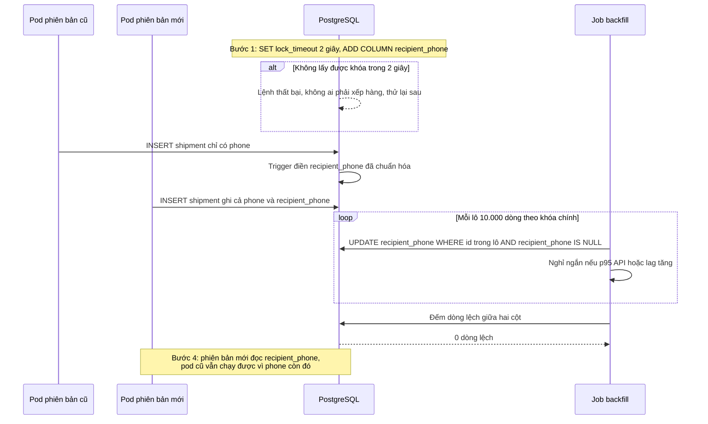

# Expand/Contract (Parallel Change) — Đổi tên cột trên bảng 100 triệu dòng mà không dừng dịch vụ

| Scope | Mức độ | Trạng thái | Pattern gốc | Cập nhật |
|---|---|---|---|---|
| 02 · backend / database | 🔴 Nâng cao | 📋 Kế hoạch | Parallel Change (Expand/Contract) — Danilo Sato, Fowler bliki (2014); Stripe "Online migrations at scale" (2017) | 2026-10-06 |

> **Một câu tóm tắt:** Thay vì một lệnh `ALTER` phá vỡ chạy cùng lúc với deploy, chia thay đổi thành nhiều bước nhỏ tương thích hai chiều: mở rộng (thêm cột mới), ghi song song, chép dữ liệu theo lô, chuyển đọc, ngừng ghi cột cũ, rồi mới thu hẹp (xóa cột cũ), để mọi phiên bản ứng dụng đang chạy luôn tìm thấy cột nó cần.

## 1. Bài toán thực tế (What)

**Bối cảnh** *(doanh nghiệp giả định, số liệu minh họa)*
Công ty logistics có bảng `shipments` khoảng 100 triệu dòng, nhận khoảng 1.500 lượt ghi mỗi giây giờ cao điểm. Cột `phone` chứa số điện thoại người nhận ở đủ định dạng (có dấu cách, có `+84`, có `0`). Đội muốn đổi thành `recipient_phone` đã chuẩn hóa để tích hợp tổng đài và SMS. API chạy 20 pod, deploy kiểu rolling update.

**Triệu chứng người kinh doanh nhìn thấy**
- Lần thử trước làm hệ thống tạo vận đơn đứng khoảng 4 phút giữa buổi sáng; shop không tạo được đơn, shipper không cập nhật được trạng thái.
- Ngay sau đó, khoảng 10 phút lỗi rải rác "column does not exist" trong lúc các pod đang lần lượt được thay.
- Từ đó mọi thay đổi schema phải làm lúc 2 giờ sáng, cần ba người thức trực, và vẫn bị dời liên tục.

**Nguyên nhân kỹ thuật**
`ALTER TABLE ... RENAME COLUMN` bản thân rất nhanh nhưng cần khóa `ACCESS EXCLUSIVE`. Khóa này phải chờ một transaction báo cáo đang chạy dài trên bảng; trong lúc chờ, mọi câu truy vấn mới tới bảng đó xếp hàng *sau* lệnh `ALTER`, nên cả hệ thống đứng. Khi rename xong, các pod cũ vẫn truy vấn `phone` cho tới khi bị thay hết: code và schema không tương thích trong suốt quá trình rolling update. Nếu đổi kiểu cột bằng `ALTER COLUMN TYPE`, PostgreSQL còn có thể ghi lại toàn bộ bảng trong khi giữ khóa.

**Ràng buộc**
- Không có cửa sổ bảo trì; tạo vận đơn phải chạy liên tục.
- Trong lúc rolling update, phiên bản cũ và mới của ứng dụng cùng chạy trên cùng schema.
- Chép dữ liệu 100 triệu dòng không được làm chậm đáng kể API.
- Mỗi bước phải lùi lại được nếu phát hiện lỗi.

## 2. Vì sao dùng pattern này (Why)

**Nguyên nhân gốc mà pattern nhắm vào:** một thay đổi phá vỡ được áp *nguyên khối* trong khi hệ thống có nhiều phiên bản code và nhiều transaction đang chạy cùng lúc.

**Pattern giải quyết thế nào:** Danilo Sato mô tả Parallel Change gồm ba pha: *expand* (thêm cái mới bên cạnh cái cũ), *migrate* (chuyển dần người dùng sang cái mới), *contract* (gỡ cái cũ khi không còn ai dùng). Stripe áp dụng đúng tinh thần đó cho dữ liệu với bốn bước: ghi song song vào cấu trúc cũ và mới, chuyển mọi đường đọc sang cấu trúc mới, chuyển mọi đường ghi chỉ sang cấu trúc mới, rồi xóa dữ liệu cũ. Ở mỗi thời điểm, schema tương thích với cả phiên bản code đang chạy và phiên bản sắp chạy. Mỗi lệnh DDL được chọn để giữ khóa ngắn nhất (thêm cột nullable không cần ghi lại bảng, tạo index `CONCURRENTLY`, thêm ràng buộc `NOT VALID` rồi `VALIDATE` riêng) và chạy với `lock_timeout` thấp để thà thất bại rồi thử lại còn hơn làm cả hệ thống xếp hàng.

**Lựa chọn khác đã cân nhắc**

| Lựa chọn | Giải quyết được gì | Vì sao không chọn (ở bài này) |
|---|---|---|
| Giữ nguyên + tối ưu nhỏ (rename lúc 2 giờ sáng, dừng job báo cáo trước) | Giảm khả năng chờ khóa | Vẫn lỗi trong lúc rolling update; phụ thuộc người thức đêm; không xử lý được chuẩn hóa dữ liệu |
| Bảo trì có dừng dịch vụ 30 phút | Đơn giản, một lần là xong | Không có cửa sổ dừng; doanh thu và shipper hoạt động 24/7 |
| Tạo bảng mới, chép toàn bộ, đổi tên bảng | Làm được cả thay đổi lớn | Phải đồng bộ ghi trong lúc chép; đổi tên bảng cũng cần khóa và phá phiên bản cũ |
| Giữ tên cũ mãi, thêm view có tên mới | Không chạm dữ liệu | Không chuẩn hóa được giá trị; nợ kỹ thuật vĩnh viễn |
| Expand/Contract nhiều bước, backfill theo lô, `lock_timeout` (chọn) | Không dừng, không lỗi khi rolling update, lùi được ở mỗi bước | Kéo dài nhiều lần phát hành; cần theo dõi tiến độ và kỷ luật dọn dẹp |

## 3. Thiết kế hệ thống (How)

### 3.1 Kiến trúc trước và sau



### 3.2 Luồng chính



### 3.3 Thành phần và trách nhiệm

| Thành phần | Trách nhiệm | Quyết định thiết kế đáng chú ý |
|---|---|---|
| Migration expand | Thêm cột nullable, không mặc định biến đổi | Chạy với `lock_timeout` thấp và cơ chế thử lại |
| Trigger đồng bộ | Điền cột mới khi code cũ ghi cột cũ | Gỡ bỏ ở bước ngừng ghi cột cũ; logic chuẩn hóa giống hệt code |
| Code ghi song song | Phiên bản mới ghi cả hai cột | Một cờ cấu hình để bật và tắt đọc cột mới mà không cần deploy |
| Job backfill | Chép và chuẩn hóa theo lô theo khoảng khóa chính | Idempotent, lưu tiến độ, tự giảm tốc theo p95 API |
| Kiểm tra lệch | Đếm dòng hai cột không khớp | Điều kiện bắt buộc trước khi chuyển đọc |
| Ràng buộc mới | `CHECK (recipient_phone IS NOT NULL) NOT VALID`, rồi `VALIDATE CONSTRAINT` | `VALIDATE` không chặn ghi như `SET NOT NULL` trực tiếp trên bảng lớn |
| Migration contract | Xóa cột cũ | Chỉ chạy khi số liệu cho thấy không còn phiên bản nào đọc cột cũ |

### 3.4 Điểm dễ sai khi triển khai
- **Không đặt `lock_timeout`.** Một lệnh DDL "nhanh" vẫn làm đứng cả hệ thống khi phải chờ khóa sau transaction dài. Luôn đặt và thử lại.
- **Backfill một câu `UPDATE` cho 100 triệu dòng.** Transaction khổng lồ, bloat, replica trễ, khóa dòng lâu. Chia lô theo khoảng khóa chính, commit từng lô.
- **Chuẩn hóa ở trigger khác với ở code.** Hai cách viết khác nhau cho ra hai giá trị; dùng chung một hàm hoặc kiểm tra lệch trước khi chuyển đọc.
- **Gộp nhiều bước vào một lần phát hành.** Mất khả năng lùi lại; mỗi bước một lần phát hành, có điều kiện đi tiếp rõ ràng.
- **Quên bước contract.** Cột cũ và trigger nằm lại mãi; ghi vào backlog với ngày cụ thể ngay khi bắt đầu.

## 4. Tech stack và tác động (Impact techstack)

| Lớp | Công nghệ chọn | Vì sao chọn | Thay thế tương đương |
|---|---|---|---|
| Database | PostgreSQL 16: `lock_timeout`, `ADD COLUMN` không ghi lại bảng, `CREATE INDEX CONCURRENTLY`, `NOT VALID` / `VALIDATE CONSTRAINT` | Mỗi bước DDL có biến thể giữ khóa ngắn | MySQL 8 với công cụ online schema change |
| Migration | Kysely Migrator, mỗi bước một file | Migration bằng TypeScript cùng repo, chạy tuần tự có kiểm soát | node-pg-migrate, Flyway |
| Job backfill | Worker Node.js, TypeScript strict | Đọc metric để tự giảm tốc, lưu tiến độ trong bảng | Script SQL lặp bằng `DO` block |
| API | NestJS 10, cờ cấu hình cho đường đọc | Đổi đường đọc không cần deploy | Fastify |
| Mô phỏng rolling update | Docker Compose hai dịch vụ API phiên bản cũ và mới chạy song song | Tái hiện đúng tình huống hai phiên bản cùng schema | kind với Deployment rolling update (scope 16) |
| Đo | k6 chạy liên tục suốt quá trình, `pg_stat_activity`, `pg_locks` | Thấy truy vấn bị chặn và thời gian chờ khóa | Prometheus postgres exporter |

**Thay đổi so với hệ thống hiện tại:** quy trình đổi schema thành chuỗi phát hành nhỏ có điều kiện đi tiếp; thêm trigger tạm, job backfill, cờ cấu hình và kiểm tra lệch. Đội học các biến thể DDL giữ khóa ngắn và thói quen đặt `lock_timeout`.

## 5. Kết quả đầu ra và cách đo (Output impact)

| Chỉ số | Trước (minh họa) | Mục tiêu khi thực hành | Cách đo |
|---|---|---|---|
| Thời gian hệ thống đứng do chờ khóa | 4 phút | 0; chờ khóa lâu nhất ≤ 2 giây | k6 ghi liên tục, đếm request vượt 2 giây; `pg_stat_activity` wait_event Lock |
| Lỗi do phiên bản code và schema lệch nhau | 10 phút lỗi rải rác | 0 | Log lỗi của hai dịch vụ API chạy song song suốt quá trình |
| Tác động của backfill lên p95 API ghi | không đo | tăng ≤ 15 % | k6 so sánh p95 trước và trong khi backfill |
| Dòng lệch giữa hai cột trước khi chuyển đọc | không kiểm tra | 0 | Truy vấn đếm lệch |

> Số "trước" là minh họa để hình dung bài toán. Số "mục tiêu" chỉ được coi là đạt khi có số đo thật
> ở mục 8 kèm môi trường đo.

**Tác động nghiệp vụ mong đợi:** đổi schema giữa giờ làm việc mà shop và shipper không nhận ra, không cần người thức đêm, và đội dám sửa những thiết kế dữ liệu sai thay vì sống chung với chúng.

## 6. Đánh đổi và khi KHÔNG nên dùng

**Đánh đổi**
- Một thay đổi kéo dài nhiều lần phát hành, có thể vài tuần; cần người theo tới bước cuối.
- Thời gian ghi song song tốn thêm dung lượng và thêm một chút tải ghi.
- Trigger tạm và cờ cấu hình là độ phức tạp tạm thời phải nhớ gỡ.

**Không nên dùng khi**
- Bảng nhỏ (vài nghìn dòng) và hệ thống chấp nhận dừng vài giây: một migration thường là đủ.
- Ứng dụng có cửa sổ bảo trì thật và chỉ chạy một phiên bản tại một thời điểm.
- Thay đổi chỉ là thêm cột mới nullable: đã tương thích sẵn, chỉ cần đặt `lock_timeout`.

**Liên quan**
- Đọc trước: `../01-n-plus-1-trang-50-don-ban-151-cau-sql/` — `CREATE INDEX CONCURRENTLY` và đọc kế hoạch truy vấn.
- Cùng tư duy: `../../01-frontend-backend-transporter/07-api-versioning-app-cu-van-phai-chay/` — tương thích hai chiều ở tầng API.
- Cùng chủ đề: `../../16-backend-k8s/01-probes-rolling-update-deploy-moi-nhan-traffic-khi-chua-san-sang/` — rolling update là lý do hai phiên bản cùng chạy.

## 7. Cơ sở tham khảo

- Danilo Sato, "ParallelChange", Martin Fowler bliki, 2014 — https://martinfowler.com/bliki/ParallelChange.html — ba pha expand, migrate, contract cho thay đổi giao diện phá vỡ.
- Stripe, "Online migrations at scale", 2017 — https://stripe.com/blog/online-migrations — bốn bước ghi song song, chuyển đọc, chuyển ghi, xóa dữ liệu cũ; kinh nghiệm backfill ở quy mô lớn.
- PostgreSQL docs, "ALTER TABLE" — https://www.postgresql.org/docs/current/sql-altertable.html — mức khóa của từng biến thể, `ADD COLUMN`, `NOT VALID` và `VALIDATE CONSTRAINT`.
- PostgreSQL docs, "Explicit Locking" và tham số `lock_timeout` — https://www.postgresql.org/docs/current/explicit-locking.html — vì sao lệnh chờ khóa làm các truy vấn sau xếp hàng.

## 8. Kế hoạch thực hành

- [ ] Bước 1: seed `shipments` 20 triệu dòng với `phone` nhiều định dạng; hai dịch vụ API phiên bản cũ và mới; k6 ghi liên tục; một transaction báo cáo dài giả lập.
- [ ] Bước 2: đo "trước": chạy `RENAME COLUMN` trong lúc k6 ghi và transaction dài đang mở; ghi thời gian đứng và lỗi của dịch vụ phiên bản cũ.
- [ ] Bước 3: viết chuỗi migration expand, trigger đồng bộ, job backfill tự giảm tốc, kiểm tra lệch, ràng buộc `NOT VALID`, cờ đọc, migration contract.
- [ ] Bước 4: chạy lại toàn bộ chuỗi dưới tải; ghi số thật và môi trường vào mục 5.
- [ ] Bước 5: viết test: (a) dịch vụ phiên bản cũ và mới cùng chạy không lỗi ở mọi bước; (b) backfill chạy lại lần hai không đổi dữ liệu; (c) migration expand gặp khóa thì thất bại trong 2 giây chứ không chặn truy vấn khác; (d) không còn dòng lệch trước khi bật cờ đọc.

**Cấu trúc code dự kiến**
```text
db/migrations/
  020-expand-add-recipient-phone.ts        # [PATTERN] bước expand, lock_timeout
  021-sync-trigger.ts
  022-check-not-valid.ts
  023-validate-constraint.ts
  030-contract-drop-phone.ts
src/
  jobs/backfill-recipient-phone.ts         # theo lô, tự giảm tốc, lưu tiến độ
  shared/normalize-phone.ts
  shipments/shipment.repository.ts         # đọc theo cờ cấu hình
test/
  old-and-new-versions-coexist.test.ts
  backfill-is-idempotent.test.ts
  ddl-fails-fast-on-lock.test.ts
bench/writes-during-migration.k6.js
docker-compose.yml
```

**Cách chạy** *(điền khi bắt đầu code)*
```bash
docker compose up -d
pnpm install && pnpm test
```
