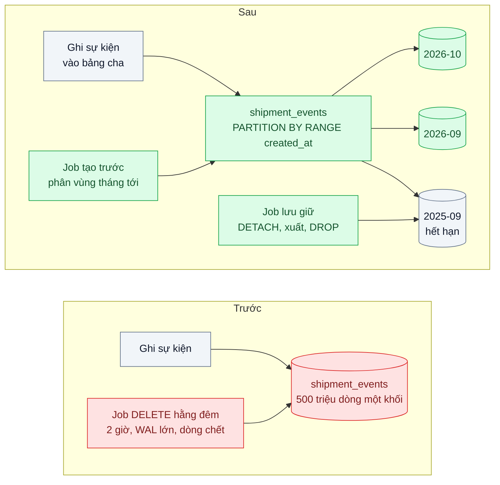
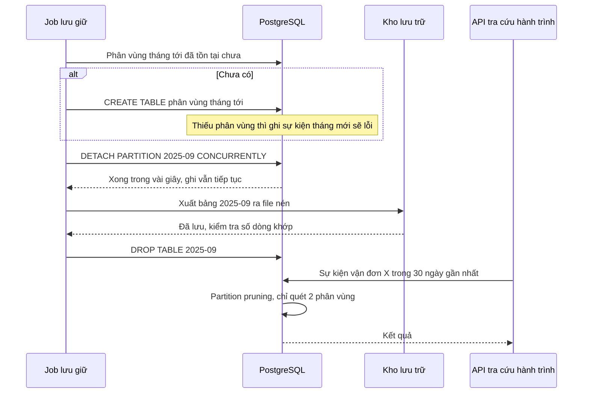

# Table Partitioning & Sharding — Bảng sự kiện 500 triệu dòng, xóa dữ liệu cũ mất 2 giờ

| Scope | Mức độ | Trạng thái | Pattern gốc | Cập nhật |
|---|---|---|---|---|
| 02 · backend / database | 🔴 Nâng cao | 📋 Kế hoạch | Table Partitioning — PostgreSQL docs; Partitioning/Sharding — DDIA ch.6 | 2026-10-06 |

> **Một câu tóm tắt:** Chia bảng sự kiện thành các phân vùng theo tháng để xóa dữ liệu hết hạn bằng cách tách và bỏ cả một phân vùng trong vài giây thay vì `DELETE` hàng chục triệu dòng, và để truy vấn theo khoảng thời gian chỉ chạm các phân vùng liên quan; sharding sang nhiều máy là bước sau, chỉ khi một máy không còn chứa nổi.

## 1. Bài toán thực tế (What)

**Bối cảnh** *(doanh nghiệp giả định, số liệu minh họa)*
Công ty logistics ghi mọi sự kiện hành trình (nhận hàng, nhập kho, xuất kho, giao thành công, giao thất bại) vào bảng `shipment_events`: khoảng 1,3 triệu dòng mỗi ngày, tổng khoảng 500 triệu dòng, chiếm phần lớn dung lượng database. Chính sách lưu giữ là 13 tháng. API "Tra cứu hành trình" của khách và shop đọc sự kiện của một vận đơn trong vài tuần gần nhất.

**Triệu chứng người kinh doanh nhìn thấy**
- Job xóa dữ liệu cũ chạy hằng đêm mất khoảng 2 giờ; nếu kéo dài sang 6 giờ sáng, tra cứu hành trình chậm hẳn đúng lúc shop mở cửa.
- Chi phí lưu trữ và sao lưu tăng đều mỗi quý dù lượng dữ liệu "sống" gần như không đổi.
- Replica báo cáo trễ hàng chục phút sau mỗi lần xóa, báo cáo buổi sáng hiển thị số liệu cũ.

**Nguyên nhân kỹ thuật**
`DELETE ... WHERE created_at < ...` trên khoảng 40 triệu dòng mỗi tháng: từng dòng được đánh dấu xóa, sinh lượng WAL rất lớn (replica phải phát lại), để lại dòng chết cho autovacuum dọn, làm index phình. Bảng và index khổng lồ nên truy vấn gần đây cũng phải duyệt cây index lớn hơn cần thiết, và mọi thao tác bảo trì (vacuum, reindex) kéo dài.

**Ràng buộc**
- Không dừng ghi sự kiện; ghi phải tiếp tục trong suốt quá trình chuyển đổi.
- Truy vấn hiện có (theo vận đơn và theo khoảng thời gian) phải tiếp tục chạy, càng ít sửa code càng tốt.
- Dữ liệu quá 13 tháng phải được lưu trữ ra kho rẻ trước khi xóa khỏi database.

## 2. Vì sao dùng pattern này (Why)

**Nguyên nhân gốc mà pattern nhắm vào:** dữ liệu có vòng đời theo thời gian nhưng được lưu trong một khối duy nhất, nên mọi thao tác theo thời gian (xóa, quét, bảo trì) đều phải chạm cả khối.

**Pattern giải quyết thế nào:** PostgreSQL hỗ trợ declarative partitioning: bảng cha `PARTITION BY RANGE (created_at)` và mỗi tháng một bảng con. Ghi vào bảng cha được định tuyến tự động; truy vấn có điều kiện trên `created_at` được *partition pruning* loại các phân vùng không liên quan. Xóa một tháng dữ liệu trở thành `DETACH PARTITION ... CONCURRENTLY` rồi xuất ra kho lưu trữ và `DROP TABLE`: thao tác trên siêu dữ liệu, gần như không sinh WAL, không để lại dòng chết. DDIA chương 6 đặt phân vùng trong bức tranh lớn hơn: chia theo khoảng khóa hay theo hash, điểm nóng, và khi đưa các phân vùng lên nhiều máy thì thành sharding, với chi phí định tuyến truy vấn và tái cân bằng. Bài này dừng ở phân vùng trên một máy vì dữ liệu sống vẫn vừa một máy.

**Lựa chọn khác đã cân nhắc**

| Lựa chọn | Giải quyết được gì | Vì sao không chọn (ở bài này) |
|---|---|---|
| Giữ nguyên + tối ưu nhỏ (xóa theo lô nhỏ cả ngày, tinh chỉnh autovacuum) | Giảm đỉnh tải của job xóa | Tổng WAL và dòng chết không đổi; bảng và index vẫn khổng lồ |
| Chuyển sự kiện cũ sang kho phân tích, chỉ giữ 3 tháng | Bảng nhỏ lại | Vẫn cần cơ chế xóa hiệu quả cho phần còn lại; tra cứu 13 tháng là yêu cầu nghiệp vụ |
| Sharding sang nhiều máy (Citus, Vitess) | Mở rộng cả ghi và dung lượng | Một máy vẫn đủ cho dữ liệu sống; thêm độ phức tạp vận hành và truy vấn xuyên shard |
| Phân vùng theo hash `shipment_id` | Phân bố đều | Không giúp xóa theo thời gian, vốn là vấn đề chính |
| Phân vùng theo tháng + tách và bỏ phân vùng hết hạn (chọn) | Xóa trong vài giây, truy vấn theo thời gian nhỏ lại, bảo trì theo từng phần | Khóa chính phải chứa cột phân vùng; truy vấn thiếu điều kiện thời gian quét mọi phân vùng |

## 3. Thiết kế hệ thống (How)

### 3.1 Kiến trúc trước và sau



### 3.2 Luồng chính



### 3.3 Thành phần và trách nhiệm

| Thành phần | Trách nhiệm | Quyết định thiết kế đáng chú ý |
|---|---|---|
| Bảng cha phân vùng | Định tuyến ghi, là điểm truy vấn duy nhất | Khóa chính `(id, created_at)` vì ràng buộc duy nhất phải chứa cột phân vùng |
| Phân vùng theo tháng | Chứa dữ liệu một tháng, có index riêng | Khoảng 13–14 phân vùng hoạt động; không chia quá nhỏ để tránh tốn chi phí lập kế hoạch |
| Job tạo trước phân vùng | Luôn có sẵn phân vùng cho 2–3 tháng tới | Cảnh báo nếu phân vùng tháng tới chưa có trước ngày 20 |
| Job lưu giữ | Tách, xuất ra kho, kiểm tra, xóa | Chỉ xóa khi số dòng trong file khớp với phân vùng |
| Chuyển đổi bảng cũ | Đưa 500 triệu dòng hiện có vào cấu trúc mới | Gắn bảng cũ thành một phân vùng lớn sau khi có ràng buộc `CHECK` khớp khoảng, tránh quét lại; các tháng mới vào phân vùng mới |

### 3.4 Điểm dễ sai khi triển khai
- **Truy vấn không có điều kiện thời gian.** Không có `created_at` trong `WHERE` thì quét mọi phân vùng; rà lại các truy vấn và thêm khoảng thời gian hợp lý.
- **Quên tạo phân vùng tương lai.** Đầu tháng mới, ghi sự kiện lỗi vì không có phân vùng nhận; tạo trước nhiều tháng và giám sát.
- **Chia quá mịn** (theo ngày cho 13 tháng là hơn 390 phân vùng) làm thời gian lập kế hoạch tăng; chọn độ mịn theo chính sách lưu giữ.
- **`DETACH` không có `CONCURRENTLY`** cần khóa mạnh trên bảng cha và chặn truy vấn; dùng biến thể concurrent (có từ PostgreSQL 14), lưu ý không chạy được trong transaction block.
- **Coi phân vùng là sharding.** Mọi phân vùng vẫn trên một máy, chung CPU và đĩa; nếu giới hạn là tải ghi của một máy, phân vùng không giải quyết.

## 4. Tech stack và tác động (Impact techstack)

| Lớp | Công nghệ chọn | Vì sao chọn | Thay thế tương đương |
|---|---|---|---|
| Database | PostgreSQL 16 declarative partitioning, `DETACH ... CONCURRENTLY`, partition pruning | Có sẵn, truy vấn hiện có gần như không phải sửa | TimescaleDB hypertable (cần xác minh tính năng); MySQL partitioning |
| Quản lý phân vùng | Job Node.js tự viết tạo trước và lưu giữ | Ít phụ thuộc, logic rõ ràng để học | Extension `pg_partman` (cần xác minh phiên bản hỗ trợ) |
| Kho lưu trữ | MinIO (S3 API) local, file nén | Mô phỏng kho rẻ của cloud | AWS S3, GCS |
| Sharding (hướng mở) | Citus cho PostgreSQL | Mở rộng ra nhiều máy mà vẫn dùng SQL PostgreSQL | Vitess cho MySQL (vitess.io/docs), sharding ở tầng ứng dụng (scope 18) |
| Đo | `EXPLAIN (ANALYZE)`, `pg_current_wal_lsn()`, k6 | Thấy pruning, đo lượng WAL sinh ra khi xóa | Prometheus postgres exporter |

**Thay đổi so với hệ thống hiện tại:** bảng sự kiện thành bảng phân vùng, khóa chính thêm cột thời gian, thêm hai job (tạo trước, lưu giữ) và kho lưu trữ; một số truy vấn được bổ sung điều kiện thời gian. Đội vận hành học giám sát phân vùng và quy trình khôi phục một tháng từ kho lưu trữ.

## 5. Kết quả đầu ra và cách đo (Output impact)

| Chỉ số | Trước (minh họa) | Mục tiêu khi thực hành | Cách đo |
|---|---|---|---|
| Thời gian loại bỏ một tháng dữ liệu | 2 giờ | ≤ 10 giây (không tính thời gian xuất file) | Log job lưu giữ trên seed 12 tháng, mỗi tháng 10 triệu dòng |
| WAL sinh ra khi loại bỏ một tháng | vài chục GB | dưới 1 % so với `DELETE` | Hiệu `pg_current_wal_lsn()` trước và sau |
| Replica lag trong lúc loại bỏ | hàng chục phút | ≤ 5 giây | `replay_lag` trong `pg_stat_replication` |
| p95 tra cứu hành trình 30 ngày | 400 ms | ≤ 50 ms | k6 trên seed; `EXPLAIN` xác nhận chỉ quét 2 phân vùng |
| p95 ghi sự kiện trong lúc chạy job lưu giữ | tăng mạnh | không tăng quá 10 % | k6 ghi liên tục khi job chạy |

> Số "trước" là minh họa để hình dung bài toán. Số "mục tiêu" chỉ được coi là đạt khi có số đo thật
> ở mục 8 kèm môi trường đo.

**Tác động nghiệp vụ mong đợi:** tra cứu hành trình nhanh và ổn định cả buổi sáng, báo cáo không còn trễ sau đêm xóa dữ liệu, và chi phí lưu trữ bám theo dữ liệu sống thay vì tăng mãi.

## 6. Đánh đổi và khi KHÔNG nên dùng

**Đánh đổi**
- Khóa chính và ràng buộc duy nhất phải chứa cột phân vùng; không ép được duy nhất toàn cục chỉ theo `id`.
- Thêm job phải chạy đúng hạn; lỗi job tạo trước là lỗi ghi toàn hệ thống.
- Truy vấn không mang điều kiện thời gian chậm hơn trước vì phải chạm mọi phân vùng.

**Không nên dùng khi**
- Bảng vài triệu dòng, xóa ít: index tốt và autovacuum mặc định là đủ.
- Không có cột tự nhiên để phân vùng mà truy vấn và vòng đời dữ liệu cùng dựa vào.
- Giới hạn thật là tải ghi hoặc dung lượng vượt một máy: cần sharding hoặc kiến trúc khác, phân vùng chỉ là bước đệm.

**Liên quan**
- Đọc trước: `../08-expand-contract-doi-ten-cot-100-trieu-dong/` — chuyển đổi cấu trúc bảng lớn không dừng dịch vụ.
- Đọc sau: `../../18-backend-scale/06-sharding-consistent-hashing-mot-db-khong-chua-noi-du-lieu/` — khi một máy không còn đủ.
- Cùng chủ đề: `../../15-backend-storage/06-lifecycle-tiering-chi-phi-luu-tru-tang-gap-3/` — đưa dữ liệu cũ xuống kho rẻ hơn.

## 7. Cơ sở tham khảo

- PostgreSQL docs, "Table Partitioning" — https://www.postgresql.org/docs/current/ddl-partitioning.html — declarative partitioning, partition pruning, quy tắc ràng buộc duy nhất, gắn và tách phân vùng, gợi ý về số lượng phân vùng.
- PostgreSQL docs, "ALTER TABLE" (`ATTACH PARTITION`, `DETACH PARTITION ... CONCURRENTLY`) — https://www.postgresql.org/docs/current/sql-altertable.html — mức khóa khi gắn và tách, dùng ràng buộc `CHECK` để tránh quét khi gắn.
- Martin Kleppmann, *Designing Data-Intensive Applications*, O'Reilly, 2017, chương 6 — phân vùng theo khoảng khóa và theo hash, điểm nóng, định tuyến truy vấn, tái cân bằng.
- Citus docs — https://docs.citusdata.com/ (cần xác minh URL) — hướng mở sharding PostgreSQL ra nhiều máy.

## 8. Kế hoạch thực hành

- [ ] Bước 1: seed `shipment_events` không phân vùng 120 triệu dòng trải 12 tháng; Docker Compose có primary, replica và MinIO; API tra cứu hành trình.
- [ ] Bước 2: đo "trước": `DELETE` một tháng, ghi thời gian, WAL, replica lag, p95 tra cứu và ghi bằng k6.
- [ ] Bước 3: tạo bảng phân vùng, gắn bảng cũ bằng ràng buộc `CHECK` khớp khoảng, job tạo trước phân vùng, job lưu giữ tách, xuất, kiểm tra, xóa.
- [ ] Bước 4: đo "sau" cùng kịch bản; ghi số thật và môi trường vào mục 5.
- [ ] Bước 5: viết test: (a) ghi sự kiện của tháng mới đi vào đúng phân vùng; (b) truy vấn 30 ngày chỉ quét các phân vùng liên quan; (c) job lưu giữ không xóa khi số dòng file xuất không khớp; (d) thiếu phân vùng tháng tới thì cảnh báo được phát.

**Cấu trúc code dự kiến**
```text
db/migrations/
  040-create-partitioned-events.sql       # [PATTERN] PARTITION BY RANGE created_at
  041-attach-legacy-as-partition.sql
src/
  jobs/create-future-partitions.ts
  jobs/retention-detach-archive-drop.ts   # [PATTERN] tách, xuất, kiểm tra, xóa
  tracking/shipment-events.repository.ts
test/
  events-routed-to-partition.test.ts
  partition-pruning.test.ts
  retention-requires-matching-archive.test.ts
bench/tracking-and-writes.k6.js
docker-compose.yml                         # primary, replica, minio
```

**Cách chạy** *(điền khi bắt đầu code)*
```bash
docker compose up -d
pnpm install && pnpm test
```
