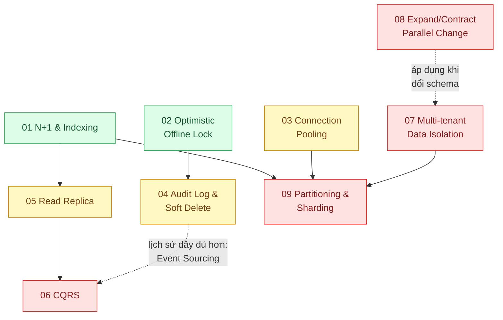

# 02 · Cơ sở dữ liệu quan hệ (`backend / database`)

> **Phạm vi:** Thiết kế và vận hành PostgreSQL (áp dụng được cho MySQL) trong ứng dụng web: truy vấn,
> index, khóa, kết nối, lịch sử dữ liệu, tách đọc/ghi, đa tenant, đổi schema, phân mảnh. Không gồm
> vector (scope 12), search engine (scope 05), cache (scope 03).
>
> **Câu hỏi trung tâm:** Làm sao DB vẫn đúng và vẫn nhanh khi dữ liệu, người dùng và yêu cầu nghiệp vụ
> cùng lớn lên?

## Bản đồ pattern trong scope

## Danh sách bài toán

| # | Bài toán (pattern — triệu chứng) | Mức | Pattern gốc / nguồn | Trạng thái |
|---|---|---|---|---|
| 01 | [N+1 Query & Indexing — Trang danh sách 50 đơn hàng bắn 151 câu SQL](./01-n-plus-1-trang-50-don-ban-151-cau-sql/) | 🟢 | Rails Guides "Active Record Querying" (N+1); PostgreSQL docs "Using EXPLAIN"; Use The Index, Luke | ✅ |
| 02 | [Optimistic Offline Lock — Hai nhân viên cùng sửa một đơn, người lưu sau ghi đè người lưu trước](./02-optimistic-lock-hai-nhan-vien-cung-sua-mot-don/) | 🟢 | Fowler, *PoEAA* (2002): Optimistic Offline Lock, Pessimistic Offline Lock; PostgreSQL docs "Explicit Locking" | ✅ |
| 03 | [Connection Pooling — 200 pod × 20 kết nối làm PostgreSQL cạn max_connections](./03-connection-pool-200-pod-dap-postgres/) | 🟡 | PgBouncer docs; PostgreSQL wiki "Number Of Database Connections" |✅ |
| 04 | [Audit Log & Soft Delete — Kiểm toán hỏi "ai đổi giá hợp đồng lúc nào", DB chỉ còn giá mới](./04-audit-log-ai-doi-gia-hop-dong-luc-nao/) | 🟡 | Fowler, "Audit Log" (eaaDev); Fowler, "Temporal Patterns"; PostgreSQL docs (trigger, JSONB) | 📋 |
| 05 | [Read Replica — Báo cáo cuối tháng làm chậm việc tạo đơn](./05-read-replica-bao-cao-cuoi-thang-lam-cham-tao-don/) | 🟡 | PostgreSQL docs "High Availability, Load Balancing, and Replication"; Fowler, "Reporting Database"; DDIA ch.5 (replication lag) | 📋 |
| 06 | [CQRS — Màn hình tổng hợp phải join 9 bảng, mô hình ghi và đọc ngày càng khác nhau](./06-cqrs-man-hinh-tong-hop-join-9-bang/) | 🔴 | Fowler bliki "CQRS" (2011); Greg Young, "CQRS Documents" (2010); Azure "CQRS", "Materialized View"; Fowler "Event Sourcing" (hướng mở) | 📋 |
| 07 | [Multi-tenant Data Isolation — SaaS bán cho 300 công ty: chung bảng, chung DB hay riêng DB?](./07-multi-tenant-saas-300-cong-ty-chung-mot-db/) | 🔴 | Microsoft Learn "Multitenant SaaS database tenancy patterns"; Azure "Architect multitenant solutions"; PostgreSQL docs "Row Security Policies" | 📋 |
| 08 | [Expand/Contract (Parallel Change) — Đổi tên cột trên bảng 100 triệu dòng mà không dừng dịch vụ](./08-expand-contract-doi-ten-cot-100-trieu-dong/) | 🔴 | Fowler bliki "ParallelChange" (Danilo Sato, 2014); Stripe, "Online migrations at scale" (2017); PostgreSQL docs (ALTER TABLE, lock) | 📋 |
| 09 | [Table Partitioning & Sharding — Bảng sự kiện 500 triệu dòng, xóa dữ liệu cũ mất 2 giờ](./09-partitioning-bang-su-kien-500-trieu-dong/) | 🔴 | PostgreSQL docs "Table Partitioning"; DDIA ch.6 "Partitioning"; Citus / Vitess docs (sharding) | 📋 |

## Lộ trình đề xuất trong scope

1. **N+1 & index** — kỹ năng đọc `EXPLAIN` dùng cho mọi bài sau.
2. **Optimistic lock** — hiểu transaction isolation qua một lỗi rất đời thường.
3. **Connection pool** — bài "hạ tầng" đầu tiên; cần trước khi scale ngang (scope 18).
4. **Audit log** — mở rộng mô hình dữ liệu theo thời gian; nền cho CQRS/Event Sourcing.
5. **Read replica → CQRS** — cùng ý "tách đọc khỏi ghi", một ở mức hạ tầng, một ở mức mô hình.
6. **Multi-tenant → Expand/Contract → Partitioning** — ba bài về thay đổi cấu trúc dữ liệu khi lớn.

## Kiến thức nền cần có trước

- SQL: JOIN, index B-tree, `EXPLAIN (ANALYZE, BUFFERS)`.
- Transaction và isolation level (Read Committed là mặc định của PostgreSQL).
- Khái niệm replication (đồng bộ/bất đồng bộ) để hiểu replica lag.

## Liên kết với scope khác

- `01-frontend-backend-transporter` bài 02 (cursor pagination) dùng index từ bài 01 ở đây.
- `03-backend-cache` — cache là lựa chọn so sánh với read replica (bài 05).
- `14-backend-queueing` bài 03 (Transactional Outbox) dựa trên transaction của DB.
- `18-backend-scale` bài 06 (Sharding) tiếp nối bài 09.
- `12-backend-database-vector` — pgvector chạy trong cùng PostgreSQL.

## Nguồn tổng quan cho scope

- Martin Kleppmann, *Designing Data-Intensive Applications* (2017), phần I–II.
- PostgreSQL Documentation — https://www.postgresql.org/docs/
- Markus Winand, *Use The Index, Luke* — https://use-the-index-luke.com/
