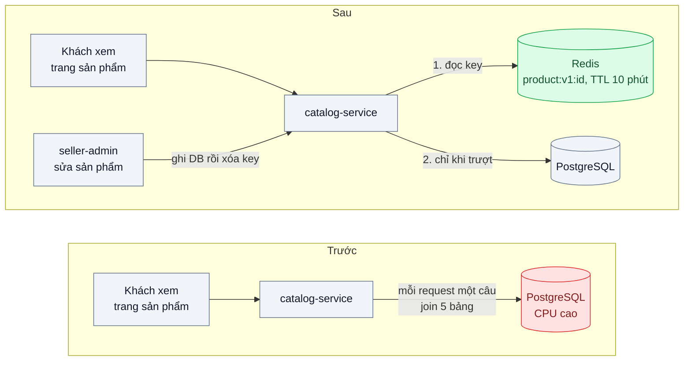
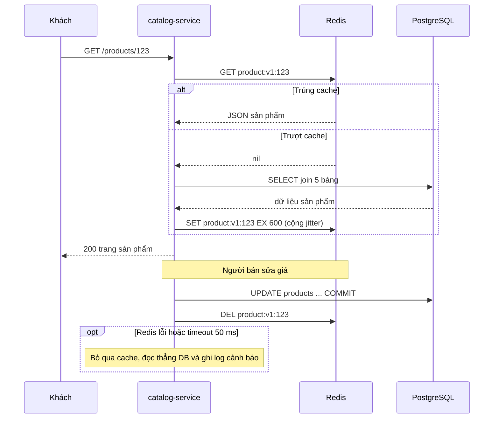

# Cache-Aside — Trang sản phẩm được đọc 10.000 lần/phút nhưng chỉ đổi 2 lần/ngày

| Scope | Mức độ | Trạng thái | Pattern gốc | Cập nhật |
|---|---|---|---|---|
| 03 · backend / cache | 🟢 Cơ bản | 📋 Kế hoạch | Cache-Aside — Azure Architecture Center; AWS whitepaper "Database Caching Strategies Using Redis" | 2026-10-06 |

> **Một câu tóm tắt:** Ứng dụng tự đọc Redis trước, trượt thì đọc PostgreSQL rồi ghi lại vào Redis kèm TTL, và xóa key khi sản phẩm đổi — để 10.000 lượt đọc/phút không còn biến thành 10.000 câu SQL join 5 bảng.

## 1. Bài toán thực tế (What)

**Bối cảnh** *(doanh nghiệp giả định, số liệu minh họa)*
Sàn thương mại điện tử tầm trung, khoảng 200.000 sản phẩm. Trang chi tiết sản phẩm do `catalog-service` (NestJS) trả về, mỗi lần dựng phải join 5 bảng: sản phẩm, biến thể, giá, ảnh, điểm đánh giá của shop. Câu truy vấn đã có index đầy đủ nhưng vẫn mất khoảng 40–80 ms. Nhóm 500 sản phẩm bán chạy chiếm phần lớn lượt xem; mỗi sản phẩm chỉ đổi thông tin khoảng 2 lần/ngày.

**Triệu chứng người kinh doanh nhìn thấy**
- Giờ cao điểm buổi tối, trang sản phẩm mở chậm 1–2 giây; tỷ lệ khách thoát ngay ở trang sản phẩm tăng rõ so với buổi sáng.
- Mỗi chiến dịch quảng cáo lớn, đội kỹ thuật phải xin tăng cấu hình máy chủ database — chi phí hạ tầng tăng theo lượt xem chứ không theo doanh thu.
- Khi database bận vì trang sản phẩm, các thao tác quan trọng hơn như tạo đơn, thanh toán cũng chậm theo.

**Nguyên nhân kỹ thuật**
Mỗi request đọc đều chạy lại cùng một truy vấn cho cùng một dữ liệu gần như không đổi. Ở 10.000 lượt đọc/phút cho nhóm sản phẩm nóng, database làm cùng một việc hàng nghìn lần, tiêu CPU và kết nối của pool. Tỷ lệ đọc/ghi rất lớn (hàng nghìn lần đọc cho một lần ghi) nhưng hệ thống không tận dụng điều đó.

**Ràng buộc**
- Giá và tồn kho hiển thị được phép trễ tối đa vài giây sau khi người bán sửa; riêng bước đặt hàng luôn đọc lại database.
- Redis có thể hỏng hoặc khởi động lại; trang sản phẩm phải chạy tiếp (chậm hơn), không được lỗi.
- Không đổi schema PostgreSQL và không đổi hợp đồng API của trang sản phẩm.

## 2. Vì sao dùng pattern này (Why)

**Nguyên nhân gốc mà pattern nhắm vào:** dữ liệu đọc nhiều, ghi ít, nhưng mọi lần đọc đều đi tới nguồn dữ liệu đắt nhất.

**Pattern giải quyết thế nào:** Azure Architecture Center mô tả Cache-Aside là cách ứng dụng *tự quản lý* cache khi kho cache không tự nạp dữ liệu: đọc thì hỏi cache trước; trúng (cache hit) thì trả ngay; trượt (cache miss) thì đọc database, ghi kết quả vào cache rồi trả. Khi dữ liệu đổi, ứng dụng ghi database rồi *xóa* mục tương ứng trong cache để lần đọc sau nạp lại bản mới. Cache chỉ chứa thứ thực sự được đọc (AWS whitepaper gọi là *lazy loading*), TTL là lưới an toàn khi việc xóa bị bỏ sót. Với 500 sản phẩm nóng, mỗi sản phẩm chỉ phải truy vấn database một lần cho mỗi chu kỳ TTL thay vì hàng nghìn lần.

**Lựa chọn khác đã cân nhắc**

| Lựa chọn | Giải quyết được gì | Vì sao không chọn (ở bài này) |
|---|---|---|
| Giữ nguyên + tối ưu nhỏ (thêm index, rút gọn cột, tăng cấu hình DB) | Giảm vài chục phần trăm thời gian truy vấn | Đã làm ở `02-backend-database` bài 01; số câu truy vấn vẫn tỷ lệ thuận với lượt xem |
| Read replica (`02-backend-database` bài 05) | Tách tải đọc khỏi primary | Vẫn chạy cùng truy vấn hàng nghìn lần; thêm máy DB đắt hơn thêm Redis; có replication lag |
| Cache trong tiến trình (LRU trong mỗi pod) | Nhanh nhất, không thêm hạ tầng | 20 pod giữ 20 bản sao, mỗi pod tự trượt; xóa key khi sản phẩm đổi phải phát tới mọi pod (bài 05) |
| HTTP cache / CDN (`04-frontend-cache` bài 01) | Chặn request từ trước khi tới server | Bổ trợ tốt, nhưng trang có phần cá nhân hóa (giỏ hàng, giá theo hạng thành viên) nên không cache được toàn trang |
| Read-through do thư viện cache tự nạp | Code gọn hơn | Logic nạp bị giấu trong thư viện; ở bài nền nên tự viết để thấy rõ từng bước |

## 3. Thiết kế hệ thống (How)

### 3.1 Kiến trúc trước và sau



### 3.2 Luồng chính



### 3.3 Thành phần và trách nhiệm

| Thành phần | Trách nhiệm | Quyết định thiết kế đáng chú ý |
|---|---|---|
| `ProductCache` | Đọc/ghi/xóa key sản phẩm trên Redis | Key có tiền tố phiên bản `product:v1:` để đổi cấu trúc JSON khi deploy không đọc nhầm dữ liệu cũ |
| `ProductRepository` | Truy vấn PostgreSQL | Không biết gì về cache; cache bọc bên ngoài để test riêng từng lớp |
| `ProductService.getById` | Thứ tự cache → DB → ghi cache | Đánh dấu `// [PATTERN]`; timeout Redis 50 ms, lỗi thì đọc DB (fail open) |
| `ProductService.update` | Ghi DB, sau khi commit thì xóa key | Xóa thay vì ghi đè giá trị mới, tránh hai request ghi cache sai thứ tự |
| TTL | Lưới an toàn khi lần xóa bị lỡ | 10 phút cộng jitter ngẫu nhiên 0–60 giây để các key không hết hạn cùng lúc |
| Negative cache | Ghi nhớ "không tồn tại" trong 30 giây | Chặn bot quét id không tồn tại xuyên thẳng xuống DB |

### 3.4 Điểm dễ sai khi triển khai
- **Ghi cache trước khi transaction commit.** Nếu transaction rollback, cache giữ dữ liệu chưa bao giờ tồn tại. Luôn xóa key *sau* commit.
- **Cập nhật cache thay vì xóa.** Hai request sửa cùng sản phẩm có thể ghi cache theo thứ tự ngược với thứ tự commit; xóa key an toàn hơn vì lần đọc sau luôn lấy bản mới nhất từ DB.
- **Không có TTL.** Key mồ côi tích tụ tới khi Redis đầy và bắt đầu evict theo `maxmemory-policy`; luôn đặt TTL và cấu hình chính sách evict rõ ràng.
- **Redis chết là ứng dụng chết.** Client mặc định có thể chờ kết nối lại rất lâu; cần timeout ngắn, giới hạn hàng đợi lệnh khi mất kết nối và đường lui đọc DB.
- **Cache dữ liệu cá nhân hóa trong key chung.** Giá theo hạng thành viên mà cache theo `product:id` sẽ lộ giá của người này cho người khác; tách phần chung và phần riêng.

## 4. Tech stack và tác động (Impact techstack)

| Lớp | Công nghệ chọn | Vì sao chọn | Thay thế tương đương |
|---|---|---|---|
| Ngôn ngữ, ứng dụng | TypeScript strict, NestJS trên Node 20+ | Trùng stack repo; interceptor/provider giúp bọc cache rõ ràng | Fastify |
| Database | PostgreSQL 16 | Nguồn sự thật; `pg_stat_statements` đếm được số lần gọi truy vấn | MySQL 8 |
| Cache | Redis 7 | `SET ... EX`, TTL, chính sách evict, `INFO stats` có sẵn số hit/miss | Valkey, Memcached (không có kiểu dữ liệu phong phú) |
| Redis client | `ioredis` | Hỗ trợ timeout lệnh, `enableOfflineQueue`, pipeline | `node-redis` |
| Đo tải | k6 | Kịch bản 10.000 request/phút phân phối lệch về 500 id nóng, có percentiles | autocannon |
| Quan sát | Prometheus + `prom-client` | Counter hit/miss phía ứng dụng, histogram độ trễ | OpenTelemetry metrics |
| Hạ tầng local | Docker Compose | Một lệnh dựng PostgreSQL, Redis, Prometheus | — |

**Thay đổi so với hệ thống hiện tại:** thêm Redis và một lớp `ProductCache`; mọi đường ghi sản phẩm phải gọi xóa key sau commit (bài 02 xử lý trường hợp đường ghi nằm ngoài service); đội vận hành phải theo dõi hit ratio, bộ nhớ Redis và hiểu rằng Redis lỗi chỉ làm chậm chứ không làm sập trang.

## 5. Kết quả đầu ra và cách đo (Output impact)

| Chỉ số | Trước (minh họa) | Mục tiêu khi thực hành | Cách đo |
|---|---|---|---|
| p95 độ trễ `GET /products/:id` | 120 ms | ≤ 15 ms khi trúng cache | k6 10.000 request/phút trong 10 phút, 80 % request vào 500 id nóng |
| Số câu truy vấn sản phẩm tới PostgreSQL mỗi phút | ≈ 10.000 | ≤ 5 % số request | Hiệu `calls` trong `pg_stat_statements` trước/sau lượt chạy k6 |
| Cache hit ratio | không có | ≥ 95 % sau khi cache ấm | `redis-cli INFO stats` (`keyspace_hits`, `keyspace_misses`) và counter `prom-client` |
| CPU container PostgreSQL | 70 % | ≤ 20 % cùng tải | `docker stats` lấy trung bình trong lượt chạy |
| Bộ nhớ Redis cho 200.000 sản phẩm | — | ghi nhận để chọn `maxmemory` | `redis-cli INFO memory` (`used_memory_human`) |
| Hành vi khi Redis dừng | — | 0 % lỗi 5xx, độ trễ quay về mức "trước" | `docker compose stop redis` giữa lượt k6, xem `checks` và p95 |

> Số "trước" là minh họa để hình dung bài toán. Số "mục tiêu" chỉ được coi là đạt khi có số đo thật
> ở mục 8 kèm môi trường đo.

**Tác động nghiệp vụ mong đợi:** trang sản phẩm nhanh đều trong giờ cao điểm mà không phải nâng cấp database theo mỗi chiến dịch; database dành sức cho tạo đơn và thanh toán.

## 6. Đánh đổi và khi KHÔNG nên dùng

**Đánh đổi**
- Dữ liệu có thể cũ trong khoảng thời gian giữa commit và lúc xóa key (hoặc tới hết TTL nếu lần xóa bị lỡ); phải thống nhất với nghiệp vụ mức "cũ" chấp nhận được.
- Thêm một thành phần hạ tầng phải vận hành, giám sát bộ nhớ và chính sách evict.
- Mọi đường ghi phải nhớ xóa key; bỏ sót một đường ghi là có dữ liệu cũ (bài 02).
- Lần đọc đầu tiên sau khi key hết hạn chậm hơn; với key cực nóng có thể gây stampede (bài 03).

**Không nên dùng khi**
- Dữ liệu ghi nhiều gần bằng đọc (bộ đếm, trạng thái thay đổi từng giây): cache liên tục bị xóa, hit ratio thấp, chỉ thêm độ trễ.
- Dữ liệu cần nhất quán tuyệt đối tại thời điểm đọc, như tồn kho ở bước trừ kho hay số dư khi chuyển tiền: đọc database.
- Mỗi người dùng đọc dữ liệu riêng của mình rất ít lần: key ít khi được đọc lại, tốn bộ nhớ vô ích.

**Liên quan**
- Đọc trước: [02-01 — N+1 Query & Indexing](../../02-backend-database/01-n-plus-1-trang-50-don-ban-151-cau-sql/) — tối ưu truy vấn trước khi cache.
- Đọc sau: [02 — Cache Invalidation](../02-ttl-va-invalidation-gia-doi-roi-khach-van-thay-gia-cu/), [03 — Cache Stampede Prevention](../03-cache-stampede-flash-sale-cache-het-han-db-sap/), [04 — Write-Through / Write-Behind](../04-write-through-write-behind-so-du-vi-can-moi-tuc-thi/).
- Cùng chủ đề: [02-05 — Read Replica](../../02-backend-database/05-read-replica-bao-cao-cuoi-thang-lam-cham-tao-don/); [04-01 — HTTP Caching](../../04-frontend-cache/01-http-cache-headers-anh-san-pham-tai-lai-moi-lan/) — tầng cache phía trước.

## 7. Cơ sở tham khảo

- Microsoft Azure Architecture Center, "Cache-Aside pattern" — https://learn.microsoft.com/azure/architecture/patterns/cache-aside — định nghĩa pattern, thứ tự đọc/ghi, các vấn đề cần cân nhắc: thời gian sống, evict, nhất quán, cache cục bộ.
- AWS whitepaper, *Database Caching Strategies Using Redis* — https://docs.aws.amazon.com/whitepapers/latest/database-caching-strategies-using-redis/ — so sánh lazy loading với write-through, vai trò của TTL.
- Amazon Builders' Library, "Caching challenges and strategies" — https://aws.amazon.com/builders-library/ — rủi ro khi hệ thống phụ thuộc vào cache và cách xử lý khi cache trống hoặc hỏng.
- Redis docs — https://redis.io/docs/ — lệnh `SET` với `EX`, `INFO`, cấu hình `maxmemory` và các chính sách evict.
- PostgreSQL docs, "pg_stat_statements" — https://www.postgresql.org/docs/16/pgstatstatements.html — đếm số lần gọi truy vấn để đo mức giảm tải.

## 8. Kế hoạch thực hành

- [ ] Bước 1: dựng `catalog-service` (NestJS) + PostgreSQL seed 200.000 sản phẩm qua Docker Compose; endpoint `GET /products/:id` join 5 bảng.
- [ ] Bước 2: đo "trước" bằng k6 (10.000 request/phút, 80 % vào 500 id nóng); ghi p95, `calls` trong `pg_stat_statements`, CPU PostgreSQL.
- [ ] Bước 3: thêm Redis và `ProductCache` theo Cache-Aside: TTL 10 phút + jitter, negative cache 30 giây, xóa key sau commit, timeout Redis 50 ms và fail open.
- [ ] Bước 4: đo "sau" cùng kịch bản, thêm lượt dừng Redis giữa chừng; ghi số thật và môi trường vào mục 5.
- [ ] Bước 5: test hành vi: (a) lần đọc thứ hai không chạm DB; (b) sau `update` lần đọc tiếp lấy giá mới; (c) Redis dừng thì vẫn trả 200; (d) id không tồn tại chỉ truy vấn DB một lần trong 30 giây.

**Cấu trúc code dự kiến**
```text
src/
  catalog/
    product.repository.ts        # truy vấn PostgreSQL join 5 bảng
    product.cache.ts             # [PATTERN] get/set/del trên Redis, key product:v1:<id>
    product.service.ts           # [PATTERN] cache → DB → ghi cache; update → DB → del
    product.controller.ts
  shared/
    redis.client.ts              # ioredis với timeout lệnh, tắt offline queue
test/
  cache-aside-second-read-skips-db.test.ts
  update-invalidates-cache.test.ts
  redis-down-falls-back-to-db.test.ts
bench/product-page.k6.js
docker-compose.yml               # postgres, redis, prometheus
```

**Cách chạy** *(điền khi bắt đầu code)*
```bash
docker compose up -d
pnpm install && pnpm test
```
