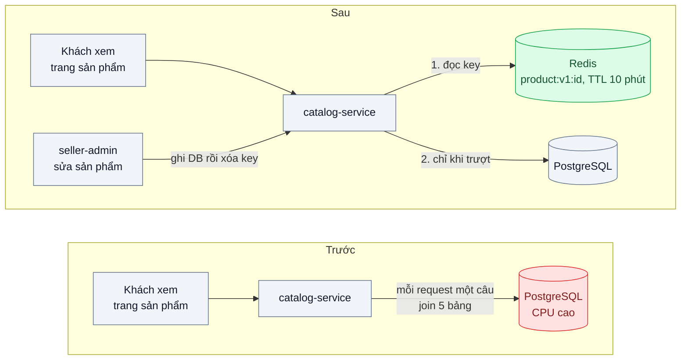
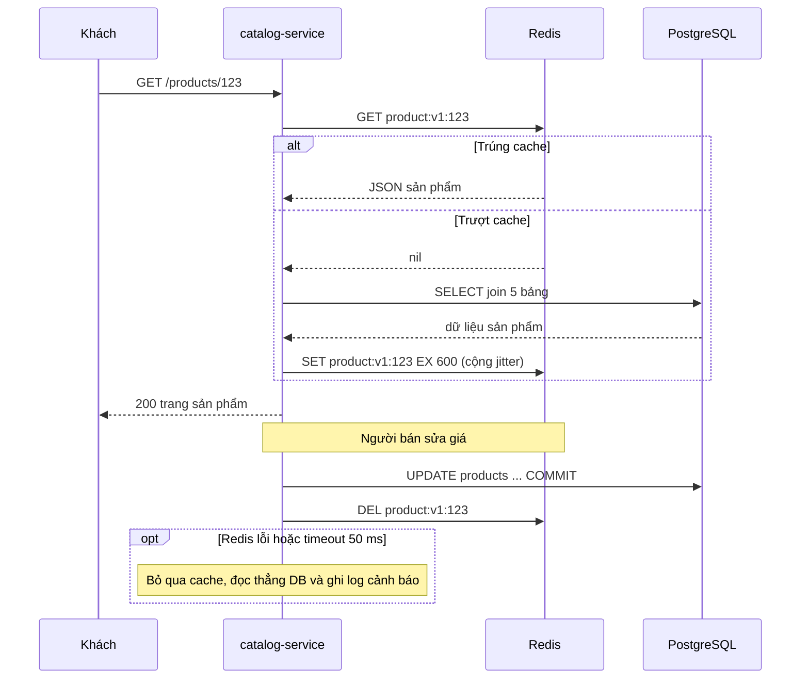

# Cache-Aside — Trang sản phẩm được đọc 10.000 lần/phút nhưng chỉ đổi 2 lần/ngày

| Scope | Mức độ | Trạng thái | Pattern gốc | Cập nhật |
|---|---|---|---|---|
| 03 · backend / cache | 🟢 Cơ bản | ✅ Hoàn thành | Cache-Aside — Azure Architecture Center; AWS whitepaper "Database Caching Strategies Using Redis" | 2026-10-07 |

> **Một câu tóm tắt:** Ứng dụng tự đọc Redis trước, trượt thì đọc PostgreSQL rồi ghi lại vào Redis kèm TTL, và xóa key khi sản phẩm đổi — để 10.000 lượt đọc/phút không còn biến thành 10.000 câu SQL join 5 bảng.

## 1. Bài toán thực tế (What)

**Bối cảnh** *(doanh nghiệp giả định, số liệu minh họa)*
Sàn thương mại điện tử tầm trung, khoảng 200.000 sản phẩm. Trang chi tiết sản phẩm do `catalog-service` (NestJS) trả về, mỗi lần dựng phải join 5 bảng: sản phẩm, biến thể, giá, ảnh, điểm đánh giá của shop. Câu truy vấn đã có index đầy đủ nhưng vẫn mất khoảng 40–80 ms. Nhóm 500 sản phẩm bán chạy chiếm phần lớn lượt xem; mỗi sản phẩm chỉ đổi thông tin khoảng 2 lần/ngày.

**Triệu chứng người kinh doanh nhìn thấy**
- Giờ cao điểm buổi tối, trang sản phẩm mở chậm 1–2 giây; tỷ lệ khách thoát ngay ở trang sản phẩm tăng rõ so với buổi sáng.
- Mỗi chiến dịch quảng cáo lớn, đội kỹ thuật phải xin tăng cấu hình máy chủ database — chi phí hạ tầng tăng theo lượt xem chứ không theo doanh thu.
- Khi database bận vì trang sản phẩm, các thao tác quan trọng hơn như tạo đơn, thanh toán cũng chậm theo.

**Nguyên nhân kỹ thuật**
Mỗi request đọc đều chạy lại cùng một truy vấn cho cùng một dữ liệu gần như không đổi. Ở 10.000 lượt đọc/phút cho nhóm sản phẩm nóng, database làm cùng một việc hàng nghìn lần, tiêu CPU và kết nối của pool. Tỷ lệ đọc/ghi rất lớn (hàng nghìn lần đọc cho một lần ghi) nhưng hệ thống không tận dụng điều đó.

**Ràng buộc**
- Giá và tồn kho hiển thị được phép trễ tối đa vài giây sau khi người bán sửa; riêng bước đặt hàng luôn đọc lại database.
- Redis có thể hỏng hoặc khởi động lại; trang sản phẩm phải chạy tiếp (chậm hơn), không được lỗi.
- Không đổi schema PostgreSQL và không đổi hợp đồng API của trang sản phẩm.

## 2. Vì sao dùng pattern này (Why)

**Nguyên nhân gốc mà pattern nhắm vào:** dữ liệu đọc nhiều, ghi ít, nhưng mọi lần đọc đều đi tới nguồn dữ liệu đắt nhất.

**Pattern giải quyết thế nào:** Azure Architecture Center mô tả Cache-Aside là cách ứng dụng *tự quản lý* cache khi kho cache không tự nạp dữ liệu: đọc thì hỏi cache trước; trúng (cache hit) thì trả ngay; trượt (cache miss) thì đọc database, ghi kết quả vào cache rồi trả. Khi dữ liệu đổi, ứng dụng ghi database rồi *xóa* mục tương ứng trong cache để lần đọc sau nạp lại bản mới. Cache chỉ chứa thứ thực sự được đọc (AWS whitepaper gọi là *lazy loading*), TTL là lưới an toàn khi việc xóa bị bỏ sót. Với 500 sản phẩm nóng, mỗi sản phẩm chỉ phải truy vấn database một lần cho mỗi chu kỳ TTL thay vì hàng nghìn lần.

**Lựa chọn khác đã cân nhắc**

| Lựa chọn | Giải quyết được gì | Vì sao không chọn (ở bài này) |
|---|---|---|
| Giữ nguyên + tối ưu nhỏ (thêm index, rút gọn cột, tăng cấu hình DB) | Giảm vài chục phần trăm thời gian truy vấn | Đã làm ở `02-backend-database` bài 01; số câu truy vấn vẫn tỷ lệ thuận với lượt xem |
| Read replica (`02-backend-database` bài 05) | Tách tải đọc khỏi primary | Vẫn chạy cùng truy vấn hàng nghìn lần; thêm máy DB đắt hơn thêm Redis; có replication lag |
| Cache trong tiến trình (LRU trong mỗi pod) | Nhanh nhất, không thêm hạ tầng | 20 pod giữ 20 bản sao, mỗi pod tự trượt; xóa key khi sản phẩm đổi phải phát tới mọi pod (bài 05) |
| HTTP cache / CDN (`04-frontend-cache` bài 01) | Chặn request từ trước khi tới server | Bổ trợ tốt, nhưng trang có phần cá nhân hóa (giỏ hàng, giá theo hạng thành viên) nên không cache được toàn trang |
| Read-through do thư viện cache tự nạp | Code gọn hơn | Logic nạp bị giấu trong thư viện; ở bài nền nên tự viết để thấy rõ từng bước |

## 3. Thiết kế hệ thống (How)

### 3.1 Kiến trúc trước và sau



### 3.2 Luồng chính



### 3.3 Thành phần và trách nhiệm

| Thành phần | Trách nhiệm | Quyết định thiết kế đáng chú ý |
|---|---|---|
| `ProductCache` | Đọc/ghi/xóa key sản phẩm trên Redis | Key có tiền tố phiên bản `product:v1:` để đổi cấu trúc JSON khi deploy không đọc nhầm dữ liệu cũ |
| `ProductRepository` | Truy vấn PostgreSQL | Không biết gì về cache; cache bọc bên ngoài để test riêng từng lớp |
| `ProductService.getById` | Thứ tự cache → DB → ghi cache | Đánh dấu `// [PATTERN]`; timeout Redis 50 ms, lỗi thì đọc DB (fail open) |
| `ProductService.updatePrice` | Ghi DB, sau khi commit thì xóa key | Xóa thay vì ghi đè giá trị mới, tránh hai request ghi cache sai thứ tự |
| `createRedis` (ioredis) | Kết nối Redis cho cache | `commandTimeout` 50 ms, tắt offline queue, không gửi lại lệnh khi rớt kết nối, vẫn kết nối lại mỗi ≤ 1 giây |
| TTL | Lưới an toàn khi lần xóa bị lỡ | 10 phút cộng jitter ngẫu nhiên 0–60 giây để các key không hết hạn cùng lúc |
| Negative cache | Ghi nhớ "không tồn tại" trong 30 giây | Chặn bot quét id không tồn tại xuyên thẳng xuống DB |

### 3.4 Điểm dễ sai khi triển khai
- **Ghi cache trước khi transaction commit.** Nếu transaction rollback, cache giữ dữ liệu chưa bao giờ tồn tại. Luôn xóa key *sau* commit.
- **Cập nhật cache thay vì xóa.** Hai request sửa cùng sản phẩm có thể ghi cache theo thứ tự ngược với thứ tự commit; xóa key an toàn hơn vì lần đọc sau luôn lấy bản mới nhất từ DB.
- **Không có TTL.** Key mồ côi tích tụ tới khi Redis đầy và bắt đầu evict theo `maxmemory-policy`; luôn đặt TTL và cấu hình chính sách evict rõ ràng.
- **Redis chết là ứng dụng chết.** Client mặc định có thể chờ kết nối lại rất lâu; cần timeout ngắn, giới hạn hàng đợi lệnh khi mất kết nối và đường lui đọc DB.
- **Cache dữ liệu cá nhân hóa trong key chung.** Giá theo hạng thành viên mà cache theo `product:id` sẽ lộ giá của người này cho người khác; tách phần chung và phần riêng.

**Gặp thật khi làm lab** (số ở mục 5.1):
- **Dùng nguyên cấu hình mặc định của ioredis.** Mặc định xếp lệnh vào hàng đợi khi mất kết nối, thử lại tới 20 lần với backoff tới 5 giây và không giới hạn thời gian chờ lệnh. Phép thử âm: Redis không kết nối được thì request quá 2 giây (client hủy); Redis treo 1,5 giây thì request chờ 1,56 giây. Lab đặt `commandTimeout: 50`, `enableOfflineQueue: false`, `maxRetriesPerRequest: 0` và vẫn kết nối lại mỗi ≤ 1 giây.
- **Image Redis mặc định không phải cấu hình cho cache.** `redis:7` chạy không file cấu hình có `save 3600 1 300 100 60 10000`, `maxmemory 0`, `maxmemory-policy noeviction` (đã kiểm bằng `CONFIG GET`): đầy bộ nhớ thì `SET` báo lỗi thay vì evict, còn lưu RDB làm lần khởi động lại có thể nạp bản cache cũ. Lab đặt `--save "" --appendonly no --maxmemory 1gb --maxmemory-policy allkeys-lru`.
- **Timeout ngắn đếm cả lúc ứng dụng khựng.** `commandTimeout` đo thời gian trong tiến trình Node chứ không phải thời gian Redis xử lý: event loop bị chặn từ 60 ms trở lên thì một nửa số lệnh GET tới Redis đang khỏe vẫn báo hết giờ. Dưới tải, mỗi lần máy khựng biến vài chục tới vài trăm request thành lượt bỏ qua cache và cùng đọc DB.
- **Redis vừa lỗi thì đừng ghi lại cache trong cùng request.** Lúc Redis treo, ghi lại nghĩa là chờ thêm một lần timeout; lab bỏ bước ghi nên mỗi request chỉ chờ một lần (p50 khoảng 54 ms lúc treo).
- **Log ngập khi Redis chết.** Ở 167 request/giây là 167 lỗi mỗi giây. Lab đếm mọi lỗi bằng counter `product_cache_errors_total` và chỉ in một dòng mỗi 5 giây kèm số lỗi bị gộp; lỗi xóa key (đường ghi) thì in mọi lần.
- **Đọc chen giữa lúc transaction sửa giá chưa commit.** Lượt đọc đó trượt cache, thấy giá cũ trong DB và nạp giá cũ vào cache. Xóa key sau commit thì bản cũ bị gỡ ngay; xóa trước khi ghi thì bản cũ nằm lại tới hết TTL (test và phép thử âm ở mục 5.1).

## 4. Tech stack và tác động (Impact techstack)

| Lớp | Công nghệ chọn | Vì sao chọn | Thay thế tương đương |
|---|---|---|---|
| Ngôn ngữ, ứng dụng | TypeScript strict, NestJS trên Node 20+ | Trùng stack repo; interceptor/provider giúp bọc cache rõ ràng | Fastify |
| Database | PostgreSQL 16 | Nguồn sự thật; `pg_stat_statements` đếm được số lần gọi truy vấn | MySQL 8 |
| Cache | Redis 7 | `SET ... EX`, TTL, chính sách evict, `INFO stats` có sẵn số hit/miss | Valkey, Memcached (không có kiểu dữ liệu phong phú) |
| Redis client | `ioredis` | Hỗ trợ timeout lệnh, `enableOfflineQueue`, pipeline | `node-redis` |
| Đo tải | k6 | Kịch bản 10.000 request/phút phân phối lệch về 500 id nóng, có percentiles | autocannon |
| Quan sát | Prometheus + `prom-client` | Counter hit/miss phía ứng dụng, histogram độ trễ | OpenTelemetry metrics |
| Hạ tầng local | Docker Compose | Một lệnh dựng PostgreSQL, Redis, Prometheus | — |

**Khi thực hành:** NestJS 10.4.22 (`@nestjs/platform-express`); một app chạy cả hai bản trên cùng PostgreSQL 16.15 và Redis 7.4.11: `GET /truoc/products/:id` đọc thẳng DB, `GET /sau/products/:id` theo Cache-Aside, cùng một `ProductRepository` (Kysely 0.29.6, một câu SQL join 5 bảng, biến thể và ảnh gom bằng `json_agg`). Cache bọc bằng provider (`ProductCache` gọi từ `ProductService`), không bằng interceptor: interceptor cache theo URL của response, còn bài cần key theo id sản phẩm để đường ghi xóa đúng key, cần negative cache và cần biết lúc nào Redis lỗi để đọc DB. Redis client là `ioredis` 6.0.0, bản chính mới nhất lúc làm; các tùy chọn bài dựa vào (`commandTimeout`, `enableOfflineQueue`, `maxRetriesPerRequest`, `retryStrategy`) đã kiểm trong `RedisOptions.d.ts` của bản này và có diễn tập âm ở mục 5.1. TypeScript 5.9.3 như các lab NestJS trước, mọi tham số constructor có `@Inject(...)` tường minh (nhật ký quyết định, bài 08/01). Không dựng container Prometheus: `prom-client` 15.1.3 xuất counter ở `GET /metrics`, script đo đọc thẳng endpoint này mỗi 10 giây; không có histogram phía app vì độ trễ đo từ k6. Bản sau trả thêm header `X-Cache` (`HIT`, `MISS`, `NEGATIVE-HIT`, `BYPASS`) để k6 tách độ trễ lượt trúng và trượt; body JSON giữ nguyên (test so body của hai bản). Redis chạy như cache thuần: `--save "" --appendonly no --maxmemory 1gb --maxmemory-policy allkeys-lru` (mặc định của image khác, xem mục 3.4). CPU container đọc từ bộ đếm `usage_usec` trong `cpu.stat` của cgroup (bộ đếm mà `docker stats` cũng dựa vào), cộng hiệu giữa các lần lấy mẫu khoảng 10 giây thay vì lấy trung bình các lần chụp `docker stats`.

**Thay đổi so với hệ thống hiện tại:** thêm Redis và một lớp `ProductCache`; mọi đường ghi sản phẩm phải gọi xóa key sau commit (bài 02 xử lý trường hợp đường ghi nằm ngoài service); đội vận hành phải theo dõi hit ratio, bộ nhớ Redis và hiểu rằng Redis lỗi chỉ làm chậm chứ không làm sập trang.

## 5. Kết quả đầu ra và cách đo (Output impact)

| Chỉ số | Trước (minh họa) | Mục tiêu khi thực hành | Cách đo |
|---|---|---|---|
| p95 độ trễ `GET /products/:id` | 120 ms | ≤ 15 ms khi trúng cache | k6 10.000 request/phút trong 10 phút, 80 % request vào 500 id nóng |
| Số câu truy vấn sản phẩm tới PostgreSQL mỗi phút | ≈ 10.000 | ≤ 5 % số request | Hiệu `calls` trong `pg_stat_statements` trước/sau lượt chạy k6 |
| Cache hit ratio | không có | ≥ 95 % sau khi cache ấm | `redis-cli INFO stats` (`keyspace_hits`, `keyspace_misses`) và counter `prom-client` |
| CPU container PostgreSQL | 70 % | ≤ 20 % cùng tải | `docker stats` lấy trung bình trong lượt chạy |
| Bộ nhớ Redis cho 200.000 sản phẩm | — | ghi nhận để chọn `maxmemory` | `redis-cli INFO memory` (`used_memory_human`) |
| Hành vi khi Redis dừng | — | 0 % lỗi 5xx, độ trễ quay về mức "trước" | `docker compose stop redis` giữa lượt k6, xem `checks` và p95 |

> Số "trước" là minh họa để hình dung bài toán. Số "mục tiêu" chỉ được coi là đạt khi có số đo thật
> ở mục 8 kèm môi trường đo.

### 5.1 Số đã đo

**Môi trường:** MacBook Apple M1 Pro (8 nhân, macOS 26.6.2 / Darwin 25.6.0); Docker 28.5.1, 8 CPU, khoảng 7,6 GB RAM; PostgreSQL 16.15 (`postgres:16`, `shared_buffers` 128 MB, bật `pg_stat_statements`); Redis 7.4.11 (`redis:7`, không lưu xuống đĩa, `maxmemory` 1 GB, `allkeys-lru`); Node v20.19.6, pnpm 10.32.0; NestJS 10.4.22, ioredis 6.0.0, Kysely 0.29.6, prom-client 15.1.3, Vitest 5.0.3; k6 v1.4.2. API là một tiến trình Node (`node --import tsx src/main.ts`, pool 10 kết nối) chạy trên host cùng k6, gọi PostgreSQL và Redis qua cổng của Docker Desktop. Máy chạy cùng lúc container của dự án khác (MySQL, RabbitMQ), Chrome và Spotlight (`mds`): load 1 phút của macOS trong các lượt dao động từ 2,5 đến 19,4, của máy ảo Docker từ 1,4 đến 2,9. Seed đúng quy mô mục 1: 200.000 sản phẩm, 500.000 biến thể, 800.001 ảnh, 2.000 shop (DB 314 MB, seed mất 18 – 20 giây). Số thô ở `bench/results/main/` (không commit); lượt chạy lại từ volume sạch ở `bench/results/recheck/`.

**Một vòng gọi từ host, tuần tự, không tải** (`round-trip.json`, 5.000 lần mỗi loại, trung vị / p95): Redis `GET` một sản phẩm đã cache (khoảng 1,1 KB) 0,20 / 0,35 ms; PostgreSQL `SELECT 1` 0,22 / 0,34 ms; câu trang sản phẩm join 5 bảng 0,77 / 1,79 ms với 500 id nóng, 0,95 / 3,10 ms với id ngẫu nhiên. Trong DB (`pg_stat_statements`), câu này tốn trung bình 0,26 ms ở lượt "trước" (80 % là id nóng, nằm sẵn trong buffer) và 0,50 ms ở lượt "sau" (câu còn tới DB phần lớn là id đuôi). Câu gốc ở lab rẻ hơn nhiều so với 40 – 80 ms của bối cảnh minh họa.

**Kịch bản chính** (`truoc.json`, `sau-cold.json`): k6 mô hình mở 10.000 request/phút (166,7 request/giây) trong 10 phút, 80 % vào 500 id nóng rải khắp bảng, 20 % rải đều trên 200.000 id; khởi động nóng 30 giây trên chính bản đo, bản sau xóa cache ngay trước lượt đo. Cả hai lượt: 0 phản hồi khác 200, `dropped_iterations` = 0. Câu DB đếm bằng hiệu `calls` của câu chạm `product_images`, lấy mẫu khoảng 10 giây một lần; CPU là hiệu `usage_usec` của cgroup chia thời gian lượt (100 % = một nhân).

| Chỉ số | Trước (đọc thẳng DB) | Sau (Cache-Aside, cache trống lúc bắt đầu) |
|---|---|---|
| Request | 100.002 | 100.001 |
| Câu trang sản phẩm tới PostgreSQL | 100.002 (9.988/phút, 100 % số request) | 19.570 (1.955/phút, 19,57 %) |
| … từ phút thứ 2 tới hết lượt | — | 16.999 (1.893/phút, 18,94 %) |
| Hit ratio (counter của app) | — | 80,43 % cả lượt; phút 1: 74,92 %; từ phút 2: 81,06 % (từng phút 80,18 – 82,49 %) |
| CPU container PostgreSQL | 24,1 % | 7,8 % |
| CPU container Redis / tiến trình API | 1,8 % / 18,6 % | 4,4 % / 18,4 % |
| Độ trễ p50 / p95 / p99 / lớn nhất | 3,12 / 9,03 / 61,12 / 1.001,6 ms | 2,35 / 8,99 / 12,42 / 108,2 ms |
| … chỉ lượt trúng (80.431) | — | 1,97 / 4,84 / 7,88 / 52,4 ms |
| … chỉ lượt trượt (19.568) | — | 5,78 / 12,01 / 16,03 / 108,2 ms |
| Lượt `BYPASS` (Redis quá 50 ms, đọc DB) | — | 2 |
| Bộ nhớ Redis cuối lượt | — | 25,7 MB cho 19.568 key |
| Load 1 phút của macOS (thấp nhất – cao nhất) | 5,2 – 18,6 | 2,5 – 8,6 |

Redis tự đếm 80.432 hit / 19.569 miss, lệch 1 so với app: một lệnh GET đã trúng ở Redis nhưng app hết 50 ms trước khi đọc được trả lời. Hit ratio đo được khớp với tính tay từ phân phối của k6: 500 lần trượt đầu của id nóng, cộng khoảng 19.030 id đuôi khác nhau trong 20.000 lượt rải trên 200.000 id, cho hit ratio khoảng 80,5 %. Độ trễ đuôi của lượt "trước" (p99 61 ms, lớn nhất 1 giây) rơi vào lúc load macOS lên 18,6, nên không dùng để so; so độ trễ ở bảng 5 vòng dưới đây.

**Độ trễ ở trạng thái ổn định** (`latency-rounds.json`): 5 vòng, mỗi vòng một lượt 60 giây mỗi bản, thứ tự đảo giữa các vòng, khởi động nóng 20 giây; bản sau xóa cache trước khởi động nóng nên lúc đo 500 id nóng đã nằm trong cache, phần đuôi vẫn trượt như thật. Số là trung vị của 5 vòng, trong ngoặc là thấp nhất – cao nhất; 0 lượt bỏ, 0 phản hồi khác 200.

| Bản | p50 | p95 | p99 | Câu DB / request | CPU PostgreSQL |
|---|---|---|---|---|---|
| Trước | 3,14 ms (3,07 – 3,22) | 7,38 ms (7,19 – 8,54) | 15,63 ms (12,33 – 20,23) | 100 % | 21,8 % (21,0 – 23,6) |
| Sau | 2,12 ms (2,00 – 2,19) | 9,41 ms (8,02 – 11,13) | 20,34 ms (11,73 – 37,75) | 20,02 % (19,34 – 20,65) | 8,3 % (6,8 – 9,5) |
| Sau, chỉ lượt trúng | — | 5,21 ms (4,29 – 7,18) | — | — | — |
| Sau, chỉ lượt trượt | — | 13,36 ms (10,97 – 16,71) | — | — | — |

Chênh lệch (sau − trước) theo từng vòng: p50 −1,04 / −0,88 / −1,14 / −1,02 / −1,06 ms; p95 +1,20 / +2,59 / +2,03 / +0,83 / +0,80 ms; p99 +7,30 / +17,52 / +20,39 / −0,60 / −3,52 ms. p50 giảm khoảng 1 ms ở cả 5 vòng, lớn hơn nhiều so với dao động giữa các vòng của bản trước (0,15 ms). p95 của bản sau cao hơn ở cả 5 vòng: khoảng 20 % request trượt phải đi Redis `GET`, câu DB rồi Redis `SET`, chậm hơn một lần đọc thẳng DB, và p95 rơi vào nhóm này. p99 lệch cả hai chiều; ba vòng có p99 cao nhất của bản sau cũng là ba vòng có lượt `BYPASS` (34, 20, 11; hai vòng còn lại 0), nên chưa tách riêng được phần nào do pattern, phần nào do các lần khựng của máy.

**Toàn bộ catalog trong cache** (`redis-memory.json`; lần lặp ở `full-2/`): gọi `GET /sau/products/:id` cho cả 200.000 id (32 request song song) mất 54,3 giây và nạp 199.922 key (78 lượt `BYPASS` không được nạp). `used_memory` từ 1,02 MB lên 251,36 MB, tức tăng 250,3 MiB, khoảng 1.313 byte mỗi key; mẫu 1.999 key: JSON trung bình 1.081 byte, `MEMORY USAGE` 1.270 byte; `mem_fragmentation_ratio` 1,06, `used_memory_rss` khoảng 267 MiB; 0 key bị evict. Lần lặp: 250,4 MiB cho 199.992 key (8 lượt `BYPASS`). Chạy tiếp 3 phút cùng tải khi cache đã đủ: lượt `full-2/sau-full.json` (0 lượt bỏ, load macOS 4,2 – 7,5) có Redis 30.001 hit / 0 miss, 16 câu DB (0,05 % request, đều là lượt `BYPASS` trong một lần khựng ở phút đầu), CPU PostgreSQL 2,7 %, p50 / p95 / p99 1,95 / 5,15 / 12,08 ms. Lượt đầu (`sau-full.json`) rơi vào lúc load macOS 8,2 – 16,2: 321 lượt `BYPASS` (trung vị 2,1 giây, lớn nhất 2,6 giây) và k6 bỏ 115 lượt, nên chỉ dùng số đếm: Redis 29.885 hit / 1 miss, 322 câu DB (1,08 % request).

**Redis dừng và treo giữa lượt** (`redis-outage-2.json`): 5 pha × 60 giây ở 166,7 request/giây, cache trống lúc bắt đầu, script tự chạy lệnh docker ở đầu mỗi pha. Độ trễ của mỗi pha bỏ 3 giây đầu (lúc lệnh docker đang chạy); số câu DB và hit ratio lấy theo phút của k6, lệch pha khoảng 1,7 giây và theo mẫu 10 giây, nên mỗi phút lẫn vài giây của pha kề. 0 phản hồi khác 200 trên 50.334 request, 0 lượt bỏ.

| Pha | Lệnh (thời gian lệnh chạy) | Câu DB | Hit ratio | p50 / p95 / p99 |
|---|---|---|---|---|
| Bình thường | — | 2.491/phút | 74,94 % (cache trống lúc đầu) | 2,09 / 9,38 / 26,20 ms |
| Redis dừng | `docker compose stop redis` (542 ms) | 9.940/phút | 0,69 % | 3,35 / 7,67 / 27,46 ms |
| Bật lại | `docker compose start redis` (333 ms) | 2.377/phút | 76,17 % (Redis trống, nạp lại) | 2,21 / 8,94 / 16,93 ms |
| Redis treo | `docker compose pause redis` (177 ms) | 9.237/phút | 7,58 % | 53,61 / 61,33 / 102,10 ms |
| Hết treo | `docker compose unpause redis` (118 ms) | 2.067/phút | 79,17 % | 2,10 / 8,02 / 13,59 ms |

App ghi "Redis đã kết nối lại" khoảng 1 giây sau lệnh `start`. Lượt đầu (`redis-outage.json`, 50.289 request, 0 phản hồi khác 200) cho cùng hình ảnh ở bốn pha đầu (lúc dừng p95 7,96 ms; lúc treo p50 54,09, p95 59,81 ms), nhưng pha "hết treo" trùng một lần load macOS lên 18 – 19: p95 303,9 ms, p99 644,8 ms, lớn nhất 2,2 giây, k6 bỏ 45 lượt. Lượt lặp không tái hiện, nên coi đó là nhiễu của máy chứ không phải hệ quả của lệnh `unpause`.

**Timeout 50 ms đếm cả lúc Node khựng** (`event-loop-stall.json`): gửi GET tới Redis đang khỏe rồi chặn event loop bằng vòng lặp bận, 20 lần mỗi mức. Chặn 0, 20, 40 ms: 0/20 lần báo hết giờ. Chặn 60, 100, 500 ms: 10/20 lần mỗi mức, xen kẽ lần có lần không, tùy event loop đang ở pha nào khi bị chặn.

**Test và phép thử âm** (`negative-drills.json`): 17 test tích hợp trong 4 file, chạy trên PostgreSQL và Redis thật, không cần seed. Mỗi phép thử âm sửa mã nguồn tạm thời, chạy file test tương ứng, khôi phục rồi so lại nội dung file; trước khi sửa và sau khi khôi phục đều xanh hết.

| Gỡ phần nào của pattern | Test đỏ | Test báo gì |
|---|---|---|
| Hỏi cache trước (service coi mọi lần đọc là trượt) | 2/5 | lần đọc thứ hai `MISS`; 100 lượt xem chạm DB 100 lần thay vì 1 |
| TTL (`SET` không kèm `EX`) | 1/5 | TTL = −1 |
| Xóa key sau khi sửa giá | 3/5 | đọc lại vẫn giá cũ; key còn; lượt đọc chen lúc chưa commit để lại giá cũ |
| Thứ tự: xóa key trước transaction | 2/5 | lượt đọc chen lúc chưa commit để lại giá cũ; sửa giá thất bại cũng xóa key |
| Negative cache | 1/3 | lần thứ hai với id không tồn tại vẫn `MISS`, chạm DB lại |
| Fail open (lỗi Redis ném ra controller) | 4/4 | 500 thay vì 200 |
| `commandTimeout` | 1/4 | Redis treo 1,5 giây thì request chờ 1.538 ms (test đòi < 500 ms) |
| Cấu hình mặc định của ioredis | 3/4 | Redis không kết nối được: request quá 2 giây; Redis treo: 1.557 ms |

**So với mục tiêu:**
- p95 khi trúng cache: 4,84 ms ở lượt 10 phút, 5,21 ms (4,29 – 7,18) ở 5 vòng. Đạt (≤ 15 ms). p95 của mọi request thì không giảm: 8,99 so với 9,03 ms ở lượt 10 phút, và cao hơn bản trước 0,8 – 2,6 ms ở cả 5 vòng vì lượt trượt đắt hơn lượt đọc thẳng DB; p50 giảm khoảng 1 ms. Con số "120 ms" của mục 1 không tái hiện được, vì câu join 5 bảng ở lab chỉ tốn 0,26 – 0,50 ms trong DB.
- Số câu tới PostgreSQL: từ 9.988 xuống 1.955 mỗi phút, bằng 19,57 % số request (18,94 % sau phút đầu). Không đạt mục tiêu ≤ 5 % với phân phối của kịch bản: 20 % lưu lượng rải trên 200.000 id, phần lớn id đuôi chỉ được xem một lần trong 10 phút, nên hit ratio bị chặn quanh 80,5 %. Khi cache chứa cả catalog, số câu còn 0,05 % request.
- Hit ratio: 80,43 % cả lượt, 81,06 % sau phút đầu. Không đạt ≥ 95 % với kịch bản này; phía Redis đạt 100 % (30.001/30.001) khi cache chứa cả catalog.
- CPU PostgreSQL: 24,1 % → 7,8 % (5 vòng: 21,8 → 8,3 %). Đạt ≤ 20 %. Bản trước ở lab cũng chỉ 24 %, không phải 70 % như số minh họa.
- Bộ nhớ Redis cho 200.000 sản phẩm: khoảng 250 MiB `used_memory` (1.313 byte mỗi key), 267 MiB RSS. Đã ghi nhận: `maxmemory` 1 GB của lab dư chỗ; chỉ giữ phần được đọc như kịch bản 10 phút thì 25,7 MB.
- Redis dừng: 0 phản hồi khác 200 trên 50.334 request; p95 lúc dừng 7,67 ms, nằm trong khoảng của bản trước (7,19 – 8,54 ms ở 5 vòng). Đạt. Redis treo: vẫn 0 lỗi, nhưng mỗi request chờ đủ 50 ms (p50 53,6 ms). Đạt "0 % lỗi 5xx", không đạt "độ trễ quay về mức trước" cho trường hợp treo.

**Chạy lại từ volume sạch** (`bench/results/recheck/`, theo "Cách chạy" ở mục 8, lượt ngắn hơn): `docker compose down -v`, xóa `node_modules`, `pnpm install --frozen-lockfile`, `pnpm db:up` (4 giây), `pnpm typecheck`, 17/17 test xanh, seed 18 giây. Lượt 3 phút: bản trước 9.935 câu DB/phút (100 % số request), CPU PostgreSQL 22,6 %; bản sau 2.114 câu/phút (21,22 %, vì phút khởi động lạnh chiếm một phần ba lượt), hit ratio 78,78 %, CPU PostgreSQL 8,2 %. Lượt 3 phút của bản trước gặp một lần khựng (k6 bỏ 61 lượt, lớn nhất 2,4 giây) nên không dùng số độ trễ của lượt đó. 2 vòng × 30 giây: p50 sau − trước −1,07 / −0,89 ms, p95 +0,28 / +1,18 ms, cùng chiều với lượt chính. Diễn tập Redis 5 pha × 30 giây: 0 phản hồi khác 200 trên 25.334 request; lúc dừng p95 8,89 ms, lúc treo p50 53,65 ms. Cả catalog: 250,4 MiB, 1.313 byte mỗi key; 60 giây với cache đầy: Redis 9.999 hit / 1 miss, 1 câu DB. Phép chặn event loop và 8 phép thử âm cho cùng kết quả như lượt chính.

**Hạn chế:** xem cuối README, mục "Bài học sau khi làm".

**Tác động nghiệp vụ mong đợi:** trang sản phẩm nhanh đều trong giờ cao điểm mà không phải nâng cấp database theo mỗi chiến dịch; database dành sức cho tạo đơn và thanh toán.

## 6. Đánh đổi và khi KHÔNG nên dùng

**Đánh đổi**
- Dữ liệu có thể cũ trong khoảng thời gian giữa commit và lúc xóa key (hoặc tới hết TTL nếu lần xóa bị lỡ); phải thống nhất với nghiệp vụ mức "cũ" chấp nhận được.
- Thêm một thành phần hạ tầng phải vận hành, giám sát bộ nhớ và chính sách evict.
- Mọi đường ghi phải nhớ xóa key; bỏ sót một đường ghi là có dữ liệu cũ (bài 02).
- Lần đọc đầu tiên sau khi key hết hạn chậm hơn; với key cực nóng có thể gây stampede (bài 03).

**Không nên dùng khi**
- Dữ liệu ghi nhiều gần bằng đọc (bộ đếm, trạng thái thay đổi từng giây): cache liên tục bị xóa, hit ratio thấp, chỉ thêm độ trễ.
- Dữ liệu cần nhất quán tuyệt đối tại thời điểm đọc, như tồn kho ở bước trừ kho hay số dư khi chuyển tiền: đọc database.
- Mỗi người dùng đọc dữ liệu riêng của mình rất ít lần: key ít khi được đọc lại, tốn bộ nhớ vô ích.

**Liên quan**
- Đọc trước: [02-01 — N+1 Query & Indexing](../../02-backend-database/01-n-plus-1-trang-50-don-ban-151-cau-sql/) — tối ưu truy vấn trước khi cache.
- Đọc sau: [02 — Cache Invalidation](../02-ttl-va-invalidation-gia-doi-roi-khach-van-thay-gia-cu/), [03 — Cache Stampede Prevention](../03-cache-stampede-flash-sale-cache-het-han-db-sap/), [04 — Write-Through / Write-Behind](../04-write-through-write-behind-so-du-vi-can-moi-tuc-thi/).
- Cùng chủ đề: [02-05 — Read Replica](../../02-backend-database/05-read-replica-bao-cao-cuoi-thang-lam-cham-tao-don/); [04-01 — HTTP Caching](../../04-frontend-cache/01-http-cache-headers-anh-san-pham-tai-lai-moi-lan/) — tầng cache phía trước.

## 7. Cơ sở tham khảo

- Microsoft Azure Architecture Center, "Cache-Aside pattern" — https://learn.microsoft.com/azure/architecture/patterns/cache-aside — định nghĩa pattern, thứ tự đọc/ghi, các vấn đề cần cân nhắc: thời gian sống, evict, nhất quán, cache cục bộ.
- AWS whitepaper, *Database Caching Strategies Using Redis* — https://docs.aws.amazon.com/whitepapers/latest/database-caching-strategies-using-redis/ — so sánh lazy loading với write-through, vai trò của TTL.
- Amazon Builders' Library, "Caching challenges and strategies" — https://aws.amazon.com/builders-library/ — rủi ro khi hệ thống phụ thuộc vào cache và cách xử lý khi cache trống hoặc hỏng.
- Redis docs — https://redis.io/docs/ — lệnh `SET` với `EX`, `INFO`, cấu hình `maxmemory` và các chính sách evict.
- PostgreSQL docs, "pg_stat_statements" — https://www.postgresql.org/docs/16/pgstatstatements.html — đếm số lần gọi truy vấn để đo mức giảm tải.

## 8. Kế hoạch thực hành

- [x] Bước 1: dựng app NestJS 10 + PostgreSQL 16 (bật `pg_stat_statements`) + Redis 7 bằng Docker Compose, seed 200.000 sản phẩm; `GET /truoc/products/:id` chạy một câu join 5 bảng cho mỗi request.
- [x] Bước 2: đo "trước" bằng k6 (10.000 request/phút trong 10 phút, 80 % vào 500 id nóng): p95, `calls` trong `pg_stat_statements`, CPU PostgreSQL; thêm 5 vòng 60 giây để so độ trễ.
- [x] Bước 3: thêm `ProductCache` và `ProductService` theo Cache-Aside (`GET /sau/products/:id`): TTL 10 phút + jitter 0–60 giây, negative cache 30 giây, xóa key sau commit, timeout Redis 50 ms và fail open.
- [x] Bước 4: đo "sau" cùng kịch bản với cache trống lúc bắt đầu, với cache chứa cả catalog, và diễn tập dừng rồi treo Redis giữa lượt k6 (hai lượt); số thật ở mục 5.1. Không dựng Prometheus (mục 4).
- [x] Bước 5: test hành vi: (a) lần đọc thứ hai không chạm DB; (b) sau khi sửa giá, lần đọc tiếp lấy giá mới, kể cả khi có lượt đọc chen lúc transaction chưa commit; (c) Redis không kết nối được, treo, hoặc rớt kết nối thì vẫn trả 200 và dùng lại cache khi có lại; (d) id không tồn tại chỉ truy vấn DB một lần trong 30 giây. Phép thử âm cho từng phần của pattern.

**Cấu trúc code**
```text
src/
  truoc/products.controller.ts    # GET/PATCH /truoc/products/:id: mỗi lượt xem một câu join 5 bảng
  sau/product.cache.ts            # [PATTERN] get/set/del, key product:v1:<id>, TTL + jitter, dấu "không tồn tại", fail open
  sau/product.service.ts          # [PATTERN] cache → DB → ghi cache; sửa giá: DB (commit) → xóa key
  sau/products.controller.ts      # GET/PATCH /sau/products/:id, cùng JSON với bản trước, thêm header X-Cache
  shared/product.repository.ts    # Kysely: câu join 5 bảng, sửa giá trong transaction; không biết gì về cache
  shared/redis.client.ts          # [PATTERN] ioredis: commandTimeout 50 ms, tắt offline queue, không gửi lại lệnh
  shared/metrics.ts, ops.controller.ts, config.ts, db.ts, …; app.module.ts, main.ts  # counter ở /metrics; một app hai bản, cổng 3100
test/
  second-read-skips-db.test.ts          # (a) + TTL 600–660 s + cùng JSON hai bản
  update-invalidates-cache.test.ts      # (b), có test giữ khóa dòng để đọc chen giữa transaction
  redis-down-falls-back-to-db.test.ts   # (c) cổng đóng, CLIENT PAUSE, CLIENT KILL
  negative-cache.test.ts                # (d)
  support/app.ts                        # dựng app trên DB/Redis thật, đếm câu SQL, tạo sản phẩm riêng cho từng test
bench/
  product-page.k6.js              # mô hình mở, 80 % vào 500 id nóng, độ trễ theo X-Cache và theo pha diễn tập
  run-load.ts                     # một lượt đo: bật API, lấy mẫu pg_stat_statements, Redis INFO, /metrics, CPU cgroup
  latency-rounds.ts, redis-memory.ts, round-trip.ts, event-loop-stall.ts, negative-drills.ts, lib.ts
db/init.sql, db/seed.sql          # schema 5 bảng + pg_stat_statements; seed tất định, chạy lại được
docker-compose.yml                # postgres:16 (55432), redis:7 (56379) cấu hình cache thuần
```

**Cách chạy**
```bash
cd 03-backend-cache/01-cache-aside-trang-san-pham-doc-10k-lan-phut
pnpm install
pnpm db:up                 # docker compose up -d --wait: PostgreSQL 16 ở 55432, Redis 7 ở 56379
pnpm typecheck
pnpm test                  # 17 test tích hợp trên DB và Redis thật, không cần seed
pnpm db:seed               # 200.000 sản phẩm, khoảng 20 giây (cần cho bench, không cần cho test)
pnpm dev                   # API ở http://127.0.0.1:3100: /truoc/products/:id, /sau/products/:id, /metrics
# Đo (API do script tự bật/tắt; kết quả ở bench/results/$RUN/, không commit). Đừng chạy hai lượt đo cùng lúc.
RUN=main pnpm bench:rtt && RUN=main pnpm bench:stall              # vòng gọi tuần tự; timeout khi event loop khựng
RUN=main NAME=truoc VARIANT=truoc pnpm bench:load                 # 30 s khởi động nóng + 10 phút
RUN=main NAME=sau-cold VARIANT=sau pnpm bench:load                # cache trống lúc bắt đầu
RUN=main NAME=redis-outage VARIANT=sau DRILL=redis-outage pnpm bench:load     # 5 pha × 60 s: tự stop/start/pause/unpause Redis
RUN=main pnpm bench:memory && RUN=main NAME=sau-full VARIANT=sau FLUSH=none WARMUP_S=0 DURATION_S=180 pnpm bench:load  # cả catalog
RUN=main ROUNDS=5 MEASURE_S=60 WARMUP_S=20 pnpm bench:rounds      # 5 vòng so độ trễ, thứ tự đảo
RUN=main pnpm bench:drills       # phép thử âm: sửa mã nguồn tạm thời rồi khôi phục; đừng sửa code khi đang chạy
pnpm db:reset                    # docker compose down -v
```

Biến của `bench:load`: `VARIANT` (`truoc`/`sau`), `DURATION_S`, `RATE` (request/phút), `WARMUP_S`, `FLUSH` (`after`: cache trống lúc đo; `before`: 500 id nóng đã có trong cache; `none`: giữ nguyên), `HOT_SHARE`, `DRILL=redis-outage`, `PHASE_S`. Nếu chỉ dùng `docker compose up -d` (không `--wait`) thì chờ hai container `healthy` rồi mới `pnpm test`. Dừng `pnpm dev` bằng Ctrl+C; chạy nền thì tắt bằng `pkill -f "src/main.ts"` (không chỉ `tsx src/main.ts`, vì tiến trình `node` con giữ cổng 3100) rồi kiểm `lsof -nP -iTCP:3100 -sTCP:LISTEN`.

## Bài học sau khi làm

- **Cache-Aside cắt tải đúng bằng phần lưu lượng lặp lại trong một chu kỳ TTL.** Hit ratio đo được (80,43 %) gần như trùng với con số tính tay từ phân phối truy cập (khoảng 80,5 %), và số câu tới DB giảm đúng phần đó: 9.988 xuống 1.955 mỗi phút, CPU PostgreSQL 24,1 % xuống 7,8 %. Mục tiêu ≥ 95 % hit và ≤ 5 % câu DB của kế hoạch không khớp với chính phân phối mà kế hoạch chọn (20 % lưu lượng rải trên 200.000 id). Muốn đạt thì đuôi phải lặp lại trong chu kỳ TTL, hoặc nạp sẵn: cả catalog tốn khoảng 250 MiB và đưa Redis lên 100 % hit. Nên tính hit ratio kỳ vọng từ phân phối truy cập trước khi hứa một con số.
- **Ở quy mô lab, cache mua tải DB chứ chưa mua độ trễ.** Qua cổng Docker, một vòng tới Redis (0,20 ms) và một vòng tới PostgreSQL (0,22 ms) gần như bằng nhau, còn câu join 5 bảng có index chỉ tốn 0,26 – 0,50 ms trong DB. Vì vậy lượt trúng nhanh hơn khoảng 1 ms ở p50, nhưng lượt trượt cộng thêm hai vòng Redis và làm p95 cao hơn bản trước 0,8 – 2,6 ms ở cả 5 vòng. Lợi ích về độ trễ chỉ lớn khi câu gốc đắt (40 – 80 ms như mục 1) hoặc khi DB đã bão hòa; lab chưa dựng tải tới mức đó.
- **Redis dừng khác Redis treo.** Dừng: lệnh lỗi ngay nhờ `enableOfflineQueue: false`, trang về đúng mức bản trước (p95 7,67 ms). Treo: mỗi request chờ đủ timeout, p50 lên 53,6 ms. Trong cả hai trường hợp DB nhận lại gần đủ 10.000 câu/phút, nên DB phải chịu được toàn bộ tải khi không có cache; nếu không, Redis hỏng sẽ kéo DB hỏng theo, đúng rủi ro mà Amazon Builders' Library cảnh báo. Lúc Redis treo kéo dài, muốn bỏ hẳn 50 ms mỗi request thì cần ngắt mạch (xem [07-03 — Circuit Breaker](../../07-backend-microservices/03-circuit-breaker-service-khuyen-mai-cham-lam-sap-checkout/)). Redis bật lại thì cache trống: phút sau đó hit ratio 76 %, giống lúc khởi động lạnh.
- **Timeout ngắn có giá.** `commandTimeout` đếm thời gian của tiến trình Node: event loop bị chặn từ 60 ms thì một nửa số GET tới Redis khỏe vẫn báo hết giờ. Dưới tải, mỗi lần máy khựng biến vài chục tới vài trăm request thành lượt `BYPASS` cùng lúc (321 lượt trong vài giây ở lượt cache đầy), tức một đợt dồn xuống DB đúng lúc hệ thống đang chậm. Cần theo dõi `product_cache_errors_total`, và chọn timeout dài hơn các lần khựng thường gặp của app.
- **Thứ tự "ghi DB rồi xóa key" kiểm được bằng test giữ khóa dòng.** Test khóa dòng `products` để transaction sửa giá dừng giữa chừng, rồi cho một lượt đọc chen vào: xóa key sau commit thì giá mới hiện ngay; chuyển lệnh xóa lên trước transaction thì giá cũ nằm lại tới hết TTL. Xóa sau commit vẫn còn một khe hẹp (lượt đọc chậm ghi bản cũ vào cache sau lệnh xóa); bài 03 bàn cách chặn bằng lease theo Nishtala et al. (2013).
- **Lỗi gặp khi làm:** kịch bản phép thử âm "ioredis mặc định" lần đầu sửa mã nguồn thành cú pháp sai, Vitest báo 0 test và script ghi "0/0 đỏ"; từ đó kiểm tổng số test trước khi tin kết quả. Test Redis treo lúc đầu kiểm header trước thời gian chờ, nên phép thử âm đỏ vì `MISS` thay vì vì chờ 1,5 giây; đã đổi thứ tự và thêm `.timeout(2_000)` phía client. Lượt k6 thử đầu tiên cấp sẵn 50 VU và bị bỏ 67 lượt khi máy khựng; nâng lên 300. Bộ đếm CPU của cgroup về 0 khi container Redis bật lại, nên CPU tính theo từng khoảng lấy mẫu và bỏ khoảng có hiệu âm. Hai lượt (`redis-outage.json`, `sau-full.json`) trùng lúc load macOS lên 16 – 19 và k6 bỏ lượt; đã chạy lại dưới tên khác, giữ nguyên file cũ.
- **Hạn chế của số đo:** chạy chung một laptop với Chrome, Spotlight và container của dự án khác (load 1 phút của macOS 2,5 – 19,4); API, k6 và script đo cùng chạy trên host, API qua `tsx`, gọi DB và Redis qua cổng Docker Desktop; mỗi kịch bản 10 phút chạy một lần mỗi bản, độ trễ so bằng 5 vòng × 60 giây; diễn tập Redis hai lượt; phân phối truy cập giả định (đuôi rải đều), hit ratio ngoài đời phụ thuộc vào phân phối thật; câu SQL của lab rẻ nên không thấy được phần độ trễ mà mục 1 mô tả; một tiến trình API, một nút Redis, không có nhiều pod hay Redis Cluster; counter đọc thẳng từ `/metrics`, không qua Prometheus. Lượt chạy lại từ volume sạch ngắn hơn lượt chính (3 phút mỗi bản, 2 vòng × 30 giây, diễn tập 30 giây mỗi pha).
