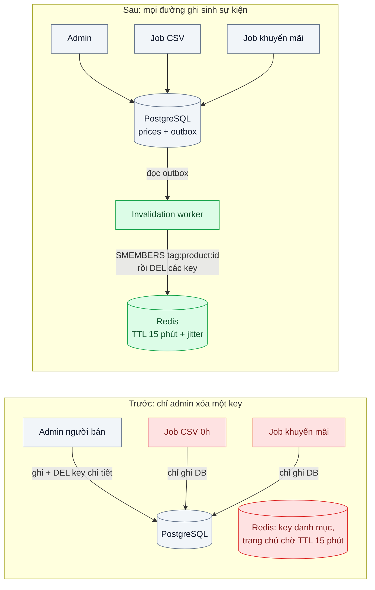
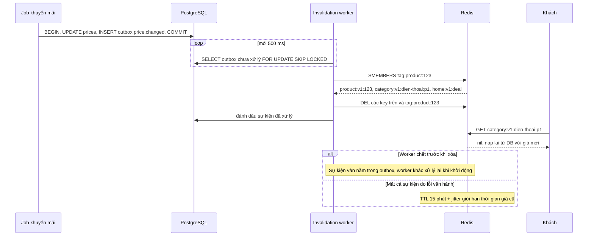

# Cache Invalidation (TTL + event-driven) — Đổi giá rồi mà khách vẫn thấy giá cũ 15 phút

| Scope | Mức độ | Trạng thái | Pattern gốc | Cập nhật |
|---|---|---|---|---|
| 03 · backend / cache | 🟢 Cơ bản | 📋 Kế hoạch | Cache Invalidation (TTL + event-driven) — AWS whitepaper "Database Caching Strategies Using Redis"; Amazon Builders' Library "Caching challenges and strategies" | 2026-10-06 |

> **Một câu tóm tắt:** Mọi đường ghi giá phát một sự kiện "giá đã đổi" đi cùng transaction, một worker nhận sự kiện và xóa *tất cả* key có chứa giá đó; TTL chỉ còn là lưới an toàn chứ không phải cơ chế làm mới chính.

## 1. Bài toán thực tế (What)

**Bối cảnh** *(doanh nghiệp giả định, số liệu minh họa)*
Sàn thương mại điện tử đã áp dụng Cache-Aside (bài 01) với TTL 15 phút. Giá của một sản phẩm xuất hiện ở ít nhất bốn loại key: chi tiết sản phẩm, trang danh mục, khối "deal hôm nay" ở trang chủ và gợi ý tìm kiếm. Giá được sửa từ ba đường: màn hình admin của người bán, job nhập giá hàng loạt từ file CSV lúc 0h và job bật giá khuyến mãi theo lịch.

**Triệu chứng người kinh doanh nhìn thấy**
- Flash sale bắt đầu lúc 20:00 nhưng tới 20:12 khách vẫn thấy giá gốc ở trang danh mục; quảng cáo đã chạy, khách vào thấy giá không khớp và rời đi.
- Ngược lại, hết khuyến mãi lúc 22:00 mà vẫn có khách đặt được đơn ở giá khuyến mãi; sàn phải bù phần chênh lệch cho người bán.
- Người bán sửa giá, mở trang sản phẩm thấy giá mới, nhưng trang danh mục vẫn giá cũ; họ gọi hỗ trợ báo "lỗi hệ thống".

**Nguyên nhân kỹ thuật**
Chỉ màn hình admin gọi lệnh xóa key chi tiết sản phẩm; job CSV và job khuyến mãi ghi thẳng vào PostgreSQL nên không xóa gì. Các key danh mục, trang chủ, tìm kiếm *chứa* giá của nhiều sản phẩm nhưng không ai biết key nào chứa sản phẩm nào, nên chỉ chờ TTL. Kết quả: thời gian giá cũ tồn tại phụ thuộc vào đường ghi và loại trang, có khi lên tới đủ 15 phút.

**Ràng buộc**
- Giá mới phải hiện ở mọi trang trong vòng 5 giây sau khi commit; bước đặt hàng luôn tính lại giá từ database.
- Không được hạ TTL của mọi key xuống vài giây — hit ratio sẽ sụp và database quay lại tình trạng trước bài 01.
- Job CSV do đội dữ liệu viết bằng SQL; có thể yêu cầu ghi thêm một bảng, không thể yêu cầu họ gọi Redis.

## 2. Vì sao dùng pattern này (Why)

**Nguyên nhân gốc mà pattern nhắm vào:** việc làm mới cache đang gắn với *một* đường ghi và *một* key, trong khi dữ liệu được ghi từ nhiều nơi và được nhân bản vào nhiều key.

**Pattern giải quyết thế nào:** tách thành hai cơ chế bổ trợ nhau. (1) **Event-driven invalidation:** mọi thay đổi giá đều sinh một sự kiện `price.changed` ghi trong *cùng transaction* với thay đổi (bảng outbox, xem `14-backend-queueing` bài 03), nên không đường ghi nào lọt được — kể cả job SQL chỉ cần chèn thêm một dòng. Worker đọc sự kiện và xóa mọi key phụ thuộc vào sản phẩm đó, nhờ một *chỉ mục ngược* `tag:product:<id>` (Redis Set) liệt kê các key trang có chứa sản phẩm. (2) **TTL:** AWS whitepaper và Amazon Builders' Library đều coi TTL là lưới an toàn bắt buộc: nếu sự kiện bị lỡ hoặc worker chết, dữ liệu cũ vẫn có hạn. Thêm jitter vào TTL để các key không hết hạn đồng loạt.

**Lựa chọn khác đã cân nhắc**

| Lựa chọn | Giải quyết được gì | Vì sao không chọn (ở bài này) |
|---|---|---|
| Giữ nguyên + tối ưu nhỏ (hạ TTL còn 1 phút) | Rút thời gian giá cũ tối đa | Vẫn tới 1 phút giá sai lúc flash sale; số lần trượt cache tăng 15 lần |
| Xóa key ngay trong code của từng đường ghi | Đơn giản khi chỉ có một đường ghi | Job SQL không gọi được Redis; đường ghi mới thêm sau dễ quên |
| Redis keyspace notifications | Biết khi một key Redis bị xóa hoặc hết hạn | Chỉ báo thay đổi *trong Redis*, không biết thay đổi trong PostgreSQL; là Pub/Sub "bắn rồi quên", client mất kết nối là mất sự kiện |
| CDC từ WAL bằng Debezium | Bắt mọi thay đổi kể cả câu SQL tay, không cần sửa đường ghi | Đúng hướng khi quy mô lớn; thêm Kafka Connect và Debezium là quá tay cho bài nền |
| Key có phiên bản (`price:v<n>:<id>`) | Không cần xóa, đổi phiên bản là đọc key mới | Phải lưu và đọc số phiên bản ở đâu đó (thêm một lần đọc); key cũ vẫn chiếm bộ nhớ tới hết TTL |

## 3. Thiết kế hệ thống (How)

### 3.1 Kiến trúc trước và sau



### 3.2 Luồng chính



### 3.3 Thành phần và trách nhiệm

| Thành phần | Trách nhiệm | Quyết định thiết kế đáng chú ý |
|---|---|---|
| Bảng `outbox` | Ghi sự kiện `price.changed` cùng transaction | Job SQL chỉ cần thêm một `INSERT`; có thể dùng trigger nếu không sửa được job |
| Invalidation worker | Đọc outbox, xóa key phụ thuộc, đánh dấu đã xử lý | `FOR UPDATE SKIP LOCKED` cho nhiều worker; xóa key là idempotent nên xử lý lại không hại |
| Chỉ mục ngược `tag:product:<id>` | Liệt kê key trang chứa sản phẩm | Ghi `SADD` ngay lúc nạp trang danh mục vào cache; TTL của tag dài hơn TTL key trang |
| TTL + jitter | Lưới an toàn | 15 phút ± 10 % để các key danh mục tạo cùng lúc không hết hạn cùng lúc |
| Đồng hồ đo độ cũ | Đo thời gian từ commit tới lúc API trả giá mới | Script ghi timestamp commit và poll API mỗi 100 ms |

### 3.4 Điểm dễ sai khi triển khai
- **Xóa key trước khi commit.** Một request đọc chen vào giữa sẽ nạp lại giá *cũ* từ database; luôn xóa sau commit, outbox bảo đảm điều đó.
- **Đọc chen giữa lúc xóa (stale set).** Request A đọc giá cũ từ DB, chưa kịp ghi cache; giá đổi và key bị xóa; A ghi giá cũ vào cache. Nishtala et al. mô tả đúng tình huống này và dùng *lease* để chặn (bài 03); ở bài này TTL giới hạn thiệt hại.
- **Quên ghi tag khi nạp trang.** Key trang không có trong chỉ mục ngược thì không bao giờ bị xóa theo sự kiện; test phải kiểm tra mỗi loại trang.
- **Một sự kiện xóa hàng nghìn key.** Đổi giá một ngành hàng làm `SMEMBERS` trả về rất nhiều key; xóa theo lô bằng `UNLINK` để không chặn Redis.
- **Coi keyspace notifications là kênh tin cậy.** Đó là Pub/Sub không lưu lại; dùng để làm mới cache cục bộ thì được, làm nguồn sự kiện chính thì không.

## 4. Tech stack và tác động (Impact techstack)

| Lớp | Công nghệ chọn | Vì sao chọn | Thay thế tương đương |
|---|---|---|---|
| Ứng dụng, worker | TypeScript strict, NestJS trên Node 20+ | Trùng stack repo; worker là một module chạy tiến trình riêng | Fastify |
| Database + outbox | PostgreSQL 16, `FOR UPDATE SKIP LOCKED` | Sự kiện ghi cùng transaction, không cần broker riêng cho bài nền | PGMQ, Debezium CDC |
| Cache + chỉ mục ngược | Redis 7 (String, Set, `UNLINK`) | Set làm chỉ mục key theo sản phẩm; `UNLINK` giải phóng bộ nhớ không chặn | Valkey |
| Redis client | `ioredis` | Pipeline cho xóa theo lô | `node-redis` |
| Đo | k6, script poll độ cũ, Prometheus | Đo hit ratio và thời gian giá cũ trong cùng một lượt chạy | Grafana để vẽ |
| Hạ tầng local | Docker Compose | Dựng PostgreSQL, Redis, API và worker | — |

**Thay đổi so với hệ thống hiện tại:** thêm bảng outbox và một worker; mọi đường ghi giá (kể cả job SQL) chèn thêm sự kiện; khi nạp trang tổng hợp phải ghi tag. Đội vận hành theo dõi độ dài outbox chưa xử lý như một chỉ số sức khỏe.

## 5. Kết quả đầu ra và cách đo (Output impact)

| Chỉ số | Trước (minh họa) | Mục tiêu khi thực hành | Cách đo |
|---|---|---|---|
| Thời gian giá cũ ở trang danh mục sau khi đổi giá | tới 15 phút | ≤ 5 giây p99 | Script đổi giá 100 lần qua 3 đường ghi, poll API mỗi 100 ms, lấy phân vị |
| Tỷ lệ đường ghi làm mới được cache | 1/3 | 3/3 | Test tích hợp cho từng đường ghi |
| Cache hit ratio dưới tải | 95 % | ≥ 93 % (không sụt quá 2 điểm) | `redis-cli INFO stats` (`keyspace_hits`, `keyspace_misses`) trong lượt k6 |
| Số sự kiện outbox tồn đọng | không có | ≤ 10 ở trạng thái ổn định | Truy vấn `count(*)` outbox chưa xử lý, xuất qua Prometheus |
| Số đơn đặt với giá đã hết hiệu lực | minh họa vài chục/chiến dịch | 0 trong kịch bản thử | So giá trong đơn với lịch giá theo thời điểm tạo đơn |

> Số "trước" là minh họa để hình dung bài toán. Số "mục tiêu" chỉ được coi là đạt khi có số đo thật
> ở mục 8 kèm môi trường đo.

**Tác động nghiệp vụ mong đợi:** giá trên mọi trang khớp với chiến dịch trong vài giây, không còn khoản bù chênh lệch cho đơn đặt giá cũ, trong khi database vẫn được cache che chắn.

## 6. Đánh đổi và khi KHÔNG nên dùng

**Đánh đổi**
- Thêm outbox và worker phải vận hành; worker chậm là giá cũ kéo dài.
- Chỉ mục ngược tốn bộ nhớ và phải được giữ đúng; sai chỉ mục là có key không bao giờ bị xóa theo sự kiện.
- Sự kiện xóa hàng loạt (đổi giá cả ngành hàng) có thể làm trượt cache đồng loạt — cần kết hợp chống stampede (bài 03).

**Không nên dùng khi**
- Chỉ có một đường ghi và một key cho mỗi bản ghi: xóa key ngay sau commit trong code là đủ.
- Nghiệp vụ chấp nhận dữ liệu cũ bằng TTL (ví dụ số lượt xem, đánh giá trung bình): TTL ngắn là đủ, không cần sự kiện.
- Dữ liệu đổi liên tục từng giây: xóa liên tục làm cache vô dụng; xem lại có nên cache không.

**Liên quan**
- Đọc trước: [01 — Cache-Aside](../01-cache-aside-trang-san-pham-doc-10k-lan-phut/).
- Đọc sau: [03 — Cache Stampede Prevention](../03-cache-stampede-flash-sale-cache-het-han-db-sap/) — khi một sự kiện làm trượt nhiều key cùng lúc.
- Cùng chủ đề: [14-03 — Transactional Outbox](../../14-backend-queueing/03-transactional-outbox-ghi-don-xong-crash-mat-event/); [04-02 — Cache Busting](../../04-frontend-cache/02-cache-busting-deploy-xong-user-van-chay-js-cu/) — invalidation ở tầng trình duyệt.

## 7. Cơ sở tham khảo

- AWS whitepaper, *Database Caching Strategies Using Redis* — https://docs.aws.amazon.com/whitepapers/latest/database-caching-strategies-using-redis/ — vai trò của TTL, chính sách evict, lazy loading và write-through.
- Amazon Builders' Library, "Caching challenges and strategies" — https://aws.amazon.com/builders-library/ — vì sao cần giới hạn độ cũ của dữ liệu và các chế độ lỗi khi làm mới cache.
- Nishtala et al., "Scaling Memcache at Facebook", NSDI 2013 — https://www.usenix.org/conference/nsdi13/technical-sessions/presentation/nishtala — mô tả lỗi "stale set" và cơ chế xóa key theo sự kiện thay vì cập nhật giá trị.
- Redis docs, "Keyspace notifications" — https://redis.io/docs/ — phạm vi và giới hạn "bắn rồi quên" của thông báo key, dùng ở bảng so sánh.
- Chris Richardson, "Pattern: Transactional outbox" — https://microservices.io/patterns/data/transactional-outbox.html — bảo đảm sự kiện invalidation không bị mất khi ghi DB thành công.

## 8. Kế hoạch thực hành

- [ ] Bước 1: dựng API sản phẩm/danh mục có Cache-Aside (bài 01) và ba đường ghi giá: endpoint admin, script SQL "CSV", job khuyến mãi theo lịch.
- [ ] Bước 2: đo "trước": script đổi giá qua từng đường ghi, đo thời gian giá cũ ở trang chi tiết và trang danh mục.
- [ ] Bước 3: thêm bảng outbox, worker xóa key theo chỉ mục ngược `tag:product:<id>`, TTL + jitter; sửa ba đường ghi để chèn sự kiện.
- [ ] Bước 4: đo "sau" cùng kịch bản trong khi k6 tạo tải đọc; ghi số thật và môi trường vào mục 5.
- [ ] Bước 5: test: (a) mỗi đường ghi làm trang danh mục hiện giá mới ≤ 5 giây; (b) worker chết rồi khởi động lại vẫn xử lý sự kiện tồn; (c) xử lý một sự kiện hai lần không lỗi; (d) tắt worker thì giá cũ hết sau TTL.

**Cấu trúc code dự kiến**
```text
src/
  catalog/                       # API chi tiết + danh mục, Cache-Aside, ghi tag khi nạp trang
  pricing/
    price.writer.ts              # ghi giá + INSERT outbox trong một transaction
    promo.scheduler.ts           # job bật/tắt khuyến mãi theo lịch
  invalidation/
    invalidation.worker.ts       # [PATTERN] đọc outbox, SMEMBERS tag, UNLINK theo lô
sql/import-prices.sql            # mô phỏng job CSV của đội dữ liệu
test/
  every-write-path-invalidates.test.ts
  worker-restart-replays-outbox.test.ts
  ttl-safety-net.test.ts
bench/staleness-probe.ts
docker-compose.yml
```

**Cách chạy** *(điền khi bắt đầu code)*
```bash
docker compose up -d
pnpm install && pnpm test
```
