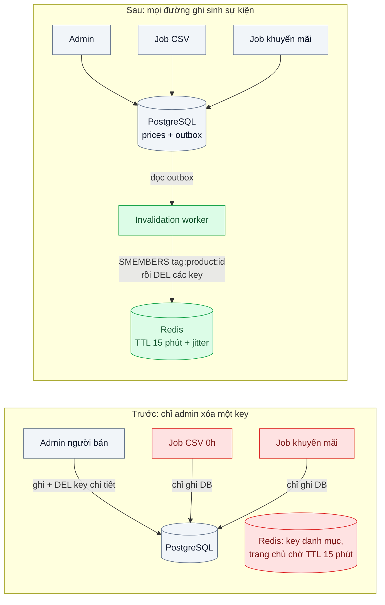
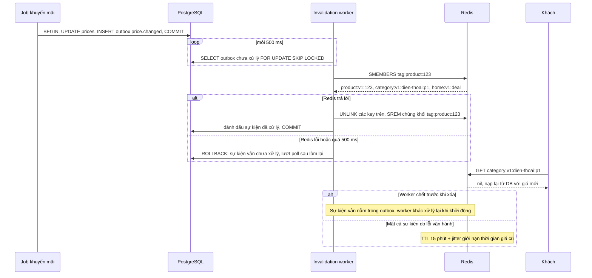

# Cache Invalidation (TTL + event-driven) — Đổi giá rồi mà khách vẫn thấy giá cũ 15 phút

| Scope | Mức độ | Trạng thái | Pattern gốc | Cập nhật |
|---|---|---|---|---|
| 03 · backend / cache | 🟢 Cơ bản | ✅ Hoàn thành | Cache Invalidation (TTL + event-driven) — AWS whitepaper "Database Caching Strategies Using Redis"; Amazon Builders' Library "Caching challenges and strategies" | 2026-10-07 |

> **Một câu tóm tắt:** Mọi đường ghi giá phát một sự kiện "giá đã đổi" đi cùng transaction, một worker nhận sự kiện và xóa *tất cả* key có chứa giá đó; TTL chỉ còn là lưới an toàn chứ không phải cơ chế làm mới chính.

## 1. Bài toán thực tế (What)

**Bối cảnh** *(doanh nghiệp giả định, số liệu minh họa)*
Sàn thương mại điện tử đã áp dụng Cache-Aside (bài 01) với TTL 15 phút. Giá của một sản phẩm xuất hiện ở ít nhất bốn loại key: chi tiết sản phẩm, trang danh mục, khối "deal hôm nay" ở trang chủ và gợi ý tìm kiếm. Giá được sửa từ ba đường: màn hình admin của người bán, job nhập giá hàng loạt từ file CSV lúc 0h và job bật giá khuyến mãi theo lịch.

**Triệu chứng người kinh doanh nhìn thấy**
- Flash sale bắt đầu lúc 20:00 nhưng tới 20:12 khách vẫn thấy giá gốc ở trang danh mục; quảng cáo đã chạy, khách vào thấy giá không khớp và rời đi.
- Ngược lại, hết khuyến mãi lúc 22:00 mà vẫn có khách đặt được đơn ở giá khuyến mãi; sàn phải bù phần chênh lệch cho người bán.
- Người bán sửa giá, mở trang sản phẩm thấy giá mới, nhưng trang danh mục vẫn giá cũ; họ gọi hỗ trợ báo "lỗi hệ thống".

**Nguyên nhân kỹ thuật**
Chỉ màn hình admin gọi lệnh xóa key chi tiết sản phẩm; job CSV và job khuyến mãi ghi thẳng vào PostgreSQL nên không xóa gì. Các key danh mục, trang chủ, tìm kiếm *chứa* giá của nhiều sản phẩm nhưng không ai biết key nào chứa sản phẩm nào, nên chỉ chờ TTL. Kết quả: thời gian giá cũ tồn tại phụ thuộc vào đường ghi và loại trang, có khi lên tới đủ 15 phút.

**Ràng buộc**
- Giá mới phải hiện ở mọi trang trong vòng 5 giây sau khi commit; bước đặt hàng luôn tính lại giá từ database.
- Không được hạ TTL của mọi key xuống vài giây — hit ratio sẽ sụp và database quay lại tình trạng trước bài 01.
- Job CSV do đội dữ liệu viết bằng SQL; có thể yêu cầu ghi thêm một bảng, không thể yêu cầu họ gọi Redis.

## 2. Vì sao dùng pattern này (Why)

**Nguyên nhân gốc mà pattern nhắm vào:** việc làm mới cache đang gắn với *một* đường ghi và *một* key, trong khi dữ liệu được ghi từ nhiều nơi và được nhân bản vào nhiều key.

**Pattern giải quyết thế nào:** tách thành hai cơ chế bổ trợ nhau. (1) **Event-driven invalidation:** mọi thay đổi giá đều sinh một sự kiện `price.changed` ghi trong *cùng transaction* với thay đổi (bảng outbox, xem `14-backend-queueing` bài 03), nên không đường ghi nào lọt được — kể cả job SQL chỉ cần chèn thêm một dòng. Worker đọc sự kiện và xóa mọi key phụ thuộc vào sản phẩm đó, nhờ một *chỉ mục ngược* `tag:product:<id>` (Redis Set) liệt kê các key trang có chứa sản phẩm. (2) **TTL:** AWS whitepaper và Amazon Builders' Library đều coi TTL là lưới an toàn bắt buộc: nếu sự kiện bị lỡ hoặc worker chết, dữ liệu cũ vẫn có hạn. Thêm jitter vào TTL để các key không hết hạn đồng loạt.

**Lựa chọn khác đã cân nhắc**

| Lựa chọn | Giải quyết được gì | Vì sao không chọn (ở bài này) |
|---|---|---|
| Giữ nguyên + tối ưu nhỏ (hạ TTL còn 1 phút) | Rút thời gian giá cũ tối đa | Vẫn tới 1 phút giá sai lúc flash sale; số lần trượt cache tăng 15 lần |
| Xóa key ngay trong code của từng đường ghi | Đơn giản khi chỉ có một đường ghi | Job SQL không gọi được Redis; đường ghi mới thêm sau dễ quên |
| Redis keyspace notifications | Biết khi một key Redis bị xóa hoặc hết hạn | Chỉ báo thay đổi *trong Redis*, không biết thay đổi trong PostgreSQL; là Pub/Sub "bắn rồi quên", client mất kết nối là mất sự kiện |
| CDC từ WAL bằng Debezium | Bắt mọi thay đổi kể cả câu SQL tay, không cần sửa đường ghi | Đúng hướng khi quy mô lớn; thêm Kafka Connect và Debezium là quá tay cho bài nền |
| Key có phiên bản (`price:v<n>:<id>`) | Không cần xóa, đổi phiên bản là đọc key mới | Phải lưu và đọc số phiên bản ở đâu đó (thêm một lần đọc); key cũ vẫn chiếm bộ nhớ tới hết TTL |

## 3. Thiết kế hệ thống (How)

### 3.1 Kiến trúc trước và sau



### 3.2 Luồng chính



### 3.3 Thành phần và trách nhiệm

| Thành phần | Trách nhiệm | Quyết định thiết kế đáng chú ý |
|---|---|---|
| Bảng `outbox` | Ghi sự kiện `price.changed` cùng transaction | Job SQL chỉ cần thêm một `INSERT`; có thể dùng trigger nếu không sửa được job |
| Invalidation worker | Đọc outbox, xóa key phụ thuộc, đánh dấu đã xử lý | `FOR UPDATE SKIP LOCKED` cho nhiều worker; xóa key là idempotent nên xử lý lại không hại |
| Chỉ mục ngược `tag:product:<id>` | Liệt kê key trang chứa sản phẩm | `SADD` cùng một `MULTI` với `SET` lúc nạp trang; TTL của tag dài hơn TTL key trang; worker chỉ `SREM` các member vừa xóa, không xóa cả tag |
| TTL + jitter | Lưới an toàn | 15 phút ± 10 % để các key danh mục tạo cùng lúc không hết hạn cùng lúc |
| Đồng hồ đo độ cũ | Đo thời gian từ commit tới lúc API trả giá mới | Script ghi thời điểm lệnh ghi trả về (giờ bắt đầu trong lịch với khuyến mãi), poll mọi trang chứa sản phẩm mỗi 100 ms trong 10 giây đầu; API ghi nhật ký câu trả lời để đếm request trả giá cũ |

### 3.4 Điểm dễ sai khi triển khai
- **Xóa key trước khi commit.** Một request đọc chen vào giữa sẽ nạp lại giá *cũ* từ database; luôn xóa sau commit, outbox bảo đảm điều đó.
- **Đọc chen giữa lúc xóa (stale set).** Request A đọc giá cũ từ DB, chưa kịp ghi cache; giá đổi và key bị xóa; A ghi giá cũ vào cache. Nishtala et al. mô tả đúng tình huống này và dùng *lease* để chặn (bài 03); ở bài này TTL giới hạn thiệt hại.
- **Quên ghi tag khi nạp trang.** Key trang không có trong chỉ mục ngược thì không bao giờ bị xóa theo sự kiện; test phải kiểm tra mỗi loại trang.
- **Một sự kiện xóa hàng nghìn key.** Đổi giá một ngành hàng làm `SMEMBERS` trả về rất nhiều key; xóa theo lô bằng `UNLINK` để không chặn Redis.
- **Coi keyspace notifications là kênh tin cậy.** Đó là Pub/Sub không lưu lại; dùng để làm mới cache cục bộ thì được, làm nguồn sự kiện chính thì không.
- **Xóa cả tag thay vì gỡ đúng member đã đọc.** Nếu worker `DEL tag:product:<id>` sau `SMEMBERS`, một trang nạp chen giữa hai lệnh (đã mang giá mới) mất chỗ trong chỉ mục và lần đổi giá sau sẽ bỏ sót nó tới hết TTL. Lab dùng `SREM` đúng các member vừa đọc (suy ra từ thứ tự lệnh, chưa có test tái hiện).

**Gặp thật khi làm lab** (số ở mục 5.1):
- **Câu trả lời đúng giá chưa chắc là cache đã đúng.** Lúc máy khựng, Redis quá 50 ms nên API đọc thẳng DB (`BYPASS`) và trả giá mới, trong khi key vẫn giữ giá cũ. Script poll ở lượt đo đầu coi đó là "đã mới" và dừng; nhật ký API còn ghi 8.525 câu trả lời giá cũ sau đó. Đo độ cũ (hay cảnh báo về độ cũ) phải nhìn nguồn câu trả lời, không chỉ nhìn giá trị.
- **Lệnh xóa báo hết giờ vẫn có thể đã chạy.** `commandTimeout` của ioredis chỉ hủy lời hứa phía client; lệnh đã gửi vẫn nằm trong socket, và khi hết `CLIENT PAUSE` Redis chạy nốt (test). Worker coi timeout là lỗi, rollback và làm lại, nên mọi thao tác trong lô phải idempotent (`UNLINK`, `SREM`), không được là `INCR` hay ghi đè giá trị.
- **TTL cố định làm cả lứa key cùng hết hạn.** Bản trước nạp các trang nóng ở vài giây đầu và đúng 900 giây sau dựng lại cùng lúc: 27,5 câu/giây trong 10 giây, hit ratio khoảng đó còn 84 %; bản sau có jitter ± 10 % thì cao nhất 14,2 câu/giây và quanh giây 900 chỉ 8,8 – 10.
- **Tính jitter bằng số thực ra ngoài khoảng.** `Math.ceil(900 * (1 + 10 / 100))` là 991 vì 990,0000000000001; test TTL bắt được, sửa thành phép nhân chia số nguyên.
- **Đường ghi theo lịch cộng thêm độ trễ của job.** Đường khuyến mãi p99 1,45 s so với 0,55 s của admin và CSV, vì job quét lịch mỗi giây (từ giờ bắt đầu tới lúc ghi DB tới 943 ms). Muốn nhanh hơn thì rút chu kỳ quét, không phải sửa worker.
- **Đọc chen giữa (stale set) tái hiện được, và ở bài này chỉ TTL gỡ được nó.** Proxy TCP giữ kết quả DB của lượt đọc trong lúc admin đổi giá và worker xóa key; lượt đọc ghi giá cũ vào cache sau lần xóa, không còn sự kiện nào để xóa nó (phép thử âm "không TTL": giá cũ không bao giờ hết). Dưới tải ở các lượt đo, nhật ký API không ghi câu trả lời giá cũ nào sau khi trang đã có giá mới, nên dưới tải của lab chưa gặp tình huống này.

## 4. Tech stack và tác động (Impact techstack)

| Lớp | Công nghệ chọn | Vì sao chọn | Thay thế tương đương |
|---|---|---|---|
| Ứng dụng, worker | TypeScript strict, NestJS trên Node 20+ | Trùng stack repo; worker là một module chạy tiến trình riêng | Fastify |
| Database + outbox | PostgreSQL 16, `FOR UPDATE SKIP LOCKED` | Sự kiện ghi cùng transaction, không cần broker riêng cho bài nền | PGMQ, Debezium CDC |
| Cache + chỉ mục ngược | Redis 7 (String, Set, `UNLINK`) | Set làm chỉ mục key theo sản phẩm; `UNLINK` giải phóng bộ nhớ không chặn | Valkey |
| Redis client | `ioredis` | Pipeline cho xóa theo lô | `node-redis` |
| Đo | k6, script poll độ cũ, Prometheus | Đo hit ratio và thời gian giá cũ trong cùng một lượt chạy | Grafana để vẽ |
| Hạ tầng local | Docker Compose | Dựng PostgreSQL, Redis, API và worker | — |

**Khi thực hành:** NestJS 10.4.22 (`@nestjs/platform-express`); một tiến trình API chạy cả hai bản trên cùng PostgreSQL 16.15 và Redis 7.4.11, key khác tiền tố (`truoc:` / `sau:`). Bản trước là Cache-Aside của bài 01 với TTL cố định 15 phút, chỉ đường admin xóa key chi tiết; bản sau thêm outbox, chỉ mục ngược và TTL 810–990 giây. Ba loại trang có giá: chi tiết (`GET /:bản/products/:id`), danh mục 20 sản phẩm mỗi trang (`/categories/:slug?page=n`), "deal hôm nay" 12 sản phẩm (`/home/deals`). Gợi ý tìm kiếm ở mục 1 không dựng: về cơ chế nó giống trang danh mục (một key chứa nhiều sản phẩm, tập sản phẩm không phụ thuộc giá). Ba đường ghi: `PATCH /:bản/admin/products/:id/price`; job CSV là file SQL thuần `sql/<bản>/import-prices.sql`, bản sau thêm đúng một câu `INSERT INTO price_outbox`, chạy bằng `psql -f` hoặc gửi nguyên văn qua `pg`; job khuyến mãi `src/promo-job.ts` quét lịch mỗi giây theo giờ của tiến trình. Worker là tiến trình riêng (`src/worker.ts`) dùng thẳng Kysely và ioredis, không qua DI của NestJS. Kênh sự kiện là bảng outbox trong chính PostgreSQL, worker poll 500 ms với `FOR UPDATE SKIP LOCKED` như mục 3.2; không thêm PGMQ, Redis Pub/Sub hay `LISTEN/NOTIFY`: outbox đã bảo đảm sự kiện ghi cùng transaction, poll 500 ms đủ cho mục tiêu 5 giây, còn Pub/Sub của Redis không giữ sự kiện khi worker mất kết nối (mục 2). Lúc rảnh, worker chỉ chạy một câu `SELECT ... LIMIT 1` mỗi chu kỳ, có việc mới mở transaction. Bước đặt hàng `POST /:bản/orders` thêm vào để đo chỉ số cuối của mục 5: bản trước lấy giá từ trang chi tiết qua cache, bản sau tính lại từ DB (ràng buộc ở mục 1). Redis client là ioredis 6.0.0 với cấu hình cache của bài 01: đường đọc trang `commandTimeout` 50 ms và fail open, worker 500 ms. Redis chạy `--save "" --appendonly no --maxmemory 256mb --maxmemory-policy allkeys-lru`. Một tiến trình API, không có cache trong tiến trình nên không cần phát sự kiện tới nhiều instance. Không dựng Prometheus: counter `prom-client` ở `GET /metrics` tách tải k6 (`client="load"`) khỏi request của script đo (header `X-Client: probe`), script đọc thẳng mỗi 10 giây. Khi đo, API ghi một dòng NDJSON cho mỗi câu trả lời có sản phẩm đang theo dõi (`WATCH_IDS`, `WATCH_LOG`) để đếm request trả giá cũ.

**Thay đổi so với hệ thống hiện tại:** thêm bảng outbox và một worker; mọi đường ghi giá (kể cả job SQL) chèn thêm sự kiện; khi nạp trang tổng hợp phải ghi tag. Đội vận hành theo dõi độ dài outbox chưa xử lý như một chỉ số sức khỏe.

## 5. Kết quả đầu ra và cách đo (Output impact)

| Chỉ số | Trước (minh họa) | Mục tiêu khi thực hành | Cách đo |
|---|---|---|---|
| Thời gian giá cũ ở trang danh mục sau khi đổi giá | tới 15 phút | ≤ 5 giây p99 | Script đổi giá 100 lần qua 3 đường ghi, poll API mỗi 100 ms, lấy phân vị |
| Tỷ lệ đường ghi làm mới được cache | 1/3 | 3/3 | Test tích hợp cho từng đường ghi |
| Cache hit ratio dưới tải | 95 % | ≥ 93 % (không sụt quá 2 điểm) | `redis-cli INFO stats` (`keyspace_hits`, `keyspace_misses`) trong lượt k6 |
| Số sự kiện outbox tồn đọng | không có | ≤ 10 ở trạng thái ổn định | Truy vấn `count(*)` outbox chưa xử lý, xuất qua Prometheus |
| Số đơn đặt với giá đã hết hiệu lực | minh họa vài chục/chiến dịch | 0 trong kịch bản thử | So giá trong đơn với lịch giá theo thời điểm tạo đơn |

> Số "trước" là minh họa để hình dung bài toán. Số "mục tiêu" chỉ được coi là đạt khi có số đo thật
> ở mục 8 kèm môi trường đo.

### 5.1 Số đã đo

**Môi trường:** MacBook Apple M1 Pro (8 nhân, macOS 26.6.2); Docker 28.5.1, 8 CPU, khoảng 7,6 GB RAM; PostgreSQL 16.15 (`postgres:16`, bật `pg_stat_statements`); Redis 7.4.11 (`redis:7`, không lưu xuống đĩa, `maxmemory` 256 MB, `allkeys-lru`); Node v20.19.6, pnpm 10.32.0; NestJS 10.4.22, ioredis 6.0.0, Kysely 0.29.6, Vitest 5.0.3; k6 v1.4.2. API, worker, job khuyến mãi, k6 và script đo cùng chạy trên host, gọi PostgreSQL và Redis qua cổng của Docker Desktop; máy chạy cùng container của dự án khác (MySQL, RabbitMQ). Seed 20.000 sản phẩm, 6 danh mục (167 trang mỗi danh mục), 12 sản phẩm "deal hôm nay" (DB 11 MB). Tải đọc: k6 mô hình mở 10.000 request/phút, chuỗi trang tất định theo số thứ tự iteration nên hai bản nhận cùng một chuỗi: 50 % trang chi tiết, 40 % trang danh mục, 10 % deal trang chủ, 90 % vào 600 sản phẩm nóng (trang 1–5 của mỗi danh mục). Số thô ở `bench/results/main/` (không commit, `env.txt` ghi phiên bản); lượt chạy lại từ volume sạch ở `bench/results/recheck/`.

**Kịch bản chính** (`staleness-truoc-2.json`, `staleness-sau-2.json`): 18 phút, cache trống lúc bắt đầu; từ giây 60, mỗi 6 giây đổi giá một sản phẩm nóng khác nhau, xoay vòng admin → CSV → khuyến mãi (100 lần: 34 / 33 / 33, 12 sản phẩm deal đi đường khuyến mãi). Mốc của mỗi lần đổi là lúc lệnh ghi trả về (khuyến mãi: giờ bắt đầu trong lịch). Script poll mọi trang chứa sản phẩm (mỗi 100 ms trong 10 giây đầu, rồi 1 s, rồi 5 s), chỉ tính là đã mới khi câu trả lời `HIT`/`MISS` mang giá mới, và đặt đơn ở giây +2, +10. Cả hai lượt 180.001 request, 0 phản hồi khác 200, 0 lượt bỏ; load 1 phút của macOS 2,96 – 7,19 (trước) và 3,43 – 10,38 (sau).

| Chỉ số | Trước (chỉ TTL 15 phút) | Sau (outbox + chỉ mục ngược + TTL ± 10 %) |
|---|---|---|
| Lần đổi giá mà mọi trang chứa sản phẩm có giá mới trong 5 giây | 0/100 | 100/100 |
| Tới khi mọi trang có giá mới: p50 / p95 / p99 / lớn nhất | 548 / 817 / 841 / 841 s (9 phút 8 giây … 14 phút 1 giây) | 0,43 / 1,15 / 1,38 / 1,49 s |
| … chỉ trang danh mục (100 lần): p50 / p99 / lớn nhất | 546 / 836 / 841 s, 0/100 trong 5 giây | 0,43 / 1,38 / 1,49 s, 100/100 |
| … chỉ trang chi tiết | admin 34/34 trong 5 giây (lớn nhất 7 ms); CSV, khuyến mãi 0/66 | 100/100, lớn nhất 1,49 s |
| … p99 theo đường admin / CSV / khuyến mãi | 836 / 838 / 826 s | 0,55 / 0,56 / 1,45 s |
| Request k6 nhận giá cũ | 58.153 (32,31 %): danh mục 55,38 %, deal 76,61 %, chi tiết 4,98 % của từng loại | 239 (0,133 %): danh mục 0,113 %, deal 0,835 %, chi tiết 0,008 % |
| Đơn tính theo giá đã hết hiệu lực (200 đơn thử) | 132 (66 CSV, 66 khuyến mãi, 0 admin) | 0 |
| Hit ratio tải k6 từ phút thứ 2 | 95,16 % (8.194 miss, 29 `BYPASS`) | 95,12 % (8.174 miss, 110 `BYPASS`) |
| Câu dựng trang tới PostgreSQL từ phút thứ 2 | 490/phút | 499/phút, cộng 136 câu/phút của worker |
| Dựng trang từ DB, khoảng 10 giây cao nhất sau phút đầu | 27,5/s ở giây 918 (lứa key nạp đầu lượt cùng hết hạn) | 14,2/s (giây 392); quanh giây 900: 8,8 – 10/s |
| Sự kiện outbox tồn đọng (mẫu mỗi giây) | — | lớn nhất 1; 30/1.081 mẫu khác 0 |
| Sự kiện nằm trong outbox: p50 / p99 / lớn nhất | — | 272 / 500 / 506 ms; 2–3 key mỗi sự kiện |
| CPU PostgreSQL / Redis / API / worker | 3,4 / 4,7 / 20,8 / — % | 3,7 / 4,7 / 19,2 / 0,3 % |
| Bộ nhớ Redis cuối lượt | 4,1 MB, 7.187 key | 7,5 MB, 27.573 key (gồm tag); 0 key bị evict |

Độ cũ của bản trước không phải TTL ngẫu nhiên mà là phần còn lại của TTL: lứa key nóng nạp ở vài giây đầu lượt và hết hạn quanh giây 900, còn các lần đổi rơi vào giây 60 – 654, nên giá cũ kéo dài 4 phút 11 giây tới 14 phút 1 giây. Theo nhật ký của API, câu trả lời giá cũ cuối cùng mà tải k6 nhận được ở bản sau cách mốc đổi tối đa 451 ms (admin), 481 ms (CSV), 1.121 ms (khuyến mãi); bản trước 840 s. Đường khuyến mãi chậm hơn vì job quét lịch mỗi giây: từ giờ bắt đầu tới lúc job ghi DB mất p50 435 ms, lớn nhất 943 ms. Ở cả hai lượt không có câu trả lời giá cũ nào sau khi script đã thấy trang có giá mới. Hit ratio của hai lượt này chưa so được với nhau: ở bản sau, lượt poll ngay sau mỗi lần xóa thường là request đầu tiên trượt và nạp lại, nên phần trượt thêm rơi vào script đo chứ không vào k6; so ở bảng 3 vòng dưới đây.

**Hit ratio và tải DB khi thêm invalidation** (`hit-ratio-rounds.json`): 3 vòng, mỗi vòng một lượt 5 phút mỗi bản, thứ tự đảo giữa các vòng, cùng 40 lần đổi giá (mỗi 6 giây từ giây 60), không poll và không đặt đơn. Số là trung vị (thấp nhất – cao nhất) của 3 vòng, tính từ phút thứ 2; 0 lượt bỏ, 0 phản hồi khác 200.

| Bản | Hit ratio tải k6 | Lần trượt | Dựng trang từ DB | Câu của worker | CPU PostgreSQL | Request nhận giá cũ |
|---|---|---|---|---|---|---|
| Trước | 94,22 % (94,16 – 94,22) | 2.296 (2.295 – 2.298) | 577/phút (577 – 583) | — | 4,0 % | 21,67 % (21,66 – 21,69) |
| Sau | 94,02 % (93,98 – 94,03) | 2.376 (2.373 – 2.377) | 597/phút (596 – 601) | 148/phút | 4,2 % | 0,442 % (0,400 – 0,454) |

Chênh lệch (sau − trước) theo từng vòng: hit ratio −0,19 / −0,14 / −0,24 điểm; lần trượt thêm 78 / 82 / 77; dựng trang từ DB +19 / +14 / +24 mỗi phút. Dao động giữa các vòng của cùng một bản (0,05 – 0,06 điểm, 3 – 4 lần trượt) nhỏ hơn chênh lệch, nên phần trượt thêm do invalidation đo được: khoảng 2 lần trượt cho mỗi lần đổi giá, đúng bằng số key chứa sản phẩm (2–3). Load macOS của các lượt bản sau lên tới 12,1 / 18,4 / 14,5, của bản trước tới 7,5 / 8,7 / 9,5. Vòng 2 của bản sau chạy lại lúc load 3,8 – 7,3 (`rounds/r2-sau-2.json`, file cũ giữ nguyên): 94,03 %, 2.375 lần trượt, 596 câu/phút, gần như trùng lượt đầu (94,02 %, 2.377, 597).

**Job CSV đổi 2.000 giá một lúc** (`bulk-truoc.json`, `bulk-sau.json`): 6 phút, ở giây 120 chạy file SQL của job cho 600 sản phẩm nóng và 1.400 sản phẩm đuôi; poll 24 trang của 10 sản phẩm. Mỗi lượt 60.001 request, 0 phản hồi khác 200, 0 lượt bỏ; load macOS 2,81 – 7,08 (trước), 3,83 – 8,87 (sau).

| Chỉ số | Trước | Sau |
|---|---|---|
| Transaction của job | 42 ms | 46 ms (thêm 2.000 dòng outbox) |
| Worker xử lý xong 2.000 sự kiện | — | 511 ms sau khi ghi (4 lô 46 / 29 / 15 / 10 ms); xóa 1.119 / 2.647 key nhắm tới (phần còn lại không có trong cache) |
| 24 trang được poll có giá mới | 0/24 tới hết lượt (240 s sau khi ghi) | 24/24, lớn nhất 547 ms |
| Request k6 nhận giá cũ | 15.196 (25,33 %) | 22 (0,037 %) |
| Dựng trang từ DB, khoảng 10 giây (sau phút đầu) | 5,8 – 12,5/s, không đổi lúc ghi | 10,5/s → 32,6 và 43,1/s ở hai khoảng sau khi ghi → 19,6 → 15,5 → 12,8 → khoảng 12/s một phút sau |
| Hit ratio tải k6, khoảng 10 giây thấp nhất | 92,5 % | 74,1 % |
| Hit ratio tải k6 từ phút thứ 2 / dựng trang từ DB | 94,49 % / 550 mỗi phút | 92,58 % / 745 mỗi phút |
| Sự kiện tồn đọng lớn nhất | — | 2.000 trong một mẫu (dưới 1 giây) |

**Lượt bị loại:** `staleness-truoc.json` trùng lúc load macOS lên 25,1: k6 bỏ 261 lượt, 343 lượt Redis quá 50 ms phải đọc thẳng DB (`BYPASS`). Lượt này còn lộ một lỗi của script poll: câu trả lời `BYPASS` mang giá mới nên script coi trang đã mới và dừng, trong khi key vẫn giữ giá cũ (nhật ký API ghi 8.525 câu trả lời giá cũ sau thời điểm đó). Script đã sửa, lượt bản sau đang chạy dở được dừng (`aborted/`), cả hai bản đo lại dưới tên `-2`.

**Test và phép thử âm** (`negative-drills.json`): 21 test tích hợp trong 6 file, chạy trên PostgreSQL và Redis thật, không cần seed. Mỗi phép thử âm sửa mã nguồn tạm thời, chạy các file test liên quan, khôi phục rồi so lại nội dung file; trước khi sửa và sau khi khôi phục đều xanh hết, lượt đã gỡ luôn có số test > 0.

| Gỡ phần nào của pattern | Test đỏ | Test báo gì |
|---|---|---|
| Đường admin không ghi outbox | 2/7 | trang chưa có giá mới sau 5 giây |
| Job CSV (SQL) không có câu `INSERT` vào outbox | 1/7 | như trên, chỉ đường CSV |
| Job khuyến mãi không ghi outbox | 1/7 | như trên, chỉ đường khuyến mãi |
| Nạp trang không `SADD` vào tag | 6/10 | danh mục và deal giữ giá cũ ở cả ba đường ghi; tag rỗng |
| TTL (`SET` không kèm `EX`) | 4/9 | không có worker thì giá cũ không bao giờ hết; trang dính giá cũ do đọc chen giữa có TTL −1 |
| Jitter (mọi key TTL 900 s) | 1/3 | 30 key cùng một TTL |
| Worker nuốt lỗi Redis rồi vẫn đánh dấu đã xử lý | 2/5 | Redis chết hoặc treo mà lô vẫn "thành công", sự kiện mất |
| Đọc outbox không `FOR UPDATE SKIP LOCKED` | 1/3 | hai worker xử lý 560 thay vì 300 sự kiện |
| Bước đặt hàng của bản sau lấy giá từ cache | 1/2 | đơn tính 49.000 thay vì giá niêm yết 100.000 |

**Chạy lại từ volume sạch** (`bench/results/recheck/`, theo "Cách chạy" ở mục 8, lượt ngắn hơn): `docker compose down -v`, xóa `node_modules`, `pnpm install --frozen-lockfile`, `pnpm db:up` (3 giây), `pnpm typecheck`, 21/21 test xanh (24 giây), seed dưới 1 giây. Kịch bản đổi giá 5 phút, 30 lần, TTL hạ xuống 120 giây để bản trước kịp hết hạn trong lượt: bản trước 0/30 lần trong 5 giây, p99 120,4 s (bằng TTL), 10,74 % request nhận giá cũ, 38/60 đơn sai giá; bản sau 30/30, p50 0,43 s, p99 1,35 s, lớn nhất 1,39 s, 0,366 %, 0/60 đơn sai. Job 2.000 giá (3 phút): bản sau xử lý xong trong 557 ms, 10/10 sản phẩm được poll có giá mới trong 563 ms, 27 request (0,09 %) nhận giá cũ; bản trước 0/10, 19,07 %. Một vòng 3 phút không poll: 93,41 % so với 93,60 % (−0,19 điểm, thêm 35 lần trượt cho 20 lần đổi). 9 phép thử âm cho cùng kết quả như lượt chính. Mọi lượt 0 lượt bỏ, 0 phản hồi khác 200; load macOS 3,9 – 13,9.

**So với mục tiêu:**
- Thời gian giá cũ ở trang danh mục: p99 1,38 s, lớn nhất 1,49 s, 100/100 lần trong 5 giây. Đạt (≤ 5 s p99). Bản trước p99 836 s.
- Đường ghi làm mới được cache: 3/3 ở bản sau (test và lượt đo). Đạt. Bản trước: chỉ admin, và chỉ làm mới trang chi tiết; danh mục và deal của cả ba đường đều chờ TTL.
- Hit ratio dưới tải: 94,02 % so với 94,22 % (giảm 0,14 – 0,24 điểm) khi đổi giá đều đặn. Đạt (≥ 93 %, sụt ≤ 2 điểm). Trong lượt 5 phút có job đổi 2.000 giá: 92,58 % so với 94,49 %, sụt 1,91 điểm; dưới mức 93 % nhưng chưa sụt quá 2 điểm.
- Sự kiện tồn đọng ở trạng thái ổn định: lớn nhất 1. Đạt (≤ 10). Đo bằng `count(*)` mỗi giây từ script, không qua Prometheus (mục 4). Job 2.000 dòng đẩy lên 2.000 trong dưới 1 giây.
- Đơn với giá đã hết hiệu lực: 0/200. Đạt. Bản trước 132/200. Kết quả này đến từ việc bước đặt hàng đọc DB chứ không từ invalidation: phép thử âm `dat-hang-tu-cache` cho thấy bản sau lấy giá từ cache vẫn tính sai trong khoảng trước khi worker xóa key.

**Tác động nghiệp vụ mong đợi:** giá trên mọi trang khớp với chiến dịch trong vài giây, không còn khoản bù chênh lệch cho đơn đặt giá cũ, trong khi database vẫn được cache che chắn.

## 6. Đánh đổi và khi KHÔNG nên dùng

**Đánh đổi**
- Thêm outbox và worker phải vận hành; worker chậm là giá cũ kéo dài.
- Chỉ mục ngược tốn bộ nhớ và phải được giữ đúng; sai chỉ mục là có key không bao giờ bị xóa theo sự kiện.
- Sự kiện xóa hàng loạt (đổi giá cả ngành hàng) có thể làm trượt cache đồng loạt — cần kết hợp chống stampede (bài 03).

**Không nên dùng khi**
- Chỉ có một đường ghi và một key cho mỗi bản ghi: xóa key ngay sau commit trong code là đủ.
- Nghiệp vụ chấp nhận dữ liệu cũ bằng TTL (ví dụ số lượt xem, đánh giá trung bình): TTL ngắn là đủ, không cần sự kiện.
- Dữ liệu đổi liên tục từng giây: xóa liên tục làm cache vô dụng; xem lại có nên cache không.

**Liên quan**
- Đọc trước: [01 — Cache-Aside](../01-cache-aside-trang-san-pham-doc-10k-lan-phut/).
- Đọc sau: [03 — Cache Stampede Prevention](../03-cache-stampede-flash-sale-cache-het-han-db-sap/) — khi một sự kiện làm trượt nhiều key cùng lúc.
- Cùng chủ đề: [14-03 — Transactional Outbox](../../14-backend-queueing/03-transactional-outbox-ghi-don-xong-crash-mat-event/); [04-02 — Cache Busting](../../04-frontend-cache/02-cache-busting-deploy-xong-user-van-chay-js-cu/) — invalidation ở tầng trình duyệt.

## 7. Cơ sở tham khảo

- AWS whitepaper, *Database Caching Strategies Using Redis* — https://docs.aws.amazon.com/whitepapers/latest/database-caching-strategies-using-redis/ — vai trò của TTL, chính sách evict, lazy loading và write-through.
- Amazon Builders' Library, "Caching challenges and strategies" — https://aws.amazon.com/builders-library/ — vì sao cần giới hạn độ cũ của dữ liệu và các chế độ lỗi khi làm mới cache.
- Nishtala et al., "Scaling Memcache at Facebook", NSDI 2013 — https://www.usenix.org/conference/nsdi13/technical-sessions/presentation/nishtala — mô tả lỗi "stale set" và cơ chế xóa key theo sự kiện thay vì cập nhật giá trị.
- Redis docs, "Keyspace notifications" — https://redis.io/docs/ — phạm vi và giới hạn "bắn rồi quên" của thông báo key, dùng ở bảng so sánh.
- Chris Richardson, "Pattern: Transactional outbox" — https://microservices.io/patterns/data/transactional-outbox.html — bảo đảm sự kiện invalidation không bị mất khi ghi DB thành công.

## 8. Kế hoạch thực hành

- [x] Bước 1: API NestJS 10 hai bản (`/truoc`, `/sau`) cho ba loại trang có giá, Cache-Aside của bài 01; ba đường ghi giá: endpoint admin, file SQL của job CSV, job khuyến mãi theo lịch; bước đặt hàng để đếm đơn sai giá.
- [x] Bước 2: đo "trước": 100 lần đổi giá qua ba đường ghi dưới tải k6 18 phút, poll mọi trang chứa sản phẩm, nhật ký câu trả lời của API; job CSV 2.000 giá một lúc.
- [x] Bước 3: bảng `price_outbox` ghi cùng transaction ở cả ba đường ghi, worker đọc outbox (`FOR UPDATE SKIP LOCKED`) và `UNLINK` mọi key trong chỉ mục ngược `tag:product:<id>`, TTL 15 phút ± 10 %.
- [x] Bước 4: đo "sau" cùng kịch bản và cùng chuỗi request k6; thêm 3 vòng × 2 bản không poll để so hit ratio và tải DB. Không dựng Prometheus (mục 4).
- [x] Bước 5: test: (a) mỗi đường ghi làm cả ba loại trang hiện giá mới trong 5 giây, bản trước thì không; (b) worker dừng rồi chạy lại vẫn xử lý sự kiện tồn; (c) xử lý một sự kiện hai lần không lỗi, hai worker không xử lý trùng; (d) không có sự kiện thì giá cũ hết sau TTL; thêm: Redis lỗi hoặc treo lúc worker xóa, đọc chen giữa (stale set), đơn hàng. Phép thử âm cho từng phần của pattern.

**Cấu trúc code**
```text
src/
  shared/pages.service.ts         # Cache-Aside cho 3 loại trang (bài 01), hai bản dùng chung; khác nhau ở PageCache
  shared/page.repository.ts       # Kysely: câu dựng trang, tạo đơn, đổi giá, áp lịch khuyến mãi; không biết gì về cache
  shared/…                        # config, db, redis.client (ioredis cho cache), metrics, pages (key, kiểu), variant, watch-log (chỉ khi đo)
  truoc/fixed-ttl.cache.ts        # TTL 900 s cố định, không chỉ mục
  truoc/price-writers.ts          # admin: ghi DB rồi DEL đúng key chi tiết; khuyến mãi: chỉ ghi DB
  sau/tagged.cache.ts             # [PATTERN] TTL 810–990 s; SADD tag:product:<id> cùng MULTI với SET
  sau/price-writers.ts            # [PATTERN] admin, khuyến mãi: ghi DB + INSERT price_outbox cùng transaction
  sau/invalidation.worker.ts      # [PATTERN] outbox → SMEMBERS tag → UNLINK theo lô → SREM → đánh dấu; lỗi thì rollback
  shop.controller.ts, app.module.ts, main.ts    # một API hai bản, cổng 3100
  worker.ts, promo-job.ts         # tiến trình worker (bản sau) và job khuyến mãi (VARIANT=truoc|sau)
sql/{truoc,sau}/import-prices.sql # job CSV bằng SQL; [PATTERN] bản sau thêm một câu INSERT vào outbox
db/init.sql, db/seed.sql          # schema + outbox + orders; seed 20.000 sản phẩm, 6 danh mục, 12 deal; chạy lại được
test/
  every-write-path-invalidates.test.ts   # (a) cho ba đường ghi, hai bản
  worker-restart-replays-outbox.test.ts  # (b), (c), hai worker SKIP LOCKED
  delete-failure-ttl-safety-net.test.ts  # Redis chết/treo lúc xóa, DEL báo hết giờ vẫn chạy, (d)
  stale-set-race.test.ts                 # đọc chen giữa qua proxy TCP giữ kết quả DB
  tag-index-and-ttl.test.ts, orders-use-db-price.test.ts, support/{app,db-proxy}.ts
bench/
  run-scenario.ts                 # một lượt: seed lại, bật API/worker/job, k6, đổi giá, poll, đặt đơn, lấy mẫu, tổng hợp
  page-mix.k6.js, hit-ratio-rounds.ts, negative-drills.ts, lib.ts   # k6 chuỗi trang tất định; 3 vòng; phép thử âm
docker-compose.yml                # postgres:16 (55432), redis:7 (56379) cấu hình cache thuần
```

**Cách chạy**
```bash
cd 03-backend-cache/02-ttl-va-invalidation-gia-doi-roi-khach-van-thay-gia-cu
pnpm install
pnpm db:up                 # docker compose up -d --wait: PostgreSQL 16 ở 55432, Redis 7 ở 56379
pnpm typecheck
pnpm test                  # 21 test tích hợp trên DB và Redis thật, không cần seed
pnpm db:seed               # 20.000 sản phẩm, dưới 1 giây (cần cho bench và để thử tay)
pnpm dev                   # API ở http://127.0.0.1:3100: /truoc/... và /sau/..., /metrics
pnpm worker                # worker invalidation của bản sau; job khuyến mãi: VARIANT=sau pnpm promo-job (mỗi lệnh một terminal)
VARIANT=sau pnpm job:csv   # job CSV: áp các dòng đang chờ trong price_import
# Đo: script tự seed lại, tự bật/tắt API, worker và job (đừng để pnpm dev/worker chạy cùng lúc), kết quả ở bench/results/$RUN/.
RUN=main NAME=staleness-truoc-2 VARIANT=truoc pnpm bench:scenario   # 18 phút: 100 lần đổi giá dưới tải k6
RUN=main NAME=staleness-sau-2 VARIANT=sau pnpm bench:scenario
RUN=main NAME=bulk-truoc VARIANT=truoc SCENARIO=bulk pnpm bench:scenario  # 6 phút: job CSV đổi 2.000 giá một lúc
RUN=main NAME=bulk-sau VARIANT=sau SCENARIO=bulk pnpm bench:scenario
RUN=main ROUNDS=3 pnpm bench:rounds       # 3 vòng × 2 bản × 5 phút, không poll: hit ratio và tải DB
RUN=main pnpm bench:drills                # phép thử âm: sửa mã nguồn tạm thời rồi khôi phục; đừng sửa code khi đang chạy
pnpm db:reset                             # docker compose down -v
```

Biến của `bench:scenario`: `VARIANT`, `SCENARIO` (`staleness`/`bulk`), `DURATION_S`, `RATE` (request/phút), `CHANGES`, `CHANGE_START_S`, `CHANGE_EVERY_S`, `BULK_AT_S`, `BULK_SIZE`, `PROBE=0` (không poll, không đặt đơn), `PAGE_TTL_S`, `SEED`. Chạy nền thì tắt bằng `pkill -f "src/main.ts"`, `pkill -f "src/worker.ts"`, `pkill -f "src/promo-job.ts"` rồi kiểm `lsof -nP -iTCP:3100 -sTCP:LISTEN`.

## Bài học sau khi làm

- **Invalidation theo sự kiện đổi độ cũ từ "phần còn lại của TTL" thành "chu kỳ poll của worker".** Cùng 100 lần đổi giá và cùng chuỗi request, bản trước để giá cũ nằm trên ít nhất một trang 4 – 14 phút (p99 841 s) và 32 % request k6 nhận giá cũ; bản sau p99 1,38 s, 0,133 % request. Gần hết phần còn lại là chu kỳ 500 ms của worker và 1 giây của job khuyến mãi; muốn nhỏ hơn thì rút hai chu kỳ đó (hoặc đánh thức worker bằng `LISTEN/NOTIFY`, lab chưa thử).
- **Bản trước không sai vì thiếu lệnh xóa ở một chỗ, mà vì chỉ có một chỗ biết key.** Đường admin xóa key chi tiết nên trang chi tiết đúng ngay, nhưng trang danh mục và deal chứa cùng giá đó vẫn cũ tới hết TTL; hai đường ghi còn lại không xóa gì (job CSV là SQL, không gọi được Redis). Chỉ mục ngược và outbox gỡ đúng hai điểm này, và phép thử âm cho thấy thiếu một trong hai (một câu `INSERT` trong file SQL, hay một lệnh `SADD`) là trang tương ứng quay lại chờ TTL.
- **Chi phí của invalidation tính được trước: mỗi lần đổi giá tốn đúng số key chứa sản phẩm.** 3 vòng cho khoảng 2 lần trượt thêm mỗi lần đổi, hit ratio giảm 0,14 – 0,24 điểm, DB thêm 14 – 24 câu/phút; worker poll thêm 148 câu/phút, nhiều hơn phần trượt thêm nhưng là câu rẻ. Khi một lần ghi chạm 2.000 sản phẩm, worker xử lý xong trong 0,5 giây nhưng DB nhận gấp 3 – 4 lần tải trong khoảng 20 giây và hit ratio của khoảng 10 giây đó còn 74 %; ở quy mô lớn hơn đó là chỗ cần chống stampede (bài 03).
- **Outbox trả lời "xóa thất bại thì sao" bằng cách không coi việc xóa là xong cho tới khi Redis xác nhận.** Redis chết, treo hay worker chết giữa lô đều để sự kiện nằm lại và được làm lại; TTL chỉ còn phải che trường hợp mất cả sự kiện (test xóa dòng outbox) và trường hợp đọc chen giữa.
- **Bước đặt hàng phải đọc DB, kể cả khi đã có invalidation.** Bản trước tính sai 132/200 đơn; bản sau đúng 200/200 vì đọc DB, còn phép thử âm cho bản sau lấy giá từ cache thì vẫn tính sai trong khoảng trước khi worker xóa key. Invalidation thu hẹp cửa sổ sai, không xóa được nó.
- **Đo độ cũ cần ba nguồn khác nhau.** Poll cho độ phân giải 100 ms nhưng có thể bị `BYPASS` đánh lừa; nhật ký câu trả lời của API cho tỉ lệ request thật nhận giá cũ và phát hiện trang "mới rồi lại cũ"; chuỗi request k6 tất định cho phép so hit ratio giữa hai bản tới từng lần trượt. Hit ratio của lượt có poll thì không so được, vì lượt poll nhận hộ lần trượt sau mỗi lần xóa.
- **Lỗi gặp khi làm:** cận trên của TTL tính bằng số thực ra 991 (test bắt được); script poll tính câu trả lời `BYPASS` là "đã mới" (lượt `staleness-truoc.json` bị loại, lượt bản sau đang chạy được dừng, đo lại cả hai); lượt đầu đó còn trùng lúc load macOS lên 25 và k6 bỏ 261 lượt. Supertest báo `MaxListenersExceededWarning` khi app test chưa listen, vì mỗi request lại gọi `listen(0)`; app test giờ listen sẵn một cổng ngẫu nhiên.
- **Hạn chế của số đo:** chạy chung một laptop với ứng dụng khác (load macOS 2,8 – 18,4 trong các lượt dùng số); API, worker, job, k6 và script cùng ở host, gọi DB và Redis qua cổng Docker Desktop; một tiến trình API, một nút Redis, không có cache trong tiến trình; mỗi kịch bản 18 phút và mỗi lượt job 2.000 giá chạy một lần mỗi bản, hit ratio so bằng 3 vòng × 5 phút; độ cũ của bản trước phụ thuộc lúc key được nạp (ở đây cả lứa nạp đầu lượt), ngoài đời phân bố khác nhưng vẫn bị chặn bởi TTL; tỉ lệ request nhận giá cũ phụ thuộc tỉ phần trang deal trong tải và số sản phẩm deal được đổi giá; seed 20.000 sản phẩm, không dựng gợi ý tìm kiếm, không dựng Prometheus. Lượt chạy lại từ volume sạch ngắn hơn lượt chính (mục 5.1).
