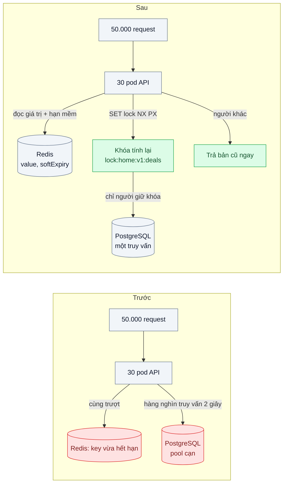
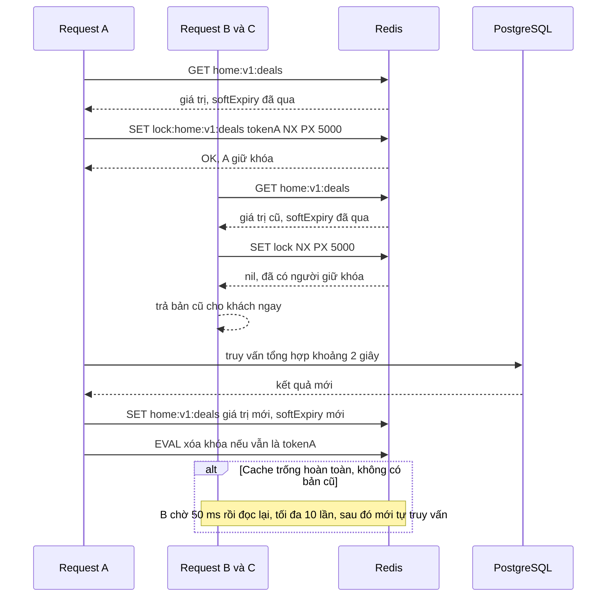

# Cache Stampede Prevention (lock / lease / early expiration) — Flash sale: key hết hạn đúng lúc 50k người vào, DB sập

| Scope | Mức độ | Trạng thái | Pattern gốc | Cập nhật |
|---|---|---|---|---|
| 03 · backend / cache | 🟡 Trung bình | 📋 Kế hoạch | Cache Stampede Prevention — Nishtala et al., NSDI 2013 (leases); Vattani et al., VLDB 2015 (probabilistic early expiration) | 2026-10-06 |

> **Một câu tóm tắt:** Khi một key nóng hết hạn, chỉ *một* request được quyền tính lại giá trị, những request còn lại nhận bản cũ hoặc chờ một chút — thay vì 50.000 request cùng lao xuống database tính cùng một thứ.

## 1. Bài toán thực tế (What)

**Bối cảnh** *(doanh nghiệp giả định, số liệu minh họa)*
Sàn thương mại điện tử chạy flash sale lúc 20:00. Khối "Deal sốc" ở trang chủ tổng hợp 50 sản phẩm giảm giá, tồn kho còn lại và số người đang xem; truy vấn tổng hợp mất khoảng 2 giây trên PostgreSQL. Kết quả được cache theo Cache-Aside (bài 01) với key `home:v1:deals`, TTL 60 giây. Trong phút đầu tiên của flash sale có khoảng 50.000 người mở trang chủ.

**Triệu chứng người kinh doanh nhìn thấy**
- Đúng 20:00 trang chủ treo; 8 phút đầu flash sale gần như không có đơn, đúng khoảng thời gian quảng cáo đẩy traffic mạnh nhất.
- Không chỉ trang chủ: đăng nhập, giỏ hàng, thanh toán cũng lỗi vì dùng chung database.
- Sau sự cố, cứ mỗi phút lại có một đợt chậm ngắn đúng lúc key hết hạn, dù tải đã giảm.

**Nguyên nhân kỹ thuật**
Key hết hạn (hoặc vừa bị xóa vì đổi giá, bài 02) đúng lúc tải cao. Trong 2 giây cần để tính lại, *mọi* request đến đều thấy cache trượt và cùng chạy truy vấn tổng hợp: hàng nghìn truy vấn nặng song song, pool kết nối cạn, CPU database 100 %, truy vấn càng chậm thì càng nhiều request trượt — vòng xoáy *cache stampede* (còn gọi thundering herd). Cache không bảo vệ database đúng vào lúc cần nhất.

**Ràng buộc**
- Khối "Deal sốc" chấp nhận dữ liệu cũ thêm vài giây; trang chủ không được trống hoặc lỗi.
- Không có thời điểm cố định để làm ấm cache: key có thể bị xóa bất cứ lúc nào bởi sự kiện đổi giá.
- Giải pháp phải đúng khi có 30 pod API chạy song song.

## 2. Vì sao dùng pattern này (Why)

**Nguyên nhân gốc mà pattern nhắm vào:** khoảng thời gian tính lại giá trị không được điều phối — nhiều bên cùng phát hiện trượt và cùng tính lại.

**Pattern giải quyết thế nào:** ba kỹ thuật có nguồn gốc rõ ràng, có thể kết hợp:
1. **Khóa tính lại (lock / lease).** Nishtala et al. mô tả *lease* ở memcache của Facebook: request trượt đầu tiên nhận một token, chỉ người giữ token được ghi giá trị mới; những request khác được bảo chờ rồi thử lại. Với Redis, tương đương là `SET lock:<key> <token> NX PX <ms>`: ai đặt được khóa thì tính lại, người khác không chạm database.
2. **Phục vụ bản cũ (soft TTL).** Lưu giá trị kèm thời điểm "nên làm mới" sớm hơn thời điểm Redis xóa key. Trong khoảng giữa hai mốc, người giữ khóa tính lại, mọi người khác nhận bản cũ ngay lập tức.
3. **Hết hạn sớm theo xác suất (XFetch).** Vattani et al. chứng minh cách tối ưu: mỗi request tự quyết định tính lại sớm với xác suất tăng dần khi gần hết hạn — điều kiện `now − δ·β·ln(rand()) ≥ expiry`, trong đó δ là thời gian tính lại, β ≥ 1 điều chỉnh mức sớm. Không cần khóa, gần như luôn chỉ một request tính lại trước khi key hết hạn.

Bài này chọn **soft TTL + khóa Redis** làm phương án chính và cài thêm XFetch để so sánh số lần tính lại.

**Lựa chọn khác đã cân nhắc**

| Lựa chọn | Giải quyết được gì | Vì sao không chọn (ở bài này) |
|---|---|---|
| Giữ nguyên + tối ưu nhỏ (tăng TTL, tăng cấu hình DB) | Đợt chậm thưa hơn | Key vẫn hết hạn hoặc bị xóa lúc cao điểm; stampede chỉ dời thời điểm |
| Làm ấm cache bằng cron trước 20:00 | Hết trượt lúc mở bán | Không xử lý key bị xóa giữa chừng bởi sự kiện đổi giá |
| Gộp request trong tiến trình (single-flight) | Mỗi pod chỉ một truy vấn | 30 pod vẫn là 30 truy vấn 2 giây; tốt làm lớp bổ sung |
| Không bao giờ hết hạn + job nền làm mới | Không có trượt | Job nền chết là dữ liệu cũ vô hạn; khó áp cho hàng nghìn key |
| Soft TTL + khóa Redis, so sánh XFetch (chọn) | Một lần tính lại trên toàn cụm, khách luôn có dữ liệu | Thêm logic khóa; phải xử lý người giữ khóa chết |

## 3. Thiết kế hệ thống (How)

### 3.1 Kiến trúc trước và sau



### 3.2 Luồng chính



### 3.3 Thành phần và trách nhiệm

| Thành phần | Trách nhiệm | Quyết định thiết kế đáng chú ý |
|---|---|---|
| Bản ghi cache `{value, softExpiry, delta}` | Giữ giá trị, hạn mềm và thời gian tính lại lần trước | TTL cứng của Redis = hạn mềm + biên dự phòng, để còn bản cũ phục vụ |
| Khóa tính lại | Chỉ một tiến trình tính lại mỗi key | `SET NX PX` với token ngẫu nhiên; TTL khóa lớn hơn p99 thời gian tính lại |
| Script Lua giải phóng khóa | Xóa khóa chỉ khi token khớp | Tránh xóa nhầm khóa của người khác khi mình đã quá hạn |
| Chờ có giới hạn | Khi không có bản cũ: chờ ngắn rồi đọc lại | Giới hạn số lần, có jitter, không vòng lặp dày đặc làm quá tải Redis |
| XFetch (biến thể so sánh) | Quyết định tính lại sớm theo xác suất | Cần lưu δ (thời gian tính lại đo được) cùng giá trị |
| Single-flight trong tiến trình | Gộp request trùng key trong một pod | Giảm số lần thử khóa lên Redis |

### 3.4 Điểm dễ sai khi triển khai
- **Khóa không có TTL.** Người giữ khóa bị kill giữa chừng thì không ai tính lại nữa; luôn dùng `PX`.
- **TTL khóa ngắn hơn thời gian tính lại.** Khóa hết hạn khi truy vấn chưa xong, request thứ hai vào tính lại song song; đo p99 thời gian tính lại rồi đặt TTL khóa lớn hơn.
- **`DEL` khóa không kiểm tra token.** Request quá hạn xóa mất khóa của người khác; dùng Lua so sánh token rồi mới xóa (theo Redis docs).
- **Chờ bằng vòng lặp không giới hạn.** 50.000 request poll Redis mỗi millisecond tạo stampede mới lên Redis.
- **Mọi key tạo cùng lúc hết hạn cùng lúc.** Làm ấm 1.000 key lúc 19:59 với cùng TTL là hẹn giờ stampede; thêm jitter.
- **Hiểu nhầm đây là khóa cho tính đúng.** Khóa này chỉ để *tiết kiệm công*; hai người cùng tính lại chỉ tốn tài nguyên, không sai dữ liệu. Khóa cho tính đúng là bài 06.

## 4. Tech stack và tác động (Impact techstack)

| Lớp | Công nghệ chọn | Vì sao chọn | Thay thế tương đương |
|---|---|---|---|
| Ứng dụng | TypeScript strict, NestJS trên Node 20+ | Trùng stack repo | Fastify |
| Cache + khóa | Redis 7: `SET NX PX`, `EVAL` | Khóa một instance đủ cho mục đích tiết kiệm công; Lua cho so sánh-và-xóa nguyên tử | Valkey |
| Redis client | `ioredis` (`defineCommand` cho Lua) | Đăng ký script một lần, gọi như lệnh | `node-redis` |
| Database | PostgreSQL 16, truy vấn tổng hợp có `pg_sleep` để mô phỏng 2 giây | Tái hiện được truy vấn nặng có kiểm soát | — |
| Đo tải | k6, executor `ramping-arrival-rate` | Tạo đỉnh tải đúng lúc key hết hạn, đo theo mô hình mở | Gatling |
| Quan sát | Prometheus + `prom-client` | Counter số lần tính lại, số lần trả bản cũ, số lần chờ | OpenTelemetry |

**Thay đổi so với hệ thống hiện tại:** định dạng giá trị cache đổi thành bản ghi có hạn mềm; thêm một tiện ích `getOrRecompute(key, loader)` dùng chung cho các key nóng; đội vận hành theo dõi thêm số lần tính lại mỗi phút và số request nhận bản cũ.

## 5. Kết quả đầu ra và cách đo (Output impact)

| Chỉ số | Trước (minh họa) | Mục tiêu khi thực hành | Cách đo |
|---|---|---|---|
| Số truy vấn tổng hợp tới DB khi key hết hạn dưới tải | ≈ 2.000 | 1 (khóa) hoặc ≤ 3 (XFetch) | Counter `recompute_total` ở ứng dụng + hiệu `calls` trong `pg_stat_statements` |
| p99 độ trễ trang chủ trong 30 giây quanh lúc hết hạn | > 10 giây, nhiều timeout | ≤ 100 ms | k6 `ramping-arrival-rate` tới 2.000 request/giây, xóa key ở giây thứ 30 |
| Tỷ lệ lỗi 5xx trong đỉnh tải | 40 % | 0 % | k6 `http_req_failed` |
| Số kết nối DB hoạt động cao nhất | chạm `max_connections` | ≤ 5 | Truy vấn `pg_stat_activity` mỗi giây trong lượt chạy |

> Số "trước" là minh họa để hình dung bài toán. Số "mục tiêu" chỉ được coi là đạt khi có số đo thật
> ở mục 8 kèm môi trường đo.

**Tác động nghiệp vụ mong đợi:** phút đầu flash sale — phút đáng tiền nhất — trang chủ vẫn mở được và database còn sức cho giỏ hàng, thanh toán.

## 6. Đánh đổi và khi KHÔNG nên dùng

**Đánh đổi**
- Khách có thể thấy dữ liệu cũ thêm khoảng thời gian bằng một lần tính lại; nghiệp vụ phải chấp nhận.
- Thêm logic khóa, token, Lua; lỗi trong logic này khó tái hiện nếu không có test tải.
- XFetch làm tăng nhẹ số lần tính lại khi tải thấp (tính sớm "phòng hờ").

**Không nên dùng khi**
- Key không nóng hoặc tính lại rẻ (vài millisecond): stampede không gây hại đáng kể, Cache-Aside thường là đủ.
- Dữ liệu tuyệt đối không được cũ (tồn kho khi trừ kho): không phục vụ bản cũ, đọc nguồn sự thật.
- Có thể tính trước toàn bộ và đẩy vào cache theo lịch cố định với số key nhỏ, không bị xóa giữa chừng: job làm ấm đơn giản hơn.

**Liên quan**
- Đọc trước: [01 — Cache-Aside](../01-cache-aside-trang-san-pham-doc-10k-lan-phut/), [02 — Cache Invalidation](../02-ttl-va-invalidation-gia-doi-roi-khach-van-thay-gia-cu/).
- Đọc sau: [05 — Hot Key & Multi-tier Cache](../05-hot-key-mot-san-pham-viral-dap-mot-node-redis/); [06 — Distributed Lock](../06-distributed-lock-hai-worker-cung-chay-mot-job/) — khi khóa phải bảo đảm tính đúng.
- Cùng chủ đề: [18-04 — Queue-Based Load Leveling](../../18-backend-scale/04-queue-based-load-leveling-dinh-20h-flash-sale/); [23-07 — Load Testing Methodology](../../23-backend-monitoring-benchmark/07-load-testing-k6-coordinated-omission-benchmark-tu-danh-lua/).

## 7. Cơ sở tham khảo

- Nishtala et al., "Scaling Memcache at Facebook", NSDI 2013 — https://www.usenix.org/conference/nsdi13/technical-sessions/presentation/nishtala — cơ chế *lease* giải đồng thời "thundering herd" và "stale set".
- Vattani, Chierichetti, Lowenstein, "Optimal Probabilistic Cache Stampede Prevention", PVLDB 8(8), VLDB 2015 — https://www.vldb.org/pvldb/vol8/p886-vattani.pdf (cần xác minh URL) — thuật toán XFetch và chứng minh tính tối ưu.
- Redis docs, "Distributed Locks with Redis" — https://redis.io/docs/latest/develop/use/patterns/distributed-locks/ — khóa một instance bằng `SET NX PX` và script Lua giải phóng khóa an toàn.
- Amazon Builders' Library, "Caching challenges and strategies" — https://aws.amazon.com/builders-library/ — rủi ro khi cache trống lúc tải cao và chiến lược phục vụ dữ liệu cũ.
- k6 docs, "Scenarios / Executors" — https://grafana.com/docs/k6/ — `ramping-arrival-rate` để tạo đỉnh tải theo mô hình mở.

## 8. Kế hoạch thực hành

- [ ] Bước 1: dựng API trang chủ với Cache-Aside cho `home:v1:deals`, truy vấn tổng hợp có `pg_sleep(2)`; pool DB 20 kết nối.
- [ ] Bước 2: đo "trước": k6 tăng tới 2.000 request/giây, xóa key ở giây 30; ghi số truy vấn, p99, lỗi, kết nối DB.
- [ ] Bước 3: cài `getOrRecompute` với soft TTL + khóa `SET NX PX` + Lua giải phóng + chờ có giới hạn; cài biến thể XFetch sau cờ cấu hình.
- [ ] Bước 4: đo "sau" cho cả hai biến thể cùng kịch bản; ghi số thật và môi trường vào mục 5.
- [ ] Bước 5: test: (a) 100 lời gọi song song lúc trượt chỉ gọi loader một lần; (b) người giữ khóa chết thì khóa tự hết hạn và request sau tính lại được; (c) không xóa nhầm khóa của người khác; (d) có bản cũ thì không request nào phải chờ.

**Cấu trúc code dự kiến**
```text
src/
  cache/
    get-or-recompute.ts          # [PATTERN] soft TTL + khóa + trả bản cũ
    xfetch.ts                    # [PATTERN] biến thể hết hạn sớm theo xác suất
    release-lock.lua             # so sánh token rồi mới xóa
  home/
    deals.repository.ts          # truy vấn tổng hợp chậm có chủ đích
test/
  concurrent-miss-calls-loader-once.test.ts
  dead-lock-holder-expires.test.ts
  release-only-own-lock.test.ts
bench/flash-sale-expiry.k6.js
docker-compose.yml               # postgres, redis, prometheus
```

**Cách chạy** *(điền khi bắt đầu code)*
```bash
docker compose up -d
pnpm install && pnpm test
```
