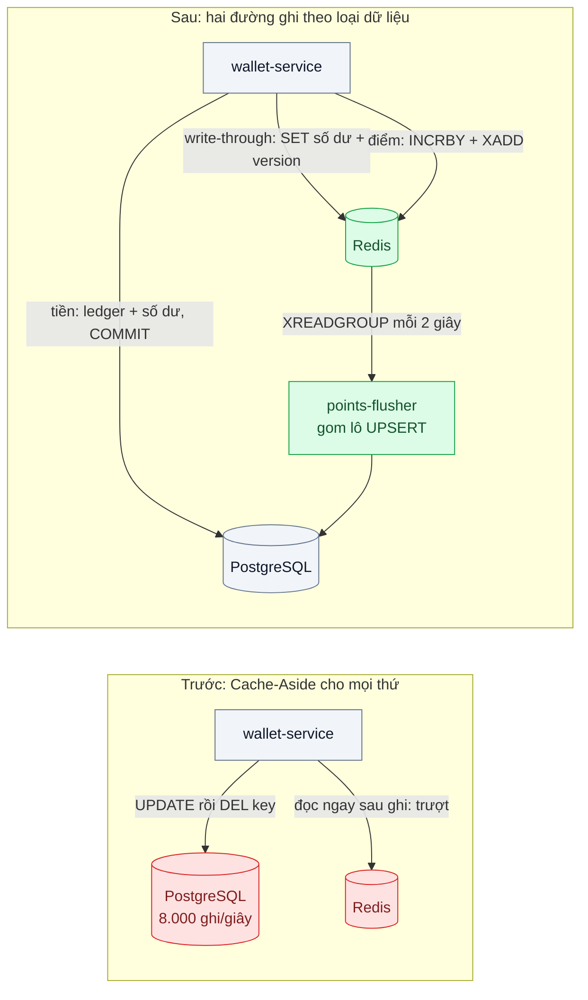
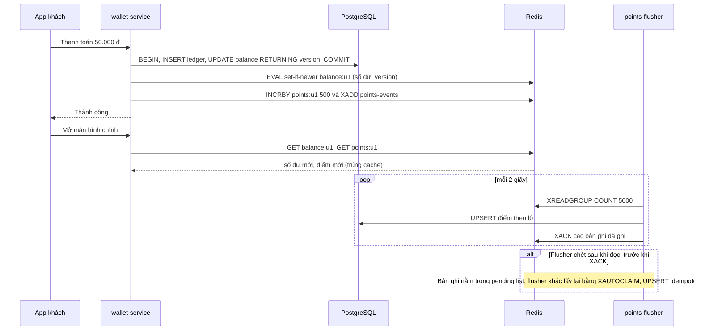

# Write-Through / Write-Behind — Số dư ví phải mới tức thì nhưng DB không chịu nổi mọi lần ghi

| Scope | Mức độ | Trạng thái | Pattern gốc | Cập nhật |
|---|---|---|---|---|
| 03 · backend / cache | 🟡 Trung bình | 📋 Kế hoạch | Write-Through / Write-Behind — AWS whitepaper "Database Caching Strategies Using Redis"; Azure Cache-Aside (so sánh); DDIA ch.7 | 2026-10-06 |

> **Một câu tóm tắt:** Số dư tiền đi theo write-through (ghi DB xong là cập nhật cache ngay trong cùng luồng, đọc luôn trúng và luôn mới), còn điểm thưởng tích lũy tần suất cao đi theo write-behind (ghi Redis trước, gom lô xuống DB sau) — mỗi loại dữ liệu nhận đúng mức an toàn nó cần.

## 1. Bài toán thực tế (What)

**Bối cảnh** *(doanh nghiệp giả định, số liệu minh họa)*
Ví điện tử khoảng 3 triệu người dùng. Màn hình chính của app hiển thị hai con số: **số dư tiền** và **số dư điểm thưởng**. Mỗi giao dịch thanh toán cộng điểm hoàn tiền; mỗi lượt quét mã tại cửa hàng đối tác, mỗi nhiệm vụ "check-in hằng ngày" cũng cộng điểm. Giờ trưa có khoảng 2.000 giao dịch tiền/giây và 6.000 lượt cộng điểm/giây. Hệ thống đang dùng Cache-Aside (bài 01): mỗi lần ghi thì xóa key số dư.

**Triệu chứng người kinh doanh nhìn thấy**
- Khách vừa thanh toán xong mở màn hình chính thấy số dư chưa trừ, bấm thanh toán lại vì tưởng giao dịch lỗi; tổng đài nhận nhiều cuộc gọi "bị trừ tiền hai lần" dù thực tế không phải.
- Giờ trưa, cộng điểm chậm tới vài giây, đôi khi lỗi; khách phàn nàn chương trình khuyến mãi "không cộng điểm".
- Đội hạ tầng cảnh báo database primary đã gần giới hạn ghi; nâng cấp tiếp rất đắt.

**Nguyên nhân kỹ thuật**
Với Cache-Aside, mỗi lần ghi xóa key nên lần đọc ngay sau đó luôn trượt — đúng lúc khách nhìn số dư nhất. Khi có replica, lần đọc trượt có thể rơi vào replica đang trễ và nạp lại số dư *cũ* vào cache. Đồng thời 6.000 lượt cộng điểm/giây là 6.000 câu `UPDATE` nhỏ trên cùng một tập hàng nóng, tranh khóa hàng và đầy WAL, trong khi điểm thưởng không cần bền vững từng millisecond như tiền.

**Ràng buộc**
- Giao dịch tiền: không được mất, không được ghi bất đồng bộ; sổ cái (ledger) trong PostgreSQL là nguồn sự thật duy nhất.
- Điểm thưởng: chấp nhận mất tối đa khoảng 1 giây cộng điểm khi sự cố hạ tầng nghiêm trọng (được nghiệp vụ duyệt, có cơ chế đối soát bù).
- Khách phải thấy số dư tiền mới ngay sau giao dịch của chính mình (read-your-writes).

## 2. Vì sao dùng pattern này (Why)

**Nguyên nhân gốc mà pattern nhắm vào:** cache đang đứng *ngoài* đường ghi nên luôn đi sau một bước; và mọi dữ liệu bị đối xử như nhau dù mức cần bền vững khác nhau.

**Pattern giải quyết thế nào:** AWS whitepaper mô tả **write-through**: mỗi khi ghi database, ứng dụng cập nhật luôn cache, nên dữ liệu trong cache không bao giờ cũ hơn lần ghi gần nhất và lần đọc ngay sau ghi trúng cache. Áp cho số dư tiền: transaction ledger commit xong thì `SET` số dư mới kèm số phiên bản. **Write-behind** (còn gọi write-back) đảo thứ tự: ghi cache trước, đưa xuống database sau theo lô, đổi độ bền lấy thông lượng ghi. Áp cho điểm thưởng: `INCRBY` trên Redis và ghi một bản ghi vào Redis Stream; worker gom lô mỗi 2 giây thành một câu `UPSERT` nhiều dòng. Azure Architecture Center nhắc rằng nhiều hệ cache có sẵn read-through/write-through/write-behind, còn khi cache không hỗ trợ thì ứng dụng tự làm — như bài này.

**Lựa chọn khác đã cân nhắc**

| Lựa chọn | Giải quyết được gì | Vì sao không chọn (ở bài này) |
|---|---|---|
| Giữ nguyên + tối ưu nhỏ (Cache-Aside, đọc lại primary sau ghi) | Hết đọc nhầm replica | Lần đọc sau ghi vẫn trượt; không giảm số lần ghi điểm |
| Ghi thẳng DB, nâng cấp máy | Đơn giản, bền vững | Chi phí tăng theo lượt cộng điểm, khóa hàng nóng vẫn tranh chấp |
| Write-behind cho cả số dư tiền | Giảm mạnh tải ghi | Vi phạm ràng buộc: Redis sự cố là mất giao dịch tiền |
| Gom lô trong bộ nhớ từng pod | Không cần Redis Stream | Pod bị kill là mất toàn bộ lô chưa ghi, không đo được giới hạn mất |
| Hàng đợi riêng cho điểm (`14-backend-queueing` bài 01) | Giảm tải ghi, bền vững hơn | Số dư điểm hiển thị phải chờ worker; vẫn cần cache cho phần hiển thị |

## 3. Thiết kế hệ thống (How)

### 3.1 Kiến trúc trước và sau



### 3.2 Luồng chính



### 3.3 Thành phần và trách nhiệm

| Thành phần | Trách nhiệm | Quyết định thiết kế đáng chú ý |
|---|---|---|
| Ledger + `balance` trong PostgreSQL | Nguồn sự thật của tiền | `version` tăng mỗi lần ghi, trả về bằng `RETURNING` |
| Script Lua `set-if-newer` | Write-through số dư | Chỉ ghi nếu version mới hơn version trong cache — hai giao dịch song song không ghi đè sai thứ tự |
| `points:<user>` + Stream `points-events` | Write-behind điểm thưởng | `INCRBY` cho hiển thị tức thì; Stream là nhật ký bền để flusher ghi xuống DB |
| `points-flusher` (consumer group) | Gom lô, ghi DB, `XACK` | Bảng `points_applied(event_id)` chống ghi trùng khi xử lý lại |
| Redis AOF `appendfsync everysec` | Giới hạn mất dữ liệu khi Redis sập | Redis docs: chế độ này có thể mất khoảng 1 giây ghi — khớp ràng buộc nghiệp vụ |
| Job đối soát đêm | So điểm Redis với DB | Phát hiện và bù chênh lệch nếu có sự cố |

### 3.4 Điểm dễ sai khi triển khai
- **Cập nhật cache trước khi commit.** Transaction rollback mà cache đã có số dư mới; write-through phải chạy *sau* commit thành công.
- **Write-through không có phiên bản.** Giao dịch A commit trước nhưng ghi cache sau giao dịch B, cache giữ số dư của A (cũ hơn); luôn so version.
- **Cache churn.** Write-through cho mọi người dùng, kể cả người cả tháng không mở app, làm Redis đầy dữ liệu không ai đọc; AWS whitepaper khuyên kết hợp TTL.
- **Write-behind cho dữ liệu không được mất.** Chỉ dùng khi nghiệp vụ ký vào giới hạn mất dữ liệu và có đối soát.
- **Quên `XACK` hoặc không xử lý pending list.** Bản ghi tồn mãi hoặc bị bỏ sót; giám sát độ dài pending bằng `XPENDING`.
- **Báo cáo đọc DB điểm như số chính xác tức thì.** DB luôn trễ vài giây so với Redis; ghi rõ điều đó cho đội dữ liệu.

## 4. Tech stack và tác động (Impact techstack)

| Lớp | Công nghệ chọn | Vì sao chọn | Thay thế tương đương |
|---|---|---|---|
| Ứng dụng | TypeScript strict, NestJS trên Node 20+ | Trùng stack repo; flusher là tiến trình riêng | Fastify |
| Nguồn sự thật | PostgreSQL 16 | Transaction cho ledger; `INSERT ... ON CONFLICT` cho UPSERT lô | — |
| Cache + nhật ký ghi | Redis 7: Lua, Streams, consumer group, `XAUTOCLAIM`, AOF | Một hạ tầng cho cả cache và hàng đợi ghi bền ở mức chấp nhận được | Kafka cho nhật ký (nặng hơn), Valkey |
| Redis client | `ioredis` | Hỗ trợ Streams và `defineCommand` | `node-redis` |
| Đo | k6, Prometheus | Tải hỗn hợp tiền/điểm; đo số ghi DB và độ trễ flush | Grafana |
| Hạ tầng local | Docker Compose | PostgreSQL, Redis bật AOF, service và flusher | — |

**Thay đổi so với hệ thống hiện tại:** đường ghi tiền thêm bước cập nhật cache có phiên bản; điểm thưởng chuyển sang Redis làm điểm ghi đầu tiên, có flusher và job đối soát. Đội vận hành phải bật và giám sát AOF, theo dõi độ trễ flush và pending list.

## 5. Kết quả đầu ra và cách đo (Output impact)

| Chỉ số | Trước (minh họa) | Mục tiêu khi thực hành | Cách đo |
|---|---|---|---|
| Số câu ghi tới PostgreSQL mỗi giây | 8.000 | ≤ 2.500 (tiền giữ nguyên, điểm gom lô) | `pg_stat_statements` (`calls` của các câu ghi) trong lượt k6 |
| Tỷ lệ đọc ngay sau ghi thấy số dư mới | ~ 70 % | 100 % | k6 `checks`: thanh toán rồi đọc ngay, so số dư mong đợi |
| p95 đọc màn hình chính | 60 ms | ≤ 10 ms | k6 |
| Độ trễ điểm từ Redis xuống DB | — | p99 ≤ 3 giây | `XINFO GROUPS` (lag, pending) + so timestamp event với thời điểm UPSERT |
| Điểm mất khi kill Redis đột ngột | — | ≤ 1 giây lượt cộng điểm | `docker kill` Redis giữa tải, so tổng điểm đã gửi với tổng điểm sau khôi phục |
| Số dư tiền sai lệch sau 10.000 giao dịch song song | — | 0 | So `balance` trong cache với tổng ledger |

> Số "trước" là minh họa để hình dung bài toán. Số "mục tiêu" chỉ được coi là đạt khi có số đo thật
> ở mục 8 kèm môi trường đo.

**Tác động nghiệp vụ mong đợi:** khách thấy số dư đúng ngay sau khi thanh toán nên bớt thanh toán lặp và cuộc gọi tổng đài; database không phải nâng cấp chỉ vì lượt cộng điểm.

## 6. Đánh đổi và khi KHÔNG nên dùng

**Đánh đổi**
- Write-through làm mỗi lần ghi chậm thêm một vòng Redis và có thể ghi vào cache dữ liệu không ai đọc.
- Write-behind chấp nhận cửa sổ mất dữ liệu và làm DB luôn trễ so với cache; cần đối soát.
- Hai cơ chế cho hai loại dữ liệu: nhiều quy tắc hơn để đội phát triển nhớ.

**Không nên dùng khi**
- Dữ liệu ít được đọc lại ngay sau ghi: Cache-Aside rẻ hơn write-through.
- Write-behind với tiền, tồn kho có ràng buộc pháp lý, hay bất cứ thứ gì không có cách đối soát bù.
- Tải ghi đủ thấp để database chịu thoải mái: write-behind chỉ thêm rủi ro.

**Liên quan**
- Đọc trước: [01 — Cache-Aside](../01-cache-aside-trang-san-pham-doc-10k-lan-phut/).
- Cùng chủ đề: [02-05 — Read Replica](../../02-backend-database/05-read-replica-bao-cao-cuoi-thang-lam-cham-tao-don/) — vì sao đọc replica sau ghi gây số dư cũ; [14-04 — Idempotent Consumer](../../14-backend-queueing/04-idempotent-consumer-event-den-hai-lan-tru-kho-hai-lan/) — UPSERT không trùng khi flusher xử lý lại.
- Đọc sau: [06 — Distributed Lock](../06-distributed-lock-hai-worker-cung-chay-mot-job/) — job đối soát chạy một nơi.

## 7. Cơ sở tham khảo

- AWS whitepaper, *Database Caching Strategies Using Redis* — https://docs.aws.amazon.com/whitepapers/latest/database-caching-strategies-using-redis/ — định nghĩa write-through, so sánh với lazy loading, khuyến nghị kết hợp TTL để tránh cache churn.
- Microsoft Azure Architecture Center, "Cache-Aside pattern" — https://learn.microsoft.com/azure/architecture/patterns/cache-aside — đặt Cache-Aside cạnh read-through/write-through/write-behind và khi nào ứng dụng phải tự làm.
- Martin Kleppmann, *Designing Data-Intensive Applications*, O'Reilly, 2017, ch.7 (độ bền của giao dịch — vì sao ghi chỉ nằm trong bộ nhớ thì không bền) và ch.5 (read-your-writes) — nền tảng về độ bền ghi và đọc sau ghi.
- Redis docs, "Redis persistence" và "Redis Streams" — https://redis.io/docs/ — chính sách `appendfsync` và mức mất dữ liệu tương ứng; consumer group, pending list, `XAUTOCLAIM`.
- PostgreSQL docs, "INSERT ... ON CONFLICT" — https://www.postgresql.org/docs/16/sql-insert.html — UPSERT theo lô cho flusher.

## 8. Kế hoạch thực hành

- [ ] Bước 1: dựng `wallet-service` với ledger, số dư, điểm; Cache-Aside như hiện trạng; k6 kịch bản 2.000 thanh toán + 6.000 cộng điểm mỗi giây (thu nhỏ theo máy).
- [ ] Bước 2: đo "trước": số ghi DB/giây, tỷ lệ đọc-sau-ghi thấy số dư mới, p95 đọc.
- [ ] Bước 3: thêm write-through có phiên bản cho số dư; write-behind cho điểm bằng `INCRBY` + Stream + flusher gom lô; bật AOF `everysec`.
- [ ] Bước 4: đo "sau" cùng kịch bản, thêm lượt kill Redis và kill flusher; ghi số thật và môi trường vào mục 5.
- [ ] Bước 5: test: (a) hai giao dịch song song không làm cache giữ số dư cũ; (b) rollback không đổi cache; (c) flusher chết rồi khởi động lại không mất, không cộng trùng điểm; (d) đối soát phát hiện chênh lệch cố ý tạo ra.

**Cấu trúc code dự kiến**
```text
src/
  wallet/
    payment.service.ts           # ledger + balance, sau commit gọi write-through
    balance.cache.ts             # [PATTERN] write-through có version
    set-if-newer.lua
  points/
    points.service.ts            # [PATTERN] write-behind: INCRBY + XADD
    points.flusher.ts            # [PATTERN] XREADGROUP, UPSERT lô, XACK, XAUTOCLAIM
  reconcile/points-reconcile.job.ts
test/
  concurrent-payments-keep-latest-balance.test.ts
  rollback-does-not-touch-cache.test.ts
  flusher-restart-no-loss-no-duplicate.test.ts
bench/wallet-mixed-load.k6.js
docker-compose.yml               # postgres, redis (appendonly yes)
```

**Cách chạy** *(điền khi bắt đầu code)*
```bash
docker compose up -d
pnpm install && pnpm test
```
