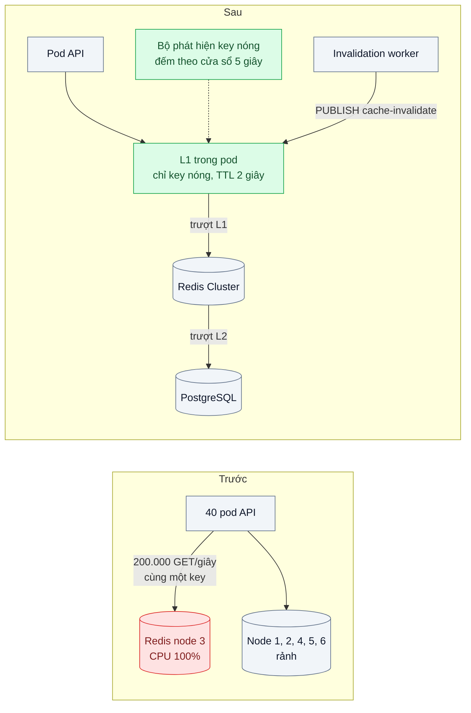
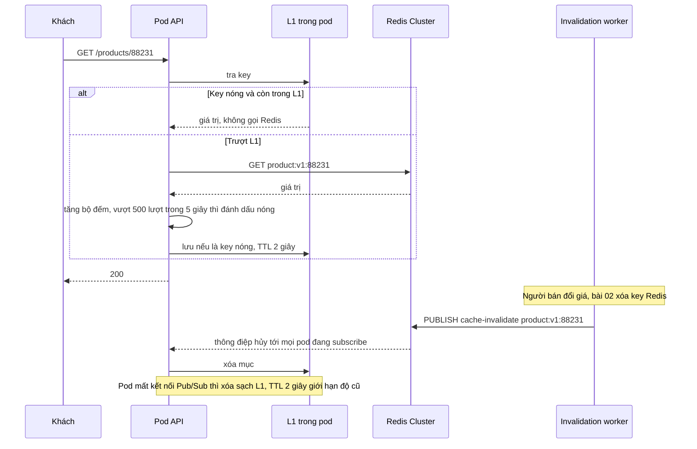

# Hot Key & Multi-tier Cache — Một sản phẩm viral làm một node Redis quá tải trong khi các node khác rảnh

| Scope | Mức độ | Trạng thái | Pattern gốc | Cập nhật |
|---|---|---|---|---|
| 03 · backend / cache | 🔴 Nâng cao | 📋 Kế hoạch | Hot Key & Multi-tier Cache — Nishtala et al., NSDI 2013; Redis docs "Client-side caching", Redis Cluster spec | 2026-10-06 |

> **Một câu tóm tắt:** Đặt thêm một tầng cache nhỏ, sống rất ngắn ngay trong từng pod (L1) trước Redis (L2) cho các key được phát hiện là "nóng", kèm kênh hủy để các pod bỏ bản sao khi dữ liệu đổi — để một sản phẩm viral không dồn toàn bộ lưu lượng vào đúng một node Redis.

## 1. Bài toán thực tế (What)

**Bối cảnh** *(doanh nghiệp giả định, số liệu minh họa)*
Sàn thương mại điện tử có mảng livestream bán hàng. Cache sản phẩm (bài 01) chạy trên Redis Cluster 6 node master, 40 pod API. Bình thường tải chia khá đều, mỗi node khoảng 15 % CPU. Một người nổi tiếng livestream giới thiệu một nồi chiên; trong 20 phút, key `product:v1:88231` nhận khoảng 200.000 lượt đọc/giây.

**Triệu chứng người kinh doanh nhìn thấy**
- Đúng lúc livestream "chốt đơn", trang sản phẩm đó mở chậm 3–5 giây; nhiều khách bỏ đi trước khi bấm mua.
- Không chỉ sản phẩm viral: giỏ hàng và phiên đăng nhập của một phần khách cũng chậm, dù họ không xem livestream.
- Đội hạ tầng đã thêm 3 node Redis trong lúc sự cố nhưng không cải thiện gì.

**Nguyên nhân kỹ thuật**
Redis Cluster chia key vào 16.384 hash slot theo `CRC16(key) mod 16384`; mỗi slot thuộc đúng một master. Một key luôn nằm trên *một* node, nên thêm node không chia nhỏ được tải của một key. Redis thực thi lệnh trên một luồng chính; 200.000 lệnh/giây cho một key làm node đó bão hòa CPU và mạng, mọi key khác cùng node (giỏ hàng, phiên) xếp hàng theo. Các node còn lại vẫn rảnh.

**Ràng buộc**
- Thông tin sản phẩm được phép cũ tối đa 2 giây trên trang xem; giá khi đặt hàng luôn đọc từ database.
- Không biết trước sản phẩm nào sẽ viral — phải tự phát hiện trong vài giây.
- Bộ nhớ mỗi pod API có giới hạn (512 MB); tầng L1 không được làm pod bị OOMKilled.

## 2. Vì sao dùng pattern này (Why)

**Nguyên nhân gốc mà pattern nhắm vào:** phân phối truy cập lệch cực độ dồn vào một đơn vị phân mảnh không thể chia nhỏ hơn.

**Pattern giải quyết thế nào:** nhân bản key nóng ra nhiều nơi để tải được chia. Nishtala et al. mô tả ở memcache của Facebook việc nhân bản một nhóm key trong pool khi tải của chúng vượt sức một máy, cùng cấu trúc nhiều tầng (cụm, vùng) để đọc gần nhất có thể. Ở quy mô của bài, cách rẻ nhất là **multi-tier cache**: mỗi pod giữ một L1 trong bộ nhớ cho những key được đánh dấu nóng, TTL 1–2 giây. 40 pod nghĩa là tải tới Redis cho key đó giảm từ 200.000 xuống cỡ vài chục lượt/giây (mỗi pod nạp lại một lần mỗi TTL). Để L1 không giữ bản cũ quá lâu khi sản phẩm đổi, worker invalidation (bài 02) phát thêm một thông điệp hủy trên kênh Pub/Sub; mọi pod nghe và xóa mục L1. Redis docs mô tả cơ chế tương tự có sẵn ở server — **client-side caching** với `CLIENT TRACKING`, Redis tự gửi thông báo khi key đã đọc bị đổi.

**Lựa chọn khác đã cân nhắc**

| Lựa chọn | Giải quyết được gì | Vì sao không chọn (ở bài này) |
|---|---|---|
| Giữ nguyên + tối ưu nhỏ (thêm node, máy Redis mạnh hơn) | Tăng tổng sức chứa cụm | Không chia được tải của một key; node nóng vẫn bão hòa |
| Đọc từ replica (`READONLY` trên replica của cluster) | Chia tải đọc cho 2–3 máy | Chỉ nhân 2–3 lần, không đủ cho 200.000 lượt/giây; dữ liệu replica có thể trễ |
| Nhân bản key thành N bản (`product:v1:88231#0..N-1`) rải trên nhiều slot | Chia tải trong Redis | Ghi phải cập nhật N bản; vẫn tốn mạng tới Redis cho mỗi request |
| Client-side caching của Redis (`CLIENT TRACKING`) | L1 có hủy do server đảm nhận | Phụ thuộc client hỗ trợ RESP3 hoặc chế độ chuyển hướng; nên thử sau khi hiểu bản tự làm |
| L1 trong pod + phát hiện key nóng + kênh hủy (chọn) | Giảm tải Redis theo cấp số số pod, kiểm soát được bộ nhớ | Các pod có thể lệch nhau tối đa bằng TTL L1 |

## 3. Thiết kế hệ thống (How)

### 3.1 Kiến trúc trước và sau



### 3.2 Luồng chính



### 3.3 Thành phần và trách nhiệm

| Thành phần | Trách nhiệm | Quyết định thiết kế đáng chú ý |
|---|---|---|
| L1 (`lru-cache`) | Giữ bản sao key nóng trong bộ nhớ pod | Giới hạn số mục và tổng kích thước; TTL 2 giây; chỉ nhận key đã đánh dấu nóng |
| Bộ phát hiện key nóng | Đếm lượt đọc theo key trong cửa sổ trượt | Đếm mẫu (1/10 request) để rẻ; ngưỡng cấu hình được |
| Kênh `cache-invalidate` | Báo các pod bỏ mục L1 | Pub/Sub không lưu lại; mất kết nối thì xóa toàn bộ L1 để an toàn |
| Redis Cluster (L2) | Cache chung, nguồn nạp cho L1 | Bật `maxmemory-policy allkeys-lfu` để dùng được `redis-cli --hotkeys` |
| Giám sát theo node | Thấy node nào lệch tải | `INFO stats` từng node; cảnh báo khi một node gấp 3 lần trung bình |

### 3.4 Điểm dễ sai khi triển khai
- **Hash tag gom các bản nhân bản về cùng slot.** Đặt tên `{product:88231}#1` khiến Redis chỉ băm phần trong `{}` — mọi bản rơi vào cùng node, nhân bản vô ích.
- **L1 cho mọi key.** Hit ratio L1 thấp, bộ nhớ pod tăng tới OOM; chỉ giữ key nóng và giới hạn kích thước.
- **L1 không có kênh hủy, TTL dài.** Load balancer đưa khách qua lại giữa các pod, khách thấy giá nhảy qua lại; giữ TTL L1 ngắn và hủy chủ động.
- **Phát hiện nóng quá chậm.** Cửa sổ 1 phút thì sự cố đã xảy ra; cửa sổ vài giây và đếm mẫu.
- **Quên giới hạn của `--hotkeys`.** Lệnh này cần chính sách evict LFU và quét keyspace; chạy trên production lúc cao điểm cũng là tải thêm.
- **Ghi nóng (bộ đếm lượt xem) dùng cách của đọc nóng.** L1 không giúp ghi; với ghi nóng hãy chia bộ đếm thành nhiều key con rồi cộng lại.

## 4. Tech stack và tác động (Impact techstack)

| Lớp | Công nghệ chọn | Vì sao chọn | Thay thế tương đương |
|---|---|---|---|
| Ứng dụng | TypeScript strict, NestJS trên Node 20+ | Trùng stack repo | Fastify |
| L1 | `lru-cache` | Giới hạn theo số mục và kích thước, có TTL | `Map` tự viết, `quick-lru` |
| L2 | Redis 7 Cluster (3 master + 3 replica trong Docker Compose) | Tái hiện đúng cơ chế hash slot | Valkey Cluster |
| Redis client | `ioredis` (`Cluster`) | Hỗ trợ cluster, Pub/Sub | `node-redis` (có hỗ trợ client-side caching, cần xác minh phiên bản) |
| Đo tải | k6 hai kịch bản song song | Một kịch bản dồn vào key nóng, một kịch bản đọc key thường cùng node | — |
| Quan sát | Prometheus + `prom-client`, `redis-cli INFO` từng node | Hit ratio L1/L2, ops/giây theo node | Grafana |

**Thay đổi so với hệ thống hiện tại:** thêm L1 và bộ phát hiện key nóng trong mỗi pod, thêm kênh hủy; chính sách evict Redis chuyển sang LFU. Đội vận hành có thêm dashboard tải theo node và biết rằng giá trên trang xem có thể lệch tối đa 2 giây giữa các pod.

## 5. Kết quả đầu ra và cách đo (Output impact)

| Chỉ số | Trước (minh họa) | Mục tiêu khi thực hành | Cách đo |
|---|---|---|---|
| Ops/giây trên node chứa key nóng | 200.000 | ≤ 5 % số request vào key nóng | `redis-cli -p <port> INFO stats` (`instantaneous_ops_per_sec`) từng node |
| CPU node nóng so với trung bình cụm | gấp 6 lần | ≤ 1,5 lần | `docker stats` từng container Redis |
| p99 đọc key *thường* cùng node với key nóng | 800 ms | ≤ 5 ms | Kịch bản k6 thứ hai chỉ đọc key thường trên cùng slot range |
| Thời gian từ khi key bắt đầu nóng tới khi vào L1 | — | ≤ 5 giây | Log thời điểm đánh dấu nóng so với lúc k6 bắt đầu dồn tải |
| Độ cũ tối đa sau khi đổi giá | — | ≤ 2 giây | Script đổi giá rồi poll qua nhiều pod |
| Bộ nhớ L1 mỗi pod | — | ≤ 50 MB | `process.memoryUsage()` xuất qua Prometheus |

> Số "trước" là minh họa để hình dung bài toán. Số "mục tiêu" chỉ được coi là đạt khi có số đo thật
> ở mục 8 kèm môi trường đo.

**Tác động nghiệp vụ mong đợi:** khoảnh khắc viral — lúc nhiều đơn nhất — trang sản phẩm vẫn nhanh và không kéo chậm giỏ hàng, đăng nhập của khách khác.

## 6. Đánh đổi và khi KHÔNG nên dùng

**Đánh đổi**
- Dữ liệu giữa các pod có thể lệch nhau tối đa bằng TTL L1.
- Thêm trạng thái trong tiến trình: khó debug hơn ("pod này thấy giá gì?"), cần endpoint xem nội dung L1.
- Bộ phát hiện key nóng và kênh hủy là thêm hai thứ phải vận hành, test.

**Không nên dùng khi**
- Phân phối truy cập đều, không có key nào vượt sức một node: L1 chỉ thêm độ phức tạp.
- Dữ liệu phải giống nhau tuyệt đối giữa mọi request (số dư, tồn kho khi đặt): không cache ở pod.
- Ít pod (1–2): nhân bản theo pod không giảm được bao nhiêu tải.

**Liên quan**
- Đọc trước: [02 — Cache Invalidation](../02-ttl-va-invalidation-gia-doi-roi-khach-van-thay-gia-cu/), [03 — Cache Stampede Prevention](../03-cache-stampede-flash-sale-cache-het-han-db-sap/).
- Cùng chủ đề: [18-06 — Sharding with Consistent Hashing](../../18-backend-scale/06-sharding-consistent-hashing-mot-db-khong-chua-noi-du-lieu/); [18-03 — Load Balancing Algorithms](../../18-backend-scale/03-load-balancing-mot-server-qua-tai-cac-server-khac-ranh/); [06-02 — Pub/Sub Fan-out](../../06-frontend-backend-realtime/02-pubsub-fanout-3-server-socket-nguoi-a-khong-thay-nguoi-b/) — cùng cơ chế phát thông điệp tới mọi tiến trình.

## 7. Cơ sở tham khảo

- Nishtala et al., "Scaling Memcache at Facebook", NSDI 2013 — https://www.usenix.org/conference/nsdi13/technical-sessions/presentation/nishtala — nhân bản key trong pool cho tải lệch, cấu trúc nhiều tầng cụm/vùng, phát hủy từ nguồn ghi.
- Redis docs, "Client-side caching" — https://redis.io/docs/ — `CLIENT TRACKING`, chế độ mặc định và broadcasting, RESP3 và chuyển hướng qua kênh `__redis__:invalidate`.
- Redis Cluster specification — https://redis.io/docs/ — 16.384 hash slot, `CRC16`, hash tag và lệnh `READONLY` cho replica.
- Redis docs, `redis-cli` (`--hotkeys`, `--bigkeys`) và "Key eviction" (LFU) — https://redis.io/docs/ — công cụ phát hiện key nóng và điều kiện dùng.
- `lru-cache` — https://github.com/isaacs/node-lru-cache — tham số giới hạn kích thước và TTL cho L1.

## 8. Kế hoạch thực hành

- [ ] Bước 1: dựng Redis Cluster 3 master + 3 replica bằng Docker Compose (`redis-cli --cluster create`), 4 instance API sau Nginx, dữ liệu sản phẩm từ bài 01.
- [ ] Bước 2: đo "trước": k6 dồn tải vào một key, đồng thời đọc key thường cùng node; ghi ops/giây, CPU từng node, p99 key thường.
- [ ] Bước 3: thêm L1 `lru-cache`, bộ phát hiện key nóng (đếm mẫu, cửa sổ 5 giây), kênh `cache-invalidate` và xử lý mất kết nối.
- [ ] Bước 4: đo "sau" cùng kịch bản; thêm lượt đổi giá giữa tải để đo độ cũ; ghi số thật và môi trường vào mục 5.
- [ ] Bước 5: test: (a) key vượt ngưỡng được đưa vào L1, key thường thì không; (b) thông điệp hủy xóa mục L1 ở mọi instance; (c) mất kết nối Pub/Sub thì L1 bị xóa sạch; (d) L1 không vượt giới hạn kích thước.

**Cấu trúc code dự kiến**
```text
src/
  cache/
    l1-cache.ts                  # [PATTERN] lru-cache giới hạn kích thước, TTL 2 giây
    hot-key-detector.ts          # [PATTERN] đếm mẫu theo cửa sổ trượt
    invalidation-subscriber.ts   # [PATTERN] nghe cache-invalidate, xóa L1
    tiered-cache.ts              # L1 → L2 → DB
  catalog/product.controller.ts
test/
  hot-key-promoted-to-l1.test.ts
  invalidation-clears-all-instances.test.ts
  pubsub-disconnect-flushes-l1.test.ts
bench/viral-product.k6.js
docker-compose.yml               # redis cluster 6 node, 4 api, nginx, postgres
```

**Cách chạy** *(điền khi bắt đầu code)*
```bash
docker compose up -d
pnpm install && pnpm test
```
