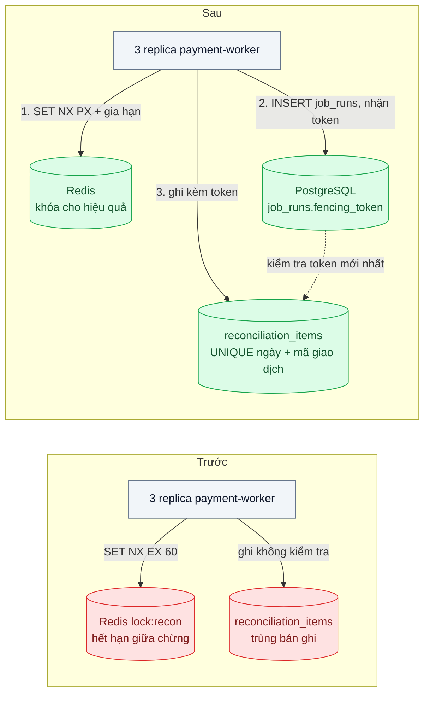
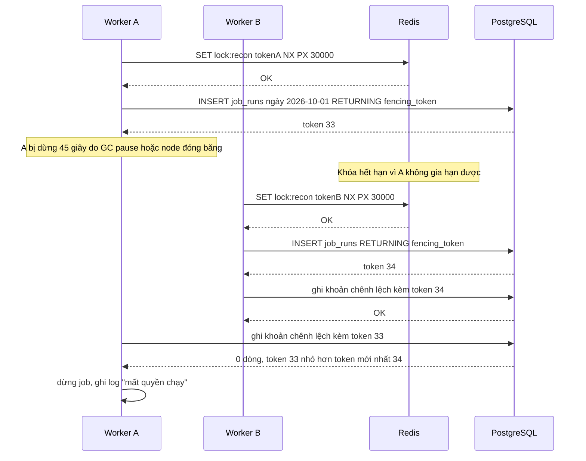

# Distributed Lock — Hai worker cùng chạy một job đối soát, ghi trùng kết quả

| Scope | Mức độ | Trạng thái | Pattern gốc | Cập nhật |
|---|---|---|---|---|
| 03 · backend / cache | 🔴 Nâng cao | 📋 Kế hoạch | Distributed Lock — Redis docs "Distributed Locks with Redis" (Redlock); Kleppmann, "How to do distributed locking" (2016); PostgreSQL advisory locks | 2026-10-06 |

> **Một câu tóm tắt:** Dùng khóa phân tán để chỉ một worker chạy job đối soát *cho đỡ tốn công*, còn *tính đúng* được giữ ở nơi ghi dữ liệu bằng fencing token và ràng buộc duy nhất — vì khóa dựa trên thời gian luôn có lúc hết hạn khi người giữ vẫn tưởng mình đang giữ.

## 1. Bài toán thực tế (What)

**Bối cảnh** *(doanh nghiệp giả định, số liệu minh họa)*
Ví điện tử chạy job đối soát lúc 1:00 mỗi đêm: tải sao kê từ 4 ngân hàng đối tác, so với giao dịch nội bộ, ghi các khoản chênh lệch vào bảng `reconciliation_items` và tạo lệnh điều chỉnh. Job nằm trong `payment-worker` chạy 3 replica, mỗi replica có scheduler riêng. Đội đã thêm khóa Redis `SET lock:recon NX EX 60` để chỉ một replica chạy. Ngày thường job mất 40 giây; cuối tháng mất khoảng 4 phút.

**Triệu chứng người kinh doanh nhìn thấy**
- Sáng đầu tháng, kế toán nhận 2–3 email báo cáo đối soát với con số khác nhau, không biết tin bản nào.
- Một số khoản chênh lệch bị tạo lệnh điều chỉnh hai lần: khách được hoàn tiền gấp đôi, phải thu hồi thủ công và xin lỗi.
- Kiểm toán nội bộ yêu cầu giải trình vì sao cùng một ngày có hai lần đối soát chồng nhau.

**Nguyên nhân kỹ thuật**
Khóa hết hạn sau 60 giây trong khi job cuối tháng chạy 4 phút: replica thứ hai lấy được khóa và chạy song song. Ngay cả khi tăng TTL, một replica bị dừng lâu (GC pause, node bị đóng băng, mất mạng tới Redis) vẫn có thể tỉnh dậy *sau* khi khóa đã hết hạn và tiếp tục ghi như thể mình còn giữ khóa. Khóa chỉ là lời hứa dựa trên thời gian; nơi ghi dữ liệu (PostgreSQL) không biết gì về nó nên chấp nhận mọi lần ghi.

**Ràng buộc**
- Mỗi ngày đối soát chỉ được tạo đúng một bộ khoản chênh lệch và một lệnh điều chỉnh cho mỗi khoản.
- Không được dừng hẳn job khi một replica chết; replica khác phải tiếp quản trong vài phút.
- Đội có sẵn PostgreSQL và Redis một instance; không muốn thêm ZooKeeper/etcd chỉ cho một job.

## 2. Vì sao dùng pattern này (Why)

**Nguyên nhân gốc mà pattern nhắm vào:** "chỉ một bên được làm" đang được bảo đảm bằng một khóa có thời hạn ở *ngoài* nơi ghi dữ liệu, nên khi giả định thời gian sai thì không còn gì chặn.

**Pattern giải quyết thế nào:** Kleppmann tách hai mục đích của khóa. **Khóa cho hiệu quả**: tránh làm trùng việc; thỉnh thoảng hai bên cùng làm chỉ tốn tài nguyên — một khóa Redis một instance với `SET key token NX PX` và Lua giải phóng (theo Redis docs) là đủ. **Khóa cho tính đúng**: hai bên cùng làm là sai dữ liệu — khi đó khóa phải đi kèm **fencing token**: mỗi lần cấp khóa trả về một số tăng dần; mọi lần ghi gửi kèm token; nơi lưu trữ từ chối lần ghi có token nhỏ hơn token lớn nhất đã thấy. Kleppmann lập luận Redlock (khóa trên nhiều node Redis) không sinh fencing token và dựa vào giả định về đồng hồ, nên không đủ cho tính đúng. Bài này chọn: khóa Redis cho hiệu quả, còn tính đúng nằm trong PostgreSQL — bảng `job_runs` cấp fencing token bằng sequence, mọi câu ghi kiểm tra token, cộng ràng buộc duy nhất để lệnh điều chỉnh không thể trùng.

**Lựa chọn khác đã cân nhắc**

| Lựa chọn | Giải quyết được gì | Vì sao không chọn (ở bài này) |
|---|---|---|
| Giữ nguyên + tối ưu nhỏ (tăng TTL lên 10 phút) | Hết trùng do job dài | Replica treo lâu hơn TTL vẫn ghi trùng; replica chết thì phải chờ 10 phút |
| Chỉ chạy scheduler ở một replica | Không cần khóa | Replica đó chết là job không chạy; đổi số replica dễ quên cấu hình |
| Redlock trên 5 node Redis | Chịu được một vài node Redis chết | Không có fencing token, phụ thuộc đồng hồ (theo Kleppmann); thêm 4 node chỉ cho một job |
| PostgreSQL advisory lock (`pg_try_advisory_lock`) | Khóa gắn với phiên kết nối, phiên chết là khóa nhả | Phương án tốt khi dữ liệu nằm cùng DB; không dùng được qua PgBouncer chế độ transaction; vẫn cần chống ghi trùng |
| Khóa Redis cho hiệu quả + fencing token và ràng buộc duy nhất trong PostgreSQL (chọn) | Tách rõ hiệu quả và tính đúng, chịu được treo và chết | Phải sửa câu ghi để mang token |

## 3. Thiết kế hệ thống (How)

### 3.1 Kiến trúc trước và sau



### 3.2 Luồng chính



### 3.3 Thành phần và trách nhiệm

| Thành phần | Trách nhiệm | Quyết định thiết kế đáng chú ý |
|---|---|---|
| Khóa Redis `lock:recon` | Tránh hai replica cùng bắt đầu job | `SET NX PX 30000` + gia hạn mỗi 10 giây bằng Lua kiểm tra token; giải phóng bằng Lua so token |
| Bảng `job_runs` | Cấp fencing token tăng dần mỗi lần chạy | Token từ sequence PostgreSQL; lưu `job_date`, `worker_id`, thời điểm |
| Câu ghi có điều kiện | Chỉ ghi nếu token là mới nhất cho ngày đó | Trong cùng transaction: `SELECT max_token FROM job_fence WHERE job_date = $1 FOR SHARE`, chỉ ghi khi bằng token của mình; cấp token mới thì `UPDATE job_fence` (khóa hàng) nên hai việc không chen nhau |
| Ràng buộc duy nhất | Chặn lệnh điều chỉnh trùng dù logic sai | `UNIQUE (job_date, bank_txn_id)`; dùng `ON CONFLICT DO NOTHING` |
| Gửi email báo cáo | Chỉ gửi khi run hoàn tất với token mới nhất | Gửi qua outbox (`14-backend-queueing` bài 03), không gửi trực tiếp giữa job |

### 3.4 Điểm dễ sai khi triển khai
- **`DEL` khóa không kiểm tra người giữ.** Worker quá hạn xóa mất khóa của worker khác; luôn so token trong Lua rồi mới xóa (Redis docs).
- **Coi khóa là bảo đảm tính đúng.** Mọi khóa có thời hạn đều có thể hết hạn khi người giữ đang treo; tính đúng phải nằm ở nơi ghi.
- **Fencing token kiểm tra ở tầng ứng dụng.** Đọc token rồi mới ghi ở hai câu riêng thì vẫn có khe hở; kiểm tra trong *cùng* câu hoặc cùng transaction với lần ghi.
- **Advisory lock sau PgBouncer chế độ transaction.** Khóa cấp phiên bị gắn vào kết nối có thể đã trả về pool; PgBouncer docs liệt kê đây là tính năng không tương thích.
- **Tác dụng phụ ngoài DB (gửi email, gọi API ngân hàng)** không được fencing bảo vệ; đưa qua outbox hoặc dùng idempotency key với bên ngoài.
- **Gia hạn khóa ở luồng riêng mà job đã treo.** Luồng gia hạn vẫn chạy làm khóa sống mãi dù job kẹt; đặt giới hạn tổng thời gian chạy.

## 4. Tech stack và tác động (Impact techstack)

| Lớp | Công nghệ chọn | Vì sao chọn | Thay thế tương đương |
|---|---|---|---|
| Worker | TypeScript strict, NestJS + `@nestjs/schedule` trên Node 20+ | Trùng stack repo; tái hiện đúng "mỗi replica một scheduler" | BullMQ repeatable job (một hàng đợi thay cho khóa) |
| Khóa cho hiệu quả | Redis 7 một instance, `SET NX PX`, Lua | Đơn giản, đủ cho mục đích tránh làm trùng | PostgreSQL advisory lock |
| Tính đúng | PostgreSQL 16: sequence, ràng buộc `UNIQUE`, câu ghi có điều kiện | Nơi ghi dữ liệu tự từ chối lần ghi cũ, không phụ thuộc đồng hồ | etcd/ZooKeeper (có revision/zxid làm token, nặng hơn) |
| Mô phỏng treo | `docker pause` / `docker unpause` | Tạo "GC pause" dài tùy ý mà không sửa code | `kill -STOP` / `kill -CONT` |
| Đo | Truy vấn SQL kiểm tra trùng, Prometheus | Đếm lần ghi bị từ chối, số run chồng nhau | — |

**Thay đổi so với hệ thống hiện tại:** thêm bảng `job_runs`, sửa mọi câu ghi của job để mang fencing token, thêm ràng buộc duy nhất; khóa Redis có gia hạn và giải phóng an toàn. Đội vận hành có thêm chỉ số "số lần ghi bị fencing từ chối" — khác 0 nghĩa là đã có lúc hai worker chồng nhau.

## 5. Kết quả đầu ra và cách đo (Output impact)

| Chỉ số | Trước (minh họa) | Mục tiêu khi thực hành | Cách đo |
|---|---|---|---|
| Số khoản chênh lệch trùng sau kịch bản treo | 120 | 0 | `SELECT job_date, bank_txn_id, count(*) ... HAVING count(*) > 1` |
| Số lệnh điều chỉnh trùng | 15 | 0 | Truy vấn tương tự trên bảng lệnh điều chỉnh |
| Số lần ghi bị fencing từ chối trong kịch bản treo | không có | ≥ 1 (chứng minh cơ chế hoạt động) | Counter `fencing_rejected_total` |
| Thời gian replica khác tiếp quản khi người giữ chết | 60 giây trở lên | ≤ 30 giây | `docker kill` worker giữ khóa, đo tới lúc `job_runs` có dòng mới |
| Số email báo cáo mỗi ngày | 2–3 | 1 | Đếm bản ghi outbox loại báo cáo theo ngày |

> Số "trước" là minh họa để hình dung bài toán. Số "mục tiêu" chỉ được coi là đạt khi có số đo thật
> ở mục 8 kèm môi trường đo.

**Tác động nghiệp vụ mong đợi:** mỗi ngày đúng một kết quả đối soát, không còn hoàn tiền gấp đôi; kiểm toán có bảng `job_runs` cho biết ai chạy, lúc nào, lần ghi nào bị từ chối.

## 6. Đánh đổi và khi KHÔNG nên dùng

**Đánh đổi**
- Mọi câu ghi của job phải mang token và điều kiện; code dài hơn, phải review kỹ.
- Hai cơ chế (khóa Redis và fencing) cho một việc; người mới dễ tưởng một trong hai là thừa.
- Fencing chỉ bảo vệ được nơi lưu trữ biết kiểm tra token; dịch vụ bên ngoài cần cơ chế riêng.

**Không nên dùng khi**
- Hai bên cùng làm chỉ tốn tài nguyên, không sai dữ liệu (làm ấm cache, tính lại báo cáo idempotent): khóa Redis đơn giản là đủ, như bài 03.
- Công việc có thể thiết kế lại thành idempotent hoàn toàn (ràng buộc duy nhất + `ON CONFLICT`): có khi không cần khóa nữa.
- Có sẵn hàng đợi bảo đảm mỗi job chỉ giao cho một consumer tại một thời điểm: dùng hàng đợi thay cho khóa.

**Liên quan**
- Đọc trước: [03 — Cache Stampede Prevention](../03-cache-stampede-flash-sale-cache-het-han-db-sap/) — khóa cho hiệu quả.
- Cùng chủ đề: [02-02 — Optimistic Offline Lock](../../02-backend-database/02-optimistic-lock-hai-nhan-vien-cung-sua-mot-don/) — kiểm tra phiên bản ở nơi ghi; [14-04 — Idempotent Consumer](../../14-backend-queueing/04-idempotent-consumer-event-den-hai-lan-tru-kho-hai-lan/); [02-03 — Connection Pooling](../../02-backend-database/03-connection-pool-200-pod-dap-postgres/) — vì sao advisory lock và PgBouncer xung đột.
- Liên kết: [13-03 — Rate Limiting & Throttling](../../13-backend-transporter/03-rate-limiting-mot-khach-api-goi-10k-req-s/) — bộ đếm phân tán trên Redis.

## 7. Cơ sở tham khảo

- Redis docs, "Distributed Locks with Redis" — https://redis.io/docs/latest/develop/use/patterns/distributed-locks/ — khóa một instance bằng `SET NX PX`, script giải phóng an toàn, thuật toán Redlock.
- Martin Kleppmann, "How to do distributed locking", 2016 — https://martin.kleppmann.com/2016/02/08/how-to-do-distributed-locking.html — phân biệt khóa cho hiệu quả và cho tính đúng, fencing token, phản biện Redlock.
- Martin Kleppmann, *Designing Data-Intensive Applications*, O'Reilly, 2017, ch.8 — process pause, "the truth is defined by the majority", fencing token.
- PostgreSQL docs, "Explicit Locking — Advisory Locks" — https://www.postgresql.org/docs/16/explicit-locking.html — khóa cấp phiên và cấp transaction cho phương án so sánh.
- PgBouncer docs, "Features" — https://www.pgbouncer.org/features.html — bảng tính năng không dùng được ở chế độ transaction pooling, trong đó có advisory lock cấp phiên.

## 8. Kế hoạch thực hành

- [ ] Bước 1: dựng `payment-worker` 3 replica, mỗi replica có scheduler gọi job đối soát mô phỏng (đọc sao kê giả, ghi chênh lệch), khóa Redis `SET NX EX 60` như hiện trạng.
- [ ] Bước 2: đo "trước": chạy job dài 4 phút và kịch bản `docker pause` worker giữ khóa 45 giây; đếm bản ghi trùng, email trùng.
- [ ] Bước 3: thêm `job_runs` + fencing token, câu ghi có điều kiện, `UNIQUE` + `ON CONFLICT DO NOTHING`, khóa Redis có gia hạn và giải phóng bằng Lua, email qua outbox.
- [ ] Bước 4: đo "sau" với cùng kịch bản và thêm `docker kill`; ghi số thật và môi trường vào mục 5.
- [ ] Bước 5: test: (a) worker có token cũ không ghi được dòng nào; (b) giải phóng khóa không xóa khóa của người khác; (c) worker giữ khóa chết thì replica khác chạy trong 30 giây; (d) chạy job hai lần cùng ngày không tạo lệnh điều chỉnh trùng.

**Cấu trúc code dự kiến**
```text
src/
  reconcile/
    reconcile.job.ts             # job đối soát, nhận token và truyền xuống mọi câu ghi
    reconcile.repository.ts      # [PATTERN] câu ghi có điều kiện fencing token
  lock/
    redis-lock.ts                # [PATTERN] SET NX PX, gia hạn, giải phóng bằng Lua
    release-lock.lua
    extend-lock.lua
sql/migrations/                  # job_runs, job_fence, sequence, UNIQUE (job_date, bank_txn_id)
test/
  stale-token-write-rejected.test.ts
  release-only-own-lock.test.ts
  failover-after-holder-dies.test.ts
  rerun-same-day-no-duplicate.test.ts
docker-compose.yml               # postgres, redis, 3 replica worker
```

**Cách chạy** *(điền khi bắt đầu code)*
```bash
docker compose up -d
pnpm install && pnpm test
```
