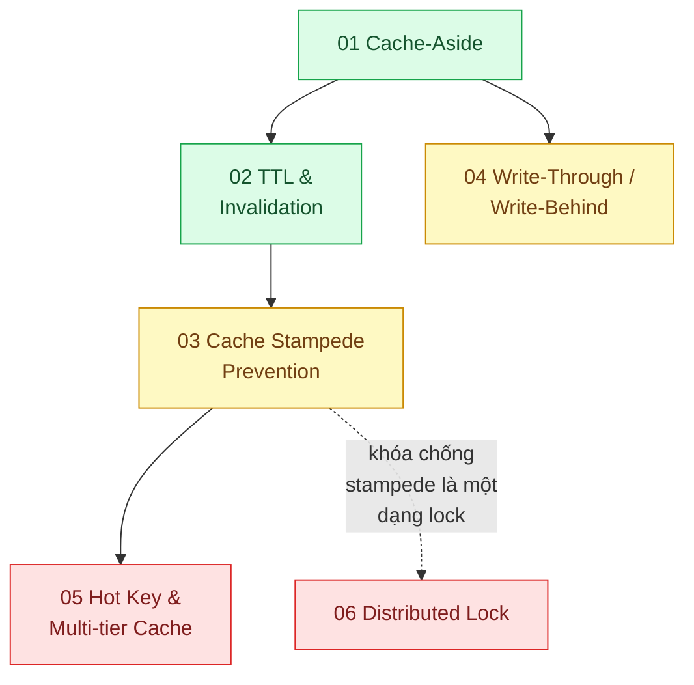

# 03 · Cache phía backend (`backend / cache`)

> **Phạm vi:** Bộ đệm giữa ứng dụng và nguồn dữ liệu (Redis, in-process cache): chiến lược đọc/ghi,
> làm mới, chống sập khi cache trống, key nóng, khóa phân tán. Cache trình duyệt/CDN thuộc scope 04;
> giới hạn tốc độ (dù dùng Redis) thuộc scope 13.
>
> **Câu hỏi trung tâm:** Cache ở đâu, làm mới thế nào, và chuyện gì xảy ra khi cache sai hoặc biến mất?

## Bản đồ pattern trong scope

## Danh sách bài toán

| # | Bài toán (pattern — triệu chứng) | Mức | Pattern gốc / nguồn | Trạng thái |
|---|---|---|---|---|
| 01 | [Cache-Aside — Trang sản phẩm được đọc 10.000 lần/phút nhưng chỉ đổi 2 lần/ngày](./01-cache-aside-trang-san-pham-doc-10k-lan-phut/) | 🟢 | Azure Architecture Center "Cache-Aside"; AWS whitepaper "Database Caching Strategies Using Redis"; Redis docs | ✅ |
| 02 | [Cache Invalidation (TTL + event-driven) — Đổi giá rồi mà khách vẫn thấy giá cũ 15 phút](./02-ttl-va-invalidation-gia-doi-roi-khach-van-thay-gia-cu/) | 🟢 | AWS whitepaper (TTL, eviction); Amazon Builders' Library "Caching challenges and strategies"; Redis docs (keyspace notifications) | 📋 |
| 03 | [Cache Stampede Prevention (lock / lease / early expiration) — Flash sale: key hết hạn đúng lúc 50k người vào, DB sập](./03-cache-stampede-flash-sale-cache-het-han-db-sap/) | 🟡 | Nishtala et al., "Scaling Memcache at Facebook" (NSDI 2013) — leases; Vattani et al., "Optimal Probabilistic Cache Stampede Prevention" (VLDB 2015) | 📋 |
| 04 | [Write-Through / Write-Behind — Số dư ví phải mới tức thì nhưng DB không chịu nổi mọi lần ghi](./04-write-through-write-behind-so-du-vi-can-moi-tuc-thi/) | 🟡 | AWS whitepaper "Database Caching Strategies Using Redis" (write-through); Azure Cache-Aside (so sánh); DDIA ch.7 (độ bền — durability của giao dịch) | 📋 |
| 05 | [Hot Key & Multi-tier Cache — Một sản phẩm viral làm một node Redis quá tải trong khi các node khác rảnh](./05-hot-key-mot-san-pham-viral-dap-mot-node-redis/) | 🔴 | Nishtala et al. (2013) — hot keys, regional pools; Redis docs "Client-side caching", Redis Cluster spec | 📋 |
| 06 | [Distributed Lock — Hai worker cùng chạy một job đối soát, ghi trùng kết quả](./06-distributed-lock-hai-worker-cung-chay-mot-job/) | 🔴 | Redis docs "Distributed Locks with Redis" (Redlock); Kleppmann, "How to do distributed locking" (2016) — phản biện; PostgreSQL advisory locks (phương án so sánh) | 📋 |

## Lộ trình đề xuất trong scope

1. **Cache-Aside** rồi **TTL & invalidation** — cặp bài nền: cache đọc và cache sai.
2. **Stampede** — vấn đề nổi tiếng nhất của cache; mô phỏng được bằng k6.
3. **Write-through/behind** — khi cache tham gia đường ghi; hiểu đánh đổi về mất dữ liệu.
4. **Hot key** — bài về phân phối tải trong cluster; cần hiểu Redis Cluster.
5. **Distributed lock** — bài có tranh luận thật (Redlock vs Kleppmann); đọc cả hai phía.

## Kiến thức nền cần có trước

- Redis cơ bản: kiểu dữ liệu, TTL, `SET NX PX`, pipeline, Lua script.
- Khái niệm consistency: dữ liệu cũ (stale) chấp nhận được bao lâu với từng loại dữ liệu.
- Đọc `02-backend-database` bài 01 để biết "trước khi cache, đã tối ưu truy vấn chưa".

## Liên kết với scope khác

- `13-backend-transporter` bài 03 (Rate Limiting) — bộ đếm phân tán trên Redis.
- `18-backend-scale` — cache là một bậc trong thang scale đọc.
- `22-backend-ai-optimizer` bài 05 (Semantic cache) — cache cho câu hỏi gần giống nhau.
- `04-frontend-cache` — tầng cache phía client/CDN nằm trước tầng này.

## Nguồn tổng quan cho scope

- Amazon Builders' Library, "Caching challenges and strategies".
- AWS whitepaper, *Database Caching Strategies Using Redis*.
- Nishtala et al., "Scaling Memcache at Facebook" (NSDI 2013).
