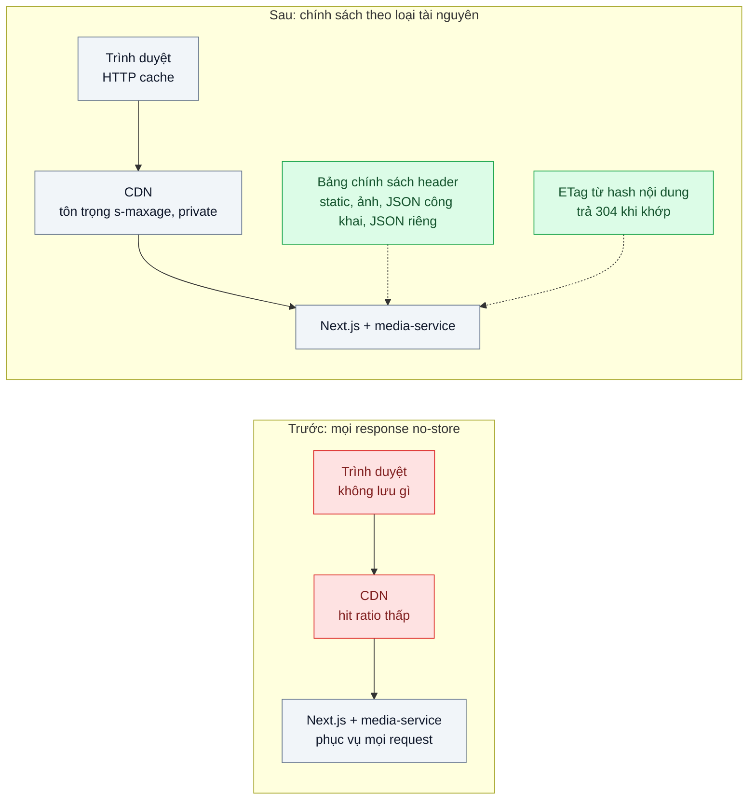
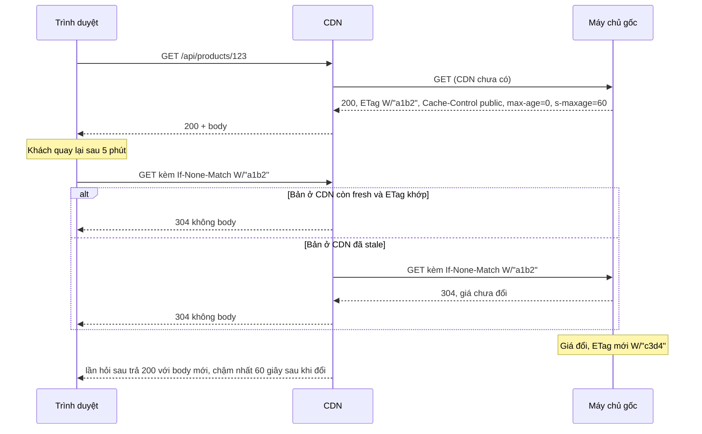

# HTTP Caching (Cache-Control, ETag) — Ảnh và JS tải lại mỗi lần, hóa đơn CDN tăng

| Scope | Mức độ | Trạng thái | Pattern gốc | Cập nhật |
|---|---|---|---|---|
| 04 · frontend / cache | 🟢 Cơ bản | 📋 Kế hoạch | HTTP Caching — RFC 9111 "HTTP Caching"; MDN "HTTP caching" | 2026-10-06 |

> **Một câu tóm tắt:** Gắn đúng `Cache-Control` cho từng loại tài nguyên và trả `ETag` để trình duyệt, CDN biết được giữ gì, giữ bao lâu và hỏi lại thế nào — thay vì tải lại toàn bộ ảnh, JS, JSON ở mỗi lượt xem.

## 1. Bài toán thực tế (What)

**Bối cảnh** *(doanh nghiệp giả định, số liệu minh họa)*
Sàn thương mại điện tử, web Next.js (App Router) đặt sau một CDN; ảnh sản phẩm do `media-service` trả qua `/media/:id/:size`. Trong một đợt rà soát bảo mật, ai đó đặt `Cache-Control: no-store` cho *mọi* response "cho chắc". Khoảng 70 % lượt truy cập là khách quay lại trong ngày, phần lớn trên 4G.

**Triệu chứng người kinh doanh nhìn thấy**
- Hóa đơn CDN và băng thông máy chủ gốc tăng gần gấp ba trong hai tháng dù lượng khách chỉ tăng nhẹ.
- Khách quay lại trang danh mục vẫn phải chờ ảnh hiện lần lượt như lần đầu; trên 4G trang mất 4–5 giây mới đầy đủ.
- Mỗi chiến dịch lớn, máy chủ gốc quá tải vì CDN gần như không chặn được request nào.

**Nguyên nhân kỹ thuật**
`no-store` cấm mọi tầng cache (trình duyệt, CDN) lưu response, nên mỗi lượt xem tải lại toàn bộ ảnh, JS, CSS và JSON từ máy chủ gốc. Không có `ETag`/`Last-Modified` nên cũng không thể hỏi lại rẻ ("bản tôi có còn đúng không?") để nhận `304 Not Modified` không body. CDN chỉ còn là đường ống đắt tiền.

**Ràng buộc**
- Dữ liệu riêng của khách (giỏ hàng, đơn hàng, thông tin tài khoản) tuyệt đối không được lưu ở CDN dùng chung.
- Giá trong JSON trang sản phẩm phải mới trong vòng 1 phút; ảnh sản phẩm thay đổi rất hiếm.
- Không đổi nhà cung cấp CDN; cấu hình phải nằm ở máy chủ gốc để chạy được với mọi CDN chuẩn.

## 2. Vì sao dùng pattern này (Why)

**Nguyên nhân gốc mà pattern nhắm vào:** máy chủ gốc không nói cho các tầng cache biết response nào được lưu, lưu ở đâu và bao lâu.

**Pattern giải quyết thế nào:** RFC 9111 định nghĩa cách một response trở thành *fresh* (dùng lại không cần hỏi) trong thời gian `max-age` (hoặc `s-maxage` cho cache dùng chung như CDN), sau đó thành *stale* và phải *validate* lại bằng request có điều kiện. RFC 9110 định nghĩa validator: `ETag` + `If-None-Match`, `Last-Modified` + `If-Modified-Since`; nếu không đổi, máy chủ trả `304` không body. `private` cấm cache dùng chung lưu response, `no-cache` cho phép lưu nhưng bắt hỏi lại mỗi lần, `no-store` cấm lưu. Ghép lại thành một **bảng chính sách theo loại tài nguyên**: file tĩnh có hash lưu một năm; ảnh lưu một ngày ở trình duyệt, lâu hơn ở CDN; JSON công khai lưu ngắn có ETag; dữ liệu cá nhân `private, no-cache` kèm ETag.

**Lựa chọn khác đã cân nhắc**

| Lựa chọn | Giải quyết được gì | Vì sao không chọn (ở bài này) |
|---|---|---|
| Giữ nguyên + tối ưu nhỏ (nén ảnh, bật Brotli, mua gói CDN lớn) | Giảm byte mỗi request | Số request và lượt tải lại không đổi; chi phí vẫn tăng theo lượt xem |
| Cấu hình cache ở bảng điều khiển CDN, bỏ qua header gốc | CDN chặn được nhiều request | Phụ thuộc nhà cung cấp; trình duyệt vẫn tải lại; dễ cache nhầm dữ liệu cá nhân |
| Service Worker tự cache (bài 06) | Kiểm soát chi tiết, chạy offline | Quá tay cho vấn đề header; SW vẫn cần header đúng để làm mới |
| Cache dữ liệu trong app (bài 03) | Không tải lại JSON khi điều hướng | Không giúp ảnh, JS, CSS và không giảm tải CDN |

## 3. Thiết kế hệ thống (How)

### 3.1 Kiến trúc trước và sau



### 3.2 Luồng chính



### 3.3 Thành phần và trách nhiệm

| Thành phần | Trách nhiệm | Quyết định thiết kế đáng chú ý |
|---|---|---|
| File tĩnh có hash (`/_next/static/...`) | JS, CSS, font | `public, max-age=31536000, immutable` — chi tiết ở bài 02 |
| Ảnh sản phẩm `/media/:id/:size` | Ảnh theo kích cỡ | `public, max-age=86400, s-maxage=604800`; URL đổi khi ảnh đổi |
| JSON công khai (sản phẩm, danh mục) | Dữ liệu chung cho mọi khách | `public, max-age=0, s-maxage=60` + `ETag`; CDN giữ 60 giây, trình duyệt luôn hỏi lại |
| JSON cá nhân (giỏ, đơn, tài khoản) | Dữ liệu riêng | `private, no-cache` + `ETag`; không bao giờ `public` |
| HTML trang | Tham chiếu tới file tĩnh mới | `no-cache` để luôn nhận HTML trỏ đúng bản JS mới |
| Middleware tạo ETag | Hash nội dung response | ETag yếu (`W/`) từ hash JSON trước khi nén, giống nhau giữa mọi instance |
| `Vary` | Khóa cache theo header ảnh hưởng nội dung | `Vary: Accept-Encoding`; `Vary: Accept` nếu trả WebP/AVIF theo trình duyệt |

### 3.4 Điểm dễ sai khi triển khai
- **Nhầm `no-cache` với `no-store`.** `no-cache` vẫn lưu và hỏi lại (rẻ nhờ `304`); `no-store` không lưu gì. Phần lớn trường hợp "đừng dùng bản cũ" cần `no-cache`.
- **`public` cho response có dữ liệu cá nhân.** CDN có thể phục vụ giỏ hàng của người này cho người khác. Mặc định an toàn: route có xác thực luôn `private`.
- **ETag khác nhau giữa các instance.** ETag sinh từ thời gian sửa file hoặc id tiến trình làm mỗi máy một ETag, `304` không bao giờ xảy ra; sinh từ hash nội dung.
- **`max-age` dài cho URL không có hash.** Không cách nào bắt trình duyệt bỏ bản cũ trước khi hết hạn; đó là bài 02.
- **Thiếu `Vary` khi nội dung đổi theo header.** Trình duyệt không hỗ trợ WebP nhận nhầm bản WebP từ CDN.
- **`Set-Cookie` trên response tĩnh.** Nhiều CDN mặc định không lưu response có `Set-Cookie`; tách cookie khỏi route tài nguyên.

## 4. Tech stack và tác động (Impact techstack)

| Lớp | Công nghệ chọn | Vì sao chọn | Thay thế tương đương |
|---|---|---|---|
| Web | Next.js (App Router), TypeScript strict | Mặc định của scope; `headers()` trong `next.config` và route handler đặt header theo route | Remix, Vite + Express |
| API ảnh và JSON | NestJS trên Node 20+ | Trùng stack repo; interceptor đặt `Cache-Control`, `ETag` tập trung | Fastify |
| CDN mô phỏng | Nginx `proxy_cache` | Chạy local, log được `$upstream_cache_status` (HIT/MISS/REVALIDATED) | Varnish, CDN thật ở môi trường thử |
| Đo phía trình duyệt | Chrome DevTools Network, Lighthouse | Cột "Transferred" phân biệt tải từ cache và từ mạng; audit chính sách cache | WebPageTest |
| Đo tải gốc | k6 + log Nginx | Đếm request tới máy chủ gốc khi có/không có chính sách | GoAccess để đọc log |

**Thay đổi so với hệ thống hiện tại:** thay header `no-store` toàn cục bằng bảng chính sách theo route; thêm middleware ETag; rà soát mọi route có xác thực để chắc chắn là `private`. Đội vận hành học đọc trạng thái cache ở log CDN và biết rằng "xóa cache CDN" không xóa được cache trình duyệt.

## 5. Kết quả đầu ra và cách đo (Output impact)

| Chỉ số | Trước (minh họa) | Mục tiêu khi thực hành | Cách đo |
|---|---|---|---|
| Byte tải qua mạng ở lượt xem lặp lại trang danh mục | 2,4 MB | ≤ 200 KB | DevTools Network, cột "Transferred", tắt "Disable cache", 3 lần đo |
| Tỷ lệ HIT của CDN mô phỏng | 12 % | ≥ 85 % cho ảnh và file tĩnh | Đếm `$upstream_cache_status` trong log Nginx sau lượt k6 |
| Request tới máy chủ gốc mỗi phút cùng tải | 30.000 | ≤ 5.000 | Log truy cập của Next.js và `media-service` |
| Tỷ lệ response 304 trên JSON công khai | 0 % | ≥ 60 % ở lượt xem lặp lại | Log Nginx theo mã trạng thái |
| LCP lượt xem lặp lại, mạng 4G mô phỏng | 4,5 giây | ≤ 2,0 giây | Lighthouse throttling mặc định, trung vị 5 lần |
| Số route có xác thực trả `public` | chưa rà | 0 | Test tích hợp quét mọi route có guard |

> Số "trước" là minh họa để hình dung bài toán. Số "mục tiêu" chỉ được coi là đạt khi có số đo thật
> ở mục 8 kèm môi trường đo.

**Tác động nghiệp vụ mong đợi:** chi phí CDN và máy chủ gốc tăng theo nội dung mới chứ không theo lượt xem lặp lại; khách quay lại thấy trang hiện gần như tức thì.

## 6. Đánh đổi và khi KHÔNG nên dùng

**Đánh đổi**
- Dữ liệu có thể cũ trong khoảng `max-age`/`s-maxage`; mỗi loại tài nguyên cần thỏa thuận độ cũ với nghiệp vụ.
- Cache trình duyệt không thể xóa từ xa; chọn sai `max-age` cho URL cố định là phải chờ hết hạn.
- Thêm một lớp quy tắc phải rà khi thêm route mới; thiếu kỷ luật là quay lại cache nhầm dữ liệu cá nhân.

**Không nên dùng khi**
- Response chứa dữ liệu nhạy cảm cần biến mất khỏi máy sau phiên (ngân hàng, y tế): dùng `no-store` có chủ đích.
- Dữ liệu đổi từng giây và phải luôn mới (giá đấu giá trực tiếp): dùng realtime (scope 06) thay vì cache HTTP.
- Nội dung hoàn toàn cá nhân hóa và hiếm khi xem lại: ETag vẫn được, nhưng đừng kỳ vọng hit ratio.

**Liên quan**
- Đọc sau: [02 — Cache Busting](../02-cache-busting-deploy-xong-user-van-chay-js-cu/), [03 — Stale-While-Revalidate](../03-stale-while-revalidate-quay-lai-trang-lai-thay-loading/), [06 — Service Worker](../06-service-worker-shipper-mat-mang-van-xem-don/).
- Cùng chủ đề: [03-01 — Cache-Aside](../../03-backend-cache/01-cache-aside-trang-san-pham-doc-10k-lan-phut/) — tầng cache sau CDN; [01-01 — Contract-First API](../../01-frontend-backend-transporter/01-contract-first-openapi-frontend-goi-sai-ten-truong/) — ETag là một phần của hợp đồng API; [15-05 — Private Content via Signed CDN URLs](../../15-backend-storage/05-signed-cdn-url-hop-dong-rieng-tu-bi-share-link/).

## 7. Cơ sở tham khảo

- RFC 9111, *HTTP Caching*, IETF, 2022 — https://www.rfc-editor.org/rfc/rfc9111 — định nghĩa fresh/stale, `max-age`, `s-maxage`, `private`, `no-cache`, `no-store`, cache dùng chung và cache riêng.
- RFC 9110, *HTTP Semantics*, IETF, 2022 — https://www.rfc-editor.org/rfc/rfc9110 — validator `ETag`/`Last-Modified`, request có điều kiện, mã `304 Not Modified`, `Vary`.
- MDN Web Docs, "HTTP caching" — https://developer.mozilla.org/docs/Web/HTTP/Caching — giải thích thực hành và các mẫu cấu hình theo loại tài nguyên.
- Next.js docs — https://nextjs.org/docs — cấu hình `headers` trong `next.config` và header mặc định cho file tĩnh.
- NGINX docs, `ngx_http_proxy_module` (`proxy_cache`) — https://nginx.org/en/docs/ — dựng CDN mô phỏng và biến `$upstream_cache_status`.

## 8. Kế hoạch thực hành

- [ ] Bước 1: dựng Next.js (trang danh mục, trang sản phẩm), NestJS (`/api/products`, `/media`), Nginx `proxy_cache` làm CDN; mọi response `no-store` như hiện trạng.
- [ ] Bước 2: đo "trước": DevTools lượt xem lặp lại, Lighthouse 4G, k6 tạo tải và đếm request tới gốc.
- [ ] Bước 3: áp bảng chính sách header theo route, middleware ETag từ hash nội dung, `Vary` đúng; route có guard luôn `private`.
- [ ] Bước 4: đo "sau" cùng kịch bản; ghi số thật và môi trường vào mục 5.
- [ ] Bước 5: test: (a) gửi `If-None-Match` đúng nhận `304` không body; (b) mọi route có guard trả `private`; (c) hai instance trả cùng ETag cho cùng nội dung; (d) CDN mô phỏng không bao giờ trả giỏ hàng của người khác.

**Cấu trúc code dự kiến**
```text
web/                             # Next.js App Router
  next.config.ts                 # [PATTERN] headers() cho static, HTML
api/
  src/http-cache/
    cache-policy.ts              # [PATTERN] bảng chính sách theo loại tài nguyên
    etag.interceptor.ts          # [PATTERN] ETag yếu từ hash, trả 304
  src/products/, src/media/
  test/
    conditional-request-returns-304.test.ts
    authenticated-routes-are-private.test.ts
nginx/cdn.conf                   # proxy_cache, log $upstream_cache_status
bench/repeat-visit.k6.js
docker-compose.yml
```

**Cách chạy** *(điền khi bắt đầu code)*
```bash
docker compose up -d
pnpm install && pnpm test
```
