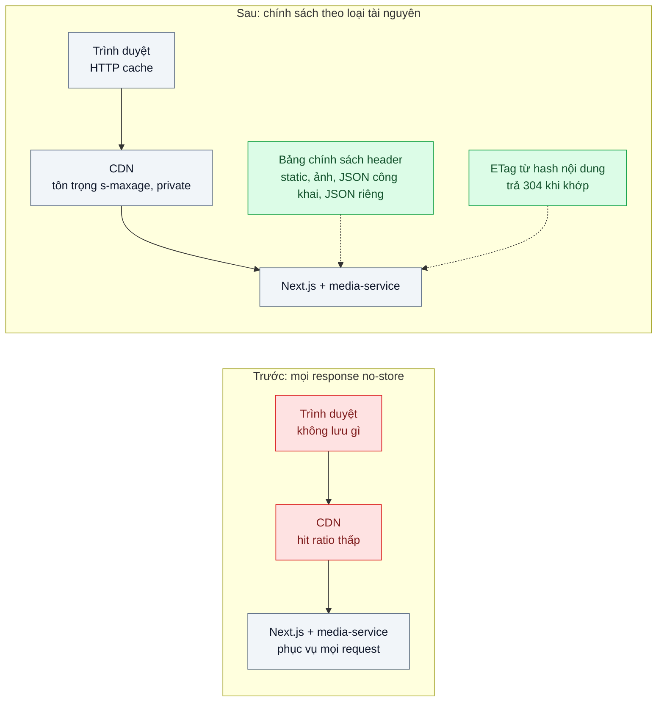
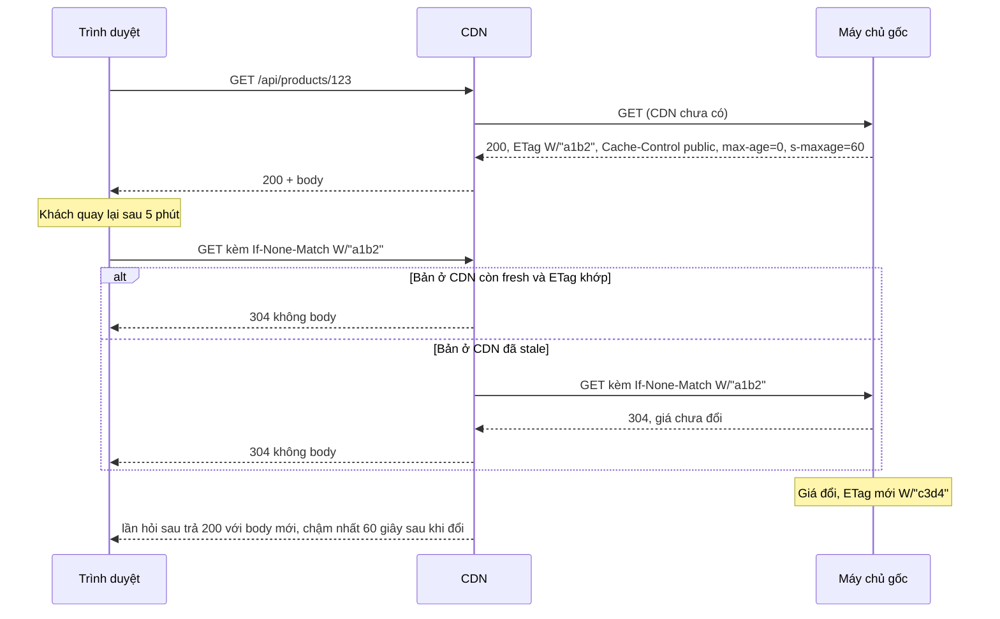

# HTTP Caching (Cache-Control, ETag) — Ảnh và JS tải lại mỗi lần, hóa đơn CDN tăng

| Scope | Mức độ | Trạng thái | Pattern gốc | Cập nhật |
|---|---|---|---|---|
| 04 · frontend / cache | 🟢 Cơ bản | ✅ Hoàn thành | HTTP Caching — RFC 9111 "HTTP Caching"; MDN "HTTP caching" | 2026-10-07 |

> **Một câu tóm tắt:** Gắn đúng `Cache-Control` cho từng loại tài nguyên và trả `ETag` để trình duyệt, CDN biết được giữ gì, giữ bao lâu và hỏi lại thế nào — thay vì tải lại toàn bộ ảnh, JS, JSON ở mỗi lượt xem.

## 1. Bài toán thực tế (What)

**Bối cảnh** *(doanh nghiệp giả định, số liệu minh họa)*
Sàn thương mại điện tử, web Next.js (App Router) đặt sau một CDN; ảnh sản phẩm do `media-service` trả qua `/media/:id/:size`. Trong một đợt rà soát bảo mật, ai đó đặt `Cache-Control: no-store` cho *mọi* response "cho chắc". Khoảng 70 % lượt truy cập là khách quay lại trong ngày, phần lớn trên 4G.

**Triệu chứng người kinh doanh nhìn thấy**
- Hóa đơn CDN và băng thông máy chủ gốc tăng gần gấp ba trong hai tháng dù lượng khách chỉ tăng nhẹ.
- Khách quay lại trang danh mục vẫn phải chờ ảnh hiện lần lượt như lần đầu; trên 4G trang mất 4–5 giây mới đầy đủ.
- Mỗi chiến dịch lớn, máy chủ gốc quá tải vì CDN gần như không chặn được request nào.

**Nguyên nhân kỹ thuật**
`no-store` cấm mọi tầng cache (trình duyệt, CDN) lưu response, nên mỗi lượt xem tải lại toàn bộ ảnh, JS, CSS và JSON từ máy chủ gốc. Không có `ETag`/`Last-Modified` nên cũng không thể hỏi lại rẻ ("bản tôi có còn đúng không?") để nhận `304 Not Modified` không body. CDN chỉ còn là đường ống đắt tiền.

**Ràng buộc**
- Dữ liệu riêng của khách (giỏ hàng, đơn hàng, thông tin tài khoản) tuyệt đối không được lưu ở CDN dùng chung.
- Giá trong JSON trang sản phẩm phải mới trong vòng 1 phút; ảnh sản phẩm thay đổi rất hiếm.
- Không đổi nhà cung cấp CDN; cấu hình phải nằm ở máy chủ gốc để chạy được với mọi CDN chuẩn.

## 2. Vì sao dùng pattern này (Why)

**Nguyên nhân gốc mà pattern nhắm vào:** máy chủ gốc không nói cho các tầng cache biết response nào được lưu, lưu ở đâu và bao lâu.

**Pattern giải quyết thế nào:** RFC 9111 định nghĩa cách một response trở thành *fresh* (dùng lại không cần hỏi) trong thời gian `max-age` (hoặc `s-maxage` cho cache dùng chung như CDN), sau đó thành *stale* và phải *validate* lại bằng request có điều kiện. RFC 9110 định nghĩa validator: `ETag` + `If-None-Match`, `Last-Modified` + `If-Modified-Since`; nếu không đổi, máy chủ trả `304` không body. `private` cấm cache dùng chung lưu response, `no-cache` cho phép lưu nhưng bắt hỏi lại mỗi lần, `no-store` cấm lưu. Ghép lại thành một **bảng chính sách theo loại tài nguyên**: file tĩnh có hash lưu một năm; ảnh lưu một ngày ở trình duyệt, lâu hơn ở CDN; JSON công khai lưu ngắn có ETag; dữ liệu cá nhân `private, no-cache` kèm ETag.

**Lựa chọn khác đã cân nhắc**

| Lựa chọn | Giải quyết được gì | Vì sao không chọn (ở bài này) |
|---|---|---|
| Giữ nguyên + tối ưu nhỏ (nén ảnh, bật Brotli, mua gói CDN lớn) | Giảm byte mỗi request | Số request và lượt tải lại không đổi; chi phí vẫn tăng theo lượt xem |
| Cấu hình cache ở bảng điều khiển CDN, bỏ qua header gốc | CDN chặn được nhiều request | Phụ thuộc nhà cung cấp; trình duyệt vẫn tải lại; dễ cache nhầm dữ liệu cá nhân |
| Service Worker tự cache (bài 06) | Kiểm soát chi tiết, chạy offline | Quá tay cho vấn đề header; SW vẫn cần header đúng để làm mới |
| Cache dữ liệu trong app (bài 03) | Không tải lại JSON khi điều hướng | Không giúp ảnh, JS, CSS và không giảm tải CDN |

## 3. Thiết kế hệ thống (How)

### 3.1 Kiến trúc trước và sau



### 3.2 Luồng chính



### 3.3 Thành phần và trách nhiệm

| Thành phần | Trách nhiệm | Quyết định thiết kế đáng chú ý |
|---|---|---|
| File tĩnh có hash (`/_next/static/...`) | JS, CSS, font | `public, max-age=31536000, immutable` — chi tiết ở bài 02 |
| Ảnh sản phẩm `/media/:id/:size` | Ảnh theo kích cỡ | `public, max-age=86400, s-maxage=604800`; URL đổi khi ảnh đổi |
| JSON công khai (sản phẩm, danh mục) | Dữ liệu chung cho mọi khách | `public, max-age=0, s-maxage=60` + `ETag`; CDN giữ 60 giây, trình duyệt luôn hỏi lại |
| JSON cá nhân (giỏ, đơn, tài khoản) | Dữ liệu riêng | Kế hoạch: `private, no-cache` + `ETag`. Khi làm: `private, no-store` (lý do ở mục 4); không bao giờ `public`, route có guard bị ép `private` dù khai báo gì |
| HTML trang | Tham chiếu tới file tĩnh mới | `no-cache` để luôn nhận HTML trỏ đúng bản JS mới; ETag do Next tự sinh cho HTML dựng sẵn |
| Middleware tạo ETag | Hash nội dung response | ETag yếu (`W/`) từ hash JSON trước khi nén, giống nhau giữa mọi instance (lab: SHA-256 của JSON trong interceptor, của file với ảnh) |
| `Vary` | Khóa cache theo header ảnh hưởng nội dung | `Vary: Accept-Encoding`; `Vary: Accept` nếu trả WebP/AVIF theo trình duyệt (lab: ảnh trả WebP hoặc JPEG theo `Accept`; Next tự đặt `Vary: Accept-Encoding` cho HTML/JS đã nén) |
| Lỗi (400, 401, 404) | Không để cache dùng chung giữ lỗi | `no-store` cho mọi response từ lúc request vào; chính sách của route chỉ áp khi handler trả thành công |

### 3.4 Điểm dễ sai khi triển khai
- **Nhầm `no-cache` với `no-store`.** `no-cache` vẫn lưu và hỏi lại (rẻ nhờ `304`); `no-store` không lưu gì. Phần lớn trường hợp "đừng dùng bản cũ" cần `no-cache`.
- **`public` cho response có dữ liệu cá nhân.** CDN có thể phục vụ giỏ hàng của người này cho người khác. Mặc định an toàn: route có xác thực luôn `private`.
- **ETag khác nhau giữa các instance.** ETag sinh từ thời gian sửa file hoặc id tiến trình làm mỗi máy một ETag, `304` không bao giờ xảy ra; sinh từ hash nội dung.
- **`max-age` dài cho URL không có hash.** Không cách nào bắt trình duyệt bỏ bản cũ trước khi hết hạn; đó là bài 02.
- **Thiếu `Vary` khi nội dung đổi theo header.** Trình duyệt không hỗ trợ WebP nhận nhầm bản WebP từ CDN.
- **`Set-Cookie` trên response tĩnh.** Nhiều CDN mặc định không lưu response có `Set-Cookie`; tách cookie khỏi route tài nguyên.

**Gặp thật khi làm lab** (đã kiểm, xem mục 5.1):
- **Nginx `proxy_cache` không chuyển `If-None-Match` của trình duyệt về máy gốc.** Nó chỉ tự trả `304` từ bản đã lưu. Với response nó không lưu được (`no-cache`, `private`, `no-store`), client gửi `If-None-Match` vẫn nhận `200` đủ body (thử với máy gốc tối giản rồi với chính lab). Hệ quả ở lab: HTML `no-cache` đi qua CDN này luôn là `200` khoảng 2,6 KB và luôn tới máy gốc. `ETag` của JSON riêng cũng không tạo được `304` nào qua CDN.
- **Next.js không cho `next.config` ghi đè `Cache-Control` của `/_next/static`.** Next luôn đặt `public, max-age=31536000, immutable`. Muốn tái hiện "JS tải lại mỗi lần" thì phải có một lớp đứng trước Next ghi đè header (lab: custom server chặn `writeHead`). Ngược lại, HTML dựng sẵn mặc định mang `s-maxage=31536000` nếu không có luật `headers()`: cache dùng chung được phép giữ HTML một năm (phép thử âm `html-khong-chinh-sach`).
- **Express tự sinh ETag yếu cho mọi `res.send` và tự trả `304`** qua gói `fresh`. Lab tắt `app.set('etag', false)` để ETag chỉ đến từ bảng chính sách. `fresh` coi request có `Cache-Control: no-cache` là yêu cầu tải lại nên trả `200`, mà `fetch()` của Node (undici, theo đặc tả Fetch) tự thêm `Cache-Control: no-cache` và `Pragma: no-cache` khi mình tự đặt `If-None-Match`. Test request có điều kiện viết bằng `fetch()` vì vậy đỏ dù server đúng. Lab dùng `node:http` hoặc supertest.
- **`If-None-Match: *` khớp mọi bản đang có** (RFC 9110), nên Express trả `304` cả khi response không có ETag. Muốn chứng minh "không có validator" thì gửi một ETag cụ thể.
- **Lỗi mang chính sách của route.** Interceptor đặt `Cache-Control` trước khi chạy handler (route ảnh tự gửi response bằng `@Res()`). Nếu không đặt lại `no-store` khi handler ném lỗi, `404` của `/api/products/9999` mang `public, s-maxage=60` và CDN giữ lỗi đó cho mọi người.
- **ETag file tĩnh của Next tính từ kích thước và thời gian sửa file** (`W/"1b7d2-1a116c37d94"`), nên hai máy build riêng có ETag khác nhau. Ở đây vô hại vì file băm tên là `immutable`, không ai hỏi lại.
- **Body không đọc làm request treo.** Component gọi `/api/cart/summary` lúc đầu không đọc body của response `401`, nên Chrome giữ request mở và trang không bao giờ "mạng im". Thẻ `<script noModule>` (polyfill) có trong HTML nhưng Chrome không tải. k6 tải thẻ này cho tới khi phép đối chiếu với Chrome chỉ ra.

## 4. Tech stack và tác động (Impact techstack)

| Lớp | Công nghệ chọn | Vì sao chọn | Thay thế tương đương |
|---|---|---|---|
| Web | Next.js (App Router), TypeScript strict | Mặc định của scope; `headers()` trong `next.config` và route handler đặt header theo route | Remix, Vite + Express |
| API ảnh và JSON | NestJS trên Node 20+ | Trùng stack repo; interceptor đặt `Cache-Control`, `ETag` tập trung | Fastify |
| CDN mô phỏng | Nginx `proxy_cache` | Chạy local, log được `$upstream_cache_status` (HIT/MISS/REVALIDATED) | Varnish, CDN thật ở môi trường thử |
| Đo phía trình duyệt | Chrome DevTools Network, Lighthouse | Cột "Transferred" phân biệt tải từ cache và từ mạng; audit chính sách cache | WebPageTest |
| Đo tải gốc | k6 + log Nginx | Đếm request tới máy chủ gốc khi có/không có chính sách | GoAccess để đọc log |

**Khi thực hành:** Next.js 16.4.0 (App Router, build bằng Turbopack) chạy bản production qua custom server `web/server.ts` ở cổng 3200. API và media-service là một app NestJS 10.4.22 (`@nestjs/platform-express`, Express 4) ở 3100. CDN mô phỏng là Nginx 1.30.5 ở cổng host 58088, gọi hai máy gốc trên host qua `host.docker.internal`; image `nginx:1.30.5` cùng digest với tag `stable` lúc làm, ghim để chạy lại ra cùng bản. Cấu hình Nginx không có `proxy_cache_valid` hay `proxy_ignore_headers`, nên Nginx chỉ lưu theo header của máy gốc; bộ nhớ cache nằm trên tmpfs. Lab không có PostgreSQL: catalog 96 sản phẩm (4 danh mục × 24), giỏ hàng và phiên nằm trong bộ nhớ, vì bài đo header chứ không đo truy vấn. Ảnh sinh sẵn bằng `sharp` 0.35.5 (`pnpm media:seed`, tất định), mỗi sản phẩm 2 cỡ × WebP/JPEG. Thumb 480 px khoảng 24 KB WebP, 32 KB JPEG.

Hai bản phục vụ cùng URL vì CDN và trình duyệt cần cùng đường dẫn; biến `CACHE_MODE=truoc|sau` chọn bản lúc bật tiến trình. Custom server của Next làm hai việc: ghi log truy cập để đếm request tới máy gốc, và tái hiện hiện trạng. Next không cho `next.config` ghi đè `Cache-Control` của `/_next/static` (mục 3.4), nên bản trước ép `no-store` bằng cách chặn `writeHead`, như một lớp "bảo mật" đứng trước Next. Bản trước còn có một lỗi dựng có chủ đích: `GET /api/cart/summary` (số trên icon giỏ hàng) mang `public, max-age=30`, như thể ai đó "tối ưu" route gọi ở mọi trang.

JSON cá nhân dùng `private, no-store` thay cho `private, no-cache` + ETag của kế hoạch. Đề bài thực hành yêu cầu `private, no-store` cho route có xác thực, và lab đã kiểm rằng Nginx `proxy_cache` không chuyển `If-None-Match` về máy gốc với response không lưu được, nên ETag của JSON riêng không tạo ra `304` nào qua CDN này. `no-store` còn giữ dữ liệu riêng khỏi đĩa của máy dùng chung.

Đo phía trình duyệt dùng Google Chrome 154.0.8037.98 đã cài sẵn, chạy headless với profile tạm, không tải Chromium. Byte "Transferred" đo bằng Playwright 1.63.0 (`playwright-core`, `channel: 'chrome'`), đọc CDP `Network.*` thay cho bấm tay DevTools. LCP đo bằng Lighthouse 12.8.2 qua `chrome-launcher` 1.2.2 trỏ vào Chrome hệ thống; Lighthouse 13 đòi Node ≥ 22.19 nên lab dùng bản 12. k6 không có HTTP cache, nên mỗi khách ảo mang một cache riêng rút gọn từ RFC 9111 (`bench/browser-cache.js`). Quyết định của cache này đã được so từng request với Chrome thật (mục 5.1). TypeScript 5.9.3; mọi tham số constructor có `@Inject(...)` tường minh (nhật ký quyết định, bài 08/01).

**Thay đổi so với hệ thống hiện tại:** thay header `no-store` toàn cục bằng bảng chính sách theo route; thêm middleware ETag; rà soát mọi route có xác thực để chắc chắn là `private`. Đội vận hành học đọc trạng thái cache ở log CDN và biết rằng "xóa cache CDN" không xóa được cache trình duyệt.

## 5. Kết quả đầu ra và cách đo (Output impact)

| Chỉ số | Trước (minh họa) | Mục tiêu khi thực hành | Cách đo |
|---|---|---|---|
| Byte tải qua mạng ở lượt xem lặp lại trang danh mục | 2,4 MB | ≤ 200 KB | DevTools Network, cột "Transferred", tắt "Disable cache", 3 lần đo |
| Tỷ lệ HIT của CDN mô phỏng | 12 % | ≥ 85 % cho ảnh và file tĩnh | Đếm `$upstream_cache_status` trong log Nginx sau lượt k6 |
| Request tới máy chủ gốc mỗi phút cùng tải | 30.000 | ≤ 5.000 | Log truy cập của Next.js và `media-service` |
| Tỷ lệ response 304 trên JSON công khai | 0 % | ≥ 60 % ở lượt xem lặp lại | Log Nginx theo mã trạng thái |
| LCP lượt xem lặp lại, mạng 4G mô phỏng | 4,5 giây | ≤ 2,0 giây | Lighthouse throttling mặc định, trung vị 5 lần |
| Số route có xác thực trả `public` | chưa rà | 0 | Test tích hợp quét mọi route có guard |

> Số "trước" là minh họa để hình dung bài toán. Số "mục tiêu" chỉ được coi là đạt khi có số đo thật
> ở mục 8 kèm môi trường đo.

**Tác động nghiệp vụ mong đợi:** chi phí CDN và máy chủ gốc tăng theo nội dung mới chứ không theo lượt xem lặp lại; khách quay lại thấy trang hiện gần như tức thì.

### 5.1 Số đã đo

**Môi trường:** MacBook Apple M1 Pro (8 nhân, macOS 26.6.2 / Darwin 25.6.0). Docker 28.5.1 có 8 CPU, khoảng 7,6 GB RAM. Nginx 1.30.5 (`nginx:1.30.5`, 8 worker). Node v20.19.6, pnpm 10.32.0. Next.js 16.4.0, React 19.3.0, NestJS 10.4.22, Vitest 5.0.3, k6 v1.4.2. Google Chrome 154.0.8037.98 headless, qua Playwright 1.63.0 và Lighthouse 12.8.2. API, trang, k6 và Chrome chạy trên host; CDN gọi máy gốc qua `host.docker.internal`. Máy chạy cùng lúc container của dự án khác (MySQL, RabbitMQ), Chrome của người dùng và `mediaanalysisd` của macOS (khoảng 90 % một nhân lúc kiểm). Load 1 phút của macOS trong các lượt tải là 3,4 – 12,1; máy ảo Docker 0,9 – 2,1, bận 1,3 – 4,6 % CPU. Số thô ở `bench/results/main/` (không commit). Lượt chạy lại từ volume sạch ở `bench/results/recheck/`.

**Trang đo:** `/danh-muc/dien-thoai` có 34 request: HTML, 7 file `/_next/static` (CSS + JS), JSON danh sách, JSON giỏ hàng (khách đã đăng nhập) và 24 ảnh thumb. Lượt xem đầu ở bản trước gồm HTML 2.610 B, file tĩnh 139.402 B (đã gzip), JSON 4.629 B và ảnh 585.330 B. Trang dựng sẵn lúc build; danh sách và giá lấy bằng `fetch` trên trình duyệt, nên LCP (ảnh đầu tiên) đi qua chuỗi HTML → JS → JSON → ảnh.

**Phía trình duyệt** (`bytes-*.json`: 3 lần, mỗi lần một browser context mới, tab 1 xem trang rồi đóng, tab 2 xem lại. `lcp.json`: 5 vòng, mỗi vòng một lượt lạnh, Lighthouse xóa cache, rồi một lượt lặp lại với `disableStorageReset`. Lighthouse dùng cấu hình mặc định: mobile 412×823, throttling `simulate` với RTT 150 ms, 1.638,4 Kbps, CPU chậm 4 lần). Số trong ngoặc là thấp nhất – cao nhất:

| Chỉ số | Trước | Sau |
|---|---|---|
| Byte "Transferred" lượt xem đầu (trung vị 3 lần) | 731.971 B | 734.494 B |
| **Byte "Transferred" lượt xem lặp lại** (trung vị 3 lần) | **731.711 B** (731.659 – 731.717) | **3.117 B** (cả 3 lần) |
| Request lượt lặp lại phải ra mạng | 33/34 (giỏ hàng lấy từ disk cache vì `public, max-age=30`) | 3/34: HTML `200` 2.633 B, giỏ hàng `200` 265 B, JSON danh sách `304` 219 B; 31 request từ disk cache |
| **LCP lượt lặp lại** (trung vị 5 lần) | **2.873 ms** (2.462 – 2.877) | **920 ms** (920 – 922) |
| FCP lượt lặp lại | 761 – 764 ms | 611 – 615 ms |
| LCP lượt lạnh, để tham khảo (trung vị 5 lần) | 2.871 ms (2.562 – 2.930) | 2.603 ms (2.525 – 2.740) |

Byte lượt xem đầu của bản sau nhiều hơn khoảng 2,5 KB, phần lớn do header `ETag`, `Vary` và `Cache-Control` dài hơn trên 34 response. Lighthouse tính cùng số byte cho lượt lặp lại (`transferSize`: 3.117 B ở bản sau, 31 request bằng 0; 731.685 – 731.752 B ở bản trước), khớp với Playwright.

**Đối chiếu k6 với Chrome** (`emulationCheck` trong `bytes-*.json`): chạy k6 với `CHECK=1` trên cùng trang, cùng chuỗi lượt đầu → lượt lặp lại, rồi so quyết định cho từng URL (dùng bản lưu, hỏi lại có điều kiện, hay tải mới). Cả hai bản khớp 34/34 URL ở lượt đầu và 34/34 ở lượt lặp lại. Lần đối chiếu đầu (lượt thử) lệch 2 URL: k6 tải `<script noModule>` mà Chrome bỏ qua, và Chrome xin `/favicon.ico` (404). Lab đã sửa bộ đọc HTML của k6 và khai icon `data:,` trong layout. Lab chỉ đối chiếu trang danh mục, chưa đối chiếu trang sản phẩm.

**Tải máy gốc và CDN** (`truoc.json`, `truoc-2.json`, `sau.json`; số theo phút trong `*-analysis.json`). k6 chạy mô hình mở 20 lượt xem/giây trong 6 phút, CDN trống lúc bắt đầu. Mỗi lượt xem tải đủ những gì Chrome tải; trang chọn đều trong 4 danh mục (60 %) và 96 sản phẩm (40 %). 70 % lượt xem là của khách đã ghé trong lượt đo, và khách đó dùng cache riêng của mình. Tốc độ 20 lượt xem/giây được chọn để bản trước gần 30.000 request/phút như bối cảnh minh họa. Cả ba lượt có `dropped_iterations` = 0. Bản trước có hai lượt: lượt đầu có 4 request lỗi (đoạn "Lỗi kết nối" dưới đây), nên lab chạy lại dưới tên `truoc-2` và giữ file cũ.

| Chỉ số | Trước (`truoc` / `truoc-2`) | Sau |
|---|---|---|
| Lượt xem; trong đó xem lại đúng trang đã xem | 7.200 / 7.201; 1.005 / 989 | 7.200; 1.007 |
| Request k6 gửi qua CDN | 176.519 / 176.537 | 122.312 (56.156 lần dùng bản lưu của trình duyệt) |
| **Request tới máy gốc mỗi phút, phút 2 – 6** (trung bình) | **28.706** (28.343 – 28.976) / **28.714** (28.378 – 28.976) | **2.486** (2.478 – 2.496) |
| … phút 1 (CDN trống) | 27.743 / 27.741 | 2.712 |
| … thành phần ở phút 2 | ảnh 17.944, file tĩnh 8.400, HTML 1.200, JSON công khai 1.200, giỏ 2 | HTML 1.200, giỏ 1.201, JSON công khai 94, ảnh 1 |
| **HIT của CDN, ảnh + file tĩnh** | **0 %** (0/156.868) / 0 % | **99,79 %** (100.500/100.712); từ phút 2: 100 % |
| … riêng ảnh / file tĩnh | 0 % / 0 % | 99,76 % (82.491/82.691) / 99,93 % (18.009/18.021) |
| **304 trên JSON công khai ở lượt xem lặp lại** | **0 %** (0/1.005) / 0 % (0/989) | **100 %** (1.007/1.007) |
| … trên mọi request JSON công khai | 0 % | 13,99 % (1.007/7.200); CDN: 6.669 HIT, 431 REVALIDATED, 100 MISS |
| Lượt xem hiện giỏ hàng của **khách khác** | 7.182/7.200 (99,75 %) / 7.180/7.201 | 0 |
| CPU tiến trình API / trang | 7,6 % / 37,7 % — 8,1 % / 39,9 % | 3,3 % / 7,9 % |
| Request lỗi | 4 / 1 | 1 |
| Load 1 phút macOS | 4,37 – 12,07 / 3,43 – 8,48 | 3,48 – 7,43 |

Ở bản sau, gần hết phần tải còn lại tới máy gốc là HTML và giỏ hàng: 2.401 trên 2.496 request ở phút 2, tức một HTML và một giỏ hàng cho mỗi lượt xem. HTML `no-cache` thì Nginx không lưu và không hỏi lại máy gốc bằng `If-None-Match`, nên khách nhận `200` đủ 2,6 KB (mục 3.4). Giỏ hàng là `private`. JSON công khai chỉ còn khoảng 100 URL, mỗi URL được hỏi lại máy gốc một lần trong mỗi 60 giây; 431 lần máy gốc trả `304`, và 100 lần CDN chưa có bản lưu. Ở bản trước, 5.239 lượt giỏ hàng là `HIT` ở CDN, trả giỏ của khách khác. Cộng thêm các lượt trình duyệt dùng lại bản đã lưu (cũng là bản lấy từ CDN), 99,75 % lượt xem hiện sai giỏ.

**Lỗi kết nối tới máy gốc:** 6 request trên ba lượt (4 + 1 ở bản trước, 1 ở bản sau) nhận `504`/`499` sau đúng 60 giây. Nginx ghi `upstream timed out (110: Connection timed out) while connecting to upstream` tới `192.168.65.254:3100`, và request không xuất hiện trong log của máy gốc. Lượt chẩn đoán 3 phút ở bản trước có ghi thêm `$upstream_connect_time` (`bench/results/trial/diag-truoc-cdn.log`): Nginx mở 367 kết nối mới tới máy gốc, 366 kết nối xong dưới 100 ms, 1 kết nối treo tới hết 60 giây, và không có kết nối nào chậm vừa phải. Lab chưa tách riêng được nguyên nhân: có thể ở đường `host.docker.internal` của Docker Desktop, có thể ở hàng đợi `listen` 128 của macOS (`kern.ipc.somaxconn`), có thể ở chỗ khác. Lỗi chiếm 0,0006 – 0,002 % request và không đổi kết luận về số đếm.

**Số route có xác thực trả `public`** (`route-scan.json`, cùng hàm quét với test): mỗi bản có 10 route, 6 route có guard, mỗi route gọi hai lần (đăng nhập và chưa đăng nhập), tổng 12 lượt gọi. Bản trước vi phạm 1 route: `GET /api/cart/summary` khi đã đăng nhập trả `public, max-age=30`. Bản sau vi phạm 0.

**Độ mới của giá qua CDN** (`freshness-sau.json`): đổi giá 5, 30 và 55 giây sau khi CDN lưu bản mới, rồi hỏi qua CDN mỗi 250 ms. Giá mới hiện sau 55,8 / 31,0 / 5,9 giây, lần nào cũng nhờ CDN lấy lại từ máy gốc khi bản lưu hết hạn (`EXPIRED`). Bản trước thấy giá mới ngay (0,0 giây), vì không có gì được lưu.

**Test và phép thử âm** (`tests.json`, `negative-drills.json`): 25 test trong 7 file, chạy trên Nginx thật và các tiến trình máy gốc thật. Mỗi phép thử âm sửa mã nguồn tạm thời, chạy các file test liên quan, khôi phục rồi so lại nội dung file. Lượt trước khi sửa và lượt sau khi khôi phục đều xanh hết, và mọi lượt đã sửa có số test > 0.

| Gỡ phần nào của pattern | Test đỏ | Test báo gì |
|---|---|---|
| ETag của JSON công khai | 5/13 | không có ETag, không có `304`, cả ở máy gốc lẫn ở CDN |
| ETag chỉ từ nội dung (thêm pid vào hash) | 4/8 | hai instance trả ETag khác nhau, ETag của instance A không làm B trả `304`. Test 304 trong một tiến trình vẫn xanh |
| Lớp ép `private` + khai báo `public-json` cho giỏ hàng | 2/6 | phép quét thấy route vi phạm; qua CDN khách 1002 nhận giỏ của khách 1001 |
| Chỉ khai báo `public-json` cho giỏ hàng, giữ lớp ép `private` | 0/6 (đúng kỳ vọng) | lớp ép `private` vẫn giữ: không lộ giỏ |
| `Vary: Accept` của ảnh | 2/9 | trình duyệt chỉ nhận JPEG được CDN trả bản WebP (`HIT`) |
| Đặt lại `no-store` khi handler lỗi | 1/5 | `404` mang `public, max-age=0, s-maxage=60` |
| Luật `headers()` cho HTML trong `next.config.ts` | 2/6 | HTML về mặc định của Next: `s-maxage=31536000` |

**So với mục tiêu** (bản sau):
- Byte lượt xem lặp lại: 3.117 B, **đạt** (≤ 200 KB). Bản trước là 731.711 B, không phải 2,4 MB như số minh họa, vì trang lab nhỏ hơn.
- HIT của CDN cho ảnh và file tĩnh: 99,79 % cả lượt, 100 % từ phút 2, **đạt** (≥ 85 %). Bản trước là 0 %.
- Request tới máy gốc: 2.486/phút, **đạt** (≤ 5.000), giảm khoảng 91 % so với 28.706. Mức sàn là 2 request mỗi lượt xem (HTML và giỏ hàng), nên con số này tăng theo số lượt xem.
- 304 trên JSON công khai ở lượt xem lặp lại: 100 %, **đạt** (≥ 60 %). Tính trên mọi request JSON công khai chỉ 13,99 %, vì phần lớn lượt xem trong kịch bản là lượt đầu của khách ở trang đó.
- LCP lượt lặp lại: 920 ms, **đạt** (≤ 2,0 s). Bản trước là 2.873 ms, không phải 4,5 giây như số minh họa. Lượt lạnh của hai bản gần nhau (2.871 so với 2.603 ms).
- Số route có xác thực trả `public`: 0, **đạt**. Bản trước có 1 route, do lab dựng có chủ đích.

**Chạy lại từ volume sạch** (`bench/results/recheck/`, theo "Cách chạy" ở mục 8, các lượt ngắn hơn). Các bước: `docker compose down -v`, xóa `node_modules`, `.data` và `web/.next`, rồi `docker compose up -d --wait`, `pnpm install`, `pnpm test`. 25/25 test xanh trong 48 giây, gồm cả sinh 384 ảnh (hash tổng `2cc9b705c1f6bedc`, giống lượt chính) và build Next; `pnpm typecheck` sạch. Kết quả, bản trước so với bản sau:
- Byte lượt xem lặp lại: 731.697 B so với 3.124 B (3.119 – 3.124 B; HTML của bản build mới khác vài byte). k6 khớp Chrome 34/34 URL ở cả hai lượt.
- LCP lượt lặp lại (2 vòng): 2.797 ms so với 921 ms.
- Tải 3 phút: request tới máy gốc ở phút 2 – 3 là 28.666 so với 2.494 mỗi phút. HIT của ảnh + file tĩnh 0 % so với 99,62 % (100 % từ phút 2). 304 ở lượt xem lặp lại 0/439 so với 421/421. Lượt xem lộ giỏ 3.592/3.601 so với 0. Cả hai lượt có 0 lỗi, 0 lượt bỏ.
- Phép quét route: 1 so với 0. Đổi giá 50 giây sau khi CDN lưu: giá mới hiện sau 10,5 giây.
- 7 phép thử âm cho cùng kết quả như lượt chính.


## 6. Đánh đổi và khi KHÔNG nên dùng

**Đánh đổi**
- Dữ liệu có thể cũ trong khoảng `max-age`/`s-maxage`; mỗi loại tài nguyên cần thỏa thuận độ cũ với nghiệp vụ.
- Cache trình duyệt không thể xóa từ xa; chọn sai `max-age` cho URL cố định là phải chờ hết hạn.
- Thêm một lớp quy tắc phải rà khi thêm route mới; thiếu kỷ luật là quay lại cache nhầm dữ liệu cá nhân.

**Không nên dùng khi**
- Response chứa dữ liệu nhạy cảm cần biến mất khỏi máy sau phiên (ngân hàng, y tế): dùng `no-store` có chủ đích.
- Dữ liệu đổi từng giây và phải luôn mới (giá đấu giá trực tiếp): dùng realtime (scope 06) thay vì cache HTTP.
- Nội dung hoàn toàn cá nhân hóa và hiếm khi xem lại: ETag vẫn được, nhưng đừng kỳ vọng hit ratio.

**Liên quan**
- Đọc sau: [02 — Cache Busting](../02-cache-busting-deploy-xong-user-van-chay-js-cu/), [03 — Stale-While-Revalidate](../03-stale-while-revalidate-quay-lai-trang-lai-thay-loading/), [06 — Service Worker](../06-service-worker-shipper-mat-mang-van-xem-don/).
- Cùng chủ đề: [03-01 — Cache-Aside](../../03-backend-cache/01-cache-aside-trang-san-pham-doc-10k-lan-phut/) — tầng cache sau CDN; [01-01 — Contract-First API](../../01-frontend-backend-transporter/01-contract-first-openapi-frontend-goi-sai-ten-truong/) — ETag là một phần của hợp đồng API; [15-05 — Private Content via Signed CDN URLs](../../15-backend-storage/05-signed-cdn-url-hop-dong-rieng-tu-bi-share-link/).

## 7. Cơ sở tham khảo

- RFC 9111, *HTTP Caching*, IETF, 2022 — https://www.rfc-editor.org/rfc/rfc9111 — định nghĩa fresh/stale, `max-age`, `s-maxage`, `private`, `no-cache`, `no-store`, cache dùng chung và cache riêng.
- RFC 9110, *HTTP Semantics*, IETF, 2022 — https://www.rfc-editor.org/rfc/rfc9110 — validator `ETag`/`Last-Modified`, request có điều kiện, mã `304 Not Modified`, `Vary`.
- MDN Web Docs, "HTTP caching" — https://developer.mozilla.org/docs/Web/HTTP/Caching — giải thích thực hành và các mẫu cấu hình theo loại tài nguyên.
- Next.js docs — https://nextjs.org/docs — cấu hình `headers` trong `next.config` và header mặc định cho file tĩnh.
- NGINX docs, `ngx_http_proxy_module` (`proxy_cache`) — https://nginx.org/en/docs/ — dựng CDN mô phỏng và biến `$upstream_cache_status`.

## 8. Kế hoạch thực hành

- [x] Bước 1: dựng Next.js 16 (trang danh mục, trang sản phẩm), NestJS 10 (`/api/products`, `/media/:id/:size`, các route có guard) và Nginx `proxy_cache` làm CDN. Bản trước có mọi response `no-store` như hiện trạng, cộng một route giỏ hàng lỡ `public`.
- [x] Bước 2: đo "trước": byte lượt xem lặp lại (Playwright, Chrome thật), LCP (Lighthouse 4G mô phỏng), tải k6 qua CDN để đếm request tới máy gốc.
- [x] Bước 3: áp bảng chính sách header theo loại tài nguyên (`src/sau/cache-policy.ts`), interceptor đặt `Cache-Control` và ETag yếu từ hash nội dung, `Vary: Accept` cho ảnh, `headers()` cho HTML trong `next.config.ts`. Route có guard bị ép `private`.
- [x] Bước 4: đo "sau" cùng kịch bản; số thật và môi trường ở mục 5.1.
- [x] Bước 5: test (a) `If-None-Match` đúng nhận `304` không body; (b) mọi route có guard trả `private`/`no-store` (quét từ metadata); (c) hai instance (hai tiến trình) trả cùng ETag; (d) qua CDN mô phỏng, khách B không bao giờ nhận giỏ hàng của khách A. Thêm 7 phép thử âm.

**Cấu trúc code**
```text
src/                                  # API + media-service (NestJS), cổng 3100
  sau/cache-policy.ts                 # [PATTERN] bảng chính sách theo loại tài nguyên + ETag yếu từ SHA-256 nội dung
  sau/http-cache.interceptor.ts       # [PATTERN] áp chính sách; route có guard luôn private; lỗi về no-store
  sau/catalog.controller.ts           # /api/products (public-json), /media/:id/:size (media, Vary: Accept, ETag)
  sau/account.controller.ts           # /api/cart, /api/cart/summary, /api/cart/items, /api/orders, /api/account (guard)
  truoc/                              # cùng route, không chính sách; giỏ hàng lỡ `public, max-age=30`
  shared/http.ts                      # tắt ETag tự sinh của Express, no-store mặc định, log truy cập; còn lại: catalog,
                                      # giỏ hàng, ảnh, guard, phiên. app.ts, main.ts: CACHE_MODE=truoc|sau, cùng URL
web/                                  # Next.js 16 App Router, cổng 3200
  next.config.ts                      # [PATTERN] headers(): HTML no-cache; generateEtags
  server.ts                           # custom server: log truy cập; bản trước ép no-store mọi response (kể cả /_next/static)
  app/danh-muc/[slug], app/san-pham/[id], catalog-grid.tsx, cart-badge.tsx, ...
nginx/cdn.conf                        # CDN mô phỏng: proxy_cache chỉ theo header máy gốc, log JSON $upstream_cache_status
tools/generate-media.ts               # sinh 384 ảnh tất định (sharp) vào .data/media
test/                                 # policy-by-resource-type, conditional-request-returns-304, two-instances-same-etag,
                                      # authenticated-routes-are-private (quét route từ metadata), next-headers,
                                      # cdn-never-serves-other-users-cart, cdn-vary-and-revalidation (qua Nginx thật)
bench/                                # repeat-visit.k6.js + browser-cache.js (cache riêng của mỗi khách), run-load/analyze-load,
                                      # browser-bytes (CDP + đối chiếu k6 với Chrome), lighthouse-lcp, route-scan,
                                      # price-freshness, negative-drills, lib
docker-compose.yml                    # nginx:1.30.5, cổng 58088, cache trên tmpfs
```

**Cách chạy**
```bash
cd 04-frontend-cache/01-http-cache-headers-anh-san-pham-tai-lai-moi-lan
docker compose up -d --wait        # (hoặc pnpm cdn:up) CDN mô phỏng ở http://127.0.0.1:58088
pnpm install
pnpm test                          # 25 test; lần đầu tự sinh ảnh (khoảng 30 giây) và build Next (khoảng 5 giây)
pnpm typecheck                     # tsc cho API/test/bench và cho web/ (cần web/.next từ lần build)
# Xem trang qua CDN: bật hai máy gốc (mỗi lệnh một terminal) rồi mở http://127.0.0.1:58088/danh-muc/dien-thoai
CACHE_MODE=sau pnpm api            # API + media-service ở 3100 (CACHE_MODE=truoc để xem hiện trạng)
CACHE_MODE=sau pnpm web            # trang ở 3200 (cần pnpm web:build; pnpm test đã build)
# Đo: script tự bật/tắt máy gốc và làm trống CDN, nên tắt `pnpm api`/`pnpm web` trước. Kết quả ở bench/results/$RUN/
# (không commit). Đừng chạy hai lượt đo cùng lúc, đừng sửa code khi bench:drills đang chạy.
RUN=main pnpm bench:routes                                              # số route có guard trả public, hai bản
RUN=main RUNS=3 pnpm bench:bytes                                        # byte Transferred + đối chiếu k6 với Chrome
RUN=main ROUNDS=5 pnpm bench:lcp                                        # LCP Lighthouse, lượt lạnh và lượt lặp lại
RUN=main NAME=truoc MODE=truoc VIEWS_PER_S=20 DURATION_S=360 pnpm bench:load
RUN=main NAME=sau MODE=sau VIEWS_PER_S=20 DURATION_S=360 pnpm bench:load
RUN=main MODE=sau OFFSETS=5,30,55 pnpm bench:freshness                  # giá mới qua CDN sau bao lâu
RUN=main pnpm bench:drills                                              # phép thử âm: sửa mã nguồn tạm rồi khôi phục
RUN=main NAME=sau pnpm tsx bench/analyze-load.ts                        # tính lại chỉ số từ log thô của một lượt
docker compose down -v             # (hoặc pnpm cdn:down)
```

Nếu dùng `docker compose up -d` (không `--wait`), chờ container `healthy` rồi mới `pnpm test`. Test bật API ở 3100, 3101, 3102 và trang ở 3200 như tiến trình riêng, và báo lỗi rõ nếu cổng đang bận. `pnpm media:seed` và `pnpm web:build` chạy riêng được; `REBUILD_WEB=1 pnpm test` build lại Next trước khi test. Dừng `pnpm api`/`pnpm web` bằng Ctrl+C. Nếu chạy nền thì tắt bằng `pkill -f "src/main.ts"; pkill -f "web/server.ts"`, rồi kiểm `lsof -nP -iTCP:3100 -sTCP:LISTEN` và `lsof -nP -iTCP:3200 -sTCP:LISTEN`. Script đo dùng Google Chrome ở `/Applications/Google Chrome.app` (macOS) và không tải trình duyệt nào.

## Bài học sau khi làm

- **Chỉ đổi header ở máy gốc là đủ cho một CDN chuẩn.** Cấu hình Nginx giống hệt ở hai bản; bản sau chỉ đổi header ở máy gốc. Request tới máy gốc giảm từ 28.706 xuống 2.486 mỗi phút. Byte của lượt xem lặp lại giảm từ 731.711 B xuống 3.117 B, LCP lượt lặp lại giảm từ 2.873 xuống 920 ms. Lượt xem lạnh gần như không đổi (2.871 so với 2.603 ms), vì caching chỉ giúp từ lần thứ hai.
- **Phần tải còn lại tới máy gốc là thứ CDN không được lưu.** Ở bản sau, 2.401 trên 2.496 request mỗi phút là HTML `no-cache` và giỏ hàng `private`, tức 2 request cho mỗi lượt xem. Nginx không chuyển `If-None-Match` về máy gốc cho response không lưu được, nên HTML luôn là `200` đủ body. Muốn hạ tiếp phải cho CDN giữ HTML một lúc (`s-maxage` ngắn). Cách đó đụng tới chuyện "deploy xong vẫn chạy JS cũ" của bài 02, nên lab giữ `no-cache` như kế hoạch.
- **Một route `public` lỡ tay là đủ lộ dữ liệu riêng hàng loạt.** Ở bản trước, `public, max-age=30` trên số liệu icon giỏ hàng làm 99,75 % lượt xem hiện giỏ của khách khác. CDN không đưa cookie vào khóa cache, và trình duyệt còn giữ bản sai thêm 30 giây. Phép quét route từ metadata bắt được lỗi này. Lớp "route có guard luôn `private`" trong interceptor giữ được cả khi khai báo sai (phép thử âm 0/6 đỏ).
- **Mặc định của framework quyết định nhiều hơn tưởng.** Express tự sinh ETag và tự trả `304`. Next đặt `immutable` cho file băm tên và không cho ghi đè, nhưng lại cho HTML dựng sẵn `s-maxage=31536000` nếu không có luật `headers()`. Muốn biết response thật mang header gì thì phải đọc header thật, không đoán.
- **ETag phải sinh từ nội dung, và chỉ test hai instance mới bắt được lỗi này.** Thêm pid vào hash thì mọi test `304` trong một tiến trình vẫn xanh. Chỉ test hai tiến trình đỏ (4/8): ETag của instance A không làm instance B trả `304`.
- **k6 không có cache, nên số "khách quay lại" phụ thuộc vào cách mô phỏng cache.** Lab tự viết một cache riêng rút gọn và so với Chrome thật trước khi đo tải. Lần so đầu tiên tìm ra 2 chỗ lệch (`<script noModule>` và `/favicon.ico`); không so thì k6 tải thêm một file 39 KB ở mỗi lượt xem đầu. Chỉ số "304 ở lượt xem lặp lại" cũng phải định nghĩa là "xem lại đúng trang đã xem". Định nghĩa theo "khách quay lại" thì đa số là trang mới, và lượt thử đầu ra 17 % thay vì 100 %.
- **Lỗi gặp khi làm:** test request có điều kiện viết bằng `fetch()` đỏ dù server đúng, vì undici thêm `Cache-Control: no-cache` (mục 3.4). Test "bản trước không có validator" dùng `If-None-Match: *` và nhận `304`, vì `*` hợp lệ theo RFC 9110. Phép thử âm đầu tiên cho HTML đặt `headers: []` làm `next build` báo lỗi; script được sửa để luôn build lại sau khi khôi phục. Component giỏ hàng không đọc body của `401` làm trang không bao giờ "mạng im". Hàm băm trong k6 trả số âm (`^` của JS là int32 có dấu) làm iteration lỗi ở lượt thử. Bản đầu của phép tính theo phút bỏ mất phút thứ 6 khi lượt dài 359,9 giây; chỉ số được tính lại từ log thô vào `*-analysis.json`. Lượt tải bản trước đầu tiên có 4 lần nối tới máy gốc treo 60 giây; lab chạy lại thành `truoc-2` và giữ file cũ. Lỗi này còn gặp 1 lần ở `truoc-2` và 1 lần ở `sau`, nguyên nhân chưa tách riêng được (mục 5.1).
- **Hạn chế của số đo:** trang lab nhỏ, dựng sẵn, lấy dữ liệu bằng `fetch` phía trình duyệt; trang thật render phía server có chuỗi LCP khác. Ảnh là ảnh tổng hợp. LCP lấy từ mô phỏng Lantern của Lighthouse (`simulate`), không phải mạng 4G thật. Nginx không phải CDN thật: không gộp request trượt, không chuẩn hóa `Accept`/`Accept-Encoding` trong khóa, một điểm biên. Máy gốc, k6 và Chrome chạy chung laptop với ứng dụng khác (load 3,4 – 12,1). Tải chính 6 phút mỗi bản, chạy một lần (bản trước hai lần). Phân phối trang đều và tỉ lệ 70 % khách quay lại là giả định. Cache riêng của k6 chỉ được đối chiếu với Chrome trên trang danh mục. Lượt chạy lại từ volume sạch ngắn hơn: 3 phút tải, 2 vòng Lighthouse, 1 lần đo độ mới của giá.
