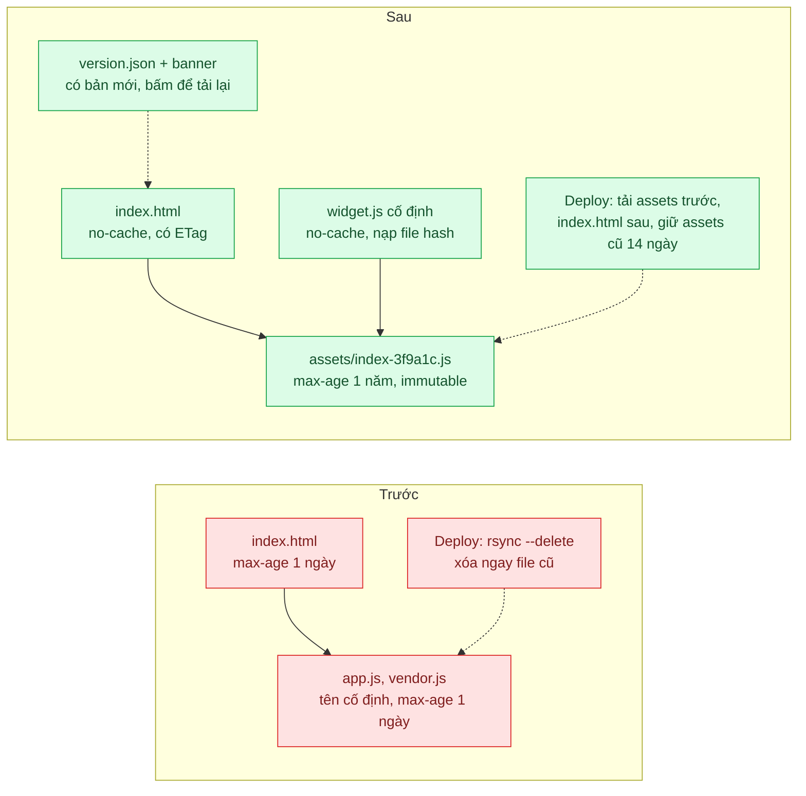
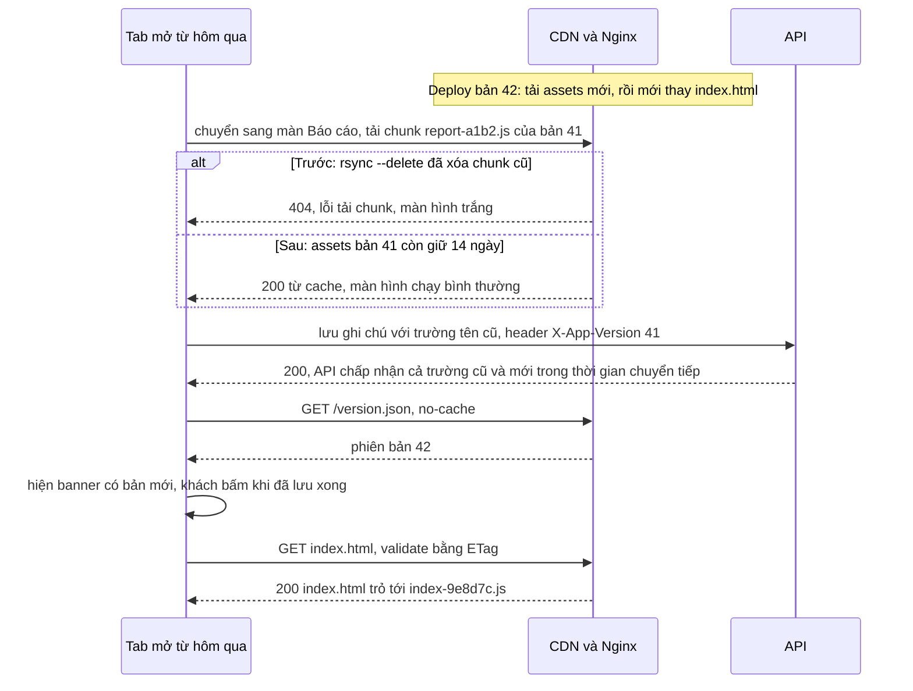

# Cache Busting (content hash + immutable) — Deploy xong, nửa người dùng vẫn chạy JS cũ gọi API mới

| Scope | Mức độ | Trạng thái | Pattern gốc | Cập nhật |
|---|---|---|---|---|
| 04 · frontend / cache | 🟢 Cơ bản | 📋 Kế hoạch | Cache Busting — RFC 9111; RFC 8246 (`immutable`); Next.js / Vite docs (hashed assets) | 2026-10-06 |

> **Một câu tóm tắt:** Đặt hash nội dung vào tên mọi file JS/CSS để mỗi phiên bản là một URL mới được cache vĩnh viễn, còn file HTML trỏ tới chúng thì luôn được hỏi lại — nên deploy xong là trình duyệt tự lấy đúng bản mới, không cần khách bấm Ctrl+F5.

## 1. Bài toán thực tế (What)

**Bối cảnh** *(doanh nghiệp giả định, số liệu minh họa)*
Công ty SaaS B2B bán phần mềm CRM cho khoảng 800 doanh nghiệp. Ứng dụng web là SPA React build bằng Vite, phục vụ tĩnh qua Nginx sau CDN. Vài năm trước, để đối tác nhúng widget bằng một đường dẫn cố định, đội đã tắt hash trong tên file: build ra `app.js`, `vendor.js`, `app.css`, tất cả kể cả `index.html` mang `Cache-Control: max-age=86400`. Deploy bằng `rsync --delete` thay toàn bộ thư mục. Mỗi tuần phát hành một lần.

**Triệu chứng người kinh doanh nhìn thấy**
- Sau mỗi đợt phát hành, hỗ trợ khách hàng nhận hàng chục ticket "màn hình trắng", "bấm Lưu không được"; câu trả lời quen thuộc là "anh chị bấm Ctrl+F5 giúp em".
- Sau đợt đổi API danh bạ, một nửa nhân viên kinh doanh của khách hàng mất dữ liệu ghi chú vì JS cũ gửi trường tên cũ, API mới bỏ qua.
- Đội sản phẩm né phát hành vào giờ làm việc, dồn vào tối thứ Sáu — rủi ro hơn và kỹ sư phải trực.

**Nguyên nhân kỹ thuật**
URL không đổi giữa hai phiên bản nên trình duyệt và CDN có quyền dùng bản cũ tới 24 giờ. Tệ hơn, mỗi file hết hạn ở thời điểm khác nhau: `index.html` cũ có thể chạy với `vendor.js` mới — hai nửa của hai bản build không khớp nhau, gây lỗi lúc chạy và màn hình trắng. Tab mở từ hôm trước đang chạy JS cũ gọi vào API đã đổi. `rsync --delete` xóa ngay các chunk tải lười của bản cũ, nên tab cũ chuyển màn hình là gặp lỗi tải chunk.

**Ràng buộc**
- Đối tác vẫn cần một URL cố định để nhúng widget.
- Không được ép tải lại trang khi người dùng đang nhập liệu dở (mất dữ liệu đang gõ).
- API phải phục vụ được JS của bản trước ít nhất trong thời gian chuyển tiếp.

## 2. Vì sao dùng pattern này (Why)

**Nguyên nhân gốc mà pattern nhắm vào:** cùng một URL mang nhiều nội dung theo thời gian, nên không tầng cache nào biết khi nào bản mình giữ đã sai.

**Pattern giải quyết thế nào:** đảo vấn đề: thay vì tìm cách *xóa* cache, làm cho mỗi nội dung có URL riêng. Bundler đặt hash của nội dung vào tên file (`assets/index-3f9a1c.js`); nội dung đổi thì tên đổi, nội dung không đổi thì tên giữ nguyên và cache cũ vẫn dùng được. Vì URL có hash *không bao giờ* đổi nội dung, có thể trả `Cache-Control: public, max-age=31536000, immutable`; RFC 8246 định nghĩa `immutable` để báo rằng response sẽ không đổi trong thời gian fresh, trình duyệt hỗ trợ không cần hỏi lại kể cả khi người dùng bấm tải lại. Chỉ file vào cửa — `index.html` — giữ URL cố định và mang `no-cache` để luôn được validate (RFC 9111), nhờ đó nó luôn trỏ tới bộ file hash của bản mới nhất. Vite làm hash mặc định; Next.js tự phục vụ `/_next/static` với hash và header tương tự.

**Lựa chọn khác đã cân nhắc**

| Lựa chọn | Giải quyết được gì | Vì sao không chọn (ở bài này) |
|---|---|---|
| Giữ nguyên + tối ưu nhỏ (hạ `max-age` còn 5 phút) | Rút thời gian chạy bản cũ | Vẫn có cửa sổ lệch phiên bản; mọi lượt xem phải tải lại hoặc hỏi lại toàn bộ file |
| `no-cache` cho mọi file | Luôn đúng phiên bản | Mỗi lượt xem tốn hàng chục request validate; chậm trên mạng yếu |
| Query string `?v=<số build>` | Đổi URL theo bản build | Đổi *mọi* file dù không sửa, mất cache vô ích; dễ quên tăng số; vẫn cần HTML `no-cache` |
| Xóa cache CDN (purge) sau deploy | CDN hết bản cũ | Không xóa được cache trình duyệt; không giúp tab đang mở |
| Service Worker tự quản lý phiên bản (bài 06) | Kiểm soát cập nhật chi tiết | Thêm cả một vòng đời phải hiểu; vẫn cần tên file có hash bên dưới |

## 3. Thiết kế hệ thống (How)

### 3.1 Kiến trúc trước và sau



### 3.2 Luồng chính



### 3.3 Thành phần và trách nhiệm

| Thành phần | Trách nhiệm | Quyết định thiết kế đáng chú ý |
|---|---|---|
| Vite build | Sinh tên file theo hash nội dung | Bật lại mặc định `assets/[name]-[hash]`; hash ổn định nếu nội dung không đổi |
| Nginx `location /assets/` | Header cho file có hash | `public, max-age=31536000, immutable` |
| `index.html`, `version.json`, `widget.js` | File vào cửa, URL cố định | `no-cache` + ETag; `widget.js` chỉ là loader nhỏ nạp file hash theo manifest |
| Script deploy | Thứ tự và lưu giữ | Tải `assets/` trước, `index.html` sau cùng; không `--delete`; job dọn assets cũ hơn 14 ngày |
| Kiểm tra phiên bản phía client | Báo có bản mới | Poll `version.json` khi đổi màn hình hoặc mỗi 10 phút; banner, không ép tải lại |
| Xử lý lỗi tải chunk | Lưới an toàn cuối | Bắt sự kiện lỗi preload của Vite (`vite:preloadError`, cần xác minh theo phiên bản) để mời tải lại |
| API | Chịu được client bản trước | Log `X-App-Version`; giữ tương thích ít nhất một bản (`01-frontend-backend-transporter` bài 07) |

### 3.4 Điểm dễ sai khi triển khai
- **Tải `index.html` lên trước assets.** Trong vài giây, HTML mới trỏ tới file chưa tồn tại; luôn tải assets trước.
- **Xóa assets cũ ngay khi deploy.** Tab đang mở và CDN còn HTML cũ sẽ gặp 404; giữ theo số ngày hoặc số bản phát hành.
- **Hash theo thời điểm build thay vì nội dung.** Mọi file đổi tên mỗi lần build, cache vô dụng; kiểm tra hai lần build liên tiếp không đổi code cho cùng tên file.
- **`immutable` cho file không có hash** (`widget.js`, `index.html`): không còn cách nào cập nhật trước khi hết hạn.
- **CDN lưu `index.html` lâu** do cấu hình mặc định theo đuôi file; kiểm tra header thực nhận được ở CDN, không chỉ ở Nginx.
- **Tự động tải lại trang ngay khi có bản mới.** Khách mất form đang gõ; chỉ mời tải lại, hoặc tải lại khi điều hướng.

## 4. Tech stack và tác động (Impact techstack)

| Lớp | Công nghệ chọn | Vì sao chọn | Thay thế tương đương |
|---|---|---|---|
| Build | Vite + React, TypeScript strict | Đúng hiện trạng SPA tĩnh của bài; cơ chế hash lộ rõ ở cấu hình build. Khác mặc định Next.js của scope vì Next.js đã tự hash `/_next/static`; điều còn phải làm khi tự host Next.js (giữ assets cũ giữa các lần deploy) ghi ở mục 6 | Next.js (App Router), webpack |
| Phục vụ tĩnh | Nginx (mô phỏng CDN bằng `proxy_cache`) | Kiểm soát header theo `location`, log trạng thái cache | S3 + CloudFront |
| API | NestJS trên Node 20+ | Trùng stack repo; middleware log `X-App-Version` | Fastify |
| Test trình duyệt | Playwright | Mở tab bản cũ, deploy bản mới, điều hướng trong tab cũ và bắt lỗi | Cypress |
| Đo | DevTools Network, log Nginx, endpoint nhận lỗi JS | Đếm lỗi tải chunk và phiên chạy bản cũ sau deploy | Sentry |

**Thay đổi so với hệ thống hiện tại:** bật lại hash, đổi header Nginx theo nhóm file, viết lại script deploy (thứ tự, lưu giữ, dọn dẹp), thêm `version.json` và banner, thêm loader cố định cho widget đối tác. Đội phát triển phải giữ API tương thích ngược một bản.

## 5. Kết quả đầu ra và cách đo (Output impact)

| Chỉ số | Trước (minh họa) | Mục tiêu khi thực hành | Cách đo |
|---|---|---|---|
| Lỗi JS (lỗi tải chunk, "is not a function") trong 2 giờ sau deploy | 300 phiên | 0 trong kịch bản Playwright | Endpoint nhận `window.onerror`/`unhandledrejection`, đếm theo phiên |
| Tỷ lệ request API từ bản cũ 1 giờ sau deploy | 50 % | ≤ 5 % (chỉ tab chưa điều hướng) | Log `X-App-Version` ở API |
| Byte tải ở lượt xem lặp lại sau deploy chỉ sửa một màn hình | toàn bộ bundle | chỉ chunk bị sửa + `index.html` | DevTools Network, cột "Transferred" |
| Request validate cho `/assets/*` khi khách bấm tải lại | 1 mỗi file | ≈ 0 ở trình duyệt hỗ trợ `immutable` | Log Nginx đếm 304 theo đường dẫn |
| Ticket "màn hình trắng sau cập nhật" mỗi đợt phát hành | hàng chục | 0 | Số liệu hỗ trợ khách hàng (theo dõi sau khi áp dụng) |

> Số "trước" là minh họa để hình dung bài toán. Số "mục tiêu" chỉ được coi là đạt khi có số đo thật
> ở mục 8 kèm môi trường đo.

**Tác động nghiệp vụ mong đợi:** phát hành giữa giờ làm việc trở nên an toàn, khách không còn phải biết tới Ctrl+F5, và lượt xem lặp lại chỉ tải phần thực sự thay đổi.

## 6. Đánh đổi và khi KHÔNG nên dùng

**Đánh đổi**
- Phải lưu nhiều phiên bản assets cùng lúc; tốn dung lượng và cần job dọn dẹp.
- API phải tương thích ngược ít nhất một bản — kỷ luật phát triển, không phải cấu hình.
- Thêm loader cố định và `version.json` là thêm thành phần phải giữ đúng header.

**Không nên dùng khi**
- Tài nguyên phải giữ URL cố định cho bên ngoài (ảnh trong email đã gửi, widget đối tác): dùng URL cố định với `max-age` ngắn hoặc `no-cache`, có thể làm loader trỏ sang file hash.
- Trang tĩnh đơn lẻ, sửa hiếm và không có tương tác với API: `no-cache` + ETag là đủ, không cần quy trình phát hành.
- Framework đã làm sẵn (Next.js, Vite mặc định): đừng tự viết lại, chỉ cần không phá cấu hình và xử lý phần lưu giữ assets khi tự host.

**Liên quan**
- Đọc trước: [01 — HTTP Caching](../01-http-cache-headers-anh-san-pham-tai-lai-moi-lan/).
- Đọc sau: [06 — Service Worker](../06-service-worker-shipper-mat-mang-van-xem-don/) — Service Worker cũng phải được "bust" khi phát hành.
- Cùng chủ đề: [01-07 — API Versioning](../../01-frontend-backend-transporter/07-api-versioning-app-cu-van-phai-chay/) — phía API cho client cũ; [03-02 — Cache Invalidation](../../03-backend-cache/02-ttl-va-invalidation-gia-doi-roi-khach-van-thay-gia-cu/) — invalidation phía server; [16-06 — Canary / Blue-Green](../../16-backend-k8s/06-canary-blue-green-argo-rollouts-release-loi-anh-huong-100-phan-tram/).

## 7. Cơ sở tham khảo

- RFC 8246, *HTTP Immutable Responses*, IETF, 2017 — https://www.rfc-editor.org/rfc/rfc8246 — ý nghĩa của `immutable` và lý do nó chỉ hợp với URL không bao giờ đổi nội dung.
- RFC 9111, *HTTP Caching*, IETF, 2022 — https://www.rfc-editor.org/rfc/rfc9111 — `max-age`, `no-cache`, validate; nền cho việc tách file vào cửa và file có hash.
- Vite docs, "Building for Production" — https://vite.dev/guide/build — tên file có hash mặc định, xử lý lỗi tải chunk khi phát hành bản mới.
- Next.js docs — https://nextjs.org/docs — `/_next/static` có hash và header cache mặc định; cấu hình khi tự host.
- MDN Web Docs, "Cache-Control" — https://developer.mozilla.org/docs/Web/HTTP/Headers/Cache-Control — giải thích thực hành `immutable`, `no-cache` và hỗ trợ trình duyệt.

## 8. Kế hoạch thực hành

- [ ] Bước 1: dựng SPA Vite (3 màn hình, một màn tải lười), Nginx + `proxy_cache`, API NestJS; tái hiện hiện trạng: tên file cố định, `max-age` 1 ngày, deploy `rsync --delete`.
- [ ] Bước 2: đo "trước" bằng Playwright: mở tab bản 41, deploy bản 42 có đổi API, điều hướng trong tab cũ; đếm lỗi, request từ bản cũ.
- [ ] Bước 3: bật hash, header theo nhóm file, script deploy mới (thứ tự, lưu giữ 14 ngày), `version.json` + banner, loader `widget.js`, API tương thích một bản.
- [ ] Bước 4: đo "sau" cùng kịch bản; ghi số thật và môi trường vào mục 5.
- [ ] Bước 5: test: (a) hai lần build không đổi code cho cùng tên file; (b) tab bản cũ điều hướng sau deploy không lỗi; (c) `index.html` luôn trả `no-cache`, `/assets` luôn `immutable`; (d) banner xuất hiện khi `version.json` đổi và không tự tải lại.

**Cấu trúc code dự kiến**
```text
web/
  vite.config.ts                 # [PATTERN] tên file theo hash nội dung
  src/version-check.ts           # [PATTERN] poll version.json, hiện banner
  src/chunk-error-handler.ts     # mời tải lại khi lỗi tải chunk
  public/widget.js               # loader URL cố định cho đối tác
nginx/static.conf                # [PATTERN] header theo nhóm file
scripts/deploy.sh                # tải assets trước, index.html sau, không --delete
api/                             # NestJS, log X-App-Version, tương thích một bản
e2e/
  old-tab-survives-deploy.spec.ts
  build-hash-is-deterministic.spec.ts
docker-compose.yml
```

**Cách chạy** *(điền khi bắt đầu code)*
```bash
docker compose up -d
pnpm install && pnpm test
```
