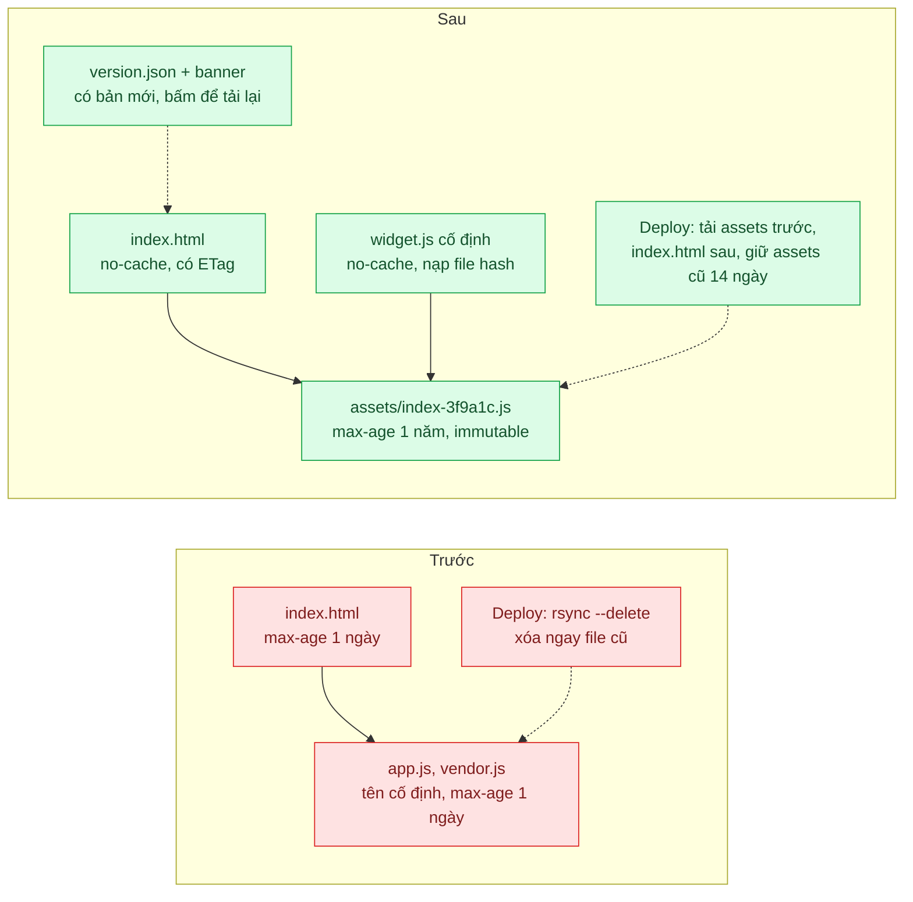
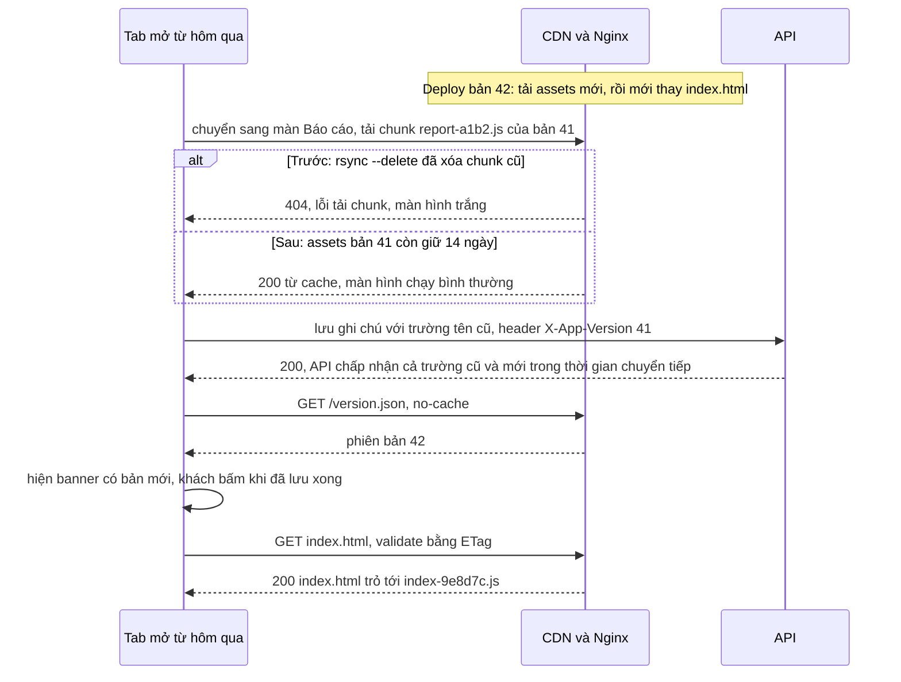

# Cache Busting (content hash + immutable) — Deploy xong, nửa người dùng vẫn chạy JS cũ gọi API mới

| Scope | Mức độ | Trạng thái | Pattern gốc | Cập nhật |
|---|---|---|---|---|
| 04 · frontend / cache | 🟢 Cơ bản | ✅ Hoàn thành | Cache Busting — RFC 9111; RFC 8246 (`immutable`); Next.js / Vite docs (hashed assets) | 2026-10-08 |

> **Một câu tóm tắt:** Đặt hash nội dung vào tên mọi file JS/CSS để mỗi phiên bản là một URL mới được cache vĩnh viễn, còn file HTML trỏ tới chúng thì luôn được hỏi lại — nên deploy xong là trình duyệt tự lấy đúng bản mới, không cần khách bấm Ctrl+F5.

## 1. Bài toán thực tế (What)

**Bối cảnh** *(doanh nghiệp giả định, số liệu minh họa)*
Công ty SaaS B2B bán phần mềm CRM cho khoảng 800 doanh nghiệp. Ứng dụng web là SPA React build bằng Vite, phục vụ tĩnh qua Nginx sau CDN. Vài năm trước, để đối tác nhúng widget bằng một đường dẫn cố định, đội đã tắt hash trong tên file: build ra `app.js`, `vendor.js`, `app.css`, tất cả kể cả `index.html` mang `Cache-Control: max-age=86400`. Deploy bằng `rsync --delete` thay toàn bộ thư mục. Mỗi tuần phát hành một lần.

**Triệu chứng người kinh doanh nhìn thấy**
- Sau mỗi đợt phát hành, hỗ trợ khách hàng nhận hàng chục ticket "màn hình trắng", "bấm Lưu không được"; câu trả lời quen thuộc là "anh chị bấm Ctrl+F5 giúp em".
- Sau đợt đổi API danh bạ, một nửa nhân viên kinh doanh của khách hàng mất dữ liệu ghi chú vì JS cũ gửi trường tên cũ, API mới bỏ qua.
- Đội sản phẩm né phát hành vào giờ làm việc, dồn vào tối thứ Sáu — rủi ro hơn và kỹ sư phải trực.

**Nguyên nhân kỹ thuật**
URL không đổi giữa hai phiên bản nên trình duyệt và CDN có quyền dùng bản cũ tới 24 giờ. Tệ hơn, mỗi file hết hạn ở thời điểm khác nhau: `index.html` cũ có thể chạy với `vendor.js` mới — hai nửa của hai bản build không khớp nhau, gây lỗi lúc chạy và màn hình trắng. Tab mở từ hôm trước đang chạy JS cũ gọi vào API đã đổi. `rsync --delete` xóa ngay các chunk tải lười của bản cũ, nên tab cũ chuyển màn hình là gặp lỗi tải chunk.

**Ràng buộc**
- Đối tác vẫn cần một URL cố định để nhúng widget.
- Không được ép tải lại trang khi người dùng đang nhập liệu dở (mất dữ liệu đang gõ).
- API phải phục vụ được JS của bản trước ít nhất trong thời gian chuyển tiếp.

## 2. Vì sao dùng pattern này (Why)

**Nguyên nhân gốc mà pattern nhắm vào:** cùng một URL mang nhiều nội dung theo thời gian, nên không tầng cache nào biết khi nào bản mình giữ đã sai.

**Pattern giải quyết thế nào:** đảo vấn đề: thay vì tìm cách *xóa* cache, làm cho mỗi nội dung có URL riêng. Bundler đặt hash của nội dung vào tên file (`assets/index-3f9a1c.js`); nội dung đổi thì tên đổi, nội dung không đổi thì tên giữ nguyên và cache cũ vẫn dùng được. Vì URL có hash *không bao giờ* đổi nội dung, có thể trả `Cache-Control: public, max-age=31536000, immutable`; RFC 8246 định nghĩa `immutable` để báo rằng response sẽ không đổi trong thời gian fresh, trình duyệt hỗ trợ không cần hỏi lại kể cả khi người dùng bấm tải lại. Chỉ file vào cửa — `index.html` — giữ URL cố định và mang `no-cache` để luôn được validate (RFC 9111), nhờ đó nó luôn trỏ tới bộ file hash của bản mới nhất. Vite làm hash mặc định; Next.js tự phục vụ `/_next/static` với hash và header tương tự.

**Lựa chọn khác đã cân nhắc**

| Lựa chọn | Giải quyết được gì | Vì sao không chọn (ở bài này) |
|---|---|---|
| Giữ nguyên + tối ưu nhỏ (hạ `max-age` còn 5 phút) | Rút thời gian chạy bản cũ | Vẫn có cửa sổ lệch phiên bản; mọi lượt xem phải tải lại hoặc hỏi lại toàn bộ file |
| `no-cache` cho mọi file | Luôn đúng phiên bản | Mỗi lượt xem tốn hàng chục request validate; chậm trên mạng yếu |
| Query string `?v=<số build>` | Đổi URL theo bản build | Đổi *mọi* file dù không sửa, mất cache vô ích; dễ quên tăng số; vẫn cần HTML `no-cache` |
| Xóa cache CDN (purge) sau deploy | CDN hết bản cũ | Không xóa được cache trình duyệt; không giúp tab đang mở |
| Service Worker tự quản lý phiên bản (bài 06) | Kiểm soát cập nhật chi tiết | Thêm cả một vòng đời phải hiểu; vẫn cần tên file có hash bên dưới |

## 3. Thiết kế hệ thống (How)

### 3.1 Kiến trúc trước và sau



### 3.2 Luồng chính



### 3.3 Thành phần và trách nhiệm

| Thành phần | Trách nhiệm | Quyết định thiết kế đáng chú ý |
|---|---|---|
| Vite build | Sinh tên file theo hash nội dung | Bật lại mặc định `assets/[name]-[hash]`; hash ổn định nếu nội dung không đổi |
| Nginx `location /assets/` | Header cho file có hash | `public, max-age=31536000, immutable` |
| `index.html`, `version.json`, `widget.js` | File vào cửa, URL cố định | `no-cache` + ETag; `widget.js` chỉ là loader nhỏ nạp file hash theo manifest |
| Script deploy | Thứ tự và lưu giữ | Tải `assets/` trước, `index.html` sau cùng; không `--delete`; job dọn assets cũ hơn 14 ngày (lab: API lên trước, giữ assets của 3 bản gần nhất, `scripts/deploy.ts`) |
| Kiểm tra phiên bản phía client | Báo có bản mới | Poll `version.json` khi đổi màn hình hoặc mỗi 10 phút; banner, không ép tải lại. Lab thêm: đã biết có bản mới thì lần điều hướng kế tiếp tải trang đầy đủ ở đích (người dùng đang rời màn hình nên không mất gì đang gõ) |
| Xử lý lỗi tải chunk | Lưới an toàn cuối | Bắt sự kiện lỗi preload của Vite (`vite:preloadError`; đã kiểm với Vite 8.3.3: sự kiện phát cả khi chính chunk tải lười trả 404). Lab tải lại một lần ở đúng đích (lỗi xảy ra lúc điều hướng), không tải lại lần hai trong 10 giây để tránh vòng lặp |
| API | Chịu được client bản trước | Log `X-App-Version`; giữ tương thích ít nhất một bản (`01-frontend-backend-transporter` bài 07) |

### 3.4 Điểm dễ sai khi triển khai
- **Tải `index.html` lên trước assets.** Trong vài giây, HTML mới trỏ tới file chưa tồn tại; luôn tải assets trước.
- **Xóa assets cũ ngay khi deploy.** Tab đang mở và CDN còn HTML cũ sẽ gặp 404; giữ theo số ngày hoặc số bản phát hành.
- **Hash theo thời điểm build thay vì nội dung.** Mọi file đổi tên mỗi lần build, cache vô dụng; kiểm tra hai lần build liên tiếp không đổi code cho cùng tên file.
- **`immutable` cho file không có hash** (`widget.js`, `index.html`): không còn cách nào cập nhật trước khi hết hạn.
- **CDN lưu `index.html` lâu** do cấu hình mặc định theo đuôi file; kiểm tra header thực nhận được ở CDN, không chỉ ở Nginx.
- **Tự động tải lại trang ngay khi có bản mới.** Khách mất form đang gõ; chỉ mời tải lại, hoặc tải lại khi điều hướng.

**Gặp thật khi làm lab** (đã kiểm, xem mục 5.1):
- **CDN và cache trình duyệt che việc xóa assets ở máy gốc.** File có hash mang `immutable` một năm, nên CDN còn giữ thì vẫn trả chunk đã bị xóa ở máy gốc. Lần thử đầu của lab xóa chunk báo cáo bản 41 nhưng tab cũ vẫn tải được từ CDN. Lỗi 404 chỉ xảy ra khi máy gốc đã xóa, CDN không còn bản lưu (vừa purge, PoP mới) và trình duyệt cũng chưa có file. Ở lượt "xóa assets + purge" có 5 trên 18 tab mở sẵn gặp 404. Test về xóa file phải xóa cache CDN trước.
- **Chunk tải lười đổi tên dù mã của nó không đổi.** Chunk Báo cáo import hàm dùng chung từ entry (`import … from "./index-<hash>.js"`), nên nội dung của nó chứa tên file entry. Entry đổi ở mọi bản (có hằng số phiên bản và tên chunk Báo cáo mới). Bản 42 không sửa màn Báo cáo nhưng chunk của nó vẫn đổi tên (`reports-ClN43-xE.js` → `reports-Ce3XeqXW.js`, cùng 969 B). Hệ quả: "chỉ sửa một màn hình" vẫn làm đổi 3 file (chunk đó, entry, `index.html`, cộng `version.json`). Vendor (React) và CSS giữ nguyên tên qua cả 4 bản (`vendor-B9LyyP50.js`, `index-e18GekGW.css`).
- **Build từ trong Vitest cho React bản development.** Vitest đặt `NODE_ENV=test`, Vite giữ giá trị đó, nên vendor thành 425.677 B (gzip 128.342 B) thay vì 218.775 B (67.522 B) và đổi hash. Test "vendor giữ tên giữa bản 42 và 43" bắt được lỗi này. Script build ép `NODE_ENV=production`.
- **`vite:preloadError` có ở Vite 8.3.3 và phát cả khi chính chunk tải lười trả 404,** không chỉ khi file preload của nó lỗi. Helper preload của Vite gọi `baseModule().catch(handlePreloadError)`; payload là `Failed to fetch dynamically imported module: …/assets/reports-….js`. Vite còn chèn `<link rel="modulepreload">` cho chính chunk đó, nên bộ đo lỗi thấy thêm một lỗi tải file cùng URL. Gọi `event.preventDefault()` thì `import()` trả `undefined` thay vì ném lỗi (mã nguồn Vite), nên lab giữ promise của màn tải lười treo cho tới khi trang mới lên.
- **F5 trên Chrome 154 không hỏi lại file con còn hạn, ở cả hai bản.** Sau F5, mọi file JS/CSS lấy từ memory cache; 0 request có điều kiện, 0 lần 304 ở CDN, kể cả bản trước không có `immutable`. Trên Chrome, khác biệt của `immutable` khi tải lại không đo được; lab chưa đo Firefox hay Safari.
- **Ctrl+F5 không cứu bản trước khi CDN còn giữ file cũ.** Nginx `proxy_cache` không xét `Cache-Control: no-cache` của request, nên Ctrl+F5 tải lại 85.580 B từ CDN mà vẫn chạy bản cũ (3/3 lần). Có purge CDN thì Ctrl+F5 nạp `app.js` bản 43, nhưng `reports.js` (cùng URL) vẫn lấy từ memory cache của tab: trang chạy entry bản 43 với màn Báo cáo bản 42 (3/3 lần). Đây đúng là "hai nửa của hai bản build" ở mục 1; lab không sinh lỗi JS chỉ vì hai bản này có cùng tên export.
- **JS cũ đọc API mới thì cả trang trắng, không chỉ một ô trống.** `initials(contact.label)` với `label` undefined ném `TypeError`. React 19 không có error boundary thì gỡ cả cây, nên `#root` rỗng. F5 không đổi được gì vì `index.html` và `app.js` còn hạn trong cache.
- **Môi trường đo: laptop gập nắp chạy pin thì macOS ngủ rồi DarkWake từng đợt.** Ba lượt đo nhiều phiên đầu tiên và một lượt chạy lại bị máy ngủ chen ngang (98 – 636 s). Lượt bị ngủ thì hẹn giờ của Node/Playwright hết hạn ngay khi máy thức (`process.hrtime` của Node trên máy này vẫn chạy trong lúc ngủ, đã kiểm), nên một test hết giờ sau 214 s. Script đo giờ tự ghi các khoảng máy ngủ (`machineSleep`); lượt có khoảng ngủ bị loại.

## 4. Tech stack và tác động (Impact techstack)

| Lớp | Công nghệ chọn | Vì sao chọn | Thay thế tương đương |
|---|---|---|---|
| Build | Vite + React, TypeScript strict | Đúng hiện trạng SPA tĩnh của bài; cơ chế hash lộ rõ ở cấu hình build. Khác mặc định Next.js của scope vì Next.js đã tự hash `/_next/static`; điều còn phải làm khi tự host Next.js (giữ assets cũ giữa các lần deploy) ghi ở mục 6 | Next.js (App Router), webpack |
| Phục vụ tĩnh | Nginx (mô phỏng CDN bằng `proxy_cache`) | Kiểm soát header theo `location`, log trạng thái cache | S3 + CloudFront |
| API | NestJS trên Node 20+ | Trùng stack repo; middleware log `X-App-Version` | Fastify |
| Test trình duyệt | Playwright | Mở tab bản cũ, deploy bản mới, điều hướng trong tab cũ và bắt lỗi | Cypress |
| Đo | DevTools Network, log Nginx, endpoint nhận lỗi JS | Đếm lỗi tải chunk và phiên chạy bản cũ sau deploy | Sentry |

**Khi thực hành:** SPA là Vite 8.3.3 (đóng gói bằng Rolldown 1.2.13) + `@vitejs/plugin-react` 6.1.2 + React 19.3.0, ba màn hình: Danh bạ, Chi tiết khách hàng (ghi chú), Báo cáo (tải lười bằng `React.lazy`). React tách thành chunk `vendor` bằng `output.codeSplitting.groups` (Vite 8 dùng tùy chọn của Rolldown thay cho `manualChunks`). Router tự viết khoảng 40 dòng trên History API, không dùng thư viện. Bản trước và bản sau là **cùng mã nguồn** build hai cách (`SITE=truoc|sau` trong `web/vite.config.ts`). Bản trước tắt hash (`app.js`, `vendor.js`, `reports.js`, `app.css`, `widget.js`). Bản sau đặt tên `assets/[name]-[hash]`, thêm `version.json`, loader `widget.js` và hai module `src/sau/` (kiểm tra phiên bản, bắt lỗi tải chunk). Bốn "bản phát hành" 41 – 44 là cùng mã nguồn với hằng số khác nhau (`web/releases.ts`), để biết chắc giữa hai bản chỉ đổi đúng những gì bảng ghi: 42 đổi API danh bạ (`name` → `displayName`, ghi chú `text` → `body`), 43 chỉ sửa màn Báo cáo, 44 sửa màn Báo cáo lần nữa (cho test lưu giữ).

Phục vụ tĩnh là hai container `nginx:1.30.5` (cùng image ghim của bài 04/01). `origin` đọc thẳng thư mục deploy `.data/www/<site>` với header theo `location` (`nginx/site-truoc.conf`, `nginx/site-sau.conf`). `cdn` là CDN mô phỏng bằng `proxy_cache` ở cổng 58088, cấu hình giống bài 04/01: chỉ header máy gốc quyết định lưu gì, cache trên tmpfs. Hai site chạy song song trên cùng CDN theo tên miền: `http://truoc.localhost:58088` và `http://sau.localhost:58088` (Chrome tự trỏ `*.localhost` về 127.0.0.1, đã kiểm với Chrome 154). Khóa cache của CDN có thêm `$host` để hai site không lẫn nhau. "Xóa cache CDN" của lab là đổi thế hệ khóa cache rồi `nginx -s reload` (`scripts/cdn.ts`), vì purge là tính năng của bản Nginx thương mại. Deploy là script TypeScript (`scripts/deploy.ts`) thay cho `deploy.sh` của kế hoạch, để test đọc được thứ tự từng bước. Bản trước làm như `rsync -a --delete`; bản sau giữ assets theo **số bản** (3 bản gần nhất) thay cho 14 ngày, vì đếm theo bản cho test tất định. Với nhịp tuần một bản, hai cách gần tương đương.

API là NestJS 10.4.22 (Express 4), mỗi site một tiến trình: bản sau ở 3100, bản trước ở 3101; CDN gọi qua `host.docker.internal`. "Deploy API" là `POST /ops/release` (đổi hợp đồng trong bộ nhớ), không khởi động lại tiến trình. Bản trước chỉ hiểu hợp đồng của bản đang chạy. Bản sau ở hợp đồng 2 vẫn nhận `text` và trả kèm `name` (giai đoạn expand). Mọi request ghi một dòng JSON có `X-App-Version`, `X-Tab-Id` và cookie `uid` của người dùng giả lập. Lỗi phía trình duyệt do một script inline trong `index.html` bắt (có ở cả hai bản, chạy trước mọi module): `error` (kể cả lỗi tải file), `unhandledrejection`, gửi về `POST /api/client-errors`.

Đo và test trình duyệt dùng Google Chrome 154.0.8037.98 đã cài trên máy, headless, profile tạm, qua `playwright-core` 1.63.0 (`channel: 'chrome'`) trong Vitest 5.0.3, không dùng Playwright Test runner. Không dùng k6: chỉ số của bài nằm ở chỗ JS cũ có chạy được hay không (lỗi lúc render, `import()` hỏng, ghi chú gửi trường nào), nên cần trình duyệt chạy JS thật. Kịch bản nhiều người dùng là nhiều browser context (mỗi context một cache riêng) trong một Chrome. Không dùng Lighthouse vì bài không có chỉ số LCP. TypeScript 5.9.3; mọi tham số constructor có `@Inject(...)` tường minh (nhật ký quyết định, bài 08/01).

**Thay đổi so với hệ thống hiện tại:** bật lại hash, đổi header Nginx theo nhóm file, viết lại script deploy (thứ tự, lưu giữ, dọn dẹp), thêm `version.json` và banner, thêm loader cố định cho widget đối tác. Đội phát triển phải giữ API tương thích ngược một bản.

## 5. Kết quả đầu ra và cách đo (Output impact)

| Chỉ số | Trước (minh họa) | Mục tiêu khi thực hành | Cách đo |
|---|---|---|---|
| Lỗi JS (lỗi tải chunk, "is not a function") trong 2 giờ sau deploy | 300 phiên | 0 trong kịch bản Playwright | Endpoint nhận `window.onerror`/`unhandledrejection`, đếm theo phiên |
| Tỷ lệ request API từ bản cũ 1 giờ sau deploy | 50 % | ≤ 5 % (chỉ tab chưa điều hướng) | Log `X-App-Version` ở API |
| Byte tải ở lượt xem lặp lại sau deploy chỉ sửa một màn hình | toàn bộ bundle | chỉ chunk bị sửa + `index.html` | DevTools Network, cột "Transferred" |
| Request validate cho `/assets/*` khi khách bấm tải lại | 1 mỗi file | ≈ 0 ở trình duyệt hỗ trợ `immutable` | Log Nginx đếm 304 theo đường dẫn |
| Ticket "màn hình trắng sau cập nhật" mỗi đợt phát hành | hàng chục | 0 | Số liệu hỗ trợ khách hàng (theo dõi sau khi áp dụng) |

> Số "trước" là minh họa để hình dung bài toán. Số "mục tiêu" chỉ được coi là đạt khi có số đo thật
> ở mục 8 kèm môi trường đo.

**Tác động nghiệp vụ mong đợi:** phát hành giữa giờ làm việc trở nên an toàn, khách không còn phải biết tới Ctrl+F5, và lượt xem lặp lại chỉ tải phần thực sự thay đổi.

### 5.1 Số đã đo

**Môi trường:** MacBook Apple M1 Pro (8 nhân, macOS 26.6.2 / Darwin 25.6.0), cắm sạc, nắp mở trong các lượt được dùng. Docker 28.5.1 có 8 CPU, khoảng 7,6 GB RAM. Hai container `nginx:1.30.5` (máy gốc tĩnh và CDN mô phỏng). Node v20.19.6, pnpm 10.32.0, Vite 8.3.3 (Rolldown 1.2.13), `@vitejs/plugin-react` 6.1.2, React 19.3.0, NestJS 10.4.22, Vitest 5.0.3, `playwright-core` 1.63.0, Google Chrome 154.0.8037.98 headless. API và Chrome chạy trên host; CDN gọi API qua `host.docker.internal`, gọi máy gốc tĩnh trong mạng Compose. Máy chạy cùng lúc container của dự án khác (MySQL, RabbitMQ) và Docker Desktop. Số thô ở `bench/results/main/` (không commit), lượt chạy lại từ đầu ở `bench/results/recheck-2/`.

**Bundle** (`build-facts.json`, byte gốc / gzip): `index.html` 2.175 / khoảng 1.047, entry 7.944 / khoảng 3.409, vendor (React) 218.775 / 67.522, CSS 823 / 446, chunk Báo cáo 969 – 1.105 / 512 – 559. Bản trước có cùng các file dưới tên cố định.

**Byte sau một lần deploy chỉ sửa màn Báo cáo (bản 42 → 43)** (`bytes-sau.json`, `bytes-truoc.json`, `bytes-truoc-purge.json`, mỗi file 3 lần, 3 lần cho cùng một số). Đo lúc 23:43 – 23:45, load macOS khoảng 3,0 – 5,2, trước lần máy ngủ đầu tiên của đêm (23:46:33). Mỗi lần: context mới, tab 1 xem Danh bạ → Báo cáo → Danh bạ ở bản 42, deploy 43; tab 2 mở lại Danh bạ rồi sang Báo cáo; rồi F5, rồi Ctrl+F5. Byte là tổng `encodedDataLength` của file tĩnh (không tính API), đọc qua CDP:

| Bước | Trước | Trước + xóa cache CDN | Sau |
|---|---|---|---|
| **Lượt xem lặp lại sau deploy** | **0 B**, nhưng vẫn chạy **bản 42** (màn Báo cáo cũ): mọi file lấy từ disk cache | 0 B, vẫn bản 42 | **6.693 B**, chạy **bản 43**: `index.html` 1.404, entry 4.038, chunk Báo cáo 944, `version.json` 307. Vendor (79.951 B qua mạng) và CSS lấy từ disk cache |
| F5 trên /bao-cao | 1.370 B (chỉ HTML); 0 request có điều kiện tới file tĩnh; 0 lần 304 ở CDN | như cột trước | 1.404 B (chỉ HTML); 0 request có điều kiện; 0 lần 304; 4 file assets từ memory cache |
| Ctrl+F5 | 85.580 B, **vẫn bản 42** (CDN giữ file cũ 1 ngày) | 85.583 B, entry **bản 43** nhưng màn Báo cáo **bản 42** (`reports.js` từ memory cache) | 86.207 B, bản 43 |

**Nhiều người dùng qua một lần deploy bản 42 đổi API** (`fleet-<tên>.json` thô, `fleet-<tên>-summary.json` tính bằng `bench/analyze-fleet.ts`). 24 người dùng, mỗi người một browser context của Chrome (cache riêng). 18 người mở tab trước deploy: Danh bạ → một khách hàng → (một nửa) Báo cáo → để tab ở Danh bạ hoặc ở một khách hàng. 6 người mới (cache trống) vào trong 2 phút đầu sau deploy. Sau deploy là 5 phút kịch bản nén: mỗi người nghỉ 3 – 9 giây giữa hai thao tác, chọn điều hướng 55 %, lưu ghi chú 25 %, mở tab mới 12 %, F5 8 %. Gặp màn hình trắng thì F5, trắng lần nữa thì Ctrl+F5 (lời khuyên của bộ phận hỗ trợ). Mỗi người có PRNG riêng (hạt 42), nên các lượt nhận cùng chuỗi lựa chọn cho tới khi trang trả về khác nhau. Mọi xác suất và nhịp thao tác là giả định của lab; "phút" là phút của kịch bản nén (khoảng 10 thao tác mỗi người mỗi phút), không phải giờ thật sau deploy. Lượt dùng ở bảng là bốn lượt hậu tố `-3`, chạy 09:14 – 09:39 ngày 2026-10-08, không có lần máy ngủ nào (bộ phát hiện trong script và `clock.log`: khoảng lớn nhất giữa hai nhịp 1 giây là 1.026 ms). Load 1 phút của macOS trong các lượt là 4,07 – 14,89; máy ảo Docker 1,19 – 3,33, bận 1,3 – 7,3 % CPU.

| Chỉ số (5 phút sau deploy) | Trước (`truoc-3`) | Trước + xóa cache CDN (`truoc-purge-3`) | Sau (`sau-3`) | Sau, deploy xóa assets cũ + xóa cache CDN (`sau-xoa-assets-purge-3`) |
|---|---|---|---|---|
| Thao tác sau deploy | 1.101 | 1.402 | 1.446 | 1.440 |
| **Người dùng chạy bản cũ** (mẫu đọc `window.__APP__` của tab đang mở), lúc deploy → phút 1 → phút 2 – 5 | 18/18 → 21/21 → **24/24 (100 %)** | 18/18 → 0/21 → 0/24 | 18/18 → **0/21 → 0/24** | 18/18 → 0/21 → 0/24 |
| **Mọi tab mở sẵn đã chạy bản 42 sau** | **không** (0/18 sau 5 phút) | 30,4 s (trung vị 21,0 s; 3 – 4 thao tác, qua màn hình trắng → F5 → Ctrl+F5) | **26,7 s** (trung vị 12,2 s; trung vị 2 thao tác, 1 – 4) | 19,5 s (trung vị 10,5 s; trung vị 2 thao tác, 1 – 4) |
| **Lỗi JS** (bộ đo inline gửi về API) | **1.095**, ở 24/24 người dùng, đều `TypeError: Cannot read properties of undefined (reading 'split')` từ JS bản 41 | 36, ở 18 người dùng | **0** | **0** |
| … đối chiếu `pageerror` của Playwright | 1.095 | 36 | 0 | 0 |
| Thao tác kết thúc ở màn hình trắng | 1.094 (24 người) | 36 (18 người) | 0 | 0 |
| F5 / Ctrl+F5 | 25 / **1.047** | 91 / 18 | 74 / 0 | 73 / 0 |
| **Ghi chú lưu sau deploy / bị mất** | 2 / **2** | 257 / 2 | 279 / **0** (7 ghi chú từ tab bản 41) | 277 / 0 (7 từ tab bản 41) |
| **Request API từ bản cũ**: phút 1; phút 2 – 5; cả lượt | 100 %; 100 %; 1.103/1.103 | 17,96 % (44/245); 0 %; 2,65 % | **10,43 % (29/278); 0 %; 1,68 % (29/1.725)** | 8,63 % (24/278); 0 %; 1,40 % |
| 404 file tĩnh ở CDN | 0 | 0 | 0 | **5** (chunk Báo cáo bản 41), cả 5 được bộ bắt lỗi tải chunk tải lại về bản 42; 0 lỗi JS |
| Byte file tĩnh qua CDN mỗi người dùng sau deploy (trung vị) | 3.894.612 B | 89.129 B | 32.389,5 B | 31.810 B |
| Load 1 phút macOS | 6,38 – 14,89 | 4,07 – 11,45 | 4,08 – 11,09 | 6,33 – 13,29 |

Ở bản trước, CDN giữ `index.html`, `app.js`, `vendor.js` một ngày, nên mọi tab, kể cả 6 người dùng mới vào sau deploy với cache trống, chạy JS bản 41 trên API bản 42 suốt 5 phút. 1.047 lần Ctrl+F5 vẫn tải lại đúng bản cũ từ CDN, và byte mỗi người tăng lên gần 3,9 MB. Có xóa cache CDN thì Ctrl+F5 giúp được người dùng ở kịch bản này, nhưng chỉ sau hai lần màn hình trắng mỗi người. Hai ghi chú bị mất ở cả hai lượt trước là của cùng hai người dùng (u03, u08). Lúc deploy, tab của họ đang mở màn khách hàng, và họ lưu ghi chú 5 – 9 giây sau deploy; API bản 42 lưu chuỗi rỗng và trả 201. Ở bản sau, 7 ghi chú gửi từ tab bản 41 sau deploy được lưu đủ nhờ API nhận trường cũ. Tab bản 41 thường chuyển sang bản 42 ở thao tác thứ hai sau deploy (trung vị 2, 1 – 4). Lần điều hướng đầu phát hiện `version.json` đổi, lần sau tải trang đầy đủ; F5 hay mở tab mới thì chuyển ngay. 29 request từ bản cũ đều nằm trong phút đầu. Khi deploy xóa assets cũ và CDN vừa purge, 5 tab mở màn Báo cáo lần đầu gặp 404. Các tab còn lại không gặp 404: hoặc đã có chunk đó trong cache trình duyệt từ trước deploy, hoặc không mở Báo cáo khi còn chạy bản 41 (lab chưa tách riêng từng trường hợp). Cả 5 tab được tải lại một lần ở đúng đích, không có lỗi JS hay màn hình trắng nào.

**Lượt bị loại vì máy ngủ** (`sleep-overlap.json`, khoảng ngủ lấy từ `pmset -g log` lưu ở `pmset-sleep.log`): đêm 2026-10-07, laptop gập nắp chạy pin vào "Clamshell Sleep" lúc 23:46:33, rồi chỉ chạy từng đợt DarkWake khoảng 45 giây. `fleet-truoc` ngủ 430 s trong lượt (một lần 356 s), `fleet-sau` 98 s (một lần 62 s), `fleet-truoc-2` 636 s (một lần 625 s). Lượt chạy lại `recheck/` (01:50) ngủ 211 s giữa một test Chrome, nên test đó hết giờ sau 214.729 ms (19/20 xanh); chạy riêng lại thì xanh. Các file này giữ để đối chiếu, không dùng cho số ở trên. Dù vậy, số đếm của chúng cùng chiều với lượt `-3`: `fleet-truoc-2` có 444 lỗi JS, `fleet-sau` có 0 lỗi và 0 ghi chú mất. `tests.json` và ba file `bytes-*.json` chạy xong trước 23:46:33.

**Test và phép thử âm** (`tests.json`, `negative-drills.json`): 20 test trong 7 file, 19,2 giây, chạy trên Nginx thật, API thật và Chrome hệ thống. Mỗi phép thử âm sửa mã nguồn tạm thời, chạy các file test liên quan, khôi phục rồi so lại nội dung file. Lượt trước khi sửa và sau khi khôi phục đều xanh, mọi lượt đã sửa có số test > 0, và không lượt nào có khoảng máy ngủ. Hai phép thử đầu chạy lúc 02:11 – 02:27, không phụ thuộc thời gian thực; năm phép thử còn lại chạy lúc 09:39 – 09:42.

| Gỡ phần nào của pattern | Test đỏ | Test báo gì |
|---|---|---|
| Giữ assets bản trước (deploy chỉ giữ bản mới) | 2/5 | assets bản 42 bị dọn khi lên 43, 44; tab bản 41 gặp 404 nên bị tải lại sang 42 ngay lần điều hướng đầu |
| Thứ tự deploy (`index.html` trước assets) | 1/3 | lúc `index.html` mới đã lên, 4 file nó trỏ tới chưa có |
| Hash theo nội dung (tên file gắn thời điểm build) | 2/3 | hai lần build cùng mã cho tên khác nhau; vendor đổi tên giữa 42 và 43 |
| `no-cache` cho `index.html` (thành `max-age=86400`) | 2/7 | header sai; tab mới mở lại URL cũ sau deploy vẫn chạy bản 41 |
| Bộ bắt `vite:preloadError` | 2/2 | chunk 404 làm tab cũ trắng màn hình, không tới được màn Báo cáo (test hết giờ chờ); test chống vòng lặp chỉ thấy một sự kiện vì không có lần tải lại nào |
| API nhận trường cũ `text` | 2/6 | ghi chú của client bản 41 lưu rỗng, cả qua API lẫn từ tab Chrome |
| Chỉ mời tải lại (thay bằng tự `location.reload()`) | 1/1 | banner không bao giờ hiện, chữ đang gõ mất; test hết giờ chờ banner |

**So với mục tiêu** (bản sau):
- Lỗi JS sau deploy: **0** ở `sau-3` (24 người dùng, 1.446 thao tác) và ở lượt xóa assets + purge. **Đạt** (mục tiêu 0 trong kịch bản tự động). Bản trước: 1.095 lỗi ở 24/24 người dùng. Kịch bản là 5 phút nén, không phải 2 giờ thật.
- Request API từ bản cũ: 1,68 % cả lượt, 0 % từ phút thứ 2 của kịch bản; phút đầu 10,43 %. **Đạt** (≤ 5 %) tính trên cả lượt và sau phút đầu. Không đổi được ra "1 giờ sau deploy" vì nhịp thao tác là giả định. Bản trước: 100 %.
- Byte lượt xem lặp lại sau deploy chỉ sửa một màn hình: 6.693 B. **Đạt một phần.** Ngoài chunk bị sửa (944 B) và `index.html` (1.404 B) còn có entry (4.038 B, đổi vì chứa tên chunk mới) và `version.json` (307 B). Vendor 79.951 B và CSS không tải lại. Bản trước tải 0 B vì chạy bản cũ; Ctrl+F5 thì tải lại cả bộ 85.580 B mà vẫn là bản cũ.
- Request hỏi lại `/assets/*` khi bấm tải lại: **0**, đạt. Bản trước trên Chrome 154 cũng là 0 (mục 3.4), nên chỉ số này không phân biệt được hai bản trên Chrome.
- Ticket "màn hình trắng sau cập nhật": **chưa đo** (số liệu hỗ trợ khách hàng, không có trong lab). Chỉ số gần nhất trong lab là số lượt thao tác kết thúc ở màn hình trắng: 1.094 ở bản trước, 0 ở bản sau.
- Thêm ngoài bảng mục 5: ghi chú bị mất 2/2 (trước) so với 0/279 (sau); mọi tab mở sẵn chạy bản mới sau 26,7 s (trung vị 2 thao tác) so với "không" ở bản trước.

**Chạy lại từ đầu** (`bench/results/recheck-2/`, 09:43 – 09:54, theo "Cách chạy" ở mục 8, các lượt ngắn hơn). Các bước: `docker compose down -v`, xóa `node_modules` và `.data`, `docker compose up -d --wait`, `pnpm install`, `pnpm test` (20/20 xanh trong 23,0 giây), `pnpm typecheck` (sạch). Kết quả:
- Byte (1 lần mỗi kiểu): đúng các số của lượt chính (6.693 / 0 / 0 B lượt xem lặp lại; Ctrl+F5 86.207 / 85.580 / 85.583 B; 0 request có điều kiện khi F5).
- Fleet 2 phút sau deploy, không có lần máy ngủ: bản sau 0 lỗi JS, 0/109 ghi chú mất, mọi tab mở sẵn chạy bản 42 sau 26,8 s, request API từ bản cũ 4,63 % (29/627). Bản trước 390 lỗi JS ở 24/24 người dùng, 2/2 ghi chú mất, 0/18 tab chuyển bản, 100 % request từ bản cũ.
- 7 phép thử âm cho cùng kết quả như lượt chính.

## 6. Đánh đổi và khi KHÔNG nên dùng

**Đánh đổi**
- Phải lưu nhiều phiên bản assets cùng lúc; tốn dung lượng và cần job dọn dẹp.
- API phải tương thích ngược ít nhất một bản — kỷ luật phát triển, không phải cấu hình.
- Thêm loader cố định và `version.json` là thêm thành phần phải giữ đúng header.

**Không nên dùng khi**
- Tài nguyên phải giữ URL cố định cho bên ngoài (ảnh trong email đã gửi, widget đối tác): dùng URL cố định với `max-age` ngắn hoặc `no-cache`, có thể làm loader trỏ sang file hash.
- Trang tĩnh đơn lẻ, sửa hiếm và không có tương tác với API: `no-cache` + ETag là đủ, không cần quy trình phát hành.
- Framework đã làm sẵn (Next.js, Vite mặc định): đừng tự viết lại, chỉ cần không phá cấu hình và xử lý phần lưu giữ assets khi tự host.

**Liên quan**
- Đọc trước: [01 — HTTP Caching](../01-http-cache-headers-anh-san-pham-tai-lai-moi-lan/).
- Đọc sau: [06 — Service Worker](../06-service-worker-shipper-mat-mang-van-xem-don/) — Service Worker cũng phải được "bust" khi phát hành.
- Cùng chủ đề: [01-07 — API Versioning](../../01-frontend-backend-transporter/07-api-versioning-app-cu-van-phai-chay/) — phía API cho client cũ; [03-02 — Cache Invalidation](../../03-backend-cache/02-ttl-va-invalidation-gia-doi-roi-khach-van-thay-gia-cu/) — invalidation phía server; [16-06 — Canary / Blue-Green](../../16-backend-k8s/06-canary-blue-green-argo-rollouts-release-loi-anh-huong-100-phan-tram/).

## 7. Cơ sở tham khảo

- RFC 8246, *HTTP Immutable Responses*, IETF, 2017 — https://www.rfc-editor.org/rfc/rfc8246 — ý nghĩa của `immutable` và lý do nó chỉ hợp với URL không bao giờ đổi nội dung.
- RFC 9111, *HTTP Caching*, IETF, 2022 — https://www.rfc-editor.org/rfc/rfc9111 — `max-age`, `no-cache`, validate; nền cho việc tách file vào cửa và file có hash.
- Vite docs, "Building for Production" — https://vite.dev/guide/build — tên file có hash mặc định, xử lý lỗi tải chunk khi phát hành bản mới.
- Next.js docs — https://nextjs.org/docs — `/_next/static` có hash và header cache mặc định; cấu hình khi tự host.
- MDN Web Docs, "Cache-Control" — https://developer.mozilla.org/docs/Web/HTTP/Headers/Cache-Control — giải thích thực hành `immutable`, `no-cache` và hỗ trợ trình duyệt.

## 8. Kế hoạch thực hành

- [x] Bước 1: dựng SPA Vite 8 + React 19 (Danh bạ, Chi tiết khách hàng, Báo cáo tải lười), Nginx máy gốc tĩnh + Nginx `proxy_cache` làm CDN, API NestJS 10. Bản trước tái hiện hiện trạng: tên file cố định, `max-age=86400` cho mọi file kể cả `index.html`, deploy như `rsync --delete`, API chỉ hiểu hợp đồng mới.
- [x] Bước 2: đo "trước" trên Chrome hệ thống: tab bản 41 mở sẵn, deploy bản 42 đổi API, điều hướng và lưu ghi chú trong tab cũ; 24 người dùng giả lập, đếm lỗi JS, màn hình trắng, ghi chú mất, request từ bản cũ.
- [x] Bước 3: bật hash, header theo nhóm file, script deploy mới (API trước, assets trước, `index.html` sau cùng, giữ 3 bản), `version.json` + banner + tải trang đầy đủ ở lần điều hướng kế tiếp, bắt `vite:preloadError`, loader `widget.js`, API nhận hợp đồng cũ.
- [x] Bước 4: đo "sau" cùng kịch bản, thêm hai biến thể (bản trước + xóa cache CDN; bản sau + deploy xóa assets cũ + xóa cache CDN); số thật và môi trường ở mục 5.1.
- [x] Bước 5: test (a) hai lần build không đổi code cho cùng tên file, bản chỉ sửa Báo cáo giữ tên vendor và CSS; (b) tab bản cũ điều hướng và lưu ghi chú sau deploy không lỗi; (c) `index.html` và route SPA luôn `no-cache`, `/assets` luôn `immutable`, asset thiếu trả 404 thật; (d) banner hiện khi `version.json` đổi và không tự tải lại. Thêm: thứ tự và lưu giữ của deploy, API nhận hợp đồng cũ, tải lại đúng một lần khi chunk 404, và 7 phép thử âm.

**Cấu trúc code**
```text
web/                                   # SPA Vite 8 + React 19, cùng mã nguồn cho hai site
  vite.config.ts                       # [PATTERN] SITE=sau: assets/[name]-[hash]; SITE=truoc: app.js, vendor.js... (hiện trạng)
                                       # + plugin sinh version.json và loader widget.js cho bản sau
  releases.ts                          # bản 41–44: hợp đồng API và bố cục màn Báo cáo của từng bản
  index.html                           # bộ đo lỗi inline (có ở mọi bản, không thuộc pattern)
  src/sau/version-check.ts             # [PATTERN] hỏi version.json, banner, tải trang đầy đủ ở lần điều hướng kế tiếp
  src/sau/chunk-error-handler.ts       # [PATTERN] vite:preloadError → tải lại một lần ở đích, chặn vòng lặp 10 giây
  src/app.tsx, router.ts, api.ts, screens/{contacts,contact-detail,reports}.tsx
  widget/widget.ts                     # widget đối tác (entry thứ hai)
nginx/site-sau.conf                    # [PATTERN] /assets/ immutable 1 năm, 404 thật; file vào cửa no-cache
nginx/site-truoc.conf                  # hiện trạng: max-age=86400 cho mọi file
nginx/origin.conf, nginx/cdn.conf      # máy gốc tĩnh hai site theo tên miền; CDN mô phỏng như bài 04/01
scripts/deploy.ts                      # [PATTERN] API → assets → index.html; giữ 3 bản; bản trước như rsync --delete
scripts/build-release.ts, cdn.ts       # build có cache theo hash mã nguồn; xóa cache CDN, nạp lại cấu hình Nginx
src/                                   # API NestJS 10: sau/contacts.controller.ts [PATTERN] nhận name/text cũ;
                                       # truoc/ chỉ hiểu hợp đồng mới; shared/ nhật ký X-App-Version, /ops/release
test/                                  # 7 file: build-hash-is-deterministic, static-headers, deploy-keeps-old-assets,
                                       # api-accepts-previous-contract, old-tab-survives-deploy, chunk-error-reloads-once,
                                       # version-banner-no-auto-reload (Chrome hệ thống qua playwright-core)
bench/                                 # fleet + analyze-fleet (nhiều người dùng qua một lần deploy), redeploy-bytes,
                                       # negative-drills, build-facts, sleep-watch + sleep-overlap (máy ngủ), lib
docker-compose.yml                     # origin + cdn (nginx:1.30.5), cổng 58088
```

**Cách chạy**
```bash
cd 04-frontend-cache/02-cache-busting-deploy-xong-user-van-chay-js-cu
docker compose up -d --wait        # (hoặc pnpm cdn:up) máy gốc tĩnh + CDN mô phỏng ở 58088
pnpm install
pnpm test                          # 20 test, khoảng 20 giây; tự build các bản cần dùng vào .data/builds
pnpm typecheck
# Xem bằng tay: bật API của một site (mỗi lệnh một terminal), deploy bản 41, mở trang
SITE=sau pnpm api                  # API bản sau ở 3100 (SITE=truoc pnpm api: bản trước ở 3101)
pnpm site:deploy --site sau --release 41     # mở http://sau.localhost:58088 (bản trước: http://truoc.localhost:58088)
pnpm site:deploy --site sau --release 42     # deploy bản mới khi tab cũ còn mở, rồi điều hướng trong tab cũ
# Đo: script tự bật/tắt API, xóa thư mục deploy và cache CDN của site. Kết quả ở bench/results/$RUN/ (không commit).
# Đừng chạy hai lượt đo cùng lúc, đừng sửa code khi bench:drills đang chạy. Máy phải thức suốt lượt đo (cắm sạc, mở nắp):
# lượt có khoảng máy ngủ ghi ở "machineSleep" của file kết quả, phải chạy lại.
RUN=main SITE=sau RUNS=3 pnpm bench:bytes                 # byte sau deploy chỉ sửa màn Báo cáo, F5, Ctrl+F5
RUN=main SITE=truoc RUNS=3 pnpm bench:bytes
RUN=main SITE=truoc PURGE=1 RUNS=3 pnpm bench:bytes
RUN=main SITE=truoc NAME=truoc-3 pnpm bench:fleet         # 24 người dùng, 5 phút sau deploy (khoảng 6 phút)
RUN=main SITE=sau NAME=sau-3 pnpm bench:fleet
RUN=main SITE=truoc NAME=truoc-purge-3 PURGE=1 pnpm bench:fleet
RUN=main SITE=sau NAME=sau-xoa-assets-purge-3 KEEP=1 PURGE=1 pnpm bench:fleet
RUN=main pnpm bench:drills                                # 7 phép thử âm (DRILLS=ten1,ten2 để chạy một phần)
RUN=main NAME=sau-3 pnpm tsx bench/analyze-fleet.ts       # tính lại chỉ số từ file thô của một lượt
RUN=main pnpm tsx bench/build-facts.ts                    # tên và kích thước file của các bản
docker compose down -v             # (hoặc pnpm cdn:down)
```

Nếu dùng `docker compose up -d` (không `--wait`), chờ hai container `healthy` rồi mới `pnpm test`. Test và script đo bật API ở 3100 (bản sau) và 3101 (bản trước) như tiến trình riêng, và báo lỗi rõ nếu cổng đang bận. Dừng `pnpm api` bằng Ctrl+C; chạy nền thì tắt bằng `pkill -f "src/main.ts"`, rồi kiểm `lsof -nP -iTCP:3100 -sTCP:LISTEN` và cổng 3101. Chrome dùng là Google Chrome đã cài ở `/Applications/Google Chrome.app` (macOS), headless với profile tạm; không tải trình duyệt nào. Chrome tự trỏ `*.localhost` về 127.0.0.1; trình duyệt khác có thể cần thêm `sau.localhost` và `truoc.localhost` vào `/etc/hosts`.

## Bài học sau khi làm

- **Trong lab, chỉ đổi tên file theo hash và header là chưa đủ; ba mắt xích còn lại mới quyết định người dùng có gặp lỗi không.** Bản trước giữ mọi tab ở JS bản 41 suốt 5 phút sau deploy: 1.095 lỗi JS ở 24/24 người dùng và 2/2 ghi chú bị mất. Bản sau không có lỗi JS nào, mất 0/279 ghi chú, và mọi tab mở sẵn sang bản 42 sau 26,7 s. Hash và `no-cache` cho `index.html` giúp tab mới và lần tải lại lấy đúng bản. Tab đang mở thì cần ba thứ khác: assets cũ còn trên máy gốc, cách báo có bản mới (`version.json`), và API nhận hợp đồng cũ. Phép thử âm gỡ từng thứ đều làm test đỏ.
- **Lỗi nặng nhất không phải 404 chunk mà là JS cũ gọi API mới.** Lỗi 404 chỉ xuất hiện khi máy gốc xóa assets cũ và CDN không còn bản lưu (5 lần ở lượt cố ý tạo điều kiện đó), và bộ bắt `vite:preloadError` gỡ được cả 5. Còn hợp đồng API đổi thì JS cũ trắng cả trang (`TypeError` lúc render) hoặc mất dữ liệu im lặng (API lưu chuỗi rỗng, trả 201). Đó là kỷ luật phía API, không phải cấu hình cache.
- **"Bấm Ctrl+F5" chỉ đúng khi CDN không còn bản cũ.** Ở bản trước, 1.047 lần Ctrl+F5 vẫn lấy đúng bản cũ từ CDN, vì CDN mô phỏng không xét `Cache-Control: no-cache` của request. Có purge CDN thì Ctrl+F5 cứu được người dùng, nhưng trang có thể chạy hai nửa của hai bản (entry 43 với màn Báo cáo 42 lấy từ memory cache), và vẫn sau hai lần màn hình trắng.
- **Hash theo nội dung có hiệu ứng dây chuyền.** Chunk import từ entry đổi tên mỗi khi entry đổi, nên "chỉ sửa một màn" vẫn tải lại entry (4.038 B) cùng chunk đó, và ngay cả bản không sửa màn Báo cáo cũng đổi tên chunk của nó. Phần lớn và ổn định là vendor (79.951 B qua mạng) thì giữ được cache qua cả 4 bản. Muốn tách sâu hơn thì phải chia chunk lại; lab không làm.
- **`immutable` không đo ra khác biệt trên Chrome.** Chrome 154 không hỏi lại file con còn hạn khi F5, ở cả bản không có `immutable`. Lợi ích của nó ở trình duyệt khác chưa đo.
- **Lỗi gặp khi làm:** build gọi từ Vitest cho React bản development vì `NODE_ENV=test` (vendor 425.677 B thay vì 218.775 B). Lần thử đầu của bài kiểm chunk 404 không ra 404 vì CDN còn giữ chunk đã xóa, nên test phải xóa cache CDN trước. Lệnh `env $v` với nhiều biến trong zsh không tách từ, nên một lượt thử đo nhầm site. Lượt đo nền đầu tiên bị dừng giữa chừng, và ba lượt fleet cùng một lượt chạy lại trùng lúc laptop gập nắp chạy pin ngủ từng đợt (98 – 636 s mỗi lượt). Sampler đầu tiên đọc tuần tự 24 tab nên lúc máy chậm bị mất mốc; bản sửa đọc đồng thời theo mốc cố định. Script đo giờ ghi khoảng máy ngủ để loại lượt bẩn; phép thử âm gộp kết quả theo tên để chạy từng phần.
- **Hạn chế của số đo:** kịch bản nén 5 phút với nhịp thao tác và xác suất giả định, không phải 2 giờ thật; 24 người dùng trong một Chrome headless trên laptop đang chạy ứng dụng khác (load 4,07 – 14,89). Nginx một nút không phải CDN nhiều PoP: không có trường hợp một PoP còn bản cũ trong khi PoP khác đã có bản mới. App nhỏ (3 màn, một chunk tải lười); app thật có nhiều chunk dùng chung hơn, nên lỗi trộn bản ở bản trước có thể nặng hơn (ở lab, hai bản cùng tên export nên trộn bản không ném lỗi). Mỗi biến thể fleet chạy một lượt sạch, cộng một lượt 2 phút ở lần chạy lại từ đầu. Số liệu ticket hỗ trợ không đo được trong lab.
