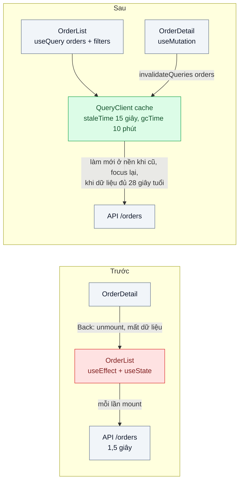
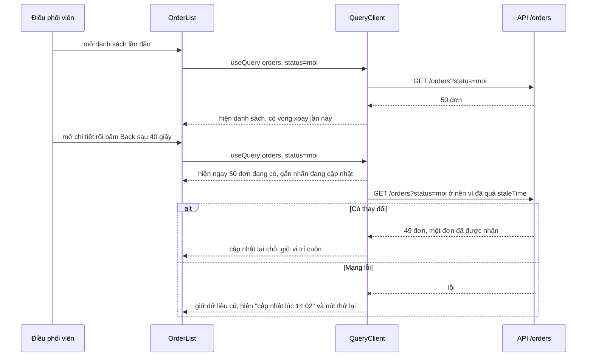

# Stale-While-Revalidate (client) — Quay lại trang danh sách đơn lại thấy vòng xoay loading

| Scope | Mức độ | Trạng thái | Pattern gốc | Cập nhật |
|---|---|---|---|---|
| 04 · frontend / cache | 🟢 Cơ bản | ✅ Hoàn thành | Stale-While-Revalidate — RFC 5861; TanStack Query docs (staleTime, refetch); SWR docs | 2026-10-08 |

> **Một câu tóm tắt:** Giữ kết quả các truy vấn trong một cache phía client theo khóa truy vấn; quay lại màn hình thì hiện ngay bản đang có, đồng thời lặng lẽ lấy bản mới ở nền và cập nhật khi về — thay vì xóa trắng và quay vòng loading mỗi lần điều hướng.

## 1. Bài toán thực tế (What)

**Bối cảnh** *(doanh nghiệp giả định, số liệu minh họa)*
Công ty logistics giao hàng nội thành, khoảng 120 nhân viên điều phối dùng màn hình web "Danh sách đơn" (Next.js App Router) để theo dõi và phân đơn cho shipper. Một ngày, mỗi điều phối viên mở chi tiết đơn rồi quay lại danh sách khoảng 300 lần. Component danh sách gọi API trong `useEffect`, lưu kết quả trong state cục bộ; API danh sách có lọc, phân trang, mất khoảng 800 ms–1,5 giây.

**Triệu chứng người kinh doanh nhìn thấy**
- Mỗi lần quay lại danh sách là một vòng xoay 1–1,5 giây và mất vị trí cuộn; cộng lại mỗi điều phối viên mất vài chục phút chờ mỗi ngày.
- Giờ cao điểm điều phối viên mở nhiều tab để "đỡ phải chờ", rồi thao tác trên tab có dữ liệu cũ, phân nhầm đơn đã có người nhận.
- API danh sách đơn là endpoint nặng nhất hệ thống, phần lớn lượt gọi trả về đúng dữ liệu vừa trả vài giây trước.

**Nguyên nhân kỹ thuật**
Dữ liệu từ server được coi như state của component: component unmount là mất, mount lại là tải lại từ đầu và hiện loading. Không có nơi nào giữ "server state" giữa các màn hình, không có khái niệm dữ liệu *còn dùng được nhưng nên làm mới*. Mỗi lần điều hướng vừa chậm cho người dùng vừa tốn cho server.

**Ràng buộc**
- Trạng thái đơn (đã nhận, đang giao) không được hiển thị cũ quá 30 giây khi điều phối viên đang nhìn màn hình.
- Khi đổi bộ lọc, không được hiện kết quả của bộ lọc khác.
- Đăng xuất trên máy dùng chung phải xóa sạch dữ liệu khách hàng khỏi bộ nhớ trình duyệt.

## 2. Vì sao dùng pattern này (Why)

**Nguyên nhân gốc mà pattern nhắm vào:** ứng dụng chỉ có hai trạng thái "có dữ liệu mới" hoặc "không có gì", trong khi phần lớn thời gian một bản hơi cũ là đủ tốt để hiện ngay.

**Pattern giải quyết thế nào:** RFC 5861 định nghĩa chỉ thị `stale-while-revalidate` cho HTTP cache: trong một khoảng thời gian sau khi hết hạn, cache được trả bản cũ ngay *và* validate lại ở nền. TanStack Query và SWR đưa đúng ý tưởng đó vào cache dữ liệu của ứng dụng: mỗi truy vấn có khóa (`['orders', filters]`); dữ liệu sau `staleTime` bị coi là cũ nhưng vẫn được hiện ngay khi component mount lại, đồng thời truy vấn chạy lại ở nền và thay dữ liệu khi về. Truy vấn không còn ai dùng được giữ thêm `gcTime` rồi mới bị dọn. Tải lại khi cửa sổ được focus lại và `refetchInterval` giữ dữ liệu không cũ quá mức nghiệp vụ cho phép. Sau một thao tác ghi, `invalidateQueries` đánh dấu các truy vấn liên quan là cũ để làm mới ngay.

**Lựa chọn khác đã cân nhắc**

| Lựa chọn | Giải quyết được gì | Vì sao không chọn (ở bài này) |
|---|---|---|
| Giữ nguyên + tối ưu nhỏ (skeleton thay vòng xoay, tăng tốc API) | Cảm giác bớt khó chịu | Vẫn chờ mỗi lần điều hướng; API vẫn bị gọi lặp |
| Tự giữ dữ liệu trong store toàn cục (Redux/Zustand) | Không mất dữ liệu khi unmount | Phải tự viết khóa, hết hạn, làm mới nền, chống gọi trùng — tái phát minh thư viện |
| `stale-while-revalidate` ở HTTP cache của API | Trình duyệt tự trả bản cũ và làm mới | Dữ liệu riêng của tài khoản, cần `private`; hành vi khác nhau giữa trình duyệt; app không biết dữ liệu là cũ để báo |
| Cache router của Next.js cho Server Component | Không cần thư viện | Đã kiểm với Next.js 16.4.0 (mục 5.1): bấm Back thì Next hiện lại RSC payload cũ từ cache router, không hỏi server và không tự làm mới, nên đơn người khác đã nhận vẫn hiện như "Mới"; điều hướng bằng liên kết thì chờ server và hiện `loading.tsx` như bản trước. Không có cơ chế "hiện bản cũ rồi làm mới ở nền"; phiên bản Next khác chưa kiểm |
| TanStack Query ở component client (chọn) | Khóa truy vấn, `staleTime`, làm mới nền, chống gọi trùng, invalidation | Thêm một thư viện và một khái niệm mới cho đội |

## 3. Thiết kế hệ thống (How)

### 3.1 Kiến trúc trước và sau



### 3.2 Luồng chính



### 3.3 Thành phần và trách nhiệm

| Thành phần | Trách nhiệm | Quyết định thiết kế đáng chú ý |
|---|---|---|
| `QueryClientProvider` | Một cache cho cả phiên làm việc | Tạo `QueryClient` một lần trong component client (`useState`), không tạo lại mỗi lần render |
| Khóa truy vấn `['orders', filters]` | Định danh dữ liệu trong cache | Mọi tham số ảnh hưởng kết quả (trạng thái, trang, kho) phải nằm trong khóa |
| `staleTime` theo loại dữ liệu | Quyết định khi nào làm mới | Danh sách đơn 15 giây; danh mục kho 10 phút; ràng buộc 30 giây được giữ bằng `refetchInterval` dạng hàm theo tuổi dữ liệu (làm mới khi bản đang có đủ 28 giây tuổi), không phải số cố định 30 giây (mục 3.4) |
| `placeholderData` (hàm, chỉ giữ trang cũ khi cùng bộ lọc) | Đổi trang không nhấp nháy | Hiện trang cũ mờ đi cho tới khi trang mới về, có chỉ báo rõ. Không dùng `keepPreviousData` nguyên bản: nó giữ cả kết quả của trạng thái/kho khác khi đổi bộ lọc, trái ràng buộc ở mục 1 |
| `useMutation` + `invalidateQueries` | Sau khi phân đơn, danh sách được làm mới | Invalidate theo tiền tố `['orders', 'list']` để mọi bộ lọc cùng cũ; danh sách không hiện (đang ở chi tiết) được làm mới ở lần hiện tới |
| Đăng xuất | Xóa dữ liệu khỏi bộ nhớ | `queryClient.clear()` trước khi chuyển trang đăng nhập |

### 3.4 Điểm dễ sai khi triển khai
- **Thiếu tham số trong khóa truy vấn.** Đổi bộ lọc mà khóa không đổi thì hiện kết quả của bộ lọc khác — đúng lỗi ràng buộc cấm.
- **Để mặc định mà không hiểu.** Mặc định của TanStack Query v5 là `staleTime: 0` và làm mới khi focus lại: dữ liệu luôn bị coi là cũ, mỗi lần chuyển tab là một đợt request.
- **Tạo `QueryClient` trong thân component.** Mỗi lần render một cache mới, mọi thứ như chưa từng có cache.
- **Hiện dữ liệu cũ mà không báo.** Với dữ liệu ảnh hưởng quyết định (đơn đã có người nhận), luôn hiện chỉ báo "đang cập nhật" hoặc thời điểm cập nhật.
- **Quên xóa cache khi đăng xuất** trên máy dùng chung — rò rỉ dữ liệu khách hàng sang người dùng sau.
- **Dữ liệu server render rồi client tải lại ngay.** Khi kết hợp Server Component, truyền dữ liệu ban đầu và đặt `staleTime` hợp lý để không gọi trùng ngay sau hydrate.

**Gặp thật khi làm lab** (đã kiểm, xem mục 5.1):
- **`refetchInterval: 30_000` không giữ được ràng buộc 30 giây.** TanStack Query 5.104.1 khởi động lại bộ hẹn giờ mỗi lần truy vấn đổi trạng thái (`onQueryUpdate` → `#updateTimers`) và lúc mount. Vì vậy hai bản chụp cách nhau 30 s cộng thời gian một lần tải, và thay đổi vừa lỡ một bản chụp chỉ hiện sau 31.224 ms. Quay lại trong `staleTime` (không tải lại) rồi ở lại danh sách thì bản chụp kế tiếp tới 30 s sau lúc quay lại, cộng tuổi sẵn có của dữ liệu: 40.142 ms. Hạ xuống 28 s cố định vẫn còn trường hợp sau (38.225 ms). Lab dùng `refetchInterval` dạng hàm: hẹn lần làm mới khi bản đang có đủ 28 s tuổi (`dataUpdatedAt`), lỗi cũng tính là một lần thử. Lần tải trùng trong lúc đang tải được gộp (`Query.fetch` trả promise đang chạy), nên không có request thừa.
- **`keepPreviousData` nguyên bản trái ràng buộc "không hiện kết quả của bộ lọc khác".** Nó giữ dữ liệu cũ cả khi đổi trạng thái hay kho, không chỉ khi đổi trang (phép thử âm: 3 khoảnh khắc sai bộ lọc). Lab dùng hàm `placeholderData` chỉ trả dữ liệu cũ khi trạng thái và kho trùng.
- **Bản có sẵn trong cache có thể rất cũ.** Với `gcTime` 10 phút, đổi về một trang hay bộ lọc đã xem từ mấy phút trước sẽ hiện ngay một bản cũ tới 567,8 s, trong khoảng 1,2 s chờ bản mới. Chỉ báo "Đang cập nhật… (đang hiện dữ liệu lúc …)" là thứ duy nhất cho người dùng biết. Làm mờ bản quá 30 s tuổi, hay rút `gcTime` cho dữ liệu nhạy, là các cách giảm rủi ro; lab chưa đo.
- **`staleTime` 15 s không bớt được request nào ở nhịp làm việc của lab.** Ở chi tiết 10 – 50 s thì lần quay lại nào cũng đã quá 15 s (193/193 lần làm mới). Phần tiết kiệm thật nằm ở dữ liệu ít đổi (danh mục kho: 195 → 24 request) và ở lần quay lại nhanh (lượt đo riêng: ở chi tiết 3 s thì 0 request).
- **Sau phân đơn, danh sách cũ hiện ra trước.** `invalidateQueries` mặc định (`refetchType: 'active'`) chỉ đánh dấu cũ các danh sách không hiện. Khi quay lại, bản trong cache, trong đó đơn vừa phân còn "Mới", hiện ra khoảng 1,22 s rồi mới được thay (0/43 lần hiện đầu đã đúng). Cập nhật cache bằng kết quả của mutation, hoặc `refetchType: 'all'`, sẽ khác; lab chưa đo.
- **Tạo `QueryClient` trong thân component không làm hỏng gì trong app này.** `Providers` nằm ở layout của `/sau`, và layout không render lại khi điều hướng, nên phép thử âm không làm test nào đỏ. Điểm dễ sai vẫn đúng với component chứa provider có render lại (state riêng, `router.refresh()`); lab chưa dựng trường hợp đó.
- **Bản trước cũng hiện kết quả của bộ lọc khác, dù rất ngắn.** Mỗi lần đổi trạng thái có một lần render mà URL đã đổi nhưng bảng còn dữ liệu cũ, cho tới khi `useEffect` đặt lại trạng thái tải (29 lần, lâu nhất 10 ms).
- **Next.js 16.4.0, Back và cache router.** Bấm Back không gửi request RSC nào ở mọi cách làm (RSC payload dùng lại từ cache router phía client). Với danh sách là Server Component, Back hiện lại đúng bản cũ và không bao giờ tự làm mới. Điều hướng tiến bằng `<Link>` thì chờ server và hiện `loading.tsx` (khoảng 1,24 s). Bật `cacheComponents: true` thì Next giữ trang cũ bằng `<Activity>` (component không bị dựng lại), nhưng bản trước vẫn có vòng xoay và mất vị trí cuộn: effect chạy lại khi trang hiện lại và đặt trạng thái tải. Trang ẩn vẫn nằm trong DOM (`display: none`), nên bộ đo và các hàm chờ chỉ xét phần tử đang hiện (`checkVisibility()`). Cũng ở chế độ này, `useParams` trong trang `[id]` phải nằm trong `<Suspense>`, không thì `next build` dừng. Bộ lọc đổi bằng `window.history.pushState`: Next cập nhật `useSearchParams` mà không gửi request RSC và không dựng lại danh sách (0 lần, cả hai chế độ), nên `placeholderData` nhận được truy vấn trước của cùng observer. Trang dựng sẵn có `useSearchParams` phải bọc `<Suspense>`.

## 4. Tech stack và tác động (Impact techstack)

| Lớp | Công nghệ chọn | Vì sao chọn | Thay thế tương đương |
|---|---|---|---|
| Web | Next.js (App Router), React, TypeScript strict | Mặc định của scope; danh sách là component client | Vite + React Router |
| Cache dữ liệu client | TanStack Query v5 | `staleTime`, `gcTime`, làm mới nền, chống gọi trùng, devtools | SWR, RTK Query, Apollo Client (nếu GraphQL) |
| API | NestJS trên Node 20+, độ trễ giả lập cấu hình được | Trùng stack repo; điều khiển được độ trễ và lỗi để thử | Fastify |
| Test hành vi | Vitest + React Testing Library + MSW (kế hoạch); khi làm: Vitest + `playwright-core` trên Chrome hệ thống | Kiểm tra không có vòng xoay khi quay lại | Jest |
| Đo trải nghiệm | Playwright | Đo thời gian từ bấm Back tới khi thấy danh sách, đếm request | Chrome DevTools Performance |

**Khi thực hành:** Next.js 16.4.0 (App Router, build bằng Turbopack, chạy `next start` ở cổng 3200), React 19.3.0, `@tanstack/react-query` 5.104.1, API NestJS 10.4.22 (Express 4) ở cổng 3100. Trình duyệt gọi `/api/*` cùng origin; `rewrites` của Next chuyển tiếp tới API kèm cookie `uid`. Bản trước và bản sau là hai cây route trong cùng một bản build: `/truoc/orders` (`useEffect` + `useState`, đúng hiện trạng ở mục 1) và `/sau/orders` (`QueryClientProvider` ở `app/sau/layout.tsx`). Hai bản dùng chung API, giao diện trình bày (`web/orders/ui.tsx`) và cách giữ bộ lọc trên URL. Bộ lọc đổi bằng History API gốc (`window.history.pushState`), nên Next cập nhật `useSearchParams` mà không gọi server và không dựng lại danh sách (đã kiểm bằng mã instance của component). Thêm cây route thứ ba `/rsc/orders`: danh sách là Server Component đọc API lúc request, chỉ dùng để kiểm cache router phía client của Next (mục 2). Cấu hình `LAB_CACHE_COMPONENTS=1` build thêm một bản với `cacheComponents: true` vào thư mục riêng, chỉ cho phép kiểm này.

- **Lệch kế hoạch: không có `docker-compose.yml`, không có database.** API giữ 900 đơn (3 khu vực × 300) trong bộ nhớ, seed tất định. Độ trễ là giả lập: danh sách 1.200 ms, chi tiết và phân đơn 400 ms, `/api/me` và danh mục kho 200 ms. Pattern nằm hoàn toàn ở phía client, nên một PostgreSQL chậm không thêm gì ngoài độ trễ, mà độ trễ cần cố định để so hai bản. API ghi số thứ tự (`seq`) và thời điểm của mọi thay đổi; response danh sách mang `seq` và `generatedAt` của bản chụp. Nhờ đó script đo dựng lại được "đúng ra màn hình phải hiện gì" ở mọi thời điểm. Mọi response API mang `Cache-Control: no-store` để HTTP cache không chen vào.
- **Test chạy trên Next production thật, API thật và Google Chrome hệ thống** (headless, profile tạm, `playwright-core` 1.63.0, `channel: 'chrome'`), không dùng React Testing Library + MSW. Hành vi cần kiểm (Back của Next router có dựng lại component không, cache có sống qua điều hướng không) chỉ có ở router thật. Vòng xoay, độ trễ và dữ liệu đang hiện được đọc bằng một `MutationObserver` cài vào trang (`test/support/nav-probe.ts`), không dựa vào mã của app.
- **Danh mục kho và `/api/me` cũng qua TanStack Query** (`staleTime` 10 phút và vô hạn), để bản sau không gọi lại chúng mỗi lần quay lại; bản trước gọi danh mục kho ở mỗi lần mount như hiện trạng. TypeScript 5.9.3; mọi tham số constructor của NestJS có `@Inject(...)` tường minh (nhật ký quyết định, bài 08/01).

**Thay đổi so với hệ thống hiện tại:** thay `useEffect` gọi API bằng `useQuery`; thêm provider và quy ước khóa truy vấn; mọi thao tác ghi phải khai báo truy vấn nào bị invalidate. Đội phải học phân biệt server state (cache) với client state (bộ lọc, form).

## 5. Kết quả đầu ra và cách đo (Output impact)

| Chỉ số | Trước (minh họa) | Mục tiêu khi thực hành | Cách đo |
|---|---|---|---|
| Thời gian từ bấm Back tới khi thấy danh sách | 1,2 giây | ≤ 100 ms | Playwright: `performance.mark` khi bấm và khi hàng đầu tiên hiện, trung vị 20 lần |
| Tỷ lệ lần quay lại có vòng xoay | 100 % | 0 % khi đã có dữ liệu trong cache | Playwright kiểm tra phần tử loading không xuất hiện |
| Request `/orders` mỗi điều phối viên mỗi giờ | ≈ 40 | ≤ 15 | Log API theo phiên, hoặc DevTools Network trong kịch bản 1 giờ rút gọn |
| Độ cũ tối đa của trạng thái đơn khi đang xem | không kiểm soát | ≤ 30 giây | Đổi trạng thái đơn ở API, đo thời điểm UI cập nhật |
| Dữ liệu còn lại sau đăng xuất | còn trong bộ nhớ | 0 truy vấn trong cache | Test kiểm tra `queryClient.getQueryCache().getAll()` rỗng |

> Số "trước" là minh họa để hình dung bài toán. Số "mục tiêu" chỉ được coi là đạt khi có số đo thật
> ở mục 8 kèm môi trường đo.

**Tác động nghiệp vụ mong đợi:** điều phối viên không còn chờ mỗi lần quay lại danh sách, bớt mở nhiều tab dữ liệu cũ, và API nặng nhất hệ thống nhận ít lượt gọi hơn.

### 5.1 Số đã đo

**Môi trường:** MacBook Apple M1 Pro (8 nhân, 16 GB, macOS 26.6.2 / Darwin 25.6.0), nắp mở trong mọi lượt dùng ở đây. **Nguồn điện theo lượt:** chạy pin ở lượt test chính và lượt quay lại 20 × 3; cắm sạc ở lượt 30 phút, lượt kiểm router, phép thử âm và lần chạy lại. Mỗi lượt ghi nguồn điện và load mỗi 10 – 30 giây (`pmset -g batt`). Không lượt nào đổi nguồn điện giữa chừng, nên mọi phép so trước/sau đều nằm trong cùng một lượt và cùng một nguồn điện. Không lượt nào có khoảng máy ngủ (bộ phát hiện 1 giây trong script, `clock.log`, `pmset -g log`). Lab không có container. Node v20.19.6, pnpm 10.32.0, Next.js 16.4.0 (Turbopack, `next start`), React 19.3.0, `@tanstack/react-query` 5.104.1, NestJS 10.4.22, Vitest 5.0.3, `playwright-core` 1.63.0, Google Chrome 154.0.8037.98 headless. API, Next và Chrome chạy trên host. Máy chạy cùng lúc container của dự án khác (MySQL, RabbitMQ) và ứng dụng của người dùng. Độ trễ API là giả lập (danh sách 1.200 ms), nên mọi số dưới đây đo phần do cache phía client quyết định, không đo một API thật. Số thô ở `bench/results/main/` (không commit), lượt chạy lại từ đầu ở `bench/results/recheck/`.

**Quay lại danh sách: 20 lần × 3 vòng mỗi bản** (`back-nav.json`, `back-nav-summary.json`; 15:41 – 16:08 ngày 2026-10-08; pin 94 % → 91 %; load 1 phút của macOS 0,84 – 11,13). Mỗi vòng, mỗi bản một điều phối viên mới (cache trống) mở danh sách "Mới". Sau đó 20 lần: cuộn tới hàng 10 – 44, mở chi tiết, ở đó 3 giây (10 lần, còn trong staleTime) hoặc 20 giây (10 lần, đã quá staleTime), rồi bấm Back của trình duyệt. Một lúc chỉ đo một bản; thứ tự hai bản đảo giữa các vòng. "Thấy danh sách" là khung hình (`requestAnimationFrame`) đầu tiên sau khi hàng đầu tiên vào DOM, đo bằng `MutationObserver` cài vào trang.

| Chỉ số (60 lần quay lại mỗi bản) | Trước | Sau |
|---|---|---|
| **Từ bấm Back tới khi thấy danh sách**, trung vị (thấp nhất – cao nhất) | **1.227,1 ms** (1.218,5 – 1.244,8) | **12,3 ms** (6,6 – 21,5) |
| Trung vị theo vòng 1 / 2 / 3 | 1.227,1 / 1.227,2 / 1.227,5 ms | 12,4 / 11,7 / 13,0 ms |
| **Lần quay lại có vòng xoay** | **60/60 (100 %)** | **0/60 (0 %)** |
| Dữ liệu hiện ra đầu tiên | bản vừa tải (API chụp 1.213 ms sau lúc bấm Back, trung vị) | bản trong cache, tuổi 3,4 s (ở chi tiết 3 s) hoặc 23,9 s (ở chi tiết 20 s), trung vị |
| Bản mới hiện ra sau lúc bấm Back | 1.223,8 ms, chính là lần hiện đầu | ở chi tiết 3 s: không làm mới, 0 request; ở chi tiết 20 s: 1.222,9 ms (1.215,7 – 1.258,9), trong lúc đó hiện "Đang cập nhật…" (30/30 lần) |
| Request `/api/orders` / `/api/warehouses` cho 60 lần quay lại | 60 / 60 | 30 / 0 |
| Giữ vị trí cuộn (các lần đã cuộn trước khi mở chi tiết) | 0/48, cả 48 lần về 0 | 57/57 |

Chênh lệch giữa hai bản (khoảng 1,2 giây) lớn hơn nhiều so với dao động giữa các vòng (dưới 2 ms ở cả hai bản). Bản trước chậm đúng bằng độ trễ giả lập của API cộng khoảng 25 ms. Nó cũng gọi lại danh mục kho ở mỗi lần quay lại, và luôn mất vị trí cuộn: lúc bảng bị thay bằng vòng xoay thì trang ngắn lại.

**Kịch bản "một giờ" rút gọn: 30 phút thật, 3 bản × 8 điều phối viên chạy cùng lúc** (`hour-hour-2.json` thô, `hour-hour-2-summary.json` tính bằng `bench/analyze-hour.ts`; 18:24:45 – 18:54:58 ngày 2026-10-08; **cắm sạc** suốt lượt, pin 61 % → 93 %; load 1 phút của macOS 2,65 – 36,82, vượt 15 chỉ trong phút 13 – 14,5 của lượt (khoảng 18:37 – 18:39, nguyên nhân chưa tách riêng được); 0 lỗi thao tác; không có khoảng máy ngủ). Ba bản dùng cùng API, cùng dữ liệu và cùng chuỗi thay đổi: 403 thay đổi, 268 của "người khác" (trung bình 20 giây một việc mỗi khu vực), 135 do chính các điều phối viên phân đơn. `sau-khong-poll` là bản sau tắt làm mới định kỳ (cookie `lab_poll=off`), dùng để tách phần request do làm mới định kỳ. Nhịp thao tác là giả định của lab: ở danh sách 10 – 60 s, rồi mở chi tiết (80 %), đổi trang (10 %) hoặc đổi trạng thái (10 %); ở chi tiết 10 – 50 s, và 25 % số lần ở chi tiết có bấm phân đơn. Ra 47,5 – 49,5 lần quay lại mỗi người mỗi giờ (trung vị theo bản; mục 1 giả định khoảng 40). Ba bản nhận cùng chuỗi thời gian và loại thao tác (PRNG theo người); hàng được chọn theo PRNG riêng của từng bản. "Mỗi giờ" là số trong 30 phút quy đổi ra giờ.

| Chỉ số | Trước | Sau | Sau, tắt làm mới định kỳ |
|---|---|---|---|
| Lần quay lại (8 người, khoảng 0,495 giờ mỗi người) | 187 | 193 | 193 |
| … có vòng xoay | 187/187 | 0/193 | 0/193 |
| … thấy danh sách, trung vị (p95; cao nhất) | 1.230,1 ms (1.249,0; 1.272,2) | 18,9 ms (36,6; 202,9) | 18,3 ms (31,9; 309,8) |
| … tuổi của bản hiện ra đầu tiên, trung vị (cao nhất) | bản vừa tải | 42,5 s (72,4 s) | 61,8 s (110,0 s) |
| **Request `/api/orders` mỗi điều phối viên mỗi giờ**, trung vị (thấp nhất – cao nhất) | **61,8** (52,0 – 67,2) | **104,1** (93,8 – 120,1) | 63,7 (53,9 – 69,2) |
| … tổng trong lượt | 244 = 187 Back + 29 đổi trạng thái + 20 đổi trang + 8 lần mở | 415 | 250 = 193 + 29 + 20 + 8 |
| Request `/api/warehouses` trong lượt | 195 | 24 | 24 |
| Mọi request API mỗi người mỗi giờ, trung vị | 175,1 | 172,2 | 133,9 |
| Thời gian danh sách đang hiện dữ liệu (tổng 8 người) | 145,7 phút | 149,2 phút | 149,1 phút |
| **Độ cũ tối đa khi đang xem**, bản tải trong lúc đang xem (p99) | **57,6 s** (55,8 s) | **29,1 s** (28,7 s) | 58,7 s (55,4 s) |
| … phần thời gian đang xem bị cũ quá 30 s (bản tải trong lúc xem) | 8,6 % (65 khoảng) | **0 %** (0 khoảng) | 11,3 % (82 khoảng) |
| Bản có sẵn trong cache vừa hiện ra (quay lại, đổi về bộ lọc/trang đã xem, giữ chỗ khi đổi trang): số lần, tổng thời gian | 49 khoảnh khắc (29 lần đổi trạng thái + 20 lần đổi trang), tổng 151 ms, lâu nhất 10 ms: lần render trước khi `useEffect` đặt lại trạng thái tải | 233 lần, 5,3 phút | 231 lần, 4,7 phút |
| … độ cũ tối đa trong lúc đó (p99) | — | 567,8 s (435,7 s) | 593,5 s (458,3 s) |
| Toàn bộ thời gian hiện dữ liệu bị cũ quá 30 s | 8,6 % | 1,3 % | 13,0 % |
| Hiện dữ liệu của trạng thái khác với trạng thái đang chọn (29 lần đổi trạng thái) | 29 lần, tổng 81 ms, lâu nhất 10 ms | 0 | 0 |
| Phân đơn thành công / 409 | 45 lần bấm: 44 / 1 | 44 / 0 | 48 lần bấm: 47 / 1 |
| Quay lại ngay sau phân đơn: lần hiện đầu đã có kết quả phân đơn | 44/44 (lần hiện đầu ở khoảng 1,22 s) | 0/43 | 0/46 |
| … từ Back tới khi danh sách có kết quả phân đơn, trung vị (cao nhất) | 1.221,4 ms (1.236,1) | 1.220,1 ms (1.243,1) | 1.219,6 ms (1.243,0) |

- **Request không giảm mà tăng.** Trong kịch bản này lần quay lại nào cũng đã quá `staleTime` 15 s (ở chi tiết 10 – 50 s, cộng thời gian từ lần tải trước). Bản sau tắt làm mới định kỳ vì vậy gọi `/api/orders` gần đúng như bản trước (250 so với 244): một lần mỗi Back, mỗi lần đổi bộ lọc, mỗi lần đổi trang. Phần cache tiết kiệm được nằm ở danh mục kho (195 → 24 request) chứ không ở danh sách đơn. Làm mới định kỳ để giữ ràng buộc 30 giây thêm 165 request trong lượt, khoảng 42 mỗi người mỗi giờ.
- **Độ cũ khi đang xem.** Với dữ liệu tải trong lúc đang xem, bản sau cũ tối đa 29,1 s. Bản trước và bản không làm mới định kỳ tới 57,6 – 58,7 s: đứng ở danh sách tới 60 s mà không tải lại. Bản sau vẫn có những khoảnh khắc hiện dữ liệu cũ hơn nhiều: bản có sẵn trong cache (giữ tới 10 phút, `gcTime`) hiện ra ngay khi quay lại hay đổi về một bộ lọc/trang đã xem, cũ tới 567,8 s. Mỗi lần như vậy kéo dài tới khi bản mới về, khoảng 1,2 s (trung vị 1.224,4 ms), và trên màn hình có "Đang cập nhật… (đang hiện dữ liệu lúc …)". Cộng lại, đó là 1,3 % thời gian hiện dữ liệu.

Lượt `hour` (60 phút, 16:08 – 17:24) bị loại, file giữ để đối chiếu. Sau khoảng 40 phút đơn "Mới" của các khu vực cạn: người khác nhận khoảng 99 đơn/giờ mỗi khu vực, 9 điều phối viên ở Quận 1 phân thêm khoảng 90, mà chỉ khoảng 27 đơn mới vào. Danh sách "Mới" và trang 2 của nó rỗng, nên 28 lần chờ hàng sau Back hết giờ, `othersTick` trả body rỗng (63 lỗi), và điều phối viên d03 – d06 của cả ba bản đứng yên. Ngoài ra lúc 17:03:53 nắp máy bị gập khi chạy pin ("Clamshell Sleep", ngủ 122 s, 63 s, 941 s). Lượt `hour-2` chạy sau khi sửa: khi hàng đợi "Mới" của khu vực dưới 100 đơn thì việc kế tiếp của "người khác" là một đơn mới.

**Cache router phía client của Next.js 16.4.0** (`router-cache.json`, 18:56 – 18:59, cắm sạc, 3 lần mỗi ô). Ở danh sách, cuộn xuống hàng 30, mở chi tiết; trong lúc ở chi tiết, API cho người khác nhận đơn đầu danh sách; 2 s sau bấm Back. Khoảng hở 3,1 s mà bộ phát hiện trong script ghi lúc 18:58:06 trùng lúc build bản `cacheComponents`: `spawnSync` chặn event loop 3 s. `pmset` không ghi lần ngủ nào.

| Danh sách, chế độ Next | Thấy danh sách | Vòng xoay | Request RSC / `/api/orders` | Component danh sách | Đơn người khác vừa nhận, 2,5 s sau Back | Vị trí cuộn |
|---|---|---|---|---|---|---|
| Bản trước, mặc định | 1.229,0 – 1.239,2 ms | có | 0 / 1 | dựng lại | đã đúng | mất (943 → 0) |
| Bản sau, mặc định | 8,8 – 15,2 ms | không | 0 / 0 | dựng lại, dữ liệu lấy từ cache của QueryClient | còn hiện "Mới" (còn trong staleTime; lần làm mới theo tuổi dữ liệu tới trong 28 s) | giữ |
| Server Component, mặc định, Back | 8,9 – 9,4 ms | không | 0 / 0 | dựng lại từ RSC payload trong cache router | còn hiện "Mới", không có lần làm mới nào | giữ |
| Server Component, mặc định, liên kết `<Link>` về danh sách | 1.241,3 – 1.254,3 ms | có (`loading.tsx`) | 1 / 1 | dựng lại | đã đúng | — |
| Bản trước, `cacheComponents: true` | 1.227,0 – 1.231,3 ms | có | 0 / 1 | **giữ nguyên** (Activity), nhưng effect chạy lại và đặt trạng thái tải | đã đúng | mất (943 → 0) |
| Bản sau, `cacheComponents: true` | 13,5 – 15,6 ms | không | 0 / 0 | giữ nguyên | còn hiện "Mới" | giữ |
| Server Component, `cacheComponents: true`, Back | 6,9 – 8,9 ms | không | 0 / 0 | giữ nguyên | còn hiện "Mới" | giữ |
| Server Component, `cacheComponents: true`, `<Link>` | 1.240,0 – 1.256,3 ms | có | 1 / 1 | giữ nguyên | đã đúng | — |

Ở cả hai bản client, đổi trạng thái bằng `history.pushState` không có request RSC nào và không dựng lại danh sách (0 lần `list-show` mới, cả hai chế độ). Với Next 16.4.0, cache router không thay được stale-while-revalidate cho danh sách này. Back hiện lại đúng bản cũ mà không bao giờ tự làm mới; muốn bản mới thì phải điều hướng tiến và chờ server như bản trước.

**Test và phép thử âm** (`tests.json`, `negative-drills.json` và `drills/`). Lượt test chính chạy 15:38 (chạy pin), gồm 13 test trong 6 file, 147,4 giây, trên Next production, API và Chrome hệ thống. Mỗi phép thử âm sửa mã nguồn tạm thời, chạy các file test liên quan (globalSetup build lại Next vì hash mã nguồn đổi), khôi phục rồi so lại nội dung file. Ở cả 9 phép thử, lượt trước khi sửa và lượt sau khi khôi phục đều xanh, lượt đã sửa có số test > 0, và không có khoảng máy ngủ (19:00 – 19:18, cắm sạc).

| Gỡ phần nào của pattern | Test đỏ | Test báo gì |
|---|---|---|
| `QueryClient` tạo một lần (`useState`) → tạo mới trong thân component | **0/3** | Không đỏ. Trong app này `Providers` nằm ở `app/sau/layout.tsx`, và layout không render lại khi điều hướng giữa danh sách và chi tiết, nên client không bị tạo lại và cache không mất. Lab chưa tái hiện được điểm dễ sai này (mục 3.4) |
| `gcTime` 10 phút → 0 | 2/3 | quay lại (cả trong lẫn quá staleTime) có vòng xoay lúc 7,5 ms và 12,3 ms: truy vấn bị dọn ngay khi rời danh sách |
| `staleTime` 15 s → 0 (mặc định của TanStack Query) | 1/3 | quay lại sau 2 s vẫn tải lại ở nền ("Đang cập nhật…" hiện ra) |
| Bộ lọc trong khóa truy vấn → mọi bộ lọc chung khóa `['orders', 'list']` | 2/2 | qua 5 lần đổi trạng thái/kho, bảng không đổi lần nào (dữ liệu "Mới" hiện cho mọi bộ lọc); đổi trang không có chỗ giữ |
| `placeholderData` chỉ giữ khi cùng bộ lọc → giữ cả khi đổi bộ lọc (như `keepPreviousData`) | 1/2 | 3 khoảnh khắc bảng hiện hàng của trạng thái/kho khác dưới bộ lọc vừa chọn |
| `invalidateQueries` sau phân đơn | 1/3 | quay lại trong staleTime không làm mới: trong 15 s chờ không có bản mới nào, đơn vừa phân vẫn hiện "Mới" |
| `queryClient.clear()` khi đăng xuất | 1/1 | sau khi đăng xuất cache còn 4 truy vấn |
| Làm mới theo tuổi dữ liệu → `refetchInterval: 30_000` cố định (kế hoạch ban đầu của bài) | 2/2 | độ cũ 31.224 ms khi thay đổi vừa lỡ một bản chụp; 40.142 ms khi quay lại trong staleTime rồi ở lại danh sách |
| Làm mới theo tuổi dữ liệu → `refetchInterval: 28_000` cố định | 1/2 | 38.225 ms khi quay lại trong staleTime rồi ở lại danh sách |

**So với mục tiêu** (bản sau):
- Thời gian từ bấm Back tới khi thấy danh sách: trung vị 12,3 ms, cao nhất 21,5 ms trong 60 lần đo riêng. **Đạt** (≤ 100 ms). Bản trước: 1.227,1 ms. Trong lượt 30 phút với 24 tab chạy cùng lúc: trung vị 18,9 ms, p95 36,6 ms, cao nhất 202,9 ms.
- Tỷ lệ lần quay lại có vòng xoay khi đã có cache: 0/60 và 0/193. **Đạt** (0 %). Bản trước: 100 %.
- Request `/api/orders` mỗi điều phối viên mỗi giờ: 104,1 (trung vị). **Không đạt** (≤ 15), và nhiều hơn bản trước (61,8 trong cùng kịch bản; số "≈ 40" ở bảng trên là minh họa). Không lần quay lại nào nằm trong `staleTime` 15 s, nên cache không bớt được lần tải nào ở danh sách đơn (bản tắt làm mới định kỳ: 63,7). Riêng phần làm mới định kỳ để giữ ràng buộc 30 giây đã khoảng 42 request mỗi người mỗi giờ. Trong kịch bản này, mục tiêu ≤ 15 và ràng buộc "không cũ quá 30 giây khi đang nhìn" không đạt được cùng lúc bằng cách làm mới định kỳ.
- Độ cũ tối đa khi đang xem: 29,1 s với dữ liệu tải trong lúc đang xem (0 khoảng vượt 30 s, cả test xấu nhất ≤ 30 s). **Đạt** cho phần này. Bản trước: 57,6 s, 8,6 % thời gian đang xem cũ quá 30 s. **Không đạt** nếu tính cả những khoảnh khắc vừa hiện bản có sẵn trong cache: cũ tới 567,8 s, mỗi lần khoảng 1,2 s, có chỉ báo "Đang cập nhật…"; cộng lại 1,3 % thời gian hiện dữ liệu.
- Dữ liệu còn lại sau đăng xuất: 0 truy vấn trong cache; `localStorage` và `sessionStorage` rỗng; người đăng nhập sau không thấy đơn nào của người trước (test). **Đạt.**

**Chạy lại từ đầu** (`bench/results/recheck/`, 19:18 – 20:00, cắm sạc, theo "Cách chạy" ở mục 8 với các lượt ngắn hơn). Các bước: xóa `node_modules`, `web/.next`, `web/.next-cache-components`; `pnpm install`; `pnpm test` (13/13 xanh trong 157,3 giây, gồm build Next 7,1 giây); `pnpm typecheck` (sạch); `pnpm api` và `pnpm web:build && pnpm web` (`/sau/login` và `/api/orders` qua Next đều trả 200). Kết quả, không có khoảng máy ngủ:
- Quay lại 10 lần mỗi bản: bản trước trung vị 1.228,4 ms, 10/10 có vòng xoay; bản sau 13,5 ms (7,2 – 37,2), 0/10; giữ vị trí cuộn 9/9 so với 0/8.
- Kịch bản 10 phút, 3 bản × 4 người, 0 lỗi. Request `/api/orders` mỗi người mỗi giờ: 69,9 (trước), 105,2 (sau), 69,1 (sau tắt làm mới định kỳ). Vòng xoay khi quay lại: 30/30, 0/30, 0/30. Độ cũ tối đa của bản tải trong lúc xem: 58,8 s, 28,9 s, 56,5 s. Lần hiện đầu sau phân đơn đã đúng: 8/8, 0/8, 0/8.
- Kiểm cache router (1 lần mỗi ô) và 9 phép thử âm cho cùng kết quả với lượt chính. `refetchInterval` cố định 30 s cho 31.218 ms và 40.221 ms; cố định 28 s cho 38.138 ms; tạo `QueryClient` trong thân component vẫn 0/3 đỏ. Sau đó lab loại `web/next-env.d.ts` khỏi hash mã nguồn và cho nó vào `.gitignore`. Next ghi lại file này mỗi lần build, nội dung theo `distDir`, nên hash lật qua lại giữa hai chế độ và gây build thừa. `pnpm test` lại 13/13 xanh (155,5 giây), `pnpm typecheck` sạch.

## 6. Đánh đổi và khi KHÔNG nên dùng

**Đánh đổi**
- Người dùng có thể thao tác trên dữ liệu cũ trong vài giây; server vẫn phải kiểm tra (ví dụ phân đơn đã có người nhận trả 409).
- Thêm thư viện, thêm quy ước khóa và invalidation phải giữ đúng khi app lớn lên.
- Bộ nhớ trình duyệt giữ dữ liệu lâu hơn; cần chính sách `gcTime` và xóa khi đăng xuất.

**Không nên dùng khi**
- Màn hình bắt buộc dữ liệu mới tuyệt đối trước khi thao tác (xác nhận thanh toán, tồn kho khi đặt): tải mới và chờ.
- Dữ liệu cần cập nhật tức thì liên tục (bảng giá đấu giá): dùng realtime (scope 06), cache chỉ giữ trạng thái ban đầu.
- Trang hiếm khi được quay lại và không chia sẻ dữ liệu với màn khác: lợi ích nhỏ.

**Liên quan**
- Đọc trước: [01 — HTTP Caching](../01-http-cache-headers-anh-san-pham-tai-lai-moi-lan/).
- Đọc sau: [04 — Optimistic UI](../04-optimistic-ui-bam-thich-cho-mot-giay/), [05 — Normalized Client Cache](../05-normalized-cache-mot-user-hai-ten-khac-nhau/).
- Cùng chủ đề: [06-01 — SSE vs WebSocket vs Polling](../../06-frontend-backend-realtime/01-sse-vs-websocket-vs-polling-theo-doi-trang-thai-don/) — đẩy thay đổi thay cho làm mới định kỳ; [01-02 — Cursor-based Pagination](../../01-frontend-backend-transporter/02-cursor-pagination-trang-500-lich-su-giao-dich/).

## 7. Cơ sở tham khảo

- RFC 5861, *HTTP Cache-Control Extensions for Stale Content*, IETF, 2010 — https://www.rfc-editor.org/rfc/rfc5861 — định nghĩa `stale-while-revalidate` và `stale-if-error`, nguồn gốc tên pattern.
- TanStack Query docs, "Important Defaults", "Caching Examples", "Query Keys", "Query Invalidation" — https://tanstack.com/query/latest — `staleTime`, `gcTime`, làm mới khi focus, khóa truy vấn và invalidation.
- SWR docs — https://swr.vercel.app/ — cùng mô hình stale-while-revalidate cho React, dùng làm phương án thay thế.
- MDN Web Docs, "Cache-Control" — https://developer.mozilla.org/docs/Web/HTTP/Headers/Cache-Control — chỉ thị `stale-while-revalidate` ở tầng HTTP để so sánh.
- Next.js docs — https://nextjs.org/docs — ranh giới Server Component và Client Component khi đặt `QueryClientProvider`.

## 8. Kế hoạch thực hành

- [x] Bước 1: dựng Next.js 16 (App Router) với màn "Danh sách đơn" (lọc trạng thái, kho, phân trang 50 đơn) và "Chi tiết đơn" (phân cho shipper); API NestJS 10 độ trễ danh sách 1,2 giây; bản trước dùng `useEffect` + `useState` như hiện trạng. Thêm route Server Component `/rsc/orders` để kiểm cache router của Next.
- [x] Bước 2: đo "trước" bằng Chrome hệ thống: 20 lần mở chi tiết rồi Back × 3 vòng; thời gian thấy danh sách, số request, số lần thấy vòng xoay, vị trí cuộn.
- [x] Bước 3: thêm TanStack Query: provider, quy ước khóa, `staleTime` theo loại dữ liệu, `refetchInterval` theo tuổi dữ liệu (28 giây thay cho 30 giây cố định, mục 3.4), `placeholderData` chỉ giữ trang cũ khi cùng bộ lọc (thay cho `keepPreviousData`), invalidation sau phân đơn, xóa cache khi đăng xuất.
- [x] Bước 4: đo "sau" cùng kịch bản, thêm kịch bản một giờ cho 3 bản × 8 điều phối viên (request mỗi giờ, độ cũ khi đang xem, quay lại sau phân đơn); số thật và môi trường ở mục 5.1.
- [x] Bước 5: test (a) quay lại danh sách không hiện vòng xoay khi đã có cache, trong staleTime không gọi API, quá staleTime làm mới ở nền; (b) đổi bộ lọc không hiện dữ liệu bộ lọc khác, đổi trang giữ trang cũ mờ; (c) phân đơn xong danh sách làm mới dù còn trong staleTime, phân đơn đã có người nhận trả 409; (d) đăng xuất xóa sạch cache, người sau không thấy dữ liệu người trước; (e) mạng lỗi vẫn giữ dữ liệu cũ kèm thời điểm và nút thử lại. Thêm: ràng buộc 30 giây khi đang nhìn, và 9 phép thử âm.

**Cấu trúc code**
```text
src/                                  # API NestJS 10, chung cho hai bản (pattern nằm ở phía client)
  orders.controller.ts                # /api/orders (1,2 s), /api/orders/:id, phân đơn (409), /api/me, /api/session
  ops.controller.ts                   # chỉ cho test/đo: reset, "người khác" đổi đơn, lịch sử thay đổi, nhật ký request
  shared/orders.store.ts              # 900 đơn trong bộ nhớ, seq + lịch sử thay đổi; listOrders dùng chung với phân tích
web/                                  # Next.js 16 App Router (3200); next.config.ts: rewrites /api/* → 3100
  app/sau/layout.tsx, providers.tsx   # [PATTERN] QueryClientProvider, QueryClient tạo một lần (useState)
  app/{truoc,sau}/orders/…, app/rsc/orders/…   # hai bản client; Server Component chỉ để kiểm cache router
  orders/sau/order-queries.ts         # [PATTERN] khóa, staleTime/gcTime, refetchInterval theo tuổi dữ liệu, placeholderData
  orders/sau/order-list.tsx, order-detail.tsx, header.tsx   # useQuery; [PATTERN] invalidateQueries sau phân đơn; clear() khi đăng xuất
  orders/truoc/…                      # hiện trạng: useEffect + useState
  orders/ui.tsx, filters.ts, api.ts, contracts.ts, lab-probe.ts   # dùng chung; lab-probe là bộ đo, không thuộc pattern
test/                                 # 6 file, 13 test (Chrome hệ thống); support/: lab.ts, nav-probe.ts, global-setup.ts
bench/                                # back-nav, hour + analyze-hour, router-cache-check, negative-drills, sleep-watch, lib
```

**Cách chạy** (không có `docker-compose.yml`: lab không cần container)
```bash
cd 04-frontend-cache/03-stale-while-revalidate-quay-lai-trang-lai-thay-loading
pnpm install
pnpm test                          # 13 test, khoảng 2,5 phút; tự build Next (vài giây) khi mã nguồn web/ đổi
pnpm typecheck                     # sau pnpm test: cần web/next-env.d.ts do lần build tạo ra
# Xem bằng tay (mỗi lệnh một terminal):
pnpm api                           # API ở http://127.0.0.1:3100
pnpm web:build && pnpm web         # Next ở http://127.0.0.1:3200 → /truoc/login, /sau/login
# Đo (kết quả ở bench/results/$RUN/, không commit; mỗi lúc một lượt; nắp mở suốt lượt — chạy pin mà gập nắp là máy
# ngủ dù có caffeinate). Lượt có "machineSleep" hoặc "powerChanged" trong file kết quả thì chạy lại dưới RUN/NAME khác.
RUN=main ROUNDS=3 NAVS=20 pnpm bench:back           # chỉ số 1, 2 (khoảng 27 phút)
RUN=main NAME=hour-2 DURATION_S=1800 pnpm bench:hour   # chỉ số 3, 4, sau phân đơn: 30 phút thật, 3 bản × 8 người
RUN=main REPEAT=3 pnpm bench:router                 # cache router phía client của Next, hai chế độ (khoảng 3 phút)
RUN=main pnpm bench:drills                          # 9 phép thử âm (DRILLS=ten1,ten2 để chạy một phần)
RUN=main NAME=hour-2 pnpm tsx bench/analyze-hour.ts   # tính lại chỉ số từ file thô
pnpm tsx bench/sleep-watch.ts bench/results/main/clock.log   # (tùy chọn, chạy nền) nhật ký đồng hồ độc lập
```

Test và script đo bật API ở 3100 và Next ở 3200 như tiến trình riêng, và báo lỗi rõ nếu cổng đang bận. Dừng `pnpm api`/`pnpm web` bằng Ctrl+C. Chạy nền thì tắt bằng `kill $(lsof -tiTCP:3100 -sTCP:LISTEN) $(lsof -tiTCP:3200 -sTCP:LISTEN)`; `pkill -f "next start web"` không đủ vì Next đổi tên tiến trình thành `next-server (v16.4.0)`. Sau đó kiểm `lsof -nP -iTCP:3100 -sTCP:LISTEN` và cổng 3200. Chrome dùng là Google Chrome đã cài ở `/Applications/Google Chrome.app` (macOS), headless với profile tạm; không tải trình duyệt nào.

## Bài học sau khi làm

- **Pattern giải đúng triệu chứng người dùng thấy: vòng xoay và vị trí cuộn.** Quay lại danh sách mất 12,3 ms thay vì 1.227,1 ms, không lần nào có vòng xoay (0/60 so với 60/60), và giữ vị trí cuộn (57/57 so với 0/48). Lab không thấy cache làm giảm request tới API nặng nhất ở nhịp làm việc đã giả định. Lần quay lại nào cũng đã quá `staleTime`, nên bản sau tắt làm mới định kỳ gọi `/api/orders` gần đúng như bản trước (63,7 so với 61,8 mỗi giờ). Bật làm mới định kỳ để giữ ràng buộc 30 giây thì thành 104,1. Mục tiêu "≤ 15 request mỗi giờ" ở mục 5 không đạt được cùng lúc với ràng buộc 30 giây bằng cách poll.
- **Stale-while-revalidate đổi thời gian chờ lấy thời gian nhìn dữ liệu cũ.** Bản mới vẫn tới sau khoảng 1,22 s như bản trước (lúc quay lại, và lúc có kết quả phân đơn). Khác biệt là trong 1,22 s đó người dùng thấy bản trong cache thay vì vòng xoay. Bản đó có thể đã cũ tới vài phút (tới 567,8 s với `gcTime` 10 phút), và đơn vừa phân còn hiện "Mới". Chỉ báo "Đang cập nhật… (đang hiện dữ liệu lúc …)" và kiểm tra ở server (409) là hai thứ giữ cho việc này an toàn. Màn hình cần dữ liệu mới tuyệt đối trước khi thao tác thì vẫn nên chờ (mục 6).
- **Đọc mã nguồn của thư viện trước khi tin con số trong cấu hình.** `refetchInterval: 30_000` nghe như "cũ tối đa 30 giây", nhưng bộ hẹn giờ khởi động lại khi tải xong và lúc mount, nên đo được 31,2 s và 40,1 s. Ràng buộc theo thời gian phải tính theo tuổi của dữ liệu, trừ độ trễ và một lề. Hai phép thử âm (30 s và 28 s cố định) cho thấy test bắt được cả hai trường hợp.
- **`keepPreviousData` và khóa truy vấn là nơi dễ vi phạm ràng buộc nghiệp vụ nhất.** Chỉ báo "Đang cập nhật" không cứu được việc hiện kết quả của bộ lọc khác. Test (b) đọc mọi khoảnh khắc trên màn hình bằng `MutationObserver`; kiểm trạng thái cuối thì không bắt được.
- **Cache router của Next.js không thay được pattern ở bài này** (Next 16.4.0): Back hiện lại bản RSC cũ mà không làm mới; điều hướng tiến thì chờ server. `cacheComponents` giữ component nhưng không giữ được dữ liệu của bản `useEffect`.
- **Lỗi gặp khi làm:** test chờ dữ liệu mới bằng `page.unroute` với một hàm mới không gỡ được route (Playwright so hàm theo tham chiếu). Bản đầu của chỉ báo ưu tiên hiện lỗi, nên bấm "Thử lại" lúc vừa có mạng vẫn hiện lỗi trong khi request đang chạy; đang tải lại thì phải báo "Đang cập nhật" trước. Script đo chạy bằng `tsx` gặp `__name is not defined` trong `page.evaluate` (esbuild `keepNames`). Ba bản dùng chung PRNG chọn hàng nên tranh nhau phân cùng một đơn (409 giả tạo ở lượt thử). Lượt một giờ đầu tiên làm cạn đơn "Mới" sau khoảng 40 phút, và nắp máy bị gập lúc chạy pin ở phút 55: lượt bị loại, chạy lại 30 phút sau khi cân lại nguồn đơn mới. `pkill -f "next start web"` không tắt được Next vì tiến trình đổi tên thành `next-server`. Ngoài lượt đó, máy còn ngủ hai lần trong phiên (tới 14:42, và 14:57 – 15:32 vì gập nắp khi chạy pin); không lượt đo nào được dùng trùng với các khoảng ngủ.
- **Hạn chế của số đo:** API có độ trễ giả lập cố định 1.200 ms, không có DB thật hay mạng thật; độ trễ thật dao động thì `refetchInterval` cần lề lớn hơn. Nhịp thao tác, xác suất phân đơn và nhịp thay đổi của "người khác" là giả định; kịch bản "một giờ" là 30 phút thật quy đổi ra giờ, 8 người mỗi bản, ba bản chạy cùng lúc trong một Chrome headless. Lượt quay lại chạy pin; lượt 30 phút, phép thử âm và lần chạy lại chạy khi cắm sạc. Mỗi lượt có một nguồn điện duy nhất, nên các phép so trước/sau trong cùng một lượt không lệch nguồn. Laptop đang chạy ứng dụng khác (load 1 phút tới 36,82 ở một đoạn của lượt 30 phút). Lab chưa đo SWR (thư viện), Firefox/Safari, hay HTTP `stale-while-revalidate`.
