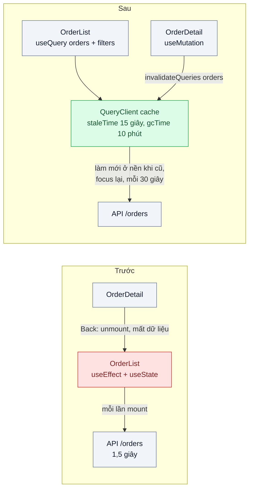
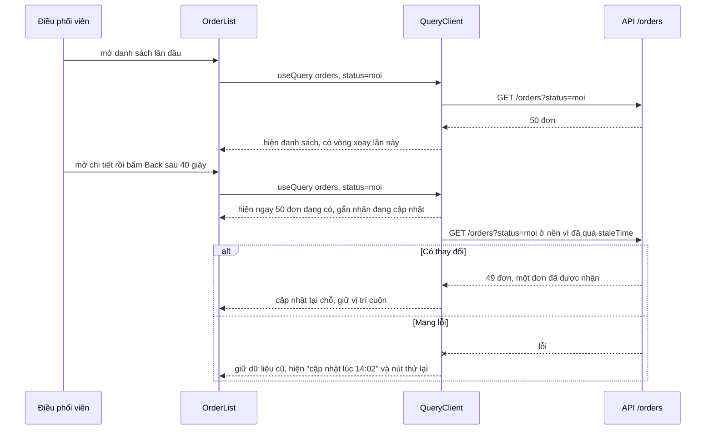

# Stale-While-Revalidate (client) — Quay lại trang danh sách đơn lại thấy vòng xoay loading

| Scope | Mức độ | Trạng thái | Pattern gốc | Cập nhật |
|---|---|---|---|---|
| 04 · frontend / cache | 🟢 Cơ bản | 📋 Kế hoạch | Stale-While-Revalidate — RFC 5861; TanStack Query docs (staleTime, refetch); SWR docs | 2026-10-06 |

> **Một câu tóm tắt:** Giữ kết quả các truy vấn trong một cache phía client theo khóa truy vấn; quay lại màn hình thì hiện ngay bản đang có, đồng thời lặng lẽ lấy bản mới ở nền và cập nhật khi về — thay vì xóa trắng và quay vòng loading mỗi lần điều hướng.

## 1. Bài toán thực tế (What)

**Bối cảnh** *(doanh nghiệp giả định, số liệu minh họa)*
Công ty logistics giao hàng nội thành, khoảng 120 nhân viên điều phối dùng màn hình web "Danh sách đơn" (Next.js App Router) để theo dõi và phân đơn cho shipper. Một ngày, mỗi điều phối viên mở chi tiết đơn rồi quay lại danh sách khoảng 300 lần. Component danh sách gọi API trong `useEffect`, lưu kết quả trong state cục bộ; API danh sách có lọc, phân trang, mất khoảng 800 ms–1,5 giây.

**Triệu chứng người kinh doanh nhìn thấy**
- Mỗi lần quay lại danh sách là một vòng xoay 1–1,5 giây và mất vị trí cuộn; cộng lại mỗi điều phối viên mất vài chục phút chờ mỗi ngày.
- Giờ cao điểm điều phối viên mở nhiều tab để "đỡ phải chờ", rồi thao tác trên tab có dữ liệu cũ, phân nhầm đơn đã có người nhận.
- API danh sách đơn là endpoint nặng nhất hệ thống, phần lớn lượt gọi trả về đúng dữ liệu vừa trả vài giây trước.

**Nguyên nhân kỹ thuật**
Dữ liệu từ server được coi như state của component: component unmount là mất, mount lại là tải lại từ đầu và hiện loading. Không có nơi nào giữ "server state" giữa các màn hình, không có khái niệm dữ liệu *còn dùng được nhưng nên làm mới*. Mỗi lần điều hướng vừa chậm cho người dùng vừa tốn cho server.

**Ràng buộc**
- Trạng thái đơn (đã nhận, đang giao) không được hiển thị cũ quá 30 giây khi điều phối viên đang nhìn màn hình.
- Khi đổi bộ lọc, không được hiện kết quả của bộ lọc khác.
- Đăng xuất trên máy dùng chung phải xóa sạch dữ liệu khách hàng khỏi bộ nhớ trình duyệt.

## 2. Vì sao dùng pattern này (Why)

**Nguyên nhân gốc mà pattern nhắm vào:** ứng dụng chỉ có hai trạng thái "có dữ liệu mới" hoặc "không có gì", trong khi phần lớn thời gian một bản hơi cũ là đủ tốt để hiện ngay.

**Pattern giải quyết thế nào:** RFC 5861 định nghĩa chỉ thị `stale-while-revalidate` cho HTTP cache: trong một khoảng thời gian sau khi hết hạn, cache được trả bản cũ ngay *và* validate lại ở nền. TanStack Query và SWR đưa đúng ý tưởng đó vào cache dữ liệu của ứng dụng: mỗi truy vấn có khóa (`['orders', filters]`); dữ liệu sau `staleTime` bị coi là cũ nhưng vẫn được hiện ngay khi component mount lại, đồng thời truy vấn chạy lại ở nền và thay dữ liệu khi về. Truy vấn không còn ai dùng được giữ thêm `gcTime` rồi mới bị dọn. Tải lại khi cửa sổ được focus lại và `refetchInterval` giữ dữ liệu không cũ quá mức nghiệp vụ cho phép. Sau một thao tác ghi, `invalidateQueries` đánh dấu các truy vấn liên quan là cũ để làm mới ngay.

**Lựa chọn khác đã cân nhắc**

| Lựa chọn | Giải quyết được gì | Vì sao không chọn (ở bài này) |
|---|---|---|
| Giữ nguyên + tối ưu nhỏ (skeleton thay vòng xoay, tăng tốc API) | Cảm giác bớt khó chịu | Vẫn chờ mỗi lần điều hướng; API vẫn bị gọi lặp |
| Tự giữ dữ liệu trong store toàn cục (Redux/Zustand) | Không mất dữ liệu khi unmount | Phải tự viết khóa, hết hạn, làm mới nền, chống gọi trùng — tái phát minh thư viện |
| `stale-while-revalidate` ở HTTP cache của API | Trình duyệt tự trả bản cũ và làm mới | Dữ liệu riêng của tài khoản, cần `private`; hành vi khác nhau giữa trình duyệt; app không biết dữ liệu là cũ để báo |
| Cache router của Next.js cho Server Component | Không cần thư viện | Hành vi cache phía client thay đổi theo phiên bản Next.js (cần xác minh); danh sách có lọc và tương tác dày hợp với component client hơn |
| TanStack Query ở component client (chọn) | Khóa truy vấn, `staleTime`, làm mới nền, chống gọi trùng, invalidation | Thêm một thư viện và một khái niệm mới cho đội |

## 3. Thiết kế hệ thống (How)

### 3.1 Kiến trúc trước và sau



### 3.2 Luồng chính



### 3.3 Thành phần và trách nhiệm

| Thành phần | Trách nhiệm | Quyết định thiết kế đáng chú ý |
|---|---|---|
| `QueryClientProvider` | Một cache cho cả phiên làm việc | Tạo `QueryClient` một lần trong component client (`useState`), không tạo lại mỗi lần render |
| Khóa truy vấn `['orders', filters]` | Định danh dữ liệu trong cache | Mọi tham số ảnh hưởng kết quả (trạng thái, trang, kho) phải nằm trong khóa |
| `staleTime` theo loại dữ liệu | Quyết định khi nào làm mới | Danh sách đơn 15 giây; danh mục kho 10 phút; ràng buộc 30 giây được giữ bằng `refetchInterval` |
| `placeholderData: keepPreviousData` | Đổi trang không nhấp nháy | Hiện trang cũ mờ đi cho tới khi trang mới về, có chỉ báo rõ |
| `useMutation` + `invalidateQueries` | Sau khi phân đơn, danh sách được làm mới | Invalidate theo tiền tố `['orders']` để mọi bộ lọc cùng cũ |
| Đăng xuất | Xóa dữ liệu khỏi bộ nhớ | `queryClient.clear()` trước khi chuyển trang đăng nhập |

### 3.4 Điểm dễ sai khi triển khai
- **Thiếu tham số trong khóa truy vấn.** Đổi bộ lọc mà khóa không đổi thì hiện kết quả của bộ lọc khác — đúng lỗi ràng buộc cấm.
- **Để mặc định mà không hiểu.** Mặc định của TanStack Query v5 là `staleTime: 0` và làm mới khi focus lại: dữ liệu luôn bị coi là cũ, mỗi lần chuyển tab là một đợt request.
- **Tạo `QueryClient` trong thân component.** Mỗi lần render một cache mới, mọi thứ như chưa từng có cache.
- **Hiện dữ liệu cũ mà không báo.** Với dữ liệu ảnh hưởng quyết định (đơn đã có người nhận), luôn hiện chỉ báo "đang cập nhật" hoặc thời điểm cập nhật.
- **Quên xóa cache khi đăng xuất** trên máy dùng chung — rò rỉ dữ liệu khách hàng sang người dùng sau.
- **Dữ liệu server render rồi client tải lại ngay.** Khi kết hợp Server Component, truyền dữ liệu ban đầu và đặt `staleTime` hợp lý để không gọi trùng ngay sau hydrate.

## 4. Tech stack và tác động (Impact techstack)

| Lớp | Công nghệ chọn | Vì sao chọn | Thay thế tương đương |
|---|---|---|---|
| Web | Next.js (App Router), React, TypeScript strict | Mặc định của scope; danh sách là component client | Vite + React Router |
| Cache dữ liệu client | TanStack Query v5 | `staleTime`, `gcTime`, làm mới nền, chống gọi trùng, devtools | SWR, RTK Query, Apollo Client (nếu GraphQL) |
| API | NestJS trên Node 20+, độ trễ giả lập cấu hình được | Trùng stack repo; điều khiển được độ trễ và lỗi để thử | Fastify |
| Test hành vi | Vitest + React Testing Library + MSW | Giả lập API ở mức mạng, kiểm tra không có vòng xoay khi quay lại | Jest |
| Đo trải nghiệm | Playwright | Đo thời gian từ bấm Back tới khi thấy danh sách, đếm request | Chrome DevTools Performance |

**Thay đổi so với hệ thống hiện tại:** thay `useEffect` gọi API bằng `useQuery`; thêm provider và quy ước khóa truy vấn; mọi thao tác ghi phải khai báo truy vấn nào bị invalidate. Đội phải học phân biệt server state (cache) với client state (bộ lọc, form).

## 5. Kết quả đầu ra và cách đo (Output impact)

| Chỉ số | Trước (minh họa) | Mục tiêu khi thực hành | Cách đo |
|---|---|---|---|
| Thời gian từ bấm Back tới khi thấy danh sách | 1,2 giây | ≤ 100 ms | Playwright: `performance.mark` khi bấm và khi hàng đầu tiên hiện, trung vị 20 lần |
| Tỷ lệ lần quay lại có vòng xoay | 100 % | 0 % khi đã có dữ liệu trong cache | Playwright kiểm tra phần tử loading không xuất hiện |
| Request `/orders` mỗi điều phối viên mỗi giờ | ≈ 40 | ≤ 15 | Log API theo phiên, hoặc DevTools Network trong kịch bản 1 giờ rút gọn |
| Độ cũ tối đa của trạng thái đơn khi đang xem | không kiểm soát | ≤ 30 giây | Đổi trạng thái đơn ở API, đo thời điểm UI cập nhật |
| Dữ liệu còn lại sau đăng xuất | còn trong bộ nhớ | 0 truy vấn trong cache | Test kiểm tra `queryClient.getQueryCache().getAll()` rỗng |

> Số "trước" là minh họa để hình dung bài toán. Số "mục tiêu" chỉ được coi là đạt khi có số đo thật
> ở mục 8 kèm môi trường đo.

**Tác động nghiệp vụ mong đợi:** điều phối viên không còn chờ mỗi lần quay lại danh sách, bớt mở nhiều tab dữ liệu cũ, và API nặng nhất hệ thống nhận ít lượt gọi hơn.

## 6. Đánh đổi và khi KHÔNG nên dùng

**Đánh đổi**
- Người dùng có thể thao tác trên dữ liệu cũ trong vài giây; server vẫn phải kiểm tra (ví dụ phân đơn đã có người nhận trả 409).
- Thêm thư viện, thêm quy ước khóa và invalidation phải giữ đúng khi app lớn lên.
- Bộ nhớ trình duyệt giữ dữ liệu lâu hơn; cần chính sách `gcTime` và xóa khi đăng xuất.

**Không nên dùng khi**
- Màn hình bắt buộc dữ liệu mới tuyệt đối trước khi thao tác (xác nhận thanh toán, tồn kho khi đặt): tải mới và chờ.
- Dữ liệu cần cập nhật tức thì liên tục (bảng giá đấu giá): dùng realtime (scope 06), cache chỉ giữ trạng thái ban đầu.
- Trang hiếm khi được quay lại và không chia sẻ dữ liệu với màn khác: lợi ích nhỏ.

**Liên quan**
- Đọc trước: [01 — HTTP Caching](../01-http-cache-headers-anh-san-pham-tai-lai-moi-lan/).
- Đọc sau: [04 — Optimistic UI](../04-optimistic-ui-bam-thich-cho-mot-giay/), [05 — Normalized Client Cache](../05-normalized-cache-mot-user-hai-ten-khac-nhau/).
- Cùng chủ đề: [06-01 — SSE vs WebSocket vs Polling](../../06-frontend-backend-realtime/01-sse-vs-websocket-vs-polling-theo-doi-trang-thai-don/) — đẩy thay đổi thay cho làm mới định kỳ; [01-02 — Cursor-based Pagination](../../01-frontend-backend-transporter/02-cursor-pagination-trang-500-lich-su-giao-dich/).

## 7. Cơ sở tham khảo

- RFC 5861, *HTTP Cache-Control Extensions for Stale Content*, IETF, 2010 — https://www.rfc-editor.org/rfc/rfc5861 — định nghĩa `stale-while-revalidate` và `stale-if-error`, nguồn gốc tên pattern.
- TanStack Query docs, "Important Defaults", "Caching Examples", "Query Keys", "Query Invalidation" — https://tanstack.com/query/latest — `staleTime`, `gcTime`, làm mới khi focus, khóa truy vấn và invalidation.
- SWR docs — https://swr.vercel.app/ — cùng mô hình stale-while-revalidate cho React, dùng làm phương án thay thế.
- MDN Web Docs, "Cache-Control" — https://developer.mozilla.org/docs/Web/HTTP/Headers/Cache-Control — chỉ thị `stale-while-revalidate` ở tầng HTTP để so sánh.
- Next.js docs — https://nextjs.org/docs — ranh giới Server Component và Client Component khi đặt `QueryClientProvider`.

## 8. Kế hoạch thực hành

- [ ] Bước 1: dựng Next.js với màn "Danh sách đơn" (lọc, phân trang) và "Chi tiết đơn"; API NestJS độ trễ 1,2 giây; component dùng `useEffect` như hiện trạng.
- [ ] Bước 2: đo "trước" bằng Playwright: 20 lần mở chi tiết rồi Back; ghi thời gian thấy danh sách, số request, số lần thấy loading.
- [ ] Bước 3: thêm TanStack Query: provider, quy ước khóa, `staleTime` theo loại dữ liệu, `refetchInterval` 30 giây, `keepPreviousData`, invalidation sau phân đơn, xóa cache khi đăng xuất.
- [ ] Bước 4: đo "sau" cùng kịch bản; ghi số thật và môi trường vào mục 5.
- [ ] Bước 5: test: (a) quay lại danh sách không hiện loading khi đã có cache; (b) đổi bộ lọc không hiện dữ liệu bộ lọc khác; (c) phân đơn xong danh sách cập nhật; (d) đăng xuất xóa sạch cache; (e) mạng lỗi vẫn giữ dữ liệu cũ kèm thời điểm cập nhật.

**Cấu trúc code dự kiến**
```text
web/
  app/providers.tsx              # [PATTERN] QueryClient tạo một lần
  app/orders/page.tsx
  src/orders/order-queries.ts    # [PATTERN] khóa truy vấn, staleTime theo loại dữ liệu
  src/orders/order-list.tsx      # useQuery + keepPreviousData
  src/orders/assign-order.ts     # useMutation + invalidateQueries
  test/
    back-navigation-no-spinner.test.tsx
    filter-change-never-shows-other-filter.test.tsx
    logout-clears-cache.test.tsx
api/                             # NestJS, độ trễ và lỗi cấu hình được
e2e/back-navigation.spec.ts
docker-compose.yml
```

**Cách chạy** *(điền khi bắt đầu code)*
```bash
docker compose up -d
pnpm install && pnpm test
```
