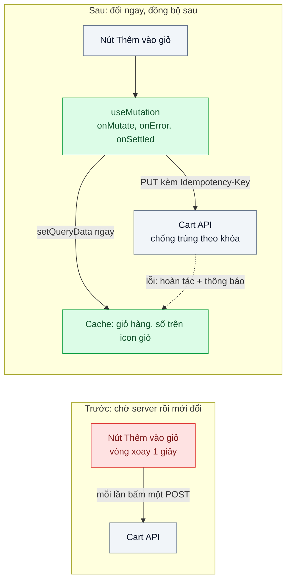
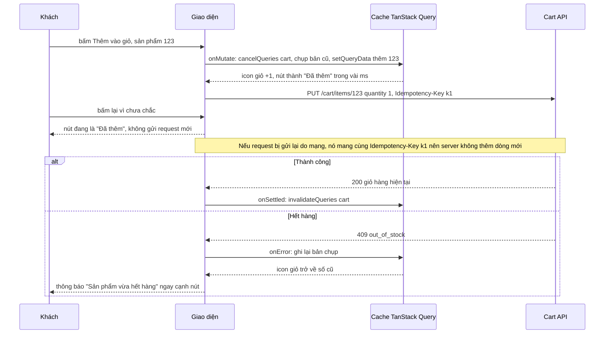

# Optimistic UI — Bấm "Thích" / "Thêm vào giỏ" phải chờ 1 giây mới thấy phản hồi

| Scope | Mức độ | Trạng thái | Pattern gốc | Cập nhật |
|---|---|---|---|---|
| 04 · frontend / cache | 🟡 Trung bình | 📋 Kế hoạch | Optimistic UI — TanStack Query docs "Optimistic Updates"; Apollo Client docs "Optimistic mutation results"; Nielsen, "Response Times" (1993) | 2026-10-06 |

> **Một câu tóm tắt:** Cập nhật giao diện ngay khi khách bấm như thể server đã đồng ý, gửi request ở nền, và hoàn tác kèm thông báo rõ ràng nếu server từ chối — để thao tác thường thành công gần như luôn thấy phản hồi tức thì.

## 1. Bài toán thực tế (What)

**Bối cảnh** *(doanh nghiệp giả định, số liệu minh họa)*
Sàn thương mại điện tử, 75 % lượt truy cập từ web di động, phần lớn qua 4G với độ trễ khứ hồi 300–800 ms. Nút "Thích" (lưu sản phẩm yêu thích) và "Thêm vào giỏ" ở trang danh mục hiện vòng xoay cho tới khi API trả về; p75 khoảng 1 giây. Tỷ lệ thành công của hai thao tác này trên 99 %.

**Triệu chứng người kinh doanh nhìn thấy**
- Khách bấm "Thêm vào giỏ" không thấy gì đổi ngay nên bấm thêm lần nữa; giỏ có 2–3 sản phẩm giống nhau, khách bực mình phải xóa bớt, một phần bỏ giỏ.
- Phân tích phiên ghi hình cho thấy nhiều khách lướt qua trước khi vòng xoay kết thúc và không biết sản phẩm đã vào giỏ hay chưa.
- Bấm "Thích" liên tục ở danh mục cảm giác "đơ"; đội sản phẩm đo được tỷ lệ dùng tính năng yêu thích thấp hơn kỳ vọng.

**Nguyên nhân kỹ thuật**
Giao diện chờ xác nhận của server trước khi đổi trạng thái (cách làm *pessimistic*). Với độ trễ mạng di động, mỗi thao tác tốn ít nhất một vòng khứ hồi trước khi có phản hồi thị giác có ý nghĩa — vượt mốc 0,1 giây mà Nielsen mô tả là ngưỡng cảm giác "tức thì". Không có cơ chế chống bấm trùng nên mỗi lần bấm lại là một request thêm vào giỏ mới.

**Ràng buộc**
- Server luôn là nguồn sự thật: hết hàng, vượt giới hạn mua, chưa đăng nhập phải được phản ánh lại giao diện rõ ràng.
- Bấm nhiều lần không được tạo nhiều dòng giỏ hàng.
- Không áp dụng cho thanh toán và đặt hàng — những thao tác đó vẫn chờ xác nhận.

## 2. Vì sao dùng pattern này (Why)

**Nguyên nhân gốc mà pattern nhắm vào:** giao diện gắn phản hồi thị giác vào thời gian mạng, trong khi kết quả gần như luôn đoán trước được.

**Pattern giải quyết thế nào:** TanStack Query docs mô tả hai cách. (1) **Qua cache:** trong `onMutate`, hủy các truy vấn đang chạy của dữ liệu liên quan, chụp lại giá trị hiện tại, ghi giá trị mong đợi vào cache bằng `setQueryData`; nếu `onError`, ghi lại bản chụp; `onSettled` invalidate để đồng bộ với server. Mọi màn hình dùng dữ liệu đó đổi cùng lúc. (2) **Qua giao diện:** chỉ hiển thị `variables` của mutation đang chạy (trạng thái pending) ở đúng chỗ bấm, không đụng cache — đơn giản hơn khi chỉ một chỗ cần hiển thị. Apollo Client có cơ chế tương đương bằng `optimisticResponse`: kết quả lạc quan được ghi vào lớp tạm của cache rồi bị thay khi response thật về. Kết hợp với request mang *trạng thái mong muốn* ("thích = true") thay vì *lệnh đảo* ("đảo trạng thái thích"), và idempotency key cho "Thêm vào giỏ", bấm nhiều lần không còn tạo kết quả trùng.

**Lựa chọn khác đã cân nhắc**

| Lựa chọn | Giải quyết được gì | Vì sao không chọn (ở bài này) |
|---|---|---|
| Giữ nguyên + tối ưu nhỏ (khóa nút khi đang gửi, vòng xoay nhỏ hơn) | Hết bấm trùng | Vẫn chờ 1 giây mới biết kết quả |
| Tăng tốc API, đặt API gần người dùng hơn | Giảm thời gian xử lý | Không vượt qua được độ trễ mạng di động; vẫn tối thiểu một vòng khứ hồi |
| Skeleton/hiệu ứng chuyển động trong lúc chờ | Đỡ cảm giác treo | Khách vẫn không biết thao tác đã thành công chưa |
| Cập nhật lạc quan qua cache TanStack Query + trạng thái mong muốn + idempotency key (chọn) | Phản hồi tức thì, đồng bộ mọi màn hình, không trùng | Phải xử lý hoàn tác và thứ tự response |

## 3. Thiết kế hệ thống (How)

### 3.1 Kiến trúc trước và sau



### 3.2 Luồng chính



### 3.3 Thành phần và trách nhiệm

| Thành phần | Trách nhiệm | Quyết định thiết kế đáng chú ý |
|---|---|---|
| `useAddToCart` | Mutation lạc quan qua cache | `onMutate` trả về bản chụp làm context cho `onError`; `onSettled` luôn invalidate |
| `useToggleFavorite` | Mutation lạc quan qua giao diện | Gửi trạng thái mong muốn `PUT /favorites/123 { liked: true }`, hiển thị theo `variables` khi pending |
| Idempotency key | Bấm lặp không tạo trùng | Sinh một khóa cho mỗi *ý định* thêm giỏ; giữ khóa khi bấm lại trong lúc pending |
| Cart API | Nguồn sự thật, chống trùng | Lưu kết quả theo khóa (`01-frontend-backend-transporter` bài 03); trả lỗi có mã để client hiện thông báo đúng |
| Thông báo hoàn tác | Cho khách biết vì sao trạng thái quay lại | Hiện tại chỗ bấm, không chỉ toast góc màn hình |
| Đo phản hồi thị giác | Chứng minh cải thiện | `performance.mark` lúc bấm và lúc giao diện đổi; ghi tỷ lệ hoàn tác |

### 3.4 Điểm dễ sai khi triển khai
- **Không hủy truy vấn đang chạy trong `onMutate`.** Một lần làm mới đang bay về sau sẽ ghi đè giá trị lạc quan, giao diện nhấp nháy về trạng thái cũ.
- **Gửi lệnh "đảo trạng thái".** Bấm Thích/Bỏ thích nhanh, response về sai thứ tự làm trạng thái cuối sai; gửi trạng thái mong muốn để request cuối cùng thắng.
- **Hoàn tác im lặng.** Trạng thái tự quay lại mà không nói lý do khiến khách nghĩ là lỗi giao diện.
- **Lạc quan cho thao tác hay thất bại hoặc không đảo ngược được.** Thanh toán, đặt chỗ giới hạn, xóa vĩnh viễn: không dùng.
- **Quên `onSettled` invalidate.** Giá trị lạc quan (ví dụ tổng tiền tính ở client) lệch với giá trị server tính, không bao giờ được sửa.
- **Đo bằng INP rồi kết luận không cải thiện.** INP đo tới khung hình kế tiếp; vòng xoay cũng là một khung hình. Cần đo thời điểm *nội dung đúng* xuất hiện.

## 4. Tech stack và tác động (Impact techstack)

| Lớp | Công nghệ chọn | Vì sao chọn | Thay thế tương đương |
|---|---|---|---|
| Web | Next.js (App Router), React, TypeScript strict | Mặc định của scope | Vite + React |
| Cache + mutation | TanStack Query v5 (`useMutation`, `setQueryData`, `cancelQueries`) | Có sẵn vòng đời `onMutate`/`onError`/`onSettled` cho cập nhật lạc quan | Apollo Client `optimisticResponse` (GraphQL), SWR `optimisticData` |
| API | NestJS trên Node 20+, độ trễ và lỗi cấu hình được | Trùng stack repo; tái hiện 409 hết hàng, 5xx | Fastify |
| Chống trùng | Idempotency-Key lưu trong Redis 7 | Tái sử dụng bài `01-frontend-backend-transporter` bài 03 | Bảng trong PostgreSQL |
| Test | Vitest + React Testing Library + MSW | Giả lập độ trễ và lỗi ở mức mạng, kiểm tra hoàn tác | Jest |
| Đo | Playwright với giả lập mạng chậm | Đo thời gian tới phản hồi thị giác trên 4G mô phỏng | Chrome DevTools Performance |

**Thay đổi so với hệ thống hiện tại:** nút thao tác chuyển sang mutation lạc quan; API đổi sang dạng trạng thái mong muốn và nhận Idempotency-Key; thêm quy ước thông báo hoàn tác. Đội sản phẩm phải quyết định danh sách thao tác được phép lạc quan.

## 5. Kết quả đầu ra và cách đo (Output impact)

| Chỉ số | Trước (minh họa) | Mục tiêu khi thực hành | Cách đo |
|---|---|---|---|
| Thời gian từ bấm tới khi giao diện thể hiện kết quả | p75 1.000 ms | p75 ≤ 100 ms | Playwright, mạng 4G mô phỏng, `performance.mark` lúc bấm và lúc icon giỏ đổi |
| Dòng giỏ hàng trùng do bấm lặp | 4 % lượt thêm giỏ | 0 | Kịch bản bấm 3 lần liên tiếp; đếm dòng giỏ ở API |
| Trạng thái Thích cuối cùng đúng sau 10 lần bấm nhanh | sai trong một số lượt | đúng 100 % | Test với MSW trả response sai thứ tự |
| Tỷ lệ hoàn tác | — | ghi nhận, kỳ vọng < 1 % | Counter phía client gửi về endpoint đo |
| Hoàn tác có thông báo rõ | không có | 100 % lượt hoàn tác | Test kiểm tra thông báo xuất hiện cạnh nút |

> Số "trước" là minh họa để hình dung bài toán. Số "mục tiêu" chỉ được coi là đạt khi có số đo thật
> ở mục 8 kèm môi trường đo.

**Tác động nghiệp vụ mong đợi:** thao tác thêm giỏ và yêu thích cảm giác tức thì trên di động, không còn giỏ hàng trùng sản phẩm do bấm lặp, kỳ vọng tăng tỷ lệ dùng tính năng yêu thích (cần đo bằng A/B khi triển khai thật).

## 6. Đánh đổi và khi KHÔNG nên dùng

**Đánh đổi**
- Có khoảnh khắc giao diện "nói dối": hiển thị thành công khi server chưa đồng ý; hoàn tác phải được thiết kế cẩn thận.
- Code mutation dài hơn (chụp, ghi, hoàn tác, invalidate) và cần test cho thứ tự response.
- API phải đổi sang dạng idempotent; không phải API cũ nào cũng làm được ngay.

**Không nên dùng khi**
- Thao tác hay thất bại (tồn kho giới hạn trong flash sale, giữ chỗ): hoàn tác liên tục còn tệ hơn chờ.
- Thao tác không đảo ngược được hoặc có hậu quả tài chính (thanh toán, chuyển tiền, gửi email): chờ xác nhận.
- Kết quả phụ thuộc tính toán phức tạp ở server (giá sau khuyến mãi chồng nhau): client không đoán đúng được, chỉ lạc quan phần chắc chắn.

**Liên quan**
- Đọc trước: [03 — Stale-While-Revalidate](../03-stale-while-revalidate-quay-lai-trang-lai-thay-loading/).
- Đọc sau: [05 — Normalized Client Cache](../05-normalized-cache-mot-user-hai-ten-khac-nhau/) — khi nhiều màn hình phải đổi theo cùng một cập nhật.
- Cùng chủ đề: [01-03 — Idempotency Key](../../01-frontend-backend-transporter/03-idempotency-key-bam-thanh-toan-hai-lan/); [22-07 — Streaming for Perceived Latency](../../22-backend-ai-optimizer/07-streaming-ttft-khach-nhin-man-hinh-trang-8-giay/) — cùng mục tiêu cải thiện cảm nhận độ trễ.

## 7. Cơ sở tham khảo

- TanStack Query docs, "Optimistic Updates" — https://tanstack.com/query/latest — hai cách cập nhật lạc quan (qua giao diện bằng `variables`, qua cache bằng `onMutate`/`onError`/`onSettled`).
- Apollo Client docs, "Optimistic mutation results" — https://www.apollographql.com/docs/ — `optimisticResponse` và lớp cache tạm bị thay khi có kết quả thật.
- Jakob Nielsen, "Response Times: The 3 Important Limits", 1993 — https://www.nngroup.com/articles/response-times-3-important-limits/ — mốc 0,1 giây / 1 giây / 10 giây làm thước đo mục tiêu.
- IETF draft, "The Idempotency-Key HTTP Header Field" (draft-ietf-httpapi-idempotency-key-header) — https://datatracker.ietf.org/doc/draft-ietf-httpapi-idempotency-key-header/ — ngữ nghĩa header chống trùng cho request lặp.
- Mock Service Worker docs — https://mswjs.io/docs — giả lập độ trễ, lỗi và thứ tự response trong test.

## 8. Kế hoạch thực hành

- [ ] Bước 1: dựng trang danh mục Next.js với nút Thích và Thêm vào giỏ, icon giỏ ở header; API NestJS độ trễ 800 ms, tỷ lệ 409 cấu hình được; cách làm chờ server như hiện trạng.
- [ ] Bước 2: đo "trước" bằng Playwright trên 4G mô phỏng: thời gian tới phản hồi, số dòng trùng khi bấm lặp, trạng thái sau bấm Thích nhanh.
- [ ] Bước 3: chuyển sang mutation lạc quan qua cache (giỏ hàng) và qua giao diện (Thích); API nhận trạng thái mong muốn và Idempotency-Key; thông báo hoàn tác tại chỗ.
- [ ] Bước 4: đo "sau" cùng kịch bản; ghi số thật và môi trường vào mục 5.
- [ ] Bước 5: test: (a) giao diện đổi trước khi response về; (b) 409 thì hoàn tác và hiện thông báo; (c) bấm 3 lần chỉ một dòng giỏ; (d) response sai thứ tự không làm sai trạng thái Thích cuối cùng.

**Cấu trúc code dự kiến**
```text
web/
  src/cart/use-add-to-cart.ts    # [PATTERN] onMutate chụp + setQueryData, onError hoàn tác
  src/favorites/use-toggle-favorite.ts  # [PATTERN] lạc quan qua variables, gửi trạng thái mong muốn
  src/cart/cart-badge.tsx
  test/
    optimistic-update-before-response.test.tsx
    rollback-on-409-shows-message.test.tsx
    out-of-order-responses-final-state.test.tsx
api/                             # NestJS, Idempotency-Key trên Redis
e2e/add-to-cart-latency.spec.ts
docker-compose.yml               # api, redis
```

**Cách chạy** *(điền khi bắt đầu code)*
```bash
docker compose up -d
pnpm install && pnpm test
```
