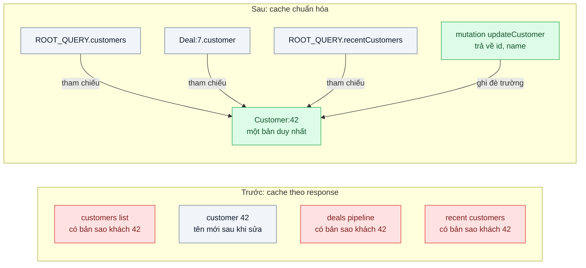
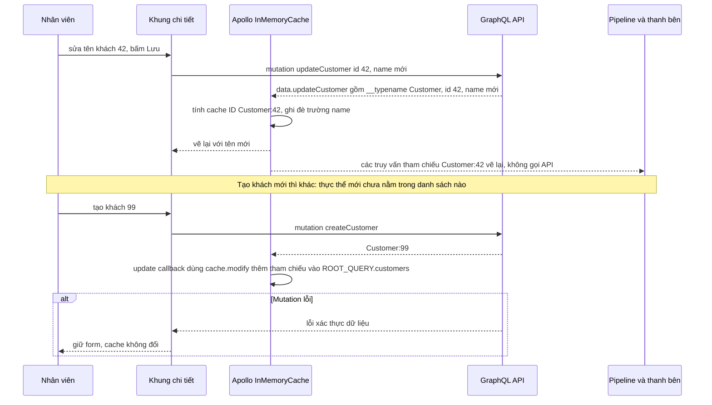

# Normalized Client Cache — Cùng một khách hàng hiển thị tên cũ ở màn này, tên mới ở màn kia

| Scope | Mức độ | Trạng thái | Pattern gốc | Cập nhật |
|---|---|---|---|---|
| 04 · frontend / cache | 🟡 Trung bình | 📋 Kế hoạch | Normalized Client Cache — Apollo Client docs "InMemoryCache" (normalization); Redux docs "Normalizing State Shape" | 2026-10-06 |

> **Một câu tóm tắt:** Lưu mỗi thực thể (khách hàng, cơ hội bán hàng) đúng *một* lần trong cache theo khóa `kiểu:id`, các truy vấn chỉ giữ tham chiếu tới nó — sửa ở một màn hình là mọi màn hình đang hiển thị thực thể đó đổi theo.

## 1. Bài toán thực tế (What)

**Bối cảnh** *(doanh nghiệp giả định, số liệu minh họa)*
Công ty SaaS B2B bán CRM cho doanh nghiệp vừa và nhỏ. Một nhân viên kinh doanh thường mở cùng lúc: danh sách khách hàng, khung chi tiết khách hàng, bảng pipeline cơ hội (mỗi thẻ có tên và người liên hệ của khách) và khối "khách vừa xem" ở thanh bên. Mỗi màn gọi một API riêng và cache kết quả theo truy vấn (TanStack Query); cùng một khách hàng nằm *lồng* bên trong bốn kết quả khác nhau.

**Triệu chứng người kinh doanh nhìn thấy**
- Nhân viên sửa tên khách từ "Cty Minh Phát" thành "Công ty TNHH Minh Phát Logistics" ở khung chi tiết; bảng pipeline vẫn hiện tên cũ tới khi tải lại trang. Họ tưởng là hai khách khác nhau và tạo thêm bản trùng.
- Đổi người phụ trách một khách xong, thanh bên vẫn hiện người cũ; trưởng nhóm phân việc nhầm.
- Đội phát triển "chữa" bằng cách gọi lại mọi API sau mỗi lần sửa; màn hình chớp và chậm, request tăng gấp nhiều lần.

**Nguyên nhân kỹ thuật**
Cache đang lưu theo *tài liệu* (mỗi response một mục), nên một thực thể có nhiều bản sao lồng trong nhiều mục. Thao tác sửa chỉ cập nhật đúng mục mà màn hình đó dùng; các bản sao khác không biết mình đã cũ. Muốn đồng bộ phải biết trước mọi truy vấn có chứa khách hàng đó — điều không ai nhớ nổi khi app có hàng chục màn hình.

**Ràng buộc**
- Sửa ở một nơi phải hiện ở mọi nơi trong cùng phiên, không cần tải lại trang.
- Không được gọi lại mọi API sau mỗi lần sửa.
- Thêm/xóa khách hàng phải phản ánh đúng ở các danh sách liên quan.

## 2. Vì sao dùng pattern này (Why)

**Nguyên nhân gốc mà pattern nhắm vào:** dữ liệu bị nhân bản trong cache, nên không có một nơi duy nhất để cập nhật.

**Pattern giải quyết thế nào:** Redux docs mô tả *normalized state shape* như một cơ sở dữ liệu nhỏ phía client: mỗi loại thực thể một "bảng" lưu theo id, quan hệ giữa thực thể lưu bằng id thay vì lồng object, nên mỗi thực thể chỉ có một bản. Apollo Client làm việc đó tự động với `InMemoryCache`: khi nhận response GraphQL, nó tách từng object có `__typename` và `id` thành một mục riêng với *cache ID* `Customer:42`, còn kết quả truy vấn chỉ giữ tham chiếu. Mutation trả về `{ id, name }` của khách hàng là đủ để cache cập nhật `Customer:42` và mọi truy vấn đang theo dõi nó vẽ lại. Bài này dùng Apollo làm phương án chính vì chuẩn hóa tự động là cốt lõi của pattern, và làm thêm biến thể REST với `createEntityAdapter` của Redux Toolkit để thấy cơ chế khi phải tự chuẩn hóa.

**Lựa chọn khác đã cân nhắc**

| Lựa chọn | Giải quyết được gì | Vì sao không chọn (ở bài này) |
|---|---|---|
| Giữ nguyên + tối ưu nhỏ (invalidate mọi truy vấn liên quan sau khi sửa) | Dữ liệu cuối cùng đúng | Gọi lại nhiều API, màn hình chớp; phải nhớ đủ danh sách truy vấn liên quan |
| Cập nhật tay mọi mục cache có chứa khách hàng (`setQueriesData`) | Không gọi lại API | Code cập nhật phải biết cấu trúc của mọi response; dễ sót khi thêm màn mới |
| Đẩy thay đổi realtime từ server (scope 06) | Đồng bộ cả giữa nhiều người dùng | Vẫn cần nơi duy nhất trong client để áp thay đổi; không thay thế chuẩn hóa |
| Apollo `InMemoryCache` qua GraphQL (chọn, biến thể REST + `createEntityAdapter` để so sánh) | Một bản cho mỗi thực thể, cập nhật lan tự động | Cần endpoint GraphQL; phải học cache ID, `typePolicies`, cập nhật danh sách |

## 3. Thiết kế hệ thống (How)

### 3.1 Kiến trúc trước và sau



### 3.2 Luồng chính



### 3.3 Thành phần và trách nhiệm

| Thành phần | Trách nhiệm | Quyết định thiết kế đáng chú ý |
|---|---|---|
| `InMemoryCache` + `typePolicies` | Chuẩn hóa thực thể theo cache ID | Mặc định `__typename` + `id`; khai báo `keyFields` cho kiểu dùng khóa khác |
| Fragment `CustomerCard` | Trường dùng chung cho mọi màn hiển thị khách | Mọi truy vấn có khách đều lấy `id` qua fragment — thiếu `id` là mất chuẩn hóa |
| Mutation trả về thực thể đã sửa | Đủ để cache tự cập nhật | Trả mọi trường mà các màn hình đang hiển thị, không chỉ trường vừa sửa |
| `update` + `cache.modify` | Thêm/xóa tham chiếu trong danh sách | Chuẩn hóa chỉ cập nhật thực thể *đã có*; danh sách phải được sửa tường minh |
| `cache.evict` + `cache.gc` | Xóa thực thể khi xóa khách | Tránh tham chiếu treo trong danh sách |
| Biến thể REST: `createEntityAdapter` | Tự chuẩn hóa response REST vào bảng `customers` | Màn hình chọn thực thể theo id; giúp so sánh công sức với Apollo |

### 3.4 Điểm dễ sai khi triển khai
- **Truy vấn không lấy `id`.** Apollo không tính được cache ID, object bị lưu lồng trong cha — quay lại đúng lỗi bản sao.
- **Nghĩ rằng chuẩn hóa tự xử lý thêm/xóa.** Thực thể mới không tự xuất hiện trong danh sách; cần `cache.modify` hoặc refetch có chủ đích.
- **Mutation trả về thiếu trường.** Trường không có trong response không được cập nhật; màn hình dùng trường đó vẫn hiện giá trị cũ.
- **Hai kiểu cùng id nhưng khác nghĩa** (khách hàng và người liên hệ đều id 42): cache ID có `__typename` nên an toàn, nhưng biến thể REST tự viết dễ trộn nếu chỉ dùng id.
- **Danh sách phân trang ghi đè nhau.** Cần `typePolicies` với `keyArgs`/`merge` cho trường phân trang, nếu không trang 2 thay trang 1.
- **Không dọn cache khi đăng xuất**: `client.clearStore()` cho máy dùng chung.

## 4. Tech stack và tác động (Impact techstack)

| Lớp | Công nghệ chọn | Vì sao chọn | Thay thế tương đương |
|---|---|---|---|
| Web | Next.js (App Router), React, TypeScript strict | Mặc định của scope | Vite + React |
| Cache chuẩn hóa | Apollo Client `InMemoryCache` | Chuẩn hóa tự động theo `__typename` + `id`, `typePolicies`, `cache.modify` | urql với Graphcache, Relay |
| API | NestJS + `@nestjs/graphql` (Apollo Server) trên Node 20+ | Trùng stack repo; dùng lại GraphQL của `01-frontend-backend-transporter` bài 06 | GraphQL Yoga |
| Biến thể REST | Redux Toolkit `createEntityAdapter` + endpoint REST NestJS | Thấy rõ chuẩn hóa thủ công khi không có GraphQL | Zustand tự viết bảng theo id |
| Dữ liệu | PostgreSQL 16 | Khách hàng, cơ hội, người liên hệ có quan hệ | — |
| Test | Vitest + React Testing Library, Playwright | Kiểm tra bốn màn hình cùng đổi sau một mutation | Jest, Cypress |

**Thay đổi so với hệ thống hiện tại:** thêm endpoint GraphQL cho các màn CRM chính (hoặc lớp chuẩn hóa cho REST), quy ước fragment và `typePolicies`; mọi mutation phải trả về thực thể đã sửa. Đội phải học tư duy "cache là cơ sở dữ liệu nhỏ" thay vì "cache là bản lưu response".

## 5. Kết quả đầu ra và cách đo (Output impact)

| Chỉ số | Trước (minh họa) | Mục tiêu khi thực hành | Cách đo |
|---|---|---|---|
| Số màn hình còn hiện tên cũ sau khi sửa (trên 4 màn đang mở) | 3 | 0 | Playwright mở 4 màn, sửa tên, kiểm tra text ở từng màn |
| Request phát sinh sau một lần sửa | 4 (invalidate tất cả) | 1 (chỉ mutation) | DevTools Network / đếm request trong Playwright |
| Thời gian từ khi mutation trả về tới khi mọi màn đổi | tới lúc tải lại | ≤ 1 khung hình | `performance.mark` khi nhận response và khi màn cuối cùng vẽ lại |
| Khách mới hiện trong danh sách sau khi tạo | phải tải lại | ngay | Test tạo khách rồi kiểm tra danh sách |
| Số bản ghi khách trùng tạo nhầm mỗi tuần | minh họa vài chục | theo dõi sau triển khai | Truy vấn trùng tên/MST trong PostgreSQL |

> Số "trước" là minh họa để hình dung bài toán. Số "mục tiêu" chỉ được coi là đạt khi có số đo thật
> ở mục 8 kèm môi trường đo.

**Tác động nghiệp vụ mong đợi:** nhân viên kinh doanh thấy một khách hàng là một khách hàng ở mọi màn hình, bớt tạo bản trùng và phân việc nhầm, trong khi app gọi ít request hơn.

## 6. Đánh đổi và khi KHÔNG nên dùng

**Đánh đổi**
- Cache phức tạp hơn: cache ID, `typePolicies`, merge phân trang, cập nhật danh sách tường minh.
- Gắn với GraphQL (hoặc phải tự viết lớp chuẩn hóa cho REST).
- Lỗi chuẩn hóa thường im lặng (thiếu `id`), cần devtools và test để phát hiện.

**Không nên dùng khi**
- App ít màn hình, ít thực thể dùng chung: invalidate theo khóa truy vấn (bài 03) đơn giản và đủ.
- Dữ liệu chủ yếu là báo cáo tổng hợp, không có thực thể lặp lại giữa các màn: không có gì để chuẩn hóa.
- Đội chưa dùng GraphQL và không có thời gian xây lớp chuẩn hóa: bắt đầu với invalidation có chủ đích.

**Liên quan**
- Đọc trước: [03 — Stale-While-Revalidate](../03-stale-while-revalidate-quay-lai-trang-lai-thay-loading/), [04 — Optimistic UI](../04-optimistic-ui-bam-thich-cho-mot-giay/).
- Cùng chủ đề: [01-06 — GraphQL](../../01-frontend-backend-transporter/06-graphql-dashboard-tai-2mb-hien-12-truong/); [06-07 — Collaborative Editing](../../06-frontend-backend-realtime/07-crdt-nhieu-nguoi-cung-sua-mot-bao-gia/) — đồng bộ giữa nhiều người dùng; [02-06 — CQRS](../../02-backend-database/06-cqrs-man-hinh-tong-hop-join-9-bang/) — mô hình đọc khác mô hình ghi ở phía server.

## 7. Cơ sở tham khảo

- Apollo Client docs, "Caching in Apollo Client" / "Configuring the cache" — https://www.apollographql.com/docs/ — cách `InMemoryCache` chuẩn hóa theo cache ID, `typePolicies`, `keyFields`, `cache.modify`, `evict`/`gc`.
- Redux docs, "Normalizing State Shape" — https://redux.js.org/usage/structuring-reducers/normalizing-state-shape — nguyên tắc lưu thực thể theo id, quan hệ bằng id, mỗi thực thể một bản.
- Redux Toolkit docs, "createEntityAdapter" — https://redux-toolkit.js.org/api/createEntityAdapter — công cụ chuẩn hóa cho biến thể REST.
- GraphQL docs, "Caching" — https://graphql.org/learn/ — vì sao định danh toàn cục cho object là điều kiện để client cache chuẩn hóa.
- TanStack Query docs, "Query Invalidation" — https://tanstack.com/query/latest — phương án invalidation theo khóa dùng ở bảng so sánh.

## 8. Kế hoạch thực hành

- [ ] Bước 1: dựng CRM tối giản: NestJS + PostgreSQL (khách hàng, cơ hội, người liên hệ), Next.js với 4 màn hiển thị cùng khách hàng, cache theo response (TanStack Query) như hiện trạng.
- [ ] Bước 2: đo "trước" bằng Playwright: sửa tên ở khung chi tiết, đếm màn hiện tên cũ và request phát sinh; thử phương án invalidate tất cả.
- [ ] Bước 3: thêm endpoint GraphQL, chuyển 4 màn sang Apollo Client với fragment chung; mutation trả thực thể; `cache.modify` cho tạo/xóa; làm biến thể REST với `createEntityAdapter`.
- [ ] Bước 4: đo "sau" cho cả hai biến thể cùng kịch bản; ghi số thật và môi trường vào mục 5.
- [ ] Bước 5: test: (a) sửa tên làm 4 màn đổi mà không có request đọc mới; (b) tạo khách hiện ngay trong danh sách; (c) xóa khách không để tham chiếu treo; (d) truy vấn thiếu `id` bị phát hiện bởi test kiểm tra cache.

**Cấu trúc code dự kiến**
```text
web/
  src/apollo/client.ts           # [PATTERN] InMemoryCache + typePolicies
  src/customers/customer-card.fragment.ts
  src/customers/use-update-customer.ts
  src/customers/use-create-customer.ts   # [PATTERN] cache.modify thêm tham chiếu
  src/rest-variant/customers-slice.ts    # [PATTERN] createEntityAdapter
  test/
    one-update-refreshes-all-views.test.tsx
    create-adds-to-list.test.tsx
api/                             # NestJS GraphQL + REST, PostgreSQL
e2e/four-views-consistency.spec.ts
docker-compose.yml               # postgres, api
```

**Cách chạy** *(điền khi bắt đầu code)*
```bash
docker compose up -d
pnpm install && pnpm test
```
