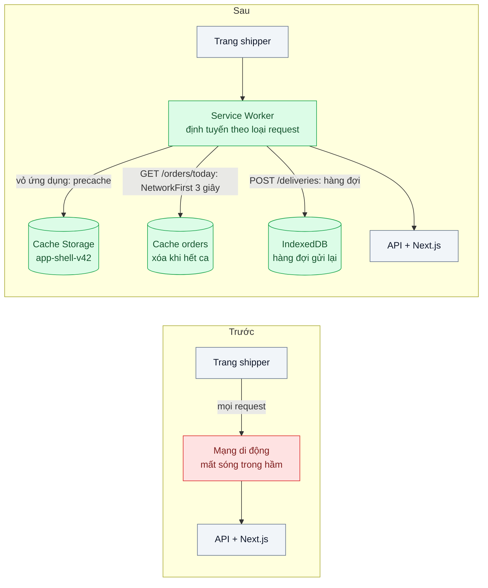
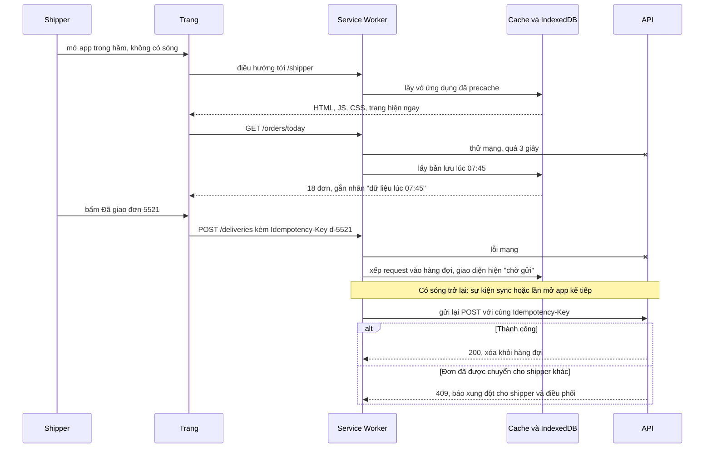

# Service Worker Caching Strategies (offline-first) — Shipper mất mạng trong hầm vẫn phải xem được danh sách đơn

| Scope | Mức độ | Trạng thái | Pattern gốc | Cập nhật |
|---|---|---|---|---|
| 04 · frontend / cache | 🔴 Nâng cao | 📋 Kế hoạch | Service Worker Caching Strategies — Jake Archibald, "The Offline Cookbook" (web.dev); Workbox docs | 2026-10-06 |

> **Một câu tóm tắt:** Đặt một Service Worker chặn mọi request của app shipper và chọn chiến lược cache theo từng loại tài nguyên — vỏ ứng dụng lấy từ cache, danh sách đơn thử mạng rồi lùi về bản đã lưu, thao tác "đã giao" xếp hàng để gửi lại khi có sóng — để mất mạng không còn là màn hình trắng.

## 1. Bài toán thực tế (What)

**Bối cảnh** *(doanh nghiệp giả định, số liệu minh họa)*
Công ty logistics giao hàng chặng cuối, khoảng 2.500 shipper dùng web app (PWA, Next.js) trên điện thoại Android tầm trung để xem danh sách đơn trong ngày, địa chỉ, số điện thoại, số tiền thu hộ (COD) và bấm "Đã giao". Nhiều điểm giao là chung cư có hầm gửi xe, thang máy, tòa nhà văn phòng nhiều tầng — nơi sóng di động chập chờn hoặc mất hẳn.

**Triệu chứng người kinh doanh nhìn thấy**
- Shipper xuống hầm, mở app thấy trang lỗi "Không có kết nối", không xem được số điện thoại khách và số tiền COD; phải gọi tổng đài điều phối, mỗi ca hàng trăm cuộc gọi.
- Bấm "Đã giao" khi mất sóng báo lỗi; shipper quên bấm lại, đơn hiện "đang giao" tới cuối ngày, khách gọi hỏi, đối soát COD lệch.
- Đội vận hành ước tính mỗi lần như vậy shipper mất vài phút; nhân với hàng chục điểm giao mỗi ngày là hàng giờ công.

**Nguyên nhân kỹ thuật**
App hoàn toàn phụ thuộc mạng: HTML, JS, dữ liệu đơn đều tải mỗi lần mở, không có gì được lưu lại cho lúc mất kết nối. HTTP cache (bài 01) giúp tài nguyên tĩnh nhưng không điều khiển được hành vi khi mạng lỗi, không lưu được dữ liệu API riêng tư theo cách có chủ đích, và không giữ được thao tác ghi để gửi lại.

**Ràng buộc**
- Dữ liệu khách (số điện thoại, địa chỉ) là dữ liệu cá nhân: chỉ lưu trên máy trong ca làm việc, xóa khi đăng xuất hoặc hết ca.
- Thao tác "Đã giao" gửi lại không được tạo trùng; nếu điều phối đã chuyển đơn cho người khác thì phải báo xung đột cho shipper.
- Phải chạy trên Chrome Android và Safari iOS; tính năng chỉ có ở một trình duyệt phải có đường lui.

## 2. Vì sao dùng pattern này (Why)

**Nguyên nhân gốc mà pattern nhắm vào:** mọi request đều đi thẳng ra mạng, không có tầng nào trong máy được quyền quyết định "mạng lỗi thì làm gì".

**Pattern giải quyết thế nào:** Service Worker là script chạy riêng, đứng giữa trang và mạng, nhận sự kiện `fetch` cho mọi request trong phạm vi của nó và tự quyết định trả từ Cache Storage, từ mạng, hay kết hợp. "The Offline Cookbook" của Jake Archibald liệt kê các chiến lược kinh điển — cache only, network only, cache falling back to network, network falling back to cache, stale-while-revalidate, generic fallback — và khuyên chọn *theo loại tài nguyên*. Workbox đóng gói chúng thành `CacheFirst`, `NetworkFirst` (có `networkTimeoutSeconds`), `StaleWhileRevalidate`, `NetworkOnly`, cộng precache vỏ ứng dụng lúc cài đặt và hàng đợi gửi lại request thất bại (`BackgroundSyncPlugin`). Ghép lại: vỏ ứng dụng luôn mở được, danh sách đơn ưu tiên mới nhưng lùi về bản đã lưu sau 3 giây chờ, ảnh bản đồ/chữ ký lấy từ cache, "Đã giao" vào hàng đợi.

**Lựa chọn khác đã cân nhắc**

| Lựa chọn | Giải quyết được gì | Vì sao không chọn (ở bài này) |
|---|---|---|
| Giữ nguyên + tối ưu nhỏ (thông báo "mất mạng, thử lại", tăng timeout) | Lỗi rõ ràng hơn | Shipper vẫn không xem được đơn khi mất mạng |
| Chỉ dùng HTTP cache (bài 01) | Tài nguyên tĩnh tải nhanh | Trình duyệt không mở được trang khi điều hướng lỗi mạng; không gửi lại thao tác ghi |
| Lưu dữ liệu đơn vào IndexedDB do app tự quản lý, không SW | Xem được dữ liệu khi trang đã mở | Mở app từ đầu khi mất mạng vẫn trắng vì HTML/JS không tải được |
| App native (Android/iOS) | Kiểm soát offline tối đa | Chi phí phát triển hai nền tảng, phát hành qua store; quá tay cho nhu cầu hiện tại |
| Service Worker + Workbox, chiến lược theo loại tài nguyên (chọn) | Mở app, xem đơn, ghi thao tác khi mất mạng | Thêm vòng đời SW, quản lý phiên bản cache, quyền riêng tư dữ liệu lưu |

## 3. Thiết kế hệ thống (How)

### 3.1 Kiến trúc trước và sau



### 3.2 Luồng chính



### 3.3 Thành phần và trách nhiệm

| Thành phần | Trách nhiệm | Quyết định thiết kế đáng chú ý |
|---|---|---|
| Precache vỏ ứng dụng | HTML trang shipper, JS, CSS, font, icon | Manifest sinh lúc build từ file có hash (bài 02); tên cache có phiên bản |
| Route `GET /orders/today` | Danh sách đơn trong ngày | `NetworkFirst` với `networkTimeoutSeconds: 3`; trả kèm thời điểm lưu để UI hiển thị |
| Route ảnh bản đồ, ảnh sản phẩm | Ảnh ít đổi | `CacheFirst` với giới hạn số mục và tuổi (`ExpirationPlugin`) |
| Route `POST /deliveries` | Thao tác "Đã giao" | `NetworkOnly` + `BackgroundSyncPlugin`; mỗi request có Idempotency-Key |
| Đường lui khi không có Background Sync | Safari không hỗ trợ Background Sync API | Gửi lại khi SW khởi động và khi trang nhận sự kiện `online` (cần xác minh hành vi mặc định của Workbox) |
| Vòng đời và cập nhật SW | Phát hành bản mới không làm hỏng ca đang chạy | Bản mới ở trạng thái chờ; app mời tải lại khi shipper không đang thao tác |
| Dọn dữ liệu cá nhân | Xóa cache đơn và hàng đợi đã gửi khi đăng xuất/hết ca | Chặn đăng xuất nếu hàng đợi còn request chưa gửi, báo shipper |

### 3.4 Điểm dễ sai khi triển khai
- **SW cũ phục vụ vỏ ứng dụng cũ mãi.** Không đổi tên cache theo phiên bản hoặc không xử lý cập nhật, shipper chạy bản cũ nhiều ngày; nối với cơ chế phiên bản của bài 02.
- **`skipWaiting` vô điều kiện.** SW mới chiếm quyền giữa lúc trang cũ đang chạy với JS cũ, request trộn hai phiên bản.
- **Cache response lỗi hoặc response opaque.** Lưu nhầm trang lỗi 500 rồi phục vụ mãi; chỉ cache status 200 (Workbox `CacheableResponsePlugin`).
- **Coi Background Sync là có ở mọi nơi.** API này không có trên Safari; phải có đường lui gửi lại khi mở app.
- **Gửi lại không có idempotency key.** Request được gửi thành công nhưng response mất, hàng đợi gửi lại tạo giao hàng trùng.
- **Quên quota và bị trình duyệt dọn.** Kiểm tra `navigator.storage.estimate()`, xin `navigator.storage.persist()`, giới hạn cache ảnh.
- **Dữ liệu cá nhân nằm trên máy quá lâu.** Thiếu bước dọn khi hết ca là vi phạm ràng buộc quyền riêng tư.

## 4. Tech stack và tác động (Impact techstack)

| Lớp | Công nghệ chọn | Vì sao chọn | Thay thế tương đương |
|---|---|---|---|
| Web | Next.js (App Router), TypeScript strict; trang shipper render tĩnh làm vỏ | Mặc định của scope; vỏ tĩnh dễ precache | Vite + React |
| Service Worker | Workbox (`workbox-build` chế độ `injectManifest`, `workbox-routing`, `workbox-strategies`, `workbox-background-sync`, `workbox-expiration`) | Chiến lược chuẩn có test sẵn, precache theo manifest, hàng đợi gửi lại | Serwist cho Next.js (cần xác minh), SW tự viết |
| API | NestJS trên Node 20+, Idempotency-Key trên Redis 7, PostgreSQL 16 | Trùng stack repo; trả 409 khi đơn đã chuyển | Fastify |
| Test offline | Playwright (`context.setOffline`, chặn request) | Tái hiện mất mạng, mạng chậm, có sóng trở lại | Chrome DevTools Network offline |
| Đo | Playwright, DevTools Application panel, endpoint đếm hàng đợi | Đo mở app khi offline, số thao tác chờ và đã gửi | Lighthouse cho thời gian tải |

**Thay đổi so với hệ thống hiện tại:** thêm Service Worker và bước build sinh manifest precache; API "Đã giao" nhận Idempotency-Key và trả 409 có mã xung đột; UI có trạng thái "dữ liệu lúc..." và "chờ gửi". Đội vận hành phải theo dõi phiên bản SW đang chạy trên máy shipper và số thao tác tồn trong hàng đợi.

## 5. Kết quả đầu ra và cách đo (Output impact)

| Chỉ số | Trước (minh họa) | Mục tiêu khi thực hành | Cách đo |
|---|---|---|---|
| Mở app và thấy danh sách đơn khi hoàn toàn mất mạng | 0 % | 100 % sau lần mở có mạng gần nhất | Playwright: mở có mạng, `setOffline(true)`, tải lại, kiểm tra 18 đơn hiển thị |
| Thời gian hiện danh sách khi mạng rất chậm | > 15 giây hoặc lỗi | ≤ 3,5 giây (timeout 3 giây + đọc cache) | Playwright chặn request API với độ trễ 20 giây, đo tới hàng đầu tiên |
| Thao tác "Đã giao" bị mất khi mất mạng | minh họa 5 % | 0 | Kịch bản 50 thao tác offline, có mạng lại, so số bản ghi ở API |
| Giao hàng trùng do gửi lại | — | 0 | Kịch bản mất response sau khi server đã ghi; đếm bản ghi theo Idempotency-Key |
| Dữ liệu đơn còn trên máy sau đăng xuất | — | 0 mục cache, 0 mục IndexedDB | Test đọc `caches.keys()` và IndexedDB sau đăng xuất |
| Dung lượng lưu trữ app trên máy | — | ghi nhận, ≤ 50 MB | `navigator.storage.estimate()` |

> Số "trước" là minh họa để hình dung bài toán. Số "mục tiêu" chỉ được coi là đạt khi có số đo thật
> ở mục 8 kèm môi trường đo.

**Tác động nghiệp vụ mong đợi:** shipper xem được đơn và ghi nhận giao hàng ở mọi nơi, giảm cuộc gọi tới điều phối và lệch đối soát COD, trong khi dữ liệu cá nhân của khách không nằm trên máy quá ca làm việc.

## 6. Đánh đổi và khi KHÔNG nên dùng

**Đánh đổi**
- Thêm một tầng có vòng đời riêng (install, waiting, activate) — lỗi SW khó debug và có thể "kẹt" trên máy người dùng.
- Dữ liệu hiển thị offline có thể cũ; UI phải luôn cho biết thời điểm dữ liệu.
- Dữ liệu cá nhân nằm trên thiết bị: cần chính sách dọn, và chấp nhận rủi ro nếu máy bị mất trong ca.

**Không nên dùng khi**
- Người dùng luôn có mạng ổn định (nhân viên văn phòng trên mạng nội bộ): HTTP caching và cache dữ liệu (bài 01, 03) là đủ.
- Dữ liệu phải luôn mới tuyệt đối mới có giá trị (giá đấu giá, tồn kho flash sale): offline cho dữ liệu cũ chỉ gây quyết định sai.
- Thao tác không thể gửi lại an toàn (thanh toán không có idempotency): đừng đưa vào hàng đợi.

**Liên quan**
- Đọc trước: [01 — HTTP Caching](../01-http-cache-headers-anh-san-pham-tai-lai-moi-lan/), [02 — Cache Busting](../02-cache-busting-deploy-xong-user-van-chay-js-cu/), [03 — Stale-While-Revalidate](../03-stale-while-revalidate-quay-lai-trang-lai-thay-loading/).
- Cùng chủ đề: [01-03 — Idempotency Key](../../01-frontend-backend-transporter/03-idempotency-key-bam-thanh-toan-hai-lan/) — gửi lại không trùng; [06-03 — Reconnect & Resume](../../06-frontend-backend-realtime/03-reconnect-resume-mat-mang-10-giay-mat-thong-bao/) — mất mạng ở kênh realtime.

## 7. Cơ sở tham khảo

- Jake Archibald, "The Offline Cookbook", web.dev — https://web.dev/articles/offline-cookbook — danh mục chiến lược cache cho Service Worker và cách chọn theo loại tài nguyên.
- Workbox docs — https://developer.chrome.com/docs/workbox — chiến lược `CacheFirst`/`NetworkFirst`/`StaleWhileRevalidate`, precaching, `workbox-background-sync`, `workbox-expiration`.
- MDN Web Docs, "Service Worker API" — https://developer.mozilla.org/docs/Web/API/Service_Worker_API — vòng đời, sự kiện `fetch`, Cache Storage.
- MDN Web Docs, "Background Synchronization API" và "StorageManager" — https://developer.mozilla.org/docs/Web/API — hỗ trợ trình duyệt của Background Sync, `estimate()` và `persist()`.
- IETF draft, "The Idempotency-Key HTTP Header Field" — https://datatracker.ietf.org/doc/draft-ietf-httpapi-idempotency-key-header/ — gửi lại thao tác ghi an toàn.

## 8. Kế hoạch thực hành

- [ ] Bước 1: dựng app shipper Next.js (trang danh sách đơn, chi tiết, nút Đã giao) + API NestJS/PostgreSQL; chưa có SW; seed 18 đơn cho một shipper.
- [ ] Bước 2: đo "trước" bằng Playwright: mở app khi offline, khi mạng chậm 20 giây, bấm Đã giao khi offline.
- [ ] Bước 3: thêm Workbox `injectManifest`: precache vỏ, `NetworkFirst` cho đơn, `CacheFirst` cho ảnh, `BackgroundSyncPlugin` + Idempotency-Key cho Đã giao, đường lui gửi lại khi mở app, dọn dữ liệu khi đăng xuất, luồng cập nhật SW.
- [ ] Bước 4: đo "sau" cùng kịch bản; ghi số thật, trình duyệt và thiết bị mô phỏng vào mục 5.
- [ ] Bước 5: test: (a) offline vẫn mở được app và thấy danh sách kèm thời điểm dữ liệu; (b) thao tác offline được gửi khi có mạng, không trùng; (c) 409 hiển thị xung đột; (d) đăng xuất xóa sạch cache và hàng đợi; (e) SW mới không chiếm quyền khi đang thao tác.

**Cấu trúc code dự kiến**
```text
web/
  src/sw/sw.ts                   # [PATTERN] định tuyến và chiến lược theo loại request
  src/sw/delivery-queue.ts       # [PATTERN] BackgroundSyncPlugin + đường lui gửi lại
  src/sw/register-sw.ts          # đăng ký, mời cập nhật khi rảnh
  src/shipper/logout.ts          # dọn cache và IndexedDB
  workbox.config.cjs             # injectManifest từ file có hash
api/                             # NestJS, Idempotency-Key, 409 khi đơn đã chuyển
e2e/
  offline-open-shows-orders.spec.ts
  offline-delivery-replayed-once.spec.ts
  logout-clears-local-data.spec.ts
docker-compose.yml               # postgres, redis, api
```

**Cách chạy** *(điền khi bắt đầu code)*
```bash
docker compose up -d
pnpm install && pnpm test
```
