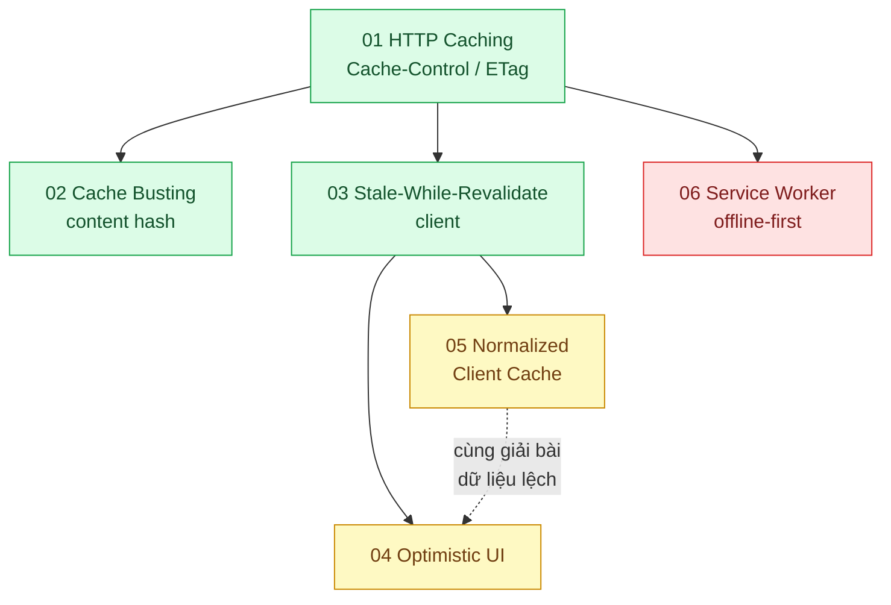

# 04 · Cache phía frontend (`frontend / cache`)

> **Phạm vi:** Mọi tầng đệm nằm phía người dùng: HTTP cache của trình duyệt và CDN, cache dữ liệu
> trong ứng dụng (TanStack Query / SWR / Apollo), Service Worker cho offline, cập nhật lạc quan.
> Cache phía server thuộc scope 03.
>
> **Câu hỏi trung tâm:** Trình duyệt giữ gì, giữ bao lâu, và làm sao người dùng không thấy dữ liệu cũ
> hay vòng xoay loading?

## Bản đồ pattern trong scope

## Danh sách bài toán

| # | Bài toán (pattern — triệu chứng) | Mức | Pattern gốc / nguồn | Trạng thái |
|---|---|---|---|---|
| 01 | [HTTP Caching (Cache-Control, ETag) — Ảnh và JS tải lại mỗi lần, hóa đơn CDN tăng](./01-http-cache-headers-anh-san-pham-tai-lai-moi-lan/) | 🟢 | RFC 9111 "HTTP Caching"; MDN "HTTP caching" |✅ |
| 02 | [Cache Busting (content hash + immutable) — Deploy xong, nửa người dùng vẫn chạy JS cũ gọi API mới](./02-cache-busting-deploy-xong-user-van-chay-js-cu/) | 🟢 | RFC 9111 (`immutable`, RFC 8246); Next.js / Vite docs (hashed assets) | 📋 |
| 03 | [Stale-While-Revalidate (client) — Quay lại trang danh sách đơn lại thấy vòng xoay loading](./03-stale-while-revalidate-quay-lai-trang-lai-thay-loading/) | 🟢 | RFC 5861 (stale-while-revalidate); TanStack Query docs (staleTime, refetch); SWR docs | 📋 |
| 04 | [Optimistic UI — Bấm "Thích" / "Thêm vào giỏ" phải chờ 1 giây mới thấy phản hồi](./04-optimistic-ui-bam-thich-cho-mot-giay/) | 🟡 | TanStack Query docs "Optimistic Updates"; Apollo Client docs "Optimistic mutation results"; Nielsen, "Response Times" (1993) | 📋 |
| 05 | [Normalized Client Cache — Cùng một khách hàng hiển thị tên cũ ở màn này, tên mới ở màn kia](./05-normalized-cache-mot-user-hai-ten-khac-nhau/) | 🟡 | Apollo Client docs "InMemoryCache" (normalization); Redux docs "Normalizing State Shape" | 📋 |
| 06 | [Service Worker Caching Strategies (offline-first) — Shipper mất mạng trong hầm vẫn phải xem được danh sách đơn](./06-service-worker-shipper-mat-mang-van-xem-don/) | 🔴 | Jake Archibald, "The Offline Cookbook" (web.dev); Workbox docs (Cache First, Network First, Stale-While-Revalidate) | 📋 |

## Lộ trình đề xuất trong scope

1. **HTTP caching → Cache busting** — tầng rẻ nhất, không cần code ứng dụng.
2. **Stale-while-revalidate** — chuyển cùng tư tưởng vào cache dữ liệu trong app.
3. **Optimistic UI** — cải thiện cảm nhận; cần hiểu rollback khi server từ chối.
4. **Normalized cache** — khi app có nhiều màn hình dùng chung thực thể.
5. **Service Worker** — bài khó nhất vì có thêm vòng đời SW và chiến lược theo loại tài nguyên.

## Kiến thức nền cần có trước

- HTTP header: `Cache-Control`, `ETag`/`If-None-Match`, `Last-Modified`, `Vary`.
- Vòng đời dữ liệu trong React (server state vs client state).
- Khái niệm "stale" và "revalidate".

## Liên kết với scope khác

- `01-frontend-backend-transporter` — ETag là một phần của hợp đồng API.
- `03-backend-cache` — tầng cache sau CDN; invalidation hai tầng phải phối hợp.
- `06-frontend-backend-realtime` — realtime là cách thay cho polling/refetch.
- `15-backend-storage` bài 05 (signed CDN URL) — cache CDN cho nội dung riêng tư.

## Nguồn tổng quan cho scope

- RFC 9111, *HTTP Caching* (2022).
- MDN Web Docs, "HTTP caching".
- Jake Archibald, "The Offline Cookbook" — https://web.dev/articles/offline-cookbook
