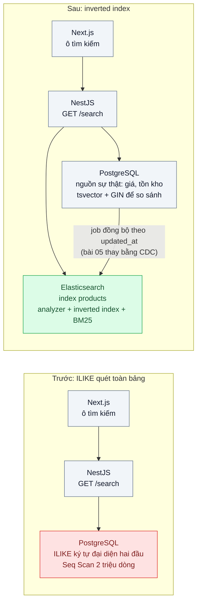
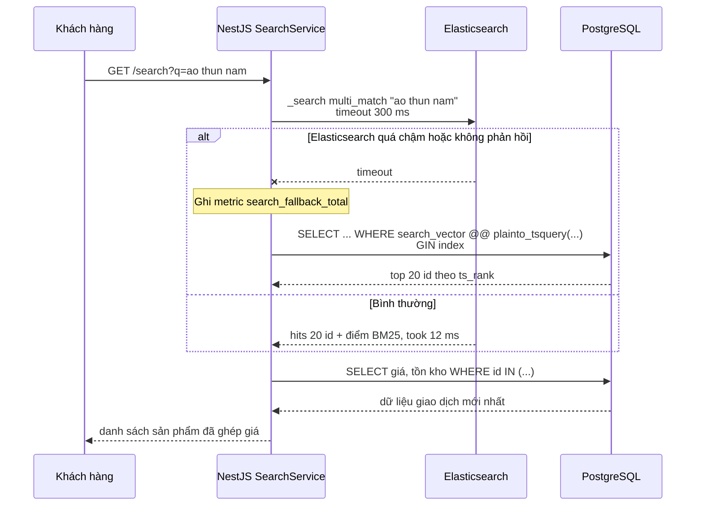

# Inverted Index Full-text Search — Tìm "ao thun nam" bằng LIKE mất 8 giây và không ra "Áo Thun Nam"

| Scope | Mức độ | Trạng thái | Pattern gốc | Cập nhật |
|---|---|---|---|---|
| 05 · backend / search | 🟢 Cơ bản | 📋 Kế hoạch | Inverted Index — Manning, Raghavan, Schütze, *Introduction to Information Retrieval* (2008) ch.1 | 2026-10-06 |

> **Một câu tóm tắt:** Thay `ILIKE '%...%'` quét toàn bảng bằng inverted index (từ khóa → danh sách tài liệu chứa nó) để tìm theo từ trên hàng triệu bản ghi trong vài chục mili-giây, đồng thời xử lý hoa/thường, dấu và thứ tự từ ngay ở bước phân tích văn bản.

## 1. Bài toán thực tế (What)

**Bối cảnh** *(doanh nghiệp giả định, số liệu minh họa)*
Sàn TMĐT thời trang có 2 triệu SKU trong bảng `products` (PostgreSQL 16), 300.000 lượt tìm kiếm mỗi ngày, đỉnh 40 lượt/giây vào buổi tối. Ô tìm kiếm hiện gọi `SELECT ... WHERE name ILIKE '%ao thun nam%' LIMIT 20` qua NestJS. Đội có 4 kỹ sư backend, chưa từng vận hành hệ thống tìm kiếm riêng.

**Triệu chứng người kinh doanh nhìn thấy**
- Tìm "ao thun nam" mất 8 giây; khoảng một phần ba người dùng rời trang trước khi thấy kết quả.
- Gõ không dấu "ao thun nam" không ra sản phẩm "Áo Thun Nam Cotton"; gõ "thun nam áo" ra 0 kết quả vì sai thứ tự từ.
- Giờ cao điểm CPU PostgreSQL chạm 100%, trang chi tiết sản phẩm và luồng đặt hàng (không liên quan tìm kiếm) cũng chậm theo.

**Nguyên nhân kỹ thuật**
`ILIKE '%...%'` với ký tự đại diện ở đầu không dùng được B-tree index trên `name`, PostgreSQL buộc phải Seq Scan toàn bảng và so khớp chuỗi trên từng dòng. So khớp theo *chuỗi con* nên "ao thun nam" không khớp "Áo Thun Nam" (khác dấu) và bắt buộc đúng thứ tự từ. Mỗi lượt tìm chiếm một worker DB vài giây, tranh tài nguyên với mọi truy vấn nghiệp vụ khác.

**Ràng buộc**
- Khớp không phân biệt hoa/thường, có dấu/không dấu, không phụ thuộc thứ tự từ.
- p95 tìm kiếm dưới 100 ms ở 40 lượt/giây; không được làm chậm luồng đặt hàng.
- Đội nhỏ: ưu tiên ít thành phần vận hành; chỉ thêm hệ thống mới khi PostgreSQL FTS không đủ.
- Dữ liệu sản phẩm đổi vài trăm lần/giờ; độ trễ cập nhật index dưới 1 phút là chấp nhận được.

## 2. Vì sao dùng pattern này (Why)

**Nguyên nhân gốc mà pattern nhắm vào:** so khớp chuỗi con là bài toán "duyệt mọi tài liệu để tìm từ"; tìm kiếm cần đảo ngược thành "từ từ khóa đi thẳng tới danh sách tài liệu".

**Pattern giải quyết thế nào:** Khi index, mỗi tài liệu chạy qua analyzer (tách từ, hạ chữ thường, bỏ dấu) thành danh sách term; inverted index lưu với mỗi term một posting list (danh sách id tài liệu chứa term). Khi tìm, câu truy vấn đi qua *cùng* analyzer, hệ thống lấy posting list của từng term, giao/hợp các danh sách rồi chấm điểm theo BM25. Chi phí truy vấn tỉ lệ với số tài liệu khớp, không với tổng số tài liệu. Cùng cơ chế này có trong PostgreSQL FTS (`tsvector` + GIN) và Elasticsearch (Lucene); bài này dựng cả hai để biết ngưỡng nào PostgreSQL còn đủ.

**Lựa chọn khác đã cân nhắc**

| Lựa chọn | Giải quyết được gì | Vì sao không chọn (ở bài này) |
|---|---|---|
| Giữ nguyên + tối ưu nhỏ (thêm index B-tree, cache kết quả từ khóa hot) | Cache cứu được vài chục từ khóa phổ biến | Ký tự đại diện hai đầu vẫn không dùng được B-tree; từ khóa đuôi dài vẫn quét toàn bảng; không xử lý dấu và thứ tự từ |
| `pg_trgm` + GIN index cho `ILIKE` | Tăng tốc rõ so khớp chuỗi con, gần như không đổi code | Vẫn là so khớp chuỗi con: không tách từ, không xếp hạng theo độ liên quan, index trigram lớn; hợp cho tìm mã SKU hơn tìm tên |
| PostgreSQL FTS (`tsvector` + GIN) | Inverted index ngay trong DB đang có, không thêm hệ thống | Giữ làm phương án so sánh: analyzer tiếng Việt hạn chế, xếp hạng và facet yếu, tải tìm kiếm vẫn dồn lên DB nghiệp vụ |
| Elasticsearch / OpenSearch | Inverted index, analyzer cấu hình được, BM25, aggregation, tách tải khỏi DB | Thêm hệ thống phải vận hành và một luồng đồng bộ dữ liệu; chọn làm phương án chính vì các bài sau trong scope cần |

## 3. Thiết kế hệ thống (How)

### 3.1 Kiến trúc trước và sau



### 3.2 Luồng chính



### 3.3 Thành phần và trách nhiệm

| Thành phần | Trách nhiệm | Quyết định thiết kế đáng chú ý |
|---|---|---|
| `SearchController` (NestJS) | Nhận `q`, `page`; validate; gọi `SearchService` | Giới hạn `q` 200 ký tự; timeout 300 ms cho mọi backend tìm kiếm |
| `SearchService` | Chuyển câu truy vấn thành query ES/PG; ghép kết quả với giá, tồn kho | Index chỉ trả `id` và trường hiển thị; giá/tồn kho đọc lại từ PostgreSQL để không bị lệch |
| Index `products` (Elasticsearch) | Inverted index của `name`, `brand`, `description` | Analyzer `standard` + `lowercase` + `asciifolding` (bài 02 làm sâu); 1 primary shard cho 2 triệu doc |
| `products.search_vector` (PostgreSQL) | `tsvector` sinh bằng generated column, GIN index | `to_tsvector('simple', ...)` sau khi bỏ dấu để so sánh công bằng với ES |
| `ProductIndexerJob` | Đồng bộ thay đổi từ PostgreSQL vào index | Bài này chạy định kỳ theo `updated_at`; bài 05 thay bằng CDC |

### 3.4 Điểm dễ sai khi triển khai
- Analyzer lúc index khác analyzer lúc tìm (ví dụ chỉ bỏ dấu một phía) khiến "ao thun" không khớp "áo thun". Kiểm tra cả hai phía bằng `_analyze` API trước khi nạp dữ liệu.
- `match` với `operator: or` mặc định trên câu dài trả hàng nghìn kết quả lỏng lẻo; đặt `minimum_should_match` rồi nới dần theo bộ câu đánh giá.
- Lấy giá/tồn kho từ index khiến khách thấy giá cũ khi index trễ. Index chỉ phục vụ tìm và xếp hạng; dữ liệu giao dịch luôn đọc từ DB.
- Phân trang sâu bằng `from/size` tốn bộ nhớ ES; giới hạn `from + size` và dùng `search_after` cho trang sâu.
- Phía PostgreSQL: hàm `unaccent()` không được đánh dấu IMMUTABLE nên không dùng trực tiếp trong generated column hay index expression; bọc trong hàm IMMUTABLE tự định nghĩa. Quên GIN index trên `tsvector` thì vẫn Seq Scan; xác nhận bằng `EXPLAIN ANALYZE` thấy `Bitmap Index Scan`.

## 4. Tech stack và tác động (Impact techstack)

| Lớp | Công nghệ chọn | Vì sao chọn | Thay thế tương đương |
|---|---|---|---|
| Ngôn ngữ / runtime | TypeScript 5 strict, Node 20 | Stack mặc định của repo | — |
| HTTP API | NestJS 10 | Module `search` tách riêng, DI cho hai adapter tìm kiếm | Fastify thuần |
| Công cụ tìm kiếm | Elasticsearch 8 (single node, Docker) | Inverted index, analyzer, BM25 sẵn; nền cho bài 02–07 | OpenSearch 2 (API tương đương), Meilisearch/Typesense cho bài nhỏ |
| Client ES | `@elastic/elasticsearch` | Client chính thức, có type cho query DSL | Gọi REST thuần bằng `undici` |
| Phương án so sánh | PostgreSQL 16 FTS (`tsvector`, GIN, `unaccent`) | Không thêm hệ thống; biết ngưỡng cần Elasticsearch | `pg_trgm` cho tìm mã |
| Hạ tầng local | Docker Compose | Dựng PostgreSQL + Elasticsearch một lệnh | — |
| Test / đo tải | Vitest, k6 | Test hành vi khớp dấu và thứ tự từ; k6 đo p95 trước/sau | Jest, autocannon |

**Thay đổi so với hệ thống hiện tại:** thêm một container Elasticsearch và một job đồng bộ; `SearchService` có hai adapter (`EsSearchAdapter`, `PgFtsSearchAdapter`) chọn bằng biến môi trường `SEARCH_ENGINE`. Đội vận hành học thêm: theo dõi heap và disk của ES, `_cat/indices`, cách reindex khi đổi analyzer (bài 07).

## 5. Kết quả đầu ra và cách đo (Output impact)

| Chỉ số | Trước (minh họa) | Mục tiêu khi thực hành | Cách đo |
|---|---|---|---|
| p95 độ trễ `GET /search` ở 40 req/s | 8000 ms | < 100 ms (ES), < 300 ms (PG FTS) | k6 `http_req_duration` p(95), 40 VU trong 2 phút, 200 từ khóa lấy từ log thật |
| Thời gian truy vấn phía công cụ | Seq Scan khoảng 7500 ms | ES `took` < 30 ms; PG < 50 ms | Elasticsearch `_search` trường `took` và Profile API; PostgreSQL `EXPLAIN (ANALYZE, BUFFERS)` |
| Câu không dấu / đổi thứ tự từ tìm ra bản ghi đúng | 0 trên 50 câu mẫu | 50/50 | Vitest chạy 50 câu mẫu, so với danh sách id kỳ vọng |
| CPU PostgreSQL khi chịu tải tìm kiếm | 100% | < 30% với ES | `docker stats`; `pg_stat_statements` tổng thời gian câu search |
| Độ trễ cập nhật index (sửa tên → tìm ra) | không có số | < 60 giây | Test tích hợp: cập nhật `updated_at`, poll `_search` và đo thời gian |

> Số "trước" là minh họa để hình dung bài toán. Số "mục tiêu" chỉ được coi là đạt khi có số đo thật
> ở mục 8 kèm môi trường đo.

**Tác động nghiệp vụ mong đợi:** khách thấy kết quả ngay khi gõ xong, tìm được sản phẩm dù gõ không dấu; DB nghiệp vụ không còn bị tìm kiếm chiếm CPU nên luồng đặt hàng ổn định giờ cao điểm.

## 6. Đánh đổi và khi KHÔNG nên dùng

**Đánh đổi**
- Thêm một hệ thống phải vận hành (heap, disk, snapshot, nâng phiên bản) và một luồng đồng bộ có thể lệch dữ liệu (bài 05).
- Kết quả là "gần đúng theo độ liên quan", khó giải thích với người kinh doanh hơn `WHERE` chính xác; cần bộ đánh giá để tune (bài 06).
- Index là bản sao dữ liệu: tốn dung lượng, phải reindex khi đổi analyzer hay mapping (bài 07).

**Không nên dùng khi**
- Bảng dưới vài trăm nghìn dòng và chỉ tìm theo mã hoặc tiền tố: B-tree hoặc `pg_trgm` đủ, không đáng thêm hệ thống.
- Cần kết quả nhất quán tức thì với DB (ví dụ lọc theo số dư ví): tìm kiếm luôn trả về bản sao có độ trễ.
- Tìm theo ngữ nghĩa ("áo mặc đi biển") hơn theo từ khóa: thuộc scope 12 (vector) hoặc hybrid search ở scope 10.

**Liên quan**
- [`../02-vietnamese-analyzer-tim-ha-noi-ra-ha-noi/`](../02-vietnamese-analyzer-tim-ha-noi-ra-ha-noi/) — analyzer tiếng Việt, làm ngay sau bài này.
- [`../05-cdc-dong-bo-index-du-lieu-search-lech-db/`](../05-cdc-dong-bo-index-du-lieu-search-lech-db/) — thay job định kỳ bằng CDC.
- [`../../02-backend-database/01-n-plus-1-trang-50-don-ban-151-cau-sql/`](../../02-backend-database/01-n-plus-1-trang-50-don-ban-151-cau-sql/) — đọc `EXPLAIN ANALYZE`.
- [`../../10-backend-ai-rag/03-hybrid-search-rrf-ma-san-pham-tim-vector-khong-ra/`](../../10-backend-ai-rag/03-hybrid-search-rrf-ma-san-pham-tim-vector-khong-ra/) — BM25 kết hợp vector.

## 7. Cơ sở tham khảo

- Manning, Raghavan, Schütze, *Introduction to Information Retrieval*, Cambridge UP, 2008, ch.1 "Boolean retrieval" — https://nlp.stanford.edu/IR-book/ — định nghĩa inverted index, posting list và vì sao quét tuyến tính không mở rộng được.
- PostgreSQL docs, chương "Full Text Search" (`tsvector`, `tsquery`, GIN index) và module `unaccent` — https://www.postgresql.org/docs/ — phương án so sánh ngay trong DB đang có.
- Elasticsearch Guide, "Text analysis", "Match query", "Paginate search results" (`search_after`) — https://www.elastic.co/guide/ — cấu hình analyzer, truy vấn và phân trang cho phương án chính.
- Markus Winand, *Use The Index, Luke*, mục "Indexing LIKE Filters" — https://use-the-index-luke.com/ — giải thích vì sao ký tự đại diện ở đầu làm B-tree index vô dụng.
- Robertson & Zaragoza, "The Probabilistic Relevance Framework: BM25 and Beyond", 2009 — công thức xếp hạng mặc định của Lucene/Elasticsearch, dùng sâu ở bài 06.

## 8. Kế hoạch thực hành

- [ ] Bước 1: `docker compose up -d` PostgreSQL 16 + Elasticsearch 8; seed 2 triệu sản phẩm giả (tên tiếng Việt có dấu, thương hiệu, mô tả) bằng `src/shared/seed.ts`.
- [ ] Bước 2: đo "trước": endpoint `/search` với `SEARCH_ENGINE=like`, chạy `bench/search.k6.js` với 200 từ khóa, ghi p95 và `EXPLAIN ANALYZE`.
- [ ] Bước 3: áp dụng pattern: tạo index ES với analyzer `lowercase + asciifolding`; generated column `tsvector` + GIN trong PG; viết hai adapter và job đồng bộ theo `updated_at`.
- [ ] Bước 4: đo "sau" với `SEARCH_ENGINE=es` và `SEARCH_ENGINE=pgfts` cùng kịch bản k6; ghi `took`, p95, CPU vào mục 5 kèm môi trường.
- [ ] Bước 5: test Vitest: 50 câu không dấu / đổi thứ tự từ trả đúng id; test "sửa tên sản phẩm thì tìm ra trong 60 giây"; test fallback khi ES không phản hồi.

**Cấu trúc code dự kiến**
```text
src/
  truoc/like-search.adapter.ts        # ILIKE, tái hiện triệu chứng
  sau/es-search.adapter.ts            # [PATTERN] multi_match trên inverted index
  sau/pg-fts-search.adapter.ts        # [PATTERN] tsvector @@ tsquery, phương án so sánh
  sau/product-indexer.job.ts          # đồng bộ theo updated_at
  search.controller.ts
  search.module.ts
  shared/seed.ts
test/
  unaccented-and-reordered-queries-match.test.ts
  index-updates-within-60-seconds.test.ts
  falls-back-when-es-times-out.test.ts
bench/
  search.k6.js
docker-compose.yml                    # postgres:16, elasticsearch:8 single-node
```

**Cách chạy** *(điền khi bắt đầu code)*
```bash
docker compose up -d
pnpm install && pnpm seed && pnpm test
k6 run bench/search.k6.js -e ENGINE=like    # rồi ENGINE=es, ENGINE=pgfts
```
