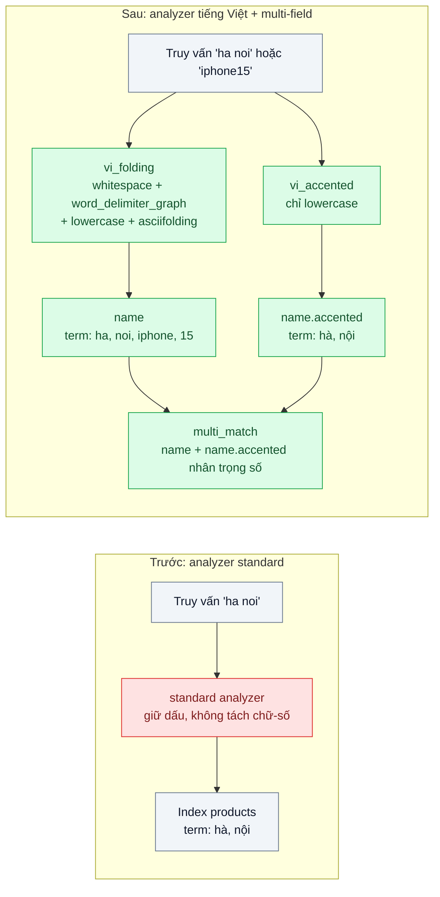
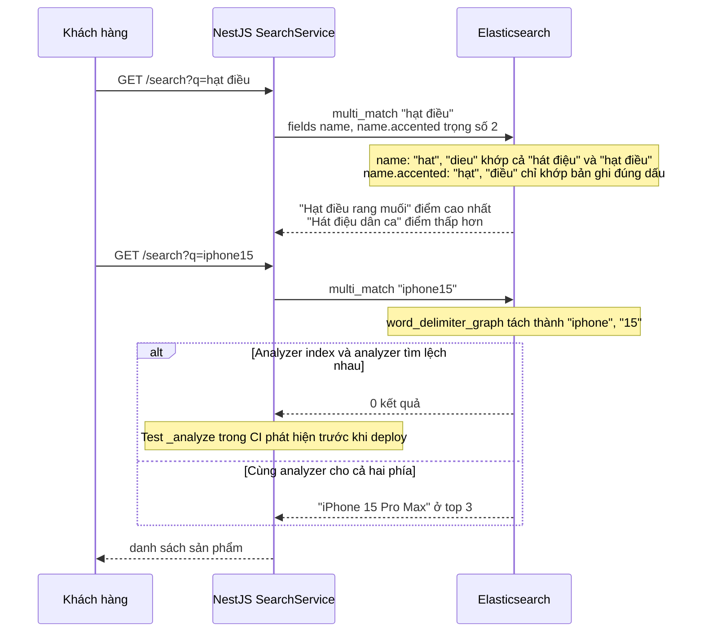

# Text Analysis for Vietnamese (tokenizer + folding) — Gõ "ha noi" không ra "Hà Nội", gõ "iphone15" không ra "iPhone 15"

| Scope | Mức độ | Trạng thái | Pattern gốc | Cập nhật |
|---|---|---|---|---|
| 05 · backend / search | 🟢 Cơ bản | 📋 Kế hoạch | Text Analysis (analyzer chain) — Elasticsearch docs "Text analysis"; Manning, Raghavan, Schütze, *IIR* (2008) ch.2 | 2026-10-06 |

> **Một câu tóm tắt:** Thiết kế chuỗi phân tích văn bản (char filter → tokenizer → token filter) dùng chung cho lúc index và lúc tìm, để "ha noi", "HÀ NỘI", "iphone15" và "iPhone 15" về cùng các term, đồng thời vẫn ưu tiên kết quả khớp đúng dấu.

## 1. Bài toán thực tế (What)

**Bối cảnh** *(doanh nghiệp giả định, số liệu minh họa)*
Sàn TMĐT đa ngành có 2 triệu sản phẩm và 80.000 cửa hàng, đã chuyển ô tìm kiếm sang Elasticsearch ở bài 01 với analyzer `standard` mặc định. Log tìm kiếm cho thấy khoảng 40% truy vấn gõ không dấu (bàn phím điện thoại, thói quen gõ nhanh) và nhiều truy vấn dính chữ với số: "iphone15", "s24ultra", "ao2day".

**Triệu chứng người kinh doanh nhìn thấy**
- Khách gõ "ha noi" để tìm cửa hàng giao trong ngày ở Hà Nội thì nhận 0 kết quả; gõ đúng "Hà Nội" thì ra 3.000 cửa hàng.
- Gõ "iphone15" không ra "iPhone 15 Pro Max", nhưng gõ "iphone 15" thì ra; đội marketing thấy tỷ lệ "không có kết quả" khoảng 12% và chi tiền quảng cáo cho từ khóa mà ô tìm kiếm không phục vụ được.
- Khi đội thử bỏ dấu toàn bộ, khách gõ đúng "hạt điều" lại thấy lẫn "hát điệu" và "hạt dẻ" lên đầu.

**Nguyên nhân kỹ thuật**
Analyzer `standard` tách từ theo Unicode và hạ chữ thường nhưng giữ nguyên dấu, nên term "hà" và "ha" là hai term khác nhau trong inverted index. "iphone15" là một token duy nhất vì tokenizer không tách ở ranh giới chữ–số, trong khi tài liệu được index thành "iphone" và "15". Phương án "bỏ dấu tất cả" sửa được chiều thứ nhất nhưng xóa luôn thông tin dấu, khiến các âm tiết khác nghĩa trùng nhau và mất khả năng xếp hạng ưu tiên bản ghi khớp đúng dấu.

**Ràng buộc**
- Gõ có dấu hay không dấu đều ra kết quả; gõ có dấu thì kết quả đúng dấu phải đứng trên.
- Không cài plugin tách từ tiếng Việt chưa được đội kiểm chứng vào cụm production ở bài này.
- Đổi analyzer bắt buộc reindex; bài này dựng index mới song song, bài 07 làm phần đổi không dừng.

## 2. Vì sao dùng pattern này (Why)

**Nguyên nhân gốc mà pattern nhắm vào:** term trong index và term sinh từ câu truy vấn không giống nhau vì hai phía không được chuẩn hóa theo cùng một quy tắc phù hợp với tiếng Việt.

**Pattern giải quyết thế nào:** IIR ch.2 mô tả bước chuẩn hóa term (hoa/thường, dấu, tách token) quyết định cái gì được coi là "cùng một từ". Elasticsearch hiện thực bằng analyzer gồm ba tầng: char filter sửa chuỗi thô, tokenizer cắt token, token filter biến đổi token. Bài này dùng tokenizer `whitespace` (tiếng Việt viết cách âm tiết), filter `word_delimiter_graph` tách ranh giới chữ–số ("iphone15" → "iphone", "15"), `lowercase`, rồi `asciifolding` bỏ dấu. Trường được index thành *multi-field*: `name` (bỏ dấu, để tìm rộng) và `name.accented` (giữ dấu, để xếp hạng). Truy vấn `multi_match` trên cả hai, nhân trọng số cho `name.accented`, nên "hạt điều" khớp đúng dấu đứng trên "hát điệu".

**Lựa chọn khác đã cân nhắc**

| Lựa chọn | Giải quyết được gì | Vì sao không chọn (ở bài này) |
|---|---|---|
| Giữ nguyên + tối ưu nhỏ (bảng từ đồng nghĩa thủ công "ha noi → hà nội") | Sửa nhanh vài chục từ khóa hot | Không mở rộng cho 2 triệu tên sản phẩm; bảng phình và lệch theo thời gian |
| Bỏ dấu cả câu ở tầng ứng dụng trước khi index và tìm | Một dòng code, khớp không dấu | Mất thông tin dấu, không xếp hạng được bản ghi đúng dấu; dễ lệch giữa các nơi gọi |
| Plugin tách từ tiếng Việt của cộng đồng (cần xác minh) | Tách từ ghép "Hà Nội" thành một term, chính xác hơn về ngữ nghĩa | Phụ thuộc phiên bản Elasticsearch, phải tự build và vận hành; để đánh giá sau khi có bộ câu kiểm thử |
| `icu_tokenizer` + `icu_folding` (plugin ICU chính thức) | Chuẩn hóa Unicode đầy đủ (NFC/NFD), xử lý nhiều ngôn ngữ | Phải cài plugin; giữ làm biến thể so sánh vì dữ liệu có thể trộn chuỗi NFD từ nguồn nhập liệu |
| Analyzer tùy biến + multi-field (chọn) | Khớp không dấu, tách chữ–số, vẫn ưu tiên đúng dấu, chỉ dùng tính năng có sẵn | Tăng kích thước index vì mỗi trường được index hai lần |

## 3. Thiết kế hệ thống (How)

### 3.1 Kiến trúc trước và sau



### 3.2 Luồng chính



### 3.3 Thành phần và trách nhiệm

| Thành phần | Trách nhiệm | Quyết định thiết kế đáng chú ý |
|---|---|---|
| Analyzer `vi_folding` | Chuẩn hóa để tìm rộng: tách khoảng trắng, tách chữ–số, hạ chữ thường, bỏ dấu | Dùng `whitespace` chứ không `standard` vì tài liệu Elasticsearch khuyên không ghép `word_delimiter_graph` với tokenizer đã bỏ dấu câu |
| Analyzer `vi_accented` | Giữ dấu để xếp hạng | Chỉ `lowercase`; thêm char filter chuẩn hóa Unicode nếu nguồn dữ liệu có chuỗi NFD |
| Mapping multi-field | `name` (vi_folding) + `name.accented` (vi_accented) | Áp cho `name`, `brand`, `shop.city`; không áp cho `description` dài để giới hạn kích thước index |
| `SearchQueryBuilder` | Sinh `multi_match` trọng số cho trường giữ dấu | Trọng số khởi điểm 2, chỉnh bằng bộ câu đánh giá (bài 06) |
| Bộ test analyzer | Gọi `_analyze` với 100 cặp đầu vào/term kỳ vọng | Chạy trong CI mỗi khi đổi mapping; chặn deploy khi lệch |
| Phương án PostgreSQL | Text search configuration riêng dùng `unaccent` | Để so sánh độ phủ với Elasticsearch trên cùng bộ câu |

### 3.4 Điểm dễ sai khi triển khai
- Chữ "đ" không phải "d" có dấu kết hợp; phải kiểm chứng bằng `_analyze` rằng "đ" được fold thành "d" ở cả `asciifolding` lẫn `unaccent`, không giả định.
- Dữ liệu nhập từ Excel hoặc macOS có thể ở dạng NFD (dấu tách rời ký tự gốc); nếu không chuẩn hóa NFC trước khi index, "Hà" ở hai nguồn thành hai chuỗi khác nhau dù nhìn giống hệt.
- Chỉ đổi `search_analyzer` mà quên reindex: tài liệu cũ vẫn mang term có dấu, truy vấn mới không khớp. Đổi analyzer luôn đi kèm reindex (bài 07).
- `word_delimiter_graph` tách cả "wi-fi", "covid-19"; cần thêm `preserve_original` hoặc từ điển bảo vệ cho mã sản phẩm có gạch ngang.
- Thêm từ đồng nghĩa ("hn" → "hà nội") ở lúc index buộc reindex mỗi lần sửa; nên đặt `synonym_graph` ở analyzer lúc tìm.

## 4. Tech stack và tác động (Impact techstack)

| Lớp | Công nghệ chọn | Vì sao chọn | Thay thế tương đương |
|---|---|---|---|
| Ngôn ngữ / API | TypeScript 5 strict, Node 20, NestJS 10 | Stack mặc định; tiếp nối module `search` của bài 01 | Fastify |
| Công cụ tìm kiếm | Elasticsearch 8, analyzer tùy biến trong index settings | `asciifolding`, `word_delimiter_graph`, multi-field có sẵn, không cần plugin | OpenSearch 2 (cùng tên filter) |
| Biến thể so sánh | Plugin `analysis-icu` (`icu_normalizer`, `icu_folding`) | Chuẩn hóa Unicode đầy đủ khi dữ liệu trộn NFC/NFD | Char filter tự viết bằng `mapping` |
| Phương án PostgreSQL | PostgreSQL 16 FTS + extension `unaccent`, text search configuration riêng | Biết PostgreSQL đi được tới đâu với tiếng Việt | `pg_trgm` cho tìm gần đúng |
| Client | `@elastic/elasticsearch` | Gọi `indices.analyze` trong test | REST thuần |
| Test | Vitest | Bộ 100 câu analyzer và 200 câu tìm kiếm có kỳ vọng | Jest |

**Thay đổi so với hệ thống hiện tại:** thêm định nghĩa analyzer vào template index, đổi mapping các trường văn bản sang multi-field, đổi query builder; tạo index mới và nạp lại dữ liệu. Đội cần học đọc kết quả `_analyze` và hiểu rằng mọi thay đổi analyzer là một lần reindex.

## 5. Kết quả đầu ra và cách đo (Output impact)

| Chỉ số | Trước (minh họa) | Mục tiêu khi thực hành | Cách đo |
|---|---|---|---|
| Câu không dấu trả về bản ghi đúng trong top 10 | 0/100 câu mẫu | ≥ 95/100 | Vitest chạy 100 câu không dấu, so với danh sách id kỳ vọng |
| Câu dính chữ–số ("iphone15") tìm ra sản phẩm đúng | 0/30 | 30/30 | Vitest, bộ 30 câu lấy từ log |
| Câu có dấu: bản ghi đúng dấu đứng trước bản ghi trùng âm | không đo | ≥ 90% câu | Vitest kiểm thứ tự top 3; Elasticsearch `explain` để xem điểm từng trường |
| Tỷ lệ truy vấn 0 kết quả trên bộ 1.000 truy vấn thật | 12% | < 4% | Script chạy lại log, đếm `hits.total.value = 0` |
| Kích thước index sau multi-field | 1x | ≤ 1,4x | `_cat/indices?v` cột `store.size` |
| p95 truy vấn | đo ở bài 01 | không tăng quá 10% | k6 cùng kịch bản bài 01, trường `took` |

> Số "trước" là minh họa để hình dung bài toán. Số "mục tiêu" chỉ được coi là đạt khi có số đo thật
> ở mục 8 kèm môi trường đo.

**Tác động nghiệp vụ mong đợi:** giảm tỷ lệ "không có kết quả" nên ít khách bỏ đi ở bước tìm kiếm; ngân sách quảng cáo theo từ khóa không còn đổ vào những truy vấn ô tìm kiếm trả rỗng.

## 6. Đánh đổi và khi KHÔNG nên dùng

**Đánh đổi**
- Index lớn hơn vì mỗi trường được phân tích hai lần; truy vấn chạm nhiều trường hơn.
- Bỏ dấu làm tăng kết quả nhiễu (âm tiết trùng sau khi fold); phải bù bằng trọng số trường giữ dấu và đo bằng bộ câu.
- Tách âm tiết chứ không tách từ: "Hà Nội" là hai term, truy vấn cụm cần `match_phrase` hoặc shingle nếu muốn chính xác hơn.

**Không nên dùng khi**
- Dữ liệu là mã (SKU, số hợp đồng, biển số): dùng trường `keyword` hoặc normalizer, không chạy analyzer văn bản.
- Nội dung đa ngôn ngữ lớn (Trung, Nhật, Thái) cần tách từ theo từ điển: `whitespace` không đủ, cần analyzer chuyên biệt theo ngôn ngữ.
- Chỉ có vài nghìn bản ghi và người dùng nội bộ luôn gõ có dấu: `unaccent` trong PostgreSQL là đủ, chưa cần cấu hình analyzer riêng.

**Liên quan**
- [`../01-full-text-vs-like-tim-ao-thun-nam-mat-8-giay/`](../01-full-text-vs-like-tim-ao-thun-nam-mat-8-giay/) — inverted index và hai adapter tìm kiếm, đọc trước.
- [`../03-autocomplete-goi-y-khi-go-3-ky-tu/`](../03-autocomplete-goi-y-khi-go-3-ky-tu/) — gợi ý khi gõ dùng lại analyzer của bài này.
- [`../06-relevance-tuning-san-pham-ban-chay-nam-trang-3/`](../06-relevance-tuning-san-pham-ban-chay-nam-trang-3/) — chỉnh trọng số trường bằng bộ đánh giá thay vì cảm giác.
- [`../07-zero-downtime-reindex-doi-mapping-50-trieu-doc/`](../07-zero-downtime-reindex-doi-mapping-50-trieu-doc/) — đổi analyzer trên index đang chạy.

## 7. Cơ sở tham khảo

- Manning, Raghavan, Schütze, *Introduction to Information Retrieval*, Cambridge UP, 2008, ch.2 "The term vocabulary and postings lists" — https://nlp.stanford.edu/IR-book/ — tokenization và chuẩn hóa term (hoa/thường, dấu) quyết định thế nào là "cùng một từ".
- Elasticsearch Guide, "Text analysis" (anatomy of an analyzer), "ASCII folding token filter", "Word delimiter graph token filter", "Multi-fields" — https://www.elastic.co/guide/ — các khối dùng để dựng analyzer và mapping ở mục 3.
- Elasticsearch Guide, "ICU analysis plugin" (`icu_normalizer`, `icu_folding`) — https://www.elastic.co/guide/ — biến thể so sánh khi cần chuẩn hóa Unicode đầy đủ.
- PostgreSQL docs, module `unaccent` và "Text Search Configuration" — https://www.postgresql.org/docs/ — dựng cấu hình tìm kiếm bỏ dấu cho phương án so sánh.

## 8. Kế hoạch thực hành

- [ ] Bước 1: tái sử dụng Docker Compose của bài 01 (PostgreSQL 16 + Elasticsearch 8); seed 200.000 sản phẩm và 10.000 cửa hàng có tên tiếng Việt, cố ý trộn 5% chuỗi NFD và tên dính chữ–số.
- [ ] Bước 2: đo "trước" với analyzer `standard`: chạy bộ 100 câu không dấu, 30 câu chữ–số, 1.000 truy vấn log; ghi tỷ lệ 0 kết quả và kích thước index.
- [ ] Bước 3: áp dụng pattern: định nghĩa `vi_folding`, `vi_accented`, mapping multi-field, query builder có trọng số; dựng text search configuration `unaccent` bên PostgreSQL.
- [ ] Bước 4: đo "sau" cùng bộ câu, ghi số thật và môi trường vào mục 5; so sánh thêm biến thể `icu_folding`.
- [ ] Bước 5: viết test: (a) `_analyze` cho 100 cặp đầu vào/term kỳ vọng, có "đ" và chuỗi NFD; (b) "hạt điều" đứng trên "hát điệu"; (c) "iphone15" ra "iPhone 15".

**Cấu trúc code dự kiến**
```text
src/
  truoc/standard-index.settings.ts       # analyzer mặc định, tái hiện triệu chứng
  sau/vi-analyzer.settings.ts            # [PATTERN] vi_folding, vi_accented, multi-field
  sau/search-query.builder.ts            # multi_match có trọng số trường giữ dấu
  sau/pg-unaccent-config.sql             # text search configuration cho PostgreSQL
  shared/seed-vietnamese.ts
test/
  analyzer-terms.test.ts
  unaccented-query-still-matches.test.ts
  exact-accents-rank-first.test.ts
  glued-letters-and-digits-match.test.ts
fixtures/
  analyzer-cases.json
  search-cases.json
docker-compose.yml
```

**Cách chạy** *(điền khi bắt đầu code)*
```bash
docker compose up -d
pnpm install && pnpm seed && pnpm test
```
