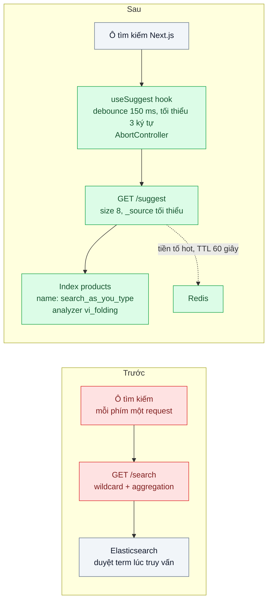
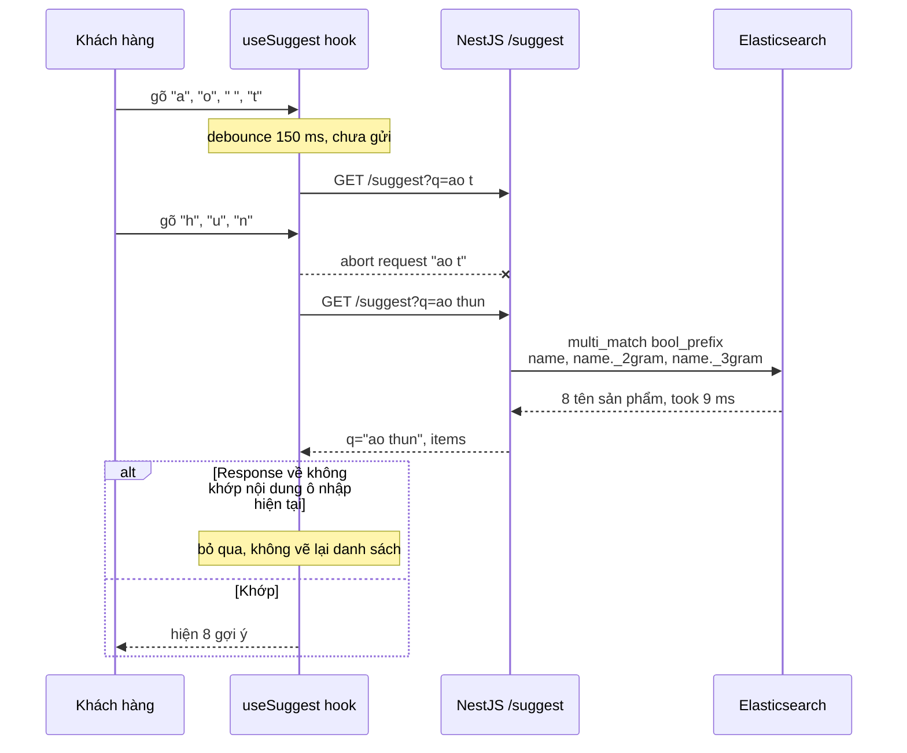

# Autocomplete / Search-as-you-type — Gợi ý sau 3 ký tự dưới 100 ms cho 2 triệu sản phẩm

| Scope | Mức độ | Trạng thái | Pattern gốc | Cập nhật |
|---|---|---|---|---|
| 05 · backend / search | 🟡 Trung bình | 📋 Kế hoạch | Search-as-you-type (prefix index) — Elasticsearch docs "search_as_you_type", "Completion suggester", edge n-gram tokenizer | 2026-10-06 |

> **Một câu tóm tắt:** Chuẩn bị sẵn tiền tố của từ ngay lúc index (thay vì quét lúc tìm) và kiểm soát luồng request phía trình duyệt bằng debounce và hủy request cũ, để mỗi lần gõ có gợi ý đúng trong dưới 100 ms mà không bắn hàng chục request thừa.

## 1. Bài toán thực tế (What)

**Bối cảnh** *(doanh nghiệp giả định, số liệu minh họa)*
Sàn TMĐT ở bài 01–02 có 2 triệu sản phẩm trong Elasticsearch. Đội sản phẩm muốn ô tìm kiếm gợi ý ngay khi khách gõ từ ký tự thứ 3, giống các sàn lớn. Bản thử đầu tiên gọi lại endpoint `/search` đầy đủ với truy vấn `wildcard` `*ao th*` sau mỗi phím bấm.

**Triệu chứng người kinh doanh nhìn thấy**
- Gợi ý hiện chậm 600–900 ms, khách đã gõ xong cả câu mới thấy gợi ý cho 3 ký tự đầu.
- Danh sách gợi ý "nhảy lùi": đang gõ "ao thun" thì hiện gợi ý của "ao" vì response cũ về sau response mới.
- Giờ cao điểm, lượng request vào Elasticsearch tăng gấp 8 lần so với trước khi có gợi ý; trang tìm kiếm chính chậm theo.

**Nguyên nhân kỹ thuật**
Truy vấn `wildcard`/`prefix` trên trường văn bản phải duyệt danh sách term để tìm mọi term bắt đầu bằng tiền tố lúc truy vấn, chi phí lớn và khó đoán khi tiền tố ngắn. Mỗi phím bấm sinh một request độc lập, không có debounce và không hủy request cũ, nên số request bằng số ký tự và thứ tự response về không đảm bảo trùng thứ tự gửi. Endpoint gợi ý dùng chung truy vấn nặng của trang kết quả (aggregation, highlight) dù chỉ cần 8 tên sản phẩm.

**Ràng buộc**
- p95 phía server dưới 100 ms ở đỉnh 300 request gợi ý/giây; trải nghiệm thấy "tức thì" theo ngưỡng 0,1 giây của Nielsen.
- Gõ không dấu vẫn gợi ý đúng (dùng lại analyzer bài 02); gõ từ giữa tên ("thun nam") vẫn ra.
- Không làm chậm trang kết quả tìm kiếm chính.

## 2. Vì sao dùng pattern này (Why)

**Nguyên nhân gốc mà pattern nhắm vào:** chi phí khớp tiền tố bị dồn vào lúc truy vấn, và phía client gửi request nhiều hơn mức người dùng có thể nhìn thấy kết quả.

**Pattern giải quyết thế nào:** Search-as-you-type chuyển chi phí sang lúc index. Trường kiểu `search_as_you_type` của Elasticsearch tự sinh các subfield `._2gram`, `._3gram` (shingle) và `._index_prefix` (edge n-gram của term), nên truy vấn `multi_match` kiểu `bool_prefix` chỉ là tra term có sẵn trong inverted index. Phía trình duyệt, debounce khoảng 150 ms gom nhiều phím bấm thành một request; `AbortController` hủy request cũ khi có ký tự mới; mỗi response mang theo chuỗi truy vấn gốc để client bỏ qua kết quả không còn khớp ô nhập. Endpoint gợi ý tách riêng, chỉ trả `_source` tối thiểu, không aggregation.

**Lựa chọn khác đã cân nhắc**

| Lựa chọn | Giải quyết được gì | Vì sao không chọn (ở bài này) |
|---|---|---|
| Giữ nguyên + tối ưu nhỏ (thêm debounce, cache kết quả ở Redis) | Giảm số request, cứu được tiền tố phổ biến | Tiền tố đuôi dài vẫn chạy `wildcard` chậm; cache không sửa thứ tự response |
| Completion suggester (FST trong bộ nhớ) | Nhanh nhất cho khớp tiền tố từ đầu chuỗi, hỗ trợ `fuzzy` | Chỉ khớp từ đầu input (phải tự sinh nhiều input cho từ giữa tên), lọc theo ngữ cảnh hạn chế; hợp cho gợi ý *truy vấn phổ biến* hơn tên sản phẩm |
| Edge n-gram analyzer tự định nghĩa | Kiểm soát `min_gram`/`max_gram` chi tiết | Phải tự cấu hình `search_analyzer` riêng; `search_as_you_type` đóng gói sẵn cùng cơ chế |
| PostgreSQL `pg_trgm` + GIN cho `ILIKE 'ao th%'` | Không thêm hệ thống | Chạy trên DB nghiệp vụ, không xếp hạng theo độ liên quan; giữ làm phương án so sánh |
| `search_as_you_type` + debounce + hủy request (chọn) | Khớp tiền tố cả từ giữa tên, dùng analyzer tiếng Việt, client gửi ít request và không nhảy lùi | Index lớn hơn vì có thêm subfield |

## 3. Thiết kế hệ thống (How)

### 3.1 Kiến trúc trước và sau



### 3.2 Luồng chính



### 3.3 Thành phần và trách nhiệm

| Thành phần | Trách nhiệm | Quyết định thiết kế đáng chú ý |
|---|---|---|
| `useSuggest` (React hook) | Debounce, ngưỡng 3 ký tự, hủy request cũ, bỏ response lỗi thời | So sánh `q` trong response với giá trị ô nhập trước khi vẽ |
| `SuggestController` | Endpoint riêng cho gợi ý, timeout 150 ms | Không dùng chung query builder với `/search`; trả mảng rỗng khi timeout thay vì lỗi |
| Mapping `name` kiểu `search_as_you_type` | Sinh subfield shingle và tiền tố lúc index | Gắn analyzer `vi_folding` của bài 02 để gõ không dấu vẫn khớp |
| Truy vấn `bool_prefix` | Từ cuối được khớp như tiền tố, các từ trước khớp nguyên | Lọc `status = active` bằng `filter` để không tính điểm |
| Cache Redis tiền tố hot | Giữ 200 tiền tố phổ biến nhất | TTL ngắn; chỉ cache tiền tố ≤ 5 ký tự, nơi tải tập trung |
| Phương án so sánh | `pg_trgm` + GIN trên PostgreSQL | Chạy cùng bộ tiền tố để có số so sánh |

### 3.4 Điểm dễ sai khi triển khai
- Dùng edge n-gram cho cả lúc tìm: truy vấn "ao" cũng bị cắt thành "a", "ao" và khớp mọi thứ bắt đầu bằng "a". Với analyzer tự viết phải đặt `search_analyzer` khác; `search_as_you_type` đã xử lý đúng nếu dùng truy vấn `bool_prefix`.
- Debounce nhưng không hủy request: số request giảm nhưng response vẫn có thể về sai thứ tự; cần cả hai.
- Đặt timeout gợi ý bằng timeout trang kết quả: gợi ý đến muộn còn tệ hơn không có; trả rỗng sớm.
- Quên giới hạn độ dài `q` và ký tự đặc biệt khiến truy vấn nặng bất thường; cắt 50 ký tự cho gợi ý.
- Đo p95 ở server mà bỏ qua thời gian debounce và mạng: chỉ số người dùng cảm nhận phải đo ở trình duyệt.

## 4. Tech stack và tác động (Impact techstack)

| Lớp | Công nghệ chọn | Vì sao chọn | Thay thế tương đương |
|---|---|---|---|
| Frontend | Next.js (App Router), React hook tự viết | Kiểm soát debounce và hủy request rõ ràng để học cơ chế | TanStack Query với `signal` cho hủy request |
| Hủy request | `AbortController` của trình duyệt | API chuẩn, `fetch` hỗ trợ sẵn | Bộ đếm phiên bản request tự viết |
| API | NestJS 10, module `suggest` | Tách endpoint, timeout riêng | Fastify |
| Công cụ tìm kiếm | Elasticsearch 8, kiểu trường `search_as_you_type` | Tiền tố và shingle sinh sẵn, dùng lại analyzer bài 02 | OpenSearch 2; completion suggester cho gợi ý truy vấn phổ biến |
| Cache | Redis 7 | Tiền tố ngắn chiếm phần lớn tải; TTL đơn giản | Cache trong tiến trình (LRU) |
| Phương án so sánh | PostgreSQL 16 `pg_trgm` + GIN | Đo ngưỡng mà PostgreSQL còn đủ | — |
| Đo | k6, Chrome DevTools | k6 cho p95 server; DevTools đếm request mỗi lần gõ | Playwright đo thời gian từ phím bấm tới khi danh sách hiện |

**Thay đổi so với hệ thống hiện tại:** thêm endpoint `/suggest`, đổi mapping trường `name` (cần reindex, xem bài 07), thêm hook phía frontend và một nhóm key Redis. Đội frontend học debounce và hủy request; đội backend học khác biệt giữa ba cách làm gợi ý của Elasticsearch.

## 5. Kết quả đầu ra và cách đo (Output impact)

| Chỉ số | Trước (minh họa) | Mục tiêu khi thực hành | Cách đo |
|---|---|---|---|
| p95 `GET /suggest` ở 300 req/s | 750 ms | < 100 ms | k6 `http_req_duration` p(95), 500 tiền tố lấy từ log, 2 phút |
| Thời gian truy vấn phía Elasticsearch | `took` 400 ms | `took` < 20 ms | Trường `took`, Profile API cho tiền tố 3 ký tự |
| Số request mỗi lần gõ cụm "ao thun nam" | 11 | ≤ 3 | Chrome DevTools tab Network; test Playwright đếm request |
| Số lần hiển thị gợi ý lỗi thời trong 100 phiên gõ mô phỏng | không đo, thường gặp | 0 | Test Playwright tiêm độ trễ ngẫu nhiên vào response, kiểm danh sách khớp ô nhập |
| Tiền tố không dấu và từ giữa tên ra gợi ý đúng | không hỗ trợ | ≥ 95/100 | Vitest với bộ 100 tiền tố có kỳ vọng |
| Kích thước index | 1x (sau bài 02) | ≤ 1,5x | `_cat/indices?v` |

> Số "trước" là minh họa để hình dung bài toán. Số "mục tiêu" chỉ được coi là đạt khi có số đo thật
> ở mục 8 kèm môi trường đo.

**Tác động nghiệp vụ mong đợi:** khách thấy gợi ý trong lúc gõ và chọn được sản phẩm sớm hơn; tải lên Elasticsearch tăng ít dù thêm tính năng gợi ý cho mọi phím bấm.

## 6. Đánh đổi và khi KHÔNG nên dùng

**Đánh đổi**
- Index lớn hơn và nạp chậm hơn vì mỗi giá trị sinh thêm shingle và tiền tố.
- Thêm một endpoint với SLO riêng, chặt hơn trang kết quả; phải theo dõi riêng.
- Debounce đổi lấy vài chục mili-giây chờ ở client; đặt quá dài thì người dùng thấy ì.

**Không nên dùng khi**
- Danh mục nhỏ (vài nghìn mục, như danh sách tỉnh thành): tải hết về client và lọc tại chỗ nhanh hơn mọi round-trip.
- Gợi ý cần cá nhân hóa mạnh theo lịch sử từng khách: cần hệ thống gợi ý riêng, không chỉ khớp tiền tố.
- Người dùng chủ yếu dán mã (SKU, số đơn): dùng trường `keyword` với truy vấn `prefix` là đủ.

**Liên quan**
- [`../02-vietnamese-analyzer-tim-ha-noi-ra-ha-noi/`](../02-vietnamese-analyzer-tim-ha-noi-ra-ha-noi/) — analyzer dùng lại cho gợi ý không dấu.
- [`../04-faceted-search-bo-loc-thuong-hieu-gia-size-kem-so-luong/`](../04-faceted-search-bo-loc-thuong-hieu-gia-size-kem-so-luong/) — trang kết quả sau khi chọn gợi ý.
- [`../07-zero-downtime-reindex-doi-mapping-50-trieu-doc/`](../07-zero-downtime-reindex-doi-mapping-50-trieu-doc/) — đổi mapping `name` sang `search_as_you_type` trên index đang chạy.
- [`../../03-backend-cache/01-cache-aside-trang-san-pham-doc-10k-lan-phut/`](../../03-backend-cache/01-cache-aside-trang-san-pham-doc-10k-lan-phut/) — cache tiền tố hot theo cache-aside.

## 7. Cơ sở tham khảo

- Elasticsearch Guide, "Search-as-you-type field type" và "Match boolean prefix query" — https://www.elastic.co/guide/ — subfield `._2gram`, `._3gram`, `._index_prefix` và kiểu truy vấn `bool_prefix` dùng ở mục 3.
- Elasticsearch Guide, "Completion suggester" và "Edge n-gram tokenizer" — https://www.elastic.co/guide/ — hai phương án so sánh, kèm lưu ý dùng `search_analyzer` riêng cho edge n-gram.
- Jakob Nielsen, "Response Times: The 3 Important Limits", 1993 — https://www.nngroup.com/articles/response-times-3-important-limits/ — ngưỡng 0,1 giây để phản hồi được cảm nhận là tức thì, cơ sở cho mục tiêu 100 ms.
- MDN Web Docs, "AbortController" — https://developer.mozilla.org/docs/Web/API/AbortController — cơ chế hủy `fetch` đang chạy ở phía trình duyệt.
- PostgreSQL docs, module `pg_trgm` — https://www.postgresql.org/docs/ — chỉ mục trigram cho phương án so sánh.

## 8. Kế hoạch thực hành

- [ ] Bước 1: dùng lại Docker Compose bài 01 và thêm Redis 7; seed 2 triệu sản phẩm (hoặc 200.000 nếu máy yếu, ghi rõ ở môi trường đo); trang Next.js có ô tìm kiếm gọi `/suggest`.
- [ ] Bước 2: đo "trước": bản `wildcard` không debounce, ghi p95 bằng k6, đếm request mỗi lần gõ bằng Playwright, đếm số lần hiện gợi ý lỗi thời khi tiêm độ trễ ngẫu nhiên.
- [ ] Bước 3: áp dụng pattern: mapping `search_as_you_type` với analyzer bài 02, truy vấn `bool_prefix`, endpoint riêng có timeout, hook `useSuggest` (debounce, `AbortController`, kiểm `q`), cache tiền tố hot.
- [ ] Bước 4: đo "sau" cùng kịch bản; so sánh thêm completion suggester và `pg_trgm`; ghi số thật và môi trường vào mục 5.
- [ ] Bước 5: viết test: (a) gõ nhanh chỉ sinh tối đa 3 request; (b) response cũ về sau không ghi đè danh sách mới; (c) tiền tố không dấu và từ giữa tên ra đúng sản phẩm; (d) Elasticsearch timeout thì trả mảng rỗng.

**Cấu trúc code dự kiến**
```text
src/
  api/truoc/wildcard-suggest.ts         # tái hiện triệu chứng
  api/sau/suggest.controller.ts         # endpoint riêng, timeout 150 ms
  api/sau/suggest.query.ts              # [PATTERN] multi_match bool_prefix
  api/sau/suggest-index.mapping.ts      # [PATTERN] search_as_you_type + vi_folding
  web/hooks/use-suggest.ts              # [PATTERN] debounce + AbortController + bỏ response lỗi thời
  web/app/search-box.tsx
test/
  suggest-matches-unaccented-prefix.test.ts
  timeout-returns-empty-list.test.ts
e2e/
  fast-typing-sends-at-most-3-requests.spec.ts
  stale-response-does-not-overwrite.spec.ts
bench/suggest.k6.js
docker-compose.yml
```

**Cách chạy** *(điền khi bắt đầu code)*
```bash
docker compose up -d
pnpm install && pnpm seed && pnpm test
k6 run bench/suggest.k6.js
```
