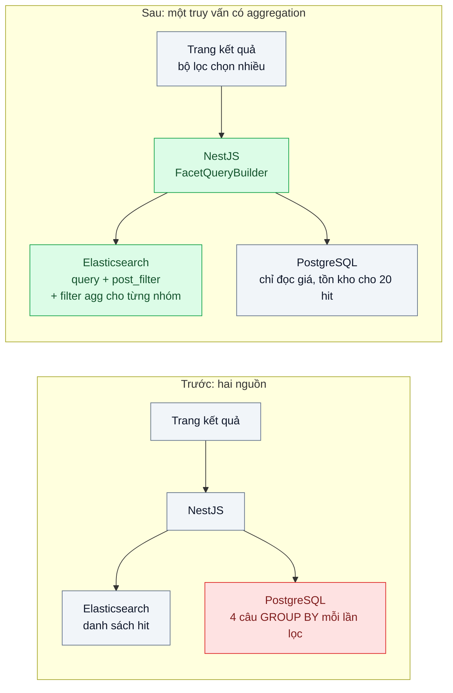
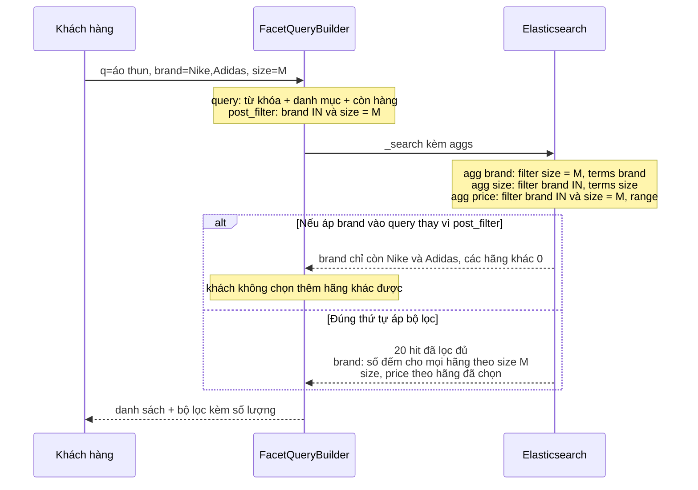

# Faceted Search (aggregations) — Bộ lọc thương hiệu/giá/size phải hiện số lượng kết quả cho từng lựa chọn

| Scope | Mức độ | Trạng thái | Pattern gốc | Cập nhật |
|---|---|---|---|---|
| 05 · backend / search | 🟡 Trung bình | 📋 Kế hoạch | Faceted Search — Elasticsearch docs "Aggregations" (terms, range, `post_filter`); IIR (faceted navigation) | 2026-10-06 |

> **Một câu tóm tắt:** Tính số lượng cho mọi lựa chọn bộ lọc trong cùng một truy vấn tìm kiếm bằng aggregation, và tách "lọc danh sách kết quả" (`post_filter`) khỏi "lọc số đếm" để khách chọn nhiều thương hiệu mà các con số vẫn đúng.

## 1. Bài toán thực tế (What)

**Bối cảnh** *(doanh nghiệp giả định, số liệu minh họa)*
Sàn TMĐT thời trang ở các bài trước, 2 triệu sản phẩm trong Elasticsearch, giá và tồn kho gốc ở PostgreSQL 16. Trang kết quả có bộ lọc thương hiệu, khoảng giá, size và màu. Hiện tại danh sách sản phẩm lấy từ Elasticsearch, còn số lượng cạnh mỗi lựa chọn được tính bằng 4 câu `SELECT ... GROUP BY` riêng trên PostgreSQL mỗi lần khách đổi bộ lọc.

**Triệu chứng người kinh doanh nhìn thấy**
- Mỗi lần tick một ô lọc, trang tải lại mất khoảng 2 giây; khách lọc 3–4 lần mới ra sản phẩm ưng ý nên nhiều người bỏ dở.
- Số cạnh bộ lọc không khớp danh sách: "Nike (120)" nhưng bấm vào chỉ ra 87 sản phẩm, vì hai nguồn dữ liệu lệch nhau.
- Khi chọn "Nike", các thương hiệu khác biến mất khỏi bộ lọc hoặc hiện "(0)", khách không chọn thêm "Adidas" được.

**Nguyên nhân kỹ thuật**
Số đếm và danh sách đến từ hai hệ thống với hai cách diễn giải truy vấn (FTS của PostgreSQL khác analyzer của Elasticsearch), nên không bao giờ khớp hoàn toàn. Mỗi lần đổi bộ lọc tốn 1 truy vấn tìm kiếm cộng 4 truy vấn `GROUP BY` trên tập kết quả lớn của DB nghiệp vụ. Bộ lọc được áp dụng cho cả danh sách lẫn số đếm, nên khi chọn "Nike" thì số đếm của chính nhóm thương hiệu cũng bị lọc theo "Nike" và các thương hiệu khác về 0: lỗi kinh điển của bộ lọc chọn nhiều (disjunctive facet).

**Ràng buộc**
- Số lượng cạnh mỗi lựa chọn phải nhất quán với danh sách hiển thị cùng lúc.
- Trong cùng nhóm (thương hiệu) các lựa chọn là OR; giữa các nhóm là AND.
- p95 trang kết quả kèm bộ lọc dưới 200 ms ở 40 lượt/giây; không thêm tải lên PostgreSQL.

## 2. Vì sao dùng pattern này (Why)

**Nguyên nhân gốc mà pattern nhắm vào:** số đếm bộ lọc được tính ngoài truy vấn tìm kiếm và không phân biệt bộ lọc của chính nhóm với bộ lọc của nhóm khác.

**Pattern giải quyết thế nào:** Faceted search coi mỗi thuộc tính có cấu trúc (thương hiệu, size, giá) là một chiều để điều hướng và hiển thị số tài liệu khớp cho từng giá trị. Elasticsearch tính số đếm bằng aggregation ngay trên tập kết quả của truy vấn: `terms` cho thương hiệu, size, màu; `range` cho khoảng giá. Điểm mấu chốt là thứ tự áp bộ lọc: truy vấn chính chỉ chứa từ khóa và bộ lọc không phải facet (danh mục, còn hàng); các lựa chọn facet đặt trong `post_filter` để chỉ lọc danh sách hit, không lọc aggregation. Mỗi aggregation của một nhóm được bọc trong `filter` aggregation chứa lựa chọn của *các nhóm khác*, nên số đếm thương hiệu phản ánh size và giá đang chọn nhưng không bị chính "Nike" che mất "Adidas".

**Lựa chọn khác đã cân nhắc**

| Lựa chọn | Giải quyết được gì | Vì sao không chọn (ở bài này) |
|---|---|---|
| Giữ nguyên + tối ưu nhỏ (gộp 4 câu bằng `GROUPING SETS`, cache số đếm theo danh mục) | Giảm số round-trip tới PostgreSQL | Vẫn lệch với danh sách từ Elasticsearch; cache theo danh mục sai khi có từ khóa |
| Tính số đếm ở client từ toàn bộ kết quả | Không thêm logic server | Phải tải hết hàng chục nghìn hit về trình duyệt |
| Aggregation nhưng áp mọi bộ lọc vào `query` | Một truy vấn, số khớp danh sách | Lỗi chọn nhiều: chọn "Nike" thì các thương hiệu khác về 0 |
| Aggregation + `post_filter` + `filter` aggregation theo nhóm (chọn) | Một truy vấn, số nhất quán, chọn nhiều đúng | Truy vấn dài hơn, phải sinh bằng code có test |

## 3. Thiết kế hệ thống (How)

### 3.1 Kiến trúc trước và sau



### 3.2 Luồng chính



### 3.3 Thành phần và trách nhiệm

| Thành phần | Trách nhiệm | Quyết định thiết kế đáng chú ý |
|---|---|---|
| Mapping thuộc tính facet | `brand`, `size`, `color` kiểu `keyword`; `price` kiểu số | Aggregation chạy trên `doc_values` của `keyword`, không aggregate trên trường `text` |
| `FacetQueryBuilder` | Sinh `query`, `post_filter`, `aggs` từ trạng thái bộ lọc | Hàm thuần, test bằng snapshot JSON; mỗi nhóm khai báo một lần trong bảng cấu hình facet |
| Aggregation `terms` | Đếm theo giá trị cho thương hiệu, size, màu | `size` của aggregation đủ lớn cho thương hiệu; biết số đếm có thể xấp xỉ khi nhiều shard |
| Aggregation `range` | Đếm theo khoảng giá cố định | Khoảng giá do nghiệp vụ định nghĩa, không sinh động theo dữ liệu ở bài này |
| `post_filter` | Lọc danh sách hit theo lựa chọn facet | Chỉ chứa bộ lọc facet; bộ lọc chung đặt trong `query.bool.filter` để được cache |
| Endpoint giá/tồn kho | Đọc PostgreSQL cho 20 id đang hiển thị | Tiếp nối nguyên tắc bài 01: index không là nguồn sự thật của giá |

### 3.4 Điểm dễ sai khi triển khai
- Aggregate trên trường `text`: Elasticsearch từ chối hoặc phải bật `fielddata` tốn heap; luôn dùng `keyword` (có thể là subfield).
- Đặt bộ lọc chung (danh mục, còn hàng) vào `post_filter`: số đếm tính trên cả hàng hết hàng, lệch với danh sách.
- Quên rằng `terms` trên nhiều shard là xấp xỉ: đọc `doc_count_error_upper_bound`, tăng `shard_size` hoặc dùng 1 shard khi dữ liệu nhỏ.
- Khoảng giá lọc trên giá trong index nhưng hiển thị giá từ PostgreSQL: giá đổi mà index chưa cập nhật thì sản phẩm nằm sai khoảng; độ trễ đồng bộ được xử lý ở bài 05.
- Sinh truy vấn bằng nối chuỗi trong controller: mỗi nhóm mới là một chỗ dễ sai thứ tự bộ lọc; gom vào một builder có test.

## 4. Tech stack và tác động (Impact techstack)

| Lớp | Công nghệ chọn | Vì sao chọn | Thay thế tương đương |
|---|---|---|---|
| API | TypeScript 5 strict, NestJS 10 | Tiếp nối module `search`; builder là service thuần, dễ test | Fastify |
| Công cụ tìm kiếm | Elasticsearch 8: `terms`, `range`, `filter` aggregation, `post_filter` | Số đếm và danh sách trong một truy vấn, cùng analyzer | OpenSearch 2 (cùng DSL) |
| Phương án so sánh | PostgreSQL 16 `GROUP BY GROUPING SETS` trên `tsvector` | Biết chi phí khi giữ facet trong DB | Materialized view số đếm theo danh mục |
| Frontend | Next.js, trạng thái bộ lọc trong URL query string | Chia sẻ được link đã lọc, nút back hoạt động đúng | Zustand + đồng bộ URL |
| Test | Vitest | Snapshot truy vấn sinh ra; so số đếm với SQL làm chuẩn | Jest |
| Đo | k6, Elasticsearch `took` và Profile API | p95 trang kết quả có bộ lọc; chi phí từng aggregation | — |

**Thay đổi so với hệ thống hiện tại:** bỏ 4 câu `GROUP BY` khỏi luồng tìm kiếm, thêm `FacetQueryBuilder` và cấu hình các nhóm facet; thêm trường `keyword` cho thuộc tính còn thiếu (cần reindex). Đội học đọc kết quả aggregation và khái niệm số đếm xấp xỉ.

## 5. Kết quả đầu ra và cách đo (Output impact)

| Chỉ số | Trước (minh họa) | Mục tiêu khi thực hành | Cách đo |
|---|---|---|---|
| p95 trang kết quả kèm bộ lọc ở 40 req/s | 2000 ms | < 200 ms | k6 `http_req_duration` p(95), 300 tổ hợp từ khóa + bộ lọc |
| Số truy vấn tới PostgreSQL mỗi lần đổi bộ lọc | 5 | 1 (giá, tồn kho cho 20 hit) | `pg_stat_statements` đếm `calls` theo câu trong lần chạy k6 |
| Số đếm khớp số hit khi bấm vào lựa chọn | khoảng 70% lựa chọn | 100% | Vitest: với mỗi lựa chọn, so số đếm với `hits.total` sau khi áp lựa chọn đó |
| Chọn nhiều trong một nhóm giữ số đếm các lựa chọn khác | sai | đúng trên 50 kịch bản | Vitest so với kết quả SQL chuẩn trên dữ liệu seed |
| Chi phí aggregation trong một truy vấn | không đo | < 30 ms | Elasticsearch Profile API, phần `aggregations` |

> Số "trước" là minh họa để hình dung bài toán. Số "mục tiêu" chỉ được coi là đạt khi có số đo thật
> ở mục 8 kèm môi trường đo.

**Tác động nghiệp vụ mong đợi:** khách lọc nhanh và tin con số trên bộ lọc nên thu hẹp lựa chọn tới sản phẩm mua được; DB nghiệp vụ không còn gánh truy vấn đếm của trang tìm kiếm.

## 6. Đánh đổi và khi KHÔNG nên dùng

**Đánh đổi**
- Truy vấn dài và phụ thuộc thứ tự bộ lọc; cần builder có test, khó sửa tay.
- Số đếm `terms` trên nhiều shard là xấp xỉ; phải giải thích với nghiệp vụ hoặc trả thêm chi phí để chính xác.
- Thuộc tính facet mới phải có trong mapping và cần reindex.

**Không nên dùng khi**
- Tập kết quả nhỏ (vài trăm bản ghi, trang quản trị nội bộ): `GROUP BY` trong PostgreSQL đơn giản và đủ nhanh.
- Bộ lọc không cần số đếm (chỉ lọc, không hiển thị số): một `bool.filter` là đủ, không cần aggregation.
- Thuộc tính có số lượng giá trị rất lớn (mã người bán, hàng trăm nghìn giá trị): facet `terms` tốn bộ nhớ, nên dùng ô tìm kiếm riêng cho thuộc tính đó.

**Liên quan**
- [`../01-full-text-vs-like-tim-ao-thun-nam-mat-8-giay/`](../01-full-text-vs-like-tim-ao-thun-nam-mat-8-giay/) — index và nguyên tắc đọc giá từ DB.
- [`../05-cdc-dong-bo-index-du-lieu-search-lech-db/`](../05-cdc-dong-bo-index-du-lieu-search-lech-db/) — giữ giá trong index không lệch để khoảng giá đúng.
- [`../06-relevance-tuning-san-pham-ban-chay-nam-trang-3/`](../06-relevance-tuning-san-pham-ban-chay-nam-trang-3/) — thứ tự kết quả sau khi lọc.
- [`../../02-backend-database/06-cqrs-man-hinh-tong-hop-join-9-bang/`](../../02-backend-database/06-cqrs-man-hinh-tong-hop-join-9-bang/) — mô hình đọc riêng cho màn hình tổng hợp, cùng tinh thần tách đọc khỏi DB nghiệp vụ.

## 7. Cơ sở tham khảo

- Elasticsearch Guide, "Aggregations" (`terms`, `range`, `filter`) — https://www.elastic.co/guide/ — cách tính số đếm trên tập kết quả, kèm phần về độ chính xác của `terms` (`shard_size`, `doc_count_error_upper_bound`).
- Elasticsearch Guide, "Filter search results" (`post_filter`) — https://www.elastic.co/guide/ — lọc hit mà không lọc aggregation, nền của bộ lọc chọn nhiều.
- Manning, Raghavan, Schütze, *Introduction to Information Retrieval*, 2008 — https://nlp.stanford.edu/IR-book/ — khái niệm truy vấn trên trường có cấu trúc kết hợp tìm văn bản, nền cho điều hướng theo facet (cần xác minh chương cụ thể).
- PostgreSQL docs, "GROUPING SETS, CUBE, and ROLLUP" — https://www.postgresql.org/docs/ — phương án so sánh gộp nhiều số đếm trong một câu SQL.

## 8. Kế hoạch thực hành

- [ ] Bước 1: dùng lại Docker Compose bài 01; seed 500.000 sản phẩm có thương hiệu (300 giá trị), size, màu, giá phân phối lệch; trang Next.js có bộ lọc chọn nhiều đồng bộ với URL.
- [ ] Bước 2: đo "trước": bản 4 câu `GROUP BY` trên PostgreSQL, ghi p95 bằng k6, `pg_stat_statements`, và đếm lựa chọn có số đếm không khớp danh sách.
- [ ] Bước 3: áp dụng pattern: thêm subfield `keyword`, viết `FacetQueryBuilder` (query, `post_filter`, `filter` aggregation theo nhóm), bỏ truy vấn đếm khỏi PostgreSQL.
- [ ] Bước 4: đo "sau" cùng kịch bản k6, Profile API cho phần aggregation; ghi số thật và môi trường vào mục 5.
- [ ] Bước 5: viết test: (a) chọn "Nike" vẫn thấy số đếm của các hãng khác; (b) số đếm mỗi lựa chọn bằng số hit khi bấm vào; (c) bộ lọc chung không nằm trong `post_filter`; (d) so với SQL chuẩn trên 50 kịch bản.

**Cấu trúc code dự kiến**
```text
src/
  truoc/facet-counts.sql.ts            # 4 câu GROUP BY, tái hiện triệu chứng
  sau/facet-config.ts                  # khai báo nhóm facet: field, kiểu terms/range
  sau/facet-query.builder.ts           # [PATTERN] query + post_filter + filter agg theo nhóm
  sau/facet-response.mapper.ts         # chuyển aggregation thành bộ lọc cho UI
  search.controller.ts
  shared/seed-fashion.ts
test/
  multi-brand-selection-keeps-counts.test.ts
  facet-count-matches-hits.test.ts
  facet-query.snapshot.test.ts
bench/facets.k6.js
docker-compose.yml
```

**Cách chạy** *(điền khi bắt đầu code)*
```bash
docker compose up -d
pnpm install && pnpm seed && pnpm test
k6 run bench/facets.k6.js
```
