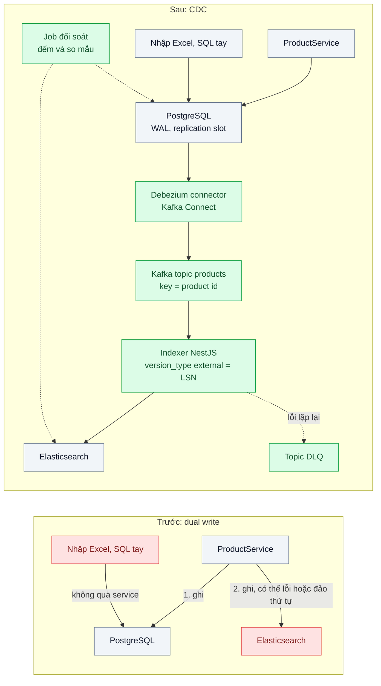
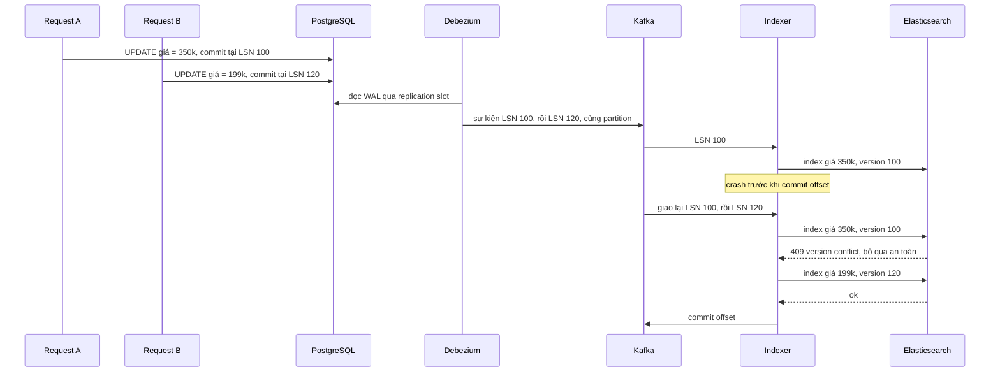

# CDC-based Index Sync — Dữ liệu trong search lệch với DB sau mỗi lần sửa giá

| Scope | Mức độ | Trạng thái | Pattern gốc | Cập nhật |
|---|---|---|---|---|
| 05 · backend / search | 🔴 Nâng cao | 📋 Kế hoạch | Change Data Capture — Kleppmann, *DDIA* (2017) ch.11; Debezium docs | 2026-10-06 |

> **Một câu tóm tắt:** Thay việc ứng dụng tự ghi hai nơi (DB rồi index) bằng việc đọc log thay đổi (WAL) của PostgreSQL và đẩy mọi thay đổi đã commit vào Elasticsearch theo đúng thứ tự, kèm phiên bản để bản cũ không bao giờ ghi đè bản mới.

## 1. Bài toán thực tế (What)

**Bối cảnh** *(doanh nghiệp giả định, số liệu minh họa)*
Sàn TMĐT ở các bài trước: 2 triệu sản phẩm, khoảng 300.000 lần sửa giá, tồn kho, trạng thái mỗi ngày, dồn dập vào đợt khuyến mãi. Hiện `ProductService` của NestJS ghi PostgreSQL rồi gọi Elasticsearch ngay sau đó (dual write); thay đổi từ công cụ nhập Excel và script SQL của đội vận hành thì không đi qua service. Một job reindex toàn bộ chạy lúc 2 giờ sáng để "vá" lệch.

**Triệu chứng người kinh doanh nhìn thấy**
- Khách lọc "dưới 200.000 đ" thấy sản phẩm, bấm vào lại là 350.000 đ vì giá trong index chưa cập nhật; khiếu nại "giá ảo" tăng mỗi đợt sale.
- Sản phẩm đã ngừng bán vẫn hiện trong tìm kiếm tới sáng hôm sau; sản phẩm mới nhập bằng Excel không tìm thấy cả ngày.
- Đội vận hành không trả lời được "index đang lệch bao nhiêu sản phẩm" cho tới khi khách báo.

**Nguyên nhân kỹ thuật**
Dual write không nguyên tử: DB commit xong nhưng lời gọi Elasticsearch lỗi hoặc tiến trình chết giữa chừng thì index thiếu thay đổi. Hai request sửa cùng một sản phẩm có thể commit theo thứ tự A rồi B nhưng ghi index theo thứ tự B rồi A, để lại giá cũ vĩnh viễn: DDIA ch.11 dùng chính ví dụ DB và search index để mô tả race condition này. Mọi đường ghi không đi qua service (Excel, SQL tay) đều bị bỏ sót. Job reindex hằng đêm chỉ che lệch, không sửa nguyên nhân, và chiếm tài nguyên cụm hàng giờ.

**Ràng buộc**
- PostgreSQL là nguồn sự thật; mọi thay đổi đã commit, từ bất kỳ đường ghi nào, phải tới index.
- Độ trễ từ commit tới tìm thấy p95 dưới 5 giây; không mất, không đảo thứ tự cập nhật trên cùng một sản phẩm.
- Không thêm logic đồng bộ vào từng chỗ ghi; không làm chậm transaction nghiệp vụ.

## 2. Vì sao dùng pattern này (Why)

**Nguyên nhân gốc mà pattern nhắm vào:** ứng dụng cố giữ hai hệ thống đồng bộ bằng hai lần ghi độc lập, không có thứ tự chung và không nguyên tử.

**Pattern giải quyết thế nào:** Change Data Capture coi log ghi trước (WAL) của DB là nguồn duy nhất về thứ tự thay đổi. Debezium đọc WAL qua logical replication slot của PostgreSQL, sinh một sự kiện cho mỗi dòng được insert/update/delete *sau khi commit*, kèm vị trí trong log (LSN). Sự kiện được đẩy vào Kafka với key là khóa chính, nên mọi thay đổi của cùng một sản phẩm nằm trên cùng partition và giữ thứ tự. Indexer đọc tuần tự, ghi vào Elasticsearch với `version_type=external` dùng LSN làm phiên bản: Elasticsearch chỉ nhận bản ghi có phiên bản cao hơn bản đang có, nên sự kiện lặp lại khi retry hoặc replay không ghi đè bản mới. Đường ghi nào chạm DB cũng được bắt, vì CDC nằm dưới ứng dụng.

**Lựa chọn khác đã cân nhắc**

| Lựa chọn | Giải quyết được gì | Vì sao không chọn (ở bài này) |
|---|---|---|
| Giữ nguyên + tối ưu nhỏ (retry khi ghi Elasticsearch lỗi, reindex thường xuyên hơn) | Giảm số lần lệch do lỗi mạng | Vẫn không nguyên tử, vẫn đảo thứ tự, vẫn bỏ sót đường ghi ngoài service |
| Đồng bộ theo `updated_at` mỗi phút (bài 01) | Bắt được mọi đường ghi có cập nhật cột | Bỏ sót xóa cứng, trễ theo chu kỳ, quét bảng tốn kém; đồng hồ và transaction dài làm sót dòng |
| Transactional Outbox (scope 14) | Sự kiện nghiệp vụ nguyên tử với dữ liệu, có ý nghĩa rõ | Chỉ bắt đường ghi đi qua code có ghi outbox; hợp khi phát sự kiện cho service khác, có thể kết hợp với Debezium Outbox Event Router |
| Debezium + Kafka + indexer có phiên bản (chọn) | Bắt mọi thay đổi đã commit, đúng thứ tự theo key, idempotent | Thêm Kafka, Kafka Connect, replication slot phải vận hành |

## 3. Thiết kế hệ thống (How)

### 3.1 Kiến trúc trước và sau



### 3.2 Luồng chính



### 3.3 Thành phần và trách nhiệm

| Thành phần | Trách nhiệm | Quyết định thiết kế đáng chú ý |
|---|---|---|
| PostgreSQL | Nguồn sự thật, sinh WAL ở mức `logical` | `wal_level=logical`, publication chỉ cho bảng cần index, `max_slot_wal_keep_size` để slot không làm đầy đĩa |
| Debezium PostgreSQL connector | Snapshot ban đầu rồi đọc thay đổi liên tục | Plugin `pgoutput` có sẵn trong PostgreSQL; key sự kiện là khóa chính |
| Kafka topic `products` | Giữ thứ tự theo key, lưu sự kiện để replay | Số partition cố định từ đầu; đổi số partition làm xáo thứ tự theo key |
| Indexer | Chuyển sự kiện thành tài liệu, ghi Elasticsearch, commit offset sau khi ghi | Ghi với `version_type=external`; coi 409 là thành công; xử lý sự kiện delete bằng xóa có phiên bản |
| Topic DLQ | Chứa sự kiện lỗi lặp lại (dữ liệu hỏng, mapping sai) | Không chặn partition quá N lần retry; có cảnh báo |
| Job đối soát | So số lượng và mẫu ngẫu nhiên giữa DB và index | Phát hiện lệch còn sót, đo được chất lượng đồng bộ thay vì đoán |

### 3.4 Điểm dễ sai khi triển khai
- Replication slot không được tiêu thụ (connector dừng) giữ WAL lại trên PostgreSQL tới khi đầy đĩa và DB nghiệp vụ sập. Phải giám sát độ trễ slot và đặt `max_slot_wal_keep_size`.
- Tài liệu index ghép dữ liệu nhiều bảng (tên thương hiệu nằm ở `brands`): sự kiện của `brands` phải kích hoạt cập nhật mọi sản phẩm liên quan, hoặc indexer đọc lại bản ghi đầy đủ từ DB; quên điều này là nguồn lệch phổ biến nhất.
- Dùng `updated_at` hoặc thời gian của indexer làm phiên bản: đồng hồ không đơn điệu giữa các máy; LSN mới phản ánh thứ tự commit.
- Commit offset trước khi ghi Elasticsearch thành công: crash là mất sự kiện. Thứ tự đúng là ghi rồi mới commit, chấp nhận lặp và dựa vào phiên bản để idempotent.
- Bỏ qua tombstone và sự kiện delete: sản phẩm xóa cứng vẫn nằm trong index.

## 4. Tech stack và tác động (Impact techstack)

| Lớp | Công nghệ chọn | Vì sao chọn | Thay thế tương đương |
|---|---|---|---|
| Nguồn dữ liệu | PostgreSQL 16, logical replication (`pgoutput`) | Có sẵn, không cần extension | — |
| CDC | Debezium PostgreSQL connector trên Kafka Connect | Snapshot ban đầu, thứ tự theo key, metadata nguồn (LSN) trong mỗi sự kiện | Debezium Server với sink khác Kafka (cần xác minh sink phù hợp) |
| Log sự kiện | Kafka (chế độ KRaft, một broker local) | Giữ thứ tự theo partition, replay được khi cần dựng lại index | Redpanda (tương thích API Kafka) |
| Indexer | TypeScript strict, NestJS 10, client Kafka `kafkajs` (cần xác minh tình trạng bảo trì) | Trùng stack; kiểm soát rõ thời điểm commit offset | `@confluentinc/kafka-javascript` (cần xác minh) |
| Đích | Elasticsearch 8, Index API với `version_type=external` | Từ chối bản cũ, idempotent khi replay | OpenSearch 2 |
| Giám sát | Prometheus: độ trễ slot, consumer lag, độ trễ đồng bộ | Biết lệch trước khi khách báo | Grafana |
| Hạ tầng local | Docker Compose | PostgreSQL, Kafka, Kafka Connect, Elasticsearch một lệnh | — |

**Thay đổi so với hệ thống hiện tại:** bỏ lời gọi Elasticsearch trong `ProductService` và job reindex hằng đêm; thêm Kafka, Kafka Connect với Debezium, một indexer và job đối soát. Đội vận hành học thêm: replication slot, consumer lag, cách replay từ offset và cách dựng lại index từ snapshot.

## 5. Kết quả đầu ra và cách đo (Output impact)

| Chỉ số | Trước (minh họa) | Mục tiêu khi thực hành | Cách đo |
|---|---|---|---|
| Độ trễ commit tới tìm thấy, p95 | tới 24 giờ với đường ghi ngoài service | < 5 giây | Test tích hợp: ghi PostgreSQL có đánh dấu thời gian, poll `_search`, tính phân vị trên 1.000 lần |
| Số tài liệu lệch sau 1 giờ chạy tải có tiêm lỗi | 0,5% index | 0 | Job đối soát so toàn bộ id và giá giữa PostgreSQL và Elasticsearch |
| Cập nhật bị đảo thứ tự trên cùng sản phẩm | có | 0 trên 10.000 cặp cập nhật đồng thời | Test: hai luồng sửa cùng id, kiểm giá cuối trong index bằng giá cuối trong DB |
| Sự kiện mất khi kill indexer giữa chừng | có | 0 | Test tích hợp: `docker kill` indexer khi đang chạy, khởi động lại, đối soát |
| WAL giữ lại bởi slot khi indexer dừng 10 phút | không áp dụng | có cảnh báo, không đầy đĩa | Truy vấn `pg_replication_slots` với `pg_wal_lsn_diff`; metric Prometheus |
| Consumer lag lúc đỉnh 500 thay đổi/giây | không áp dụng | hồi về 0 trong 60 giây | Kafka consumer group lag, Prometheus |

> Số "trước" là minh họa để hình dung bài toán. Số "mục tiêu" chỉ được coi là đạt khi có số đo thật
> ở mục 8 kèm môi trường đo.

**Tác động nghiệp vụ mong đợi:** giá và trạng thái khách thấy trong tìm kiếm khớp trang chi tiết sau vài giây, giảm khiếu nại "giá ảo" trong đợt sale; bỏ được job reindex đêm và có số đo độ lệch để báo cáo.

## 6. Đánh đổi và khi KHÔNG nên dùng

**Đánh đổi**
- Thêm ba hệ thống phải vận hành (Kafka, Kafka Connect, connector) và một rủi ro mới cho chính DB nghiệp vụ (replication slot giữ WAL).
- Sự kiện CDC là sự kiện *dữ liệu* theo cấu trúc bảng: đổi schema bảng có thể làm hỏng indexer; cần kỷ luật thay đổi schema.
- Nhất quán cuối cùng: vẫn có vài giây trễ, giao diện phải đọc giá từ DB như bài 01.

**Không nên dùng khi**
- Lượng thay đổi nhỏ và chấp nhận trễ vài phút: đồng bộ theo `updated_at` có soft delete là đủ và rẻ hơn nhiều.
- Chỉ một service ghi dữ liệu và đã có outbox cho mục đích khác: đọc outbox để cập nhật index đơn giản hơn đọc WAL của mọi bảng.
- Đội chưa có năng lực vận hành Kafka và không có dịch vụ quản lý: rủi ro vận hành lớn hơn lợi ích.

**Liên quan**
- [`../01-full-text-vs-like-tim-ao-thun-nam-mat-8-giay/`](../01-full-text-vs-like-tim-ao-thun-nam-mat-8-giay/) — job đồng bộ theo `updated_at` mà bài này thay thế.
- [`../07-zero-downtime-reindex-doi-mapping-50-trieu-doc/`](../07-zero-downtime-reindex-doi-mapping-50-trieu-doc/) — dùng replay từ offset để bắt kịp khi dựng index mới.
- [`../../14-backend-queueing/03-transactional-outbox-ghi-don-xong-crash-mat-event/`](../../14-backend-queueing/03-transactional-outbox-ghi-don-xong-crash-mat-event/) — outbox, phương án cho sự kiện nghiệp vụ.
- [`../../14-backend-queueing/04-idempotent-consumer-event-den-hai-lan-tru-kho-hai-lan/`](../../14-backend-queueing/04-idempotent-consumer-event-den-hai-lan-tru-kho-hai-lan/) — xử lý sự kiện lặp ở phía tiêu thụ.

## 7. Cơ sở tham khảo

- Martin Kleppmann, *Designing Data-Intensive Applications*, O'Reilly, 2017, ch.11 "Stream Processing", phần "Keeping Systems in Sync" và "Change Data Capture" — race condition của dual write giữa DB và search index, lý do dùng log thay đổi làm nguồn thứ tự.
- Debezium docs, "PostgreSQL connector" (snapshot, `pgoutput`, cấu trúc sự kiện và trường `source.lsn`) và "Outbox Event Router" — https://debezium.io/documentation/ — cấu hình connector và phương án kết hợp outbox.
- PostgreSQL docs, "Logical Decoding" (replication slot) và tham số `max_slot_wal_keep_size` — https://www.postgresql.org/docs/ — cơ chế bên dưới Debezium và rủi ro giữ WAL.
- Elasticsearch Guide, "Index API" phần versioning (`version_type=external`) — https://www.elastic.co/guide/ — điều kiện chấp nhận ghi theo phiên bản ngoài, nền của indexer idempotent.
- Chris Richardson, microservices.io, "Transactional outbox" và "CQRS" — https://microservices.io/patterns/ — đặt index tìm kiếm như một read model được cập nhật từ sự kiện.

## 8. Kế hoạch thực hành

- [ ] Bước 1: Docker Compose gồm PostgreSQL 16 (`wal_level=logical`), Kafka KRaft, Kafka Connect có Debezium, Elasticsearch 8; seed 200.000 sản phẩm; tái hiện dual write trong `truoc/`.
- [ ] Bước 2: đo "trước": chạy tải sửa giá đồng thời kèm tiêm lỗi (Elasticsearch trả 503 ngẫu nhiên, kill service), sửa thêm bằng SQL tay; đối soát và ghi số lệch, số cập nhật đảo thứ tự.
- [ ] Bước 3: áp dụng pattern: đăng ký connector, viết indexer ghi với phiên bản LSN, commit offset sau khi ghi, DLQ, job đối soát, metric độ trễ slot và lag.
- [ ] Bước 4: đo "sau" cùng kịch bản tiêm lỗi; ghi độ trễ p95, số lệch, lag vào mục 5 kèm môi trường.
- [ ] Bước 5: viết test: (a) hai cập nhật đồng thời, index giữ bản mới nhất; (b) kill indexer giữa chừng không mất sự kiện; (c) xóa cứng làm biến mất tài liệu; (d) sửa bằng SQL tay vẫn tới index.

**Cấu trúc code dự kiến**
```text
src/
  truoc/dual-write.product.service.ts     # ghi DB rồi ghi ES, tái hiện triệu chứng
  sau/connector/products-connector.json   # cấu hình Debezium
  sau/indexer/product-indexer.consumer.ts # [PATTERN] đọc theo partition, ghi version external
  sau/indexer/product-document.mapper.ts
  sau/reconcile/reconcile.job.ts          # đối soát DB và index
  sau/metrics.ts                          # độ trễ slot, lag, độ trễ đồng bộ
test/
  concurrent-updates-keep-latest.test.ts
  indexer-crash-loses-no-events.test.ts
  hard-delete-removes-from-index.test.ts
  manual-sql-edit-still-syncs.test.ts
docker-compose.yml
```

**Cách chạy** *(điền khi bắt đầu code)*
```bash
docker compose up -d
pnpm install && pnpm connector:register && pnpm test
```
