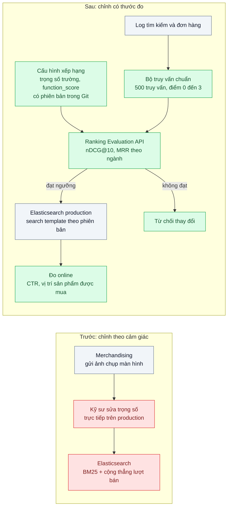
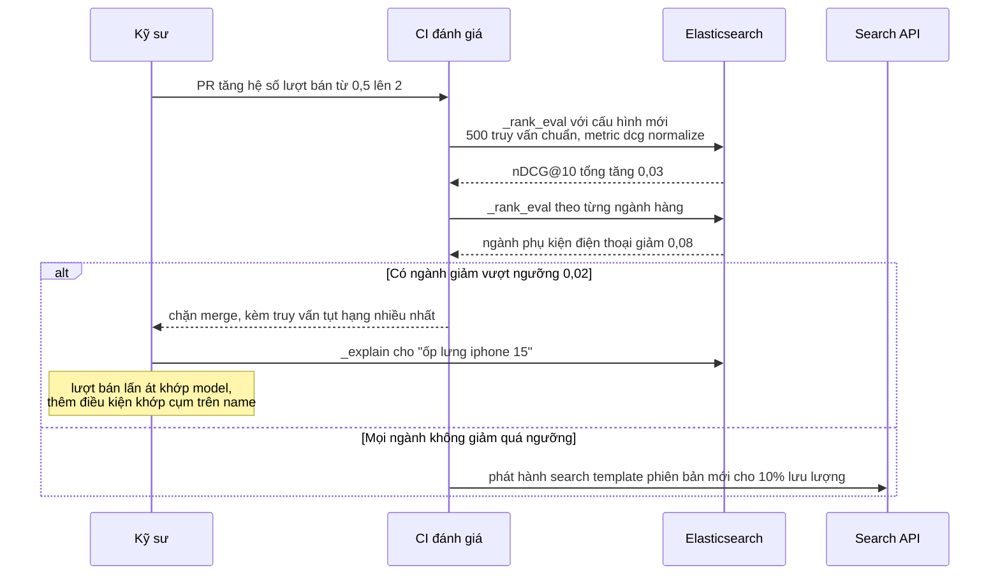

# Relevance Tuning (BM25 + boosting) — Sản phẩm bán chạy nhất nằm ở trang 3 kết quả

| Scope | Mức độ | Trạng thái | Pattern gốc | Cập nhật |
|---|---|---|---|---|
| 05 · backend / search | 🔴 Nâng cao | 📋 Kế hoạch | BM25 — Robertson & Zaragoza (2009); Elasticsearch `function_score`; đánh giá xếp hạng theo IIR (2008) ch.8 | 2026-10-06 |

> **Một câu tóm tắt:** Kết hợp điểm khớp văn bản BM25 với tín hiệu kinh doanh (lượt bán, đánh giá, còn hàng) bằng công thức có kiểm soát, và chỉ chấp nhận mỗi lần chỉnh khi bộ đánh giá offline (nDCG@10, MRR) chứng minh nó tốt hơn.

## 1. Bài toán thực tế (What)

**Bối cảnh** *(doanh nghiệp giả định, số liệu minh họa)*
Sàn TMĐT ở các bài trước, đã có analyzer tiếng Việt và bộ lọc. Xếp hạng hiện là BM25 mặc định của Elasticsearch trên `name` và `description`. Đội merchandising liên tục nhờ kỹ sư "đẩy" sản phẩm lên bằng cách sửa trọng số trực tiếp trên production theo phản hồi từng ngành hàng.

**Triệu chứng người kinh doanh nhìn thấy**
- Tìm "nồi chiên không dầu", mẫu bán chạy nhất (4.000 đơn/tháng) nằm ở trang 3; trang 1 là các tin đăng ít người mua nhưng lặp từ khóa nhiều lần trong mô tả.
- Mỗi lần kỹ sư tăng trọng số "lượt bán" để sửa một ngành, ngành khác hỏng: tìm "ốp lưng iphone 15" ra ốp iPhone 14 bán chạy lên đầu.
- Không ai trả lời được "thay đổi tuần trước làm tìm kiếm tốt hơn hay tệ hơn", chỉ có cảm nhận và ảnh chụp màn hình.

**Nguyên nhân kỹ thuật**
BM25 chỉ đo độ khớp văn bản giữa truy vấn và tài liệu: tần suất term (có bão hòa), độ hiếm của term, độ dài trường. Nó không biết sản phẩm nào khách thật sự mua, nên mô tả nhồi từ khóa được thưởng. Việc thêm tín hiệu kinh doanh được làm bằng cách cộng thẳng lượt bán vào điểm, không chuẩn hóa thang đo, nên một tín hiệu lớn lấn át hoàn toàn độ khớp. Không có bộ truy vấn chuẩn kèm đáp án, mọi lần chỉnh là đoán.

**Ràng buộc**
- Độ khớp văn bản vẫn là điều kiện cần: sản phẩm không liên quan không được lên đầu dù bán chạy.
- Mỗi thay đổi xếp hạng phải có số đo offline trước khi lên production, có thể quay lại cấu hình cũ trong vài phút.
- p95 không tăng quá 20% so với bài 04.

## 2. Vì sao dùng pattern này (Why)

**Nguyên nhân gốc mà pattern nhắm vào:** điểm xếp hạng chỉ có một thành phần (độ khớp văn bản) và việc chỉnh nó không có thước đo.

**Pattern giải quyết thế nào:** Robertson & Zaragoza trình bày BM25 như một hàm có tham số (`k1` điều khiển độ bão hòa tần suất term, `b` điều khiển chuẩn hóa độ dài), tức là có thể giải thích và chỉnh. Bài này giữ BM25 làm lõi, chỉnh trọng số theo trường (`name` quan trọng hơn `description`) để giảm lợi thế của mô tả nhồi từ khóa, rồi nhân thêm tín hiệu kinh doanh đã nén thang đo bằng `function_score` (`field_value_factor` với `modifier: log1p` cho lượt bán 30 ngày, hệ số nhỏ cho điểm đánh giá, phạt hàng hết). Nén logarit khiến 4.000 đơn không hơn 40 đơn tới 100 lần, nên độ khớp vẫn quyết định. Vòng lặp chỉnh được khép bằng đánh giá offline như IIR ch.8: bộ truy vấn chuẩn có điểm liên quan theo mức, chạy qua Ranking Evaluation API của Elasticsearch để tính nDCG@10 và MRR; thay đổi chỉ được nhận khi chỉ số tăng và không ngành nào giảm quá ngưỡng.

**Lựa chọn khác đã cân nhắc**

| Lựa chọn | Giải quyết được gì | Vì sao không chọn (ở bài này) |
|---|---|---|
| Giữ nguyên + tối ưu nhỏ (ghim thủ công vài sản phẩm cho từ khóa hot) | Sửa nhanh các từ khóa doanh thu lớn | Không mở rộng cho đuôi dài; danh sách ghim lỗi thời nhanh |
| Sắp xếp thẳng theo lượt bán | Bán chạy lên đầu | Mất độ liên quan: kết quả không khớp truy vấn lên trước |
| Learning to Rank (mô hình học từ click) | Tối ưu tốt nhất khi có nhiều dữ liệu hành vi | Cần pipeline đặc trưng, dữ liệu click sạch và hạ tầng huấn luyện; để sau khi có bộ đánh giá |
| Chỉnh `k1`, `b` của BM25 | Đổi cách thưởng tần suất và độ dài | Tác động toàn cục, khó lường; chỉ thử sau khi đã có bộ đánh giá |
| BM25 + trọng số trường + `function_score` + đánh giá offline (chọn) | Thêm tín hiệu kinh doanh có kiểm soát, đo được từng thay đổi | Phải xây và duy trì bộ truy vấn chuẩn |

## 3. Thiết kế hệ thống (How)

### 3.1 Kiến trúc trước và sau



### 3.2 Luồng chính



### 3.3 Thành phần và trách nhiệm

| Thành phần | Trách nhiệm | Quyết định thiết kế đáng chú ý |
|---|---|---|
| Bộ truy vấn chuẩn (judgment list) | 500 truy vấn đại diện theo ngành, mỗi cặp truy vấn–sản phẩm có điểm 0–3 | Khởi tạo từ log đơn hàng sau tìm kiếm, merchandising duyệt lại; lưu trong Git |
| Cấu hình xếp hạng | Trọng số trường, `function_score`, phạt hết hàng | Lưu dạng search template có phiên bản; production gọi theo id phiên bản để quay lại nhanh |
| `function_score` | Nhân điểm BM25 với tín hiệu kinh doanh đã nén | `log1p` cho lượt bán, `boost_mode: multiply`, giới hạn `max_boost` |
| Trường tín hiệu | `sales_30d`, `rating_avg`, `in_stock` | Cập nhật qua luồng CDC của bài 05; tính sẵn, không tính lúc truy vấn |
| Job đánh giá trong CI | Gọi `_rank_eval`, so với phiên bản đang chạy, chặn khi tụt | Báo cáo theo ngành, không chỉ con số tổng |
| Đo online | CTR top 10, vị trí trung bình của sản phẩm được mua | Ghi sự kiện tìm kiếm và click kèm id phiên bản cấu hình |

### 3.4 Điểm dễ sai khi triển khai
- Cộng tín hiệu chưa chuẩn hóa vào điểm BM25: thang đo khác nhau khiến một tín hiệu thống trị. Nén (`log1p`, `sqrt`) và giới hạn hệ số trước.
- Bộ truy vấn chuẩn chỉ gồm từ khóa hot: chỉ số đẹp nhưng đuôi dài hỏng. Lấy mẫu phân tầng theo tần suất và theo ngành.
- Lấy nhãn chỉ từ click: sản phẩm vốn ở vị trí cao được click nhiều hơn (position bias); dùng đơn hàng và duyệt tay để giảm lệch.
- Tối ưu một con số tổng: tăng tổng nhưng một ngành tụt mạnh; luôn đặt ngưỡng theo ngành.
- Dùng `function_score` cho tín hiệu tĩnh trên tập kết quả rất lớn làm tăng độ trễ; cân nhắc kiểu trường `rank_feature` với truy vấn `rank_feature`, vốn được thiết kế để bỏ qua các hit không cạnh tranh.

## 4. Tech stack và tác động (Impact techstack)

| Lớp | Công nghệ chọn | Vì sao chọn | Thay thế tương đương |
|---|---|---|---|
| Xếp hạng | Elasticsearch 8: BM25 (similarity mặc định), `function_score`, `rank_feature` | Có sẵn, giải thích được bằng `_explain` | OpenSearch 2 (cùng tính năng chính) |
| Đánh giá offline | Elasticsearch Ranking Evaluation API (`_rank_eval`) | Tính `dcg` (có chuẩn hóa), `mean_reciprocal_rank`, `precision` ngay trên cụm | Script Python tính nDCG từ kết quả `_search` |
| Quản lý cấu hình | Search template có phiên bản, lưu trong Git | Đổi và quay lại xếp hạng không cần deploy code | Lưu DSL trong code có cờ cấu hình |
| CI | GitHub Actions chạy job đánh giá trên index mẫu cố định | Mỗi PR có báo cáo nDCG theo ngành | GitLab CI |
| Đo online | Sự kiện tìm kiếm và click ghi vào PostgreSQL 16 | Đủ cho quy mô thực hành, truy vấn SQL để tính CTR | ClickHouse khi lượng sự kiện lớn |
| Test / tải | Vitest, k6 | Test xếp hạng cho các truy vấn ngữ cảnh; k6 đo chi phí `function_score` | — |

**Thay đổi so với hệ thống hiện tại:** thêm trường tín hiệu vào index (cập nhật qua CDC), search template có phiên bản, bộ truy vấn chuẩn và job đánh giá chặn trong CI; bỏ việc sửa trọng số trực tiếp trên production. Merchandising tham gia duyệt nhãn thay vì gửi ảnh chụp màn hình.

## 5. Kết quả đầu ra và cách đo (Output impact)

| Chỉ số | Trước (minh họa) | Mục tiêu khi thực hành | Cách đo |
|---|---|---|---|
| nDCG@10 trên bộ truy vấn chuẩn | 0,52 | ≥ 0,65, không ngành nào giảm quá 0,02 | `_rank_eval` metric `dcg` với `normalize: true`, `k: 10` |
| MRR (sản phẩm liên quan nhất đứng thứ mấy) | 0,41 | ≥ 0,55 | `_rank_eval` metric `mean_reciprocal_rank` |
| Vị trí trung bình của sản phẩm được mua sau tìm kiếm | 14 | ≤ 6 | Truy vấn SQL trên sự kiện tìm kiếm và đơn hàng, theo phiên bản cấu hình |
| Truy vấn mà sản phẩm không liên quan lọt top 3 | không đo | ≤ 2% bộ chuẩn | Đếm cặp điểm 0 trong top 3 từ kết quả `_rank_eval` |
| p95 truy vấn có `function_score` | đo ở bài 04 | tăng ≤ 20% | k6 cùng kịch bản bài 04, trường `took` |
| Thời gian quay lại cấu hình cũ | sửa tay, không rõ | < 5 phút | Đổi id search template, đo bằng đồng hồ trong buổi diễn tập |

> Số "trước" là minh họa để hình dung bài toán. Số "mục tiêu" chỉ được coi là đạt khi có số đo thật
> ở mục 8 kèm môi trường đo.

**Tác động nghiệp vụ mong đợi:** sản phẩm khách thật sự mua lên trang đầu cho truy vấn liên quan, tăng chuyển đổi từ tìm kiếm; tranh luận "đẩy sản phẩm nào" chuyển thành thảo luận trên số đo theo ngành.

## 6. Đánh đổi và khi KHÔNG nên dùng

**Đánh đổi**
- Bộ truy vấn chuẩn tốn công xây và phải làm mới định kỳ; nhãn lỗi thời dẫn tới tối ưu sai.
- Tín hiệu lượt bán tạo vòng tự củng cố (bán chạy lên đầu nên bán chạy hơn); sản phẩm mới khó lên, cần cơ chế cho hàng mới.
- Công thức nhiều thành phần khó giải thích cho người bán hơn BM25 thuần.

**Không nên dùng khi**
- Chưa có analyzer đúng (bài 02): chỉnh trọng số không cứu được truy vấn không khớp term.
- Lượng truy vấn và đơn hàng quá ít để xây bộ chuẩn đáng tin: ưu tiên sửa dữ liệu sản phẩm và analyzer trước.
- Kết quả bắt buộc theo quy định (ví dụ danh sách sắp theo giá hoặc thời gian theo luật): không được trộn tín hiệu kinh doanh vào thứ tự.

**Liên quan**
- [`../02-vietnamese-analyzer-tim-ha-noi-ra-ha-noi/`](../02-vietnamese-analyzer-tim-ha-noi-ra-ha-noi/) — trọng số trường giữ dấu là một tham số được chỉnh ở đây.
- [`../05-cdc-dong-bo-index-du-lieu-search-lech-db/`](../05-cdc-dong-bo-index-du-lieu-search-lech-db/) — đưa tín hiệu `sales_30d`, `in_stock` vào index đúng hạn.
- [`../07-zero-downtime-reindex-doi-mapping-50-trieu-doc/`](../07-zero-downtime-reindex-doi-mapping-50-trieu-doc/) — thêm trường `rank_feature` cần đổi mapping.
- [`../../10-backend-ai-rag/03-hybrid-search-rrf-ma-san-pham-tim-vector-khong-ra/`](../../10-backend-ai-rag/03-hybrid-search-rrf-ma-san-pham-tim-vector-khong-ra/) — kết hợp BM25 với vector bằng RRF.

## 7. Cơ sở tham khảo

- Stephen Robertson & Hugo Zaragoza, "The Probabilistic Relevance Framework: BM25 and Beyond", Foundations and Trends in Information Retrieval, 2009 — ý nghĩa các tham số `k1`, `b` và cách BM25 xử lý tần suất term, độ dài trường.
- Manning, Raghavan, Schütze, *Introduction to Information Retrieval*, 2008, ch.8 "Evaluation in information retrieval" — https://nlp.stanford.edu/IR-book/ — precision@k, nDCG, MRR và cách xây bộ đánh giá có nhãn.
- Elasticsearch Guide, "Function score query" (`field_value_factor`, `modifier`, `boost_mode`) và "Rank feature query" — https://www.elastic.co/guide/ — hai cách đưa tín hiệu kinh doanh vào điểm.
- Elasticsearch Guide, "Ranking evaluation API", "Explain API", "Similarity module" và "Search templates" — https://www.elastic.co/guide/ — đánh giá offline, giải thích điểm, tham số BM25, quản lý cấu hình xếp hạng có phiên bản.

## 8. Kế hoạch thực hành

- [ ] Bước 1: dùng lại index của bài 04, thêm trường `sales_30d`, `rating_avg`, `in_stock`; sinh log tìm kiếm và đơn hàng giả có phân phối lệch theo ngành; dựng bộ truy vấn chuẩn 500 truy vấn với nhãn 0–3.
- [ ] Bước 2: đo "trước": `_rank_eval` cho BM25 mặc định và cho cấu hình "cộng thẳng lượt bán"; ghi nDCG@10, MRR theo ngành.
- [ ] Bước 3: áp dụng pattern: trọng số trường, `function_score` với `log1p` và `max_boost`, phạt hết hàng; lưu thành search template có phiên bản; job CI chặn khi tụt theo ngành.
- [ ] Bước 4: đo "sau" cùng bộ chuẩn và k6; mô phỏng đo online bằng sự kiện click giả có position bias; ghi số thật và môi trường vào mục 5.
- [ ] Bước 5: viết test: (a) sản phẩm điểm 0 không vào top 3 cho 20 truy vấn mẫu; (b) mẫu bán chạy và liên quan lên trang 1 cho "nồi chiên không dầu"; (c) job CI thất bại khi một ngành tụt quá ngưỡng.

**Cấu trúc code dự kiến**
```text
src/
  truoc/naive-sales-boost.query.ts      # cộng thẳng lượt bán, tái hiện triệu chứng
  sau/ranking-template.v1.json          # [PATTERN] trọng số trường + function_score
  sau/ranking-config.service.ts         # chọn search template theo phiên bản
  sau/eval/judgments.csv                # bộ truy vấn chuẩn
  sau/eval/rank-eval.runner.ts          # [PATTERN] gọi _rank_eval, báo cáo theo ngành
  sau/events/search-event.logger.ts     # sự kiện tìm kiếm, click kèm phiên bản
test/
  irrelevant-never-in-top-3.test.ts
  relevant-bestseller-on-page-1.test.ts
  ci-fails-on-category-regression.test.ts
bench/ranking.k6.js
docker-compose.yml
```

**Cách chạy** *(điền khi bắt đầu code)*
```bash
docker compose up -d
pnpm install && pnpm seed && pnpm eval && pnpm test
```
