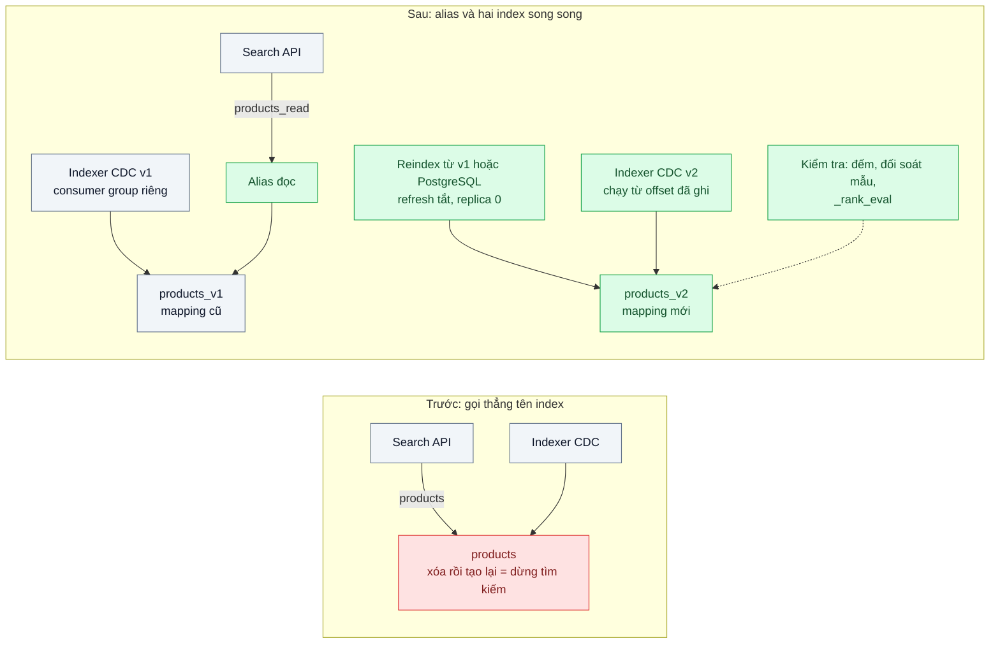
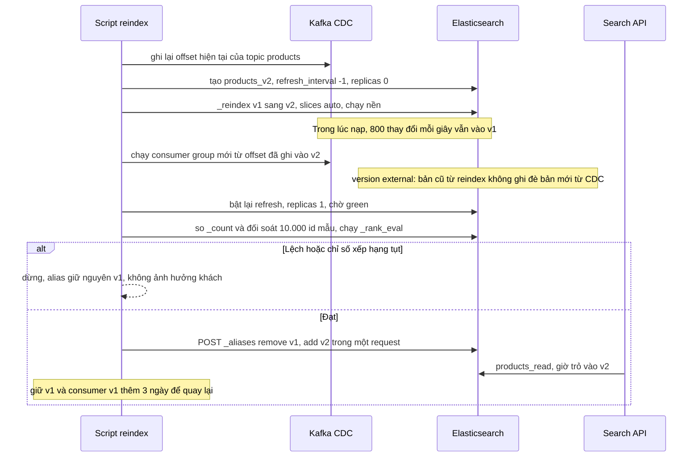

# Zero-downtime Reindex (alias swap) — Đổi mapping bắt buộc reindex 50 triệu tài liệu mà search không được dừng

| Scope | Mức độ | Trạng thái | Pattern gốc | Cập nhật |
|---|---|---|---|---|
| 05 · backend / search | 🔴 Nâng cao | 📋 Kế hoạch | Parallel Change (expand–contract) áp cho index — Fowler bliki "ParallelChange" (Danilo Sato, 2014); Elasticsearch Aliases, Reindex API | 2026-10-06 |

> **Một câu tóm tắt:** Ứng dụng chỉ đọc và ghi qua alias; index mới với mapping mới được dựng song song, nạp dữ liệu và bắt kịp thay đổi trong lúc index cũ vẫn phục vụ, rồi alias được chuyển nguyên tử sang index mới, giữ index cũ để quay lại.

## 1. Bài toán thực tế (What)

**Bối cảnh** *(doanh nghiệp giả định, số liệu minh họa)*
Sàn TMĐT đã mở rộng sang hàng của người bán bên thứ ba, index `products` có 50 triệu tài liệu, 5 primary shard, khoảng 800 thay đổi mỗi giây vào giờ cao điểm qua luồng CDC của bài 05. Các bài 02, 03, 06 đều cần đổi mapping: analyzer tiếng Việt mới, trường `search_as_you_type`, trường `rank_feature`. Ứng dụng đang gọi thẳng tên index `products`.

**Triệu chứng người kinh doanh nhìn thấy**
- Lần đổi analyzer gần nhất, đội phải treo thông báo bảo trì tìm kiếm 6 tiếng lúc nửa đêm; doanh thu đêm đó giảm rõ và đội chăm sóc khách hàng nhận nhiều phàn nàn.
- Ba tính năng tìm kiếm đã làm xong nằm chờ hai tháng vì không ai dám xin thêm một đêm bảo trì.
- Lần thử reindex tại chỗ trước đó lỗi giữa chừng, khách thấy kết quả thiếu một nửa danh mục cho tới khi khôi phục snapshot.

**Nguyên nhân kỹ thuật**
Mapping của một trường đã tồn tại không đổi được tại chỗ: đổi analyzer hay kiểu trường bắt buộc tạo index mới và nạp lại toàn bộ tài liệu. Vì ứng dụng gắn chặt với tên index, cách duy nhất là xóa rồi tạo lại cùng tên, tức là có khoảng trống. Trong vài giờ nạp lại, thay đổi giá và tồn kho tiếp tục đổ về; không có cơ chế bắt kịp thì index mới thiếu dữ liệu ngay khi vừa xong. Không có đường quay lại nếu mapping mới có lỗi.

**Ràng buộc**
- Không có giây nào tìm kiếm trả lỗi hoặc thiếu dữ liệu trong suốt quá trình.
- Không mất thay đổi nào xảy ra trong lúc reindex; index mới phải khớp DB trước khi nhận lưu lượng.
- Quay lại index cũ trong dưới một phút nếu phát hiện lỗi sau khi chuyển.
- Cụm hiện tại phải chịu được cả tải tìm kiếm lẫn tải nạp lại; được phép thêm node tạm thời.

## 2. Vì sao dùng pattern này (Why)

**Nguyên nhân gốc mà pattern nhắm vào:** người dùng index bị gắn với một tên vật lý, và việc thay thế được làm như một thao tác "dừng–đổi–chạy" thay vì chuyển dần.

**Pattern giải quyết thế nào:** Parallel Change chia một thay đổi phá vỡ tương thích thành ba pha: *expand* (thêm cái mới song song cái cũ), *migrate* (chuyển người dùng sang cái mới), *contract* (bỏ cái cũ). Áp vào Elasticsearch: Search API chỉ biết alias `products_read`, còn mỗi phiên bản index có consumer CDC riêng ghi vào đúng index đó; pha expand tạo `products_v2` với mapping mới, tắt refresh và replica trong lúc nạp, ghi nhận vị trí offset CDC rồi nạp lại từ nguồn (Reindex API từ v1 nếu `_source` đủ, hoặc từ PostgreSQL nếu cần trường mới); luồng CDC thứ hai chạy từ offset đã ghi để bắt kịp, nhờ phiên bản ngoài (bài 05) nên thứ tự nạp và bắt kịp không quan trọng. Pha migrate kiểm tra số lượng, đối soát mẫu và chạy bộ đánh giá xếp hạng (bài 06), rồi gửi *một* request `_aliases` chứa cả `remove` và `add`: Elasticsearch thực hiện nguyên tử, không có khoảnh khắc alias trỏ vào hư không. Pha contract giữ v1 vài ngày làm đường quay lại rồi mới xóa. Stripe mô tả cùng bốn bước (ghi kép, đổi đường đọc, đổi đường ghi, bỏ dữ liệu cũ) cho migration dữ liệu trực tuyến.

**Lựa chọn khác đã cân nhắc**

| Lựa chọn | Giải quyết được gì | Vì sao không chọn (ở bài này) |
|---|---|---|
| Giữ nguyên + tối ưu nhỏ (bảo trì đêm, tăng tốc nạp bằng bulk lớn hơn) | Rút ngắn đêm bảo trì | Vẫn dừng tìm kiếm; vẫn không có đường quay lại |
| Thêm trường mới bằng multi-field và `update_by_query` trên index cũ | Không cần index mới cho trường *mới* | Không đổi được analyzer hay kiểu của trường đã có; chạy trên index đang phục vụ, tải khó kiểm soát |
| Dựng cụm mới hoàn toàn rồi chuyển DNS (blue-green cụm) | Cách ly hoàn toàn, nâng cả phiên bản Elasticsearch | Gấp đôi chi phí cụm; quá mức cho một lần đổi mapping |
| Alias + index mới + bắt kịp CDC + chuyển nguyên tử (chọn) | Không dừng, không mất thay đổi, quay lại nhanh | Cần dung lượng đĩa cho hai index và kỷ luật luôn dùng alias |

## 3. Thiết kế hệ thống (How)

### 3.1 Kiến trúc trước và sau



### 3.2 Luồng chính



### 3.3 Thành phần và trách nhiệm

| Thành phần | Trách nhiệm | Quyết định thiết kế đáng chú ý |
|---|---|---|
| Alias `products_read` | Tách tên logic khỏi index vật lý cho phía đọc | Search API không bao giờ dùng tên index có hậu tố phiên bản; indexer nhận index đích qua cấu hình |
| Index template / mapping có phiên bản | Định nghĩa mapping của từng phiên bản trong Git | Tên index theo mẫu `products_vN`; script từ chối chạy nếu template chưa merge |
| Script reindex | Điều phối các bước, có thể chạy lại từ bước dừng | Ghi trạng thái từng bước vào file hoặc bảng; theo dõi `_tasks` thay vì giữ kết nối HTTP |
| Reindex API | Nạp lại từ v1 khi `_source` đủ dữ liệu | `slices: auto`, `requests_per_second` để giới hạn tải lên cụm đang phục vụ |
| Consumer CDC thứ hai | Bắt kịp thay đổi trong và sau khi nạp | Consumer group mới bắt đầu từ offset đã ghi trước khi nạp; ghi phiên bản ngoài như bài 05 |
| Bước kiểm tra | Đếm, đối soát mẫu với PostgreSQL, so chỉ số xếp hạng | Là cổng chặn bắt buộc trước khi chuyển alias |

### 3.4 Điểm dễ sai khi triển khai
- Chuyển alias bằng hai request riêng (remove rồi add): có khoảnh khắc alias không trỏ vào đâu, tìm kiếm lỗi. Luôn gộp trong một request `_aliases`.
- Ghi offset CDC *sau* khi bắt đầu nạp: thay đổi xảy ra giữa hai thời điểm bị mất. Ghi offset trước, chấp nhận xử lý lặp nhờ phiên bản.
- Quên bật lại `refresh_interval` và replica trước khi chuyển: index mới không thấy tài liệu mới hoặc không có bản sao khi node lỗi.
- `_reindex` từ v1 không sinh được trường mới nếu trường đó không có trong `_source`: phải nạp từ PostgreSQL hoặc dùng ingest pipeline.
- Thiếu dung lượng đĩa: hai index cùng tồn tại cần gần gấp đôi; kiểm tra watermark đĩa của Elasticsearch trước khi bắt đầu.
- Xóa v1 ngay sau khi chuyển: mất đường quay lại khi lỗi mapping chỉ lộ ra với truy vấn thật.

## 4. Tech stack và tác động (Impact techstack)

| Lớp | Công nghệ chọn | Vì sao chọn | Thay thế tương đương |
|---|---|---|---|
| Công cụ tìm kiếm | Elasticsearch 8: Aliases, Reindex API, Tasks API, index template | Chuyển alias nguyên tử và reindex chạy nền có sẵn | OpenSearch 2 (cùng API) |
| Bắt kịp thay đổi | Luồng CDC của bài 05 (Debezium, Kafka) với consumer group thứ hai | Replay từ offset, idempotent nhờ phiên bản ngoài | Ghi kép từ indexer vào cả hai alias |
| Script điều phối | TypeScript strict, Node 20, `@elastic/elasticsearch` | Trùng stack; mỗi bước là một hàm chạy lại được | Bash + `curl` cho bản tối giản |
| Kiểm tra | Job đối soát của bài 05, `_rank_eval` của bài 06 | Dùng lại thước đo đã có làm cổng chặn | — |
| Đo | k6 chạy liên tục trong suốt quá trình, Prometheus | Bằng chứng "không có giây nào lỗi" | — |
| Hạ tầng local | Docker Compose, Elasticsearch ba node | Thấy được hành vi replica và shard khi bật lại | Một node nếu máy yếu, ghi rõ ở môi trường đo |

**Thay đổi so với hệ thống hiện tại:** đổi mọi nơi gọi tên index sang alias (một lần, trước khi làm gì khác); thêm script reindex có trạng thái và runbook. Đội vận hành học thêm: Tasks API, watermark đĩa, quy trình quay lại bằng alias.

## 5. Kết quả đầu ra và cách đo (Output impact)

| Chỉ số | Trước (minh họa) | Mục tiêu khi thực hành | Cách đo |
|---|---|---|---|
| Thời gian tìm kiếm không phục vụ được khi đổi mapping | 6 giờ | 0 request lỗi | k6 chạy liên tục 20 req/s suốt quá trình, `http_req_failed` và `checks` |
| Tài liệu lệch giữa v2 và PostgreSQL lúc chuyển alias | không kiểm | 0 | Job đối soát toàn bộ id và giá trước khi chuyển |
| p95 tìm kiếm trong lúc reindex | không áp dụng | tăng ≤ 30% so với bình thường | k6 `http_req_duration` p(95) theo từng pha |
| Thời gian quay lại v1 | khôi phục snapshot, hàng giờ | < 1 phút | Diễn tập: gửi `_aliases` ngược lại, đo bằng log k6 |
| Thời gian reindex 5 triệu tài liệu ở môi trường thực hành | không áp dụng | ghi số thật, dùng để ước lượng cho 50 triệu | Tasks API, thời điểm bắt đầu và kết thúc |

> Số "trước" là minh họa để hình dung bài toán. Số "mục tiêu" chỉ được coi là đạt khi có số đo thật
> ở mục 8 kèm môi trường đo.

**Tác động nghiệp vụ mong đợi:** thay đổi tìm kiếm phát hành trong giờ làm việc, không cần đêm bảo trì; tính năng mới không còn nằm chờ, và có đường lui an toàn khi có sự cố.

## 6. Đánh đổi và khi KHÔNG nên dùng

**Đánh đổi**
- Cần gần gấp đôi dung lượng đĩa và thêm tải lên cụm trong lúc nạp; có thể phải thuê thêm node tạm.
- Script nhiều bước với nhiều điểm dừng; cần runbook và diễn tập, không chạy tay.
- Phụ thuộc vào luồng CDC có replay và phiên bản; không có nó thì phải ghi kép, phức tạp hơn.

**Không nên dùng khi**
- Index nhỏ, nạp lại trong vài phút và nghiệp vụ chấp nhận một khung bảo trì ngắn: tạo lại là đủ.
- Chỉ thêm trường mới hoàn toàn: mapping cho phép thêm trường trên index đang chạy, không cần index mới.
- Đổi cả phiên bản lớn của Elasticsearch không tương thích: cần quy trình nâng cấp cụm hoặc blue-green cụm.

**Liên quan**
- [`../05-cdc-dong-bo-index-du-lieu-search-lech-db/`](../05-cdc-dong-bo-index-du-lieu-search-lech-db/) — replay từ offset và phiên bản ngoài, điều kiện để bắt kịp an toàn.
- [`../06-relevance-tuning-san-pham-ban-chay-nam-trang-3/`](../06-relevance-tuning-san-pham-ban-chay-nam-trang-3/) — `_rank_eval` làm cổng chặn trước khi chuyển alias.
- [`../../02-backend-database/08-expand-contract-doi-ten-cot-100-trieu-dong/`](../../02-backend-database/08-expand-contract-doi-ten-cot-100-trieu-dong/) — cùng pattern áp cho schema PostgreSQL.
- [`../../16-backend-k8s/06-canary-blue-green-argo-rollouts-release-loi-anh-huong-100-phan-tram/`](../../16-backend-k8s/06-canary-blue-green-argo-rollouts-release-loi-anh-huong-100-phan-tram/) — chuyển lưu lượng dần ở tầng deploy.

## 7. Cơ sở tham khảo

- Danilo Sato, "ParallelChange", martinfowler.com bliki, 2014 — https://martinfowler.com/bliki/ParallelChange.html — ba pha expand, migrate, contract cho thay đổi phá vỡ tương thích.
- Elasticsearch Guide, "Aliases" (nhiều action trong một request được thực hiện nguyên tử) — https://www.elastic.co/guide/ — cơ chế chuyển không khoảng trống.
- Elasticsearch Guide, "Reindex API" (`slices`, `requests_per_second`, chạy nền và Tasks API) và "Tune for indexing speed" (`refresh_interval`, replica khi nạp) — https://www.elastic.co/guide/ — nạp lại có kiểm soát tải.
- Stripe Engineering, "Online migrations at scale", 2017 — https://stripe.com/blog/online-migrations — quy trình bốn bước ghi kép, đổi đọc, đổi ghi, bỏ cũ cho migration dữ liệu không dừng.
- Martin Kleppmann, *DDIA*, 2017, ch.11 — dựng lại view dẫn xuất (index) bằng cách replay log thay đổi, nền cho bước bắt kịp.

## 8. Kế hoạch thực hành

- [ ] Bước 1: Docker Compose Elasticsearch ba node + luồng CDC bài 05; seed 5 triệu tài liệu (ghi rõ quy mô thu nhỏ); đổi Search API sang alias, indexer nhận index đích qua biến môi trường.
- [ ] Bước 2: đo "trước": chạy k6 liên tục và thực hiện cách cũ (xóa rồi tạo lại `products`), ghi số request lỗi, thời gian không phục vụ.
- [ ] Bước 3: áp dụng pattern: script reindex có trạng thái (ghi offset, tạo v2, `_reindex` nền, consumer v2, bật refresh và replica, kiểm tra, chuyển alias nguyên tử), kèm lệnh quay lại.
- [ ] Bước 4: đo "sau" với k6 chạy liên tục, sinh tải thay đổi 800 bản ghi mỗi giây; ghi số lỗi, p95 theo pha, thời gian quay lại vào mục 5 kèm môi trường.
- [ ] Bước 5: viết test: (a) trong lúc chuyển alias không có request lỗi; (b) thay đổi xảy ra giữa lúc nạp có mặt trong v2; (c) script dừng giữa chừng chạy lại tiếp được; (d) kiểm tra lệch thì alias không đổi.

**Cấu trúc code dự kiến**
```text
src/
  truoc/recreate-index.ts               # xóa rồi tạo lại, tái hiện triệu chứng
  sau/templates/products-v2.json        # mapping mới có phiên bản
  sau/reindex/reindex-runner.ts         # [PATTERN] các bước expand, migrate có trạng thái
  sau/reindex/swap-alias.ts             # [PATTERN] remove + add trong một request _aliases
  sau/reindex/rollback.ts
  sau/reindex/verify.ts                 # đếm, đối soát mẫu, _rank_eval
test/
  alias-swap-causes-no-errors.test.ts
  changes-during-backfill-reach-v2.test.ts
  rerun-resumes-from-stopped-step.test.ts
  mismatch-blocks-alias-swap.test.ts
bench/continuous-search.k6.js
docker-compose.yml
```

**Cách chạy** *(điền khi bắt đầu code)*
```bash
docker compose up -d
pnpm install && pnpm seed && pnpm test
pnpm reindex --to v2                  # k6 run bench/continuous-search.k6.js chạy song song
```
